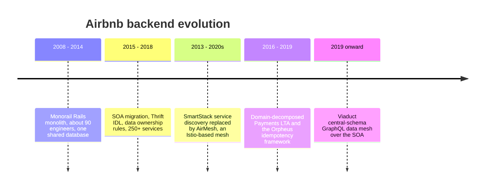
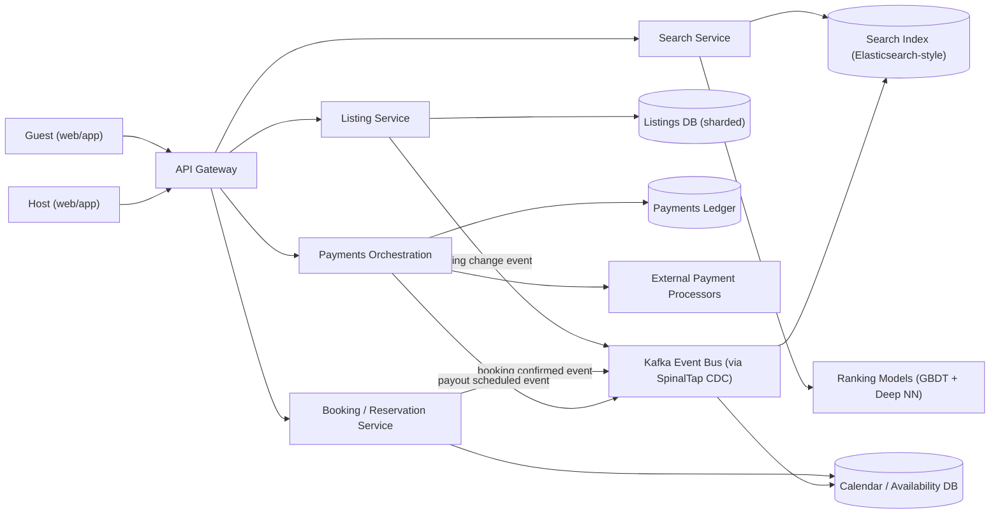
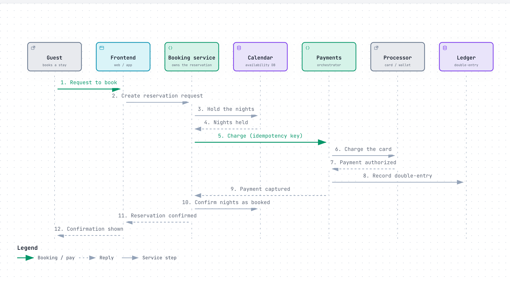
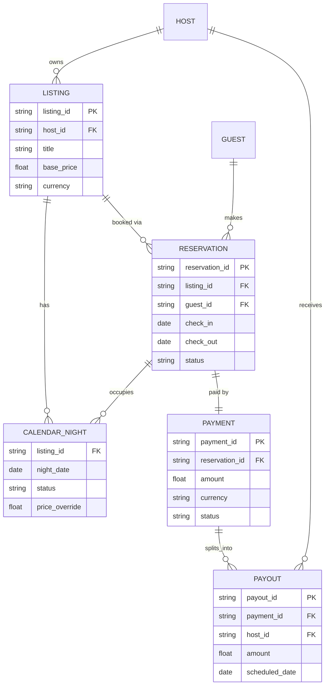
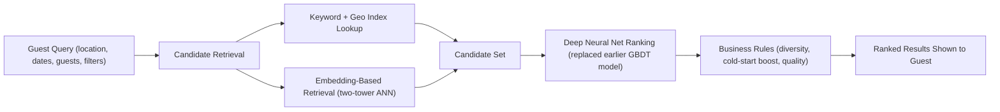
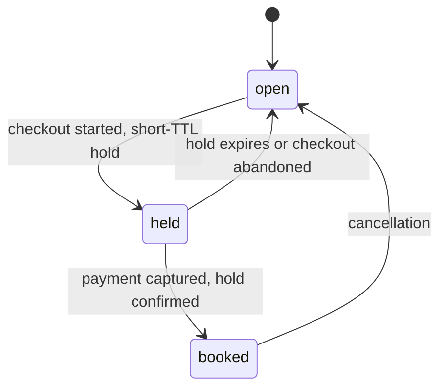

# Airbnb: How Airbnb Ranks Millions of Homes and Never Double-Books a Night

> **In 60 seconds:** Airbnb matches guests searching for a place to stay against millions of host
> listings, ranks results with a machine-learned model, and then has to get one thing perfectly right
> under concurrency: never let two guests book the same night on the same listing. A booking touches
> four systems in sequence — search (find candidates), availability (hold and confirm nights),
> payments (capture money from the guest and, days later, split and pay out the host), and a ledger
> (record who owes what). Airbnb used to run all of this out of one giant Ruby on Rails application
> ("Monorail"); as the company and engineering org grew, it split that monolith into hundreds of
> services organized as a service-oriented architecture (SOA), each owning its own data, talking over
> Thrift RPC and Kafka events.

**Last reviewed:** September 2026 · **Difficulty:** Advanced · **Reading time:** ~35 min

## Table of contents

- [Before you read: design it yourself](#before-you-read-design-it-yourself)
- [The problem](#the-problem)
- [Scale](#scale)
- [Back-of-the-envelope math](#back-of-the-envelope-math)
- [Requirements](#requirements)
- [How it evolved](#how-it-evolved)
- [High-level design](#high-level-design)
- [Low-level design](#low-level-design)
- [Deep dives](#deep-dives)
- [What happens when things break](#what-happens-when-things-break)
- [Key design decisions](#key-design-decisions)
- [Interview takeaways](#interview-takeaways)
- [Glossary](#glossary)
- [Sources](#sources)

## Before you read: design it yourself

Try each question for 5 minutes before reading the answer — the point is to feel where the hard part is, not to get it "right."

### Q1. How do you rank millions of listings against a search query in a few hundred milliseconds, when "the right room" depends on soft signals no keyword filter can capture?

<details>
<summary>Hint</summary>

Narrow candidates cheaply first, then spend expensive compute only on the survivors.

</details>

<details>
<summary>How Airbnb does it</summary>

Retrieval narrows millions of listings down via two parallel paths: a traditional keyword/geo index, and embedding-based retrieval (EBR) — a two-tower neural net mapping the query and each listing into the same vector space. Airbnb picked an IVF index over the more common HNSW specifically because IVF tolerates Airbnb's high rate of real-time listing updates better. Ranking itself evolved from a hand-written scoring function to a gradient-boosted tree model, then was replaced by a deep neural net once the tree model's gains plateaued, with explicit corrections for positional bias and cold start. Trade-off: two retrieval systems have to stay in sync and the ranking model has to be retrained and monitored, plus ongoing tuning to keep re-correcting for positional bias as ranking itself changes what guests click.

Deep dive: [Search & ranking](#search--ranking)

</details>

### Q2. How do you guarantee a scarce resource — one specific night, on one specific listing — is never sold twice, when the system that shows availability (search) is allowed to be seconds out of date?

<details>
<summary>Hint</summary>

What's the one authoritative check that has to run before money moves?

</details>

<details>
<summary>How Airbnb does it</summary>

Search is allowed to be eventually consistent — a stale listing just gets "no longer available" — but the Booking Service's hold against the Calendar/Availability DB is the one authoritative check, and it runs before any payment attempt. The natural way to make double-booking structurally impossible, not just unlikely, is a uniqueness constraint on `(listing_id, night_date)`, with a short-TTL `held` state between `open` and `booked` so an abandoned checkout releases the nights automatically. Whichever hold request lands first wins; the second gets a conflict and never reaches payment — nobody gets charged for nights they didn't get. Trade-off: a strongly-consistent partition can't use the cheap, eventually-consistent scaling tricks (aggressive caching, async propagation) the rest of the system relies on.

Deep dive: [Availability calendar](#availability-calendar)

</details>

### Q3. How do you move money for a booking across 191 countries and 70+ currencies — capture it from the guest and pay the host out days later — without ever double-charging or silently losing a dollar?

<details>
<summary>Hint</summary>

What has to happen, durably, before you call an external system that might time out?

</details>

<details>
<summary>How Airbnb does it</summary>

Every payment call goes through Orpheus, Airbnb's idempotency framework: durably record the intent to charge before calling the external processor, call it, then record the outcome — a timeout is safely retried against the same recorded intent instead of risking a second charge. The payments platform is domain-decomposed into pay-in, payout, ledger, and settlement subdomains so country/processor teams can ship independently across 24+ processor integrations. Every movement is recorded as an immutable, double-entry ledger entry, never an in-place balance update, so history and FX adjustments are always reconstructable. Trade-off: domain decomposition means any consumer wanting one simple "did this get paid" answer now has to query multiple services and reconcile the result itself.

Deep dive: [Booking & payments flow](#booking--payments-flow)

</details>

### Q4. What made a single Rails codebase — Monorail — that worked fine for years become the thing actively slowing the whole company down, and how do you split it without recreating the same coupling one network hop later?

<details>
<summary>Hint</summary>

Splitting the code isn't the hard part — what else has to split alongside it?

</details>

<details>
<summary>How Airbnb does it</summary>

At around 200 engineers, Monorail measured roughly 15 hours/week of average blocked-deploy time from reverts and rollbacks in one shared deploy queue — a measured number, not a vibe, is what justified the migration. Airbnb split into a service-oriented architecture (SOA, deliberately not pure microservices) with one core rule: each service owns its own database, and everyone else goes through its API — splitting code without splitting who can write which tables just moves the tangle one network hop over. Changes propagate asynchronously via Kafka fed by change-data-capture (SpinalTap), so a spike in one domain's load can't slow down another. Trade-off: cross-domain reads that used to be one SQL join now need an API call or a cache, and hundreds of independently-deployed services is a lot more to monitor and version.

Deep dive: [SOA migration from the Rails monolith](#soa-migration-from-the-rails-monolith)

</details>

## The problem

It's Friday night in Lisbon. A guest has narrowed a trip down to one listing — a loft with good
reviews, the right price, free next weekend — and taps **Reserve**. In the same instant, on the other
side of the world, a second guest taps **Reserve** on the exact same listing for the exact same
dates, because Airbnb's search index hasn't caught up with a change from ten seconds ago yet. Both
requests are now racing toward the same two nights on the same calendar. Get this wrong and either
two guests show up to one room, or a listing that was actually free gets rejected for no reason —
either way, someone's trip is ruined and Airbnb's trust with both sides of the marketplace takes the
hit.

That single race is the easy version of the problem. Zoom out, and Airbnb has to solve a harder,
compound version of it continuously: rank millions of listings against a query in a few hundred
milliseconds, hold a scarce, non-substitutable resource (a specific night, on a specific listing)
under concurrent demand with zero tolerance for error, move money for that booking across 191
countries and 70+ currencies without ever double-charging a guest, and pay a host out days later once
the trip has actually started — all while the underlying engineering org grew from about 90 engineers
to well over a thousand, on top of an architecture never designed for that scale.

This page answers three hard questions:

1. How do you rank millions of listings for a query in milliseconds, when "the right room" depends on
   dozens of soft signals (photos, reviews, price sensitivity, personal taste) that no keyword filter
   can capture?
2. How do you guarantee a scarce resource — one night, one listing — is never sold twice, when the
   system that shows availability (search) and the system that enforces it (booking) are allowed to
   disagree briefly by design?
3. What made a single Rails codebase, which worked fine for years, become the thing actively slowing
   the company down — and what did Airbnb replace it with, without ever stopping the business to do
   it?

## Scale

| Metric | Number | Source |
|---|---|---|
| Active listings | ~8M (2025); 9.5M+ (2026) | [15](#sources) *(third-party)* |
| Active users | ~275–290M (2024–2025) | [15](#sources) *(third-party)* |
| Nights + Experiences booked | 393.7M (2022) | [15](#sources) *(third-party)* |
| Countries/regions with listings | 220+ | [15](#sources) *(third-party)* |
| Payment countries supported | 191 | [10](#sources) |
| Currencies supported | 70+ | [10](#sources) |
| Payment processor routes | 24+ ("over two dozen") | [10](#sources) |
| Local payment methods shipped | 20+ new methods in 14 months, out of 300+ identified globally (e.g. Pix, Naver Pay) | [12](#sources) |
| Engineers (2014 → 2018) | ~90 → ~1,000 | [4](#sources) |
| Services deployed via the SOA IDL framework (2018) | 250+ | [4](#sources) |
| Weekly production deploys (2017 → 2018) | ~3,000 → ~10,000 (roughly one per minute) | [4](#sources) |
| Blocked-deploy time on Monorail (2015, ~200 engineers) | ~15 hours/week average, from reverts/rollbacks | [4](#sources) |

Only numbers a source states. A few are worth sitting with: 393.7 million nights and experiences booked
in a single year (2022) is about 750 a minute, around the clock — each one needing the search-to-payment
pipeline below to work correctly. And "~15 hours a week of blocked deploys" doesn't sound like much
until you multiply it by 200+ engineers all sharing one deploy queue — that's not a slow week, that's
the whole engineering org's forward progress stalled for two work-days out of five, every single week,
which is the number that actually forced the SOA migration described below.

## Back-of-the-envelope math

Back-of-the-envelope math is the rough, order-of-magnitude arithmetic engineers do on a whiteboard to size a system before building it — not a precise forecast. Inputs marked with a [n] reference are pulled straight from this page's Scale table; everything else is a labeled `Assumption:` used purely for illustration.

### Booking write throughput

**Question:** How many bookings per second does the availability system actually need to handle?

**Inputs:**
- Nights + Experiences booked: 393.7M (2022) [15](#sources) *(third-party)*
- Assumption: peak traffic ≈ 2-3x daily average (use 3x)

**Math:**
```text
avg_per_day = 393,700,000 / 365
            ≈ 1,078,630 bookings/day

avg_per_sec = 1,078,630 / 86,400
            ≈ 12.48 bookings/sec

peak (3x)   = 12.48 * 3
            ≈ 37.4 bookings/sec
```

**Answer:** ~12-13 bookings/sec average, ~35-40/sec at peak.

**What it tells you:** at a low double-digit per-second write rate, "never double-book a night" is a correctness problem under concurrency, not a raw-throughput one — a single well-designed exclusion constraint per listing-night handles this volume easily. The hard part, covered in [Availability calendar](#availability-calendar), is guaranteeing correctness while search is allowed to run seconds stale, not keeping up with the write rate itself.

### Memory footprint of the listing-embedding search index

**Question:** How big is the in-memory index the ranking pipeline searches against for every query?

**Inputs:**
- Active listings: 9.5M+ (2026) [15](#sources) *(third-party)*
- Assumption: embedding dimension = 128 floats (typical two-tower model output size)
- Assumption: 4 bytes per float32 value

**Math:**
```text
bytes_per_listing = 128 floats * 4 bytes
                   = 512 bytes

total_index_size  = 9,500,000 listings * 512 bytes
                   = 4,864,000,000 bytes
                   ≈ 4.86 GB
```

**Answer:** ~4.9 GB for the full listing-embedding index.

**What it tells you:** an index of just a few gigabytes fits comfortably in memory on a single modern server, so approximate-nearest-neighbor latency isn't a storage-size problem here — which is why the choice between IVF and HNSW in [Search & ranking](#search--ranking) comes down to how well each handles frequent listing updates, not raw memory savings.

### Deploy-queue blocked time as a share of the work week

**Question:** How much of the shared engineering week did ~15 blocked-deploy hours (2015) actually cost?

**Inputs:**
- Blocked-deploy time on Monorail (2015, ~200 engineers): ~15 hours/week average [4](#sources)
- Assumption: standard work week = 40 hours

**Math:**
```text
blocked_fraction = 15 hours / 40 hours
                  = 0.375
                  = 37.5%
```

**Answer:** ~37.5% of the work week — roughly 2 out of 5 workdays — the shared deploy pipeline was unusable company-wide.

**What it tells you:** that's not one team's annoyance, it's a company-wide stall more than a third of every week — the concrete number the page itself cites as what actually forced the [SOA migration](#soa-migration-from-the-rails-monolith).

### Payment-country vs. listing-country coverage gap

**Question:** How much does payments infrastructure lag behind listings when it comes to country coverage?

**Inputs:**
- Countries/regions with listings: 220+ [15](#sources) *(third-party)*
- Payment countries supported: 191 [10](#sources)

**Math:**
```text
coverage_ratio = 191 / 220
               ≈ 0.868
               ≈ 86.8%

gap            = 220 - 191
               = 29 countries (≈13.2% of listing countries)
```

**Answer:** ~87% payment-country coverage relative to listing countries, leaving roughly 29 countries (~13%) without full localized payment support.

**What it tells you:** that gap is exactly why the page describes "300+ local payment methods identified, only 20+ shipped in 14 months" as ongoing work rather than a solved problem — payments coverage structurally lags listings coverage. See [Booking & payments flow](#booking--payments-flow).

### Rules of thumb used

| Rule of thumb | Value |
|---|---|
| 1 day | ~86,400 s ≈ 10^5 s |
| 1 year | ~365 days |
| Peak vs. average traffic | ~2-3x, for a typical consumer app |

These are general estimation conventions, not Airbnb-specific facts.

## Requirements

**Functional:**
- Guests can search listings by destination, date range, guest count, price, and amenity filters, and get a ranked list of results.
- Guests can open a listing, see real availability for a date range, and book it.
- Booking captures payment from the guest (card, wallet, local payment method) at or after confirmation.
- Hosts receive a payout, in their local currency, after Airbnb's service fee and any taxes are deducted — days after guest check-in, not at the moment of booking.
- Hosts can block/unblock nights, change nightly price per date, and sync availability so the same night is never sold on two different channels.
- Two guests must never both end up with a confirmed reservation for the same night on the same listing.

**Non-functional:**
- **Search:** hundreds of milliseconds end-to-end for a query against millions of listings; the
  search index can lag reality by seconds (eventual consistency) — a listing that just got booked can
  briefly still show up in search. *Why it matters: guests will tolerate a slightly stale price or an
  occasional "sorry, just booked" click-through far more than they'll tolerate a slow search page —
  latency is the metric guests actually feel on every single interaction.*
- **Availability/booking:** strong consistency required — this is the one place the system cannot be
  "eventually correct." A night can be held by at most one in-flight checkout, and confirmed by at
  most one reservation. *Why it matters: this is the one guarantee that, if it silently breaks, turns
  into an actual person standing outside a locked door with nowhere to sleep — there is no "eventually
  consistent" version of that experience that's acceptable.*
- **Payments:** correctness over speed. Every payment operation must be idempotent (retrying a failed
  request must never charge twice) and auditable (every dollar must be traceable through a ledger).
  *Why it matters: an extra 200ms on a charge is invisible to a guest; a duplicate charge is a
  chargeback, a support ticket, and a broken trust relationship that no amount of ranking-model
  polish can repair.*
- **Availability for booking/payment paths** is prioritized over availability for search — guests can
  tolerate a slightly stale search result, they cannot tolerate a double-booked reservation or a
  duplicate charge. *Why it matters: not all downtime is equal — a search outage loses browsing
  sessions, a booking-path outage loses trips people already committed to, which is a much deeper
  breach of trust.*
- Global scale: multiple currencies, multiple payment processors per country, multiple
  languages/time zones. *Why it matters: a payments platform that only works for one country's rules
  (settlement times, tax withholding, allowed payment methods) doesn't scale to a company operating in
  191 of them — this requirement alone is what forced payments into its own domain-decomposed
  platform, below.*

## How it evolved

Airbnb started, like most companies, with the simplest thing that could work — one Rails app, one
database, one team who all understood the whole codebase. Growth broke that in a specific,
well-documented order:

| Era | What existed | What broke | What replaced it | Source |
|---|---|---|---|---|
| 2008–2014 | **Monorail**: one Ruby on Rails monolith, one shared database, ~90 engineers who could each reasonably understand the whole system | Nothing yet — this was the right architecture for the team size | — | [4](#sources) |
| ~2015 | Monorail, now with 200+ engineers, ~200 commits/day | Modules had grown "too many responsibilities" and become tangled together; one message-handling module alone had 400+ contributors and thousands of lines; the team measured **~15 hours a week of average blocked-deploy time** from reverts and rollbacks — a shared deploy queue where one team's bad commit stalls everyone's releases | Data-ownership rules and a formal service-oriented architecture (SOA) migration begins | [4](#sources) |
| 2015–2018 | SOA migration in progress: services get their own databases, talk over **Thrift**-defined RPC, publish changes as Kafka events via CDC | A single shared database had made every team's reliability dependent on every other team's queries; cross-team changes required coordinating a shared codebase | By 2018: 250+ services on the SOA IDL framework, ~1,000 engineers, weekly deploys grown from ~3,000 to ~10,000 — roughly one *per minute* | [4](#sources), [5](#sources) |
| 2013 onward | **SmartStack**: Airbnb's homegrown service-discovery system (built in 2013, before hundreds of services existed) | Worked, but became an increasing maintenance burden as the service count grew into the hundreds — a hand-rolled system now competing with a mature open-source ecosystem | **AirMesh**, an Istio-based service mesh, migrated in over multiple years to carry the majority of production traffic | [8](#sources) |
| 2016–2019 | A single, less-decomposed payments codebase, and ad hoc retry logic around external processor calls | Airbnb's global footprint (191 countries, 70+ currencies, 24+ processor integrations) meant one payments service couldn't let country/processor teams ship independently; ad hoc retries around non-idempotent external calls risked real double-charges | **Payments LTA** (domain-decomposed: pay-in, payout, ledger, settlement) and the **Orpheus** idempotency framework, layered on top | [10](#sources), [12](#sources), [13](#sources) |
| 2019 onward | Hundreds of independent services, each with its own API, that client engineers had to individually discover and learn to call | Client-side engineers now needed to know *which of hundreds of services* to call for any given piece of data — the SOA migration had traded a monolith's tangle for a different kind of integration tax | **Viaduct**: one central GraphQL schema over the SOA, served by a shared multi-tenant runtime where backend teams own a *module* of the schema rather than a whole server | [6](#sources), [7](#sources) |
| Later | Payments data fragmented correctly, but *by design*, across pay-in/payout/ledger/settlement services | Any consumer wanting "did this reservation get paid" had to query multiple services and reconcile the answer itself | **Unified Payments Data Read**: one read API composing the domain-decomposed services behind it | [14](#sources) |



The throughline across every row: nothing here was replaced pre-emptively. Airbnb kept the simple
version — one Rails app, one payments codebase, a hand-rolled service mesh — until a specific,
measurable pain point (15 hours/week of blocked deploys; can't ship payments features per-country;
client engineers drowning in service-discovery tax) forced the next layer of complexity. That's the
general shape most large systems' histories take, and it's worth naming explicitly: the "how it
evolved" story is really a story of *deferred* complexity, paid for only once growth made the simple
version actively wrong.

## High-level design



Walking through it:

1. Both guests and hosts hit the same **API gateway**, which routes to whichever backend service owns the request — this is the entry point Airbnb built as part of the SOA migration, replacing direct calls into the Rails monolith [4](#sources).
2. **Search Service** answers "what listings match this query" by combining a fast candidate lookup against a **search index** with a **ranking model** (originally hand-tuned, later gradient-boosted trees, now a deep neural network) [1](#sources), [2](#sources).
3. **Listing Service** owns listing metadata (title, photos, house rules, base price) in its own sharded database — under Airbnb's SOA rules, only this service is allowed to write to that data; everyone else reads it through an API [4](#sources), [9](#sources).
4. **Booking Service** owns the reservation lifecycle and talks to the **Calendar/Availability DB**, which is the source of truth for which nights are open, held, or booked for a listing.
5. **Payments Orchestration** is its own domain-decomposed platform (pay-in, payout, ledger, settlement subdomains) that captures the guest's money, records it in an append-only **ledger**, and later triggers a **payout** to the host, going through **external payment processors** per country [10](#sources), [11](#sources), [12](#sources).
6. Changes don't call each other synchronously where they don't have to — a **Kafka event bus**, fed by change-data-capture tooling, propagates "listing changed" or "booking confirmed" events so the search index and calendar caches update asynchronously without coupling every service to every other service [4](#sources), [9](#sources).

## Low-level design

### 1. Core booking flow

<a href="https://alwintwk.github.io/big-tech-system-design/diagrams/companies-airbnb-booking.html">
  <picture>
    <source media="(prefers-color-scheme: dark)" srcset="../diagrams/companies-airbnb-booking.dark.png">
    
  </picture>
</a>

<sub>Click the diagram for the interactive version (zoom, dark mode, trace a path).</sub>

The two steps that matter most for correctness:

- **Hold before charge.** The Booking Service asks the Availability service to hold the nights *before* money moves. If the hold fails (someone else already has those nights, or already confirmed a booking), the flow stops before any payment attempt — nobody gets charged for a stay they can't actually get.
- **Idempotency key on the payment call.** Every payment request carries an idempotency key. Airbnb's `Orpheus` framework splits each payment call into a pre-RPC phase (record intent in a sharded database), the RPC phase itself (call the external processor, no DB writes), and a post-RPC phase (record the result), classifying failures as retryable or non-retryable. Retrying a timed-out request replays against the recorded intent instead of charging again. Airbnb reports this got them to "five nines" of payment consistency while payment volume kept growing [13](#sources).

### 2. Data model



`CALENDAR_NIGHT` is the row that actually prevents double-booking: one row per `(listing_id, night_date)`, with a status of `open`, `held` (mid-checkout), or `booked`. Airbnb has not published how its calendar data is partitioned; its 2015 database post describes vertically partitioning tables by application function (the message inbox) off the main database [9](#sources), and a separate calendar partition here is a reference-design assumption (unverified). The keys are chosen deliberately: `CALENDAR_NIGHT` is keyed on `(listing_id, night_date)` rather than on `reservation_id` because the invariant that must hold is per-night, not per-reservation — a database-level uniqueness or exclusion constraint on that compound key is what makes "two confirmed reservations for the same night" structurally impossible rather than merely unlikely. `PAYMENT` sits between `RESERVATION` and `PAYOUT` as its own row (rather than folding payout fields directly onto the reservation) because a single payment fans out into potentially several payouts over time — a host's earnings for a long stay, for instance, or a payout that's split after a later adjustment.

> **Note — simplified reference design.** Airbnb has not published the exact current schema or locking mechanism for the calendar. What *is* public is that (a) Airbnb prefers vertical partitions by application function (its 2015 example was the message inbox, not the calendar) [9](#sources), and (b) the SOA's data-ownership rule means only the owning service may write its data [4](#sources). The concurrency mechanism shown here — one row per listing-night, moved through `open → held → booked` inside a single transaction (or with a short-TTL hold) — is a standard reference pattern for this class of problem (equivalent to a unique constraint or exclusion constraint on `(listing_id, night_date)` for confirmed bookings), not a confirmed description of Airbnb's internals.

### 3. Search ranking pipeline



- **Retrieval** narrows millions of listings down to a candidate set two ways: a traditional keyword/geo/availability filter, and, more recently, **embedding-based retrieval (EBR)** — a two-tower neural network that encodes the query (location, guest count, stay length) and each listing (amenities, engagement, capacity) into vectors in a shared space, trained with contrastive learning on which listings users actually booked versus ones they saw but did not book. For serving, Airbnb chose an inverted-file-index (IVF) approach over HNSW because IVF handles the high rate of real-time listing updates better [3](#sources).
- **Ranking** started as a hand-written scoring formula, then moved to a **gradient boosted decision tree (GBDT)** model — "one of the largest step improvements in homes bookings in Airbnb's history" — and later to a **deep neural network** once the GBDT's gains plateaued [1](#sources).
- The 2020 follow-up paper describes three further problems they had to solve to keep improving the DNN: evolving the network architecture past a simple fully-connected two-layer net, correcting for **positional bias** (a listing ranked #1 gets more clicks partly *because* it's #1, which can poison training data if not corrected for), and handling **cold start** for brand-new listings with no booking history [2](#sources).

### 4. Availability state machine

> Note: simplified reference design, same caveat as the data model above — Airbnb hasn't published
> the exact state machine for a calendar night. This is the standard shape a system with this
> requirement takes, not a confirmed internal diagram.



The detail that matters is the `held` state's short time-to-live (TTL). Without it, a guest who starts
checkout and then abandons the tab would permanently lock those nights out of inventory — so a hold
is only valid for a short window, long enough to complete payment, short enough that an abandoned
checkout releases the nights back to `open` on its own without any human or cleanup job having to
intervene.

## Deep dives

### Search & ranking

**What it is:** the pipeline that turns "2 guests, Lisbon, next weekend" into an ordered list of
listings — retrieval to find candidates, then a multi-stage model to rank them [1](#sources),
[2](#sources), [3](#sources).

**The problem it solves:** a keyword and geo filter alone can narrow millions of listings down to
thousands that technically match, but it has no way to express "which of these a guest would actually
want to book" — that depends on soft signals (photo quality, host responsiveness, price relative to
similar listings, a guest's own past behavior) that no filter query captures.

**How it works inside:** retrieval runs two parallel paths — a traditional index lookup, and
embedding-based retrieval (EBR), where a two-tower neural network maps the query and every listing
into the same vector space so "similar" can mean geometric closeness rather than exact keyword
overlap. Airbnb picked an IVF index over the more common HNSW specifically because IVF tolerates
Airbnb's real-time listing-update rate better [3](#sources) — a reminder that the "best" ANN
algorithm on a benchmark isn't necessarily the best one for a specific write pattern. Ranking has
evolved over time: a gradient-boosted tree model first replaced a manual scoring function ("one
of the largest step improvements in homes bookings" [1](#sources)), then a deep neural network replaced
the tree model once its gains plateaued. The 2020 paper is candid about what actually made
the DNN work in production, beyond just "add more layers": correcting for positional bias (a
listing's rank itself inflates its click rate, which left uncorrected teaches the model that rank
*causes* quality) and handling cold start (a brand-new listing has no booking history for the model to
learn from; Airbnb first tried an explicit ranking boost for new listings, then reframed the problem as
predicting a new listing's missing engagement features)
[2](#sources).

> **Why this matters:** the GBDT-then-DNN evolution, and the explicit positional-bias
> correction, generalize to almost any ranking system with human feedback loops (recommendation
> feeds, ad ranking, search of any kind) — anywhere a model's own output influences the data it's
> later trained on.

**What it costs:** retrieval now runs two systems (keyword/geo index and a learned embedding index)
that both have to stay in sync with the same underlying listing data, and a deep ranking
model has to be retrained and monitored — plus an explicit,
ongoing engineering cost to keep re-measuring and re-correcting for positional bias as ranking itself
changes what guests click on.

### SOA migration from the Rails monolith

**What it is:** the multi-year effort to split Monorail, Airbnb's original Rails application, into
hundreds of independently deployable services, each responsible for one business domain, each owning
its own data [4](#sources), [5](#sources).

**The problem it solves:** a monolith's core promise — one codebase everyone can reason about — stops
being true once too many people touch it at once. By around 2015, at roughly 200 engineers, Airbnb
was measuring **~15 hours a week of average blocked-deploy time**, caused by reverts and rollbacks in
a shared deploy queue where anyone's broken commit could stall everyone's releases; one shared
message-handling module had grown to over 400 contributors and thousands of lines, past the point any
individual engineer could hold its behavior in their head [4](#sources).

**How it works inside:** Airbnb explicitly describes what it built as **SOA**, not microservices — a
deliberate distinction. Pure microservices pushes toward small, single-purpose, independently owned
services with minimal shared code; Airbnb's SOA kept more shared libraries and coarser service
boundaries, prioritizing a smaller number of well-defined domains over the smallest possible service
per team. The rule that mattered most in practice was **data ownership**: each service owns its own
database, and no other service is allowed to query it directly — everyone else goes through that
service's API. Services describe their interfaces with **Thrift**, an interface-definition language
(IDL) that auto-generates client and server code in multiple languages, so two teams never have to
hand-write the RPC plumbing between their services. Changes propagate asynchronously wherever
possible: **SpinalTap**, Airbnb's change-data-capture (CDC) tool, watches a service's database write
log and turns each row change into a Kafka event, so a listing update reaches the search index and
other downstream consumers without the Listing Service needing to know who's listening or call them
directly [4](#sources), [5](#sources). By 2018 this had scaled to 250+ services on the SOA IDL
framework, supporting roughly 1,000 engineers and a jump from ~3,000 to ~10,000 weekly production
deploys — about one deploy every minute, org-wide [4](#sources).

```
# Illustrative shape of the data-ownership rule, not real Airbnb code:
service ListingService:
    owns table: listings
    exposes: get_listing(id), update_listing(id, fields)
    # no other service may run SQL against `listings` directly

service BookingService:
    # wants listing details for a reservation -> must call the API, not join the table
    listing = ListingService.get_listing(reservation.listing_id)
```

> **Why this matters:** the "data ownership, not just code ownership" rule is the part of this
> migration most worth remembering for an interview — splitting code into services without also
> splitting *who's allowed to write which tables* just recreates the monolith's coupling problem one
> network hop later.

**What it costs:** cross-domain reads that used to be a single SQL join (say, "show me a booking with
its listing's title and photos") now require an API call or a cache, and consistency across service
boundaries becomes an application-level concern instead of something a single database transaction
guarantees for free. Operationally, hundreds of independently deployed services is hundreds of things
to monitor, version, and keep compatible — which is exactly the tax that later motivated both AirMesh
(service mesh, below) and Viaduct (a unifying data layer, below).

### Booking & payments flow

**What it is:** the sequence that turns a guest's tap on **Reserve** into a held night, a captured
payment, a ledger entry, and — days later — a payout to the host, spanning Airbnb's
domain-decomposed payments platform: pay-in, payout, ledger, and settlement as separate subdomains
[10](#sources), [11](#sources), [12](#sources).

**The problem it solves:** a booking is not one atomic operation — it's a chain of at least three
things (hold a scarce resource, move real money, notify another party who gets paid later) that each
have their own failure modes, running across services and external payment processors that don't
share a database and can't participate in one distributed transaction. And it has to work the same
way, correctness-wise, whether the guest is paying in US dollars via card or in a country where the
dominant payment method is a local bank redirect that settles days later.

**How it works inside:** the flow deliberately holds nights *before* it moves money — if the
Availability service rejects the hold (someone else already has those nights), the flow stops before
any payment attempt runs, so a guest is never charged for a stay they didn't actually get. Once the
hold succeeds, the payment call goes through **Orpheus**, Airbnb's idempotency framework, which splits
every payment call into three phases: a pre-RPC phase that durably records the intent to charge
*before* calling out anywhere, the RPC phase itself (call the external processor, deliberately no
database writes during this window so a timeout mid-call doesn't leave a half-written record), and a
post-RPC phase that records the outcome. Every failure gets classified as retryable or
non-retryable — a network timeout is safe to retry against the same recorded intent (using the same
idempotency key so the processor recognizes it as the same logical request rather than a new charge);
a card decline is not something retrying will fix. Airbnb reports this pattern took them to "five
nines" of payment consistency even as raw payment volume kept growing [13](#sources). Because Airbnb
operates in 191 countries with 70+ currencies and over two dozen distinct processor integrations
[10](#sources), the payments platform itself is split into **pay-in** (getting money from the guest),
**payout** (sending money to the host, on a delay tied to check-in, in the host's local currency,
after fees and taxes), **ledger** (the append-only, double-entry record of every movement — see the
data model above), and **settlement** (reconciling what actually cleared with each external processor)
as separate subdomains, each able to ship country-specific logic independently [10](#sources),
[12](#sources).

> **Why this matters:** the pattern "durably record intent, then call the unreliable external system,
> then record the outcome, with idempotency keys carried through all three steps" is the general
> shape of *every* safe integration with a payment processor, shipping carrier, or any other
> non-idempotent third-party API — not just Airbnb's.

**What it costs:** domain decomposition solved the "191 countries can't share one payments codebase"
problem, but it created a new one: any consumer wanting a single, simple answer to "did this
reservation get paid?" now has to query multiple independently-owned services and reconcile the
result itself. That specific pain is what later motivated the **Unified Payments Data Read** project —
one composed read API sitting in front of the domain-decomposed services, so consumers get one
answer without needing to know the underlying decomposition [14](#sources).

### Availability calendar

**What it is:** the system of record for which nights, on which listings, are open, held mid-checkout,
or confirmed booked — the one place in the whole architecture where Airbnb cannot tolerate "eventually
consistent."

**The problem it solves:** search and browsing can lag reality by seconds without real harm — a guest
clicking through to a listing that got booked ten seconds ago just sees a "no longer available"
message and picks another. But the moment a guest is far enough into checkout to actually commit money,
the system answering "is this still free" has to be right, every time, even when two checkouts for the
same nights are racing each other in parallel across different servers.

> Note: simplified reference design. Airbnb has not published how its calendar data is stored or
> partitioned (its public partitioning post covers the message inbox, not the calendar [9](#sources)),
> nor the exact schema, locking primitive, or hold-TTL mechanism.
> Everything below, including "it's its own partitioned domain", is a standard reference
> pattern for this class of problem, not a description of Airbnb's actual production internals.

**How it works inside (reference design):** the natural way to make "two confirmed bookings for the
same night" structurally impossible, rather than merely unlikely, is a uniqueness constraint at the
data layer — one row per `(listing_id, night_date)`, and a database-enforced rule that at most one
`booked` row can exist per key. A short-TTL `held` state sits between `open` and `booked` specifically
to cover the checkout window: long enough to complete a payment, short enough that an abandoned tab
releases the nights back to inventory automatically rather than needing a human or a cleanup job to
notice. Because this table is the one place strong consistency is non-negotiable, it's kept as its
own partitioned domain, separate from the higher-traffic-but-lower-stakes search index and listing
metadata that can afford to be eventually consistent (reference design, unverified).

> **Why this matters:** this is the clean, general version of a very common interview question — "how
> do you prevent two people from getting the same scarce resource" (a concert seat, a hotel room, an
> inventory unit) — and the answer is almost always some version of the same shape: hold before you
> commit, make the final commit an operation the database itself refuses to duplicate, and expire
> holds automatically so an abandoned attempt doesn't permanently lock the resource.

**What it costs:** a strongly-consistent partition is, by construction, harder to scale horizontally
than an eventually-consistent one — you can't just cache it aggressively or serve slightly-stale reads
the way search can. It also means this one domain gets special-cased in the architecture: everything
else in the SOA can lean on asynchronous, eventually-consistent propagation via Kafka; the calendar
cannot, and has to accept the operational cost of staying strongly consistent under load instead.

### Data mesh: Viaduct

**What it is:** a central-schema GraphQL layer sitting on top of the entire SOA, giving client engineers
one schema to query against instead of needing to know which of hundreds of backend services owns any
given piece of data [6](#sources), [7](#sources).

**The problem it solves:** the SOA migration solved the monolith's coupling problem, but it introduced
a different one: a client engineer building a single screen (say, a reservation confirmation page
showing listing photos, host name, and payment status) now had to know that data lives across the
Listing Service, the Booking Service, and the Payments platform, and write client-side code to call
each one and stitch the results together. Multiply that by hundreds of services and every new feature
pays an integration tax just to gather data that conceptually "belongs together" on one page.

**How it works inside:** rather than one team owning a monolithic GraphQL server (which would just
recreate the original monolith's bottleneck, one layer up), Viaduct is a shared multi-tenant runtime (Airbnb contrasts it with GraphQL Federation, which
distributes servers; Viaduct distributes modules) — each
backend team owns a *module* of the overall schema, contributing the types and resolvers for the data
their service owns, without needing write access to anyone else's module or knowledge of how the
schema is assembled as a whole. A client then issues one GraphQL query naming the fields it wants
across what were previously several service boundaries, and the runtime runs the owning modules'
resolvers and stitches the response back together [6](#sources), [7](#sources).

> **Why this matters:** this is a recognizable, reusable pattern for any organization that has
> successfully split a monolith into services and then discovered that client-side data-fetching
> complexity simply moved rather than disappeared — federate the *query* layer without re-centralizing
> *ownership* of the underlying data or the code that serves it.

**What it costs:** a central schema is still one shared, central *runtime* — even though the code
behind each module stays decentralized, schema-level conflicts (two teams wanting to name or shape a
field differently) now need centralized resolution, and the Viaduct runtime itself becomes a new
piece of critical shared infrastructure that every client query passes through.

## What happens when things break

**Two guests race to book the same night.** This is the everyday version of the failure mode, not an
edge case — search's eventual consistency means it happens constantly. The design choice that saves it
is that *search being stale is allowed, availability being wrong is not*: the Booking Service's hold
request against the Calendar/Availability DB is the one authoritative check in the whole flow, and it
runs *before* any payment attempt. Whichever request's hold lands first wins; the second gets a
conflict response and never reaches the payment step at all — nobody gets charged for nights they
didn't get.

**A payment processor call times out mid-charge.** Because Orpheus durably records the intent to
charge *before* making the external call, a timeout doesn't leave the system guessing whether money
moved. The retry replays against the same recorded intent with the same idempotency key, so the
processor either safely replays a cached result or the call genuinely runs exactly once — the design
explicitly classifies this as a retryable failure, distinct from (say) a card decline, which is not
[13](#sources).

**A guest's checkout tab is abandoned mid-hold.** Without a hold-expiry mechanism, an abandoned
checkout would permanently remove those nights from inventory — a slow leak that, at scale, would
quietly shrink available supply over time. The short-TTL design on the `held` state (see the
[availability calendar deep dive](#availability-calendar)) means an abandoned hold releases itself
back to `open` automatically, with no cleanup job or human intervention required.

**One service in the SOA goes down or degrades.** This is the direct payoff of the data-ownership
rule: because each service owns its own database and no other service queries it directly, a slowdown
or outage in, say, the Search Service doesn't take down the Booking Service's ability to confirm an
already-in-progress reservation — the failure is contained to the domain that owns it, rather than
cascading through a shared database the way a monolith's single point of contention would. The
trade-off (see [key design decisions](#key-design-decisions)) is that this containment isn't free: a
feature that needs data from two domains has to handle the *other* domain being unavailable
explicitly, rather than getting an all-or-nothing single-database transaction.

**A host's external calendar sync is delayed or fails.** Hosts who list on multiple platforms rely on
calendar sync (iCal-style feeds) to keep Airbnb's availability matching what's blocked elsewhere.
Airbnb's architecture treats its own `CALENDAR_NIGHT` state as authoritative for bookings made
*through* Airbnb — an external sync delay can cause a host to see a stale external calendar, but it
cannot cause two Airbnb guests to both get a confirmed reservation for the same internal night, since
that guarantee lives entirely inside Airbnb's own strongly-consistent partition, independent of how
promptly an external feed updates.

**A shared deploy queue turns one bad commit into an org-wide slowdown.** This isn't a hypothetical —
it's the exact, measured failure mode (~15 hours/week of blocked deploys at ~200 engineers) that
forced the SOA migration in the first place [4](#sources). The fix wasn't better rollback tooling on
the monolith; it was removing the shared queue as a single point of failure by giving each service its
own independent deploy pipeline, so one team's broken commit can only block that team.

**The embedding index used for search retrieval falls behind real-time listing changes.** This is the
exact risk that shaped the choice of ANN algorithm in the first place: Airbnb picked an inverted-file
(IVF) index over the more common HNSW specifically because IVF tolerates a high rate of real-time
updates better [3](#sources). Even so, retrieval runs two parallel paths — the traditional keyword/geo
index alongside embedding-based retrieval — so a temporarily stale embedding index degrades ranking
*quality* for the affected listings rather than making them vanish from results entirely; the
keyword/geo path still surfaces them. This is a case where the failure mode is designed to degrade
gracefully (worse ranking) rather than catastrophically (missing results), precisely because search is
the one part of the pipeline explicitly allowed to be eventually consistent.

**A cross-border payment settles at a different exchange rate than it was charged at.** Because Airbnb
holds funds and pays hosts out days after check-in — potentially in a different currency than the
guest was charged in — a real-world exchange-rate move between charge and payout is an inherent risk
of the "pay in guest currency, payout in host currency, settle later" model, not a bug. The
append-only ledger (see [the data model](#2-data-model) and the [ledger discussion](#booking--payments-flow))
is what makes this tractable rather than a silent discrepancy: because every movement is an immutable,
timestamped entry rather than an in-place balance update, an FX adjustment is recorded as its own
explicit entry rather than requiring anyone to guess, after the fact, what the "original" amount
should have been.

> Note: this last scenario is presented as a reasonable consequence of Airbnb's documented, delayed,
> multi-currency payout model [10](#sources), [12](#sources) — Airbnb has not published the specific
> mechanics of how an FX adjustment is booked internally, so treat the ledger-entry framing as a
> reference design, not a confirmed implementation detail.

## Key design decisions

| Decision | Why | Trade-off |
|---|---|---|
| Split Monorail into a service-oriented architecture, not pure microservices | Rails monolith caused ~15 hours/week of blocked deploys from reverts/rollbacks as engineering scaled from ~90 (2014) to ~1,000 (2018) people; SOA (shared data-owning services, not one-service-per-team-forever) let teams deploy independently while still reusing common business logic [4](#sources), [5](#sources) | More operational surface area (hundreds of services to run, monitor, and version) and cross-service consistency becomes an application-level problem instead of a single-database transaction |
| Each service owns its own data (data-ownership principle) | Prevents the "everyone reads and writes everyone's tables" tangle that made the monolith fragile [4](#sources) | Reads that need data from two domains (e.g., "show me a booking with its listing details") now need an API call or a caching layer instead of a SQL join |
| Kafka event bus fed by change-data-capture (SpinalTap) instead of synchronous cross-service calls for propagating changes | Keeps services loosely coupled; a spike in search-indexing load shouldn't be able to slow down booking [4](#sources), [5](#sources) | Search index and calendar caches are only eventually consistent with the source of truth — a booking can very briefly still appear available in search |
| Idempotency framework (Orpheus) on every payment call instead of database 2PC across services | Payments span internal services *and* external processors that don't support distributed transactions; idempotency keys + retryable/non-retryable classification give exactly-once *effect* on top of Kafka's at-least-once delivery [13](#sources) | Extra bookkeeping table and pre/post-RPC phases on every payment call; more code than "just retry and hope" |
| Append-only, double-entry-style payments ledger | Financial data must be auditable and reconstructable; mutating a balance in place loses history [10](#sources) | More storage, and reads that want "current balance" must aggregate rather than read one row |
| Domain-decomposed payments platform (pay-in, payout, ledger, settlement as separate subdomains) instead of one payments service | Airbnb operates in 191 countries with 70+ currencies and two dozen-plus processor integrations — a monolithic payments service couldn't let country/processor teams ship independently [10](#sources), [12](#sources) | More services to coordinate for a single "did this reservation get paid" answer; motivated the later "unified payments data read" project to give consumers one read API instead of many [14](#sources) |
| Service mesh evolution: SmartStack → AirMesh (built on Istio) | Homegrown service discovery (SmartStack, 2013) worked but became a maintenance burden at hundreds of services; adopting Istio-based AirMesh let Airbnb get mesh features (routing, retries, mTLS) from an ecosystem instead of hand-rolling them | Migrating >90% of production traffic to a new mesh is itself a multi-year project with its own latency-tuning work (e.g., propagation delay) [8](#sources) |
| Data-oriented service mesh (Viaduct, GraphQL) on top of the SOA | Hundreds of services meant client engineers had to know which of many services to call for what; Viaduct gives one central GraphQL schema where teams own a *module*, not a whole server [6](#sources), [7](#sources) | A single shared runtime is a new central dependency; schema conflicts between teams must be resolved centrally even though code is decentralized |
| Availability held as a strongly-consistent partition, separate from eventually-consistent search | The one invariant that can never be violated (no double-booking) needs to be isolated from the parts of the system that can tolerate staleness, so it can be reasoned about and scaled differently (reference design; Airbnb has not published its calendar partitioning) | This partition can't use the same cheap, eventually-consistent scaling tricks (aggressive caching, async propagation) the rest of the system relies on |
| Central-schema GraphQL (Viaduct) over the SOA, with each backend team owning one schema module | Client engineers otherwise need to know which of hundreds of services owns each piece of data and manually stitch results together per feature [6](#sources), [7](#sources) | The Viaduct runtime itself becomes new shared, central infrastructure; schema-shape conflicts between teams now require centralized resolution even though ownership of the underlying code stays decentralized |

## Interview takeaways

- **Hold the scarce resource before you move money, and make the final state transition something the
  database itself refuses to duplicate.** Answers: "how do you prevent two people from getting the
  same limited resource under concurrent demand?"
- **Idempotency keys plus a pre-RPC/RPC/post-RPC split, with failures explicitly classified as
  retryable or not.** Answers: "how do you call an external, non-idempotent system safely when a
  network failure could mean 'nothing happened' or 'it happened and the response got lost'?"
- **Data ownership (one writer per table) is the part of a service migration that actually prevents
  coupling — splitting code without splitting data access rights just moves the tangle one network hop
  over.** Answers: "how do you break up a monolith without recreating its problems in a distributed
  form?"
- **Let different parts of the system choose different consistency models on purpose** — strongly
  consistent where being wrong is catastrophic (availability), eventually consistent where staleness is
  cheap (search). Answers: "does everything in a large system need to be strongly consistent?" (no —
  and pretending otherwise wastes engineering effort where it isn't needed.)
- **Change-data-capture (CDC) into an event bus decouples the writer from every downstream reader** —
  a service publishing "this changed" doesn't need to know or care who's listening. Answers: "how do
  you keep dozens of downstream consumers in sync with a source of truth without coupling them all
  directly to it?"
- **Domain-decompose a platform (like payments) along the axis that actually needs independent
  shipping velocity** (here: country/processor), even if it creates a "how do I get one simple answer"
  problem you then have to solve with a composed read layer. Answers: "how do you let many teams ship
  independently in a space (payments, compliance) with wildly different per-market requirements?"
- **A measured, specific pain point (15 hours/week of blocked deploys) is what justifies a costly
  migration — not architecture for its own sake.** Answers: "how do you know when it's actually time to
  break up a monolith?" (You have a number, not a vibe.)
- **A ranking model that evolved from GBDT to a DNN, plus explicit correction
  for feedback-loop bias (positional bias, cold start).** Answers: "how do you keep improving ranking
  once a model plateaus, when the model's own past output is
  contaminating its training data?"

## Glossary

New to these terms? The [concepts](../concepts/README.md) folder explains the core ideas in depth.

- **Monolith**: one big application where all the code (search, booking, payments, etc.) is built, tested, and deployed together as a single unit.
- **SOA (service-oriented architecture)**: splitting that one big application into many smaller programs ("services"), each responsible for one area, that talk to each other over the network instead of function calls.
- **[Microservices](../concepts/microservices.md)**: a stricter, finer-grained version of SOA where services are small and independently owned; Airbnb deliberately describes its approach as SOA rather than microservices because it kept more shared libraries/services than a pure microservices approach would.
- **API gateway**: the front door all client requests go through, which then forwards ("routes") each request to the right backend service.
- **[Sharding / partitioning](../concepts/sharding.md)**: splitting one big database into smaller pieces (e.g., by listing ID) so no single machine has to hold or serve all the data.
- **Service mesh**: infrastructure that handles the plumbing between services — finding the right server to talk to (service discovery), retrying failed calls, encrypting traffic — so each service's code doesn't have to.
- **RPC (remote procedure call)**: calling a function that actually runs on a different machine/service, made to look like a normal function call.
- **Thrift / IDL (interface definition language)**: a way to describe a service's API once and auto-generate the client/server code for it in multiple programming languages, so two services can talk without hand-writing the plumbing.
- **[Kafka / event bus](../concepts/message-queues-and-logs.md)**: a system where services publish "this happened" messages (events) that other services can subscribe to, instead of calling each other directly.
- **CDC (change data capture)**: automatically watching a database's write log and turning every row change into an event, so other systems can react to changes without the writer needing to know who's listening.
- **[Idempotency](../concepts/idempotency.md)**: a request that has the exact same effect no matter how many times you (accidentally) repeat it — critical for payments, where a network retry must never charge someone twice.
- **Ledger**: an append-only record of every financial movement (charges, fees, payouts) that is never edited in place, only added to — so you can always reconstruct history and catch errors.
- **Double-entry bookkeeping**: an accounting method where every transaction is recorded as a matched pair of entries (e.g., money leaves the guest's charge, money is accrued to the host's payout) so the books always balance.
- **[Eventual consistency](../concepts/cap-and-consistency.md)**: a system where, after a write, other parts of the system will *eventually* see it — but maybe not immediately. Fine for search results; not fine for double-booking.
- **[Strong consistency](../concepts/cap-and-consistency.md)**: a system where a write is immediately visible/enforced everywhere that needs it — required for "has this night already been booked?"
- **Ranking model**: the algorithm that decides in what order to show search results; here evolved from a hand-written formula, to a gradient boosted decision tree, to a deep neural network.
- **GBDT (gradient boosted decision tree)**: a machine-learning model made of many small decision trees, each one correcting the errors of the ones before it; good at handling messy, mixed types of features without much manual tuning.
- **Deep neural network (DNN)**: a machine-learning model made of stacked layers of simple math units, capable of learning more complex patterns than a decision tree, at the cost of being more data-hungry and harder to interpret.
- **Embedding**: turning something (a search query, a listing) into a list of numbers (a vector) such that similar things end up with similar vectors — lets you compare a query and a listing by geometry instead of exact keyword match.
- **Two-tower model**: an embedding model with two separate neural networks (one for the query, one for the item), trained so that a good match's two vectors point in a similar direction.
- **ANN (approximate nearest neighbor) search**: quickly finding the vectors closest to a query vector without comparing against every single one — trades a small amount of accuracy for a lot of speed.
- **IVF (inverted file index) / HNSW**: two different algorithms for doing ANN search at scale; Airbnb picked IVF because it handles frequent listing updates better than HNSW.
- **Positional bias**: the tendency for something ranked higher to get clicked more *just because* it's higher up, which can trick a naively-trained ranking model into thinking position caused the click.
- **Cold start**: the problem of ranking something (like a brand-new listing) that has no history yet for the model to learn from.
- **Exclusion constraint / unique constraint**: a database rule that physically refuses to let two rows exist that would conflict (e.g., two confirmed bookings for the same listing-night) — used as reference-design shorthand here for how double-booking gets prevented at the data layer.
- **TTL (time-to-live)**: an expiry timer on a piece of state (like a checkout hold) after which it automatically reverts or gets cleaned up, without needing a human or separate job to notice.
- **State machine**: a model where something (like a calendar night, or a payment) can only be in one of a fixed set of states at a time, and moves between them via defined transitions.
- **Two-phase commit (2PC)**: a way to make a transaction that spans multiple databases either fully commit everywhere or fully roll back everywhere — powerful, but it requires every participant to support it, which external payment processors typically don't.

## Sources

1. [Applying Deep Learning To Airbnb Search (arXiv 1810.09591, KDD 2019)](https://arxiv.org/abs/1810.09591)
2. [Improving Deep Learning For Airbnb Search (arXiv 2002.05515, KDD 2020)](https://arxiv.org/abs/2002.05515)
3. [Embedding-Based Retrieval for Airbnb Search — Airbnb Engineering & Data Science](https://airbnb.tech/uncategorized/embedding-based-retrieval-for-airbnb-search/)
4. [Airbnb's Great Migration: From Monolith to Service-Oriented — Jessica Tai, QCon San Francisco 2018 (InfoQ)](https://www.infoq.com/presentations/airbnb-soa-migration/)
5. [Airbnb's monolith-to-SOA migration — InfoQ news summary](https://www.infoq.com/news/2019/02/airbnb-monolith-migration-soa/)
6. [Taming Service-Oriented Architecture Using a Data-Oriented Service Mesh — The Airbnb Tech Blog](https://medium.com/airbnb-engineering/taming-service-oriented-architecture-using-a-data-oriented-service-mesh-da771a841344)
7. [Viaduct 1.0 and the Future of Airbnb's Data Mesh — Airbnb Engineering & Data Science](https://airbnb.tech/infrastructure/viaduct-1-0-and-the-future-of-airbnbs-data-mesh/)
8. Improving Istio Propagation Delay (AirMesh) — Airbnb Engineering & Data Science *(original link moved; find it via the [Airbnb engineering blog](https://medium.com/airbnb-engineering))*
9. [How We Partitioned Airbnb's Main Database in Two Weeks — The Airbnb Tech Blog](https://medium.com/airbnb-engineering/how-we-partitioned-airbnb-s-main-database-in-two-weeks-55f7e006ff21)
10. [Scaling Airbnb's Payment Platform (2016) — The Airbnb Tech Blog](https://medium.com/airbnb-engineering/scaling-airbnbs-payment-platform-43ebfc99b324)
11. Rebuilding Payment Orchestration at Airbnb — Airbnb Engineering & Data Science *(original link moved; find it via the [Airbnb engineering blog](https://medium.com/airbnb-engineering))*
12. [Pay as a Local (Payments LTA) — Airbnb Engineering & Data Science](https://airbnb.tech/payments/pay-as-a-local/)
13. [Avoiding Double Payments in a Distributed Payments System (Orpheus, 2019) — The Airbnb Tech Blog](https://medium.com/airbnb-engineering/avoiding-double-payments-in-a-distributed-payments-system-2981f6b070bb)
14. [Unified Payments Data Read at Airbnb — The Airbnb Tech Blog](https://medium.com/airbnb-engineering/unified-payments-data-read-at-airbnb-e613e7af1a39)
15. *(third-party)* [Airbnb Statistics (2026) — DemandSage](https://www.demandsage.com/airbnb-statistics/)
16. *(third-party, background)* [Aerosolve: Machine Learning for Humans — The Airbnb Tech Blog](http://nerds.airbnb.com/aerosolve/) — Airbnb's open-sourced ML library, originally built for pricing/Smart Pricing style ranking and interpretable sparse-feature models.
