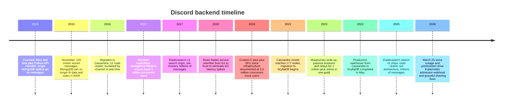
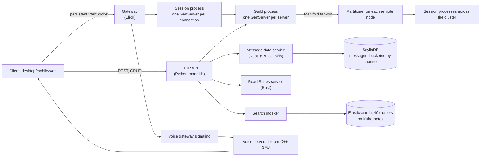
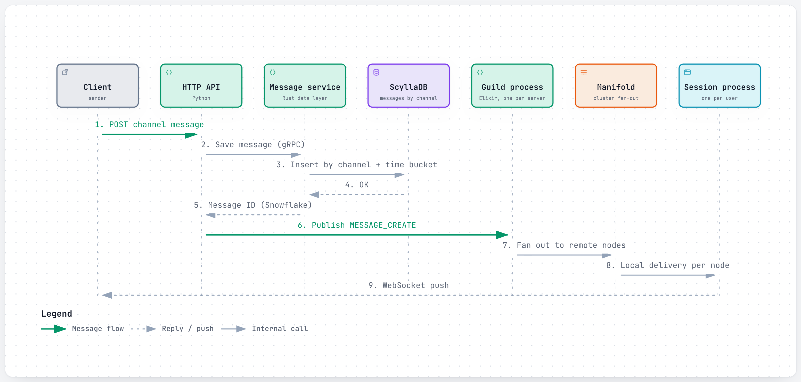
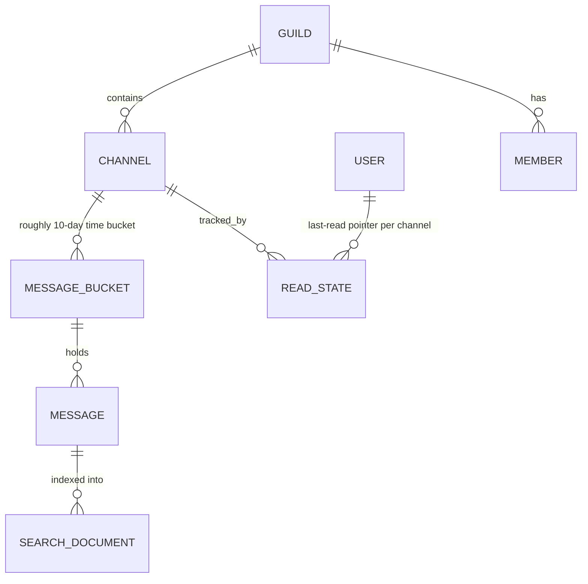
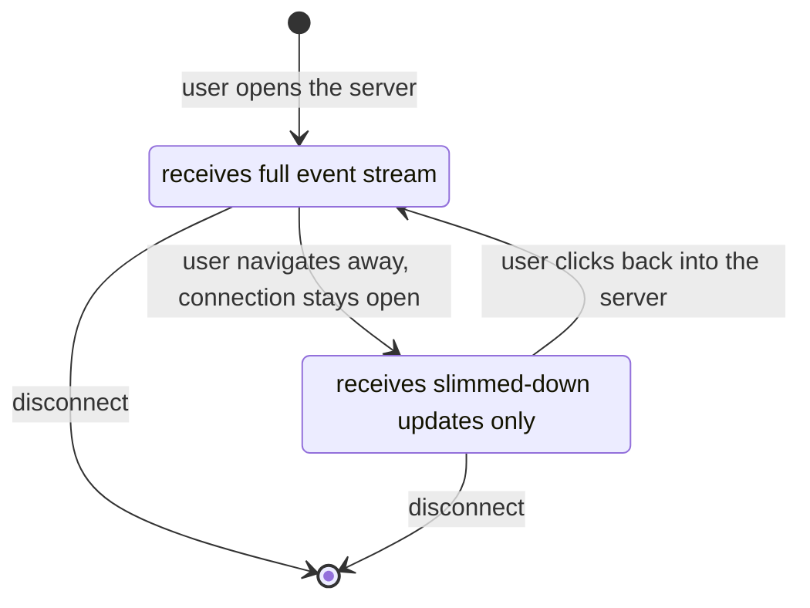
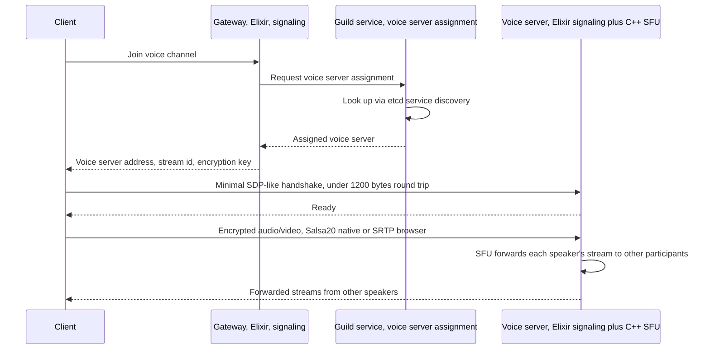

# Discord: how one message reaches a million people in the same server without melting the cluster

> **In 60 seconds:** Discord's real-time layer is built on Elixir and the Erlang VM (BEAM): every connected user gets a lightweight "session" process, and every server ("guild") gets its own process that fans messages out to everyone in it.
>
> That naive fan-out — one process sending to every member directly — falls over once a guild has tens of thousands of concurrent members, so Discord built a library called Manifold to route fan-out through a small number of per-node relay workers instead of talking to every session directly.
>
> Messages themselves are persisted by Rust data services into ScyllaDB, a Cassandra-compatible database Discord migrated to in 2022 after outgrowing Cassandra at 177 nodes.
>
> Voice and video ride an entirely separate path: a custom C++ Selective Forwarding Unit (SFU) that relays encrypted media between participants without ever mixing or decoding it centrally.
>
> The whole system is a genuinely polyglot stack — Python for the REST API, Elixir for real-time messaging, Rust for storage and read-state services, C++ for voice media — run by a chat-infrastructure team that stayed remarkably small (five engineers managing 20+ Elixir services) well past the point where most companies would have needed dozens.

**Last reviewed:** September 2026 · **Difficulty:** Advanced · **Reading time:** ~36 min

## Table of contents

- [Before you read: design it yourself](#before-you-read-design-it-yourself)
- [The problem](#the-problem)
- [Scale](#scale)
- [Back-of-the-envelope math](#back-of-the-envelope-math)
- [Requirements](#requirements)
- [How it evolved](#how-it-evolved)
- [High-level design](#high-level-design)
- [Low-level design](#low-level-design)
- [Deep dives](#deep-dives)
- [What happens when things break](#what-happens-when-things-break)
- [Key design decisions](#key-design-decisions)
- [Interview takeaways](#interview-takeaways)
- [Glossary](#glossary)
- [Sources](#sources)

## Before you read: design it yourself

Try each question for 5 minutes before reading the answer — the "how Discord does it" boxes are collapsed so you're not tempted to peek early.

### Q1. Someone posts in a server ("guild") with tens of thousands of people online — how do you notify everyone without the fan-out itself becoming the bottleneck?

<details>
<summary>Hint</summary>

Think about what "the guild process sends to every member directly" costs once "every member" is 30,000 people, each send costing tens of microseconds.

</details>

<details>
<summary>How Discord does it</summary>

Before 2017 the guild process really did send directly to every session, taking 900ms–2.1s to fan out in a 30,000-concurrent-member guild. Manifold fixed it by grouping recipients by which remote node they're connected to, sending one message per node, and letting a relay worker on that node fan out locally (cheap, same-node sends). That turns an O(members) cost on the guild process into a small, roughly constant one.

Deep dive: [Manifold's hierarchical fan-out](#3-signature-component-manifolds-hierarchical-fan-out).

</details>

### Q2. Now scale that same server to 10 million members with over 1 million concurrently online — what has to change?

<details>
<summary>Hint</summary>

Most people who are "online" in a huge server aren't actually looking at it right now — does everyone need the full event stream?

</details>

<details>
<summary>How Discord does it</summary>

Maxjourney's answer is to shrink the number of full-fidelity recipients, not just the delivery mechanism: a member not actively viewing the server becomes "passive" and gets a stripped-down update instead of the full stream, cutting fan-out work by roughly 90% for large communities. A second layer of relay processes (each handling up to 15,000 sessions) extends Manifold's per-node worker idea further, pushing the practical ceiling from tens of thousands into the millions.

Deep dive: [Maxjourney: passive sessions and relay for a 10-million-member guild](#maxjourney-passive-sessions-and-relay-for-a-10-million-member-guild).

</details>

### Q3. Message history has to grow into the trillions, across servers from 3 people to 10 million — how do you store that without one database falling over?

<details>
<summary>Hint</summary>

Think about what happens to a single partition if you key it by channel alone, versus channel plus a time window.

</details>

<details>
<summary>How Discord does it</summary>

Discord went MongoDB (2015, died at 100M messages when the working set stopped fitting in RAM) to Cassandra (2016, keyed by `channel_id, bucket, message_id` — bucketing ~10 days per partition keeps them under 100MB) to ScyllaDB (2022, same bucketing idea, but shard-per-core C++ instead of JVM, cutting 177 nodes to 72 and removing GC pauses). Each move was forced by a different ceiling: first a hard RAM limit, later an operational-cost ceiling, not a "wrong" choice in hindsight either time.

Deep dive: [From MongoDB to Cassandra to ScyllaDB](#from-mongodb-to-cassandra-to-scylladb-three-databases-in-under-a-decade).

</details>

### Q4. Voice chat during gameplay has near-zero tolerance for lag — how is that handled differently from text, and what happens when the connection layer underneath everything has a bad day?

<details>
<summary>Hint</summary>

Think about separating "who's in the call" (small, must survive) from "the actual audio bytes" (large, latency-sensitive) — then think about what happens if a third of your session-management pods vanish at once.

</details>

<details>
<summary>How Discord does it</summary>

Voice signaling (Elixir, same real-time model as text) is a separate service from the actual media relay: a custom C++ Selective Forwarding Unit that just forwards each participant's encrypted stream without decoding or mixing it, with a trimmed-down WebRTC handshake (no ICE, under ~1,200 bytes exchanged round trip). When that separation isn't enough — March 25, 2026, a routine Kubernetes config change killed half the session-management pods in one zone at once — the failure cascaded through Gateway memory exhaustion and a voice-syncer mailbox backlog, taking over three hours to recover from, precisely because none of the intermediate systems had a graceful-degradation plan for "a large chunk of my peers just disappeared."

Deep dive: [Voice infrastructure: a homegrown SFU and a trimmed-down WebRTC](#voice-infrastructure-a-homegrown-sfu-and-a-trimmed-down-webrtc) and [What happens when things break](#what-happens-when-things-break).

</details>

## The problem

A community server for a hit game or a viral AI art tool explodes overnight from a few thousand members to over ten million, with more than a million of them online and chatting at the same time. Discord's own "Maxjourney" project describes exactly this scenario, built to support one such server that grew past 10 million members with over 1 million concurrently online [5].

Now someone posts a message in that server's main channel.

Naively, the server process handling that community has to notify every online member's connection — a million individual notifications from one process, for one message.

Discord's own engineers have described the arithmetic bluntly: "if a server has 1,000 people online... that's 1 million notifications. The same thing with 10,000 people is 100 million notifications" [5].

At a million concurrent members, the naive approach isn't just slow — it doesn't finish before the next message arrives.

At the same time, across the rest of the platform, small three-person study-group servers are sending a handful of messages a day.

Discord has to serve both of these radically different shapes of traffic — from a three-person server to a ten-million-member one — on the same underlying architecture, without operating two different systems.

This page tries to answer three questions a junior engineer should walk away able to answer:

1. **How do you fan out one message to a million connected clients without the fan-out itself becoming the bottleneck?**
2. **How do you store and search a message history that grows into the trillions, across servers ranging from three members to ten million?**
3. **What happens differently when a real-time system's underlying process/connection infrastructure fails, versus when its storage layer fails?**

## Scale

| Metric | Number | Source |
|---|---|---|
| Concurrent users (chat infrastructure) | 5 million (2017) | [1] |
| Monthly active users | 100 million+ (Oct 2020) | [9] |
| Monthly active users | 200 million (2023, estimate) | [13] *(third-party)* |
| Minutes spent in conversation per day | 4 billion (Oct 2020) | [9] |
| Active servers/communities | 6.7 million (Oct 2020) | [9] |
| Concurrent users across all servers | 12 million+ (Oct 2020) | [9] |
| WebSocket events sent to clients/sec | 26 million (Oct 2020) | [9] |
| Elixir machines in chat infrastructure | 400–500 (Oct 2020) | [9] |
| Elixir microservices | 20+, run by a 5-person team (Oct 2020) | [9] |
| Nodes running audio/video services | 1,000+ (Oct 2020) | [9] |
| Messages sent per day | 40 million (Jul 2016) → 100 million (Dec 2016) → 120 million+ (Jan 2017) | [2] |
| Cassandra cluster size | 12 nodes (2017) → 177 nodes (early 2022) | [2], [3] |
| ScyllaDB cluster size (post-migration) | 72 nodes | [3] |
| Storage per node | ~4TB (Cassandra avg) → 9TB (ScyllaDB) | [3] |
| Historical message fetch latency, p99 | 40–125ms (Cassandra) → 15ms (ScyllaDB) | [3] |
| Message insert latency, p99 | 5–70ms (Cassandra) → steady 5ms (ScyllaDB) | [3] |
| Migration throughput (custom Rust migrator) | up to 3.2 million records/sec, 9-day total migration | [3] |
| Single largest server (Maxjourney) | 10 million+ members, 1 million+ concurrently online (2023) | [5] |
| Voice servers / regions / data centers | 850+ / 13 / 30+ | [6] |
| Concurrent voice users | 2.6 million | [6] |
| Voice egress traffic | 220+ Gbit/s, 120 million packets/sec | [6] |
| Elasticsearch clusters (search v2) | 40 clusters, thousands of indices | [7] |
| Search query latency | p50 <100ms, p99 <500ms (down from 500ms / 1s on v1) | [7] |
| Read States tracked | billions total; tens of millions per cache; later capacity raised to 8 million per cache | [4] |
| Read State cache updates/sec | hundreds of thousands | [4] |
| Read State database writes/sec | tens of thousands | [4] |
| Voice outage, March 25, 2026 | 17% of sessions lost, 3h17m total duration | [8] |
| Registered accounts | 560 million (2023) | [13] *(third-party)* |

What these numbers mean in practice:

- Going from 12 Cassandra nodes (2017) to 177 (early 2022) while message volume kept climbing shows a database that was scaling roughly linearly with load for years.

  The 2022 migration wasn't triggered by Cassandra suddenly failing — it was triggered by the *operational cost* of running it at that size becoming unsustainable (more on this in the deep dives).

- 26 million WebSocket events per second (2020) is the number that makes "naive fan-out" obviously untenable.

  That volume of individually-addressed pushes is only possible because of the fan-out redesign described below, not despite it.

- The ScyllaDB cutover ran at 3.2 million records/sec for a 9-day migration.

  That gap between a raw hardware ceiling and an actually-achieved number shows the difference between what's theoretically possible and a well-engineered, verified migration tool the team built by extending its data-service library in an afternoon [3].

## Back-of-the-envelope math

Back-of-the-envelope math is the rough, order-of-magnitude estimating engineers do on a whiteboard — no calculator, no precise data, just enough arithmetic to check whether a design idea is remotely plausible before building it. Inputs marked **[n]** come straight from this page's [Scale](#scale) table and cite the same source; everything else is a labeled **Assumption**, not a fact.

### Estimate 1: How many events does each connected user actually receive per second?

**Question:** Given 26 million WebSocket events/sec sent fleet-wide, how many events does each concurrently-connected user receive on average?

**Inputs:**
- WebSocket events sent to clients/sec: 26 million (Oct 2020) [9]
- Concurrent users across all servers: 12 million+ (Oct 2020) [9]

**Math:**
```text
events per user per second = 26,000,000 / 12,000,000
                            ≈ 2.17/sec
```

**Answer:** ~2 events/sec per connected user, on average.

**What it tells you:** most of that traffic is small, routine events (presence, typing, member updates), not messages — exactly why fan-out has to be cheap per event rather than assumed rare, and why [Manifold](#3-signature-component-manifolds-hierarchical-fan-out) batches by destination node instead of sending one at a time.

### Estimate 2: Does the pre-Manifold fan-out time actually match the per-send cost?

**Question:** Discord's own account says a single Erlang `send/2` costs 30-70 microseconds, and that fanning out to a 30,000-member guild took 900ms-2.1s. Do those two numbers actually agree?

**Inputs:**
- Guild size in the documented pre-Manifold example: ~30,000 concurrent members [1]
- Cost of one Erlang `send/2`: 30-70 microseconds [1]

**Math:**
```text
low end  = 30,000 sends × 30 µs/send = 900,000 µs = 0.9 s
high end = 30,000 sends × 70 µs/send = 2,100,000 µs = 2.1 s
```

**Answer:** 0.9s-2.1s — matches the documented range exactly.

**What it tells you:** confirms the guild process really was doing one direct, serial send per member before Manifold existed — the concrete reason [Manifold's hierarchical fan-out](#3-signature-component-manifolds-hierarchical-fan-out) had to exist at all, rather than a vaguer "it was slow."

### Estimate 3: How much total data moved during the Cassandra → ScyllaDB migration?

**Question:** Roughly how much total message data was Discord storing right before and right after the 2022 migration?

**Inputs:**
- Cassandra cluster size: 177 nodes (early 2022) [3]
- Storage per node: ~4TB avg (Cassandra) [3]
- ScyllaDB cluster size (post-migration): 72 nodes [3]
- Storage per node: 9TB (ScyllaDB) [3]

**Math:**
```text
Cassandra total ≈ 177 nodes × 4 TB/node  = 708 TB
ScyllaDB total  ≈ 72 nodes  × 9 TB/node  = 648 TB
```

**Answer:** ~700TB (Cassandra) vs. ~650TB (ScyllaDB) — roughly the same data, on 59% fewer nodes.

**What it tells you:** quantifies the "same data, way fewer nodes" payoff described in [From MongoDB to Cassandra to ScyllaDB](#from-mongodb-to-cassandra-to-scylladb-three-databases-in-under-a-decade) — the migration wasn't about storing more, it was about storing the same amount for less operational cost.

### Estimate 4: How many messages can the 2025 Search v2 architecture actually index?

**Question:** Given ~40 Elasticsearch clusters with "thousands of indices," each capped at roughly 200 million messages, does that plausibly reach the "trillions of messages" the requirements call for?

**Inputs:**
- Elasticsearch clusters (search v2): 40 clusters, thousands of indices [7]
- Per-index cap: ~200 million messages / ~50GB (see [Search infrastructure](#search-infrastructure-from-two-clusters-to-forty)) [7]
- Assumption: ~5,000 indices total — the middle of the page's "thousands of indices" description.

**Math:**
```text
total capacity ≈ 5,000 indices × 200,000,000 messages/index
              = 1,000,000,000,000
              = 1 × 10^12 messages ≈ 1 trillion messages
```

**Answer:** ~1 trillion+ messages of index capacity, at the assumed index count.

**What it tells you:** shows why sharding into many small indices — instead of one giant one — is what makes reaching that total scale possible at all without ever touching Lucene's ~2-billion-document-per-index ceiling; see [Search infrastructure: from two clusters to forty](#search-infrastructure-from-two-clusters-to-forty).

### Estimate 5: How much bandwidth does one concurrent voice user actually use?

**Question:** Given 220+ Gbit/s of total voice egress and 2.6 million concurrent voice users, what's the average bandwidth per user?

**Inputs:**
- Voice egress traffic: 220+ Gbit/s [6]
- Concurrent voice users: 2.6 million [6]

**Math:**
```text
bandwidth per user = 220,000,000,000 bits/s / 2,600,000 users
                    ≈ 84,615 bits/s ≈ 85 Kb/s
```

**Answer:** ~85 Kb/s average egress per concurrent voice user.

**What it tells you:** that's in line with a single compressed voice-only stream (Opus typically runs 64-96 Kb/s), consistent with the SFU relaying mostly-audio without needing large per-user bandwidth headroom — see [Voice infrastructure: a homegrown SFU and a trimmed-down WebRTC](#voice-infrastructure-a-homegrown-sfu-and-a-trimmed-down-webrtc).

### Rules of thumb used

| Rule | Value |
|---|---|
| 1 day | ~86,400 s ~ 10^5 s |
| 1 TB | ~10^12 bytes |
| Peak vs. average load | typically ~2-3x, though a single viral event can be far higher |

These are general estimating conventions, not Discord-specific facts.

## Requirements

**Functional:**
- Real-time text messaging in channels, inside "guilds" (Discord's internal name for servers) ranging from a handful of friends to ten million members. *The product spans two extremes of the same primitive, and both have to feel instant.*
- Voice and video chat with low latency, supporting both small friend groups and channels with up to 1,000 simultaneous speakers taking turns. *Voice is Discord's original differentiator against text-only chat apps — it has to work while gaming, which assumes near-zero perceptible lag.*
- Full-text search across a server's message history, at trillions of messages platform-wide. *"Search is core to Discord because history has to be findable, not just archived."*
- Read/unread tracking per user per channel, checked on essentially every connect, send, and read. *Users expect to see exactly what's new since they last looked, across potentially hundreds of channels.*
- Presence (who's online) and real-time member-list updates, at guild scale. *Seeing who's around is core to the "hang out" feeling Discord sells.*

**Non-functional:**
- **Fan-out cost must not grow linearly (or worse) with guild size.** A message in a 10-million-member guild has to reach a million online members without the guild's own process becoming a bottleneck [5].
- **Low, predictable voice/video latency** even with hundreds or thousands of participants in one channel, because voice chat alongside gameplay has essentially no tolerance for lag [6].
- **Storage has to keep scaling past trillions of messages** without the operational burden (compaction, repairs, GC pauses) growing faster than the team that runs it [3].
- **A crash in one guild, one session, or one voice server should not cascade** to unrelated guilds, sessions, or calls — isolation is a first-class requirement given the BEAM-based architecture.
- **Search has to stay fast at massive scale** without any single index growing past what its underlying engine (Lucene, inside Elasticsearch) can hold [7].
- **A small team has to be able to operate all of this.** Five engineers were responsible for 20+ Elixir services even at 12-million-concurrent scale (2020) [9] — tooling and observability investment is treated as a first-class requirement, not a nice-to-have.

## How it evolved



Discord's infrastructure story is really three overlapping stories.

The *connection* layer (Elixir gateway and guild processes) got a major redesign roughly every time concurrent users grew by an order of magnitude.

The *storage* layer went through three different databases in under a decade.

And the specialty systems (voice, search) were each built once and then substantially rebuilt as scale outgrew the first version.

**2015 — the honest starting point.** Discord launched with Elixir for real-time and a Python REST monolith [9], and a single MongoDB replica set holding every message, indexed on `channel_id` and `created_at` [2].

By November 2015, at just 100 million stored messages, the data and its index could no longer fit in RAM, and latencies became unpredictable [2]. This is the same story nearly every company in this series tells at some point: the simplest possible thing worked, until it very suddenly didn't.

**2016 — Cassandra, and a genuinely clever partition key.** Discord picked Cassandra for its linear scalability and self-healing replication, and — critically — changed the primary key from `(channel_id, message_id)` to `(channel_id, bucket, message_id)`.

Bucketing roughly ten days of messages per partition kept partitions under 100MB [2]. That one schema change is arguably more important to the system's next six years of scaling than the choice of database itself.

**2017 — the concurrency wall, and three small libraries that punched through it.** As concurrent users climbed toward 5 million, guild fan-out to large communities started taking 900ms–2.1 seconds, session-registry lookups were burning ~30 seconds on server restart, and request floods into overloaded services had no backpressure [1].

Discord's answer was three purpose-built, later open-sourced libraries — **Manifold** (hierarchical fan-out), **FastGlobal** (near-zero-cost reads of rarely-changing shared data), and **Semaphore** (atomic-counter backpressure) [1]. The same year, Discord shipped its first message-search system on two Elasticsearch clusters [7].

**2020 — chasing down garbage-collection pauses in Rust.** The Read States service — tracking what you've read in every channel — was rewritten from Go to Rust specifically because Go's garbage collector forced a collection run at least every two minutes.

That collection cycle scanned tens of millions of cached entries every time, causing periodic latency spikes no amount of Go-level tuning fully eliminated [4].

**2018 — documenting the voice stack at scale.** Discord published a detailed account of its custom WebRTC-based voice infrastructure — a homegrown Selective Forwarding Unit written in C++, deliberately deviating from standard WebRTC in several places for performance [6].

**2022 — outgrowing Cassandra, and building the second giant-guild system.** By early 2022 the Cassandra message cluster had grown to 177 nodes, and the operational cost — hot partitions, compaction backlogs, GC pauses, frequent on-call pages — outweighed the benefits of staying [3].

Discord migrated to ScyllaDB, cutting node count to 72 while improving p99 latencies substantially [3]. In parallel, the "Maxjourney" project extended the 2017 fan-out work with **passive sessions** (skip sending full data to members not actively looking at a server) and a **relay system** (further layers of fan-out workers), enabling a single guild to support over a million concurrently online members (written up in October 2023) [5].

**2025 — search rebuilt again, for the trillions-of-messages era.** The original two-cluster Elasticsearch design from 2017 had grown to 200+ nodes with severe coordination overhead and was hitting Lucene's roughly 2-billion-document ceiling per index on the largest guilds.

Discord rebuilt search as a "multi-cluster cell architecture" — 40 smaller Elasticsearch clusters on Kubernetes, with each index kept within ~200 million messages and 50GB — cutting p50 query latency from 500ms to under 100ms [7].

**2026 — a reminder that even mature systems have a bad day.** A routine Kubernetes configuration change during an ongoing migration of Elixir workloads accidentally terminated a large fraction of session-management pods at once, cascading into a three-hour-plus voice/video outage — covered in detail in the failure section below [8].

## High-level design



Walking through it:

1. **Two API surfaces, two languages.** Discord exposes an HTTP REST API — a Python monolith handling CRUD operations like creating channels or editing profiles — and a separate WebSocket Gateway written in Elixir for everything real-time [9].

   This split exists because the two workloads have opposite shapes: REST calls are one-off request/response; the Gateway holds millions of long-lived connections open simultaneously.

2. **A process per connection, a process per server.** Every connected client gets its own **session** process (an Elixir GenServer); every guild gets its own **guild** process that acts as the routing hub for everything happening in that server [1], [5].

   This mirrors the "process per connection" pattern used by WhatsApp (see that page) but adds a second layer — a process *per server*, not just per connection — because Discord's unit of fan-out is the guild, not the individual pair of chatting users.

3. **Fan-out doesn't talk to sessions directly.** When something happens in a guild (a new message, a presence update), the guild process doesn't send to every member's session process one by one.

   Instead it hands the work to **Manifold**, which groups recipients by which remote node they're connected to and routes through a partitioner/worker on each node, turning what would be tens of thousands of expensive cross-node sends into a small, fixed number of them [1], [5].

4. **Message persistence is a separate, stateless Rust tier.** Writing a message doesn't happen inside the Elixir guild process.

   A Rust data service, built on the Tokio async runtime and exposing gRPC endpoints with no business logic layer, persists it to ScyllaDB, routing by a consistent hash of the channel ID [3].

5. **Read state is its own service, for a reason.** Because "what have you read" is checked on nearly every connect, send, and read event — hundreds of thousands of times per second — it's a dedicated Rust service with its own large in-memory cache, kept separate from message storage itself [4].

6. **Search runs off to the side, asynchronously.** New messages are queued (originally via Redis, now via Google Cloud PubSub for guaranteed delivery) and indexed into Elasticsearch by a separate pipeline.

   This is decoupled from the message-send path so a search-indexing slowdown never blocks sending a message [7].

7. **Voice and video are a completely separate real-time path.** The Gateway handles voice *signaling* (who's in a call, which server to connect to), while the actual audio/video packets flow through dedicated voice servers running a custom Selective Forwarding Unit written in C++ [6].

## Low-level design

### 1. Core flow: sending a message in a large guild

<a href="https://alwintwk.github.io/big-tech-system-design/diagrams/companies-discord-send-message.html">
  <picture>
    <source media="(prefers-color-scheme: dark)" srcset="../diagrams/companies-discord-send-message.dark.png">
    
  </picture>
</a>

<sub>Click the diagram for the interactive version (zoom, dark mode, trace a path).</sub>

The step that matters most here is the hop from `G->>MF`: the guild process publishes the event **once**, to Manifold, rather than iterating over every member itself.

Before this pattern existed, Discord measured 900ms–2.1s to fan a single message out to a 30,000-concurrent-user guild, because a single Erlang `send/2` between processes costs roughly 30–70 microseconds, and that cost multiplied by tens of thousands of direct sends adds up fast [1].

Routing through a fixed, small number of relay workers instead turns that multiplication into addition — the guild process does a small, constant amount of work regardless of guild size, and each relay worker does its own local fan-out in parallel.

### 2. Data model: messages, buckets, and read states



> Note: this is a simplified reference model reconstructed from Discord's own engineering posts [2], [3], [7]; exact column names and internal service boundaries aren't fully public, but the partitioning strategy (bucketing) and the separation of read state from message content are both explicitly documented.

Two choices stand out here.

First, **Snowflake IDs** — chronologically-sortable 64-bit identifiers, the same idea Twitter popularized — double as both a unique message ID *and* a rough timestamp, which is what makes efficient time-range queries possible without a separate timestamp index [2].

Second, the primary key evolved from `(channel_id, message_id)` to `(channel_id, bucket, message_id)`. Bucketing roughly ten days of messages together keeps individual partitions under about 100MB, which matters enormously for a partitioned database, because an oversized partition becomes a **hot partition** — a single node doing disproportionate work while its neighbors sit idle [2], [3].

### 3. Signature component: Manifold's hierarchical fan-out

```mermaid
flowchart TD
  G["Guild process<br/>large guild"] -->|"naive: one send per session"| Bad["900ms to 2.1s fan-out<br/>(pre-Manifold, guilds up to ~30K online)"]
  G -->|"Manifold: group by destination node"| M["Manifold router"]
  M --> N1["Worker, node 1<br/>its local sessions"]
  M --> N2["Worker, node 2<br/>its local sessions"]
  M --> N3["... one per involved node"]
  N1 --> L1["Local delivery, in-process, cheap"]
  N2 --> L2["Local delivery, in-process, cheap"]
```



Instead of the guild process performing one expensive cross-node send per remote session, Manifold groups all the recipients on a message by which remote node they're connected to, sends **one** message per node, and lets a worker on that node fan out locally to its own sessions.

This is cheap because same-node Erlang message passing doesn't cross the network [1].

Maxjourney later layered two more optimizations on top for the very largest guilds: **passive sessions**, where a member who isn't actively looking at a server only receives a slimmed-down update instead of the full event stream (a roughly 90% reduction in fan-out work for large communities), and additional **relay** processes that each handle up to 15,000 sessions.

Together, these shifted the practical ceiling from tens of thousands to over a million concurrently online members in a single guild [5].

### 4. Session lifecycle: active vs. passive



This state machine is what makes million-member concurrency survivable: the overwhelming majority of "concurrently online" members in a huge guild are Passive at any given moment.

Passive sessions cost the fan-out path far less than Active ones — Discord's own figures describe roughly a 90% reduction in fan-out work from this distinction alone [5].

### 5. Voice call setup



Discord's voice signaling is handled in Elixir, fitting the same real-time process model as text, while the actual media relay is a separate C++ service acting as an SFU.

It forwards each participant's encrypted stream to every other participant without decoding or mixing audio centrally.

It also deliberately trims the standard WebRTC handshake: a full ICE negotiation is skipped, since the server-relay architecture removes the need for peer discovery, and the whole exchange is kept under roughly 1,200 bytes round trip, with SDP synthesized on the client [6].

## Deep dives

### Manifold, FastGlobal, and Semaphore: the 2017 scaling toolkit

> **Why this matters:** these three small, open-sourced libraries are the concrete answer to "how do you scale an actor-model system past its naive limits," and each one targets a different kind of bottleneck.

**Manifold** solves the fan-out problem described above: grouping recipients by destination node and routing through per-node workers instead of sending to every process individually, while preserving message ordering (linearizability) per recipient [1].

**FastGlobal** solves a different problem: some data (like the guild-to-node routing ring) changes rarely but is read constantly.

A naive shared-process lookup for this data was costing ~30 seconds on session-server restart. FastGlobal exploits the BEAM's read-only shared heap for constant data to bring that down to roughly 0.3 microseconds per lookup and restart time down to about 750ms [1].

**Semaphore** solves backpressure: when ~5 million session processes all needed something from just 10 guild-registry processes at once, those 10 processes became a chokepoint that could cascade into failure.

Semaphore uses atomic ETS counters to cap how many concurrent requests any one resource will accept, so an overloaded dependency degrades gracefully (rejecting excess requests) instead of falling over entirely. Discord's own account describes this proving its worth when a presence service crashed and session services stayed healthy specifically because Semaphore had bounded the blast radius [1].

All three libraries share one philosophy worth naming explicitly: each targets a *specific, measured* bottleneck (fan-out cost, read cost, cascading overload) rather than being a general-purpose "make it faster" rewrite — a useful discipline when a system has multiple bottlenecks and only enough engineering time to fix a few of them at a time.

```
# Illustrative shape of a Manifold-style fan-out (not real Discord code)
def fan_out(guild_process, event, member_sessions) do
  member_sessions
  |> Enum.group_by(&node_for_session/1)
  |> Enum.each(fn {node, sessions} ->
    send({:relay_worker, node}, {:deliver, event, sessions})
  end)
end
```
> ponytail: illustrative pseudo-Elixir only, not sourced from Discord's actual codebase.

### From MongoDB to Cassandra to ScyllaDB: three databases in under a decade

> **Why this matters:** this is a rare case where a company changed its core storage engine *twice* at a scale most systems never even do once, and each move was driven by a different kind of pain — first a hard RAM ceiling, then an operational cost ceiling.

The first move (MongoDB → Cassandra, 2015–2016) was forced by a hard resource limit: at 100 million stored messages, MongoDB's working set no longer fit in RAM, and write throughput collapsed [2].

Cassandra's promise of linear, add-more-nodes scalability without manual resharding solved that specific problem. The bucketed partition key (`channel_id, bucket, message_id`) kept individual partitions small and manageable for years afterward [2].

The second move (Cassandra → ScyllaDB, 2022) was different in kind: Cassandra was still *scaling*, but the human and operational cost of running a 177-node Java-based cluster had grown faster than the team's tolerance for it.

That cost showed up as hot partitions cascading into cluster-wide latency, compaction backlogs requiring a manual "gossip dance," and JVM garbage-collection pauses [3].

ScyllaDB, written in C++ with a shard-per-core architecture, addressed the operational side directly: no JVM GC pauses, and each CPU core owns its own slice of data and requests, which improves workload isolation under exactly the hot-partition conditions that plagued Cassandra [3].

The migration execution is its own small case study in engineering judgment. The team first tried ScyllaDB's off-the-shelf Spark-based migrator and estimated roughly three months to complete.

A small team then wrote a custom Rust-based migrator (extending an internal data-service library already used elsewhere) that pushed throughput up to 3.2 million records per second, cutting the estimated migration time to nine days.

It also used a request-coalescing trick, where multiple simultaneous requests for the same hot data collapse into a single database query, specifically to avoid recreating the hot-partition problem during the migration itself [3].

### Go to Rust: chasing garbage collection out of Read States

> **Why this matters:** this is a concrete, well-documented example of "the language's runtime behavior became the bottleneck," not the algorithm or the hardware — a distinction worth being able to draw clearly in an interview.

The Read States service answers one question, constantly: which messages, in which channels, has this user already seen?

It's checked on nearly every connection, message send, and message read — hundreds of thousands of cache updates and tens of thousands of database writes per second [4].

In Go, this service suffered latency spikes roughly every two minutes, because Go's garbage collector forces a collection cycle at that interval regardless of how much garbage has actually accumulated.

That cycle had to scan an LRU cache holding tens of millions of entries to determine what could be freed [4]. Shrinking the cache reduced the size of each spike but made the 99th-percentile latency worse in a different way — more frequent cache misses meant more database round-trips [4].

Rewriting the service in Rust removed the problem at its root rather than tuning around it: Rust's ownership model frees memory deterministically as soon as it's no longer referenced, with no periodic stop-the-world collection pass at all.

The rewrite matched Go's best-case performance almost immediately and then improved on it after further profiling — replacing a HashMap with a BTreeMap inside the LRU structure, among other changes — eventually supporting an 8-million-entry cache with response times in microseconds rather than milliseconds [4].

### Maxjourney: passive sessions and relay for a 10-million-member guild

> **Why this matters:** this is Discord solving the *same* fan-out problem as Manifold, five years later, at two more orders of magnitude of scale — a good illustration that "we solved scaling" is never a permanent statement.

The core insight behind Maxjourney is that fan-out work grows roughly with the *square* of active participants in the worst case — more online members means both more events to send and more recipients for each one.

So the fix has to attack the *number of full-fidelity recipients*, not just the delivery mechanism [5].

**Passive sessions** do exactly that: a member who isn't currently looking at the server receives a stripped-down update stream instead of the full one.

Discord's own figures describe this cutting fan-out work by roughly 90% for large communities, because in any huge guild the overwhelming majority of "online" members are not actively watching that specific server at any given instant [5].

**Relay** processes extend Manifold's per-node worker idea with an additional layer, with each relay handling up to 15,000 sessions.

This shifts the guild's effective concurrency ceiling from the tens-of-thousands Manifold-era limit into the millions [5]. A secondary optimization stopped copying a guild's entire member list (tens of millions of entries) into every relay, keeping only the tiny fraction of members each relay actually needed; separately, member data was put in shared ETS so worker processes could run all-member operations (like an @everyone ping) off the guild process [5].

The team also built dedicated instrumentation for this work: stack-trace sampling via `Process.info/2`, event-loop timing broken down by message type, and custom memory-sampling on top of `erts_debug.size`. Generic profiling tools simply didn't have visibility into per-process costs at this scale [5].

### Voice infrastructure: a homegrown SFU and a trimmed-down WebRTC

> **Why this matters:** voice/video at Discord's scale (2.6 million concurrent users, 220+ Gbit/s egress) needed infrastructure decisions most WebRTC users never have to make, because most WebRTC deployments are far smaller.

A **Selective Forwarding Unit (SFU)** forwards each participant's media stream to every other participant without decoding, mixing, or re-encoding it — the client does its own local audio mixing.

This keeps the server's CPU cost roughly proportional to bandwidth relayed rather than to any audio-processing work [6].

Discord's SFU, written in C++, also does moderation-relevant work at the relay layer: it can drop packets from a muted user before they ever reach other participants, and it bridges between native-app and browser (WebRTC) clients that speak slightly different dialects of the same underlying protocols [6].

Several deliberate deviations from "textbook" WebRTC show up here specifically because of scale. Full ICE negotiation is skipped, since a server-relay architecture removes the need for the peer-to-peer path discovery ICE exists for.

The join handshake is trimmed to under ~1,200 bytes round trip, and native clients replace DTLS/SRTP with faster Salsa20 encryption (browsers still use DTLS/SRTP) [6].

In large channels, silent participants' audio packets are simply omitted rather than sent as empty payloads, saving both bandwidth and CPU that would otherwise go toward encoding and forwarding silence [6].

### Search infrastructure: from two clusters to forty

> **Why this matters:** "just add more Elasticsearch nodes to the same cluster" runs into a real ceiling — Lucene's roughly 2-billion-document limit per index — and Discord's 2025 rebuild is a clean case study in solving that with topology instead of brute force.

The original 2017 design sharded messages across two Elasticsearch clusters, fed by a Redis-backed queue [7].

That queue would drop messages once its CPU maxed out (typically after an Elasticsearch node failure backed the queue up), meaning search results could go quietly out of date with no visible error [7].

As the clusters grew past 200 nodes, coordination overhead made routine operations — software upgrades, rolling restarts — increasingly painful, and the very largest guilds began hitting Lucene's hard per-index document ceiling, causing indexing to fail outright for exactly the servers generating the most messages [7].

The 2025 rebuild ("Search v2") replaced two giant clusters with a **multi-cluster cell architecture**: roughly 40 independent Elasticsearch clusters, each deliberately kept small (around 200 million messages and 50GB per index).

They're deployed on Kubernetes via the Elastic Cloud on Kubernetes operator, with dedicated master, ingest, and data nodes spread across availability zones [7]. Especially large guilds ("Big Freaking Guilds") get their own dedicated cluster with multiple primary shards, and migrating a guild to a new index is done as a dual-write-then-cutover, rather than a risky in-place rebuild [7].

The message queue itself moved from Redis to Google Cloud PubSub specifically for guaranteed delivery — tolerating large backlogs instead of silently dropping messages under load, closing the exact failure mode that plagued the original design [7].

The result: median query latency fell from about 500ms to under 100ms, and p99 fell from about 1 second to under 500ms, while total indexed volume grew into the trillions [7].

## What happens when things break

**A single node fails inside a 100-node legacy Elasticsearch cluster.**
- *Trigger:* ordinary hardware/node failure, nothing exotic.
- *What happens:* under the pre-2025 architecture, Discord's own worked example (100 nodes, 50-message batches) shows a single node failure failing roughly 40% of bulk indexing operations.
- *Root cause:* this happened because of how tightly coordinated large-cluster bulk operations were [7].
- *Why the fix is architectural, not operational:* the 2025 redesign's answer wasn't "make single-node failures less likely," it was "shrink the blast radius of any one cluster."
- *Result:* 40 smaller independent clusters mean a bad node only affects its own cell, not a shared 100+ node cluster [7].

**MongoDB's working set stops fitting in RAM (November 2015).**
- *Trigger:* ordinary, linear growth — no single bad event, just crossing 100 million stored messages [2].
- *What happens:* both the message data and its index could no longer fit in memory at once, and write throughput degraded sharply as the database had to go to disk far more often [2].
- *Why this counts as a design failure, not an operational one:* a single unsharded replica set has a ceiling that's a function of RAM size, full stop — no amount of tuning avoids it forever, which is exactly why the fix was a new database (Cassandra) rather than a bigger box.

**Large-guild fan-out before Manifold existed (2016–2017).**
- *Trigger:* a guild the size of a popular subreddit's community (Discord's own example: tens of thousands of concurrent members) generates an event that must reach everyone.
- *What happens:* fanning that single event out took 900ms to 2.1 seconds, because the guild process was making a direct, individually-costed send to every online member [1].
- *Why it doesn't happen anymore:* Manifold's per-node relay routing turned an O(members) cost on the guild process into a small, roughly constant cost, discussed in the signature-component section above [1].

**Ten guild-registry processes serve five million session processes.**
- *Trigger:* nearly every session process needs to look something up from a small, shared set of guild-registry processes.
- *What happens:* those ten processes become a chokepoint; if requests arrive faster than they can be served, the backlog grows without bound and can eventually take the registry processes down, which then affects every session depending on them.
- *Why it's contained:* Semaphore's atomic-counter backpressure caps in-flight requests per resource, so excess load gets rejected rather than queued indefinitely.
- *Proof it worked:* Discord's own account describes this design proving itself when a presence service crashed and session services stayed healthy because the blast radius had already been bounded [1].

**A search queue silently drops messages under load (pre-2025).**
- *Trigger:* the Redis-backed indexing queue backing up (often after an Elasticsearch node failure) until Redis CPU maxed out.
- *What happens:* the queue would silently drop messages rather than backing up visibly, so search results could go quietly stale with no alert firing [7].
- *Why silent data loss is worse than a visible outage:* an outage gets noticed and fixed; silently missing search results erode trust in the feature without anyone necessarily realizing why, until users start reporting "I know I said that, why can't I find it."
- *The fix:* replacing the queue technology itself (Redis → Google Cloud PubSub) rather than trying to make the existing queue drop less often — PubSub's guaranteed-delivery model tolerates a large backlog instead of shedding messages under pressure [7].

**The March 25, 2026 voice and video outage.**

- *Trigger:* a routine Kubernetes configuration change, made as part of an ongoing migration of Elixir workloads, accidentally terminated 50% of session-management pods in a single zone (`us-east1-b`) simultaneously [8].

- *What happened, step one:* the termination grace period elapsed before the affected pods could hand off their in-flight work, ungracefully dropping about 17% of Discord's total sessions.

- *What happened, step two:* the Gateway service in that zone then hit memory exhaustion.

- *What happened, step three:* "voice syncer" processes — responsible for routing calls to the right voice server — began backing up, with supervisor mailbox queues growing large (postmortem testing measured ~1ms extra spawn time at a ~100k-message mailbox, and modeled a 1M queue as unrecoverable).

- *What happened, step four:* a connection-pooling bottleneck (a supervisor process doing an expensive "selective receive" scan through its own mailbox on every new connection) meant the system couldn't drain the backlog fast enough to recover on its own [8].

- *Why recovery took over three hours:* several rounds of targeted and full-cluster restarts of the voice syncer service were needed, with the mailbox backlog re-forming after each attempt until rate limiting was applied and new capacity (15 additional instances, doubling the fleet) was brought online in a staged rollout [8].

- *What changed afterward:* Discord added a validating Kubernetes admission webhook requiring graceful draining before pods can be terminated, replaced the bottlenecked connection-pool supervisor with a `PartitionSupervisor` capable of handling connections concurrently instead of through one contended process, and expanded monitoring specifically around mailbox depth and service-discovery/RPC traffic [8].

- *The generalizable lesson:* a routine, low-risk-looking infrastructure change (a Kubernetes config update) cascaded through four different downstream systems — sessions, Gateway, voice syncers, call routing — because none of the intermediate systems had graceful-degradation behavior for "a large chunk of my peers just disappeared at once." The fix wasn't one patch, it was closing that gap at each layer.

**Hot partitions in the old Cassandra cluster.**
- *Trigger:* a small number of channels (viral servers, popular public channels) receive disproportionate read/write traffic relative to the rest of the cluster.
- *What happens:* Cassandra's per-partition cost model meant those hot channels caused cascading latency across the *entire* cluster, not just their own partition, because reads in Cassandra require checking both memtables and multiple SSTables, and a hot partition multiplies that cost repeatedly [3].
- *Why ScyllaDB's shard-per-core design helps:* giving each CPU core ownership of its own slice of data and requests improves isolation, so a hot partition's extra load is contained closer to the shard actually serving it rather than propagating cluster-wide the way it could under Cassandra's design [3].

## Key design decisions

| Decision | Why | Trade-off |
|---|---|---|
| Elixir/BEAM for the real-time gateway, Python for the REST API | BEAM's actor model gives natural fault isolation per connection/guild; Python was already the team's choice for straightforward CRUD [9] | Running a genuinely polyglot stack (Python, Elixir, Rust, C++) means more languages' worth of tooling, hiring, and operational knowledge to maintain |
| One GenServer process per guild, one per session | Mirrors the natural unit of fan-out (a server) and the natural unit of connection (a user), each independently crash-isolated | A guild's process is a single point of coordination for that guild — the whole reason Manifold/Maxjourney had to exist to stop it becoming a bottleneck at scale [1], [5] |
| Manifold: route fan-out through per-node relay workers instead of direct sends | Turns O(members) cross-node sends into a small, fixed number of node-level sends [1] | Added a whole new library and operational component (relay workers) that didn't exist in the naive design |
| Passive vs. active sessions (Maxjourney) | ~90% cut in fan-out work for large communities, since most "online" members aren't actively watching any one server at a given instant [5] | Passive sessions see a reduced event stream, which had to be carefully scoped so it never silently drops something a user actually needed |
| Cassandra → ScyllaDB migration (2022) | Removed JVM GC pauses; shard-per-core isolates hot partitions better; cut node count from 177 to 72 [3] | A multi-month, carefully-verified migration project, including building a custom Rust migrator from scratch |
| Read States rewritten from Go to Rust | Eliminated GC-driven latency spikes at the root instead of tuning around them [4] | A full service rewrite in a language with a steeper learning curve for teams used to Go |
| Custom SFU with trimmed WebRTC (no ICE, minimal SDP, Salsa20) | Cuts handshake overhead and CPU cost at Discord's specific scale (millions of concurrent voice users) [6] | Deviating from standard WebRTC means Discord owns and maintains protocol compatibility work most WebRTC users get for free |
| Multi-cluster "cell" architecture for search instead of one giant Elasticsearch cluster | Avoids Lucene's per-index document ceiling and shrinks the blast radius of any single node/cluster failure [7] | Forty independently-managed clusters is more topology to reason about than two, even though each individual cluster is simpler |
| Snowflake IDs as both unique identifier and rough timestamp | Avoids needing a separate timestamp index for time-range queries; sortable by creation order for free [2] | IDs leak rough creation time, a minor information disclosure most products accept as a reasonable trade |
| Bucketed partition keys `(channel_id, bucket, message_id)` instead of `(channel_id, message_id)` | Keeps individual database partitions small and evenly loaded regardless of how long a channel has existed [2] | Range queries spanning many buckets require querying multiple partitions instead of one |

A pattern runs through most of these rows: almost every one of them is a version of "don't let one unit of work (a guild, a partition, a cluster, a cache scan) grow without bound as the system scales — cap it, shard it, or route around it instead." That's arguably Discord's single most-reused engineering idea across a decade of otherwise very different problems.

## Interview takeaways

- **"Process per connection" scales further with a second layer: "process per unit-of-fan-out."** Discord adds a guild process on top of WhatsApp's session-process pattern (see that page) specifically because the natural recipient-grouping in a chat-room product is the room, not the individual pair of users.
- **Fan-out cost has to be actively engineered, not assumed away.** "Send to everyone" is trivially correct and trivially wrong at scale — naming the actual bottleneck (per-send overhead multiplied by recipient count) and the fix (batch by destination, then fan out locally) is exactly what interviewers are listening for in a "design a chat app" question.
- **A cache/lookup that's read far more than it's written deserves its own optimized path.** FastGlobal — exploiting a read-only shared heap for rarely-changing data — is a specific instance of a general and reusable idea: identify your hottest, least-volatile reads and give them a dramatically cheaper path than your general-purpose lookup.
- **Backpressure (Semaphore) is what turns cascading failure into contained failure.** Naming *why* a bounded-concurrency limiter stops a crash from spreading (it rejects excess load instead of queueing it indefinitely into a resource that's already struggling) is a stronger answer than just saying "add rate limiting."
- **Garbage-collected languages have a specific, nameable cost model** (periodic stop-the-world pauses whose scan cost scales with live heap size), and knowing when that cost model is unacceptable — a service checked hundreds of thousands of times a second, like Read States — is a concrete way to justify reaching for Rust/C++ instead of just asserting "Rust is faster."
- **Storage migrations at scale are a systems-design problem in their own right.** The Cassandra→ScyllaDB migration (verify a sample of live traffic against both databases, build a custom high-throughput migrator, dual-write new data while a custom high-throughput migrator backfills history, then validate and switch) is a reusable playbook, not a Discord-specific trick.
- **Every "we solved scaling" claim has an expiration date.** Discord solved guild fan-out in 2017 (Manifold) and then had to solve a *harder version of the same problem* by 2023 (Maxjourney) at two more orders of magnitude — a good reminder, in an interview, to state the scale a proposed design is good for rather than implying it's good forever.
- **Voice/video and text messaging are different enough problems that they deserve entirely separate infrastructure** — different language (C++ vs. Elixir), different protocol assumptions (UDP/SRTP vs. WebSocket/TCP), and different failure isolation, even inside the same product.

**A few follow-up questions worth rehearsing an answer to, if this page came up in an interview:**

- *"Why not just add more RAM/nodes to MongoDB in 2015 instead of migrating databases?"* — A single unsharded replica set has a hard RAM ceiling that scales with cost roughly linearly at best; Discord's actual constraint wasn't "afford more RAM," it was that the *data model itself* (unbucketed, single-partition-per-channel) didn't distribute across more nodes without a redesign, which is exactly what the Cassandra migration's new partition key provided.
- *"Isn't Manifold just sharding, applied to message fan-out instead of storage?"* — Conceptually, yes: both group work by a key (node, in Manifold's case) so no single unit has to do disproportionate work. Naming that parallel out loud in an interview is a good way to show you understand the underlying pattern, not just this one instance of it.
- *"Why does Discord need its own SFU instead of an off-the-shelf WebRTC media server?"* — Off-the-shelf WebRTC stacks are built for the general case (arbitrary peer discovery, standard-compliant negotiation), and Discord's scale and product shape (server-relay only, extremely high call-setup volume) meant most of that generality was pure overhead it could safely cut — the trade-off is now owning protocol-compatibility work in-house forever.

## Glossary

New to these terms? The [concepts](../concepts/README.md) folder explains the core ideas in depth.

- **Elixir**: a programming language that runs on the Erlang VM (BEAM), giving it the same lightweight-process, fault-isolated concurrency model as Erlang, with more modern syntax and tooling.
- **BEAM / Erlang VM**: the runtime that schedules millions of small, isolated "processes" (not OS processes) across a handful of OS threads — see the WhatsApp page for more depth on this same runtime.
- **GenServer**: a standard Elixir/Erlang pattern for a process that holds some state and responds to messages one at a time, used here as the building block for both session and guild processes.
- **Guild**: Discord's internal name for what users see as a "server" — a community with channels, members, and roles.
- **[Gateway](../concepts/persistent-connections.md)**: Discord's WebSocket-based real-time API, as distinct from its REST API.
- **[Fan-out](../concepts/fan-out.md)**: delivering one event (like a new message) to many recipients.
- **Manifold**: an open-sourced Discord library that groups fan-out recipients by destination node and routes delivery through per-node relay workers instead of sending to every recipient individually.
- **FastGlobal**: an open-sourced Discord library that exploits the BEAM's read-only shared heap to make reads of rarely-changing shared data extremely cheap.
- **Semaphore**: an open-sourced Discord library implementing atomic-counter backpressure, so an overloaded resource rejects excess concurrent requests instead of queueing them indefinitely.
- **ETS (Erlang Term Storage)**: an in-memory key-value store built into the BEAM, used for fast shared access to data across processes on the same node.
- **Passive / active session**: Maxjourney's distinction between a connection actively viewing a server (gets the full event stream) and one that isn't (gets a stripped-down update stream), used to cut fan-out cost in huge guilds.
- **Snowflake ID**: a 64-bit identifier that's both unique and roughly sortable by creation time, so you can tell approximately when something was created just from its ID.
- **[Bucketing (in a database)](../concepts/sharding.md)**: grouping rows that would otherwise share one very large partition into several smaller partitions (here, by time range), to avoid overloading a single node.
- **[Hot partition](../concepts/sharding.md)**: a portion of a partitioned database receiving disproportionate traffic, causing the one node holding it to become a bottleneck while others sit comparatively idle.
- **Cassandra**: an open-source, horizontally-scalable database (written in Java) that Discord used for message storage from 2016–2022.
- **ScyllaDB**: a Cassandra-compatible database written in C++, using a shard-per-core design, that Discord migrated to in 2022.
- **Shard-per-core**: an architecture where each CPU core owns and processes its own slice of data independently, reducing cross-core coordination overhead.
- **Tombstone (in Cassandra/ScyllaDB)**: a marker recording that a row was deleted, kept around temporarily so replicas can agree the deletion happened; too many of them can slow down reads.
- **Request coalescing**: combining several simultaneous requests for the same data into a single underlying database query, then handing the one result to everyone who asked.
- **gRPC**: a framework for services to call each other's functions across a network using a compact, strongly-typed message format.
- **Tokio**: a popular asynchronous runtime for the Rust programming language, used for building high-throughput network services.
- **SFU (Selective Forwarding Unit)**: a server that relays each participant's audio/video stream to every other participant in a call without decoding, mixing, or re-encoding it centrally.
- **WebRTC**: a set of web standards and protocols for real-time audio, video, and data communication, of which SDP, ICE, DTLS, and SRTP are individual pieces.
- **SDP (Session Description Protocol)**: a text format describing what kind of media a call will exchange, negotiated at call setup.
- **ICE (Interactive Connectivity Establishment)**: a WebRTC mechanism for two peers to discover a network path to each other directly; unnecessary in a server-relay architecture like Discord's.
- **DTLS/SRTP**: the standard WebRTC protocols for encrypting media in transit; Discord substitutes a faster, custom encryption handshake instead.
- **Elasticsearch**: a distributed search engine (built on Lucene) used to index and query message content for Discord's search feature.
- **Lucene**: the underlying search-indexing library inside Elasticsearch, which has a hard ceiling of roughly 2 billion documents per index.
- **Index (in search)**: a self-contained collection of searchable documents inside Elasticsearch; a deployment can run many indices across many clusters.
- **Kubernetes**: a system for automatically deploying, scaling, and managing containerized services across many machines.
- **[PubSub (Google Cloud)](../concepts/message-queues-and-logs.md)**: a managed message-queueing service guaranteeing delivery even under backlog, used to replace a Redis-based queue that could silently drop messages under load.
- **etcd**: a distributed key-value store commonly used for service discovery — here, to look up which voice server a user should connect to.
- **[Consistent hashing](../concepts/consistent-hashing.md)**: a way of mapping keys (like channel IDs) to nodes such that adding or removing a node only reshuffles a small fraction of the mapping, instead of nearly all of it.
- **[Backpressure](../concepts/rate-limiting.md)**: a system's ability to push back on incoming work when it's overloaded (e.g., rejecting or delaying new requests) instead of silently accepting more than it can handle until it fails.
- **Linearizability (in messaging)**: the guarantee that messages from the same sender arrive at each recipient in the same order they were sent, even when the delivery path involves multiple intermediate hops.
- **Admission webhook (Kubernetes)**: a check Kubernetes runs before allowing an action (like terminating a pod), which can block or modify that action — used by Discord to require graceful draining before a pod is killed.
- **[Mailbox (in Erlang/Elixir)](../concepts/message-queues-and-logs.md)**: the inbox of pending messages every process has; if messages arrive faster than a process can handle them, its mailbox grows without bound and becomes a bottleneck in its own right.

## Sources

1. [How Discord Scaled Elixir to 5,000,000 Concurrent Users](https://discord.com/blog/how-discord-scaled-elixir-to-5-000-000-concurrent-users) — Discord Engineering Blog, 2017.
2. [How Discord Stores Billions of Messages](https://discord.com/blog/how-discord-stores-billions-of-messages) — Discord Engineering Blog, January 2017.
3. [How Discord Stores Trillions of Messages](https://discord.com/blog/how-discord-stores-trillions-of-messages) — Discord Engineering Blog (Cassandra to ScyllaDB migration).
4. [Why Discord is Switching from Go to Rust](https://discord.com/blog/why-discord-is-switching-from-go-to-rust) — Discord Engineering Blog, February 2020.
5. [Maxjourney: Pushing Discord's Limits with a Million+ Online Users in a Single Server](https://discord.com/blog/maxjourney-pushing-discords-limits-with-a-million-plus-online-users-in-a-single-server) — Discord Engineering Blog, October 2023.
6. [How Discord Handles Two and a Half Million Concurrent Voice Users using WebRTC](https://discord.com/blog/how-discord-handles-two-and-half-million-concurrent-voice-users-using-webrtc) — Discord Engineering Blog, September 2018.
7. [How Discord Indexes Trillions of Messages](https://discord.com/blog/how-discord-indexes-trillions-of-messages) — Discord Engineering Blog, April 2025.
8. [Behind the Scenes of the 3/25/26 Voice Outage](https://discord.com/blog/behind-the-scenes-of-the-3-25-26-voice-outage) — Discord Engineering Blog, 2026.
9. [Real time communication at scale with Elixir at Discord](https://elixir-lang.org/blog/2020/10/08/real-time-communication-at-scale-with-elixir-at-discord/) — elixir-lang.org, October 2020, authored by Discord engineering. *(third-party-hosted, Discord-authored)*
10. [Manifold](https://github.com/discordapp/manifold) — Discord's open-source fan-out library, GitHub.
11. [FastGlobal](https://github.com/discordapp/fastglobal) — Discord's open-source fast-read library, GitHub.
12. [Semaphore](https://github.com/discordapp/semaphore) — Discord's open-source backpressure library, GitHub.
13. [Discord Revenue and Usage Statistics](https://www.businessofapps.com/data/discord-statistics/) — Business of Apps. *(third-party, MAU/registered-account figures)*
14. [Discord Status](https://discordstatus.com/) — Discord's public incident-history status page. *(primary, operational data)*
