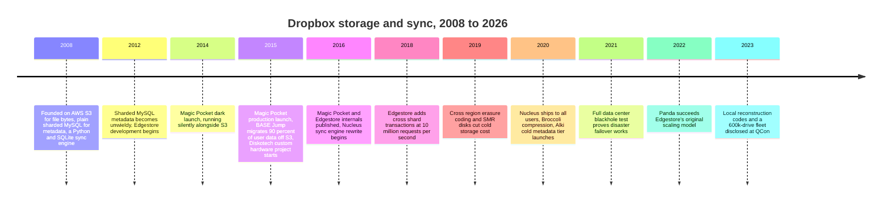
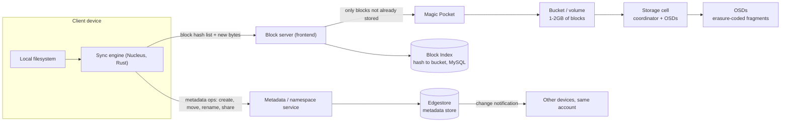
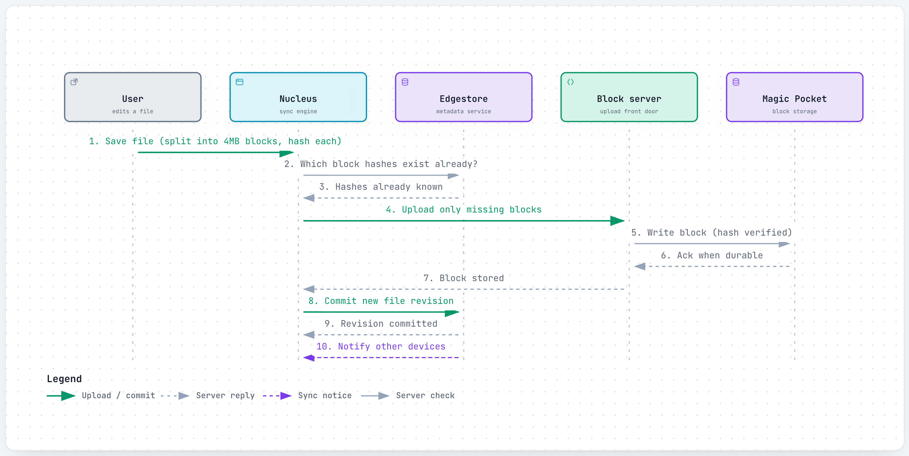
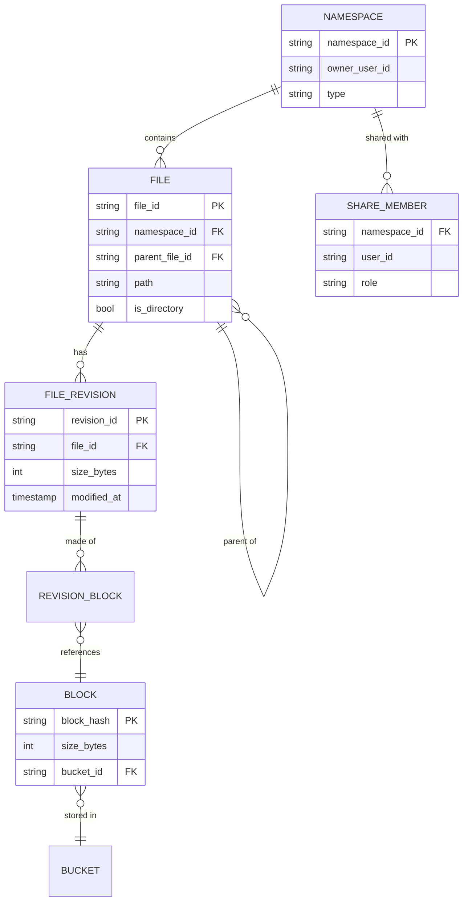
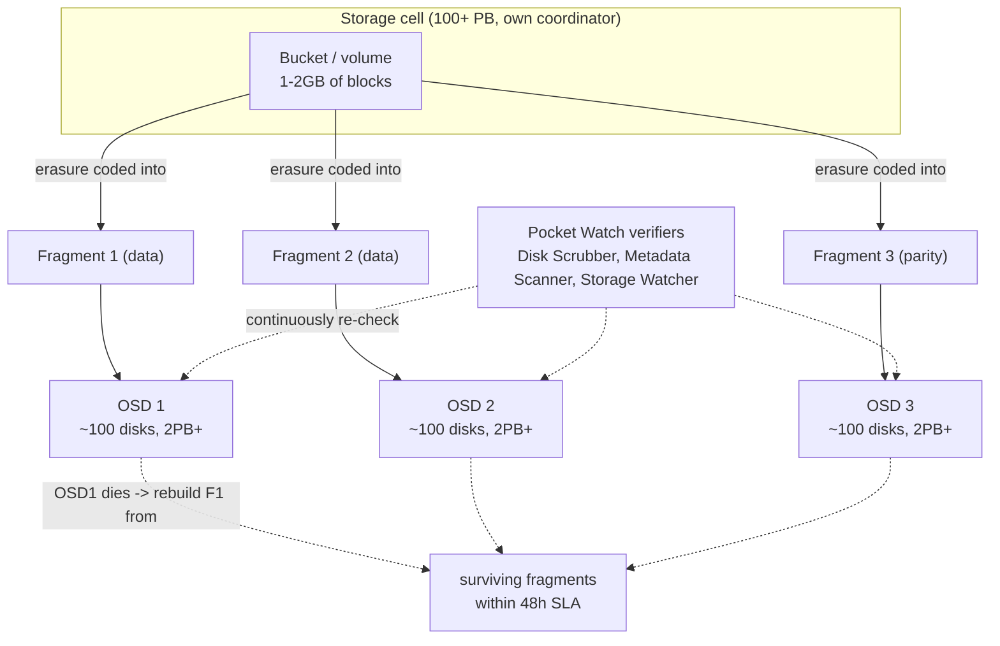
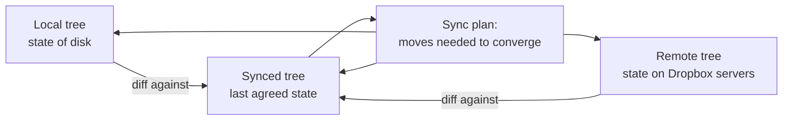
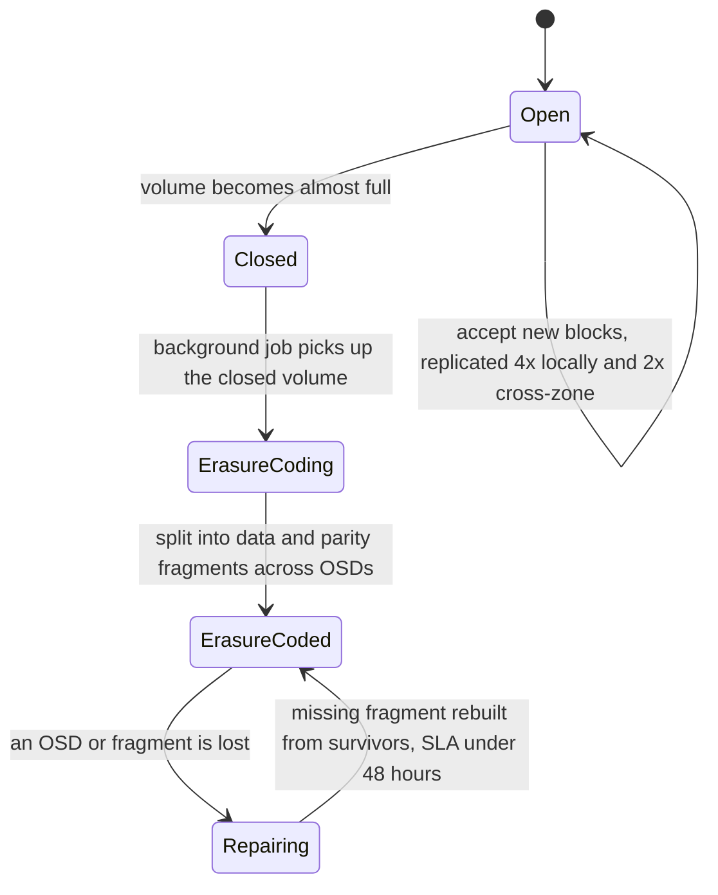
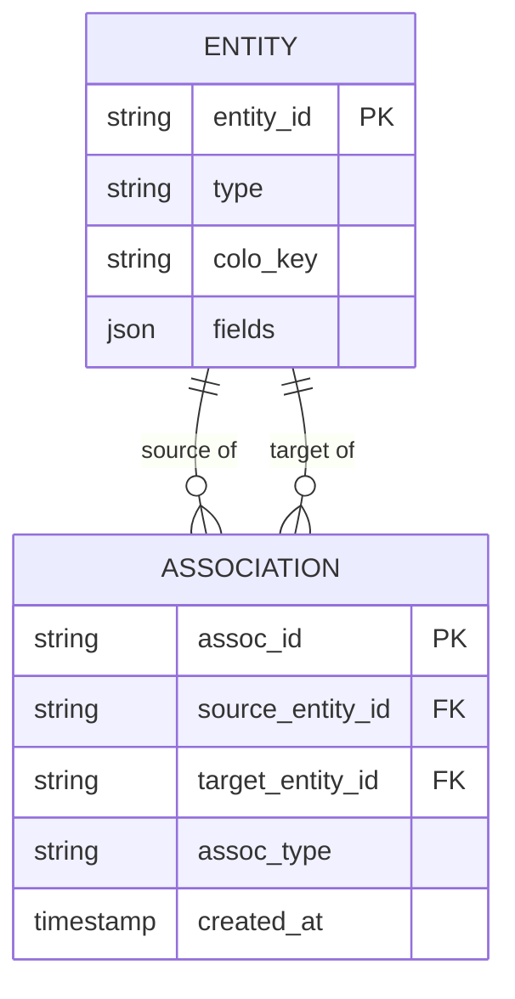
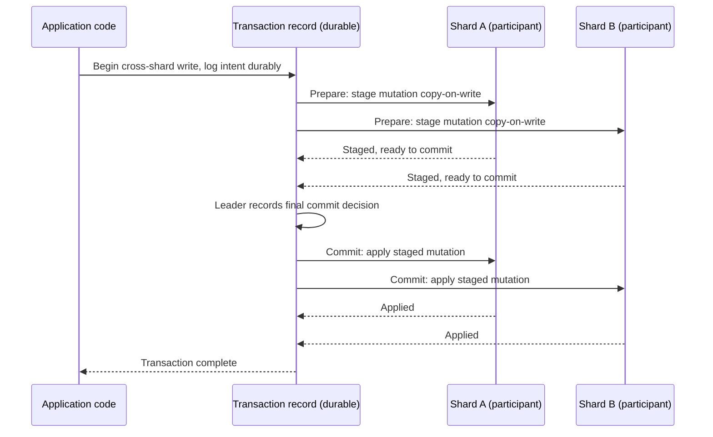
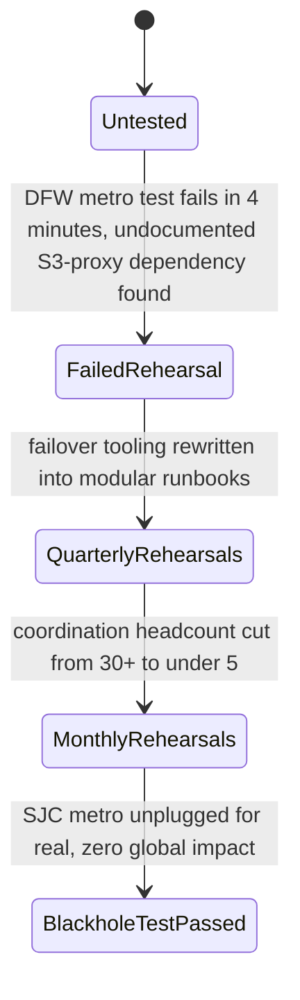

# Dropbox: How a changed file reaches every device without re-uploading a single byte twice

> **In 60 seconds:** When you save a changed file, Dropbox's desktop sync engine — a from-scratch Rust rewrite codenamed **Nucleus** — cuts it into 4MB blocks, fingerprints each block with SHA-256, and asks the metadata service which of those fingerprints it has already seen anywhere on the account. Only genuinely new blocks get compressed and sent; everything else becomes a pointer to a block Dropbox already has, whether it came from an older version of the same file or a completely different user's file. Metadata — names, folders, permissions, revisions — lives in **Edgestore**, a sharded, MySQL-backed store designed to keep related data on one shard for fast strong consistency, with a newer system called **Panda** now generalizing its scaling model underneath. The actual file bytes live in **Magic Pocket**, Dropbox's own exabyte-scale block storage system, which replaced most of Dropbox's AWS S3 usage in 2015 and keeps hundreds of thousands of disks worth of data durable using erasure coding — splitting data into fragments plus parity fragments — instead of paying for two or three full extra copies of everything.

**Last reviewed:** September 2026 · **Difficulty:** Advanced · **Reading time:** ~35 min

## Table of contents

- [Before you read: design it yourself](#before-you-read-design-it-yourself)
- [The problem](#the-problem)
- [Scale](#scale)
- [Back-of-the-envelope math](#back-of-the-envelope-math)
- [Requirements](#requirements)
- [How it evolved](#how-it-evolved)
- [High-level design](#high-level-design)
- [Low-level design](#low-level-design)
- [Deep dives](#deep-dives)
- [What happens when things break](#what-happens-when-things-break)
- [Key design decisions](#key-design-decisions)
- [Interview takeaways](#interview-takeaways)
- [Glossary](#glossary)
- [Sources](#sources)

## Before you read: design it yourself

Try each question for 5 minutes before reading the answer — the point is to feel where the hard part is, not to get it "right."

### Q1. How does the sync engine know exactly which bytes changed without comparing whole files — so editing one paragraph of a 40-page doc doesn't re-upload the whole thing?

<details>
<summary>Hint</summary>

What's cheaper to compare than raw bytes?

</details>

<details>
<summary>How Dropbox does it</summary>

Nucleus splits a changed file into fixed 4MB blocks, fingerprints each with SHA-256, and asks the metadata service which hashes it already has for the account — only genuinely new blocks get uploaded. Because the check happens before any bytes move, the dedupe savings are real bandwidth savings, not just a storage-side optimization; it works whether the duplicate is an older revision or a completely different user's file. Blocks are compressed client-side (Broccoli, a modified Brotli) before upload, and the server decompresses and re-verifies the hash so a client can't claim a hash for content it isn't sending. Trade-off: fixed-size blocks are simple and fully deterministic, but inserting even a few bytes near the start of a large file shifts every later block boundary, silently breaking dedupe against the previous version until a full re-chunk.

Deep dive: [Block hashing and dedupe](#block-hashing-and-dedupe)

</details>

### Q2. At exabyte scale, where "a disk failed" isn't an incident, it's Tuesday — how do you keep data durable without paying for 2-3 full extra copies of everything?

<details>
<summary>Hint</summary>

What if you could rebuild a lost piece from the pieces you still have, instead of storing full copies?

</details>

<details>
<summary>How Dropbox does it</summary>

Magic Pocket erasure-codes closed, immutable volumes — Reed-Solomon 6+3 (1.5x overhead, tolerates losing any 3 of 9 fragments) and a newer LRC-(12,2,2) scheme (1.33x overhead) — instead of 3x+ replication. Volumes stay heavily replicated (8x) only while still open and accepting writes; once closed, they're never reopened, which is exactly what makes the aggressive erasure-coding overhead safe. Fragments spread across independent 100+PB storage cells, each with its own coordinator, so a problem in one cell can't take down the whole fleet; a lost fragment rebuilds from survivors under a 48-hour repair SLA. Trade-off: reconstructing even one lost fragment costs real CPU and cross-node bandwidth, and Dropbox now owns the operational burden of running its own data-center hardware that renting S3 used to make someone else's problem.

Deep dive: [Magic Pocket](#magic-pocket)

</details>

### Q3. How do you actually know your durability numbers are true, rather than just claimed, when corruption can happen silently with no hardware alarm at all?

<details>
<summary>Hint</summary>

If nothing goes looking for a problem, how would you ever find out before a customer does?

</details>

<details>
<summary>How Dropbox does it</summary>

Pocket Watch runs three always-on verifiers: the Disk Scrubber (re-reads every bit against checksums every 1-2 weeks), the Metadata Scanner (cross-checks the Block Index against real placement at ~1M blocks/sec), and the Storage Watcher (samples ~1% of writes for up to a month after they land). Dropbox's Markov-model durability estimate, given worst-case disk failure rates and repair times, is "27 nines" — a modeled number about how unlikely data loss becomes, not a claim about any one disk. Dropbox doesn't just trust the verifiers work — engineers deliberately corrupt test data on purpose to confirm each one actually catches it. Trade-off: verification isn't a background afterthought, it's over half of all disk and database load in the entire system — a large, permanent tax paid continuously whether or not anything is actually broken.

Deep dive: [Pocket Watch: continuous verification](#pocket-watch-continuous-verification)

</details>

### Q4. How do you keep metadata — names, folders, permissions — consistent and fast across hundreds of millions of devices, once hand-managed, sharded MySQL stops scaling?

<details>
<summary>Hint</summary>

Most access to your own stuff is "local" — can you exploit that to make the common case cheap?

</details>

<details>
<summary>How Dropbox does it</summary>

Edgestore introduces colos — placing data that's usually read and written together (a user's own files and folders) on the same physical MySQL shard, giving cheap strong consistency for the common case by construction. The rarer cross-shard operations (5-10% of transactions) go through a modified two-phase commit with copy-on-write staging, cutting write amplification by up to 95% versus duplicating the whole object. As Edgestore's own "split the whole fleet to add capacity" model hit its own ceiling, Dropbox built Alki (cold data moved to a cheap DynamoDB+S3 tier) and Panda (incremental, small-range rebalancing) underneath it. Trade-off: strong consistency by default means every write invalidates caches, and running three overlapping metadata systems during the transition is itself an ongoing operational cost.

Deep dive: [Edgestore](#edgestore)

</details>

## The problem

You're editing a 40-page project brief in a shared Dropbox folder at 11pm. You change one paragraph on page 12 and hit save. Two seconds later, a co-founder on hotel wifi on the other side of the planet opens the same file and sees your edit. Nothing about the other 39 pages changed — did your laptop really just re-upload the whole document? And given that you and roughly 700 million other Dropbox accounts have, between you, saved a file called `Resume.pdf` or a near-identical photo of the same sunset, is Dropbox somewhere quietly storing a thousand copies of almost-the-same bytes?

Underneath both questions is one system design problem: keep a very large, constantly changing set of files consistent across every device that has them, while storing and moving the smallest possible number of actual bytes — and do it at a scale where "a disk failed" isn't an incident, it's Tuesday. This page answers three specific questions it takes real engineering to answer well: How does a sync engine know exactly which bytes changed without comparing entire files? How does storage avoid ever paying twice to hold the same content, across users and across versions? And once bytes are accepted, what actually holds them durably enough that an exabyte-scale pile of data survives routine, daily hardware death?

This page is organized in roughly the order those questions get answered as a file actually moves through the system: how the client decides what needs to be sent at all (Nucleus, block hashing), where that content physically ends up once it's accepted (Magic Pocket, Pocket Watch, Diskotech), and how the system remembers what's yours and keeps everyone's view of it consistent while all of that keeps changing (Edgestore, Panda, Alki).

## Scale

| Metric | Number | Source |
|---|---|---|
| Registered users | ~700M (2021) | [21](#sources) *(third-party, citing Dropbox)* |
| User data migrated off AWS S3 to Magic Pocket | grew from 40PB (2012) to 90% of all user data / 500+PB in-house by Oct 2015 | [3](#sources) |
| Magic Pocket storage drives (2023) | 600,000+ | [15](#sources)[16](#sources) |
| Magic Pocket request throughput (2023) | tens of millions of requests/sec | [15](#sources)[16](#sources) |
| Magic Pocket annual durability | over 12 nines (2023); stated as >99.9999999999% (2016) | [16](#sources)[3](#sources) |
| Magic Pocket theoretical durability (Markov-model estimate from worst-case disk failure and repair rates) | "27 nines" (≈99.9999999999999999999999999%) | [2](#sources) |
| Magic Pocket availability | 99.99% across 3 North American regions (2023); stated as >99.99% (2016) | [16](#sources)[3](#sources) |
| Magic Pocket repair throughput | 4 extents/sec repaired (1–2GB each), repair SLA under 48 hours (2023) | [16](#sources) |
| Magic Pocket verification workload share | verification is >50% of all disk and database load (2016) | [2](#sources) |
| Edgestore (2016) | several trillion entries stored, millions of queries/sec, "five nines" availability | [9](#sources) |
| Edgestore total throughput (2018) | ~10 million requests/sec (cross-shard transactions are 5–10% of Edgestore transactions) | [10](#sources) |
| Panda / Filesystem+Edgestore combined (2022) | tens of millions of queries/sec, single-digit ms latency target | [11](#sources) |
| Alki cold-metadata tier (2020) | ~350TB stored at about 1/6 Edgestore's cost per GB/year | [13](#sources) |
| Nucleus rewrite duration | ~4-year project (started 2016, shipped to all users March 2020) | [6](#sources) |
| Broccoli client compression (2020) | ~30% less upload bandwidth, ~35% lower p50 upload latency; ~15% less download bandwidth, ~50% lower p50 download latency | [8](#sources) |
| Content-hash block size | 4MB (4,194,304 bytes) per block | [12](#sources) |
| Data-center blackhole test (Nov 2021) | 30-minute full outage of the SJC metro, zero global-availability impact | [14](#sources) |

Tens of millions of requests a second against a fleet of 600,000+ disks means Magic Pocket cannot treat "a disk died" as an emergency — it has to be background noise the system absorbs automatically. Losing several fragments out of an erasure-coded group and still reading the file back correctly is precisely what turns hundreds of thousands of individually unreliable disks into something more durable than any single disk could ever be on its own. And the jump from "rewrite the sync engine over four years" to "unplug an entire data center on purpose to prove failover works" shows the same instinct repeated at every layer of this stack: assume failure is constant and design so that it's boring when it happens.

## Back-of-the-envelope math

Back-of-the-envelope math is the rough, order-of-magnitude arithmetic engineers do on a whiteboard to size a system before building it — not a precise forecast. Inputs marked with a [n] reference are pulled straight from this page's Scale table; everything else is a labeled `Assumption:` used purely for illustration.

### Storage growth rate during the Magic Pocket migration

**Question:** How much new data per day did Dropbox need to absorb while moving off S3?

**Inputs:**
- User data in-house: grew from 40PB (2012) to 500+PB by Oct 2015 [3](#sources)
- Assumption: treat the span as ~3.5 years (2012 to Oct 2015)

**Math:**
```text
growth      = 500 PB - 40 PB
            = 460 PB

days        = 3.5 years * 365 days/year
            ≈ 1,278 days

per_day     = 460 PB / 1,278 days
            ≈ 0.36 PB/day
            ≈ 360 TB/day

per_sec     = 360,000 GB / 86,400 sec
            ≈ 4.17 GB/sec
```

**Answer:** ~360 TB/day (~4.2 GB/s sustained) average growth over that window.

**What it tells you:** absorbing several hundred TB of new data every single day, indefinitely, needs constant fleet expansion rather than a fixed-size cluster — why Magic Pocket's drive count is in the hundreds of thousands. See [Magic Pocket](#magic-pocket).

### Blocks without dedupe, cross-checked against Edgestore's entry count

**Question:** How many blocks would exist with no deduplication at all — and does that line up with Edgestore's own numbers?

**Inputs:**
- Content-hash block size: 4MB [12](#sources) (using decimal MB = 10^6 bytes for round math; the source's exact figure is 4,194,304 bytes)
- Registered users: ~700M (2021) [21](#sources) *(third-party)*
- Assumption: average account holds ~10GB of unique file data

**Math:**
```text
blocks_per_account    = 10,000 MB / 4 MB
                       = 2,500 blocks

total_blocks_no_dedupe = 700,000,000 accounts * 2,500 blocks
                       = 1,750,000,000,000
                       ≈ 1.75 trillion blocks
```

**Answer:** ~1.75 trillion blocks if nothing were ever deduplicated.

**What it tells you:** Edgestore is independently reported at "several trillion entries" [9](#sources) — the same order of magnitude as this estimate, consistent with roughly one metadata entry per block/file-reference rather than per raw byte, and showing why [block hashing and dedupe](#block-hashing-and-dedupe) is foundational at this scale, not an optimization.

### Repair throughput vs. steady-state disk failures

**Question:** Does Magic Pocket's stated repair throughput actually keep up with ordinary disk failures across 600,000+ drives?

**Inputs:**
- Magic Pocket storage drives (2023): 600,000+ [15](#sources), [16](#sources)
- OSD capacity: ~100 disks, 2PB+ per OSD [16](#sources) → ~20TB average capacity per disk
- Repair throughput: 4 extents/sec repaired, 1-2GB each, repair SLA <48h (2023) [16](#sources)
- Assumption: annual drive failure rate (AFR) ≈ 1.5%/year (typical published datacenter HDD AFR)
- Assumption: extent size used in the math = 1.5GB (midpoint of the stated 1-2GB range)

**Math:**
```text
drives_failing_per_year = 600,000 * 0.015
                         = 9,000 drives/year

drives_failing_per_day  = 9,000 / 365
                         ≈ 24.66 drives/day

data_to_rebuild_per_day = 24.66 drives * 20 TB/drive
                         ≈ 493 TB/day

repair_throughput       = 4 extents/sec * 1.5 GB/extent
                         = 6 GB/sec

repair_throughput_per_day = 6 GB/sec * 86,400 sec/day
                         = 518,400 GB/day
                         ≈ 518 TB/day

headroom                = 518 / 493
                         ≈ 1.05x  (~5% headroom)
```

**Answer:** ~493 TB/day needs reconstructing from ordinary disk churn alone, against ~518 TB/day of stated repair capacity — only ~5% headroom.

**What it tells you:** the 48-hour SLA isn't generous slack, it's close to the physical limit of routine rebuild speed — which is why erasure coding's redundancy margin, not repair speed, is what has to absorb a correlated event like a whole rack or the blackhole-tested SJC metro. See [Magic Pocket](#magic-pocket).

### Edgestore-to-Panda QPS growth multiple

**Question:** How much did total metadata query throughput grow between Edgestore's 2018 figure and Panda's 2022 figure?

**Inputs:**
- Edgestore total throughput (2018): ~10 million requests/sec [10](#sources)
- Panda/Filesystem+Edgestore combined (2022): tens of millions of queries/sec [11](#sources)
- Assumption: read "tens of millions" at its lowest plausible reading, ~20M/sec

**Math:**
```text
growth_multiple = 20,000,000 / 10,000,000
                 = 2x over 4 years (2018 -> 2022)

annualized_rate = 2^(1/4)
                 ≈ 1.19
                 ≈ 19%/year compounding (minimum)
```

**Answer:** at least ~2x total metadata QPS growth in 4 years (≈19%/year compounding, at minimum — "tens of millions" could read considerably higher).

**What it tells you:** this sets a floor on how much headroom the Panda rewrite needed over Edgestore's original design, consistent with the page's framing of Panda as generalizing Edgestore's scaling model rather than just patching it. See [Panda and Alki: Edgestore's successors](#panda-and-alki-edgestores-successors).

### Rules of thumb used

| Rule of thumb | Value |
|---|---|
| 1 day | ~86,400 s ≈ 10^5 s |
| 1 year | ~365 days |
| Byte units | 1 KB/MB/GB/TB/PB = 10^3/10^6/10^9/10^12/10^15 bytes (decimal, not binary) |

These are general estimation conventions, not Dropbox-specific facts.

## Requirements

**Functional:**
- Store any file or folder for an account and keep it in sync across every device and the web.
- Move and store only the bytes that actually changed — never re-upload or re-store a block that already exists anywhere in the system.
- Keep file version history (revisions) so an older version can be restored.
- Support shared folders and files across different accounts, with permissions.
- Preserve both sides of a conflicting edit instead of silently discarding one of them.
- Keep working while offline, and reconcile local changes automatically once the device reconnects.

**Non-functional:**
- **Durability at exabyte scale** (Magic Pocket targets over 12 nines annually [16](#sources)) — *why it matters:* a single lost block is a customer's permanently unrecoverable file; at exabyte scale even a "rare" per-disk failure rate becomes a routine, daily event, so durability has to be engineered in structurally, not hoped for.
- **High availability** (99.99%+ for blob storage, "five nines" targeted for metadata [3](#sources)[9](#sources)) — *why it matters:* Dropbox sits on the critical path of people's work; a metadata outage means nobody can even see their file list, even though the underlying bytes are perfectly safe.
- **Low, predictable metadata latency** — *why it matters:* every rename, move, list, or share is a metadata operation; if that path is slow the product feels broken even though not a single byte of file content moved.
- **Minimal bytes moved per change** — *why it matters:* bandwidth and storage cost scale with total bytes handled, and most real-world edits touch a tiny fraction of a file; re-sending whole files at Dropbox's user count would be enormously and needlessly expensive.
- **Correctness under concurrency** — *why it matters:* two devices racing to move or rename the same file at the same moment is the normal case across hundreds of millions of devices, not a rare edge case; get it wrong and users lose data without ever seeing an error message.
- **Cost efficiency at scale** — *why it matters:* at exabytes, a few percentage points of storage overhead is millions of dollars a year, which is the entire reason Magic Pocket, its erasure-coding schemes, and its custom hardware exist instead of Dropbox simply renting more of AWS S3.

## How it evolved



Every stage here is a direct response to something breaking, or becoming too expensive, at the previous scale — that throughline carries through the rest of this page. Dropbox started, like most companies, on someone else's infrastructure: AWS S3 for bytes, one MySQL database (then several sharded ones) for metadata, and a Python sync engine talking to SQLite locally [1](#sources)[9](#sources)[6](#sources). Each of the four systems this page focuses on exists because that starting point stopped working:

- **Storage** got too expensive and inflexible for Dropbox's specific access pattern (huge counts of small, immutable blocks) once Dropbox was operating at tens of petabytes, so it built Magic Pocket and spent 2014–2015 quietly migrating 90% of user data off S3 [3](#sources). The payoff kept compounding after the initial migration: custom Diskotech hardware (project started 2015) and later SMR-disk adoption (~40% of data on SMR by end of 2019) squeezed more density out of the same racks, and the Pocket Watch verification stack turned a one-time storage migration into an ongoing, continuously-checked durability guarantee rather than a static architecture decision [2](#sources)[18](#sources).
- **Metadata** outgrew what hand-managed MySQL shards could do operationally, so Dropbox built Edgestore starting in late 2012, and later Panda (2022) and Alki (2020) as Edgestore itself started hitting its own scaling wall [9](#sources)[11](#sources)[13](#sources). Notably, Edgestore didn't fail outright — its colo-based sharding and cross-shard 2PC kept working fine architecturally — it simply ran into the same "double the whole fleet to add capacity" ceiling that MySQL sharding had before it, one layer up the stack.
- **Sync** accumulated structural, un-patchable bugs in its data model and concurrency design, so Dropbox spent four years (2016–2020) building Nucleus from scratch in Rust rather than continuing to patch the Python engine [6](#sources). Getting there required inventing new testing infrastructure (CanopyCheck, Trinity) alongside the rewrite itself, because the old engine's bugs were exactly the kind that hand-written test cases tend to miss.
- **Confidence** that all of this actually survives a real failure had to be earned separately — hence years of increasingly aggressive disaster-readiness testing, culminating in physically unplugging a whole metro's data centers in 2021 [14](#sources). This one didn't start as a success either: an earlier rehearsal at a different metro failed within four minutes over an undocumented dependency nobody had mapped, which is precisely the kind of thing a rehearsal is supposed to surface before it happens for real.

## High-level design



Walking through it:

1. **The sync engine lives on your device, not in the data center.** Nucleus, Dropbox's Rust-based sync engine, watches the local filesystem and holds all the client-side logic for deciding what needs to move where [6](#sources). This has to run on the client rather than being computed server-side, because only the client can see the actual local filesystem state — the raw inode/path changes, in-progress writes, and OS-level file events — quickly enough to react to a save the instant it happens, without round-tripping every keystroke-level filesystem event to a server first.
2. **Metadata and file content are two completely separate systems.** Names, folder structure, permissions, and revision history go to a metadata/namespace service backed by **Edgestore**; the actual file bytes go to a separate **block server** backed by **Magic Pocket** [1](#sources)[9](#sources). This split lets Dropbox scale each side independently — metadata operations are small and extremely frequent, block storage operations are huge in aggregate size but comparatively rare per byte stored. Bolting file bytes onto the same database that tracks folder structure would force one system to be tuned for two very different load shapes at once; separating them lets each be built, scaled, and replaced (as Edgestore itself later was, by Panda) without touching the other.
3. **Before uploading anything, the client checks what's already known.** Nucleus splits the changed file into 4MB blocks, hashes each with SHA-256, and only the blocks the server doesn't already have for that account get uploaded [12](#sources)[8](#sources). This check happens *before* any bytes move specifically because the alternative — upload first, dedupe server-side afterward — would still cost the full upload bandwidth for data that turns out to be a duplicate; asking first is what makes the dedupe savings real instead of just a storage-side optimization. This dedupe step is covered in full in the [Deep dives](#deep-dives).
4. **New blocks land in Magic Pocket, not raw disk.** The block server groups incoming blocks into 1–2GB **buckets** (also called volumes), which live inside a **storage cell** — an independent, self-contained slice of the overall fleet, run by a cell coordinator that health-checks its own OSDs and schedules erasure coding and repairs [1](#sources)[16](#sources). Grouping blocks into large volumes rather than treating each 4MB block as its own standalone object matters because managing per-block metadata (placement, replication state, repair status) for hundreds of billions of individual blocks would itself be a metadata-scale problem; a volume is the unit small enough to fit in memory-sized indexes but large enough that Magic Pocket handles a manageable number of them.
5. **Once a bucket fills up, it's closed and erasure-coded — permanently.** A closed volume is never reopened for writes; a background job erasure-codes it into data and parity fragments spread across many OSDs (object storage devices, i.e. individual storage machines) [16](#sources). Erasure coding only happens *after* a volume closes, not while it's still accepting writes, because the coding scheme needs to see the volume's final contents to split it into a fixed set of fragments — trying to erasure-code a volume that's still changing would mean constantly re-encoding it, which defeats the storage savings.
6. **Other devices on the same account get told, not asked.** A change notification is pushed so other clients know to pull the new metadata down, and then the new blocks if they need them (reference design; the notification mechanism is not described in the cited sources). Pushing a lightweight notification rather than having every idle device poll the server on a timer is what keeps millions of idle desktop clients from generating meaningful load just by sitting open and doing nothing.

## Low-level design

### 1. Upload a changed file (block hashing + dedupe)

<a href="https://alwintwk.github.io/big-tech-system-design/diagrams/companies-dropbox-upload.html">
  <picture>
    <source media="(prefers-color-scheme: dark)" srcset="../diagrams/companies-dropbox-upload.dark.png">
    
  </picture>
</a>

<sub>Click the diagram for the interactive version (zoom, dark mode, trace a path).</sub>

The dedupe check is the whole point: if two blocks hash the same, Dropbox treats them as the same content and skips the upload entirely — and because the hash is a pure function of the bytes and nothing else, that holds whether the duplicate came from an older version of the same file or a completely different user's file [12](#sources). Blocks are compressed client-side with a modified Brotli encoder Dropbox calls **Broccoli** before the trip over the wire; the server decompresses and re-checks the hash so a client can't claim a hash that doesn't match the bytes it actually sends [8](#sources).

> Note: simplified reference design. Public sources confirm the block size (4MB), the hash function (SHA-256, hash-of-hashes for a whole file's `content_hash` [12](#sources)), and the general "ask first, upload only misses" shape of the protocol, but Dropbox hasn't published the exact wire protocol or API calls between Nucleus and the metadata/block services.

### 2. Metadata model



> Note: this is a reasonable reference schema, not any single real table layout. It also simplifies one real nuance: Dropbox has historically run *two* separate large metadata systems on sharded MySQL — a dedicated **Filesystem** service that owns the literal file/folder tree, and the more general-purpose **Edgestore**, whose own description is generic **Entities** and **Associations** ("objects" and typed edges between them) that application teams map onto whatever they need, from shared-folder permissions to email campaign queues [9](#sources)[11](#sources). Panda (2022) was built specifically to sit underneath both of them and eventually let them consolidate onto one storage layer [11](#sources). The diagram above collapses that distinction and shows the shape a unified file/folder/revision model would take.

Three key choices are worth calling out. `FILE_ID` is a stable identifier that persists across renames and moves — this is precisely the property Sync Engine Classic's data model lacked, where a move was really a delete-then-add pair that could lose data on a network split; Nucleus's entire client-side redesign depends on this identity existing at the metadata layer too, not just locally [6](#sources). `BLOCK_HASH` as the primary key on `BLOCK` makes storage content-addressed: "does this block already exist" becomes a single indexed lookup by content, never a scan or a byte comparison [12](#sources). And `NAMESPACE` — not the individual file — is the unit that sharing and permissions attach to, which is exactly what makes Edgestore's colo trick (below) work at all: everything under one namespace can be deliberately placed on one physical shard [9](#sources).

### 3. Magic Pocket: buckets, cells, and erasure coding



Magic Pocket groups incoming blocks into 1–2GB **buckets** (also called volumes) — an aggregation unit, not the same concept as an S3 bucket — and those volumes live inside independent **cells**, each holding 100+ petabytes of customer data with its own coordinator, so a problem in one cell can't take down the whole fleet [1](#sources)[16](#sources). Instead of storing 2 or 3 full extra copies of every volume, Magic Pocket erasure-codes almost all closed (immutable) data: the primary scheme is **Reed-Solomon 6+3** (6 data fragments, 3 parity fragments, 1.5x storage overhead, tolerating the loss of up to 3 of 9 fragments), and a newer **Local Reconstruction Code, LRC-(12,2,2)**, pushes overhead down to just 1.33x while still tolerating any 3 failures within its group, by adding a layer of "local" parity that lets most single-fragment losses be rebuilt from a small nearby group instead of the whole set [16](#sources). Fragments spread across different **OSDs** — object storage devices, i.e. individual storage machines, each packing roughly 100 disks and over 2 petabytes of capacity in a single box [16](#sources).

### 4. Nucleus: the three-tree sync model



Nucleus keeps three explicit trees in memory instead of persisting outstanding sync work: what the local disk looks like, what the server says the account looks like, and what was last known to be in sync. A single-threaded "control thread" (offloading actual disk, network, and CPU work to dedicated pools) computes a deterministic plan to converge all three, and "sync finished" is simply defined as all three trees agreeing [7](#sources)[6](#sources).

### 5. Magic Pocket: a volume's lifecycle



While a volume is still **Open** and accepting writes, Magic Pocket keeps it heavily replicated — 4x within a zone plus 2x cross-zone, 8x total — because erasure coding an actively-changing volume doesn't make sense yet [16](#sources). The moment it's **Closed**, it becomes immutable and eligible for erasure coding, and per Dropbox's own description, "once a volume is closed, it is never opened again" [16](#sources) — that immutability is exactly what makes the aggressive 1.33x–1.5x overhead schemes above safe to use.

### 6. Edgestore's generic Entity/Association model



The metadata-model diagram in section 2 above is deliberately simplified to look like an ordinary file/folder schema. Edgestore's actual public description is more generic than that: everything is one of two table shapes, an **Entity** (a typed object — could be a file, a user, an audit-log line, an email-campaign queue entry) or an **Association** (a typed, directed edge between two entities — "shares," "parent of," "member of," anything a product team needs) [9](#sources). A `FILE` is just an `ENTITY` whose `type` happens to be `"file"`; "this folder's parent is that folder" or "this file is shared with this user" are both just `ASSOCIATION` rows with a different `assoc_type` string. The same two generic tables power file sharing, audit logging, and application features that have nothing to do with files at all — which is exactly why Edgestore could scale to "hundreds of products, services and features" without every new feature needing its own bespoke schema and sharding strategy [9](#sources)[11](#sources).

## Deep dives

### Magic Pocket

**What it is:** Dropbox's own exabyte-scale blob storage system — in effect a very large key-value store where the value is an arbitrarily sized, immutable blob — that replaced most of Dropbox's reliance on AWS S3 starting in 2015 [1](#sources)[16](#sources).

**The problem it solved:** at Dropbox's specific access pattern — huge numbers of small, immutable, content-addressed blocks, written once and read many times, with the QCon 2023 talk noting roughly 80% of retrievals happen within the first 100 days of a block's life [16](#sources) — a general-purpose cloud object store is priced and tuned for a much broader range of workloads than Dropbox actually has. Building storage tuned to exactly this pattern undercuts what S3 could offer at Dropbox's volume.

**How it works inside:** the storage hierarchy, largest to smallest, is **zones** (geographic regions — West Coast, Central, East Coast), **pockets** (logical instances: test, dev, staging, production), **cells** (isolated 100+PB slices of the fleet, each with its own coordinator), **volumes/buckets** (1–2GB groups of blocks, either replicated while open or erasure-coded once closed), **extents** (1–2GB data segments actually sitting on a drive), and **OSDs** (individual storage machines, ~100 disks and 2PB+ each) [16](#sources). Hardware matters as much as software here: Dropbox custom-built its own storage servers under project codename **Diskotech** starting in 2015, and was among the first major tech companies to adopt host-managed **SMR (shingled magnetic recording)** disks, which trade random-write capability for materially higher storage density — a good trade for data that's written once and never modified [4](#sources)[18](#sources)[19](#sources).

Because a huge fraction of the system's entire purpose is "notice quiet corruption before it becomes unrecoverable," Dropbox runs a whole second stack of continuous verification nicknamed **Pocket Watch** — its own deep dive below — that together accounts for over half of all disk and database load in Magic Pocket [2](#sources). When something does fail, the system must "repair 4 extents every second" and holds itself to a strict repair SLA of under 48 hours, rebuilding a lost fragment either as part of a live read request or as a lower-priority background job [16](#sources).

**Capacity planning is its own ongoing engineering problem, not a one-time decision.** New OSDs are allocated into cells automatically based on the cell's current size, utilization, and available data-center space, but at Dropbox's growth rate — "double digits per year" [16](#sources) — capacity has to be forecast well ahead of need. A control plane consumes that forecast and generates migration schedules that move data between cells and regions without competing with live customer traffic: background migration work is deliberately given lower priority than live requests, and the system will selectively throttle or drop it under load rather than let it degrade user-facing latency [16](#sources). This isn't always smooth in practice — the 2023 QCon Plus talk describes a real migration of hundreds of petabytes into the SJC region that initially underperformed its own throughput projections, needed active optimization to speed up, and still left "a really long tail end" that required extended planning cycles to finish [16](#sources).

**What it costs:** years of engineering investment before the first byte of user data ever moved off S3; Dropbox now owns the operational burden (and blast radius) of running its own data-center hardware instead of renting someone else's; erasure coding and its rebuild math are meaningfully more complex to reason about and debug than "read any of three replicas"; and the whole system ships changes cautiously — a four-week release process (unit and integration testing, then a full week of durability staging per zone, then automated rollout gated on alerts) before a change reaches production [16](#sources).

```text
# Simplified illustration of erasure-coding recovery — not Dropbox's real algorithm.
# A 2 data + 1 XOR-parity group (Magic Pocket's real schemes are Reed-Solomon 6+3
# and LRC-(12,2,2), which use different math but the same core idea).
parity = data_a XOR data_b
# if data_a's fragment is lost, it is rebuilt, not re-uploaded:
data_a = parity XOR data_b
```

Local Reconstruction Codes push the overhead down further by adding a second, smaller layer of parity. Conceptually: split the 12 data fragments of an LRC-(12,2,2) group into two local sub-groups of 6, each with its own "local" parity fragment, plus 2 "global" parity fragments covering all 12. Lose one fragment from a local sub-group, and Magic Pocket only has to read the other 5 fragments in that same sub-group plus its local parity to rebuild it — not all 12 data fragments plus global parity, which is what a flat Reed-Solomon scheme would require. Fewer fragments read per rebuild means less cross-node network traffic and CPU per repair, which is what lets LRC hit a lower storage overhead (1.33x) than 6+3 Reed-Solomon (1.5x) without costing more to actually repair [16](#sources).

**Numbers that matter:**
- 600,000+ drives, tens of millions of requests/sec, 99.99% availability across 3 regions (2023) [16](#sources)
- Reed-Solomon 6+3 = 1.5x overhead; LRC-(12,2,2) = 1.33x overhead, both tolerating 3 failures within a group (2023) [16](#sources)
- Hot (open) volumes: 4x local + 2x cross-zone = 8x replication, only reduced once a volume closes (2023) [16](#sources)
- Repair throughput ~4 extents/sec (1–2GB each); repair SLA <48 hours (2023) [16](#sources)
- Verification (not repair) is >50% of all disk and database load (2016) [2](#sources)
- Magic Pocket stores trillions of blobs at exabyte scale and processes millions of deletes a day; background compaction strategies reclaim the space those deletes free up from partially-emptied erasure-coded volumes within days (2026) [5](#sources)

> **Why this matters:** erasure coding isn't "a bit worse than replication, but cheaper" — with 6 data and 3 parity fragments, Magic Pocket can lose any 3 of 9 pieces and still reconstruct the original at 1.5x storage overhead, instead of 3x or more for triple replication. That ratio, multiplied across an exabyte-scale fleet, is the entire cost argument for building a system like this instead of simply buying more S3.

### Pocket Watch: continuous verification

**What it is:** Pocket Watch is Dropbox's nickname for the separate stack of always-on verification jobs that run permanently alongside Magic Pocket, checking that every stored fragment still matches what it's supposed to be — distinct from the repair mechanism that fixes something once a problem is already known [2](#sources).

**The problem it solved:** erasure coding guarantees you can rebuild data from surviving fragments, but only if you find out a fragment is missing or wrong before you've lost too many of them at once. Disks don't reliably self-report every kind of failure — some corruption is silent, caused by firmware bugs, cosmic-ray bit flips, or software defects, and trips no hardware alarm at all. At exabyte scale, Dropbox needed a way to actively go looking for that kind of corruption continuously, rather than discovering it only when a customer's read request happens to fail [2](#sources).

**How it works inside:** Pocket Watch runs three distinct verifiers, each catching a different failure shape. The **Disk Scrubber** re-reads every single bit on every disk in the fleet against its stored checksum on a 1–2 week cycle, catching slow bit rot before it accumulates past what erasure coding can fix. The **Metadata Scanner** cross-checks the Block Index (which says what should be where) against what's actually placed on OSDs, at roughly a million blocks a second, catching the case where the index and the physical fleet have quietly drifted out of agreement. The **Storage Watcher** does black-box sampling — reading back a small fraction (~1%) of writes over windows ranging from a minute to a month after they land — catching problems that appear shortly after a write rather than only showing up years into a block's life [2](#sources).

Dropbox's stated theoretical durability, computed with a Markov model from worst-case disk failure rates and repair times, is "27 nines" [2](#sources) — a number that only holds if failures are detected and repaired quickly, which is what these verifiers are for, not a claim about any single disk's own reliability. Dropbox doesn't only trust that these detectors work in theory, either: engineers have described deliberately corrupting test data on purpose specifically to confirm each verifier actually catches it, on the reasoning that a verifier that has never fired might just as easily be a verifier that's silently broken [17](#sources).

**What it costs:** verification is not a background afterthought — it is, by Dropbox's own account, over half of all disk and database load in the entire Magic Pocket system [2](#sources). That's a deliberate trade: a large, permanent, ongoing tax on I/O capacity and database throughput, paid continuously, in exchange for catching corruption long before it becomes unrecoverable data loss.

**Numbers that matter:**
- Verification consumes >50% of all Magic Pocket disk and database load (2016) [2](#sources)
- Disk Scrubber cycle: every disk fully re-read against checksums every 1–2 weeks [2](#sources)
- Metadata Scanner throughput: ~1 million blocks/sec cross-checked against physical placement [2](#sources)
- Storage Watcher samples ~1% of writes, over windows from one minute to one month [2](#sources)
- Markov-model theoretical durability: "27 nines" (2016) [2](#sources)

> **Why this matters:** a system's stated durability number is only as trustworthy as the verification behind it. Claiming "12 nines" or "27 nines" of durability without something continuously and independently re-checking the fleet for silent corruption would just be an unverified number on a slide — Pocket Watch is what makes that number something Dropbox can actually stand behind.

### Diskotech and custom storage hardware

**What it is:** Diskotech is the codename for Dropbox's in-house storage-server hardware program, a project started in 2015 [19](#sources), later paired with an early major-company adoption of host-managed **SMR (shingled magnetic recording)** disks, which Dropbox began pursuing shortly after Magic Pocket went live (~40% of data on SMR by end of 2019) [4](#sources)[18](#sources).

**The problem it solved:** off-the-shelf storage servers and enterprise drives are built and priced for a broad range of access patterns — mixed random reads and writes, unpredictable hot/cold data. Magic Pocket's actual workload is far narrower: enormous numbers of small blocks, written once, closed, and then read only occasionally for years afterward. Renting or buying general-purpose gear tuned for a much wider workload than Magic Pocket actually has leaves both density and cost on the table [4](#sources)[19](#sources).

**How it works inside:** Diskotech servers are designed chassis-first around that narrow access pattern, packing more disks per rack-unit than a general-purpose server would, since there's no need to reserve headroom for random-write performance Magic Pocket doesn't use. On top of that hardware, Dropbox adopted host-managed SMR disks early. SMR drives overlap ("shingle") their magnetic write tracks like tiles on a roof, which raises storage density substantially but makes in-place random overwrites slow or effectively impossible — new data generally has to be written sequentially within a "zone" on the disk. That trade-off is a poor fit for a general-purpose filesystem, but close to free for Magic Pocket, because a volume is only ever written while **open** and, per Dropbox's own description, "once a volume is closed, it is never opened again" [16](#sources) — the sequential-write pattern SMR wants is the write pattern Magic Pocket already has, by design, before SMR was ever adopted. Dropbox engineers have also discussed **HAMR (heat-assisted magnetic recording)** — a newer technology that uses a laser to briefly heat the disk surface so it can write smaller, denser magnetic regions — as a likely next step up in per-disk density once the technology matures [19](#sources).

```text
# Illustrative only. Ordinary disk: any sector can be overwritten in place.
#   [ write A ][ write B ][ write C ]   <- B can be rewritten without touching A or C
#
# SMR disk: tracks overlap like shingles, so overwriting B without a full
# rewrite would corrupt the edge of C. New data is instead appended
# sequentially within a zone, matching a volume that is only ever
# written once while "open" and never modified after it's "closed".
#   [ write A ][ write B ][ write C ][ next write always appends here ]
```

**What it costs:** owning hardware design means owning qualification, firmware quirks, and supply-chain risk that renting from a cloud vendor would otherwise absorb. SMR's sequential-write constraint has to be respected everywhere in the software stack — it's a large part of *why* "a volume is never reopened" is a hard architectural rule in Magic Pocket rather than just a simplification. And any density or cost win has to be re-earned with each new drive generation, as densities, firmware behavior, and failure modes shift [18](#sources)[19](#sources).

**Numbers that matter:**
- Diskotech project started in 2015 [19](#sources); host-managed SMR adoption followed after Magic Pocket went live, reaching ~40% of all data by end of 2019 [18](#sources)
- SMR's density gain comes specifically from overlapping write tracks — the same physical mechanism that forces sequential, zone-based writes rather than in-place random overwrites [19](#sources)

> **Why this matters:** software and hardware decisions reinforce each other here. Erasure coding needs closed, immutable volumes to be safe to encode; immutable, sequentially-written volumes are exactly what let Dropbox exploit cheap, dense SMR disks instead of paying for drives built for random-write performance it structurally doesn't need. Neither decision would pay off as well without the other.

### Nucleus: rewriting the sync engine in Rust

**What it is:** Nucleus is the codename for Dropbox's complete, from-scratch rewrite of its desktop sync engine, shipped to all users in March 2020 after roughly four years of work, written in Rust [6](#sources).

**The problem it solved:** "Sync Engine Classic," written in Python on top of SQLite, had accumulated structural problems that incremental patches couldn't fix. Its data model lacked a stable file identity across moves, representing a move as a delete-and-add pair — a design that could lose data outright if a network failure split the two halves of that operation. Its thread-and-lock concurrency model produced race conditions (like duplicate directories from concurrent moves) that were extraordinarily hard to reproduce and debug. And its permissive data model meant many invalid states were representable at all, which made comprehensive automated testing effectively impossible [6](#sources).

**How it works inside:** Nucleus keeps three trees in memory — local (disk state), remote (server state), and synced (last agreed state) — and a single-threaded "control thread" running Rust futures computes a deterministic plan to converge them, offloading actual network I/O to event loops, computation to thread pools, and filesystem calls to a dedicated thread, so the core logic stays reproducible given fixed inputs and scheduling decisions [6](#sources)[7](#sources). Rust was chosen specifically because its type system lets the team encode sync invariants — like "a folder can't exist without a parent" — as enums the compiler forces you to handle exhaustively, catching entire categories of "forgot a case" bugs before the code ever runs, and because its ownership model avoids the thread/garbage-collector interference that made cross-platform filesystem work harder in Python [6](#sources).

Dropbox also built two purpose-made testing tools before shipping any of this to real users: **CanopyCheck**, which fuzzes random tree shapes against the planning algorithm to check it always terminates and never violates a correctness invariant, and **Trinity**, an end-to-end harness that mocks the filesystem, network, and clock and drives everything from a seeded pseudorandom generator so any failure is exactly reproducible from its seed [7](#sources).

```rust
// Illustrative only — not Dropbox's real code — showing the "design away
// invalid states" idea the blog post describes: the compiler forces every
// call site to handle every state, so a forgotten case is a compile error,
// not a data-loss bug discovered in production months later.
enum SyncState {
    NotSynced,
    Syncing { attempt: u32 },
    Synced { revision: RevisionId },
    Conflicted { local: RevisionId, remote: RevisionId },
}
```

Rewriting the engine alone wasn't enough — Nucleus also required a new client-server sync protocol, because the old protocol's own weak consistency guarantees were part of what made the classic engine's bugs possible in the first place. The new protocol is built so that, per Dropbox's own description, "servers and clients have the same view of the remote filesystem before considering a mutation" — meaning a rename or move can't be accepted by the server in a state that a well-behaved client couldn't also construct locally, which is what closes off the transient duplicate-or-missing-file states that used to slip through Sync Engine Classic [6](#sources)[7](#sources).

**What it costs:** this was a multi-year, high-risk project — Dropbox had to keep Sync Engine Classic running and supported the entire time, design and ship a new client-server protocol alongside the new client engine, and invest heavily in simulation-based testing infrastructure before the new engine could be trusted with a single real user's files [6](#sources)[7](#sources).

**Numbers that matter:**
- ~4-year rewrite: decision and start in 2016, shipped to all users March 2020 [6](#sources)
- Sync Engine Classic, at the point it was replaced, operated at "hundreds of billions of files, trillions of revisions, exabytes of data" [6](#sources)
- CanopyCheck and Trinity together drive millions of randomized test scenarios a day, each one reproducible from a single PRNG seed [6](#sources)[7](#sources)

> **Why this matters:** a bug where a rename is silently treated as delete-then-add, and a client happens to crash in between, isn't a rare edge case once you're running on hundreds of millions of devices — it's a routine occurrence. Encoding sync state as an enum the compiler forces you to handle exhaustively turns "we forgot a case" from a runtime data-loss bug into a compile-time error.

### Block hashing and dedupe

**What it is:** every file is split into fixed 4MB blocks (the last block smaller), each block is fingerprinted with SHA-256, and a whole file's public `content_hash` is the SHA-256 of the concatenation of all its per-block hashes [12](#sources).

**The problem it solved:** never send or store the same bytes twice — whether the duplicate is an older revision of the same file, the same file uploaded by a different user, or a completely unrelated file that happens to share content — while keeping the "have I seen this before" check cheap: an indexed hash lookup instead of a byte-for-byte comparison [12](#sources).

**How it works inside:** the client always computes hashes locally, asks the server which of those hashes it already has, and uploads only the misses — compressed client-side with Broccoli, Dropbox's modified Brotli encoder [8](#sources). The server decompresses and re-verifies that the hash actually matches the bytes received before accepting the block, so a client can't claim a hash for content it isn't really sending; because Magic Pocket already stores blocks compressed, downloads can skip re-compression entirely on the way back out [8](#sources). Because the block ID is derived purely from its own contents, storage becomes **content-addressed**: the identifier *is* a description of what's inside it, and identical content from anyone, anywhere, collapses to one stored copy.

```text
def content_hash(file_bytes):
    hashes = [sha256(block) for block in chunk(file_bytes, 4 * 1024 * 1024)]
    return sha256(b"".join(hashes))
```

Worked example: a 10MB file splits into three blocks — two full 4MB blocks and one 2MB remainder. If you append one byte to the very end of that file and save again, only the third block's bytes and hash actually change; the client re-hashes all three blocks locally in a few milliseconds, sends the server all three hashes, and the server replies that it already has blocks one and two — only the ~2MB third block, now ~2MB+1 byte, needs to be uploaded at all. The same file uploaded from a second device, or by a completely different account, produces the identical three hashes and triggers zero uploads, because the server already has every block Magic Pocket needs to reconstruct the file.

**What it costs:** Dropbox's blocks are **fixed-size**, not **content-defined chunks** (see [Glossary](#glossary)) — simple and fully deterministic, since every client computes the identical hash the identical way, but fragile in one specific case: inserting even a few bytes near the start of a very large file shifts every following block's boundary, so every hash after that point changes and dedupe against the previous version of the file silently stops working until the next full re-chunk. Nothing in Dropbox's public engineering blog indicates they've replaced this with content-defined chunking [12](#sources). There's also a real, if small, per-save cost on the client: hashing and compressing every changed block on every save.

**Numbers that matter:**
- Block size: 4MB / 4,194,304 bytes exactly, last block smaller (undated, current API spec) [12](#sources)
- Broccoli compression cut p50 upload request size from 3.5MiB to 1.6MiB, ~35% lower p50 upload latency, ~30% less upload bandwidth overall (2020) [8](#sources)
- Downloads: ~15% less bandwidth, ~50% lower p50 latency, since blocks are already stored compressed (2020) [8](#sources)

> **Why this matters:** `content_hash` isn't just an internal implementation detail — Dropbox exposes it in its public API specifically so a client can ask "is my local copy byte-identical to what's on the server" with a single hash comparison, instead of downloading the whole file to check [12](#sources).

### Edgestore

**What it is:** Edgestore is Dropbox's general-purpose metadata store, built starting in late 2012 on top of sharded MySQL (InnoDB) with a generic **Entities** and **Associations** data model — roughly, typed objects and typed edges between them — that different product teams map onto whatever their feature needs, from shared-folder permissions to email campaign queues [9](#sources). It's worth being precise here: Edgestore is not the *only* large metadata system Dropbox runs — a separate **Filesystem** service has historically owned the literal file/folder tree itself, while Edgestore serves "hundreds of products, services and features," both around files and unrelated to them [9](#sources)[11](#sources).

**The problem it solved:** Dropbox originally ran multiple independent, hand-managed MySQL databases; as some of those databases grew too large for one machine, they were split into shards, and this created a growing operational burden along with awkward performance-isolation problems between unrelated features sharing infrastructure [9](#sources). Edgestore's job was to abstract that away entirely, so application teams could get a graph-like data model with strong consistency without hand-rolling sharding and caching themselves.

**How it works inside:** Edgestore introduces **colos** — a hint that two pieces of data (say, a user's own files and folders) are typically read and written together, so Edgestore physically places them on the same MySQL shard, giving cheap strong consistency for the common case by construction [10](#sources). For the roughly 5–10% of operations that genuinely need to touch data on two different shards at once — say, an association between two users on different shards — Edgestore implements a modified **two-phase commit (2PC)** with four phases (a durable transaction record, participants staging their intent to commit, a leader recording the final decision, then participants applying it) and a **copy-on-write staging** trick that stores only the pending mutation rather than a full duplicate of the object being changed, cutting write amplification by up to 95% versus the naive approach [10](#sources).



Copy-on-write staging is the detail that keeps this affordable: instead of duplicating the entire object being changed just to hold a "pending" version of it, each participant shard stores only the small delta it's about to apply, and only promotes it to the real row once the leader's commit decision arrives [10](#sources). As Edgestore's own MySQL-sharding model started running into the same wall the original vanilla-MySQL setup had — "capacity expansion most often occurs by splitting the entire fleet, doubling the physical cost," with only a couple more splits possible before hitting an architectural ceiling — Dropbox built two responses, covered in the next deep dive: Alki and Panda [11](#sources)[13](#sources).

**What it costs:** strong consistency by default means every write has to invalidate caches; and the cross-shard 2PC path is inherently slower and more complex than a single-shard write — extra network round trips, a durable transaction record to write and clean up, and a leader that has to be available to make the final call — which is a deliberate design pressure pushing product teams toward colocated data models in the first place [9](#sources)[10](#sources).

**Numbers that matter:**
- Edgestore (2016): several trillion entries, millions of queries/sec, "five nines" availability, running on thousands of machines across multiple data centers [9](#sources)
- Edgestore (2018): ~10 million requests/sec total; cross-shard transactions are only 5–10% of Edgestore transactions, and copy-on-write staging cuts their write amplification by up to 95% [10](#sources)

> **Why this matters:** the colo concept is a bet that most metadata access is "local" (your own files and folders) and only a minority is "social" (sharing across accounts), so the system optimizes the common case for free strong consistency and only pays the expensive 2PC tax on the rare cross-shard path.

### Panda and Alki: Edgestore's successors

**What it is:** Alki (2020) and Panda (2022) are two newer systems Dropbox layered alongside and underneath Edgestore once Edgestore's own MySQL-sharding model began hitting the same kind of capacity wall the original hand-managed MySQL setup had [11](#sources)[13](#sources).

**The problem it solved:** "capacity expansion most often occurs by splitting the entire fleet, doubling the physical cost" — Edgestore's own words for its scaling strategy — with only a couple more splits judged possible before an architectural ceiling. That's the same operational pattern Edgestore itself was originally built to eliminate, now recurring one layer up, and it needed two different fixes because it was really two different sub-problems: what to do with cold data nobody reads anymore, and how to add capacity without doubling the whole fleet every time [11](#sources)[13](#sources).

**How it works inside:** **Alki** targets the cold-data half of the problem with a two-tier hot/cold design — DynamoDB for hot, recently-written data, and S3 for cold, rarely-read data, compacted daily in an LSM-tree-like structure — and pulls Edgestore's single largest and coldest dataset, audit logs, off expensive shard capacity entirely [13](#sources).

**Panda** targets the general-capacity half: a petabyte-scale, transactional key-value store organized as a hierarchy of sorted maps, using MVCC so reads never block behind a write, with a control plane that can rebalance data in small ~100GB ranges instead of splitting the whole fleet. Panda is designed to sit underneath both Edgestore and Dropbox's separate Filesystem metadata service, so that the two of them can eventually consolidate onto one shared storage layer instead of each independently re-solving the same sharding problem [11](#sources).

**What it costs:** running Edgestore, Panda, and Alki simultaneously — three overlapping metadata systems at different stages of a multi-year migration — is itself an ongoing operational cost until that consolidation finishes; and each new layer (Alki's daily compaction pipeline, Panda's rebalancing control plane) is new machinery that has to be built, proven safe, and operated correctly before it can actually take load off Edgestore [9](#sources)[11](#sources)[13](#sources).

**Numbers that matter:**
- Alki (2020): ~350TB stored at about 1/6 Edgestore's per-GB-per-year cost, absorbing traffic spikes over 100x steady state during migration [13](#sources)
- Panda (2022): tens of millions of queries/sec across Filesystem + Edgestore combined, single-digit ms latency target, ~100GB rebalancing range size [11](#sources)

> **Why this matters:** "we outgrew our database" doesn't always have one fix. Dropbox needed two specialized replacements for two different sub-problems — Alki for data that's gone cold, Panda for data that's still hot but needs cheaper capacity — rather than one system trying to be good at both.

## What happens when things break

**A disk or storage node dies.** This is treated as routine, not exceptional, and the response is largely mechanical:

1. One of Pocket Watch's continuous verifiers — the Disk Scrubber (full re-read against checksums every 1–2 weeks), the Metadata Scanner (cross-checking the Block Index against real OSD placement at ~1M blocks/sec), or the Storage Watcher (black-box sampling of ~1% of writes) — notices a fragment is missing or doesn't match its checksum [2](#sources).
2. The cell coordinator for that fragment's cell marks the affected extent as needing repair.
3. Magic Pocket rebuilds the missing fragment purely from the surviving data and parity fragments in its erasure-coded group (Reed-Solomon 6+3 or LRC-(12,2,2)) — no re-upload from the client is ever needed, because the whole point of erasure coding is that the original is reconstructible from any sufficient subset of fragments [16](#sources).
4. That rebuild happens either inline, as a side effect of a live read request hitting the damaged fragment, or as a lower-priority background job — but always against a strict repair SLA of under 48 hours, with the fleet as a whole sustaining roughly 4 extents (1–2GB each) repaired every second [16](#sources).

**Silent corruption nobody would otherwise notice.** This is a different failure mode from an outright disk death — bit rot, or a bug that corrupts data quietly without triggering any hardware alarm. It's why verification (not just repair) consumes over half of Magic Pocket's total disk and database workload: the Disk Scrubber re-reads every bit against stored checksums every 1–2 weeks specifically to catch this before it accumulates past what erasure coding can fix [2](#sources). The 2023 QCon Plus talk describes a real incident along these lines — memory corruption that was genuinely difficult to root-cause ("I think we tracked it down to one or two places") — recovered using cross-region replication and Magic Pocket's 7-day "trash" soft-delete retention window rather than any single clever fix [16](#sources). Dropbox doesn't only wait for corruption to happen naturally to know its detectors work, either — engineers have described deliberately corrupting test data on purpose specifically to confirm the verifiers actually catch it, rather than assuming a verifier that's never fired is a verifier that works [17](#sources).

**Two devices edit the same file offline, then reconnect.** Dropbox doesn't attempt to automatically merge conflicting edits. Per Dropbox's own support documentation, when two people change the same file at the same time — including one editing offline while another edits the same file elsewhere, or an app's autosave triggering a conflicting write — Dropbox keeps both: the earlier version keeps its original name, and the later-saved version is renamed with the editor's username and "conflicted copy" appended, leaving the human to reconcile them [20](#sources). It's a deliberately conservative default: never silently discard someone's edit, even at the cost of pushing the actual merge work onto the user.

**A metadata shard becomes a hot spot or runs out of room.** Under the original Edgestore model, the only lever was splitting the entire fleet — expensive, and, by Dropbox's own account, only sustainable for a couple more rounds before hitting a hard capacity ceiling [13](#sources). Alki responds by peeling off cold, rarely-read data (starting with audit logs, Edgestore's single largest dataset) onto a cheap DynamoDB-plus-S3 tier, and Panda responds more generally by replacing "split the whole fleet" with incremental, ~100GB-range-level rebalancing that can add capacity a few clusters at a time [11](#sources)[13](#sources).

**An entire data center goes dark.** In November 2021, Dropbox physically unplugged network fiber to all three facilities in its SJC metro for 30 minutes, on purpose, as a disaster-readiness test [14](#sources). Getting to that point took its own maturity curve, not a single decision:



The path to that point, and the event itself, went roughly like this:

1. An earlier attempt at a different metro (DFW) had failed within four minutes, because services still running elsewhere in that metro turned out to depend on local S3 proxies that were only reachable from inside the very facility being unplugged — an undocumented cross-facility dependency nobody had mapped before testing found it [14](#sources).
2. Dropbox rewrote its failover tooling from one monolithic binary into modular runbooks, borrowing ideas from Facebook's "Maelstrom" approach, and ran failover rehearsals monthly instead of quarterly, steadily cutting the people required to coordinate one from over 30 down to fewer than five, and cutting typical downtime from 8–9 minutes to 4–5 [14](#sources).
3. Only after that track record did Dropbox attempt the real SJC test: three on-site technicians per facility physically disconnected fiber at the same coordinated moment, with roughly 30 people watching over Zoom.
4. **Magic Pocket didn't need to fail over at all** — built active-active and multi-homed across regions, it kept serving normally throughout, with zero impact to global availability [14](#sources).
5. **Edgestore's metadata stack could not do the same.** Its strong-consistency-by-default design, combined with asynchronous cross-region replication, meant two regions could not safely accept conflicting writes at once, so it had to fail over from the now-dark active region to a passive one instead — the exact mechanism all that failover-rehearsal investment existed to make fast and boring [14](#sources).

The broader lesson Dropbox drew was architectural as much as operational: some systems (Magic Pocket) can be built active-active and simply shrug off losing a region, while others (Edgestore, with its consistency guarantees) fundamentally cannot — and knowing which category a system falls into ahead of time is what determines whether "a data center goes dark" is a non-event or a rehearsed, minutes-long failover.

**A sudden read traffic spike — a widely shared link, or millions of phones auto-backing up photos at once.** Magic Pocket's control plane treats live customer requests as strictly higher priority than its own internal background work — capacity migrations, cell rebalancing — and will throttle or defer that background load rather than let it compete for disk I/O and network bandwidth with real user reads [16](#sources). Block-level dedupe also quietly helps here on the write side: the first upload of a file that later goes viral stores its blocks once, and every subsequent device that already has (or later re-uploads) an identical copy resolves to the same block hashes instead of adding new storage load.

**A code change risks silently corrupting or losing data at scale.** Because Magic Pocket's failure modes are so hard to detect after the fact — see "silent corruption" above — Dropbox doesn't rely on code review alone to catch a subtly wrong erasure-coding or repair-logic change. Every change to the system goes through a four-week release pipeline: unit and integration tests first, then a full week of durability staging per zone, then an automated, alert-gated rollout to production [16](#sources). That length is deliberate — it's designed to surface a bug that only shows up after real repair cycles have run, before the change is anywhere near the exabytes of real customer data it could otherwise damage.

## Key design decisions

| Decision | Why | Trade-off |
|---|---|---|
| Build Magic Pocket in-house instead of staying on S3 | At Dropbox's scale, a system built exactly for "billions of small immutable blocks" undercuts general-purpose cloud storage pricing and lets Dropbox control durability/verification directly [1](#sources)[3](#sources) | It cost years of dedicated engineering effort to design, build, and migrate 90% of user data before it paid off at all, and Dropbox now permanently owns the operational burden of running its own data-center hardware and hiring for it, work that renting S3 used to make someone else's problem. |
| Erasure coding (Reed-Solomon 6+3, then LRC-(12,2,2)) instead of full replication | Gets comparable durability to replication at 1.33x–1.5x storage overhead instead of 3x+ for triple replication [16](#sources) | Reconstructing even one lost fragment now costs real CPU time and cross-node network bandwidth to read the surviving fragments and recompute the missing one, and the rebuild logic, and the metadata needed to track which fragments live where, are meaningfully harder to write and debug than "read any of three identical replicas." |
| Custom Diskotech hardware + host-managed SMR disks | Matching software and hardware density directly cuts cost per byte further than software-only changes could, because general-purpose servers reserve capability (like random-write performance) Magic Pocket's access pattern never uses [4](#sources)[18](#sources) | Dropbox now owns hardware qualification, firmware quirks, and supply-chain risk directly, all things a cloud vendor would otherwise absorb on Dropbox's behalf, and every new drive generation has to re-earn its density and cost advantage from scratch as failure modes shift. |
| Fixed 4MB blocks, not content-defined chunking | Simple and fully deterministic — every client computes the identical `content_hash` the identical way with no ambiguity about where a block boundary falls [12](#sources) | An insert of even a few bytes near the start of a large file shifts every later block boundary, so every hash after that point changes and dedupe against the previous version of the file silently stops working until the whole file is re-chunked and re-uploaded from that point on. |
| Rewrite the sync engine from scratch in Rust (Nucleus) instead of patching the Python engine | The old engine's core bugs (weak move semantics, thread/lock races) were structural properties of its data model, not isolated bugs, so no amount of incremental patching could fix them; Rust's type system lets sync invariants be encoded and checked at compile time instead [6](#sources) | This was a multi-year, high-risk project that required keeping the old engine fully supported the entire time it ran in parallel, and it also required designing and shipping an entirely new client-server protocol alongside the new client, roughly doubling the surface area that had to be gotten right before anything could ship. |
| Edgestore's colo-based sharding over plain horizontal MySQL sharding | Data usually read and written together (a user's own files and folders) is deliberately placed on one shard, so the common case gets cheap strong consistency for free, without any cross-machine coordination [10](#sources) | Anything that legitimately needs to touch two different shards at once — like sharing a file with a user who happens to live on a different shard — falls onto the slower, more complex cross-shard transaction path instead of a simple local write, and product teams have to be conscious of this split when designing new features. |
| Two-phase commit with copy-on-write staging for cross-shard writes | Needed real transactional correctness across shards without paying the cost of duplicating a full object just to stage a pending change to it [10](#sources) | Every cross-shard write now takes extra network round trips to coordinate the commit, plus the overhead of maintaining an external transaction record so other requests can check its state without contacting every participant, all of which adds latency and moving parts a single-shard write never has to pay. |
| Alki's hot/cold two-tier split instead of one system for all metadata | Rarely-read data like audit logs doesn't need expensive MySQL/SSD-backed capacity sitting under it at all — a DynamoDB-plus-S3 tier does the same job at roughly 1/6 the cost per GB per year [13](#sources) | Alki is an entirely separate storage system with its own daily compaction pipeline that now has to be operated, monitored, and kept correct alongside Edgestore, rather than Dropbox having just one metadata system to reason about. |
| Build Panda instead of continuing to add MySQL shards | The "double the fleet" scaling strategy was becoming cost-prohibitive as shards individually grew faster than any single machine could keep up with, and Panda supports incremental capacity growth and automatic small-range rebalancing instead [11](#sources) | Panda is a whole new storage layer that had to be designed, built, and proven reliable underneath both Edgestore and the separate Filesystem service before either of those older systems could even begin consolidating onto it, meaning years of running three systems at once during the transition. |
| Client-side compression (Broccoli) before block upload | Cuts bytes actually sent over the wire and improves p50 latency on both ends, and because Magic Pocket stores blocks compressed, a download never needs to re-compress them on the way back out [8](#sources) | The client now pays real CPU cost compressing every changed block on every save, and the server still has to fully decompress and re-verify the hash before accepting anything, since compressing on the client means the server can no longer simply trust what it receives. |
| Active-passive failover for metadata instead of active-active | Edgestore's strong-consistency-by-default design, combined with asynchronous cross-region replication, means two regions genuinely cannot safely accept conflicting writes to the same data at the same time [14](#sources) | Failover always costs some real, nonzero downtime measured in minutes rather than being instantaneous, and keeping that downtime small demands constant, ongoing rehearsal (Dropbox moved from quarterly to monthly failover tests) rather than a one-time setup that can be left alone afterward. |
| Conflicted copies instead of automatic merge on sync conflicts | This is the safe-by-default choice: the system should never silently discard a human's edit just because it happened to lose a race with another edit [20](#sources) | The actual work of comparing two conflicting versions and merging the parts each person wanted is pushed entirely onto the user, rather than the system attempting to resolve it automatically, which would risk quietly discarding content instead. |
| Continuous active verification (Pocket Watch) instead of relying on passive hardware failure alerts | Disks don't reliably self-report every kind of failure — silent bit rot and firmware corruption trip no alarm at all, so Dropbox has to go looking for it rather than wait to be told [2](#sources) | Verification alone consumes over half of all disk and database load in Magic Pocket — a large, permanent tax on capacity paid continuously, whether or not anything is actually broken today [2](#sources) |
| Cell-based fleet architecture instead of one shared storage pool | Splitting the fleet into many independent, 100+PB cells with their own coordinators keeps a bug, bad deploy, or hardware fault in one cell from cascading into a global outage [16](#sources) | More independent units to operate, monitor, and roll out changes to individually, instead of managing one simpler, larger shared system |

## Interview takeaways

- **Content-addressable storage + block-level dedupe.** *Interview question this answers:* "Design a file storage/sync service" or "How would you avoid storing duplicate data across millions of users?" *How to use it:* propose hashing content into fixed-size, addressable units up front, so "does this already exist" becomes one indexed lookup instead of a scan — then be ready to name the real trade-off (fixed-size blocks dedupe worse across insertions than content-defined chunking) rather than presenting hashing as a free win.
- **Erasure coding vs. replication is a real, quantifiable trade-off, not just a vocabulary word.** *Interview question this answers:* "How do you cut storage cost while keeping durability?" *How to use it:* don't just say "use erasure coding" — reason in concrete overhead ratios out loud (e.g. 1.5x for 6+3 Reed-Solomon vs. 3x for triple replication), and note the real cost you're trading away: CPU and network to rebuild a lost fragment, versus just reading a spare copy.
- **Cell-based / blast-radius architecture.** *Interview question this answers:* "How do you contain the impact of failures at scale, or stop one bad deploy from taking down everything?" *How to use it:* propose splitting a huge fleet into small, independent, self-contained units (Dropbox's "cells") with their own coordinators, so you can point to exactly which unit a failure is confined to instead of describing one big shared system.
- **Two-phase commit with copy-on-write staging.** *Interview question this answers:* "How do you do a transaction across two shards without doubling the storage or write cost?" *How to use it:* explain the four-phase commit (durable transaction record, staged intent, committed decision, applied change) and specifically call out staging only the pending mutation instead of a full object copy — that's the detail that shows you understand *why* naive cross-shard transactions are expensive, not just that 2PC exists.
- **Hot/cold tiering by access pattern.** *Interview question this answers:* "How do you cut storage costs at scale?" *How to use it:* ask what fraction of the data is actually re-read after it's written (Dropbox found audit logs were written constantly but almost never read back), then propose moving that cold fraction to a cheaper tier rather than assuming all data deserves the same storage class.
- **Rewriting a critical, load-bearing system safely.** *Interview question this answers:* "How do you replace a system that can't afford downtime, or that everything already depends on?" *How to use it:* lay out Nucleus's actual playbook — exhaust incremental fixes first, run the new system in parallel with heavy simulation/fuzz testing before it touches real traffic, and design the new data model so invalid states can't even be represented — instead of just saying "rewrite it carefully."
- **Chaos and disaster testing as a first-class practice.** *Interview question this answers:* "How do you validate that a disaster-recovery or failover plan actually works?" *How to use it:* point out that a failover plan nobody has actually triggered is unverified by definition — Dropbox didn't trust its metro failover until it deliberately unplugged a live data center — and describe rehearsing it on a schedule (monthly, not just once) rather than only writing a runbook.
- **Client-side work with server-side verification.** *Interview question this answers:* "How do you offload expensive work to the client without giving up correctness?" *How to use it:* let the client do the expensive part (hashing, compression) to save server resources and bandwidth, but always have the server independently re-verify the result (Dropbox re-checks the hash after decompressing) before trusting it — never accept a client's claim about its own work at face value.

## Glossary

New to these terms? The [concepts](../concepts/README.md) folder explains the core ideas in depth.

- **Sync engine**: the program running on your computer that watches your Dropbox folder and talks to Dropbox's servers so the same files show up everywhere ("sync engine"). Dropbox's is codenamed Nucleus.
- **Block / chunk**: a big file cut into small, fixed-size pieces (Dropbox uses 4MB) before it's hashed, sent, or stored, instead of handling the whole file as one blob ("block"/"chunk").
- **Content-defined chunking (CDC)**: a way of cutting a file into pieces where the cut points are picked based on the file's actual bytes (via a rolling checksum) instead of fixed positions, so a small edit near the start doesn't reshuffle every later piece. The natural alternative to Dropbox's approach — Dropbox's own documented block scheme is fixed-size, not CDC.
- **Block hash / dedupe**: fingerprinting each piece of a file (with SHA-256) so that identical pieces — from the same file, an old version of it, or a totally different user's file — are recognized as "the same" and only ever stored/uploaded once ("hash", "deduplication"/"dedupe").
- **Content-addressable storage**: a storage design where an object's ID *is* a hash of its own contents, so the same content always maps to the same ID no matter who stored it or when.
- **Metadata store**: the database that remembers facts *about* your files — name, folder, size, who can see it, version history — as opposed to the file's actual bytes ("metadata store"). Dropbox's is Edgestore.
- **Blob store / block storage**: a simple warehouse that stores raw chunks of bytes under an ID and doesn't know or care what a "file" or "folder" is ("blob store", "block storage"). Dropbox's is Magic Pocket.
- **Erasure coding**: splitting data into several pieces plus a few extra "parity" pieces (computed with math, not just copied) so that if you lose some pieces, you can rebuild the original from what's left — like a spare tire that can stand in for any one flat, not a specific wheel ("erasure coding"; compare to RAID).
- **Reed-Solomon code**: a specific, well-studied formula for generating parity pieces; Dropbox's primary scheme is a 6-data/3-parity ("6+3") version of it.
- **Local Reconstruction Codes (LRC)**: a refinement of erasure coding that adds an extra layer of "local" parity within smaller sub-groups, so most single-fragment losses can be rebuilt from a nearby handful of fragments instead of the whole group — lower storage overhead than plain Reed-Solomon for the same failure tolerance.
- **Cell-based architecture**: splitting an entire storage fleet into many independent, self-contained "cells" instead of one giant shared system, so a bug or overload in one cell can't spread to the rest ("cell-based architecture" / blast-radius containment).
- **Zone / pocket (Magic Pocket sense)**: a "zone" is a geographic region (e.g. West Coast); a "pocket" is a logical environment within Magic Pocket's own naming (test, staging, production) — not to be confused with Magic Pocket the whole system.
- **OSD (object storage device)**: one physical machine, packed with disks, whose only job is to store and serve raw blocks — dumb, cheap, and there are hundreds of thousands of them ("storage node"/"OSD").
- **Extent**: a 1–2GB segment of data actually sitting on a physical drive — the unit Magic Pocket's repair process measures its throughput in.
- **Bucket / volume (Magic Pocket sense)**: a 1–2GB bundle of blocks that Magic Pocket manages, replicates while open, and erasure-codes once closed, as a single unit — not the same thing as an S3 "bucket."
- **[Sharding](../concepts/sharding.md)**: splitting one big database into smaller pieces by some key so each machine only holds part of the data.
- **[Colo (Edgestore sense)](../concepts/sharding.md)**: a hint that two pieces of data are usually read/written together, so Edgestore deliberately places them on the same physical shard for cheap strong consistency ("collocation").
- **Two-phase commit (2PC)**: a way for several machines to agree on doing — or not doing — a multi-part update together, so it never ends up half-applied on some machines and not others ("two-phase commit"/"distributed transaction").
- **Write amplification**: doing more total writes (or bytes written) than the logical size of the change you asked for — e.g. duplicating a whole object just to stage one field's change.
- **MVCC (multi-version concurrency control)**: keeping a short history of old versions of a row around so reads don't have to block while a write to that row is happening ("MVCC").
- **Durability vs. availability**: durability is "will my data still exist if I check back in a year" (measured in "nines," e.g. 99.9999999999%); availability is "can I read/write it right now" — a system can be extremely durable but briefly unavailable, or vice versa.
- **"Nines"**: shorthand for a percentage made of repeated 9s (e.g. "five nines" = 99.999%); more nines means fewer allowed failures/outages per year.
- **SMR disk (shingled magnetic recording)**: a hard disk that overlaps its data tracks like shingles on a roof to pack in more bytes per disk, at the cost of being slower to overwrite in place — a good trade for data that's written once and never changed.
- **HAMR (heat-assisted magnetic recording)**: a newer hard-disk technology using a laser to write smaller, denser magnetic regions, mentioned by Dropbox engineers as a likely future step up in drive density.
- **LSM-tree (log-structured merge-tree)**: a storage design that always appends new writes to a fresh, sorted "run" of data and periodically merges older runs together in the background — good for write-heavy or rarely-re-read data, which is why Alki's cold tier is modeled on it.
- **Hot / cold tiering**: keeping frequently-accessed ("hot") data on fast, expensive storage and rarely-accessed ("cold") data on slower, much cheaper storage, and moving data between the two as its access pattern changes.
- **[Active-active vs. active-passive](../concepts/replication.md)**: active-active means multiple regions can all accept live writes at once; active-passive means only one region is "live" at a time and the others stand by to take over ("fail over") if it goes down.
- **RTO (recovery time objective)**: the target maximum time a system is allowed to be unavailable after a failure before it must be back up.
- **Blast radius**: how much of a system a single failure, bug, or bad deploy can actually affect — a core goal of cell-based design is keeping this small.
- **Conflicted copy**: the file Dropbox creates instead of silently overwriting one person's edit with another's, when two edits to the same file conflict — it renames the losing write rather than discarding it.
- **Entity/Association model**: a generic data-modeling pattern where everything is either a typed object ("Entity" — a file, a user, a log line) or a typed directed edge between two objects ("Association" — "shares," "parent of," "member of"). One pair of generic tables can then represent almost any product feature, which is how Edgestore serves hundreds of unrelated features on the same underlying schema.
- **Chaos engineering / disaster-readiness testing**: deliberately triggering a real failure (unplugging a data center, killing a process, corrupting test data on purpose) instead of only trusting a written runbook, on the reasoning that a recovery plan nobody has actually triggered is unverified by definition.

## Sources

1. [Inside the Magic Pocket](https://dropbox.tech/infrastructure/inside-the-magic-pocket) — dropbox.tech, 2016
2. [Pocket Watch: Verifying exabytes of data](https://dropbox.tech/infrastructure/pocket-watch) — dropbox.tech, 2016
3. [Scaling to exabytes and beyond](https://dropbox.tech/infrastructure/magic-pocket-infrastructure) — dropbox.tech, 2016
4. [How we optimized Magic Pocket for cold storage](https://dropbox.tech/infrastructure/how-we-optimized-magic-pocket-for-cold-storage) — dropbox.tech, 2019
5. [Improving storage efficiency in Magic Pocket, our immutable blob store](https://dropbox.tech/infrastructure/improving-storage-efficiency-in-magic-pocket-our-immutable-blob-store) — dropbox.tech, 2026
6. [Rewriting the heart of our sync engine](https://dropbox.tech/infrastructure/rewriting-the-heart-of-our-sync-engine) — dropbox.tech, 2020
7. [Testing sync at Dropbox](https://dropbox.tech/infrastructure/-testing-our-new-sync-engine) — dropbox.tech, 2020
8. [Broccoli: Syncing faster by syncing less](https://dropbox.tech/infrastructure/-broccoli--syncing-faster-by-syncing-less) — dropbox.tech, 2020
9. [(Re)Introducing Edgestore](https://dropbox.tech/infrastructure/reintroducing-edgestore) — dropbox.tech, 2016
10. [Cross shard transactions at 10 million requests per second](https://dropbox.tech/infrastructure/cross-shard-transactions-at-10-million-requests-per-second) — dropbox.tech, 2018
11. [Future-proofing our metadata stack with Panda, a scalable key-value store](https://dropbox.tech/infrastructure/panda-metadata-stack-petabyte-scale-transactional-key-value-store) — dropbox.tech, 2022
12. [Content Hash technical reference](https://docs.dropboxapi.com/dropbox-api/docs/technical-reference/content-hash) — Dropbox API docs
13. [Alki, or how we learned to stop worrying and love cold metadata](https://dropbox.tech/infrastructure/alki--or-how-we-learned-to-stop-worrying-and-love-cold-metadata) — dropbox.tech, 2020
14. [That time we unplugged a data center to test our disaster readiness](https://dropbox.tech/infrastructure/disaster-readiness-test-failover-blackhole-sjc) — dropbox.tech, 2022 (event: Nov 2021)
15. [Magic Pocket: Dropbox's Exabyte-Scale Blob Storage System](https://www.infoq.com/articles/dropbox-magic-pocket-exabyte-storage) — InfoQ, by Facundo Agriel (Dropbox), 2023 *(third-party platform, written by the Dropbox engineer who gave the talk)*
16. [Magic Pocket: Dropbox's Exabyte-Scale Blob Storage System (QCon Plus presentation)](https://www.infoq.com/presentations/magic-pocket-dropbox) — InfoQ, speaker Facundo Agriel, Dropbox Tech Lead, 2023 *(third-party platform, Dropbox engineer's own talk)*
17. [Magic Pocket verification and disk failures (podcast)](https://www.infoq.com/podcasts/preslav-le-dropbox) — InfoQ, speaker Preslav Le, Dropbox engineer, 2016 *(third-party platform, Dropbox engineer's own talk)*
18. [How Dropbox Optimized Its Storage System After Ditching AWS](https://builtin.com/hardware/dropbox-magic-pocket-distributed-storage-system) — Built In, by Michael Hines, 2020 *(third-party)*
19. ["Go-ing to Rust: Optimizing Storage at Dropbox"](https://qconsf.com/sf2016/sf2016/presentation/going-rust-optimizing-storage-dropbox.html) — QCon San Francisco 2016, speaker Jamie Turner, Dropbox Principal Engineer *(third-party platform, Dropbox engineer's own talk)*
20. [What's a conflicted copy?](https://help.dropbox.com/organize/conflicted-copy) — Dropbox Help (official support documentation)
21. [Dropbox](https://en.wikipedia.org/wiki/Dropbox) — Wikipedia *(third-party, user-count figure cited from Dropbox's own reporting)*
