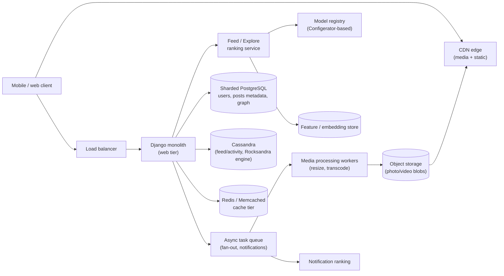
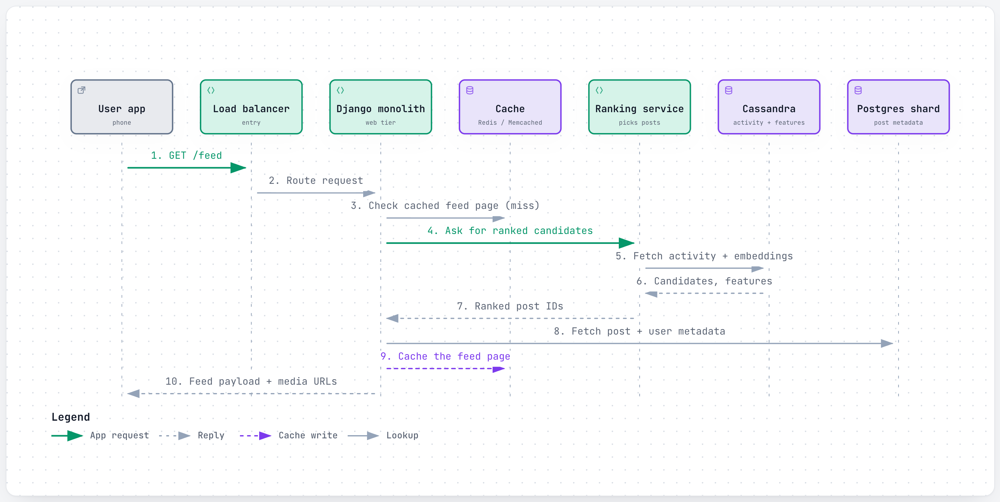
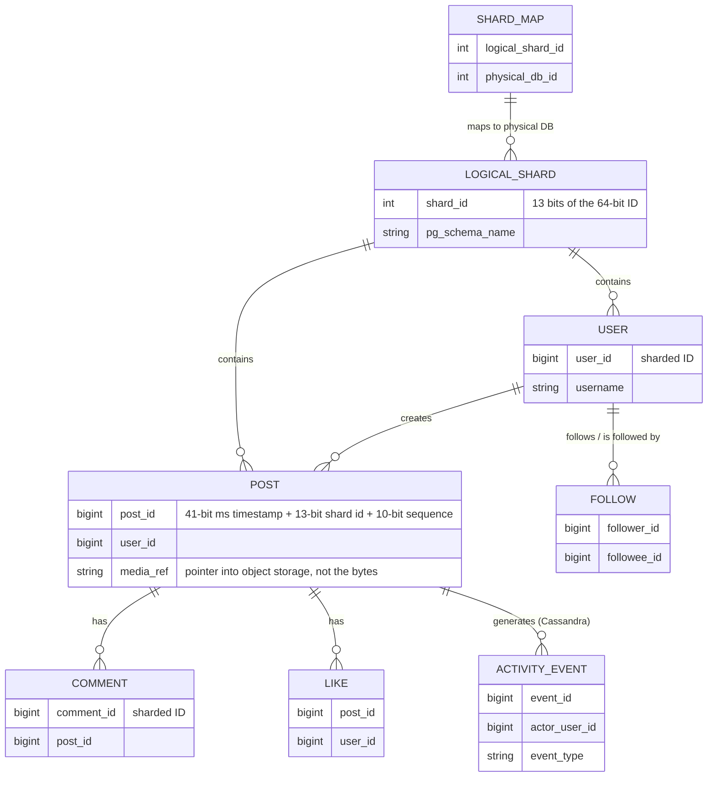
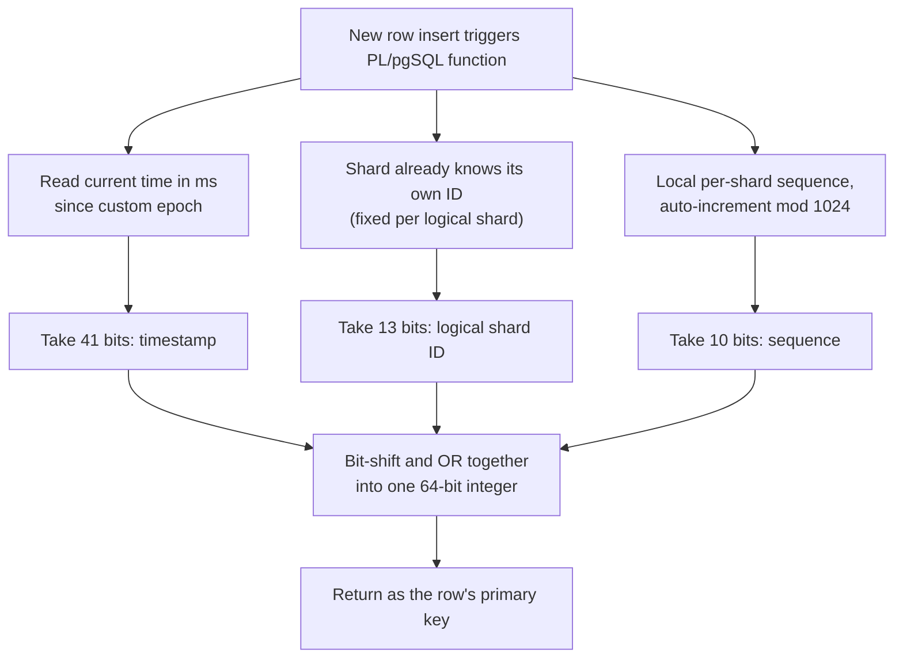
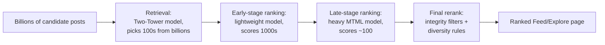
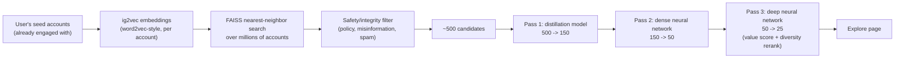
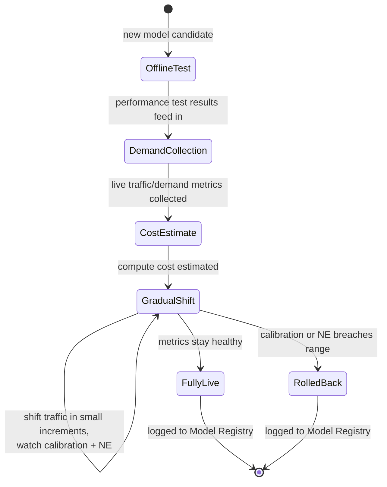
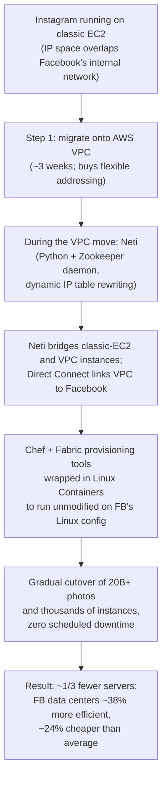

# Instagram: how a feed for billions of people ranks itself in milliseconds

> **In 60 seconds:** Instagram started in 2010 as a single Django + PostgreSQL box and grew into a Django monolith with millions of lines of code serving over a billion users, deployed roughly 30-50 times a day [4][9]. Unique IDs are minted independently inside thousands of sharded PostgreSQL schemas using a scheme conceptually like Twitter's Snowflake, but implemented with plain PL/pgSQL instead of a separate ID service [1]. Feed, Stories, Reels, comments, and notifications are each ranked by one of 1,000+ machine-learning models running in a multi-stage retrieval-then-ranking funnel [6][7]. Write-heavy social data (activity, feed edges) lives in Apache Cassandra, whose storage engine Instagram rebuilt on RocksDB ("Rocksandra") to cut tail latency 3x [3]. Photos are stored in object storage and served through a CDN, entirely off Instagram's application servers [2].

**Last reviewed:** September 2026 · **Difficulty:** Intermediate · **Reading time:** ~30 min

## Table of contents

- [Before you read: design it yourself](#before-you-read-design-it-yourself)
- [The problem](#the-problem)
- [Scale](#scale)
- [Back-of-the-envelope math](#back-of-the-envelope-math)
- [Requirements](#requirements)
- [How it evolved](#how-it-evolved)
- [High-level design](#high-level-design)
- [Low-level design](#low-level-design)
- [Deep dives](#deep-dives)
- [What happens when things break](#what-happens-when-things-break)
- [Key design decisions](#key-design-decisions)
- [Interview takeaways](#interview-takeaways)
- [Glossary](#glossary)
- [Sources](#sources)

## Before you read: design it yourself

Try each question for 5 minutes on your own before reading the "how" — that's the exercise, not a formality.

### Q1. How do you generate unique IDs across thousands of independent database shards, with no shard ever needing to ask another shard (or a central service) for a number?

<details><summary>Hint</summary>

Consider encoding "which shard made this" directly into the ID itself, instead of looking it up afterward.

</details>

<details><summary>How Instagram does it</summary>

A PL/pgSQL function (code that runs inside PostgreSQL itself) builds each 64-bit ID out of three parts: 41 bits of millisecond timestamp, 13 bits identifying the logical shard, and 10 bits from that shard's own local auto-incrementing sequence. Uniqueness comes from the shard-ID bits alone — shard 42 and shard 99 can hand out IDs at the exact same millisecond with zero risk of collision, because neither ever has to check in with the other. This is conceptually like Twitter's Snowflake, but built into Postgres instead of a whole separate ID service Instagram would have had to operate. Cost: a hard ceiling of 1,024 new rows per shard per millisecond.

Deep dive: [The sharded ID scheme](#the-sharded-id-scheme-instagrams-alternative-to-snowflake)

</details>

### Q2. How do you rank an effectively infinite pool of candidate posts, for over a billion people, in real time, without one model trying to do everything?

<details><summary>Hint</summary>

Think about spending cheap compute on a huge pool first, then expensive compute on only what survives.

</details>

<details><summary>How Instagram does it</summary>

Ranking runs as a funnel, not one model: a **Two-Tower** network (one half encodes the user, one half the candidate post, each side cacheable independently) handles retrieval and early ranking cheaply over billions of candidates, narrowing to roughly 100; a heavier multi-task model then scores that shortlist for click/like/"see less" and combines them into one expected-value score; a final pass applies integrity filters and diversity rules. Each stage's whole job is to make the next, more expensive stage's problem small enough to afford. By 2025 this pattern repeated across Feed, Stories, Reels, comments, and notifications as 1,000+ separate models.

Deep dive: [Feed and Explore ranking](#feed-and-explore-ranking-from-one-sort-order-to-1000-models)

</details>

### Q3. Hundreds of engineers ship to the same codebase every day — how do you keep it shippable without splintering it into microservices?

<details><summary>Hint</summary>

Consider that the thing that needs to scale isn't the number of services — it's the tooling around shipping to one.

</details>

<details><summary>How Instagram does it</summary>

Instagram never had a forcing function that pushed it into microservices — instead it stayed one Django monolith (several million lines, a few thousand endpoints) and invested in the tooling to keep that safe: a canary pipeline (Sauron for release tracking, Jenkins for test gating, Facebook's distributed SSH system for the rollout itself, replacing earlier Fabric scripts) pushes new code to a small slice of servers first and only promotes fleet-wide if error rates stay healthy, schema changes ship as feature-toggled dual-read/dual-write paths instead of one-shot migrations, and static-analysis tooling scans the whole codebase for known-bad patterns instead of relying purely on human code review. Cost: a slow or flaky test suite becomes everyone's problem at once, since every engineer's change lands in the same shared codebase.

Deep dive: [The Django monolith at scale](#the-django-monolith-at-scale)

</details>

### Q4. With 1,000+ ranking models in production, how do you notice the moment one of them silently stops working, without a human watching every dashboard?

<details><summary>Hint</summary>

Think about metrics that catch a model quietly degrading toward "no better than a coin flip," not just metrics that catch it crashing.

</details>

<details><summary>How Instagram does it</summary>

Every model in a shared **Model Registry** gets tracked on two health metrics: **calibration** (ratio of predicted to actually-observed click-through rate — 1 is trustworthy) and **normalized entropy** (how well it still separates "will happen" from "won't" — near 1 means it has degraded to guessing). A model breaching its healthy range on either metric gets flagged automatically, and every new model rollout ramps up gradually while shifting traffic — rather than one 100% cutover — so a regression caught mid-rollout only ever affects a bounded slice of traffic *(inference: the source describes gradual traffic shifting and stability alerting, not an automatic link between them)*.

Deep dive: [What happens when things break](#what-happens-when-things-break)

</details>

## The problem

You are on your commute, phone in hand, and you pull down to refresh Instagram. In the next few hundred milliseconds, a server somewhere has to figure out: out of everyone you follow, everyone Instagram thinks you might like, every ad slot it needs to fill, and every post uploaded in the last few minutes, which handful of items do you see first?

At the same time, on a different server, someone else just tapped the shutter button — that photo needs a permanent globally-unique ID, a place to live that will survive a hard drive dying, and a path onto CDNs on every continent before their friends can see it.

Both of those things have to happen at a scale where a single database, a single ID counter, or a single file server would fall over instantly. This page answers four hard questions:

1. How do you generate unique, roughly time-ordered IDs across thousands of database shards without a single point of failure or a central coordinator?
2. How do you rank an effectively infinite pool of candidate posts, for over a billion people, in real time, without one model trying to do everything?
3. How do you keep a codebase that hundreds of engineers touch every day shippable, without splintering it into hundreds of microservices?
4. How do you keep 1,000+ separate ranking models honest — noticing the moment one of them quietly stops working — without a human watching every dashboard?

## Scale

| Metric | Number | Source |
|---|---|---|
| Users, 2011 | 14M+ users on 3 engineers | [2] |
| Photo/like write rate, 2011 | ~25 photos/sec, ~90 likes/sec | [1] |
| Deploys per day, 2016 | 30-50 deploys/day across thousands of machines | [9] |
| Photos moved off AWS, 2014 | 20 billion+ photos migrated to Facebook's own data centers | [10][11] |
| Users during the 2014 migration | ~200 million, roughly doubling while the migration was still in progress | [11] |
| Interim VPC migration, 2014 | ~3 weeks to move onto AWS VPC, as a prerequisite before the full Facebook data-center cutover | [11] |
| Facebook data-center efficiency, 2014 | ~38% more efficient and ~24% cheaper to run than the average data center of the time | [10] |
| Cassandra tail latency before Rocksandra | P99 read latency ~60ms | [3] |
| Cassandra tail latency after Rocksandra | P99 read latency ~20ms (3x reduction) | [3] |
| GC stalls before/after Rocksandra | 2.5% -> 0.3% of server runtime spent in stop-the-world GC (10x reduction) | [3] |
| ML models in production, 2025 | 1,000+ models across Feed, Stories, Reels, comments, notifications | [6] |
| Explore daily reach, 2023 | hundreds of millions of people visit Explore daily | [7] |
| Explore monthly reach, 2019 | over half of Instagram's monthly users visited Explore | [19] |
| Explore candidate-to-shown ratio, 2023 | billions of candidate posts narrowed to the ~100 best that the heavy second-stage model scores | [7] |
| Explore scale, 2019 | ~65 billion features evaluated and ~90 million model predictions served, every second | [19] |
| Model launch velocity, 2025 | a few launches/week -> 10+ launches/week after tooling investment | [6] |
| Engineer-time saved per launch, 2025 | 2+ days saved per model launch after automating what used to be manual 20% traffic-shift steps | [6] |

These numbers describe two different scaling problems that show up throughout this page: raw write throughput (25 photos/sec sounds small today, but it drove a from-scratch ID design in 2011) and *ranking* throughput — going from one global sort order to over a thousand purpose-built models is what it takes to keep ranking relevant once "everyone you follow" stops being a small list.

The AWS-to-Facebook migration number (20 billion photos, zero downtime) is a reminder that "hard scale problems" aren't only steady-state traffic — one-time migrations at this size are themselves a systems-design problem, and the platform-tooling numbers (1,000+ models, calibration/NE monitoring) are a reminder that at a certain point, *managing* scale becomes its own separate scale problem, distinct from serving traffic at all [6].

## Back-of-the-envelope math

This is the rough arithmetic engineers sketch on a whiteboard to size a system before writing any code — good enough to catch a design that's off by orders of magnitude, not meant to be exact. Inputs marked [n] are pulled straight from the [Scale](#scale) table above and match it exactly; everything else is an explicit **Assumption**, never presented as fact.

### 1. Photos and likes per day at the 2011 write rate, and the storage that implies

**Question:** At Instagram's 2011 write rate (~25 photos/sec, ~90 likes/sec) [1], how many photos and likes accumulate in a day, and how much storage does a day of photos need?

**Inputs:**
- Photo write rate, 2011: ~25 photos/sec [1]
- Like write rate, 2011: ~90 likes/sec [1]
- 1 day = 86,400 s (rule of thumb)
- Assumption: average photo size ≈ 200 KB (a compressed JPEG upload, one baseline copy before multiple resolutions)

**Math:**
```text
photos/day = 25 photos/s × 86,400 s/day
           = 2,160,000 photos/day  (~2.16M/day)

likes/day = 90 likes/s × 86,400 s/day
          = 7,776,000 likes/day  (~7.78M/day)

storage/day (photos only) = 2,160,000 photos × 200 KB
                           = 432,000,000 KB
                           = 432,000 MB
                           = 432 GB/day
```

**Answer:** ~2.16M photos/day, ~7.78M likes/day, and ~432 GB/day of raw photo storage at the 2011 rate.

**What it tells you:** even this "small" 2011 write rate needed a from-scratch ID scheme — ~2.16M new photo IDs/day, generated across thousands of independent database shards, meant no single central counter could keep up without becoming a bottleneck or single point of failure. See [The sharded ID scheme](#the-sharded-id-scheme-instagrams-alternative-to-snowflake).

### 2. Features evaluated per single Explore prediction

**Question:** In 2019, Explore evaluated ~65 billion features and served ~90 million model predictions, every second [19] — how many features does that work out to per single prediction?

**Inputs:**
- Explore scale, 2019: ~65 billion features/sec, ~90 million predictions/sec [19]

**Math:**
```text
features/prediction = 65,000,000,000 / 90,000,000
                     = 722.2 features per prediction  (~722)
```

**Answer:** ~722 features evaluated per model prediction.

**What it tells you:** that's a rich feature vector for a single real-time ranking decision, which pushes ranking toward the multi-stage funnel Explore actually runs — a cheap first pass narrows billions of candidates before the expensive ~722-feature model ever touches them. See [Feed and Explore ranking](#feed-and-explore-ranking-from-one-sort-order-to-1000-models).

### 3. How selective the Explore funnel actually is

**Question:** Explore in 2023 narrows "billions of candidate posts" down to the ~100 best that the heavy second-stage model scores [7] — treating "billions" conservatively as 2 billion, what selectivity does the funnel achieve?

**Inputs:**
- Explore candidate-to-shown ratio, 2023: billions of candidates → ~100 shown [7]
- Assumption: "billions" ≈ 2,000,000,000 (a conservative low-end reading of the plural)

**Math:**
```text
candidates per surviving post = 2,000,000,000 / 100
                                = 20,000,000

selectivity = 100 / 2,000,000,000
             = 0.00000005  (5 × 10^-8)
```

**Answer:** roughly 1 candidate survives out of every 20 million (assuming "billions" ≈ 2B) — even at a much higher "billions" reading (say 10B), it's still about 1-in-100-million.

**What it tells you:** a filter that aggressive can't be one expensive model run over every candidate — it has to be a cheap, cascading multi-stage funnel where each stage discards most of what the previous stage kept, and only the smallest surviving set gets the expensive treatment. See [Feed and Explore ranking](#feed-and-explore-ranking-from-one-sort-order-to-1000-models).

### 4. Wall-clock GC time reclaimed per server by Rocksandra

**Question:** Rocksandra cut stop-the-world GC time from 2.5% to 0.3% of server runtime [3] — over a 24-hour day, how much wall-clock time per server did that reclaim?

**Inputs:**
- GC stalls before/after Rocksandra: 2.5% → 0.3% of server runtime [3]

**Math:**
```text
GC time before = 24 h × 0.025
               = 0.6 h/day = 36 minutes/day

GC time after = 24 h × 0.003
              = 0.072 h/day = 4.32 minutes/day

time reclaimed/server/day = 36 − 4.32
                           = 31.68 minutes/day  (~32 minutes)
```

**Answer:** ~32 minutes of GC-stall time reclaimed per server per day (a ~10x reduction, matching the page's own framing).

**What it tells you:** "10x fewer GC pauses" turns into a concrete ~32 minutes/server/day once converted to wall-clock time — at the thousands of machines behind Instagram's 2016 deploy scale [9], that's the difference between GC stalls being background noise and a capacity tax large enough to justify a purpose-built storage engine. See [Cassandra and the Rocksandra storage engine](#cassandra-and-the-rocksandra-storage-engine).

**Rules of thumb used:**

| Convention | Value used here |
|---|---|
| Time unit ladder | 1 day = 86,400 s; 1 day = 24 hours = 1,440 minutes |
| Storage/byte ladder | 1,000 KB = 1 MB; 1,000 MB = 1 GB (decimal) |
| "Billions" / "hundreds of millions" style figures | treated as the stated low-end round number (e.g. "billions" → 2 × 10^9) and flagged as an Assumption |
| Percent-of-runtime figures | converted to wall-clock time via percentage × total period (e.g. 2.5% of 24h = 36 min) |
| Peak vs. average | general convention: peak ≈ 2-3x daily average for systems with daily/weekly demand cycles (not directly needed above, since these figures were already rates or ratios) |

## Requirements

**Functional:**
- Upload photos/video, and have them show up in followers' feeds — the core loop the whole system exists to serve.
- View a ranked Feed, Stories, Reels, and Explore — each is its own ranking problem with different signals and goals [6].
- Follow/unfollow accounts, like, comment, send DMs — the graph and engagement actions that both drive and are inputs to ranking.
- Get notified of relevant activity — itself a ranked surface, not a simple chronological list [8].

**Non-functional:**
- **Low feed-load latency** — every extra hundred milliseconds is a hundred milliseconds a user can decide to close the app instead; ranking has to happen in the request path, not batch.
- **Read-heavy, write-light data access** — a single post is written once and read by every follower's feed load, so the system is built around cheap fan-out and aggressive caching rather than optimizing writes.
- **No single point of failure for ID generation** — thousands of database shards each need to mint unique IDs continuously; a central ID service that goes down would stop writes everywhere at once [1].
- **Durability of media above almost everything else** — a photo is often the only copy of that moment a user has; losing it is much worse than a slow load.
- **Eventual consistency is acceptable for social data** — a like count that's a few seconds stale, or a feed that's briefly out of order, doesn't hurt anyone; this is what allows Cassandra's tunable, non-linearizable consistency model to be a good fit for feed/activity data [3].
- **A shippable monolith at hundreds-of-commits-per-day velocity** — hundreds of engineers need to ship to the same codebase without stepping on each other or breaking production, which shaped Instagram's investment in canary deploys and static analysis tooling rather than a rewrite into services [4][9].
- **Ability to migrate live infrastructure across environments with no scheduled downtime** — proven necessary for real in 2014, when Instagram moved its entire footprint off AWS onto Facebook's data centers while its user base kept growing through the move; a system already serving hundreds of millions of people can't accept a maintenance window for something like a data-center move [10][11].
- **Automatic detection when a ranking model silently degrades** — with 1,000+ models in production, waiting for a human to notice a bad dashboard doesn't scale; model health has to be measured and flagged by the platform itself [6].

## How it evolved

| Era | What Instagram ran | What broke / what changed |
|---|---|---|
| 2010 launch | Single Django + PostgreSQL box on AWS | Simplest thing that could work for a brand-new app |
| 2011 (14M users, 3 engineers) | PostgreSQL split into thousands of logical shards (schemas) mapped onto a handful of physical DBs; Redis for the main feed, activity feed, and sessions; Memcached; S3 + CloudFront for media; Gearman task queue for async fan-out and cross-posting | A single Postgres instance couldn't hold the write volume or dataset size; a custom sharded-ID scheme (see [Deep dives](#deep-dives)) was built so every shard could mint IDs independently [1][2] |
| 2012 | Facebook acquires Instagram; Instagram begins using Cassandra to replace Redis for fraud detection, Feed, and the Direct inbox | Redis requires all data to fit in RAM; Cassandra's disk-backed LSM-tree model adds horizontal scale [2][3] |
| 2013-2014 | Instagram migrates fully off AWS onto Facebook's own data centers | 20 billion+ photos moved with zero user-visible downtime; about a year of planning plus a month of execution; Instagram came out of it running on roughly a third fewer servers *(third-party)* [10][11] |
| 2016 | Feed switches from strict reverse-chronological order to an ML-ranked order; continuous deployment matures (canary pushes tracked in Sauron, gated by Jenkins, 30-50 deploys/day) | Users were missing the majority of posts from accounts they cared about under a pure time-ordered feed; a relevance-ranked order was rolled out instead *(third-party)* [9][16] |
| ~2017-2018 | Cassandra grows into one of the world's largest deployments | JVM garbage-collection pauses were a major contributor to P99 read latency; Instagram built "Rocksandra," a RocksDB-backed pluggable storage engine for Cassandra, and open-sourced it, cutting P99 latency from ~60ms to ~20ms [3] |
| 2019 | Explore ranking rebuilt around **ig2vec** account embeddings (word2vec-style), **FAISS** nearest-neighbor retrieval, and a three-pass ranking funnel (500 -> 150 -> 50 -> 25 candidates), running under a custom query language called **IGQL** | Candidate generation needed to scale past simple content classification, and engineers needed a way to write new ranking logic without hand-optimizing C++ for every change [19] |
| 2023 | Explore recommendations become a four-stage funnel (retrieval -> first-stage ranking -> second-stage ranking -> integrity/diversity rerank) using Two-Tower neural networks and cached embeddings | Ranking billions of candidate items per request for hundreds of millions of daily visitors needed staged filtering instead of one big model scoring everything [7] |
| 2025 | Recommendation system reaches 1,000+ models across Feed, Stories, Reels, comments, and notifications, backed by a shared Model Registry (on Meta's Configerator), an automated launch platform, and an SLO framework called SLICK | Running one model per surface stopped being enough — model *management* itself became the bottleneck, so Instagram built platform tooling around the models rather than one bigger model [6][8] |

### The startup years (2010-2012)

Instagram wasn't the founders' first idea. Kevin Systrom and Mike Krieger started out building **Burbn**, a location check-in app in the mould of Foursquare that also let people post future plans and earn points for hanging out with friends, and raised $500,000 in seed funding in March 2010 to build it *(third-party)* [20].

Burbn was cluttered and tried to do too much; watching how people actually used it, the founders noticed that the one feature people kept coming back to was posting photos, so they stripped nearly everything else out and rebuilt the product around that single feature, renaming it Instagram *(third-party)* [20].

The iOS-only app launched on October 6, 2010; an Android version didn't ship until nearly two years later, in April 2012, and was downloaded more than a million times in under 24 hours *(third-party)* [20]. Instagram ran as a two-person engineering team through that initial growth curve — the "3 engineers" figure in the Scale table above is from a year later, in 2011, once the company had grown just slightly [2].

Instagram launched as the simplest thing that could work: one Django application, one PostgreSQL database, running on AWS [2]. That held up until growth made a single database the bottleneck — by 2011, at 14 million users and still just 3 engineers, Instagram was writing about 25 photos and 90 likes every second, a rate one un-sharded Postgres instance could not absorb forever [1][2].

Rather than reach for an off-the-shelf distributed ID service, Instagram split Postgres into thousands of logical shards (schemas) and pushed ID generation down into each shard itself using a PL/pgSQL function — the scheme detailed in the [sharded ID deep dive](#the-sharded-id-scheme-instagrams-alternative-to-snowflake) below [1].

Media never touched this database at all: photos went straight to S3, served through CloudFront, with Redis powering the main feed, activity feed, and sessions, and a Gearman task queue handling everything that could happen asynchronously (cross-posting, notifications, fan-out) [2].

### Joining Facebook's infrastructure (2012-2014)

Facebook's 2012 acquisition — reported at roughly $1 billion, announced in April 2012, the same month the Android app shipped — didn't immediately change Instagram's architecture, but it set up the next two big moves *(third-party)* [20]. First, Instagram began using Cassandra in 2012 to replace Redis for fraud detection, Feed, and the Direct inbox [3].

Second, and far larger in scope: over 2013-2014, Instagram moved off AWS entirely and onto Facebook's own data centers — a migration that turned out to be much harder than "copy the files over," because **Facebook's private internal IP address space directly conflicted with the IP address space Instagram's servers already occupied inside classic Amazon EC2** *(third-party)* [11].

So the team first migrated Instagram's entire footprint onto **Amazon VPC**, whose "addressing flexibility" avoided conflicts with Facebook's private network, and planned to cross to Facebook over **Amazon Direct Connect**; the engineers who ran it (Rick Branson, Pedro Cahauati, and Nick Shortway) described it as the fastest VPC migration at that scale ever, completed in about three weeks *(third-party)* [11].

During the VPC move, AWS offered no way to share security groups or bridge private classic-EC2 and VPC networks, so they built **Neti**, a Python + **Zookeeper** "dynamic IP table manipulation daemon" that supplied the security-group behavior and gave every instance a single address regardless of which of the two networks it ran in *(third-party)* [11].

Because Facebook's data centers ran a different, customized Linux configuration than Instagram's AWS hosts, the team also wrapped their existing provisioning tools — Chef and Fabric — inside **Linux Containers**, so those tools kept working unmodified instead of needing a from-scratch port *(third-party)* [11].

All of this happened live: Instagram's user base grew through roughly 200 million during the migration, doubling over its course, with thousands of EC2 instances continuing to serve production traffic the entire time — which is exactly why a temporary bridging layer, rather than a single cutover, was the right shape for the problem (see the [migration deep dive](#the-2014-aws-to-facebook-migration-solving-an-ip-space-collision-without-downtime) below) *(third-party)* [11].

The finished migration moved more than 20 billion photos, took about a year of planning plus a month of execution, and left Instagram running on roughly a third fewer servers than before — Facebook's data centers reportedly ran about 38% more efficiently and 24% cheaper than the industry average at the time *(third-party)* [10][11].

### The ranking era (2016-2025)

With storage and infrastructure questions settled, the next decade of changes was almost entirely about *ranking*. In 2016, Feed moved from strict reverse-chronological order to a relevance-ranked order, because a growing follow-graph meant most of what a user's followed accounts posted was scrolling past unseen *(third-party)* [16].

Instagram later disclosed real numbers behind that decision: under the old chronological order, users were missing about 70% of all posts in their feed, and roughly 50% of posts specifically from friends; after the switch to ranked order, Instagram reported that figure improved to around 90% of friends' posts seen *(third-party)* [16].

The change was not universally welcomed — TechCrunch reported "backlash about confusing ordering" after the rollout, and Instagram said in 2018 it wasn't considering a chronological option, on the stated grounds that it didn't want to add more complexity *(third-party)* [16].

By 2018, Instagram had publicly named the specific signals behind that ranking *(third-party)* [16]:

- **Interest** — predicted engagement, informed by machine-vision analysis of the post itself.
- **Recency** — how recently the post was shared.
- **Relationship** — how often you interact with that account via comments/tags.
- **Frequency** (secondary) — how often you open the app, which affects how much gets "caught up" per session.
- **Following count** (secondary) — a bigger following count spreads the ranking budget thinner per account.
- **Usage** (secondary) — how long you browse determines whether you reach only the top posts or dig into the deeper catalog.

Those six signals from 2018 are the direct ancestors of the weighted expected-value scoring described in the [ranking deep dive](#feed-and-explore-ranking-from-one-sort-order-to-1000-models) below.

Three years after the ranked-feed switch, in 2019, Instagram's engineering team gave the clearest public account yet of how Explore specifically decides what to show: a candidate-generation stage built on **ig2vec** — embeddings for every account, learned the same way word2vec learns word embeddings, by treating the sequence of accounts a person engages with as if it were a sentence — retrieved via Facebook's **FAISS** nearest-neighbor library.

That candidate pool fed a three-pass ranking funnel that narrowed 500 candidates down to 150, then 50, then a final 25, all running under a custom query language called **IGQL** so engineers could write new ranking logic in Python-like syntax that still compiled down to efficient C++ [19].

That 2019 architecture is the direct ancestor of the four-stage 2023 funnel described later on this page — the exact stage count and model types changed, but the underlying shape (cheap and broad, then progressively narrower and more expensive) didn't [7][19].

That single ranking problem grew into a genuine platform: by 2023, Explore alone was running a four-stage retrieval-then-ranking funnel over billions of candidate items for hundreds of millions of daily visitors [7].

By 2025, the same funnel pattern had been replicated across Feed, Stories, Reels, comments, and notifications — more than 1,000 separate models in production — at which point the hard problem stopped being "build one more ranking model" and became "manage a thousand of them," answered with a shared Model Registry, an automated launch platform, and the SLICK SLO framework [6][8].

Instagram's own head of product, Adam Mosseri, has since put a public face on a subset of those signals: statements compiled from his public comments in early 2025 name watch time, likes per reach, and DM shares as the three most important ranking signals, with "sends per reach" (a post shared into a DM) reportedly weighted 3-5x heavier than a like when it comes to reaching people who don't already follow the account *(third-party, secondhand-compiled statements, not a primary Instagram engineering source)* [18].

Underneath all of this, Cassandra kept scaling too: once clusters passed roughly 1,000 nodes, JVM garbage-collection pauses started dominating tail latency, which is what motivated Rocksandra — swapping in a RocksDB storage engine while keeping Cassandra's distributed-systems layer intact [3].

### The arc, end to end

| Layer | 2011 (14M users, 3 engineers) | Today |
|---|---|---|
| Backend | Single Django monolith on AWS | Still a Django monolith — several million lines, a few thousand endpoints — just with far more deployment tooling around it [4][14] |
| ID generation | Thousands of PL/pgSQL-sharded Postgres schemas | Same core scheme, unchanged in shape since 2011 [1] |
| Feed order | Reverse-chronological | Ranked by a multi-stage funnel behind 1,000+ ML models *(third-party)* [6][16] |
| Activity/feed data store | Redis (all in RAM) | Cassandra, running Instagram's RocksDB-backed Rocksandra storage engine [3][13] |
| Media hosting | Amazon S3 + CloudFront | Facebook's own data centers, since the 2014 migration *(third-party)* [10][11] |
| Networking | Classic Amazon EC2 IP space | Facebook's private data-center network — reached via an interim move to Amazon VPC (with Neti, a purpose-built IP-table daemon, bridging classic EC2 and VPC) and Amazon Direct Connect *(third-party)* [11] |
| Deployment | Manual, small team | Canary pipeline (Sauron + Jenkins + Fabric), 30-50 deploys/day [9] |
| Model operations | None — one sort order, no models to manage | Model Registry (Configerator-backed) + automated launch platform + SLICK health monitoring across 1,000+ models [6] |

Reading down that table, the pattern is the same one that shows up at every company on this kind of page: almost nothing was replaced because the original choice was wrong — a single Postgres box, Redis-in-RAM, and a plain reverse-chronological feed were all reasonable choices at the scale they were made. Each row on the right exists because the row on the left hit a specific, named number (25 writes/sec on one DB, Redis's everything-in-RAM limit, a feed nobody could keep up with) that forced a replacement.

## High-level design



Walking through a feed load:

1. The client hits a **CDN edge** for anything cacheable (static assets, already-processed media) and a **load balancer** for everything dynamic [2].
2. The load balancer routes the request into the **Django monolith** — the same several-million-line, few-thousand-endpoint codebase serves nearly every kind of request, from feed loads to uploads to settings pages [4][14].
3. For a feed/Explore/Reels request, the monolith calls the **ranking service**, which pulls candidates and scores them using models pulled from a **model registry** and features from a **feature/embedding store** [6][7].
4. Post and user metadata (captions, usernames, the follow graph) live in **sharded PostgreSQL**, addressed using the sharded ID scheme described below [1].
5. High-write, high-fan-out data — the activity feed, likes, comments-as-events — lives in **Cassandra**, running Instagram's RocksDB-backed storage engine for predictable tail latency [3].
6. A **cache tier** (Redis and Memcached) sits in front of both stores to absorb the read traffic a feed load generates [2].
7. Uploads go through an **async task queue** (originally Gearman) so the user-facing upload request returns fast while background workers handle the slow work; media lives in **object storage**, from which the **CDN** serves it to everyone else [2]. *(The "media processing workers" resize/transcode box is a reference-design assumption; [2] names cross-posting, notifications, and feed fan-out as the queued work.)*
8. The same queue also drives **notification ranking**, which is its own ML-ranked surface, not a simple activity log [8].

## Low-level design

### 1. Core flow: loading a ranked Feed

<a href="https://alwintwk.github.io/big-tech-system-design/diagrams/companies-instagram-feed.html">
  <picture>
    <source media="(prefers-color-scheme: dark)" srcset="../diagrams/companies-instagram-feed.dark.png">
    
  </picture>
</a>

<sub>Click the diagram for the interactive version (zoom, dark mode, trace a path).</sub>

1. The app requests a feed page; the monolith first checks the cache tier, since most feed reads are re-reads of recently computed pages [2].
2. On a miss, the ranking service pulls candidates from Cassandra-backed activity/feed data and scores them through the retrieval -> early-stage -> late-stage ranking funnel described in the [ranking deep dive](#feed-and-explore-ranking-from-one-sort-order-to-1000-models) [6][7].
3. Once an ordered list of post IDs comes back, the monolith resolves those IDs against sharded Postgres to get the actual captions/usernames/counts, using the shard-ID scheme to know which shard to query without a lookup service [1].
4. The assembled page (metadata plus media URLs, not media bytes) is cached and returned; the client then fetches the actual image/video bytes straight from the CDN, never through the application servers [2].

### 2. Data model: sharded IDs and the core entities



Every ID with a comment above marked "sharded ID" is generated by the scheme in the next section: the shard is chosen up front (usually by hashing the owning user ID), and then that shard mints the actual numeric ID on its own, so no cross-shard coordination is needed on the write path [1].

### 3. Signature component: the sharded ID generator



1. Each of Instagram's PostgreSQL **logical shards** is just a schema; many logical shards live on each **physical** database server, and logical shards can be moved between physical servers later without re-numbering any data, because the shard ID is baked into every row's ID [1].
2. When a new row is inserted, a PL/pgSQL function builds a 64-bit ID out of three parts: 41 bits of millisecond timestamp (using a custom epoch, giving about 41 years of headroom), 13 bits identifying the logical shard, and 10 bits from a local auto-incrementing sequence that wraps modulo 1024 [1].
3. That last part is the throughput limit of the design: each shard can mint at most 1,024 IDs per millisecond before the sequence wraps within that same millisecond — comfortably above Instagram's 2011 write rate of ~25 photos/sec and ~90 likes/sec, since that load was already spread across thousands of shards [1].
4. Instagram evaluated Twitter's Snowflake (a separate ID-generation service) first, but chose to build this inside PostgreSQL instead, because running an entirely new distributed service was more operational complexity than they wanted for a conceptually similar result [1].

### 4. Secondary flow: the feed/Explore ranking funnel



This four-stage funnel is how Instagram avoids running an expensive model over every possible candidate: each stage narrows the field and only spends heavy compute on what survives the previous, cheaper stage [7].

## Deep dives

### The sharded ID scheme (Instagram's alternative to Snowflake)

**What it is:** a way to generate globally unique, roughly time-sortable 64-bit IDs across thousands of independent database shards, with no shard ever needing to talk to another shard or a central service to mint an ID [1].

**The problem it solved:** a single PostgreSQL auto-increment counter can't survive being split across thousands of shards — two different shards would eventually generate the same ID. Twitter's Snowflake solves this with a dedicated ID-generation service, but Instagram wanted the same property without operating a new kind of service [1].

**How it works inside:** every table's primary key is produced by a PL/pgSQL function, not by native `SERIAL`/auto-increment:

```
id = (ms_since_custom_epoch << 23) | (logical_shard_id << 10) | (local_sequence % 1024)
```

The timestamp portion means IDs are roughly sortable by creation time even across shards. The shard-ID portion means you can tell which shard a row lives in just by looking at its ID — no separate lookup table needed for routing reads. The sequence portion is the only part that's actually a per-shard auto-increment, so it can never collide with another shard's sequence [1].

> **Why this matters:** this is the single most commonly asked-about pattern in system design interviews for anything with "generate unique IDs at scale" in the prompt. Instagram's answer — encode the shard *inside* the ID rather than looking it up — is a smaller, cheaper design than Snowflake's, at the cost of a hard 1,024-ID-per-shard-per-millisecond ceiling [1].

**Worked example (illustrative, following the scheme in [1]):** say a new like lands on logical shard 42 at some millisecond `T` since the custom epoch. If that shard hasn't inserted anything else in that same millisecond, its local sequence is 0, so the row gets `id = (T << 23) | (42 << 10) | 0`. A microsecond later, a second like lands on the *same* shard in the *same* millisecond `T` — the sequence bumps to 1, giving `id = (T << 23) | (42 << 10) | 1`.

Meanwhile shard 99, on a different physical database entirely, is free to hand out `id = (T << 23) | (99 << 10) | 0` at the exact same instant — the shard-ID bits alone guarantee no collision, without shard 42 and shard 99 ever exchanging a single message. That's the entire point of the design: uniqueness is guaranteed by construction, not by coordination.

| Scheme | Coordination needed | Sortable by creation time | Where the shard lives |
|---|---|---|---|
| Plain database auto-increment | Yes — one counter, one database | Yes | N/A — doesn't shard |
| UUID (v4, random) | None | No | Not encoded in the ID |
| Twitter Snowflake (separate ID service) | None (once assigned) | Approximately | Not encoded in the ID; needs a lookup |
| Instagram's sharded PL/pgSQL scheme | None | Approximately | Encoded directly in the ID's shard-ID bits [1] |

**What it costs:** the 10-bit sequence caps a single shard at 1,024 new rows per millisecond; if any one shard's write rate ever needed to exceed that, the bit allocation (41/13/10) would need to change, which is a much bigger migration than adding another sharded server.

### Feed and Explore ranking: from one sort order to 1,000+ models

**What it is:** the system that decides, per user per request, what order to show Feed, Stories, Reels, comments, and notifications in — no longer a single global ranking, but a distinct model (or several) per surface. Instagram's own Stories/Feed ML team has described this recommender system as serving over a billion users on a regular basis [5][6].

**The problem it solved:** Instagram's original Feed was reverse-chronological. As the number of accounts a typical user followed grew, a plain time-order feed meant most posts a user actually cared about scrolled past unseen before they ever opened the app *(third-party)* [16]. Sorting by predicted relevance instead of time fixed that, but predicting relevance for billions of candidate posts per request is a much harder computational problem than sorting by timestamp.

**How it works inside:** ranking runs as a funnel, not one model. A **Two-Tower neural network** — one tower encodes the user, one encodes the candidate post, and each tower's output can be pre-computed and cached independently — handles retrieval and early-stage ranking cheaply, because item embeddings don't need to be recomputed per request [7].

The Two-Tower model is itself described by Instagram's own engineers as extending the same **Word2Vec** idea behind ig2vec (see the 2019 funnel detail below): instead of only handling account IDs as "words," it generalizes the embedding approach to arbitrary user- and item-level features, while keeping the property that made it useful in the first place — a user's and an item's embeddings can each be computed once and cached, rather than recomputed for every candidate comparison [7].

A heavier **multi-task multi-label (MTML)** model then scores the much smaller shortlist that survives retrieval, predicting several outcomes at once (click, like, "see less," etc.), which get combined into a single expected-value score:

```
Expected Value = W_click * P(click) + W_like * P(like) - W_see_less * P(see_less)
```

A final pass applies integrity filters and diversity rules before the page is returned [7].

By 2025, this pattern had been replicated across more than 1,000 separate models covering Feed, Stories, Reels, which comments surface, and which notifications are marked important — at which point the bottleneck stopped being modeling and became *managing* a thousand models: Instagram built a shared **Model Registry** (on top of Meta's internal Configerator config system), an automated launch platform that estimates capacity and shifts traffic, and an SLO framework called **SLICK** to keep track of it all [6].

**The 2019 funnel, in more mechanical detail:** four years before the 2023 four-stage funnel described above, Instagram's engineering team published a detailed account of the Explore-specific system that came before it, and the mechanics are worth walking through because they show *why* a staged, embedding-driven design was the natural next step [19].

Why account-level embeddings instead of just classifying post content? Instagram's own explanation is that content taxonomies don't hold up against how varied real interest communities are: "it's challenging to maintain a clear and ever-evolving catalog-style taxonomy for the large variety of interest communities on Explore — with topics varying from Arabic calligraphy to model trains to slime," and content-classification models struggle to generalize across that variety [19].

Account-level embeddings sidestep the taxonomy problem entirely — two accounts don't need a shared label to be treated as similar, just a similar pattern of who engages with them.

Candidate generation started from a user's **seed accounts** — accounts they'd already engaged with — and instead of classifying post content directly, Instagram trained ig2vec: an embedding for every account, learned the same way word2vec learns word embeddings, by treating the sequence of accounts a person interacts with as if it were a sentence of "words" [19].

Finding accounts topically similar to a user's seed accounts then became a nearest-neighbor search over these embeddings, run at the scale of millions of accounts using Facebook's own FAISS vector-similarity library [19].

Before any of that candidate set reaches ranking, a filtering pass removes anything ineligible for safety reasons: Instagram describes this as blocking "likely policy-violating content and misinformation," plus separate ML systems specifically for detecting spam [19].

That filtered candidate set fed a three-pass ranking funnel: 500 candidates went into a lightweight **distillation model** (a small model trained to mimic a heavier one, cheap enough to run over hundreds of items) that cut the field to 150; a denser neural network narrowed 150 down to 50; and a final deep neural network with the full feature set scored those 50 down to the 25 that actually appeared in Explore [19].

That final pass combined predicted actions into one value score — `w_like * P(Like) + w_save * P(Save) - w_negative_action * P(Negative Action)` — with an added diversity penalty so a single author couldn't dominate a page [19].

All of this ran under **IGQL**, a domain-specific query language purpose-built so engineers could write new ranking/retrieval logic in Python-like syntax while it compiled down to efficient C++ execution, avoiding a systems-code rewrite every time someone wanted to try a new ranking idea [19]. At the time of that post, the system was evaluating roughly 65 billion features and serving about 90 million model predictions every second, for a product that over half of Instagram's monthly users visited [19].

| 2019 Explore funnel stage | Candidates in | Candidates out | What it does |
|---|---|---|---|
| Candidate generation (ig2vec + FAISS) | Millions of accounts | ~500 | Nearest-neighbor search over account embeddings from seed accounts |
| Pass 1 (distillation model) | 500 | 150 | Cheap model mimicking a heavier one, prunes the bulk of the field |
| Pass 2 (dense neural network) | 150 | 50 | Denser features over a much smaller candidate set |
| Pass 3 (deep neural network) | 50 | 25 | Full feature set; final value-score + diversity rerank |



**Worked example (following the numbers in [19]):** say a user's seed accounts are five travel-photography accounts they regularly like. ig2vec's embeddings place accounts that get engaged-with in similar sequences close together in vector space — so a FAISS nearest-neighbor lookup from those five seed embeddings surfaces other travel-adjacent accounts the user has never seen, not because their captions mention "travel" but because their *audience-engagement pattern* looks like the seed accounts'.

Pulling recent media from that expanded account set produces the initial ~500-candidate pool.

From there, the funnel's whole job is compute economics: it would be too expensive to run the full deep model on all 500 candidates, so the distillation model's only task is to be a cheap, reasonably faithful stand-in that throws away the bottom 350 before the expensive models ever have to look at them.

Both this 2019 architecture and the 2023 four-stage funnel described elsewhere on this page share that same shape — cheap-and-broad, then progressively narrower and more expensive — even though the specific model types and stage counts changed between them [7][19].

**Keeping 1,000+ models honest: the platform layer.** Once the number of models crossed into the hundreds, the hard problem stopped being "rank well" and became "notice, quickly, when a model that used to rank well has quietly stopped." Instagram's answer combines two prediction-quality metrics with a schematized registry and an automated rollout system [6].

Every model in the registry gets a **criticality tier** (TIER0 through TIER4, reflecting how much business impact a regression in that model would have), stored as structured metadata in the **Model Registry** — described by Instagram's own engineers as "a system of record built on top of Configerator, Meta's distributed configuration suite" — which acts as the single source of truth that automation can query instead of each team tracking its own models by hand [6].

Two metrics decide whether a given model is still healthy: **calibration**, the ratio of a model's predicted click-through rate to the empirical (actually observed) click-through rate — a perfect predictor sits at a calibration of exactly 1 — and **normalized entropy (NE)**, which measures how well a model can still tell an action apart from inaction; an NE of 1 means the model has degraded to no better than a random guess [6].

A model breaching its expected healthy range on either metric gets flagged automatically, rather than waiting for a human to notice a metric dashboard drifting.

The **automated launch platform** turns a new model rollout into a five-step pipeline: it takes in the model's offline performance test results, automatically collects live demand/traffic metrics, calculates the compute cost of running the new model at scale, executes a gradual upscale-while-shifting-traffic cycle between the old and new model (rather than a single cutover), and logs every step back into the Model Registry so the change is auditable later [6].

Before this platform existed, engineers shifted traffic between model versions manually, in increments of roughly 20% — a process the same team says the automated pipeline has cut by more than two engineer-days per launch, which is a large part of why launch velocity could grow from "a few" per week to 10+ per week [6].



**A related problem, solved differently: notification ranking's diversity penalty.** Not every ranked surface uses the retrieval-funnel pattern above — notifications are ranked with a different mechanism because the failure mode is different.

An engagement-optimized notification model, left alone, tends to over-favor whichever few accounts or notification types a user already engages with most, which produces a technically "relevant" but repetitive stream: the same friend's notifications over and over, or only Stories notifications when the user also cares about Reels [8].

Instagram's fix layers a **diversity demotion** on top of the existing relevance model instead of replacing it: each candidate notification's final score is `Score(c) = R(c) * D(c)`, where `R(c)` is the base relevance score from the existing engagement model and `D(c)` is a multiplier between 0 and 1 that shrinks as a candidate looks more similar to notifications already sent recently, across four dimensions [8]:

- **Content** similarity to recently sent notifications.
- **Author** similarity — the same person showing up again and again.
- **Notification type** similarity — e.g., all likes, no comments.
- **Product surface** similarity — e.g., all Stories, no Reels.

Each of those four dimensions carries its own configurable weight, so the penalty can be tuned per-dimension rather than as one blunt setting [8]. Instagram reports this reduced daily notification volume while improving click-through rate, though the public post doesn't give exact percentages [8].

> **Why this matters:** this is a good real-world counter-example to "just train one bigger model" — Instagram's growth path was toward *more, smaller, specialized* models plus heavy platform investment in managing them, not one model that does everything [6]. It's also a reminder that "add a smarter model" isn't the only lever: notification ranking's diversity fix is a multiplicative penalty bolted onto an existing model, not a new model at all [8].

Instagram frames the reason for staging it this way plainly: "in a world with infinite computational power and no latency requirements we could rank all possible content," but real systems don't have either, so a multi-stage funnel is what makes ranking a pool of billions affordable at all [7]. The problem statement they give is specific about the gap being bridged: selecting "hundreds of relevant items from a media pool of billions of items" [7].

**Worked example (illustrative funnel, following the stage counts in [7]):** picture a single Explore request starting from a candidate pool that's billions of posts wide. Retrieval — the Two-Tower model — narrows that down to thousands of candidates by comparing cached embeddings rather than running a heavy model per item. First-stage ranking narrows that pool of thousands down further, still using comparatively cheap features.

Second-stage ranking, the heavier MTML model, produces the actual engagement predictions — P(click), P(like), P(see less) — for the roughly 100 best candidates that survive the first stage, combining them into one expected-value score. Only the survivors of *that* pass hit the final integrity/diversity rerank before the page is returned [7]. Each stage's entire job is to make the next, more expensive stage's problem small enough to afford [7].

One operational wrinkle the 2023 post is explicit about: running the heaviest MTML model for every user at the moment they open Explore would spike compute demand right at peak traffic hours. Instagram's answer is to precompute recommendations for some users ahead of time, during off-peak hours, specifically "to ensure the availability of our recommendations for every Explore user" even under peak load [7].

| Stage | Approx. candidates | What it optimizes for |
|---|---|---|
| Retrieval (Two-Tower) | Billions of posts -> thousands | Recall — don't discard anything plausibly relevant, cheaply |
| First-stage ranking | Thousands of candidates | Cheap, fast filtering down to the shortlist |
| Second-stage ranking (MTML) | ~100 best candidates | Precision — full engagement-probability prediction |
| Final rerank | Second-stage survivors (final count not published) | Integrity filters, diversity rules |

**What it costs:** operational overhead. Going from "a few" launches per week to 10+ per week only became sustainable after the platform tooling existed; before that, each new model needed manual capacity planning and rollout in roughly 20% traffic increments.

The registry/tiering/calibration machinery itself is infrastructure that has to be built and maintained before it saves anyone time [6].

### Cassandra and the Rocksandra storage engine

**What it is:** Apache Cassandra, a wide-column, LSM-tree-based distributed database, used at Instagram for write-heavy, high-fan-out data like the activity feed [3][13].

**The problem it solved:** Instagram originally kept this kind of data in Redis, which is fast but keeps everything in RAM — as the dataset grew, that became a memory-bound cost problem. Cassandra's disk-backed model, plus built-in replication and horizontal scalability, was adopted instead, starting in 2012 [2][3].

**How it works inside:** standard Cassandra writes go to an in-memory structure plus a commit log, then get flushed to disk as immutable sorted files, merged over time (an LSM tree) — good for write throughput, but Cassandra's original storage engine runs on the JVM, and JVM garbage collection became the problem: on one production cluster, P99 read latency swung between 25ms and 60ms, and GC was found to contribute a lot to those spikes [3].

Instagram's fix was **Rocksandra** — keeping Cassandra's distributed-systems layer (replication, gossip, query language) but swapping its storage engine for RocksDB, a C++ key-value engine with no GC pauses. That meant designing an encoding layer to map Cassandra's richer data model onto RocksDB's simpler key-value interface, and re-implementing streaming (moving data between nodes when one joins or leaves) to write temp SST files and bulk-ingest them into RocksDB [3].

> **Why this matters:** "swap the storage engine, keep the distributed systems layer" is a reusable move whenever a mature distributed database's *coordination* logic is fine but its *storage* layer has hit a wall — you don't have to replace the whole system [3].

**Worked example (illustrative, following the numbers in [3]):** imagine a single read request landing on a Cassandra node at the moment the JVM decides it's time for a garbage-collection pause. On stock Cassandra, that request sits blocked behind the pause — this is exactly the kind of event that was pushing P99 latency up toward 60ms, because in a large cluster *some* node is almost always mid-pause.

Route that same request to a Rocksandra node instead, and there's no JVM heap for the storage layer to pause on — RocksDB is a C++ engine with no garbage collector — so the read only ever waits on real disk/network I/O. Multiply that difference across a fleet, and it's the mechanism behind the reported 60ms-to-20ms P99 improvement and the drop in GC stall time from 2.5% to 0.3% of server runtime [3].

**What it costs:** a year of engineering effort to build and validate before it shipped to production, plus taking on long-term maintenance of a forked storage engine rather than using Cassandra's engine as-is [3].

The payoff was concrete: P99 read latency dropped from ~60ms to ~20ms, and the share of server runtime lost to GC stalls fell from 2.5% to 0.3% [3].

### Media storage and delivery

**What it is:** the pipeline that takes an uploaded photo/video and turns it into something billions of devices can load quickly, without ever touching the application database [2].

**The problem it solved:** photo/video bytes are large, immutable once uploaded, and read far more often than written — none of which describes what a relational database is good at. Keeping them out of Postgres/Cassandra entirely, and instead using purpose-built object storage plus a CDN, is what makes both the database tier and the read path fast [2].

**How it works inside:** in Instagram's original (2011) design, the upload request itself only had to persist the raw bytes and enqueue a job — the slow work (cross-posting to other networks and notifying real-time subscribers) happened asynchronously via Gearman, a task-queue system, so the user-facing request stayed fast even though the "heavy lifting" didn't.

At the time, roughly 200 Python worker processes were consuming that queue continuously, and feed fan-out itself ran through the same queue — which is precisely what let posting feel just as responsive for a brand-new account as for one with many followers [2].

Original media was stored in Amazon S3 and served through Amazon CloudFront [2]. In 2014, Instagram moved over 20 billion photos off AWS entirely and onto Facebook's own data centers, coming out the other side using roughly a third fewer servers *(third-party)* [10][11].

> Note: simplified reference design for the post-2014 storage internals. Instagram's original 2012 stack (S3 + CloudFront) is confirmed by Instagram's own blog [2], and the scale of the 2014 migration onto Facebook's infrastructure is well documented [10][11], but public sources don't detail the exact object-store internals used since.
>
> Facebook's own Haystack system — a purpose-built object store designed specifically to avoid per-file filesystem metadata overhead for billions of photos — solves exactly this problem and is a plausible architectural analog, but this page cannot confirm Instagram's media runs on Haystack specifically [12].

> **Why this matters:** "never let media bytes anywhere near your primary database" is a pattern that shows up in almost every media-heavy system design interview — the database holds a *pointer* (a URL or object key), and everything downstream (CDN caching, resizing, replication) happens outside it [2].

**Worked example (illustrative, following the numbers in [2]):** a user uploads a photo. The web request that handles the upload does exactly two things before returning: write the original bytes to storage, and drop a job onto the Gearman queue. That request can return to the user in a fraction of a second.

Somewhere in the pool of roughly 200 Python workers consuming that same queue, one worker eventually picks up the job, decodes the original image, and produces however many resolutions the client tier needs — during that window (milliseconds to low seconds under normal load), the upload already looks "done" to the user, but not every resolution a follower's device might request is necessarily ready yet.

The same queue is what fans a new post out to followers, which is exactly why a brand-new account with zero followers and a popular account with many followers both get a fast, uniform "your post is live" response — the expensive part happens identically off to the side for both [2].

**What it costs:** storing multiple resolutions of every photo/video multiplies storage footprint.

The async pipeline also means there's a brief window after upload where not every resolution is ready yet — a design choice that trades a small delay for a fast upload response.

### The Django monolith at scale

**What it is:** Instagram's entire backend has stayed one Django application — several million lines of code and a few thousand endpoints, all deployed together *(third-party)* [14][15].

**The problem it solved:** nothing, exactly — this is the interesting part. Instagram never had a forcing function that made it split into microservices; instead it invested in tooling that lets hundreds of engineers keep shipping into one codebase safely [4][9].

**How it works inside:** commits deploy continuously — Instagram's canary pipeline pushes new code to a small subset of servers first (tracked in **Sauron**, a release-tracking tool, with **Jenkins** for test-result gating and Facebook's distributed SSH system doing the rollout, replacing earlier **Fabric** scripts), and only rolls out fleet-wide if the canary looks healthy; rollouts are announced automatically in chat, and authors of the commits going out also get an email and SMS [9].

Schema changes are done with dual-read/dual-write code paths rather than one-shot migrations, enabled incrementally, with writes to the old schema kept going for a while in case there's a problem [9].

Because a codebase this large is hard for humans to review exhaustively, Instagram also built static-analysis tooling (its open-sourced `LibCST` library grew out of this work) to catch classes of bugs automatically across the whole monolith rather than relying purely on code review [4].

> **Why this matters:** this is a real, large-scale counter-example to "you must break things into microservices to scale" — the thing that had to scale wasn't the number of services, it was the tooling around one service [4][9].

```
# simplified canary rollout decision (illustrative, following the process in [9])
def roll_out(commit):
    canary_hosts = sample(all_hosts, fraction=CANARY_FRACTION)
    deploy(commit, to=canary_hosts)
    sauron.record_rollout(commit, canary_hosts)
    if jenkins.tests_passed(commit) and error_rate(canary_hosts) <= baseline_error_rate:
        fabric.deploy(commit, to=all_hosts - canary_hosts)   # promote fleet-wide
    else:
        fabric.rollback(commit, canary_hosts)
        notify(commit.author, channel="chat", also=["email", "sms"])
```

**Worked example (illustrative, following the process in [9]):** an engineer merges a schema-affecting change. Because it's a schema change, the rollout ships as a feature-toggled dual-read/dual-write path rather than a one-shot migration — the code that can read and write *either* the old or new schema shape deploys first, gated behind a flag that's off by default.

Sauron's canary step pushes the new binary to a small slice of servers; Jenkins-gated tests and live error-rate comparison against the rest of the fleet decide whether that canary looks healthy. Only once it does does Fabric script the rollout to every remaining host — at which point, and only then, does the feature flag get flipped on and the data migration actually begin, incrementally, with the old code path still available as an instant rollback if something looks wrong days later, not just minutes later [9].

**What it costs:** every engineer's change lands in the same shared codebase, so a slow or flaky test suite becomes everyone's problem at once.

Instagram has specifically cited fixing a flaky test suite and a growing commit backlog as a prerequisite to reliable continuous deployment [9].

### The 2014 AWS-to-Facebook migration: solving an IP-space collision without downtime

**What it is:** the project that moved Instagram's entire production footprint — more than 20 billion photos and thousands of running EC2 instances — off Amazon Web Services and onto Facebook's own data centers, without a scheduled maintenance window *(third-party)* [10][11].

**The problem it solved:** Facebook wanted Instagram running on the same hardware, tooling, and internal systems (ad serving, spam/abuse detection, and the rest of Facebook's infrastructure stack) as the rest of the company, rather than continuing to pay Amazon for infrastructure Facebook already had its own data centers for *(third-party)* [10]. That should have been a large but conceptually simple copy job.

It wasn't, because **Facebook's own internal private IP address space directly overlapped with the IP address space Instagram's servers were already using inside classic Amazon EC2** *(third-party)* [11].

**How it works inside:** the team split the problem into two migrations instead of one.

First, they moved Instagram's entire EC2 footprint onto **Amazon VPC** — a network product with more flexible, configurable IP addressing than classic EC2 — so its address space no longer conflicted with Facebook's private network; the engineers who ran it (Rick Branson, Pedro Cahauati, and Nick Shortway) described it as the fastest VPC migration at that scale ever, at roughly three weeks *(third-party)* [11].

Second, because AWS offered no way to share security groups or bridge private classic-EC2 and VPC networks while thousands of instances sat on both sides, they built **Neti** — a Python + **Zookeeper** "dynamic IP table manipulation daemon" that supplied the security-group behavior and gave every instance a single address regardless of which network it ran in; the stack then crossed into Facebook's data centers over **Amazon Direct Connect** *(third-party)* [11].

Separately, because Facebook's data centers ran a different, customized Linux configuration than Instagram's AWS hosts, the team wrapped their existing provisioning tools — Chef for configuration management and Fabric for SSH-based rollout scripting, the same Fabric that also drives the canary deploy pipeline described in the [Django monolith deep dive](#the-django-monolith-at-scale) above — inside **Linux Containers**, so those tools kept working unmodified inside Facebook's environment instead of needing a from-scratch port *(third-party)* [11].

All of this happened live: Instagram's user base was growing through roughly 200 million during the migration, doubling over its course, with thousands of EC2 instances continuing to serve production traffic throughout *(third-party)* [11].



> **Why this matters:** this is a reusable pattern any time two networks or organizations need to merge infrastructure without downtime: instead of one big-bang cutover, build a temporary compatibility layer that lets both the old and new environments coexist — Neti's dynamic IP rewriting between classic EC2 and VPC, in this case — do the actual cutover gradually behind that layer, and only retire the compatibility layer once nothing depends on it anymore *(third-party)* [11].

**Worked example (following the process in [10]):** picture one single production host mid-migration. Before anything changes, it holds an EC2 address that would collide with a real Facebook-internal address if the two networks were simply plugged together. The VPC migration doesn't fix that collision by itself — it just moves the host onto a network product flexible enough that a fix becomes *possible*.

Neti is what keeps the host reachable while the fleet is split: it rewrites local IP tables so the host keeps a single address whether it (or the peer calling it) is still on classic EC2 or already on VPC, without anyone hand-editing a routing table. Multiply that one host by thousands, spread over weeks, and a photo keeps loading normally for end users at every point in the process — no single request path ever depended on the whole fleet having moved at once.

Unlike Facebook's earlier, smaller acquisition-migration playbook (its FriendFeed acquisition, folded in by shutting the service down before moving its data), Instagram was already too large and still growing too fast for a maintenance window to be an acceptable answer *(third-party)* [10][11].

**What it costs:** a one-off piece of bridging infrastructure (Neti) that had no purpose once the migration finished, built and maintained over roughly a year of planning plus a month of execution — real headcount and calendar time spent on a project that, from a user's perspective, was supposed to be invisible [10][11].

The payoff was concrete on the other side: about a third fewer servers than before, running in data centers reported to be about 38% more efficient and 24% cheaper than the industry average *(third-party)* [11].

## What happens when things break

- **A shard's clock drifts:** because the ID scheme's timestamp bits come from each shard's local clock, badly drifted clocks could in theory produce out-of-order-looking IDs from that shard. The design tolerates small drift fine (IDs are only "roughly" time-sortable, never guaranteed exact — uniqueness comes from the shard-ID and sequence bits, not the timestamp), but it depends on shards being reasonably NTP-synced — a design assumption, not something the public sources document a specific safeguard for. *(reference design; not confirmed by a source.)*
- **A network partition between shards:** this is where the sharded-ID design pays off structurally. Because each logical shard mints its own IDs entirely locally — no cross-shard call, no check-in with a coordinator — a partition that isolates shard 42 from every other shard in the fleet changes nothing about shard 42's ability to keep accepting writes and generating valid, unique IDs. Compare that to a design with one central ID-generation service: a partition that cuts a region off from that service would stall writes everywhere in that region, all at once [1].
- **A hot key / a post goes viral:** a single extremely popular post means every one of its followers' feed reads and every like/comment write pile onto the same handful of rows, all at once. The general Cassandra/cache pattern for this class of problem — replicate the hot row further, cache it aggressively at the edge, and coalesce many identical concurrent reads into a single upstream fetch instead of hitting the database once per reader — is standard practice, but Instagram-specific handling for viral posts isn't detailed in public sources. *(reference design.)*
- **A Cassandra node fails:** Cassandra (the base system Instagram builds Rocksandra on top of) replicates each piece of data to multiple nodes and uses hinted handoff — writes meant for a node that's temporarily down are held elsewhere and replayed to it once it recovers — so a single node failure neither loses data nor blocks writes, by design of the underlying Dynamo-style architecture Cassandra is built on *(third-party, general Cassandra behavior, not Instagram-specific)* [17].
- **Two networks need to merge, but their IP address spaces collide:** this already happened to Instagram for real, in 2014 — Facebook's internal IP space directly overlapped with Instagram's EC2 IP space. The fix wasn't a single bigger network change: an interim move to Amazon VPC sidestepped the overlap, a temporary compatibility layer (the Neti daemon, dynamically rewriting IP tables) let classic-EC2 and VPC instances coexist during that move, and Amazon Direct Connect carried the final hop into Facebook *(third-party)* [11].
- **A whole data center goes down:** Instagram's 2014 move off AWS was itself partly about gaining this kind of resilience — running on Facebook's own multi-data-center infrastructure rather than a single cloud provider's region — but the public sources describing that migration focus on the migration itself (20 billion+ photos moved, roughly a third fewer servers needed afterward) rather than a documented failover runbook for a full data-center loss. *(reference design; the migration itself is confirmed [10][11], the failover behavior is inferred.)*
- **A bad deploy ships to the monolith:** this is exactly what the canary pipeline exists to catch. Sauron pushes new code to a small subset of servers first; Jenkins-gated test results and error signals determine whether that canary looks healthy; only a healthy canary gets promoted fleet-wide, and commit authors are told via chat, email, and SMS when their changes go out. A bad deploy is caught and rolled back on a small slice of traffic before most users would ever see it [9].
- **One of 1,000+ ranking models regresses after a launch:** Instagram tracks model stability directly — via **calibration** (the ratio of predicted to empirical click-through rate; a healthy model sits near 1) and **normalized entropy** (how well the model still separates action from inaction; a value near 1 means it has degraded to guessing) — and a model that breaches its expected healthy range on either metric gets flagged automatically [6].
  Because the automated launch platform ramps every new model up gradually while shifting traffic rather than flipping it on for 100% of requests at once, a regression caught by those metrics during a partial rollout only ever affects a bounded slice of traffic, not the whole ranked surface [6].
- **A notification model starts spamming the same few people:** an engagement-optimized ranking model, left alone, tends to over-favor whichever accounts or notification types a user already engages with most — technically "relevant," but repetitive. Instagram's fix doesn't retrain the model; it multiplies the existing relevance score by a diversity-demotion factor (`Score(c) = R(c) * D(c)`) that shrinks as a candidate looks too similar — by author, content, type, or surface — to what was already sent recently, catching the repetition pattern without touching the underlying ranking model at all [8].
- **Explore's heaviest ranking model can't keep up with peak-hour traffic:** running the full deep-neural-network ranking pass for every user at the exact moment they open Explore would spike compute demand right when traffic is highest. Instead of degrading ranking quality across the board during peak hours, Instagram precomputes some users' recommendations ahead of time, during off-peak hours, explicitly to keep recommendations available for every Explore user even under peak load — trading a small amount of staleness for guaranteed availability [7].
- **A subtle bug pattern exists across many places in a several-million-line codebase:** this isn't a runtime failure so much as a standing risk that a monolith this large lives with permanently — no team of human reviewers can exhaustively audit a codebase that size for every bug class. Instagram's answer is static-analysis tooling (the kind that grew into the open-sourced `LibCST` library) that can scan the entire monolith for a known-bad pattern and either flag or automatically fix every instance of it at once, instead of relying on a bug being caught one call site at a time in code review [4].

## Key design decisions

| Decision | Why | Trade-off |
|---|---|---|
| Custom PL/pgSQL sharded ID scheme instead of a separate ID-generation service (like Snowflake) | Reuses PostgreSQL they already ran; avoids operating a whole new distributed service | Hard cap of 1,024 IDs per shard per millisecond; depends on reasonably synced shard clocks [1] |
| Stay a Django monolith instead of splitting into microservices | Faster iteration for a fast-growing engineering team; avoids premature network-call complexity | Requires heavy investment in canary deploys, test-suite reliability, and static analysis to stay shippable [4][9] |
| Cassandra for feed/activity data instead of an all-RAM store (Redis) | Fits write-heavy, high-fan-out access patterns without needing everything in memory | Its JVM-based storage engine hit a GC-driven tail-latency wall, prompting the Rocksandra rewrite [3] |
| Multi-resolution image pipeline + CDN, media bytes never touch the app database | Saves bandwidth/load time on slow connections; keeps the database tier fast by keeping large blobs out of it | Extra storage for multiple renditions per photo; a short async delay before every resolution is ready [2] |
| Ranking funnel (retrieval -> early -> late -> rerank) instead of one model scoring everything | Only spends heavy compute on the small shortlist that survives cheaper earlier stages | More moving parts (1,000+ models by 2025), which needed dedicated platform tooling to manage [6][7] |
| Account-level embeddings (ig2vec) instead of a content taxonomy, for Explore candidate generation | Sidesteps having to define and maintain labels for every possible niche interest community | Similarity is only as good as the embedding; a brand-new account with no engagement history has nothing to embed against [19] |
| Layer a diversity-demotion multiplier on top of the existing notification model instead of retraining it | Cheaper fix for a real, narrow problem (repetitive notifications); ships without touching the underlying model | Adds a second scoring pass and per-dimension weights that themselves need tuning and monitoring [8] |
| Precompute some users' Explore recommendations off-peak instead of scoring everyone at request time | Keeps the heaviest ranking model affordable during peak traffic | Precomputed recommendations can be slightly stale by the time they're actually served [7] |
| Migrate through a temporary compatibility layer (AWS VPC bridged by the Neti daemon, then Direct Connect) instead of one big-bang cutover | Let 20 billion+ photos and thousands of live instances move with no scheduled downtime | Required building — and later retiring — a one-off bridging tool that only ever existed to serve this one migration *(third-party)* [10] |

## Interview takeaways

- **"Design a unique ID generator"** -> Instagram's answer: encode shard + timestamp + local sequence directly into the ID, so no shard ever needs to ask another shard (or a central service) for a number [1].
- **"When should you NOT use microservices?"** -> Instagram is the standard counter-example: a monolith can serve billions of users if you invest in deployment tooling (canary, static analysis) instead of network boundaries [4][9].
- **"How do you rank an unbounded candidate pool in real time?"** -> narrow the field in stages (retrieval -> lightweight ranking -> heavy ranking -> rerank), spending the most expensive model on the fewest candidates [7].
- **"How do you keep media out of your hot path?"** -> store only a pointer in the database; let a CDN and object storage carry the actual bytes, and process resolutions asynchronously off the upload request [2].
- **"How do you pick a database for write-heavy social data?"** -> Cassandra's LSM-tree, disk-backed model was a deliberate trade against an all-RAM store (Redis) once the data no longer fit comfortably in memory [2][3].
- **"What do you do when a mature system's storage layer, not its distributed-systems layer, becomes the bottleneck?"** -> swap only the storage engine (Rocksandra), keep the coordination logic that already works [3].
- **"How do you keep a system resilient to partial failure?"** -> design so each unit of the system (a shard, a Cassandra replica) can keep operating independently without a live connection to the rest of the fleet [1][17].
- **"How do you migrate a live system between two environments with incompatible networking, without downtime?"** -> add a temporary compatibility layer that lets both environments coexist (Instagram's interim VPC move, with the Neti daemon bridging classic EC2 and VPC, to get clear of Facebook's colliding IP space), cut over gradually behind it, then retire the layer — not one big-bang cutover [11].
- **"How do you keep 1,000+ ML models in production from silently degrading?"** -> track calibration and normalized entropy per model automatically, and gate every rollout through gradual traffic-shifting instead of trusting a human to notice a dashboard [6].
- **"How do you fix a ranking model that's technically accurate but feels repetitive?"** -> layer a multiplicative diversity penalty on top of the existing model's score instead of retraining it from scratch — Instagram's notification ranking does exactly this [8].
- **"How do you find 'similar' items when there's no clean taxonomy to sort them into?"** -> learn embeddings from co-engagement patterns (Instagram's ig2vec, modeled on word2vec) instead of hand-built categories, then do a nearest-neighbor search over those embeddings [19].

## Glossary

New to these terms? The [concepts](../concepts/README.md) folder explains the core ideas in depth.

- **Django**: a Python web framework that handles routing HTTP requests to code, talking to a database, and rendering responses — Instagram's entire backend is one large Django application.
- **Monolith**: one codebase and one deployable application that handles many different kinds of requests, as opposed to splitting those responsibilities into many separately-deployed services (microservices).
- **[Sharding](../concepts/sharding.md)**: splitting one big database into smaller pieces (shards) by some key, so each machine only has to hold and serve part of the data.
- **Logical shard vs. physical shard**: a logical shard is a fixed, addressable partition of data (a Postgres schema, in Instagram's case); many logical shards can live on one physical database server, and can be moved to a different physical server later without changing any IDs.
- **PL/pgSQL**: PostgreSQL's built-in procedural language for writing functions that run inside the database itself, rather than in application code.
- **Snowflake (ID scheme)**: Twitter's approach to generating unique, sortable IDs using a dedicated service; Instagram's scheme is conceptually similar but built into PostgreSQL instead of a separate service.
- **Apache Cassandra**: a distributed, wide-column database designed for high write throughput and horizontal scalability, with tunable consistency instead of a single strict guarantee.
- **LSM tree (Log-Structured Merge tree)**: a storage structure that turns writes into fast sequential appends, later merging and compacting them in the background — good for write-heavy workloads, at the cost of read paths sometimes needing to check multiple files.
- **RocksDB**: an embeddable key-value storage engine written in C++, with no garbage collector, used as a drop-in replacement storage layer under Cassandra in Instagram's "Rocksandra."
- **Garbage collection (GC) pause**: a stop-the-world moment where a language runtime (like the JVM) pauses a program to reclaim unused memory — under heavy load this can spike request latency unpredictably.
- **P99 latency**: the response time that 99% of requests are faster than; a common way to describe "how slow are the worst-but-not-rarest requests," as opposed to the average.
- **[CDN (Content Delivery Network)](../concepts/cdn.md)**: a network of servers spread across many locations that cache and serve content (like images) from a location physically close to the user, instead of every request traveling back to one origin server.
- **Object storage**: a storage system built to hold large, immutable blobs (like photos/videos) addressed by a key, rather than as rows in a database or files in a traditional filesystem.
- **[Task queue](../concepts/message-queues-and-logs.md)**: a system (Gearman, in Instagram's original design) that lets a request hand off slow work to be done asynchronously in the background, so the request itself can return quickly.
- **Canary deployment**: rolling out a new version of code to a small subset of servers first, checking that it behaves correctly, and only then rolling it out everywhere.
- **Two-Tower model**: a neural network architecture with two separate halves — one encodes the user, one encodes the item — whose outputs can each be computed and cached independently, making large-scale retrieval much cheaper.
- **MTML (Multi-Task Multi-Label) model**: a single model trained to predict several different outcomes at once (e.g., probability of a click, a like, and a "see less") instead of needing a separate model per outcome.
- **Embedding**: a numeric vector representation of something (a user, a post) that captures its characteristics in a form a machine-learning model can compare and score efficiently.
- **word2vec**: an approach to turning discrete items (originally words; in Instagram's ig2vec, whole accounts) into numeric vectors, such that items that tend to appear in similar contexts end up close together in vector space.
- **ig2vec**: Instagram's account-level adaptation of word2vec — an embedding trained for every account by treating the sequence of accounts a user engages with as if it were a sentence of "words," used to find topically similar accounts for Explore's candidate generation.
- **FAISS**: a library, built by Facebook/Meta, for fast nearest-neighbor search over large collections of embeddings — used to find "similar" items quickly even across millions of candidates.
- **IGQL**: a domain-specific query language Instagram built so engineers could write recommendation retrieval/ranking logic in Python-like syntax, while it compiled down to efficient C++ execution under the hood.
- **Distillation model**: a smaller, cheaper model trained to approximate the behavior of a larger, more expensive model closely enough to use as an early, high-volume filtering pass.
- **Calibration (ML)**: how closely a model's predicted probabilities match reality — e.g., the ratio of predicted to actually-observed click-through rate; a value of 1 means the model's confidence is trustworthy, not just its ranking order.
- **Normalized entropy (NE)**: a measure of how well a model can still tell "this will happen" apart from "this won't," relative to a coin-flip baseline; a value near 1 means the model has degraded to no better than guessing.
- **SLO (Service Level Objective)**: an internal target for how a system should perform (e.g., "95% of models stay within calibration range"), used to decide automatically when something needs attention.
- **Configerator**: Meta's internal distributed configuration system, used here as the storage layer underneath Instagram's Model Registry.
- **Virtual Private Cloud (VPC)**: an isolated, configurable slice of a cloud provider's network that a customer controls, including its own IP address ranges — more flexible than a cloud provider's older, shared-address-space networking.
- **Zookeeper**: a coordination service distributed systems use to agree on shared state (like configuration or leader election) across many machines.
- **Linux Containers (LXC)**: a way to package an application with its own isolated filesystem and process environment so it runs consistently regardless of the underlying host's configuration — a precursor to tools like Docker.
- **Hinted handoff**: a technique where, if a database replica is temporarily unreachable, the writes meant for it are held elsewhere and replayed to it once it comes back, instead of being lost.
- **[Replication factor](../concepts/replication.md)**: how many copies of each piece of data a distributed database keeps, so losing one copy (one node) doesn't lose the data.
- **Neti**: Instagram's purpose-built daemon for the 2014 migration, which rewrote IP tables dynamically so instances on classic EC2 and on Amazon VPC could talk to each other during the interim VPC move.
- **Seed accounts**: the accounts a user has already engaged with, used as the starting point for finding more accounts (and their posts) that a recommendation system thinks the user will also like.

## Sources

1. [Sharding & IDs at Instagram — Instagram Engineering](https://medium.com/instagram-engineering/sharding-ids-at-instagram-1cf5a71e5a5c)
2. [What Powers Instagram: Hundreds of Instances, Dozens of Technologies — Instagram Engineering, Dec 2011](https://medium.com/instagram-engineering/what-powers-instagram-hundreds-of-instances-dozens-of-technologies-adf2e22da2ad)
3. [Open-sourcing a 10x reduction in Apache Cassandra tail latency — Instagram Engineering](https://medium.com/instagram-engineering/open-sourcing-a-10x-reduction-in-apache-cassandra-tail-latency-d64f86b43589)
4. [Static Analysis at Scale: An Instagram Story — Instagram Engineering](https://medium.com/instagram-engineering/static-analysis-at-scale-an-instagram-story-8f498ab71a0c)
5. [Lessons Learned at Instagram Stories and Feed Machine Learning — Instagram Engineering](https://medium.com/instagram-engineering/lessons-learned-at-instagram-stories-and-feed-machine-learning-54f3aaa09e56)
6. [Journey to 1000 models: Scaling Instagram's recommendation system — Engineering at Meta, May 2025](https://engineering.fb.com/2025/05/21/production-engineering/journey-to-1000-models-scaling-instagrams-recommendation-system/)
7. [Scaling the Instagram Explore recommendations system — Engineering at Meta, Aug 2023](https://engineering.fb.com/2023/08/09/ml-applications/scaling-instagram-explore-recommendations-system/)
8. [A New Ranking Framework for Better Notification Quality on Instagram — Engineering at Meta, Sept 2025](https://engineering.fb.com/2025/09/02/ml-applications/a-new-ranking-framework-for-better-notification-quality-on-instagram/)
9. [Continuous Deployment at Instagram — InfoQ, April 2016](https://www.infoq.com/news/2016/04/continuous-deployment-instagram) *(third-party report on an internal Instagram/Facebook engineering talk)*
10. [Instagram moves 20 billion images to Facebook servers — SiliconANGLE, 2014](https://siliconangle.com/2014/06/30/instagram-migrates-20-billion-images-shifted-to-facebooks-servers/) *(third-party)*
11. [Instagram Migrates from Amazon's Cloud into Facebook Data Centers — Data Center Knowledge, 2014](https://www.datacenterknowledge.com/archives/2014/06/27/instagram-migrates-from-amazons-cloud-into-facebook-data-centers) *(third-party)*
12. [Needle in a haystack: efficient storage of billions of photos — Engineering at Meta, 2009](https://engineering.fb.com/2009/04/30/core-infra/needle-in-a-haystack-efficient-storage-of-billions-of-photos/) *(Facebook's own photo-storage system; referenced as a plausible architectural analog, not confirmed as Instagram's current system)*
13. [Instagram Engineering's 3 rules to a scalable cloud application architecture — DataStax, Medium](https://datastax.medium.com/instagram-engineerings-3-rules-to-a-scalable-cloud-application-architecture-c44afed31406) *(third-party)*
14. [Django at Instagram — Carl Meyer, Django Under the Hood 2016 (conference talk transcript)](https://eventil.com/talks/8VSm3J-carl-meyer-carl-meyer-about-django-instagram-at-django-under-the-hood-2016/transcript) *(third-party transcript of an internal engineer's conference talk)*
15. ["Instagram's backend is a Django monolith with several million lines of code..." — Hacker News discussion](https://news.ycombinator.com/item?id=37485243) *(third-party)*
16. [How Instagram's algorithm works — TechCrunch, 2018](https://techcrunch.com/2018/06/01/how-instagram-feed-works/) *(third-party)*
17. [Dynamo — Apache Cassandra Documentation](https://cassandra.apache.org/doc/latest/cassandra/architecture/dynamo.html) *(third-party/official Cassandra docs, general behavior, not Instagram-specific)*
18. [Instagram Algorithm 2025: Complete Guide for Marketers — Dataslayer, 2025](https://www.dataslayer.ai/blog/instagram-algorithm-2025-complete-guide-for-marketers) *(third-party; this article itself notes it compiles Adam Mosseri's public statements secondhand rather than quoting an Instagram engineering source directly)*
19. [Powered by AI: Instagram's Explore recommender system — Meta AI Blog, 2019](https://ai.meta.com/blog/powered-by-ai-instagrams-explore-recommender-system/)
20. [Instagram — Wikipedia](https://en.wikipedia.org/wiki/Instagram) *(third-party; used only for basic founding/origin facts — Burbn pivot, launch date, Android launch, acquisition timing)*
