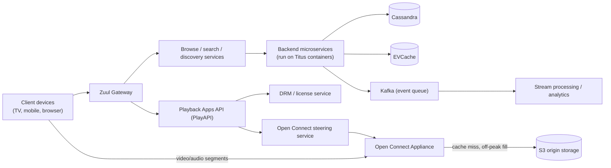
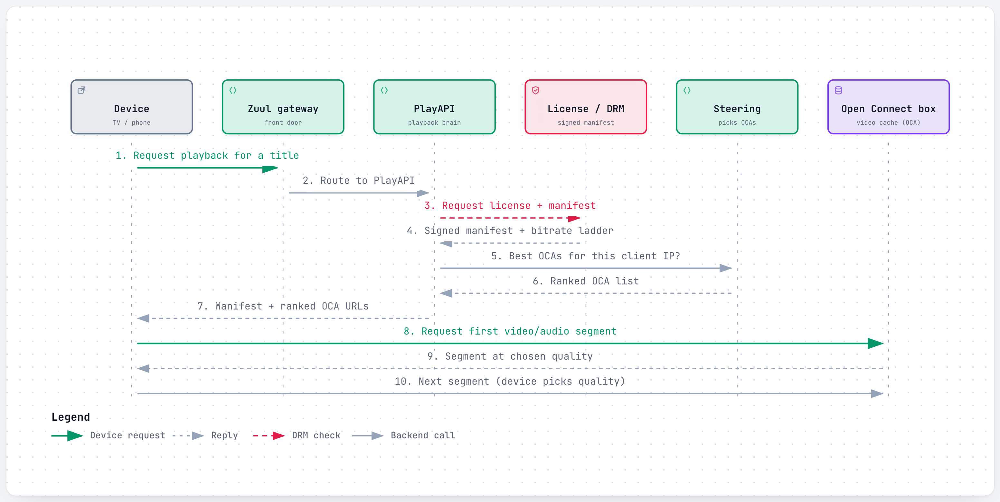
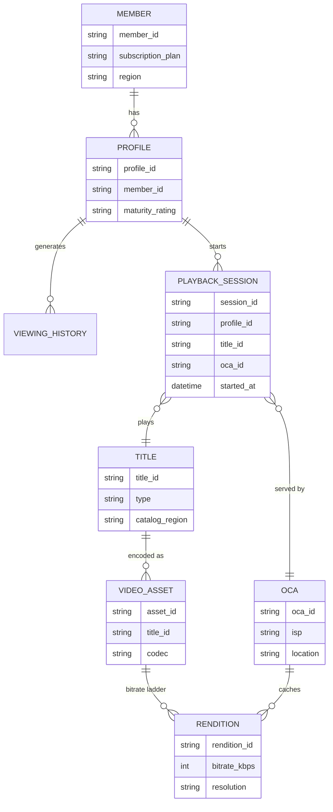
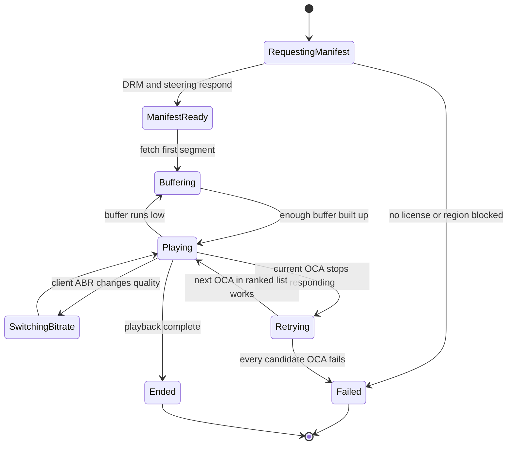
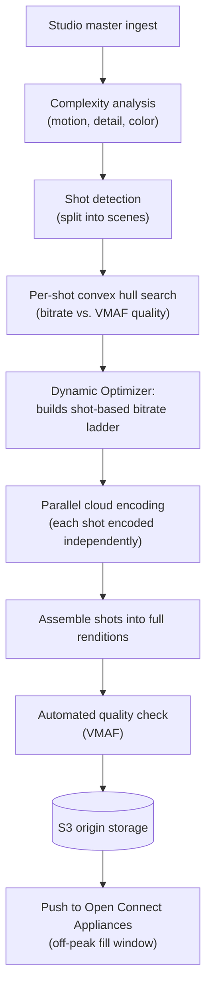
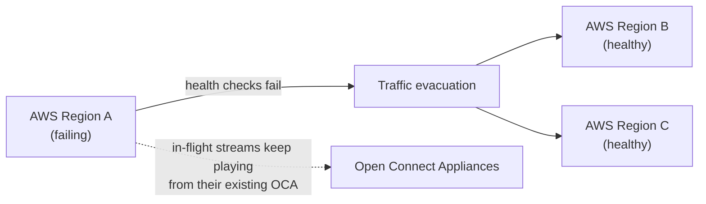

# Netflix: How it streams to hundreds of millions of screens without buffering

> **In 60 seconds:** Netflix splits into two systems that barely talk to each other. A control plane on AWS runs thousands of microservices behind a gateway (Zuul) that handle login, browsing, recommendations, and the "what to play and where from" decision (PlayAPI). A data plane called Open Connect is Netflix's own purpose-built CDN: appliances racked for free inside ISP networks worldwide, pre-loaded overnight with the catalog those ISPs' users actually watch. When a member hits play, AWS services authenticate the request, pick a manifest (the available bitrates/renditions) and hand back a ranked list of nearby Open Connect Appliances; the video bytes then flow from inside the ISP's own network, never touching AWS. Each title is encoded many times at different quality/bitrate points — increasingly per-shot, not just per-title — so the bitrate ladder matches how complex that specific content actually is. This split, plus deliberately breaking things in production on purpose, is how a single "press play" survives a bad wifi signal, a dead cache box, or a whole AWS region disappearing.

**Last reviewed:** September 2026 · **Difficulty:** Advanced · **Reading time:** ~38 min

## Table of contents

- [Before you read: design it yourself](#before-you-read-design-it-yourself)
- [The problem](#the-problem)
- [Scale](#scale)
- [Back-of-the-envelope math](#back-of-the-envelope-math)
- [Requirements](#requirements)
- [How it evolved](#how-it-evolved)
- [High-level design](#high-level-design)
- [Low-level design](#low-level-design)
- [Deep dives](#deep-dives)
- [What happens when things break](#what-happens-when-things-break)
- [Key design decisions](#key-design-decisions)
- [Interview takeaways](#interview-takeaways)
- [Glossary](#glossary)
- [Sources](#sources)

## Before you read: design it yourself

Try each question for 5 minutes on your own before reading the "how" — that's the exercise, not a formality.

### Q1. When someone taps play, how does the system pick which of thousands of servers around the world actually sends the video bytes?

<details><summary>Hint</summary>

Split the decision (which server) from the request that has to happen first (are you even allowed to watch this).

</details>

<details><summary>How Netflix does it</summary>

PlayAPI (on AWS) resolves a license and manifest first, then asks the **Open Connect steering service** which Open Connect Appliances (OCAs) — Netflix's own boxes racked for free inside ISPs — are healthy, hold this title, and sit close to this client. Steering hands back a *ranked list* of OCAs, not one URL, so the client can fail over to the next candidate itself if the first one stops responding, with no round trip back through AWS. Once that handoff happens, AWS is completely out of the data path.

Deep dive: [Open Connect](#open-connect-placement-fill-and-steering)

</details>

### Q2. Why would a company give away expensive physical hardware for free to ISPs instead of just paying a third-party CDN?

<details><summary>Hint</summary>

Think about what you gain by controlling the actual network path bytes travel, not just who charges less per gigabyte.

</details>

<details><summary>How Netflix does it</summary>

Owning delivery means Netflix controls the network path video takes, instead of sharing a third-party CDN's priorities with every other customer on it. Open Connect Appliances (OCAs) are also proactively, directedly filled overnight with the catalog a given ISP's members are forecast to want, rather than reactively caching whatever gets requested — a directed cache hits far higher offload than a reactive one, but only works because the catalog is finite and demand is forecastable (exactly why live events stress this model differently — see Q4). Cost: enormous capital and logistics, designing, shipping, and remotely operating hardware inside thousands of independently-run networks.

Deep dive: [Open Connect](#open-connect-placement-fill-and-steering)

</details>

### Q3. Different scenes need different amounts of data to look the same quality — how do you avoid burning bandwidth on simple shots just because the same title also has a complex one?

<details><summary>Hint</summary>

Consider optimizing at a finer grain than "one bitrate ladder for the whole title."

</details>

<details><summary>How Netflix does it</summary>

Per-title encoding (2015) tailors the whole bitrate ladder to one title's complexity instead of a single fixed ladder for the entire catalog (~20% average bitrate reduction). Shot-based ("Dynamic Optimizer") encoding goes further, searching the best bitrate/quality trade-off (the "convex hull," scored against Netflix's own VMAF quality metric) per individual shot — a one-hour episode is roughly 900 shots, each optimized independently. Cost: an order of magnitude more encoding compute per title, which pays off because encoding is a one-time cost while every subsequent stream benefits from the savings.

Deep dive: [Per-title and shot-based encoding](#per-title-and-shot-based-dynamic-optimizer-encoding)

</details>

### Q4. What happens to your stream if the entire AWS region running login, recommendations, and manifests disappears while you're mid-episode?

<details><summary>Hint</summary>

Think about which half of the system a client still depends on once it's already playing.

</details>

<details><summary>How Netflix does it</summary>

Because the control plane (AWS) and data plane (Open Connect) barely interact, a client already mid-stream from an OCA doesn't need AWS to keep playing that segment — a region loss mainly threatens *new* session starts (manifest/license requests), not already-playing streams. Netflix rehearses exactly this scenario on purpose with **Chaos Kong**, deliberately simulating the loss of a whole AWS region in production, so "designed to survive a region outage" is also "verified to survive one," not just a hope.

Deep dive: [An entire AWS region goes down](#an-entire-aws-region-goes-down)

</details>

## The problem

It's 8:03pm on a Friday. You're on shared apartment wifi, three other devices are already streaming, and you tap play on episode 1 of a show that just dropped globally at midnight your time.

In the next few hundred milliseconds, something has to: confirm you're actually allowed to watch this specific title (subscription active, licensed in your region, this device is allowed to play protected video), figure out which one of many thousands of physical servers scattered across thousands of different ISPs around the world should send you the bytes, decide which of dozens of pre-encoded quality versions of this episode to start with given your wifi looks shaky right now, and then keep re-deciding that quality every few seconds as your wifi actually behaves.

None of this can round-trip to a data center on the other side of the planet and still feel instant — and it has to work whether you're the only person watching, or one of 65 million people watching the same live stream at the same second.

This page answers three hard questions:

- How does one tap of "play" find the nearest *working* server out of thousands, before the button even finishes animating?
- Why does Netflix run its own physical hardware inside other companies' networks instead of just paying a CDN — and what does giving that hardware away for free actually buy them?
- What actually happens to your stream if the data center that knows your account even exists disappears mid-episode?

Every one of those sub-problems has a different failure mode and a different fix, which is exactly why Netflix ends up running what's really two separate systems glued together at one narrow seam: a control plane that decides *whether* and *what* you can watch, and a data plane that just moves bytes as fast and as cheaply as possible once that decision's made. The rest of this page is that seam, taken apart.

## Scale

| Metric | Number | Source |
|---|---|---|
| Paid memberships | ~341.5M (Q1 2026) (unverified — the cited Q1 2026 letter states no membership count) | [15](#sources) |
| Share of global internet traffic | ~15% of global internet traffic (2022 data, Sandvine Global Internet Phenomena Report, Jan 2023) | [17](#sources) |
| Open Connect footprint | 8,000+ Open Connect Appliances, 1,000+ ISP partners, 50+ internet exchange points (undated precisely) | [16](#sources) |
| ISP savings attributable to Open Connect | ~$1.25 billion saved by ISPs (cumulative, by 2021) | [16](#sources) |
| Open Connect peering locations (current, Netflix's own site) | 300+ global peering locations, including 400G+ interconnects at hubs like Ashburn and London, and 800G–1.2T at São Paulo | [3](#sources) |
| Storage Appliance capacity/throughput (current generation) | up to 120TB storage, ~200Gbps per box, ~400W | [3](#sources) |
| Traffic delivered via direct ISP connections | ~95% globally (2018) | [4](#sources) |
| Open Connect's share of Netflix streaming traffic at launch | ~5% (June 2012) | [18](#sources) |
| Zuul gateway | 80+ Zuul 2 clusters routing 1M+ requests/sec to ~100 backend service clusters (2018) | [9](#sources) |
| EVCache (in-memory cache tier) | just under 2 trillion requests/day, 30M+ requests/sec at peak, hundreds of billions of objects across tens of thousands of memcached instances (2016) | [10](#sources) |
| Titus (container platform) | ~3 million containers launched per week (April 2018) | [11](#sources) |
| Per-title encoding | ~20% average bitrate reduction vs. one fixed bitrate ladder for all titles (2015) | [5](#sources) |
| Cloud migration duration | August 2008 start to early January 2016 finish, ~7 years | [14](#sources) |
| Peak concurrent viewers, single live event | 65 million concurrent streams, "most-streamed live sporting event" at the time (Nov 15, 2024, Tyson vs. Paul) | [20](#sources) |
| Outage reports during that same event | ~90,000 reports on Downdetector in the hour before the fight started (Nov 15, 2024) | [20](#sources) |

Only numbers a source states. No guesses.

A few percent of bitrate saved sounds small until it's multiplied across hundreds of millions of members watching every day — that's why per-title/per-shot encoding investment (which costs a lot more compute per title) still pays for itself.

The jump from "5% of traffic on launch day" (2012) to "~95% delivered directly from ISPs" (2018) is the story of Open Connect completely displacing third-party CDNs over about six years.

And a single live event pushing 65 million concurrent streams is a fundamentally different load shape than normal on-demand viewing — it's the single most common trigger for real, publicly visible Netflix outages (see [What happens when things break](#what-happens-when-things-break)).

## Back-of-the-envelope math

This is the rough arithmetic engineers sketch on a whiteboard to size a system before writing any code — good enough to catch a design that's off by orders of magnitude, not meant to be exact. Inputs marked [n] are pulled straight from the [Scale](#scale) table above and match it exactly; everything else is an explicit **Assumption**, never presented as fact.

### 1. Peak aggregate bandwidth during the Tyson vs. Paul fight

**Question:** At 65 million concurrent streams during the Tyson vs. Paul fight [20](#sources), how much aggregate bandwidth was Open Connect serving at that instant?

**Inputs:**
- Peak concurrent viewers: 65,000,000 [20](#sources)
- Assumption: average stream bitrate ≈ 5 Mbps (a mid/high-quality HD rendition off the bitrate ladder; the real mix varies by device and network per ABR)

**Math:**
```text
total bandwidth = 65,000,000 streams × 5 Mb/s
                = 325,000,000 Mb/s
                = 325,000 Gb/s
                = 325 Tb/s
```

**Answer:** ~325 Tb/s of aggregate peak bandwidth.

**What it tells you:** cross-checked against one Storage Appliance's ~200 Gbps throughput [3](#sources): 325,000 Gb/s ÷ 200 Gb/s ≈ 1,625 boxes' worth of simultaneous throughput for this one event alone, out of the 8,000+ OCA fleet [16](#sources) — a big slice of global capacity on one broadcast, exactly the load shape that produced ~90,000 Downdetector reports that same night [20](#sources). See [A traffic spike on a big release or live-event night](#a-traffic-spike-on-a-big-release-or-live-event-night).

### 2. What per-title encoding is actually saving, in bandwidth terms

**Question:** Per-title encoding saves ~20% average bitrate vs. one fixed ladder for every title [5](#sources) — how much *more* peak bandwidth would the same fight (Estimate 1: ~325 Tb/s) have needed without it?

**Inputs:**
- Estimate 1's answer: ~325 Tb/s at today's (per-title-optimized) average bitrate
- Per-title encoding savings: ~20% average bitrate reduction vs. one fixed ladder [5](#sources)

**Math:**
```text
pre-optimization bitrate = optimized bitrate / (1 − 0.20)
                          = optimized bitrate / 0.80
                          = optimized bitrate × 1.25

pre-optimization bandwidth = 325 Tb/s × 1.25
                            = 406.25 Tb/s

extra bandwidth without per-title encoding = 406.25 − 325
                                             = 81.25 Tb/s  (≈25% more)
```

**Answer:** ~406 Tb/s would have been needed — about 81 Tb/s (25%) more — without per-title encoding.

**What it tells you:** a 20% average bitrate saving compounds into real absolute bandwidth at this scale, which is the economic case behind [Per-title and shot-based encoding](#per-title-and-shot-based-dynamic-optimizer-encoding): spend more encode-time compute once, rather than carry ~25% more network/storage capacity forever.

### 3. Zuul's per-cluster load vs. EVCache's peak

**Question:** With 80+ Zuul 2 clusters together routing 1M+ requests/sec [9](#sources), what's the average throughput per cluster, and how does that compare to EVCache's peak?

**Inputs:**
- Zuul: 80+ clusters, 1,000,000+ requests/sec combined [9](#sources)
- EVCache: 30M+ requests/sec at peak [10](#sources)

**Math:**
```text
requests/sec per Zuul cluster ≈ 1,000,000 / 80
                               = 12,500 requests/sec per cluster (average)

ratio to EVCache peak = 30,000,000 / 12,500
                       = 2,400x
```

**Answer:** ~12,500 req/sec per Zuul cluster on average — about 2,400x lower than EVCache's 30M+ req/sec peak.

**What it tells you:** most read traffic never reaches a backend service at all; it's served straight out of the cache tier, which is exactly the design this page's [Microservices on AWS](#microservices-on-aws-the-control-plane-stack) section describes — EVCache in front of everything, not an afterthought.

### 4. EVCache requests per membership per day

**Question:** With EVCache handling just under 2 trillion requests/day across Netflix's ~341.5M paid memberships (Q1 2026; this figure is itself noted on the page as unverified) [10](#sources)[15](#sources), roughly how many cache requests does a typical membership generate per day?

**Inputs:**
- EVCache: just under 2 trillion requests/day [10](#sources) — treated as ≈2 × 10^12 for this arithmetic
- Paid memberships: ~341.5M (Q1 2026, unverified) [15](#sources)
- 1 day = 1,440 minutes (rule of thumb)

**Math:**
```text
requests/membership/day = 2,000,000,000,000 / 341,500,000
                         ≈ 5,857 requests/membership/day

requests/membership/minute = 5,857 / 1,440
                            ≈ 4.1 requests/membership/minute
```

**Answer:** ~5,850-5,900 cache requests per paid membership per day — roughly 4 per minute.

**What it tells you:** that's a steady many-per-minute drumbeat per household, not an occasional lookup — why a cache miss is treated as a first-class failure mode in [Microservices on AWS](#microservices-on-aws-the-control-plane-stack) rather than an edge case.

**Rules of thumb used:**

| Convention | Value used here |
|---|---|
| Bandwidth unit ladder | 1,000 Mb/s = 1 Gb/s; 1,000 Gb/s = 1 Tb/s (decimal, matching how CDNs/ISPs quote link speeds) |
| Time unit | 1 day = 1,440 minutes (used to convert a daily total into a per-minute rate) |
| "Just under X" / "X+" scale figures | treated as ≈X for arithmetic, explicitly flagged wherever used |
| Peak vs. average | general convention: peak ≈ 2-3x daily average for systems with daily/weekly demand cycles |
| Chaining estimates | reusing a prior estimate's **Answer** as the next one's **Input** is fine as long as the dependency is stated (Estimate 2 above) |

## Requirements

Requirements split cleanly into two groups: what a member can actually do, and the non-negotiable properties the system has to have regardless of feature.

**Functional:**
- Members can browse, search, and get personalized recommendations across hundreds of device types (TVs, consoles, phones, browsers, set-top boxes).
- Pressing play on any supported device starts video within about a second and keeps adapting quality automatically as network conditions change.
- Every playback session is authorized (subscription state, regional licensing, device eligibility) and issued a time-limited DRM license before any video bytes flow.
- New titles and re-encodes must reach every relevant Open Connect Appliance worldwide before or at their release timestamp — including titles that drop simultaneously for every country at once.
- Encoding output must support a very wide range of client hardware, from low-power older devices to modern high-resolution TVs, without treating every device the same way.
- Live events (award shows, stand-up specials, sports) must stream to a synchronized audience of tens of millions at the same real second, not just serve an already-encoded catalog on demand.
- A member who cancels, changes region, or switches devices must have that change reflected in what they're allowed to stream almost immediately, not on some batch delay.

**Non-functional:**
- Very high availability — playback must survive the loss of an entire AWS region without a full outage, because for a subscription business, "can I press play right now" is the one thing that must never depend on which data center happens to be having a bad day.
- Low latency to first frame, from network paths that are short and cheap — because a slow start is one of the fastest ways to lose a distracted viewer to a different app.
- Bandwidth efficiency at the encoding layer — because a few percent less bitrate per stream, multiplied by the total hours streamed daily, is petabytes of transit and storage cost saved every single day.
- Massive read scale on metadata/recommendation services, dwarfed by an even larger byte-volume scale on video delivery — these are two different bottlenecks (request rate vs. raw throughput) which is exactly why Netflix runs them as two separate systems.
- The system must be routinely tested against failure, not just designed for it — because at Netflix's scale, some server, disk, or availability zone is failing at any given moment, so an untested failure path is just a hypothesis.
- Cost per byte delivered must keep shrinking as the catalog and member base grow — because video is the overwhelmingly dominant cost driver at this scale, unlike most consumer software where compute or storage for metadata dominates.

## How it evolved

| Era | What happened |
|---|---|
| Before 2007 | Netflix is a DVD-by-mail company running its own datacenters, with large relational databases (vertically scaled single points of failure) at the center of its DVD-shipping business [14](#sources). |
| 2007 | Netflix launches streaming ("Watch Instantly") alongside the DVD business. Early streaming video is delivered by third-party CDNs, not by Netflix itself [18](#sources). |
| August 2008 | A major database corruption leaves Netflix unable to ship DVDs to members for three days. Netflix's own words: this was the trigger to move away from single, vertically-scaled points of failure in its own datacenters [14](#sources). |
| 2008–2012 | Netflix begins migrating to AWS and, at the same time, re-architects its monolithic application into hundreds of independently deployable microservices backed by NoSQL databases instead of one relational database [14](#sources). Streaming video itself is still served by third-party CDNs (Akamai, Limelight, Level 3) during this period [18](#sources). |
| June 2012 | Netflix announces Open Connect, its own purpose-built CDN, explicitly to reduce reliance on third-party CDN vendors as bandwidth costs scale with Netflix's growth. At announcement, only about 5% of Netflix's streaming traffic runs over Open Connect [18](#sources). |
| 2012–2016 | Open Connect scales out — appliances are placed for free inside ISP networks and at internet exchange points — while the AWS migration and microservices rewrite continue in parallel [14](#sources)[16](#sources). |
| December 24, 2012 | An AWS-side outage takes down Netflix streaming on Christmas Eve; AWS issues an apology days later [19](#sources). This kind of incident is a major reason chaos engineering practice hardens at Netflix over the following years. |
| 2015 | Per-title encoding ships: instead of one fixed bitrate ladder for the whole catalog, each title gets a ladder tailored to its own complexity [5](#sources). The same year, Netflix publicly describes "Chaos Kong" — already run regularly — deliberately simulating the loss of an entire AWS region in production [13](#sources). |
| January 2016 | Netflix shuts down its last owned datacenter. The 7-year migration is complete: "we migrated from a monolithic app to hundreds of micro-services, and denormalized our data model, using NoSQL databases" [14](#sources). |
| 2018 | Zuul 2 (built on Netty) is open-sourced [9](#sources); its asynchronous, non-blocking design for more concurrent connections per machine is unverified in the cited post. Titus, Netflix's container platform, and EVCache's internals are published as by-then-mature, large-scale systems [10](#sources)[11](#sources). |
| 2018 | Per-title encoding is generalized into shot-based ("Dynamic Optimizer") encoding — optimizing the bitrate ladder per individual shot (scene) instead of per whole title — and ships to production (March 2018) [6](#sources)[7](#sources). |
| 2024 | PlayAPI publishes prioritized load shedding: under overload, a real user-initiated play request is served before a speculative prefetch request [8](#sources). The same year, a single live sporting event (Tyson vs. Paul) draws 65M concurrent viewers and exposes real streaming problems for a meaningful share of them [20](#sources). |
| Current | Open Connect's peering footprint has grown to 300+ global interconnection points, with Netflix operating its own network (AS2906) and a two-tier appliance hardware lineup for partners of different sizes [3](#sources). |
| 2026 | ~341.5M paid memberships (unverified — the cited Q1 2026 letter states no membership count) [15](#sources). |

Most companies start simple and add complexity as they get burned by it. Netflix's whole architecture — microservices, its own CDN, chaos engineering — exists because a single relational database and a handful of rented CDN contracts stopped being able to survive Netflix's own growth.

Notice the pattern in the dates: almost nothing here was built ahead of need. The database was replaced after it corrupted itself for three days, not before. Open Connect was built after third-party CDNs couldn't keep up, not in anticipation of it. Chaos Kong followed a real, embarrassing, public outage.

That ordering — pain first, architecture second — is normal, not a mistake. Building all of this pre-emptively in 2007 would have been solving problems Netflix didn't have yet, at a scale it hadn't reached yet.

## High-level design

At the top level, this diagram is really two systems drawn as one picture. Everything above the steering service is Netflix's control plane, running on AWS. Everything below it — the OCA and its connection back to S3 — is the data plane, Open Connect. A client only ever talks to both at once during the brief moment it's asking "what can I watch and where from"; for the rest of a session, it's just talking to an OCA.



Walkthrough:

1. A client device talks to AWS through **Zuul**, Netflix's edge gateway. Zuul is an asynchronous, non-blocking L7 gateway (built on Netty) that Netflix runs as ~80 clusters handling over a million requests per second, doing dynamic routing, monitoring, and load shedding before a request ever reaches a backend service [9](#sources). Because it's asynchronous, one Zuul instance can hold open huge numbers of slow or idle client connections (a phone on bad wifi, a TV that's just sitting on the home screen) without dedicating a whole thread to each one.
2. Everything that isn't playback — browsing, search, "because you watched X" rows — is served by thousands of independently deployable **microservices**, most running as containers on **Titus**, Netflix's own container management platform, which launched millions of containers per week even back in 2018 [11](#sources). Splitting these out means the team that owns recommendations can deploy ten times a day without ever touching, or waiting on, the team that owns billing.
3. These services store data in **Cassandra** (durable, wide-column store) and read/write extremely hot data through **EVCache**, a Netflix-built layer over memcached that in 2016 was already handling on the order of two trillion requests a day across tens of thousands of memcached instances [10](#sources). The gap between those two numbers is the point of a cache: EVCache exists specifically so the vast majority of reads never have to touch Cassandra at all. Asynchronous events (viewing activity, telemetry) go through **Kafka** queues into stream-processing pipelines — publishing an event to a queue instead of calling the downstream service directly means a slow or temporarily-down analytics job never blocks the user-facing request that generated the event.
4. Playback is a separate, narrower path: a device's "press play" request goes to **PlayAPI**, the backend service that handles device-initiated manifest and license requests needed to start playback [8](#sources). PlayAPI talks to a DRM/license service and to the **Open Connect steering service**. Deliberately, this path touches far fewer services than browsing does — every extra hop between "you pressed play" and "video starts" is another thing that can be slow or down.
5. Steering doesn't serve any video itself — it uses data OCAs report about their health, content availability, and network proximity to pick the best Open Connect Appliances for that specific client, and hands back a ranked list, not a single URL [2](#sources).
   > Note: simplified reference description — Netflix hasn't published the exact weighting its steering algorithm uses between proximity, current load, and content availability.
6. The actual bytes then flow from an **Open Connect Appliance (OCA)** — a Netflix-owned box racked for free inside the ISP's own network — directly to the client. AWS is completely out of that data path. Close to 95% of Netflix's traffic globally moves this way, over direct connections between Open Connect and residential ISPs [4](#sources).
7. If the most-proximal OCAs are missing a title or overloaded (a cache miss), the client streams from a less-proximal OCA instead — designed to be rare [2](#sources). OCAs are proactively "prepositioned" with content Netflix forecasts they'll need, not filled reactively on demand [2](#sources); the nightly off-peak "fill" window and peer-OCA/S3 fallback are unverified (not in the cited sources). This is the crucial difference from a generic CDN: a generic CDN learns what to cache by watching what gets requested; Open Connect tries to already know before the first request ever arrives.

Everything in steps 1–5 happens on AWS; everything in steps 6–7 happens on Open Connect. That single handoff — a ranked list of OCA URLs, handed from the control plane to the client — is the entire interface between the two systems.

## Low-level design

This section drills into five things the high-level picture glosses over: the exact request sequence when someone presses play, the data relationships behind that request, the states a playback session can actually be in, and the internals of the two most distinctive subsystems — encoding and Open Connect placement.

### Core flow: pressing play

<a href="https://alwintwk.github.io/big-tech-system-design/diagrams/companies-netflix-playback.html">
  <picture>
    <source media="(prefers-color-scheme: dark)" srcset="../diagrams/companies-netflix-playback.dark.png">
    
  </picture>
</a>

<sub>Click the diagram for the interactive version (zoom, dark mode, trace a path).</sub>

Netflix documents PlayAPI explicitly as the service that "handles device initiated manifest and license requests necessary to start playback," and separately has published that it deliberately treats these user-initiated requests as higher priority than optimistic prefetch requests made while a member is just browsing — so under overload it's the actual play-button press that keeps working, not the guess about what a member might watch next [8](#sources).

The manifest handed back isn't just one URL: it's a ranked list of candidate OCAs, which is what lets a client fail over to the next candidate directly, without a round trip back through PlayAPI, if the first OCA stops responding.

The client, not the server, keeps choosing the bitrate for each subsequent segment based on its own measured throughput and buffer health — this is standard adaptive bitrate (ABR) streaming. The server's job stopped at handing over options; the moment-to-moment decision is entirely local to the device.

Notice the order of operations in the diagram: license/manifest resolution happens before steering is resolved. A sensible reason for that ordering is that there's little point asking "which server is closest" for a request that's about to be rejected anyway because the account isn't entitled to watch this title — but Netflix hasn't published its actual reasoning for the ordering, so treat this as a plausible explanation, not a confirmed one.

### Core data model



> Note: this is a simplified reference data model. Netflix hasn't published its actual playback/session schema publicly — the entities above (member, profile, title, video asset, rendition, playback session, OCA) reflect the real relationships confirmed across the sources in this document, not an internal Netflix table layout.

A few of these relationships explain earlier design choices.

`TITLE ||--o{ VIDEO_ASSET` and `VIDEO_ASSET ||--o{ RENDITION` are the encoding pipeline's output made concrete — one title becomes many assets (different codecs/audio tracks) and each asset becomes many renditions (the bitrate ladder).

`PLAYBACK_SESSION }o--|| OCA` is the one row that ties the control plane to the data plane: it's how Netflix's own analytics can tell, after the fact, which appliance actually served a given stream — useful for exactly the kind of steering and cache-miss classification described in the deep dives below.

None of this needs to live in one database. Profile/member data is a natural fit for a store like Cassandra that favors availability over strict consistency — a slightly stale "maturity rating" read is harmless, but a session that can never be written because one node is down is not. A hot, ephemeral fact like "is this OCA healthy right now," on the other hand, is exactly what a cache like EVCache is for, not a durable table.

### Playback session state machine



This is the state machine implied by combining the sequence diagram above with Netflix's own description of prioritized load shedding [8](#sources) and cache-miss handling [2](#sources).

A session that can't get a manifest fails fast rather than hanging. A session that's playing tries the next ranked OCA before giving up entirely. And "buffer runs low" (rebuffering) is treated as a normal, expected transition rather than a failure — it's the whole reason ABR exists in the first place.

> Note: simplified reference state machine — Netflix hasn't published its client's exact internal playback state machine; this reflects the states implied by the publicly documented request flow.

### Signature component 1: per-title and shot-based encoding



Netflix's original 2015 **per-title encoding** work already customized the whole bitrate ladder per title instead of using one fixed ladder for the entire catalog, reporting about a 20% average bitrate reduction at the same quality [5](#sources).

The **Dynamic Optimizer** framework then made this per-*shot* rather than per-title: it treats an entire video as a sequence of shots and searches for the optimal quality/bitrate trade-off (the "convex hull") independently for each one, optimizing against Netflix's own perceptual quality metric, VMAF [6](#sources).

By March 2018 this shipped in production as "optimized shot-based encodes," and Netflix noted the scale jump involved: a one-hour episode with an average 4-second shot length works out to roughly 900 shots that all need their own optimization pass, which is why retrofitting the parallel encoding pipeline to process significantly more encode units (the analysis step alone needed an order of magnitude more complexity) was the main production challenge [7](#sources).

> Note: the diagram above is a simplified reference pipeline built from the stages Netflix has described across its per-title and shot-based encoding posts. Netflix hasn't published the full internal orchestration (job scheduling, retry/failure handling, exact parallelism) of this pipeline.

### Signature component 2: Open Connect placement, fill, and steering

```mermaid
flowchart TD
  Demand["Per-region demand forecast<br/>(what this ISP's members actually watch)"] --> Plan["Content placement planner"]
  Plan --> Push["Nightly fill push<br/>(off-peak window)"]
  Push --> OCA1["OCA inside ISP network"]
  Push --> OCA2["OCA at an IXP"]
  Health["OCA health and load reports"] --> Steer["Steering service"]
  Loc["Client IP or BGP-resolved location"] --> Steer
  Content["Which OCAs currently hold this title"] --> Steer
  Steer --> Rank["Ranked list of candidate OCAs"]
  Rank --> Client["Client device"]
  Client -->|"segment requests"| OCA1
  Client -->|"fallback if OCA1 unhealthy"| OCA2
  OCA1 -->|"cache miss"| Peer["Peer OCA"]
  OCA1 -->|"still missing, rare"| Origin[("S3 origin")]
```



This is the other half of the "press play" flow: before any client can ask an OCA for a segment, Netflix has to have already decided, hours earlier, which appliances should hold which titles.

Placement is directed rather than reactive — Netflix's own catalog is finite and regional popularity is forecastable, so appliances are proactively filled (the off-peak timing is unverified) instead of learning what to cache by watching cache misses happen live [2](#sources).

Steering then combines OCA health, current load, which OCAs actually hold the requested content, and the client's network location to produce the ranked candidate list a client receives in its manifest. The output of this diagram (a ranked list) is exactly the input the sequence diagram above assumes the client already has.

> Note: simplified reference design. Netflix has published the stages (forecast, fill, health reporting, ranked candidate selection) but not the exact placement algorithm or steering weighting formula.

## Deep dives

Five components carry most of the weight in this design. Each section below covers what it is, the problem it solved, how it works internally, and what it costs — because every one of these choices is a trade-off, not a free upgrade.

### Open Connect: placement, fill, and steering

**What it is:** Netflix's own purpose-built CDN — physical appliances Netflix designs, owns, and ships for free to ISPs to rack inside their own networks, plus additional appliances Netflix operates at internet exchange points [4](#sources)[3](#sources).

**Problem it solved:** By the early 2010s, Netflix's video traffic had grown large enough that third-party CDN vendors (Akamai, Limelight, Level 3) were both expensive at that volume and Netflix wanted lower delivery cost and a better user experience [18](#sources).

Buying delivery from someone else also meant Netflix couldn't control the one thing that most affects a viewer's experience: the network path the bytes actually take. A third-party CDN optimizes for many customers at once; it has no particular reason to prioritize Netflix's traffic quality over anyone else's on the same network.

**How it works internally:** placement and delivery break down into three distinct jobs that Netflix runs continuously and separately:

- **Forecast and place** — predict which titles a given ISP's members are likely to want, and decide which appliances should hold them.
- **Fill** — push that content to the right appliances during an off-peak window, before it's needed.
- **Steer and serve** — at request time, rank the appliances that can currently serve this specific client and hand back that ranked list.

Netflix currently offers ISPs two tiers of appliance hardware for that middle job, sized to how much traffic that partner actually needs to carry [3](#sources):

| Appliance type | Storage | Throughput | Power | Intended for |
|---|---|---|---|---|
| Storage Appliance | up to 120TB (SSD) | ~200Gbps | ~400W | larger ISPs and IX locations holding most of the catalog |
| Global Appliance | up to 60TB (SSD) | ~80Gbps | ~250W | smaller ISPs and emerging markets, low-cost 10/100Gbps attachment |

Both run on solid-state drives rather than spinning disks, which is what lets a single 2U box push that much throughput [3](#sources).

Rather than caching whatever gets requested, most appliances are proactively, directedly filled: Netflix forecasts what a given ISP's members are likely to watch and pushes that content to the relevant OCAs ahead of demand (the off-peak "fill window" timing is unverified), so that at peak viewing hours the appliance is already holding almost everything it will be asked for [2](#sources).

When a miss does happen anyway, Netflix's own research classifies *why* it happened:

- a **content miss** — the files weren't on any OCA at the client's most-proximal site,
- or a **health miss** — the local OCAs were saturated (CPU, disk, etc.) and couldn't take more traffic, so the client was sent to a less-proximal OCA [2](#sources).

That classification is what lets the placement/fill logic actually improve over time, instead of just quietly falling back to origin every time something's missing.

Getting the bytes from an OCA to an ISP in the first place is its own negotiated relationship, not just a cable Netflix plugs in. Netflix runs its own network (autonomous system AS2906) and connects to other networks two ways:

- **Settlement-free peering** at public internet exchange points, under an openly published peering policy: Netflix "actively peers with networks that have end-users viewing Netflix content" [3](#sources).
- A **private network interconnection (PNI)** — a direct link, typically 10G or 100G Ethernet, straight into a larger ISP's own network [3](#sources).

Either way, Netflix asks partners for a 24/7 escalation contact and up-to-date routing registration, because a peering relationship that nobody maintains is exactly how you end up with a slow, silently-degrading path [3](#sources). At scale this adds up to 300+ peering locations, with some interconnects (Ashburn, London) running at 400Gbps and others (São Paulo) at 800Gbps–1.2Tbps combined [3](#sources).

> **Why this matters:** giving away expensive hardware for free sounds backwards, but it converts Netflix's single biggest recurring cost — bandwidth — from something it rents at market rates into infrastructure it owns and tunes. The ISP benefits too: serving Netflix traffic from a box already inside their own network means that traffic never has to cross their (expensive) transit links to the wider internet.

**What it costs:** Enormous upfront capital and logistics — designing, manufacturing, shipping, and remotely operating physical hardware distributed across thousands of independently operated networks worldwide.

It also only works well because Netflix's catalog is finite and demand is forecastable; this model would fit unpredictable or one-off content much less cleanly than it fits a stable, rewatched catalog, which is exactly why live events (see [What happens when things break](#what-happens-when-things-break)) stress this design differently than catalog viewing does.

### Per-title and shot-based (Dynamic Optimizer) encoding

**What it is:** Instead of encoding every piece of video with one universal set of bitrate/resolution pairs, Netflix analyzes and encodes each title — and later, each individual shot within a title — with a bitrate ladder tuned to how visually complex that specific content is [5](#sources)[6](#sources).

**Problem it solved:** A static, one-size-fits-all bitrate ladder has to be conservative enough to look acceptable on the *most* complex content in the catalog, which wastes bits on everything simpler (a static talking-head interview doesn't need the same bitrate as a fast-motion action scene) [5](#sources).

That waste isn't a rounding error at Netflix's volume — it's the same handful of encoded bits repeated across every stream of every simple title, multiplied by every member who watches it, every day the title stays in the catalog.

**How it works internally:** the pipeline runs in four stages:

1. **Complexity analysis and shot detection** — split a title into individual shots (a "shot" is a continuous camera take; a scene change or cut starts a new one).
2. **Per-shot convex hull search** — for each shot, try many bitrate/resolution combinations and keep the "convex hull": the subset that gives the best measured perceptual quality (VMAF, Netflix's own quality metric) for each bitrate point [6](#sources).
3. **Ladder assembly** — the Dynamic Optimizer picks specific points off each shot's hull to build that shot's own bitrate ladder, rather than reusing one ladder for the whole title [6](#sources).
4. **Parallel encode and reassembly** — every shot is encoded independently (in parallel, since they don't depend on each other) and the results are stitched back into complete, full-length renditions.

The scale jump from step 1 to step 4 is the whole engineering challenge: a one-hour episode at an average ~4-second shot length works out to roughly 900 separately-optimized shots, each going through this entire search-and-encode process on its own [7](#sources).

```
# illustrative only — not Netflix's real code
for shot in split_into_shots(video):
    hull = search_convex_hull(shot, quality_metric="VMAF")
    ladder[shot.id] = pick_bitrate_points(hull, target_qualities)
encode_all_shots_in_parallel(ladder)
```

To make "convex hull" concrete, here's a hypothetical, illustrative-only comparison (not real Netflix numbers) of what two very different shots from the same episode might need to hit the same target quality:

| Shot | Content | Bitrate needed for target quality |
|---|---|---|
| A | Static dialogue, plain background | low |
| B | Fast motion, lots of fine detail | several times higher than shot A |

A fixed, title-wide bitrate would have to be set high enough to cover shot B everywhere, including during shot A — the whole point of shot-based encoding is to stop paying that tax on every simple shot just because the same title also contains a complex one.

> **Why this matters:** this is the clearest example in the whole system of "spend more compute to save more bandwidth forever." Encoding is a one-time (per title) cost; every subsequent stream of that title benefits from the savings, which is why investing an order of magnitude more compute per title into shot-level optimization still nets out ahead at Netflix's playback volume.

**What it costs:** The 2018 production rollout's main engineering problem wasn't the algorithm — it was that shot-based encoding turned a 1-hour episode's twenty 3-minute chunks into ~900 shots ("more than two orders of magnitude" more chunks per encode, per Netflix), which meant retrofitting the whole pipeline's scheduling and parallelism [7](#sources).

### PlayAPI and the device playback request flow

**What it is:** The backend service that specifically handles the moment a device presses play — requesting a manifest and DRM license — as distinct from the much larger set of services that handle browsing and recommendations [8](#sources).

It exists as its own service, not a code path inside the general API, precisely because playback has stricter latency and reliability requirements than almost anything else Netflix serves — bundling it in with lower-priority traffic would mean a slow recommendations query could, in theory, slow down someone's play button.

**Problem it solved:** Not every request Netflix's backend receives is equally important.

- A device that's just idly browsing might trigger a *prefetch* request — an educated guess at what a member might watch next, done to shave startup latency later if the guess turns out to be right.
- A device where a human just pressed play is a request that must not fail.

Under normal load both succeed, but during an overload incident, something has to be shed — and Netflix decided in advance which one it should be [8](#sources).

**How it works internally:** PlayAPI classifies incoming requests by priority and deliberately sheds lower-priority (prefetch) load before shedding user-initiated play requests when the system is under pressure [8](#sources).

```
# illustrative only — not Netflix's real code
if system.is_overloaded():
    if request.priority == "prefetch":
        reject(request)          # cheap to lose — it was a guess
    else:
        serve(request)           # a human is waiting
```

> **Why this matters:** this is a concrete example of load shedding done by business priority, not by arrival order or request type alone. The naive approach (shed oldest, or shed randomly) would sometimes drop the request a person is actively staring at a spinner for.

**What it costs:** Prefetching exists specifically to shave latency off a future play; deliberately deprioritizing it under load means some of that latency benefit is sacrificed exactly when the system is already stressed — a real trade-off, not a free win. It also means PlayAPI has to be able to classify request priority quickly and cheaply at the point of overload, which is itself extra logic that has to run correctly under the exact conditions (heavy load) that are hardest to test.

### Microservices on AWS: the control-plane stack

**What it is:** Everything that isn't the video bytes themselves — Zuul (gateway), Titus (container orchestration), Cassandra (durable storage), EVCache (hot-key caching), Kafka (event streaming) — the stack that runs browsing, search, recommendations, and playback's metadata layer [9](#sources)[10](#sources)[11](#sources).

This is the part of Netflix that looks like a fairly conventional (if very large) modern backend, in contrast with Open Connect, which looks nothing like a typical company's infrastructure at all.

**Problem it solved:** A single relational database was Netflix's single point of failure in 2008 [14](#sources).

Splitting a monolith into independently deployable microservices means one team's bug, deploy, or overload doesn't take down every other feature — browsing can degrade without playback breaking, and vice versa. It also means hundreds of teams can each release changes on their own schedule instead of coordinating one shared release train.

**How it works internally:** each piece of the stack exists to solve one specific scaling problem the 2008-era monolith couldn't:

- **Zuul 2** was rebuilt on an asynchronous, non-blocking model (built on Netty) (the thread-per-connection rationale is unverified in the cited post); it runs as roughly 80 clusters handling over a million requests per second [9](#sources).
- **Titus** schedules containerized services onto AWS compute, launching millions of containers a week even in 2018 [11](#sources) — letting hundreds of teams each deploy independently without hand-provisioning machines.
- **EVCache** sits in front of the slower, durable stores as a very-low-latency read/write layer for the hottest data, handling on the order of two trillion requests a day [10](#sources).
- **Cassandra** provides a wide-column store that stays available and keeps accepting writes even when some nodes are down, trading some consistency guarantees for that availability — a deliberate reversal of the "one consistent relational database" model that failed in 2008.
- **Kafka** decouples services that produce events (a view started, a rating was left) from whatever eventually consumes them, so a slow consumer never becomes a slow producer.

> **Why this matters:** this is a textbook case of matching infrastructure to workload shape.
>
> AWS gives Netflix elastic compute for bursty, ever-changing API and recommendation workloads, while the video-serving layer (Open Connect) stays a simple, purpose-built system that just moves bytes fast — deliberately kept as two separate operational domains rather than one.

**What it costs:** Hundreds of independently deployed services are also hundreds of things that can each fail, be misconfigured, or drift out of sync with each other. A single relational database was one thing to reason about, even if it was a fragile one; hundreds of services calling each other over the network is a fundamentally harder debugging and capacity-planning problem.

This architecture only works because Netflix invests heavily in the tooling (deployment automation, request tracing, and the chaos engineering practice below) needed to keep that complexity manageable — microservices without that investment tend to just relocate the monolith's fragility into the network calls between services instead of removing it.

### Chaos engineering and resilience practice

**What it is:** Deliberately injecting failure into live production systems — killing instances, and eventually simulating the loss of an entire AWS region — using a family of tools Netflix calls the "Simian Army," most famously Chaos Monkey and Chaos Kong [12](#sources)[13](#sources).

The core idea inverts the usual instinct: instead of only trying to prevent failure, deliberately cause small, controlled versions of it constantly, so the big, uncontrolled version is less likely to catch anyone by surprise.

**Problem it solved:** At Netflix's scale, some server, disk, or availability zone is failing at any given moment regardless of intent.

A Christmas Eve 2012 outage caused by an AWS-side failure took down Netflix streaming, with Amazon apologizing days later [19](#sources) — a visible example of exactly the kind of failure a system "designed" to tolerate region loss can still suffer if that tolerance has never actually been exercised.

Netflix's response was to stop treating failure tolerance as a design assumption and start treating it as something to test continuously, during business hours, on purpose.

**How it works internally:** the tools escalate in blast radius:

- **Chaos Monkey** randomly terminates individual production instances, so every service is forced to tolerate losing any single node at any time — not just in theory, but on an actual, recurring schedule [12](#sources).
- **Chaos Kong** goes much further, simulating the loss of an entire AWS region to validate that traffic can actually be evacuated to the remaining regions [13](#sources).

Running these deliberately, in daylight, with engineers watching and ready to intervene, surfaces weak points before an unplanned failure does it for you at 3am with nobody watching.

> **Why this matters:** "designed to survive a region outage" and "has survived a region outage, repeatedly, on purpose, in production" are very different claims. Only the second one is actually verified.

**What it costs:** This only works if every dependent service is genuinely built to degrade gracefully — chaos engineering on top of services that *aren't* resilient just causes the outage it was meant to prevent, on a schedule of your own choosing instead of an attacker's or a hardware vendor's.

Tying it back to the requirements from earlier in this page, each deep dive above exists to satisfy a specific one:

| Deep dive | Requirement it satisfies |
|---|---|
| Open Connect placement, fill, and steering | Low latency to first frame; bandwidth efficiency at the network layer |
| Per-title and shot-based encoding | Bandwidth efficiency at the encoding layer |
| PlayAPI and the playback request flow | Sub-second play, DRM-authorized before any bytes flow |
| Microservices on AWS | Massive, independently-scalable read traffic on metadata/recommendations |
| Chaos engineering | Availability that survives a full region loss, verified rather than assumed |

## What happens when things break

### An entire AWS region goes down

Because Netflix tests exactly this scenario deliberately with Chaos Kong, the expectation is that traffic evacuates to remaining regions rather than causing a full outage [13](#sources).



> Note: simplified reference diagram — Netflix hasn't published the exact mechanics of how a region is detected as unhealthy or how traffic is actually shifted; this reflects the documented intent (evacuate to remaining regions) rather than a confirmed internal design.

The video data plane is largely insulated from this: a client that already has a manifest and is mid-stream from an Open Connect Appliance doesn't need AWS to keep playing that segment. A region loss mainly threatens *new* session starts (manifest/license requests) and browsing, not already-playing streams — one more consequence of splitting the control plane from the data plane in the first place.

The historical counterexample is instructive: the December 2012 Christmas Eve outage happened *before* this kind of deliberate, continuous regional-failure testing was mature, and it took Netflix's streaming down [19](#sources). The difference between 2012 and today isn't that region failures stopped happening — AWS regions still fail — it's that Netflix now rehearses losing one on purpose.

> Note: the exact internal mechanics of regional evacuation (traffic shifting, data replication lag, which services degrade vs. fail) aren't publicly detailed by Netflix; this describes the documented intent and testing practice, not the full internal runbook.

### A single ISP's Open Connect Appliance (or a whole ISP's appliances) goes down

The steering service continuously tracks OCA health, so an unhealthy appliance simply stops appearing in the ranked candidate list new sessions receive.

A client already mid-stream that finds its current OCA unresponsive retries the next OCA from the rank-ordered list it already has in hand [2](#sources) — no round trip back through PlayAPI is required for that fallback (inferred; not stated in the sources).

If a title is missing from (or the load is too high on) the most-proximal OCAs, the client is steered to an OCA at a less-proximal site [2](#sources); a further fallback to a peer OCA or S3 origin is unverified. Because most appliances are already proactively filled with the catalog they're expected to need, this fallback path should be the exception, not the common case [2](#sources).

### A traffic spike on a big release or live-event night

This is the scenario most visibly documented in the wild: the November 2024 Tyson vs. Paul live event drew a reported 65 million concurrent viewers — the most-streamed live sporting event at the time — and also generated widespread, publicly reported buffering complaints, with roughly 90,000 outage reports registered on Downdetector in the hour before the fight even started [20](#sources).

The mitigations available are the ones described elsewhere on this page:

- Per-title/shot encoding reduces the bytes needed per stream, which matters more, not less, when everyone is streaming at once [5](#sources)[7](#sources).
- Titus can autoscale compute for the control plane as request volume climbs [11](#sources).
- PlayAPI's load shedding prioritizes actual play requests over prefetch under pressure [8](#sources).

Live linear events are a genuinely different traffic shape than Netflix's normal on-demand catalog viewing — a huge number of clients all requesting the *same* content at the *same* instant, instead of a smoothly distributed mix of whatever each viewer feels like watching.

The public record suggests this remains a harder problem than steady-state catalog streaming, which Open Connect's proactive per-region caching handles well precisely because catalog demand is forecastable ahead of time — a live event's audience size is a much noisier forecast.

> Note: this observation is inferred from the publicly documented outcome, not from an internal Netflix incident report.

### A network partition between the control plane and the data plane

Because a client's manifest already contains multiple ranked OCA candidates and a full bitrate ladder, a client that temporarily can't reach PlayAPI or the steering service to refresh its manifest can typically keep playing from the OCA it's already connected to.

Similarly, an OCA that can't reach S3 origin during its nightly fill window just serves whatever it already cached and retries the fill later, since fill is a proactive process (off-peak timing unverified), not something synchronous with a live playback request [2](#sources).

In both directions, the partition is survivable specifically because the two halves of the system were designed not to need each other on every single request.

The manifest and the fill window are both ways of front-loading information, so a temporary disconnection doesn't immediately become a user-visible failure.

> Note: simplified reference reasoning — Netflix hasn't published exact partition-handling behavior; this follows directly from the manifest design and fill model documented elsewhere on this page.

## Key design decisions

Each row below is a place Netflix chose one architecture over a simpler or cheaper alternative, and paid a specific, named cost for it.

| Decision | Why | Trade-off |
|---|---|---|
| Build and operate its own CDN (Open Connect) instead of buying from third-party CDNs | Video bytes are almost all of Netflix's traffic; owning the delivery layer means control over quality of experience and the ability to embed hardware directly inside ISP networks [18](#sources) | Enormous capital and logistics cost: designing, manufacturing, shipping, and remotely operating physical appliances worldwide |
| Proactive, directed caching — push most of the catalog to appliances ahead of demand (overnight timing unverified) rather than caching reactively on demand | Netflix's catalog is finite and regional popularity is forecastable, so a directed cache can hit much higher offload than a reactive one [2](#sources) | Requires accurate per-region demand forecasting; storage-dense appliances add hardware cost; doesn't suit unpredictable/live demand |
| Split the system into a control plane (AWS) and a data plane (Open Connect) that barely interact | AWS gives elastic compute for bursty, ever-changing API/recommendation workloads; OCAs stay simple, purpose-built boxes that just serve bytes fast [2](#sources) | Two separate operational domains (steering, health reporting, fill) have to be kept consistent with each other |
| Per-title, then per-shot, video encoding instead of one universal bitrate ladder | Video complexity varies hugely by title and even by scene, so tailoring the ladder saves bandwidth without a visible quality loss [5](#sources)[7](#sources) | Massively more encoding compute — hundreds of shots per hour of content, each needing its own optimization pass [7](#sources) |
| Run chaos engineering (Chaos Monkey, Chaos Kong) continuously in production | At Netflix's scale, instances and even whole regions fail regularly regardless of intent — better to trigger failure deliberately, during business hours, than get surprised by it [13](#sources) | Only works if services are actually built to degrade gracefully everywhere; badly-scoped experiments can cause the very outage they're meant to prevent |
| Rebuild the gateway (Zuul 2) on an asynchronous, non-blocking model instead of thread-per-request | The old thread-per-connection model didn't scale to the concurrency Netflix's traffic needed (unverified; not in the cited Zuul 2 post [9](#sources)) | Asynchronous code is harder to write, trace, and debug than simple blocking code |
| Prioritize user-initiated requests over prefetch requests inside PlayAPI when shedding load | Under overload, the request that matters is the one blocking a member who just pressed play, not a speculative prefetch [8](#sources) | Some latency benefit from prefetching is deliberately sacrificed during incidents |
| Rewrite the whole application as microservices during the AWS migration, rather than lift-and-shift the existing monolith | The 2008 outage exposed a monolithic relational database as a single point of failure; moving the *same* fragile design onto someone else's servers wouldn't have fixed that [14](#sources) | A 7-year migration instead of a much faster infrastructure-only move; had to rebuild working systems while still operating the business |
| Offer two tiers of appliance hardware (high-throughput Storage Appliances vs. lower-cost Global Appliances) instead of one standard box | Smaller ISPs and emerging markets don't need — and can't always justify hosting — a 120TB, 200Gbps box; a cheaper 60TB/80Gbps tier lowers the bar to participate [3](#sources) | Two hardware SKUs to design, manufacture, and support instead of one, and more complex placement decisions about which tier goes where |
| Publish an open, standardized peering policy (settlement-free at IXPs, or direct PNI for larger partners) instead of negotiating each relationship from scratch | A predictable, published policy plus baseline requirements (24/7 contact, up-to-date routing registration) scales to thousands of ISP relationships better than bespoke deals [3](#sources) | Netflix gives up some negotiating leverage per-partner in exchange for lower overhead running the policy at scale |

## Interview takeaways

None of these patterns are unique to video streaming — they're general answers to system-design questions that show up across many companies' interviews.

- **Separate your control plane from your data plane when one moves far more bytes than the other.** Answers: "how would you design a system that serves both small, frequent metadata requests and huge media payloads?"
- **Push content proactively when demand is forecastable, instead of only caching reactively.** Answers: "how do you design a cache or CDN in front of a mostly-known, finite catalog?"
- **Tailor resource cost to the actual complexity of the content instead of a one-size-fits-all approach.** Answers: "how do you cut bandwidth or compute cost at massive scale without hurting quality?"
- **Shed load by business priority, not by arrival order.** Answers: "how do you keep the one action that matters working during an overload incident?"
- **Practice failure continuously instead of only designing for it on paper.** Answers: "how do you actually know your system tolerates the failure modes you claim it does?"
- **Move to microservices when a single component becomes an unacceptable single point of failure — not preemptively, and not just for its own sake.** Answers: "when is it worth the cost of decomposing a monolith?"
- **Let the client own decisions the server can't see in real time.** Answers: "who should decide bitrate/quality — client or server — in an adaptive streaming system?"
- **Give clients multiple ranked fallback options up front, so a single node failure doesn't require a round trip to the control plane.** Answers: "how do you design a system to degrade gracefully instead of failing hard on one node's death?"
- **Order your validation from cheapest-to-reject to most-expensive-to-compute.** Answers: "in what order should a request pipeline run its checks?"
- **Align your infrastructure partners' incentives with your own instead of only paying them for capacity.** Answers: "how do you scale a delivery network that depends on other companies' cooperation?"
- **Offer tiered hardware/cost options to partners of different sizes instead of one-size-fits-all.** Answers: "how do you onboard partners with very different scale requirements into the same system?"

## Glossary

New to these terms? The [concepts](../concepts/README.md) folder explains the core ideas in depth.

Every jargon term used above, in the order it's most useful to learn them.

- **[CDN (Content Delivery Network)](../concepts/cdn.md)**: a network of servers placed close to users so content doesn't have to travel all the way back to one central data center every time.
- **Open Connect Appliance (OCA)**: a physical server Netflix builds and owns, racked either at an internet exchange or for free inside an ISP's own network, that stores and serves Netflix's video files.
- **ISP (Internet Service Provider)**: the company (e.g. a cable or fiber provider) that connects a household or business to the internet.
- **Peering**: two networks agreeing to connect directly and exchange traffic, often without charging each other ("settlement-free peering").
- **IXP (Internet Exchange Point)**: a physical facility where many different networks connect their equipment together to exchange traffic directly.
- **PNI (Private Network Interconnection)**: a dedicated, direct physical link between two specific networks (e.g. Netflix and one large ISP), as opposed to connecting through a shared exchange point.
- **AS / ASN (Autonomous System / Autonomous System Number)**: a unique number identifying one organization's routable chunk of the internet (Netflix's is AS2906) — the unit BGP uses to say "traffic for these addresses goes through this network."
- **BGP (Border Gateway Protocol)**: the protocol networks use to announce "these IP addresses are reachable through me," which is how Netflix's steering system knows which OCA can actually serve a given client.
- **Fill / fill window**: the process (and off-peak time slot) during which Open Connect Appliances download new or updated content from Netflix's origin storage before it's needed for playback.
- **Steering**: the decision process that picks which specific OCA(s) a given client should stream from, based on proximity, health, and whether that OCA has the content.
- **Manifest**: a file the client downloads before streaming that lists what video/audio quality levels ("renditions") are available and where to fetch each segment from.
- **Adaptive bitrate (ABR) streaming**: the client keeps measuring its own network speed and switches to a higher- or lower-quality video segment on the fly, instead of streaming one fixed quality the whole time.
- **Bitrate ladder**: the set of quality/bitrate versions ("renditions") encoded for a single piece of video, from lowest to highest quality, that ABR streaming switches between.
- **Per-title encoding**: instead of using the same bitrate ladder for every video in the catalog, analyzing each title's own complexity and building a ladder tailored to it.
- **Shot-based (Dynamic Optimizer) encoding**: going a level deeper than per-title — splitting a video into individual shots (scenes) and optimizing the bitrate ladder for each shot separately, since complexity changes scene to scene.
- **VMAF (Video Multi-Method Assessment Fusion)**: a video quality metric Netflix developed to estimate how a video would actually look to a human viewer, used as the target when deciding how much to compress something.
- **Convex hull (in encoding)**: out of many possible bitrate/resolution combinations tested for a shot, the subset that gives the best quality for each bitrate — the optimal trade-off curve.
- **DRM (Digital Rights Management) / license**: the mechanism that cryptographically restricts playback to authorized devices/sessions, so video can't just be freely copied.
- **[Microservices](../concepts/microservices.md)**: splitting one big application into many small, independently deployable services, each responsible for one narrow thing, instead of one large monolith.
- **Monolith**: the opposite of microservices — one large application where all functionality is built and deployed together, so a bug or overload in one part can affect the whole thing.
- **API gateway**: a single front-door service that all incoming requests pass through first, which can route, monitor, secure, and rate-limit traffic before it reaches backend services.
- **Zuul**: Netflix's own API gateway; version 2 rewrote it to be asynchronous and non-blocking (built on Netty) so it could handle far more concurrent connections per machine.
- **Titus**: Netflix's own container management platform (its version of something like Kubernetes) that schedules and runs containerized workloads on AWS.
- **Container**: a lightweight, packaged unit of an application (code plus everything it needs to run) that can be started, stopped, and moved between machines quickly.
- **EVCache**: Netflix's own distributed in-memory caching layer, built on top of memcached, used to serve very frequently-read data with very low latency.
- **Memcached**: a widely-used, simple in-memory key-value store often used as a cache in front of a slower database.
- **Cassandra**: a distributed database designed to stay available and keep accepting writes even if some of its machines are down, at the cost of some consistency guarantees.
- **[Kafka](../concepts/message-queues-and-logs.md)**: a distributed "log" system used as a queue/message bus — services publish events to it and other services read and react to those events, often at a delay from real time.
- **Availability zone (AZ) / region (AWS)**: AWS groups its data centers into isolated "availability zones" within a "region"; designing across zones/regions protects against one data center, or even one whole region, going down.
- **Control plane**: the part of a system responsible for decisions and coordination (auth, routing, metadata) rather than the actual bulk data transfer itself. For Netflix, this is the AWS-hosted layer.
- **Data plane**: the part of a system that actually moves the bulk data (here, video bytes). For Netflix, this is Open Connect, deliberately kept separate from the control plane.
- **Chaos engineering**: deliberately injecting failures (killing servers, adding latency, taking down a whole region) into a live production system to find weaknesses before they cause a real outage.
- **Chaos Monkey / Chaos Kong / Simian Army**: Netflix's own chaos engineering tools — Chaos Monkey randomly kills individual instances, Chaos Kong simulates an entire AWS region failing, and the "Simian Army" is the broader family of these failure-injection tools.
- **Regional evacuation**: shifting live user traffic away from an AWS region that's failing (or being tested as if it failed) toward the remaining healthy regions.
- **Load shedding**: when a system is overloaded, deliberately rejecting or dropping some lower-priority requests so the requests that matter most still succeed.
- **Prefetch**: a speculative request made ahead of time (e.g. while a member is browsing) to reduce latency later if the guess about what they'll watch turns out to be right.
- **PlayAPI**: the specific Netflix backend service that handles a device's manifest and license requests at the moment someone actually presses play.
- **Rebuffering**: when playback pauses to rebuild its buffer because the client is consuming video data faster than it's arriving — usually handled by ABR dropping to a lower bitrate.
- **Offload**: the percentage of an ISP's Netflix traffic that's served locally (from an OCA inside or near that ISP) rather than crossing onto the wider internet.
- **Live linear event**: content streamed to all viewers in real time simultaneously (e.g. a live sports broadcast), as opposed to on-demand catalog content each viewer starts whenever they choose.
- **Downdetector**: a third-party website that aggregates user-submitted reports of outages for many online services, used here as a rough public signal of real-world streaming problems.
- **Origin (origin storage)**: the authoritative source copy of encoded video, stored in Netflix's own cloud storage (S3), used to fill Open Connect Appliances and as a last-resort fallback on a cache miss.
- **SSD (Solid-State Drive)**: flash-based storage with no moving parts, much faster than a traditional spinning hard disk, which is part of what lets one Open Connect Appliance push very high throughput.
- **Autoscaling**: automatically adding or removing compute capacity (e.g. more containers) as demand rises or falls, instead of running a fixed amount of infrastructure at all times.
- **Single point of failure**: one component whose failure takes down the whole system, because nothing else can take over for it — Netflix's 2008 relational database was one.
- **NoSQL**: a broad category of databases (including Cassandra) that don't use the traditional table-and-SQL relational model, usually trading some consistency or query flexibility for better availability and horizontal scalability.
- **Wide-column store**: a type of NoSQL database (like Cassandra) that organizes data in rows with flexible sets of columns, spread across many machines, rather than one rigid table schema on one machine.
- **Horizontal scaling**: adding more machines to handle more load, as opposed to "vertical scaling" (making one machine bigger/faster) — horizontal scaling is what lets a system keep growing without an eventual hard ceiling.
- **L7 / Layer 7**: the "application layer" in networking terms — a Layer 7 gateway like Zuul understands the actual content of a request (e.g. an HTTP path), not just raw packets, so it can make routing decisions based on what's being asked for.
- **2U server**: a physical server sized to occupy 2 "rack units" of vertical space in a datacenter rack — a common form factor for dense, high-throughput appliances like Netflix's OCAs.
- **Latency**: the delay between asking for something and getting a response — "low latency to first frame" means video starts almost immediately after pressing play.
- **Throughput**: how much data can move through a system per unit time (e.g. an OCA's "~200Gbps") — distinct from latency, which is about delay, not volume.

## Sources

1. Netflix TechBlog — ["Serving 100 Gbps from an Open Connect Appliance"](https://netflixtechblog.com/serving-100-gbps-from-an-open-connect-appliance-cdb51dda3b99) (2017)
2. Netflix TechBlog — ["Driving Content Delivery Efficiency Through Classifying Cache Misses"](https://netflixtechblog.com/driving-content-delivery-efficiency-through-classifying-cache-misses-ffcf08026b6c)
3. Netflix Open Connect — site: [Appliances (hardware specs)](https://openconnect.netflix.com/en/appliances/) and [Peering](https://openconnect.netflix.com/en/peering/)
4. *(third-party)* APNIC Blog — ["Netflix content distribution through Open Connect"](https://blog.apnic.net/2018/06/20/netflix-content-distribution-through-open-connect/) (2018)
5. Netflix TechBlog — ["Per-Title Encode Optimization"](http://techblog.netflix.com/2015/12/per-title-encode-optimization.html) (Dec 2015)
6. Netflix TechBlog — ["Dynamic Optimizer — a perceptual video encoding optimization framework"](https://netflixtechblog.com/dynamic-optimizer-a-perceptual-video-encoding-optimization-framework-e19f1e3a277f) (2018)
7. Netflix TechBlog — ["Optimized shot-based encodes: Now Streaming!"](https://netflixtechblog.com/optimized-shot-based-encodes-now-streaming-4b9464204830) (2018)
8. Netflix TechBlog — ["Enhancing Netflix Reliability with Service-Level Prioritized Load Shedding"](https://netflixtechblog.com/enhancing-netflix-reliability-with-service-level-prioritized-load-shedding-e735e6ce8f7d) (2024)
9. Netflix TechBlog — ["Open Sourcing Zuul 2"](https://netflixtechblog.com/open-sourcing-zuul-2-82ea476cb2b3) (2018)
10. Netflix TechBlog — ["Caching for a Global Netflix"](http://techblog.netflix.com/2016/03/caching-for-global-netflix.html) (2016)
11. Netflix TechBlog — ["Titus, the Netflix container management platform, is now open source"](https://netflixtechblog.com/titus-the-netflix-container-management-platform-is-now-open-source-f868c9fb5436) (2018)
12. Netflix TechBlog — ["The Netflix Simian Army"](https://netflixtechblog.com/the-netflix-simian-army-16e57fbab116)
13. Netflix TechBlog — ["Chaos Engineering Upgraded"](http://techblog.netflix.com/2015/09/chaos-engineering-upgraded.html) (2015, describes Chaos Kong)
14. Netflix — ["Completing the Netflix Cloud Migration"](http://about.netflix.com/en/news/completing-the-netflix-cloud-migration) (Jan 2016)
15. Netflix — [Q1 2026 Shareholder Letter](https://s22.q4cdn.com/959853165/files/doc_financials/2026/q1/FINAL-Q1-26-Shareholder-Letter.pdf) (paid memberships figure)
16. *(third-party)* Wikipedia — ["Open Connect"](https://en.wikipedia.org/wiki/Open_Connect)
17. *(third-party)* AppLogic Networks, citing Sandvine's Global Internet Phenomena Report — ["Netflix is responsible for 15% of global internet traffic consumption"](https://www.applogicnetworks.com/inthenews/netflix-is-responsible-for-15-of-global-internet-traffic-consumption) (2023)
18. *(third-party)* TechCrunch — ["Netflix Rolls Out Its Own CDN: Open Connect"](https://m.techcrunch.com/2012/06/04/netflix-open-connect) (June 2012)
19. *(third-party)* Wikipedia — ["Timeline of Netflix"](https://en.wikipedia.org/wiki/Timeline_of_Netflix) (Christmas Eve 2012 AWS outage)
20. *(third-party)* Wikipedia — ["Mike Tyson vs. Jake Paul"](https://en.wikipedia.org/wiki/Mike_Tyson_vs._Jake_Paul) (Nov 2024 streaming/concurrency figures)
