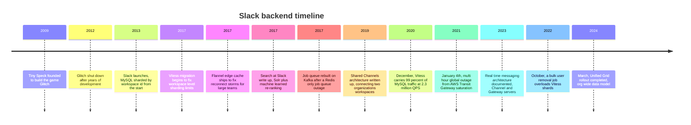
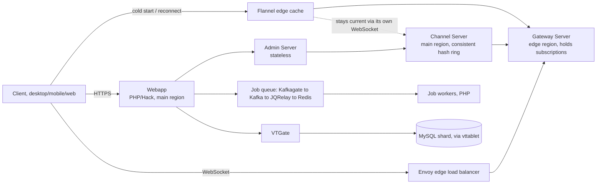
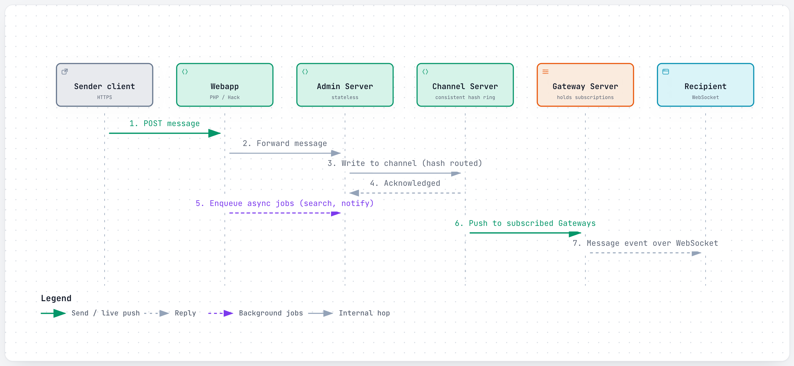
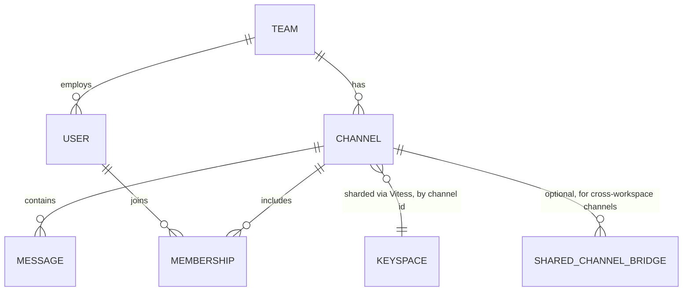
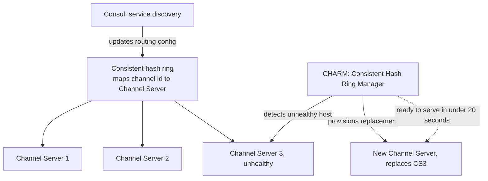
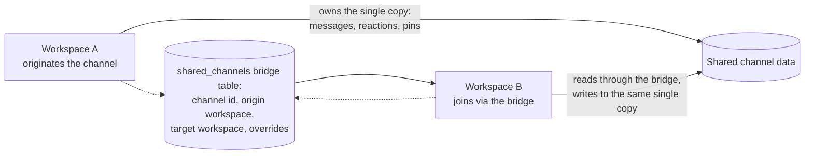

# Slack: how a message reaches every device on your team in half a second

> **In 60 seconds:** Slack splits its real-time layer into two kinds of stateful server: Channel Servers, which own a slice of channels and hold their recent history in memory, and Gateway Servers, deployed close to users at the network edge, which hold each connected client's WebSocket and the list of channels it cares about.
>
> A posted message flows client → Webapp → Admin Server → the right Channel Server (found via consistent hashing) → out to every Gateway Server subscribed to that channel → down each one's open WebSockets to clients, landing worldwide within about 500 milliseconds.
>
> Underneath, Slack ran MySQL sharded by workspace for years, then spent roughly three years migrating onto Vitess — the open-source sharding system built at YouTube — specifically so it could reshard by *channel*, not just by workspace, because a handful of huge customers were each too big for one shard's hardware.
>
> An edge cache called Flannel serves new or reconnecting clients a slimmed-down snapshot of their team instead of the full data blob, because Slack's largest workspaces have tens of thousands of members and a full reload for every one of them, all at once, is how you create an outage.
>
> And a custom Kafka-backed job queue handles everything that shouldn't block a web request — search indexing, notifications, billing — at over a billion jobs a day.

**Last reviewed:** September 2026 · **Difficulty:** Advanced · **Reading time:** ~35 min

## Table of contents

- [Before you read: design it yourself](#before-you-read-design-it-yourself)
- [The problem](#the-problem)
- [Scale](#scale)
- [Back-of-the-envelope math](#back-of-the-envelope-math)
- [Requirements](#requirements)
- [How it evolved](#how-it-evolved)
- [High-level design](#high-level-design)
- [Low-level design](#low-level-design)
- [Deep dives](#deep-dives)
- [What happens when things break](#what-happens-when-things-break)
- [Key design decisions](#key-design-decisions)
- [Interview takeaways](#interview-takeaways)
- [Glossary](#glossary)
- [Sources](#sources)

## Before you read: design it yourself

Try each question for 5 minutes before reading the answer — the "how Slack does it" boxes are collapsed so you're not tempted to peek early.

### Q1. It's 9am Monday and every laptop at a 160,000-person company reconnects within the same few minutes — how do you avoid that being its own mini-outage?

<details>
<summary>Hint</summary>

Think about what a client actually needs the instant it starts up, versus a full copy of everything the backend knows about the team.

</details>

<details>
<summary>How Slack does it</summary>

Flannel, an edge cache deployed like the connection layer itself, serves new or reconnecting clients a slimmed-down snapshot instead of the full team data blob — measured at roughly 7x smaller for a 1,500-user team and 44x smaller for a 32,000-user team, with the savings compounding as teams get bigger. It stays current by holding its own live WebSocket back to the main region, and even opportunistically prefetches data (e.g., for a colleague you just @-mentioned) just ahead of when a client will need it.

Deep dive: [Flannel: solving the reconnect storm before it starts](#flannel-solving-the-reconnect-storm-before-it-starts).

</details>

### Q2. How do you route a new message out to every connected device in a channel without every server having to track every open socket?

<details>
<summary>Hint</summary>

Think about splitting "who owns this channel's data" from "who owns this specific user's live connection" into two different kinds of server.

</details>

<details>
<summary>How Slack does it</summary>

Channel Servers (stateful, central, own a slice of channels via consistent hashing) hold channel state and recent history; Gateway Servers (stateful, deployed at the edge near users) hold each client's WebSocket and subscriptions. A Channel Server only ever talks to Gateway Servers, never individual sockets, so adding more edge capacity for connections doesn't require the storage tier to know or care how many sockets exist behind it — the two scale independently.

Deep dive: [Channel Servers and Gateway Servers](#channel-servers-and-gateway-servers-separating-storage-of-truth-from-the-edge).

</details>

### Q3. Your sharding key (workspace ID) stops working because a handful of customers are each bigger than any one shard's hardware — what now?

<details>
<summary>Hint</summary>

Think about what finer-grained key you could reshard by instead of the whole workspace, and why you might keep MySQL rather than swap databases entirely.

</details>

<details>
<summary>How Slack does it</summary>

A ~3-year migration onto Vitess (built at YouTube) let Slack reshard by something more flexible than workspace — messages, for instance, by channel ID — so one giant workspace's load spreads across many shards instead of being stuck on one. Slack deliberately rejected NoSQL/NewSQL alternatives to keep MySQL's operational familiarity, and the payoff showed up directly in March 2020, when a 50%-in-one-week pandemic query spike was absorbed by horizontally splitting one of the busiest keyspaces with Vitess's splitting workflows — without which, Slack says, it would have faced downtime for its largest customers.

Deep dive: [The Vitess migration](#the-vitess-migration-from-one-shard-per-workspace-to-flexible-resharding).

</details>

### Q4. A stateful, in-memory Channel Server crashes — how do you make that a non-event, and what happens when the failure is a whole layer below your application (the network itself)?

<details>
<summary>Hint</summary>

Think about how few channels should have to move when one server disappears from the ring — then think about what your autoscaler assumes about the network being healthy.

</details>

<details>
<summary>How Slack does it</summary>

Consistent hashing means losing a Channel Server only reassigns the slice of channels it owned; CHARM (Slack's ring manager) detects the unhealthy host and gets a replacement serving traffic in under 20 seconds via Consul. That doesn't help when the failure is one layer down: on January 4, 2021, a saturated AWS Transit Gateway caused a multi-hour global outage where autoscaling misread "network-starved, so CPU looks idle" as "safe to remove capacity," actively shutting down healthy web servers during the incident — a reminder to check what your control systems assume about the layer underneath them.

Deep dive: [Consistent hashing and CHARM](#consistent-hashing-and-charm-turning-a-stateful-server-crash-into-a-non-event) and [What happens when things break](#what-happens-when-things-break).

</details>

## The problem

It's 9:00 AM on a Monday at a company with 160,000 active Slack users — a real scale Slack has documented for its largest customers [8].

Laptops all over the world wake up from the weekend within the same few minutes. Every one of them tries to reconnect to Slack at once, and every one of them has a stale local cache of "who's in this workspace, what channels exist, who's online."

If the backend tried to answer all of that from scratch, for all of them, at the same moment, that reconnect storm alone could be enough to take down the service — before anyone has even sent a single new message.

Now someone on the leadership team posts an announcement in a channel with thousands of members spread across time zones. That message has to reach every one of their open laptops, phones, and browser tabs, worldwide, in about the time it takes to blink.

This page tries to answer three questions a junior engineer should walk away able to answer:

1. **How do you serve a single workspace with hundreds of thousands of members without every reconnect being its own mini-outage?**
2. **What do you do when your sharding key (which workspace a row belongs to) stops working because a few customers are each bigger than any one shard's hardware?**
3. **How do you keep a message-send request fast when half the work it triggers (search indexing, notifications, billing) doesn't need to happen before you reply to the client?**

## Scale

| Metric | Number | Source |
|---|---|---|
| Peak Vitess query load | 2.3 million QPS (2 million reads + 300,000 writes) | [2] |
| Vitess median / p99 latency | 2ms / 11ms | [2] |
| Share of MySQL traffic on Vitess | 99% (Dec 2020) | [2] |
| Vitess migration duration | ~3 years, starting 2017 (problems scoped fall 2016) | [2] |
| Job queue volume | 1.4 billion jobs/day, peak 33,000 jobs/sec | [4] |
| Kafka cluster (job queue) | 16 brokers, 32 partitions/topic, replication factor 3, 2-day retention | [4] |
| Flannel peak connections | 4 million simultaneous | [3] |
| Flannel peak query rate | 600,000 client queries/sec | [3] |
| Flannel data-size reduction | 7x smaller (1.5K-user team) to 44x smaller (32K-user team) | [3] |
| Channels served per Channel Server host, at peak | ~16 million | [1] |
| Channel Server failover time | new CS ready to serve in under 20 seconds | [1] |
| Global message delivery latency | worldwide delivery within 500ms | [1] |
| Largest documented customers (shared channels) | 160,000+ active users, 5,000+ shared channels (2019) | [8] |
| Search relevance improvement (Nov 2016 re-ranking rollout) | +9% clicked searches, +27% position-1 clicks, 50% of users | [6] |
| January 4, 2021 outage duration | ~4 hours (errors by 6:57 AM PST; network normal 10:40 AM PST) | [7] |
| Message success rate during Jan 2021 outage | ~99% vs. a normal >99.999% | [7] |
| Servers Slack attempted to add during the outage | 1,200 | [7] |
| Query-rate spike, March 2020 pandemic surge | +50% in one week | [2] |
| Unified Grid rollout | Fall 2023 → completed March 2024; touched thousands of APIs | [9] |
| Founding | Tiny Speck founded 2009; Glitch shut down 2012; Slack launched 2013 | [10], [13] |
| Daily active users | ~42 million (2024, estimate) | [14] *(third-party, unconfirmed by Slack directly)* |

What these numbers mean in practice:

- 2.3 million queries per second against MySQL is the kind of load that breaks a "shard by customer" model the moment even one customer's workspace gets large enough to need more than one shard's worth of hardware.

  That's exactly the problem the multi-year Vitess migration exists to solve.

- A 20-second failover time for a Channel Server, achieved through consistent hashing plus automated ring management, is what makes losing a single host a non-event for users instead of a visible incident.

  Most of this page's "what happens when things break" section is really about failures *smaller* than a 20-second blip somehow becoming *bigger* than that.

- The gap between "99.999% success rate" (normal) and "99%" (during the January 2021 outage) sounds small as a percentage.

  But at Slack's traffic volume it represents a multi-hour, worldwide, front-page incident — a reminder that "the success rate barely moved" and "this was a severe outage" can both be true statements about the same event.

## Back-of-the-envelope math

Back-of-the-envelope math is the rough, order-of-magnitude estimating engineers do on a whiteboard — no calculator, no precise data, just enough arithmetic to check whether a design idea is remotely plausible before building it. Inputs marked **[n]** come straight from this page's [Scale](#scale) table and cite the same source; everything else is a labeled **Assumption**, not a fact.

### Estimate 1: What's the peak-to-average ratio for the job queue?

**Question:** Slack's job queue processes 1.4 billion jobs/day with a documented peak of 33,000 jobs/sec. How does that peak compare to the average rate, and does it fit the usual "peak ~2-3x average" rule of thumb?

**Inputs:**
- Job queue volume: 1.4 billion jobs/day, peak 33,000 jobs/sec [4]
- Rule of thumb: 1 day ≈ 86,400 s.

**Math:**
```text
average jobs/sec = 1,400,000,000 / 86,400
                  ≈ 16,204/sec

peak / average    = 33,000 / 16,204
                  ≈ 2.04x
```

**Answer:** ~16,200 jobs/sec average; peak is about 2x average.

**What it tells you:** a ~2x peak-to-average ratio is right in the ordinary range — it's why the Kafka-backed buffer in front of Redis (see [The job queue](#the-job-queue-from-a-redis-outage-to-a-kafka-backed-pipeline)) only needs to absorb roughly double the average load, not an order of magnitude more, to keep up.

### Estimate 2: How often does each Flannel connection actually query it?

**Question:** Flannel serves 4 million simultaneous connections at a peak query rate of 600,000 queries/sec. On average, how often does each connection query it?

**Inputs:**
- Flannel peak connections: 4 million simultaneous [3]
- Flannel peak query rate: 600,000 client queries/sec [3]

**Math:**
```text
queries per connection per second = 600,000 / 4,000,000
                                   = 0.15/sec
                                   ≈ 1 query every ~6.7 s
```

**Answer:** ~0.15 queries/sec per connection (about one every 7 seconds).

**What it tells you:** confirms Flannel's job is serving a light, bursty trickle of lookups per client — consistent with it being an edge cache doing opportunistic prefetching, not a service under continuous per-client polling; see [Flannel: solving the reconnect storm before it starts](#flannel-solving-the-reconnect-storm-before-it-starts).

### Estimate 3: What fraction of Slack's peak database load is writes?

**Question:** Given 2.3 million peak Vitess QPS split into 2 million reads and 300,000 writes, what's the write share and the read:write ratio?

**Inputs:**
- Peak Vitess query load: 2.3 million QPS (2 million reads + 300,000 writes) [2]

**Math:**
```text
write share    = 300,000 / 2,300,000 ≈ 0.130 → ~13%
read:write     = 2,000,000 : 300,000 ≈ 6.7 : 1
```

**Answer:** ~13% writes; roughly 6.7 reads for every write.

**What it tells you:** a strongly read-heavy workload like this is exactly why [the Vitess migration](#the-vitess-migration-from-one-shard-per-workspace-to-flexible-resharding) — and Vitess's read/replica-serving design generally — matters as much as write-side resharding.

### Estimate 4: How much would 2 days of peak job volume cost to buffer in Kafka?

**Question:** Slack's job-queue Kafka retains data for 2 days. Roughly how much storage would that be at the documented peak rate?

**Inputs:**
- Kafka retention: 2-day [4]
- Peak jobs/sec: 33,000 [4]
- Replication factor: 3 [4]
- Assumption: an average job's payload (references/metadata, not full message bodies) is about 1KB.

**Math:**
```text
jobs in 2 days at peak = 33,000/s × 86,400 s/day × 2 days
                        = 33,000 × 172,800
                        = 5,702,400,000 ≈ 5.7 billion jobs

raw storage   = 5.7 billion jobs × 1 KB/job ≈ 5.7 TB
replicated    = 5.7 TB × 3 ≈ 17 TB
```

**Answer:** ~5.7 billion jobs / ~5.7TB raw (~17TB replicated) if sustained at peak for the full 2-day retention window.

**What it tells you:** replication (factor 3) roughly triples the storage cost of that safety margin — a concrete reason Kafka here is treated as a short-term durable buffer (2-day retention), not a permanent archive; see [The job queue](#the-job-queue-from-a-redis-outage-to-a-kafka-backed-pipeline).

### Estimate 5: How many background jobs does one daily active user generate?

**Question:** On average, how many background jobs does Slack process per daily active user?

**Inputs:**
- Job queue volume: 1.4 billion jobs/day [4]
- Daily active users: ~42 million (2024, estimate) [14] *(third-party, unconfirmed)*

**Math:**
```text
jobs per DAU per day = 1,400,000,000 / 42,000,000
                      ≈ 33.3
```

**Answer:** ~33 jobs per daily active user per day.

**What it tells you:** a single user's ordinary daily activity (a handful of messages, reactions, mentions) fans out into dozens of background jobs — quantifying why job-queue durability is "a real product defect, not a cosmetic one" as the [Requirements](#requirements) section states.

### Rules of thumb used

| Rule | Value |
|---|---|
| 1 day | ~86,400 s ~ 10^5 s |
| 1 KB | ~10^3 bytes |
| Peak vs. average load | typically ~2-3x |

These are general estimating conventions, not Slack-specific facts.

## Requirements

**Functional:**
- Real-time messaging in channels and DMs, inside workspaces ranging from a handful of people to hundreds of thousands. *Slack's product spans small startups and the largest enterprises on the same underlying platform.*
- Presence (who's currently online) visible in real time across a workspace. *A core part of the "who's around right now" feeling that differentiates chat from email.*
- Full-text search across a workspace's message history. *Slack's own name is an acronym for "Searchable Log of All Conversation and Knowledge" — search isn't a bolted-on feature, it's the founding premise [10].*
- Shared Channels connecting two separate organizations' workspaces. *Enterprises increasingly wanted to collaborate with vendors and partners without managing guest accounts for every person [8].*
- A single organization spread across many workspaces (Enterprise Grid) able to see org-wide activity in one place. *Large customers outgrew "one workspace = one company" once they wanted regional or departmental workspaces that still felt like one connected company [9].*
- Asynchronous processing for anything that shouldn't block sending a message: search indexing, push notifications, URL unfurling, billing calculations [4].

**Non-functional:**
- **Global delivery latency around 500ms**, because a chat product that visibly lags stops feeling real-time [1].
- **No single customer's workspace should be able to overload infrastructure shared with everyone else's.** A "noisy neighbor" problem is unacceptable in a multi-tenant product serving both three-person startups and 160,000-person enterprises on the same fleet.
- **Elastic, fine-grained horizontal scaling of the database layer**, because customer size varies by many orders of magnitude and a fixed per-customer shard eventually stops fitting the biggest customers [2].
- **Durability for async jobs.** A dropped push notification or a silently-failed search-index write is a real product defect, not a cosmetic one, at Slack's job volume [4].
- **Fast, safe failover for stateful real-time servers.** Channel Servers and Gateway Servers hold state in memory for performance, which means losing one has to be fast and non-disruptive, not something users notice [1].
- **New and reconnecting clients shouldn't have to reload an entire team's worth of data from the backend**, especially not all at once during a mass-reconnect event [3].

## How it evolved



Slack's infrastructure story starts, famously, as a company that wasn't trying to build a chat app at all.

**2009–2012 — a game studio, not a messaging company.** Tiny Speck, founded by Stewart Butterfield and several former Flickr colleagues, spent years building an ambitious browser game called Glitch [13].

The internal tool the team built to communicate while making that game outlived the game itself.

**2012–2013 — the pivot.** When Glitch's servers shut down for good, Butterfield published an internal memo — "We Don't Sell Saddles Here" — reframing what the team was really in the business of [10], [13].

Slack launched in 2013, built on the bones of that internal communication tool. From day one, Slack's MySQL was sharded by workspace ID, a natural first choice: it kept one customer's data together and made most queries workspace-scoped [2].

**2016 — the workspace-shard model starts to crack.** By fall 2016, Slack was running hundreds of thousands of MySQL queries per second across thousands of sharded hosts.

A structural problem was showing: the busiest hosts — holding the largest customers — had to handle all of those customers' traffic on fixed hardware, while thousands of other hosts sat comparatively idle [2]. Sharding by workspace meant a workspace could not itself be split across multiple shards, no matter how big it got.

**2017 — the edge layer and search re-ranking get documented.** Flannel shipped (running at the edge since January 2017) to solve reconnect storms for large teams [3], and Slack wrote up its Solr-based search with a machine-learned re-ranker rolled out in November 2016 [6]. (The Channel Server / Gateway Server real-time architecture was written up later, in April 2023 [1].)

Behind the scenes, the job queue was also rebuilt this era: roughly a year earlier, a purely Redis-based queue had caused a significant production outage — database contention slowed job execution, Redis hit its memory limit, and new jobs could no longer be enqueued. The fix layered Kafka in front of Redis for durability [4].

**2019 — Shared Channels.** Connecting two different companies' workspaces broke Slack's founding assumption that a workspace is the atomic unit of data partitioning, and required a genuinely new cross-workspace data model rather than an extension of the existing one [8].

**2020 — Vitess finishes the job it started in 2017.** By December 2020, 99% of Slack's MySQL traffic ran through Vitess, peaking at 2.3 million queries per second [2].

That same year, the pandemic-driven remote-work surge tested the new architecture directly: query rates jumped 50% in a single week, and Slack scaled one of its busiest keyspaces horizontally with Vitess's splitting workflows — without that, it says, the largest customers would have seen downtime [2].

**2021 — the network layer proves that application-level resilience isn't the whole story.** A multi-hour global outage on January 4, 2021 was triggered not by an application bug but by an overloaded AWS Transit Gateway — the network layer underneath everything Slack had built [7].

Full details are in the failure section below.

**2022 — a single inefficient background job nearly repeats the pattern.** A "forget user" job querying too broadly overwhelmed part of the Vitess fleet during a large customer's bulk user removal.

This again showed that a well-architected data layer can still be brought to its knees by one badly-scoped piece of application code [5].

**2023–2024 — Unified Grid.** As large customers increasingly had users who belonged to many workspaces inside one organization, Slack undertook a multi-quarter re-architecture — touching "thousands of APIs, database queries, and permissions checks."

The goal: let those users see org-wide activity in a single unified view, rather than needing to context-switch between workspaces manually [9].

## High-level design



Walking through it:

1. **Clients keep one persistent connection to the edge, not to the core.** On startup, a client fetches credentials from the Webapp, then opens a WebSocket to the *nearest* Gateway Server, via Envoy load balancing at the edge [1].

   This is deliberate geography: Gateway Servers are deployed in edge regions close to users, while the Webapp and Channel Servers live in Slack's main region [1].

2. **The Gateway Server subscribes to the channels its user cares about.** Rather than holding a copy of a channel's full history, a Gateway Server asynchronously subscribes to the relevant Channel Servers for the channels its connected users are in [1].

3. **Posting a message goes through the Webapp, not directly to a Channel Server.** A client sends a new message over HTTPS to the Webapp, historically PHP/Hack.

   The Webapp hands it to a stateless Admin Server, which routes it to the correct Channel Server using consistent hashing on the channel ID [1].

4. **The Channel Server owns that slice of channels.** Channel Servers are stateful and in-memory, each owning a subset of all channels — at peak, a single host has served roughly 16 million channels [1].

   Once the Channel Server accepts the message, it pushes it out to every Gateway Server currently subscribed to that channel.

5. **Gateway Servers do the last-mile fan-out.** Each subscribed Gateway Server pushes the message down its own open WebSockets to whichever connected clients are in that channel — this is the step that actually reaches a user's laptop or phone.

6. **Anything that doesn't need to happen before replying to the client goes to the job queue instead.** Search indexing, push notifications, and other background work get handed to Slack's Kafka-backed job queue rather than being done inline on the request path [4].

7. **The data layer underneath is Vitess, not raw MySQL.** Reads and writes from the Webapp and Admin Servers go through VTGate, Vitess's query router, which directs them to the correct shard's `vttablet`.

   That shard boundary is today chosen far more flexibly (e.g., by channel) than the original one-shard-per-workspace design [2].

8. **New and reconnecting clients talk to Flannel first, not the full backend.** Flannel — deployed at the edge like the Gateway Servers — serves a slimmed-down snapshot of team data on client startup.

   It keeps that snapshot current by maintaining its own WebSocket connection back to the main region [3].

## Low-level design

### 1. Core flow: posting a message and fanning it out

<a href="https://alwintwk.github.io/big-tech-system-design/diagrams/companies-slack-send-message.html">
  <picture>
    <source media="(prefers-color-scheme: dark)" srcset="../diagrams/companies-slack-send-message.dark.png">
    
  </picture>
</a>

<sub>Click the diagram for the interactive version (zoom, dark mode, trace a path).</sub>

The step worth dwelling on is `CS->>GS`: the Channel Server doesn't try to reach individual client sockets directly — it only knows about Gateway Servers, and each Gateway Server only knows about its own connected clients.

That two-level indirection (Channel Server → Gateway Servers → clients) is what lets Slack scale the number of *connections* independently from the number of *channels*: adding another edge region full of Gateway Servers doesn't require Channel Servers to know or care how many individual sockets exist behind each one.

### 2. Data model: workspaces, channels, and the sharding key



> Note: this is a simplified reference model. Slack's own posts describe the *shape* of this data (workspace-scoped tables, a channel-based sharding key, a bridge table for shared channels) [2], [8] but not a literal schema; treat table names as illustrative.

The important shift here is the move away from workspace ID as the sharding key. Sharding purely by workspace meant one giant customer's entire dataset had to live on shards sized for that one customer, while thousands of small customers' shards sat underused [2]. Resharding by something finer-grained — channel ID, for message data specifically — let Slack spread even one enormous workspace's load across many shards, which is the entire point of the multi-year Vitess migration [2].

### 3. Signature component: the Channel Server hash ring and fast failover



Consistent hashing means each channel maps to one Channel Server based on a hash of its ID, and — critically — when a server is added or removed, only the channels that mapped to *that* server need to move, not the entire fleet's worth of channels [1]. A component Slack calls **CHARM** (Consistent Hash Ring Manager) owns this ring and can get a freshly-provisioned replacement Channel Server serving traffic in under 20 seconds after an unhealthy one is detected, with Consul handling the service-discovery side of propagating the change [1]. This is the mechanism that makes losing a single stateful, in-memory server a routine, sub-30-second event instead of a visible incident.

### 4. Shared Channels: one copy of the data, a bridge table for the rest



Rather than duplicating a shared channel's entire content into both organizations' workspace shards, Slack keeps a single copy of the channel's data in its originating workspace.

It connects the second workspace to that data through a lightweight `shared_channels` bridge table holding the channel ID, both workspace IDs, and per-workspace overrides, like a locally-customized channel name [8].

This is a direct consequence of the sharding decision above: because Slack could not cheaply duplicate and keep two full copies of a channel in sync across separate shards, it instead broke its own founding assumption that "the workspace is the atomic unit of partitioning" and built a narrow bridge across that boundary instead [8].

## Deep dives

### Channel Servers and Gateway Servers: separating "storage of truth" from "the edge"

> **Why this matters:** this two-tier split is the core reason Slack can put connection-handling capacity physically close to users worldwide while keeping the messy, stateful part of the system (who owns which channel's data) centralized and simple to reason about.

Channel Servers are stateful and in-memory, and each one is responsible for a defined subset of all channels, chosen by consistent hashing [1].

Gateway Servers are also stateful and in-memory, but they hold a completely different kind of state: not channel content, but *which users are connected through this particular server and which channels they currently care about* [1].

Splitting these two kinds of state into two kinds of server means they can be deployed differently and scaled independently.

Gateway Servers, which mostly need to be physically close to users, live in edge regions; Channel Servers, which need to be close to each other and to the rest of the backend, live centrally [1].

Scaling up connection capacity (add more edge regions) and scaling up channel-storage capacity (add more Channel Servers) become two separate operational problems instead of one coupled one.

### Consistent hashing and CHARM: turning a stateful-server crash into a non-event

> **Why this matters:** stateful, in-memory servers are fast, but they're inherently fragile compared to stateless ones — losing one loses whatever it was holding in memory. Consistent hashing plus fast automated replacement is how Slack gets the speed of in-memory state without the usual fragility.

The core idea of consistent hashing is that adding or removing one node from the ring only reassigns the small slice of keys (here, channels) that mapped to that specific node — not a full reshuffle of everything [1].

That property is what makes CHARM's job tractable: when it detects an unhealthy Channel Server, it doesn't need to coordinate a fleet-wide rebalance, it just needs to stand up a replacement for that one slice of the ring and update the routing configuration (via Consul) to point at it [1].

The 20-second target for this whole cycle — detect, provision, redirect — is short enough that most users experience it, if at all, as a brief reconnect rather than a visible outage [1].

### Flannel: solving the reconnect storm before it starts

> **Why this matters:** Slack's largest workspaces have tens of thousands of members; without Flannel, "everyone reconnects at 9am Monday" is a structurally dangerous event, not just a busy morning.

The problem Flannel solves is specific: a workspace with, say, 32,000 members has a lot of shared reference data (user profiles, channel lists) that every single client would otherwise need to fetch on startup [3].

Flannel sits at the edge, deployed like the Gateway Servers, and keeps itself current by maintaining its own WebSocket connection back to Slack's main region, consuming real-time events as they happen [3].

When a client starts up, instead of pulling a full copy of the team's data from the core backend, it gets a slimmed-down version from the nearest Flannel instance.

That data-size reduction was measured at roughly 7x for a 1,500-user team and roughly 44x for a 32,000-user team — precisely because the savings compound with team size [3].

Flannel also does opportunistic prefetching: if a user mentions a colleague who isn't yet cached, Flannel can push that colleague's basic data to relevant clients just ahead of the message itself, saving what would otherwise be a separate round-trip [3].

Consistent hashing routes users from the same team and networking region to the same Flannel instance, which is what makes its cache effective in the first place — team data is naturally clustered on the instances most likely to be asked about it again [3].

### The Vitess migration: from one-shard-per-workspace to flexible resharding

> **Why this matters:** this is a multi-year, still-actively-cited case study in "the sharding key you started with can stop working," and in choosing to fix the *foundation* rather than patch around its limits indefinitely.

Slack's original setup used three kinds of MySQL cluster: workspace-sharded customer data, a metadata cluster mapping workspace to shard, and a "kitchen sink" cluster for anything not workspace-specific [2].

The core limitation was structural, not a matter of needing more hardware: a single workspace's data could not itself span multiple shards.

The largest customers were capped by whatever the single largest available machine could hold, while most of the fleet sat comparatively idle [2].

Vitess appealed specifically because it let Slack keep MySQL, with all its operational familiarity, while gaining a flexible sharding model — a workspace's messages, for instance, could now be sharded by channel ID instead of forced onto one shard as a unit.

It also brought automatic handling of primary failovers, backups, and topology management that Slack's own tooling had previously had to reimplement by hand [2].

Slack deliberately evaluated and rejected both NoSQL options (DynamoDB, Cassandra) and NewSQL options (Spanner, CockroachDB), because neither category let it keep MySQL's operational model and semantics while solving the sharding-flexibility problem specifically [2].

Slack didn't just adopt Vitess passively — it became a significant contributor upstream, working on topology-service scalability, MySQL compatibility gaps, data-migration tooling, load testing, and integrations with Prometheus and Orchestrator [2].

The payoff showed up concretely in March 2020: when pandemic-driven remote work spiked query rates 50% in a single week, Slack scaled one of its busiest keyspaces horizontally with Vitess's splitting workflows, avoiding the downtime its largest customers would otherwise have faced — exactly the flexibility the original workspace-only sharding scheme couldn't offer [2].

### The job queue: from a Redis outage to a Kafka-backed pipeline

> **Why this matters:** this is a clean example of upgrading a queue's durability guarantees *after* nearly being burned by their absence, rather than over-engineering durability in from day one.

Slack's job queue handles the asynchronous side of nearly everything: every message post, push notification, URL unfurl, calendar reminder, and billing calculation that doesn't need to complete before a web request returns [4].

The original design ran entirely on Redis. When enqueue rates outpaced dequeue rates for long enough, Redis would eventually run out of memory and cause an outage.

That is what happened roughly a year before Slack's account was published: database contention slowed job execution, Redis hit its maximum configured memory, and new jobs could not be enqueued [4].

The fix added two small Go services rather than replacing the whole pipeline. **Kafkagate** exposes a simple HTTP endpoint that lets the PHP/Hack web application drop a job onto a specific Kafka topic and partition.

**JQRelay** relays jobs from Kafka into the existing Redis-based worker clusters, using Consul locks to guarantee exactly one relay process owns each Kafka topic at a time [4].

This design keeps Kafka as a durable buffer in front of Redis rather than removing Redis entirely — jobs survive a Redis blip because Kafka is still holding them, and JQRelay can apply rate limiting and retry logic as it drains the backlog back into Redis [4].

The Kafka cluster itself ran on 16 brokers with 32 partitions per topic, replication factor 3, 2-day retention, and rack-aware placement across AWS availability zones — though Kafkagate waits only for the leader's ack and unclean leader election is enabled, a deliberate lean toward availability over strict durability [4].

### Unified Grid: making an organization feel like one thing across many workspaces

> **Why this matters:** this is what happens when a product's growth outpaces its original data-partitioning assumption a *second* time — first Shared Channels (across organizations), then Unified Grid (across workspaces within one organization).

Slack's Enterprise Grid product let large customers split into multiple workspaces (by department, region, etc.), but as adoption grew, individual users increasingly belonged to several of those workspaces at once.

The original architecture assumed almost all data was scoped to a single workspace [9]. That assumption showed up as real friction: switching workspace context to see relevant activity, and missing notifications that lived in a workspace a user wasn't currently viewing [9].

The Unified Grid rewrite used three complementary strategies depending on what a given piece of data looked like.

For tables already migrated to Vitess and shardable by something workspace-independent (like messages sharded by channel ID), queries could often work with no schema changes at all.

For cases needing explicit context, users manually select a workspace.

For genuinely cross-workspace views, the system queries up to 50 "relevant" workspaces per user — a deliberately capped number chosen because a small number of users belong to genuinely hundreds of workspaces, and querying all of them isn't a fight worth having for a long tail [9].

The rollout ran from fall 2023 to completion in March 2024, and touched — in Slack's own words — "thousands of APIs, database queries, and permissions checks" across most of the product's engineering teams.

That scope is itself a data point about how deeply "which workspace am I in" had been baked into years of accumulated code [9].

### Search at Slack: why it isn't just "run a query against Solr"

> **Why this matters:** Slack's very name refers to search — "Searchable Log of All Conversation and Knowledge" — so treating relevance as a first-class, continuously-tuned system rather than an afterthought is close to a founding product principle [10].

Slack's search runs on Apache Solr for retrieval, but the interesting engineering is in a second, application-layer re-ranking pass on top of Solr's results [6].

Solr itself only needs to compute a handful of features cheaply — recency, a Lucene text-match score — to produce a first-pass candidate set.

A separate machine-learned model, trained with SparkML, then re-ranks that candidate set using a richer set of signals: the searching user's affinity to the message's author, channel or DM priority, engagement signals like pins, stars, and emoji reactions, and message characteristics like word count and formatting [6].

The training approach — Pairwise Transform, comparing a clicked result against its immediate neighbors in the results list — was chosen because Slack's search has none of the properties that make conventional web-search ranking work.

Every user searches their own unique set of documents, queries rarely repeat across different teams, and what's relevant shifts continuously as new messages arrive [6].

In exchange, Slack's search gets real advantages web search doesn't: no spam to filter, a much smaller per-team corpus, and rich interaction history to mine for training signal — all of which let it justify computing more per message than a general web search engine reasonably could [6].

The November 2016 rollout of this re-ranking approach, to half of users, measured a 9% increase in clicked searches and a 27% increase in position-1 clicks. That's meaningful given Slack's own stated motivation that knowledge workers spend roughly 20% of a workday just looking for information [6].

## What happens when things break

**The January 4, 2021 global outage.**

- *Trigger:* an AWS Transit Gateway (TGW) — network infrastructure underneath Slack's own services, not something Slack's application code touches directly — became saturated and started dropping packets as everyone returned from the holidays with cold local caches, generating an unusually large burst of traffic all at once [7].

- *What happened, step one:* error rates rose sharply around 6:57 AM PT, and message success rate fell from a normal >99.999% to about 99% [7].

- *What happened, step two:* Slack's automated response tried to add roughly 1,200 servers to the web tier to absorb the load — but the *provisioning service* itself hit a Linux open-files limit and an AWS API quota while trying to bring up that many instances at once, becoming its own bottleneck [7].

- *What happened, step three:* because CPU utilization on the (network-starved) web tier dropped while it waited on now-slow backend calls, autoscaling read that as "underutilized" and began *shutting down* healthy-looking web servers — actively removing capacity during an incident that needed more of it [7].

- *What made it worse:* Slack's own dashboards and alerting lived in a network path that also depended on the saturated Transit Gateway, so the tools needed to diagnose the incident were themselves degraded during the incident [7].

- *Why recovery took until mid-morning:* the underlying fix required AWS engineers to manually increase Transit Gateway capacity across every affected availability zone, which is not something Slack's own systems could trigger on their own [7].

- *What changed afterward:* Slack planned to run its dashboard services in the same VPC as their databases (removing the Transit Gateway dependency), to regularly load test the provisioning service, and to re-evaluate its health-check and autoscaling configuration so "CPU looks idle" isn't read as "this server is fine to remove" when the real cause is an upstream network problem [7].

- *The generalizable lesson:* the outage's severity came almost entirely from *automated systems reacting badly to a network problem* — autoscaling removing capacity, provisioning hitting its own limits, monitoring sharing the failed network path — rather than from the network problem itself, which is a strong argument for testing your automation's behavior under partial, weird failure, not just clean total failure.

**"The Query Strikes Again" — October 2022.**

- *Trigger:* a large customer removed a large number of users from their workspace at once, triggering Slack's "forget user" background job for each one [5].

- *What happened:* that job queried subscription data across *all* channels rather than a properly scoped subset, and separately spawned an individual "leave channel" job for every channel membership being removed — generating a disproportionate burst of load on one Vitess shard that happened to hold a comparatively small slice (about 6%) of the affected customer's data [5].

- *Why it cascaded:* replicas fell behind (replication lag), and the write load made the Vitess tablet on the shard primary run out of memory; the kernel OOM-killed MySQL, a replica was promoted, the new primary OOMed too, and replacement automation kept misjudging new replicas as unhealthy — an infinite loop of primary failures [5].

- *What changed afterward:* the owning team fixed the "leave channel" job's over-broad queries (scoping them to the one channel being left), jobs got exponential backoff and circuit breakers, and the Datastores team adopted throttling and circuit breakers to protect the database [5].

- *The generalizable lesson:* a perfectly healthy, well-architected sharded database can still be brought down by one inefficiently-scoped background job — infrastructure-level scalability (Vitess) and application-level query discipline are separate concerns, and you need both.

**The pre-Kafka Redis job queue outage (circa 2016).**

- *Trigger:* a sustained period where jobs were being enqueued faster than they could be dequeued and processed.
- *What happened:* Redis, holding the entire queue in memory with no durable buffer in front of it, eventually ran out of memory.
- *Why this counts as a design gap, not bad luck:* the trigger was database contention slowing job execution, but the outage came from a capacity mismatch between two rates (enqueue vs. dequeue) with no durable buffer to absorb it [4].
- *Why the fix (Kafka in front of Redis) generalizes:* putting a durable, replicated buffer in front of an in-memory queue means a temporary processing slowdown turns into a growing backlog instead of an outage. The system degrades by getting behind, which is recoverable, rather than by falling over, which isn't.

**A workspace with tens of thousands of members, before Flannel existed.**

- *Trigger:* a large team's worth of clients all starting up or reconnecting around the same time (e.g., a Monday morning), each needing a full copy of shared team reference data.
- *What happened (the problem Flannel was built to solve):* Slack's own account describes this producing connection delays, excessive client memory usage, expensive reconnections, and reconnection storms that stressed backend infrastructure directly [3].
- *Why the fix is architectural, not just "add caching":* Flannel isn't a generic cache bolted in front of the backend.
- *What makes it different from a generic cache:* it's specifically placed at the edge, keeps itself current via its own live connection, and serves a *smaller* payload than the original — not just a faster copy of the same one — which is what actually addresses both the latency and the reconnect-storm problems at once [3].

## Key design decisions

| Decision | Why | Trade-off |
|---|---|---|
| Split Channel Servers (storage) from Gateway Servers (edge connections) | Lets connection-handling live physically close to users while channel data stays centralized and simple to reason about [1] | Two kinds of stateful server to operate instead of one, each with its own failure and scaling story |
| Consistent hashing + CHARM for Channel Server placement | Losing one server only affects the small slice of channels it owned, and a replacement can be serving traffic in under 20 seconds [1] | Requires dedicated tooling (CHARM) and a service-discovery layer (Consul) most simpler systems don't need |
| Flannel edge cache for client startup/reconnect | Cuts payload size 7x–44x depending on team size and absorbs reconnect storms before they reach the core backend [3] | Another service to keep consistent with the source of truth, via its own real-time subscription |
| Vitess over NoSQL/NewSQL alternatives | Keeps MySQL's operational familiarity while adding flexible, non-workspace-bound sharding [2] | A multi-year migration project, plus becoming a significant upstream contributor to make Vitess fit Slack's needs |
| Kafka in front of Redis for the job queue | Converts "processing falls behind" from an outage (Redis OOM) into a recoverable, growing backlog [4] | More moving parts (Kafkagate, JQRelay, Consul locks) than a single Redis queue |
| Shared Channels as single-copy-plus-bridge-table, not duplicated data | Avoids the complexity and consistency risk of keeping two full copies of a channel in sync across workspace shards [8] | The bridge table and its overrides are an extra layer every shared-channel-aware code path has to account for |
| Unified Grid's capped "query up to 50 workspaces" approach | Handles the common case (a handful of workspaces per user) without the unbounded cost of the rare case (hundreds) [9] | Users in genuinely many workspaces don't get a fully complete org-wide view — a deliberate, disclosed limitation |
| Solr retrieval plus a separate ML re-ranking layer for search | Keeps expensive relevance computation off the hot retrieval path while still using rich, per-user signals [6] | Two systems (Solr's ranking and the app-layer model) that both influence result order, which is more moving parts to debug when relevance looks wrong |

## Interview takeaways

- **Separating "storage of truth" from "the edge" is a reusable pattern beyond Slack** — the same shape (a central, authoritative service plus a geographically-distributed layer that holds per-connection state) shows up in WhatsApp's connection servers and Discord's session/guild processes, each solving it slightly differently for their own product shape.
- **Consistent hashing's real payoff isn't the hashing itself, it's the failover story it enables.** Be ready to explain *why* only a small slice of keys move when a node changes — that's the property that makes a 20-second automated replacement possible instead of a full-fleet rebalance.
- **A sharding key chosen at launch can become the system's biggest constraint years later**, and the fix is sometimes "add a more flexible sharding layer" (Vitess) rather than "shard harder" with the same key. Naming *why* workspace ID stopped being a good sharding key (a handful of customers each outgrowing one shard's hardware) is a stronger interview answer than just saying "they needed to scale the database."
- **Not everything triggered by a user action needs to happen before you respond to them.** Slack's job queue is a clean example of drawing that line explicitly (message send is synchronous; search indexing and notifications are not) and then investing in durability for the async side specifically.
- **A network-layer failure (Slack's January 2021 outage) can be made dramatically worse by automated systems that don't know the failure is happening one layer below them** — autoscaling and monitoring both assumed a healthy network and made things worse when that assumption broke. Always ask, in an interview, what your control systems assume about the layer underneath them.
- **Infrastructure being well-architected doesn't protect you from a badly-scoped application query** — "the query strikes again" is a good, concrete story for why database scalability work and query-discipline code review are separate, both-necessary disciplines.
- **When a product's organizing assumption breaks (workspace = atomic unit of data), you don't have to re-architect everything at once** — Shared Channels solved the cross-organization case with a narrow bridge table; Unified Grid solved the cross-workspace-within-one-org case years later with a different, broader set of changes. Incremental, scoped fixes to a founding assumption are a legitimate strategy, not a sign of avoiding the "real" fix.
- **Search relevance for an internal tool is a genuinely different problem from web search**, and being able to say *why* (unique per-user document sets, no spam, small corpora, rich interaction history) is a good way to show you're not just pattern-matching "search = add Elasticsearch/Solr" without thinking about what's actually being ranked.

**A few follow-up questions worth rehearsing an answer to, if this page came up in an interview:**

- *"Why keep MySQL at all — why not just move to a distributed NoSQL database and avoid the sharding-key problem entirely?"* — Slack explicitly weighed this and rejected it: MySQL's transactional semantics and years of accumulated operational tooling and team expertise were worth preserving, and Vitess let them keep both while still solving the flexibility problem [2]. The lesson is that "the trendy distributed database" isn't automatically the right answer to "our sharding key doesn't work anymore" — sometimes a sharding *layer* on top of what you already run is the smaller, safer change.
- *"Isn't Flannel just a cache — why does it need its own name and architecture section?"* — Because it isn't a passive cache that goes stale and gets invalidated; it actively stays current via its own live subscription and deliberately serves a smaller payload than the source of truth, which is a different design than "cache the same response for N seconds."
- *"If Channel Servers hold state in memory, isn't that a scary single point of failure?"* — It would be, without consistent hashing and CHARM's fast automated replacement; the interesting design insight is that in-memory state is fine *as long as losing it is fast and cheap to recover from*, not that in-memory state should be avoided altogether.

## Glossary

New to these terms? The [concepts](../concepts/README.md) folder explains the core ideas in depth.

- **[WebSocket](../concepts/persistent-connections.md)**: a persistent, two-way connection between a client and server, used here so the server can push new messages the instant they happen instead of the client having to repeatedly ask "anything new?"
- **[Consistent hashing](../concepts/consistent-hashing.md)**: a way of mapping keys (like channel IDs) to servers such that adding or removing one server only reassigns the small slice of keys that mapped to it, instead of reshuffling everything.
- **Hash ring**: the conceptual circle consistent hashing maps both keys and servers onto, used to determine which server owns which key.
- **CHARM (Consistent Hash Ring Manager)**: Slack's internal component that manages the Channel Server hash ring, including detecting unhealthy servers and provisioning replacements.
- **[Envoy](../concepts/load-balancing.md)**: an open-source network proxy used here as an edge load balancer, routing client connections to the nearest Gateway Server.
- **Consul**: a service-discovery tool used to track which servers are currently healthy and where to route requests.
- **Channel Server**: a stateful Slack server holding a subset of all channels and their recent history, chosen by consistent hashing.
- **[Gateway Server](../concepts/persistent-connections.md)**: a stateful Slack server, deployed at the network edge, holding a connected client's WebSocket and its channel subscriptions.
- **Admin Server**: a stateless Slack server sitting between the Webapp and Channel Servers, routing requests to the right one.
- **Presence Server**: a Slack server tracking which users are currently online.
- **[Vitess](../concepts/sharding.md)**: an open-source system, originally built at YouTube, that adds flexible horizontal sharding, automatic failover, and topology management on top of ordinary MySQL.
- **VTGate**: Vitess's query-routing layer, which a client talks to as if it were a single MySQL database, while VTGate transparently routes each query to the correct shard.
- **vttablet**: the Vitess component that sits in front of one actual MySQL instance (one shard), managing it on Vitess's behalf.
- **Keyspace (in Vitess)**: a logical grouping of related sharded tables, roughly analogous to "a database" in ordinary MySQL terms.
- **[Resharding](../concepts/sharding.md)**: splitting or merging the shards underlying a keyspace, ideally without taking the data offline.
- **[Replication lag](../concepts/replication.md)**: how far behind a database replica is from the primary it's copying from; too much lag makes a replica's data too stale to safely serve reads from.
- **[Kafka](../concepts/message-queues-and-logs.md)**: a distributed, durable, append-only log used here as a buffer in front of Slack's job queue, so jobs survive even if the downstream worker system is temporarily overwhelmed.
- **Topic / partition (Kafka)**: a topic is a named stream of records; a partition is one ordered, independently-consumable slice of that stream, used to parallelize processing.
- **Redis**: an in-memory data store; used by Slack's job queue as the actual work queue that job workers pull from, with Kafka added in front of it for durability.
- **[Job queue](../concepts/message-queues-and-logs.md)**: a system for running work asynchronously, outside the request/response cycle of the action that triggered it.
- **Circuit breaker**: a safety mechanism that detects a downstream dependency is failing and temporarily stops sending it requests, to avoid making the failure worse.
- **[Throttler](../concepts/rate-limiting.md)**: a mechanism that deliberately slows down or limits a flow of requests to keep a downstream system from being overwhelmed.
- **[Flannel](../concepts/caching.md)**: Slack's application-level edge cache, serving a slimmed-down snapshot of team data to new or reconnecting clients.
- **Reconnect storm**: a surge of near-simultaneous reconnection attempts (e.g., after a network blip or everyone returning to work Monday morning), which can overwhelm backend systems if not specifically defended against.
- **Solr / Lucene**: Solr is a search server built on top of Lucene, the underlying text-indexing and scoring library; Slack uses Solr for the first-pass retrieval step of search.
- **Re-ranking**: taking an initial, cheaply-computed set of search results and reordering them using a more expensive, more accurate scoring model.
- **SparkML**: Apache Spark's machine learning library, used by Slack to train its search re-ranking model.
- **Enterprise Grid**: Slack's product tier letting a large organization operate multiple connected workspaces (e.g., by department or region).
- **Shared Channels**: a Slack feature connecting a channel across two different organizations' workspaces.
- **Bridge table**: a small table connecting two larger structures (here, two workspaces' views of one shared channel) without duplicating the underlying data.
- **Transit Gateway (AWS)**: an AWS networking service that connects multiple virtual networks together; its saturation was the root cause of Slack's January 2021 outage.
- **Autoscaling**: automatically adding or removing server capacity based on measured load, which can misbehave if its load signal (like CPU usage) doesn't reflect the real bottleneck.

## Sources

1. [Real-time Messaging](https://slack.engineering/real-time-messaging/) — Engineering at Slack.
2. [Scaling Datastores at Slack with Vitess](https://slack.engineering/scaling-datastores-at-slack-with-vitess/) — Engineering at Slack, December 2020.
3. [Flannel: An Application-Level Edge Cache to Make Slack Scale](https://slack.engineering/flannel-an-application-level-edge-cache-to-make-slack-scale/) — Engineering at Slack.
4. [Scaling Slack's Job Queue](https://slack.engineering/scaling-slacks-job-queue/) — Engineering at Slack, December 2017 (updated June 2020).
5. [The Query Strikes Again](https://slack.engineering/the-query-strikes-again/) — Engineering at Slack, November 2023 (describing an October 2022 incident).
6. [Search at Slack](https://slack.engineering/search-at-slack/) — Engineering at Slack, 2017.
7. [Slack's Outage on January 4th 2021](https://slack.engineering/slacks-outage-on-january-4th-2021/) — Engineering at Slack.
8. [How Slack Built Shared Channels](https://slack.engineering/how-slack-built-shared-channels/) — Engineering at Slack, September 2019 (updated June 2020).
9. [Unified Grid: How We Re-Architected Slack for Our Largest Customers](https://slack.engineering/unified-grid-how-we-re-architected-slack-for-our-largest-customers/) — Engineering at Slack.
10. Stewart Butterfield, ["We Don't Sell Saddles Here"](https://medium.com/@stewart/we-dont-sell-saddles-here-4c59524d650d) — internal Tiny Speck memo, July 31, 2013, later published on Medium by its author. *(primary, co-founder's own account)*
11. [How Slack leverages Vitess to keep up with its ever-growing storage needs](https://www.cncf.io/blog/2019/11/25/how-slack-leverages-vitess-to-keep-up-with-its-ever-growing-storage-needs/) — CNCF Blog. *(third-party)*
12. [Slack fingers AWS auto-scaling failure in January outage postmortem](https://www.theregister.com/2021/02/02/slack_outage_aws_autoscaling/) — The Register. *(third-party reporting on [7])*
13. [The death of Glitch, the birth of Slack](https://buildingslack.com/the-death-of-glitch-the-birth-of-slack/) — buildingslack.com. *(third-party, founding history)*
14. Daily active user estimates for 2024–2025, as aggregated by third-party analytics sites; Slack has not published official DAU figures since 2019. *(third-party, unconfirmed)*
