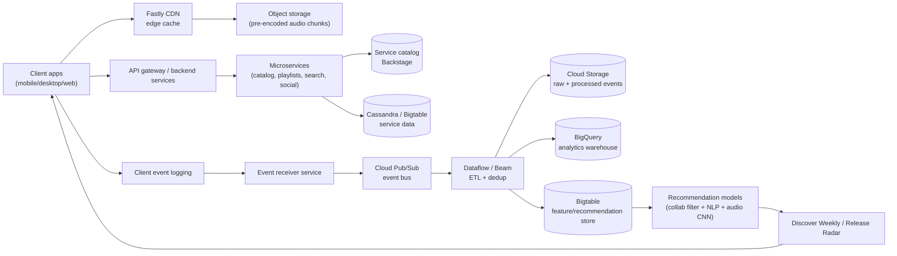
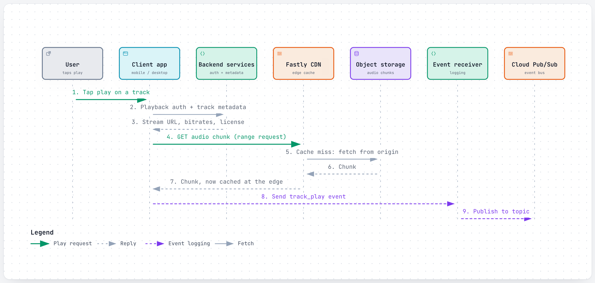
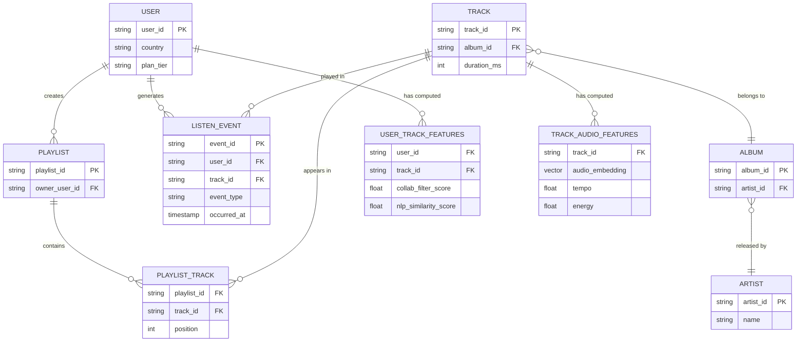
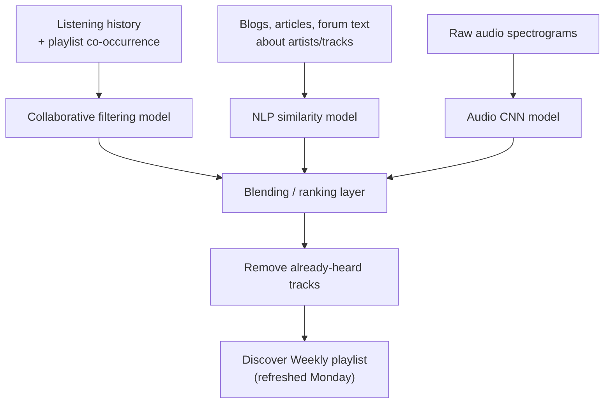
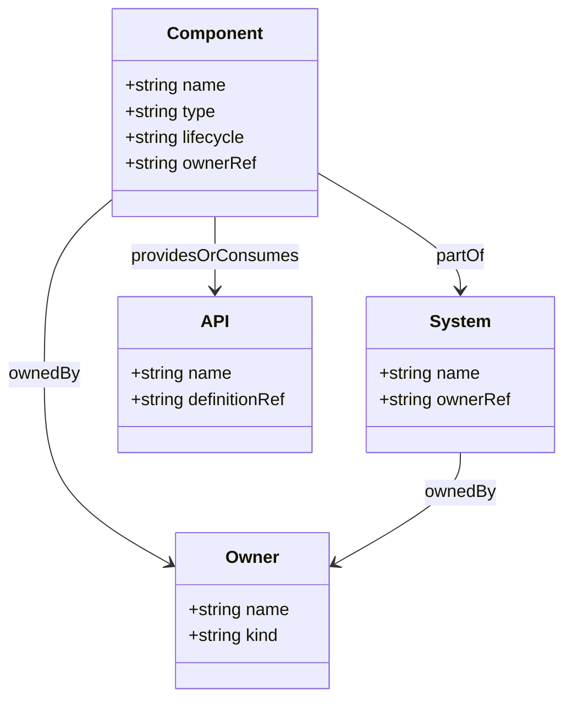
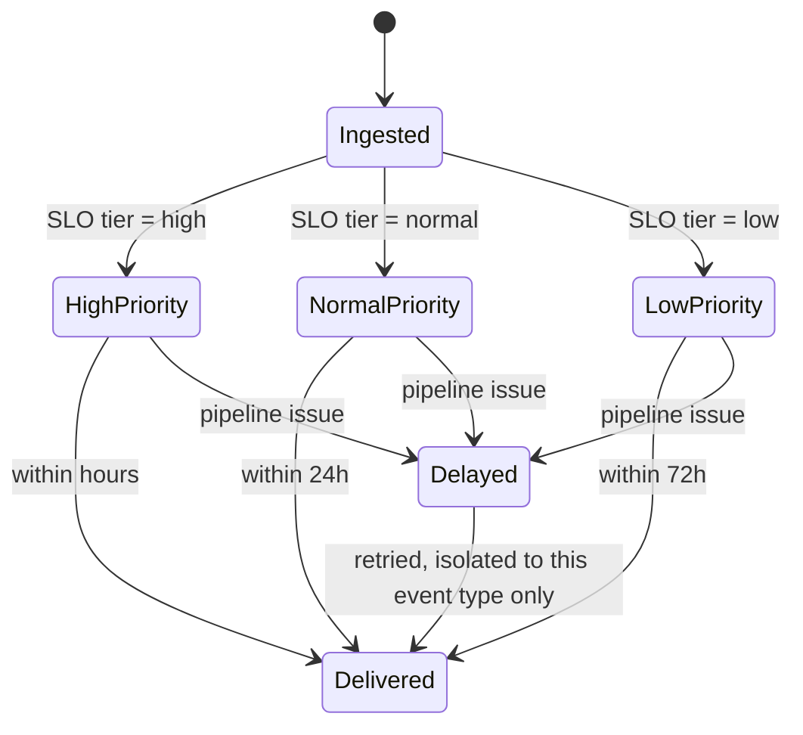
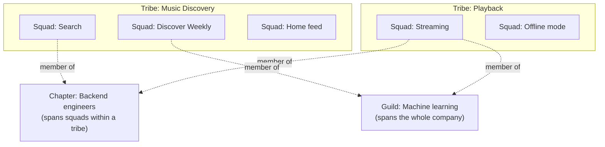
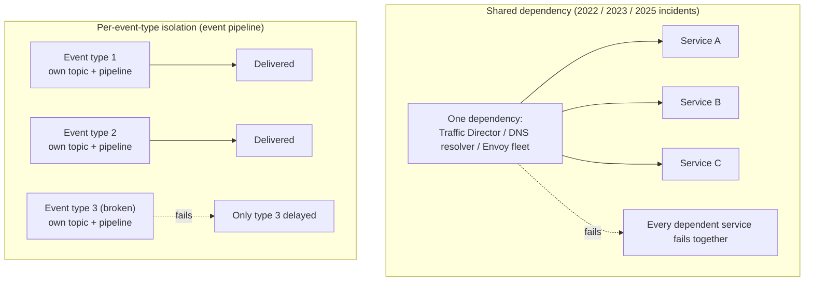

# Spotify: how a song starts in under a second, and how the app already knew you'd want to hear it

> **In 60 seconds:** Spotify streams audio in several fixed bitrate tiers, cached at CDN edges (Fastly, plus Akamai and AWS for audio; other content was standardized on Fastly in 2020), so a phone on patchy mobile data can start playback from a nearby cache instead of a distant origin server. Behind that sits a large, decentralized backend — thousands of independent microservices owned by autonomous "squads" — that Spotify catalogs through Backstage, an internal developer portal it built after engineers could no longer find who owned what, and later donated to the Cloud Native Computing Foundation (CNCF). Every user action (play, skip, search) is logged as an event and pushed through a cloud event-delivery pipeline — self-hosted Kafka until 2017, then Google Cloud Pub/Sub and Dataflow — into a data warehouse and feature stores that train machine learning models. Discover Weekly, one of the best-known outputs of that pipeline, combines three kinds of signal (other listeners' playlists and listening logs, web text about music, and audio spectrograms) into one playlist per user, recomputed and delivered every Monday. All of this now runs on Google Cloud Platform, which Spotify moved onto entirely between 2016 and 2018 after concluding it didn't want to keep running its own data centers.

**Last reviewed:** September 2026 · **Difficulty:** Intermediate · **Reading time:** ~20 min

## Table of contents

- [Before you read: design it yourself](#before-you-read-design-it-yourself)
- [The problem](#the-problem)
- [Scale](#scale)
- [Back-of-the-envelope math](#back-of-the-envelope-math)
- [Requirements](#requirements)
- [How it evolved](#how-it-evolved)
- [High-level design](#high-level-design)
- [Low-level design](#low-level-design)
- [Deep dives](#deep-dives)
- [What happens when things break](#what-happens-when-things-break)
- [Key design decisions](#key-design-decisions)
- [Interview takeaways](#interview-takeaways)
- [Glossary](#glossary)
- [Sources](#sources)

## Before you read: design it yourself

Try each question for 5 minutes before reading the answer — the point is to feel where the hard part is, not to get it "right."

### Q1. How do you get a song playing on a phone in under a second, on any network, anywhere in the world?

<details>
<summary>Hint</summary>

Think about what you'd have to pre-compute at upload time versus what you'd have to do at request time.

</details>

<details>
<summary>How Spotify does it</summary>

Audio is offered in fixed bitrate tiers, encoded ahead of time rather than on the fly, and cached at CDN edge nodes close to the listener (a reference design would also chunk files so clients can range-request the next few seconds). Audio ran on a multi-CDN setup (Akamai and AWS, plus Fastly) that worked well; everything else (images, client updates) had fragmented, with some squads serving straight from S3/GCS buckets, so in 2020 a new CDN squad standardized that on Fastly. Trade-off: storing every track in several bitrate copies multiplies storage cost, and standardizing on one CDN vendor trades away per-squad flexibility for one team owning monitoring and incident response.

Deep dive: [CDN and audio delivery](#cdn-and-audio-delivery-getting-bytes-to-a-phone-in-under-a-second)

</details>

### Q2. With thousands of backend services owned by hundreds of independent teams, how does anyone find out who owns a given service — or stop one team's autonomy from turning into chaos?

<details>
<summary>Hint</summary>

The fix here isn't code, it's a directory — but not the org chart.

</details>

<details>
<summary>How Spotify does it</summary>

Spotify built Backstage, an internal developer portal and service catalog, specifically because past 2,000+ services and hundreds of squads, "ask around on Slack" stopped being a viable way to find an owner. Every component (service, website, pipeline) self-registers with a small declarative file naming its owner, docs, and APIs, so ownership is queryable data instead of tribal knowledge. On the people side, Spotify organizes engineers into autonomous squads/tribes with cross-cutting chapters/guilds so the org structure actually matches independently-owned services. Trade-off: building and maintaining this "catalog of catalogs" is itself an ongoing investment that only pays off past a certain scale — Backstage cut onboarding time roughly in half once it did.

Deep dive: [Backstage](#backstage-the-service-catalog-built-because-who-owns-this-stopped-having-an-answer)

</details>

### Q3. How do you capture "the user did X" for every play, skip, and search, at hundreds of millions of events per second, without one broken event type taking down delivery of the other 500+?

<details>
<summary>Hint</summary>

What's the blast radius if every event type shares one pipeline?

</details>

<details>
<summary>How Spotify does it</summary>

Each of the 500+ event types gets its own Pub/Sub topic, its own ETL pipeline, and its own storage path, tagged with a priority SLO tier — the stated design principle is "liveness over lateness." Spotify rebuilt this pipeline twice: once moving off self-hosted Kafka (no broker replication, HDFS as the sole durability layer) onto Cloud Pub/Sub in 2017, then again in 2021 to fix "fire-and-forget" mobile clients that silently lost data. Event emission from the client is asynchronous and off the playback critical path, so a degraded pipeline never stops a song from playing. Trade-off: isolating every event type into its own topic/pipeline/SLO means far more independently-monitored moving pieces than one shared pipeline would need.

Deep dive: [Event delivery](#event-delivery-from-a-self-hosted-queue-to-a-managed-one-twice)

</details>

### Q4. How was "a playlist made just for you" computed out of hundreds of millions of other people's listening habits, before you ever opened the app?

<details>
<summary>Hint</summary>

One signal (what people played together) has an obvious blind spot for brand-new songs — what covers it?

</details>

<details>
<summary>How Spotify does it</summary>

Discover Weekly combines three kinds of signal — what similar listeners played (collaborative filtering), text written about music, and audio spectrograms — into one filtered playlist per user. Collaborative filtering alone can't recommend a new or low-play track (not enough co-listening data yet); the NLP and audio signals exist specifically to cover that gap. It started in 2014 as an unofficial side project by two engineers, then scaled by moving generation onto Cloud Bigtable so playlists could be computed across several days instead of racing to finish every Sunday. Trade-off: three separate model pipelines means three sets of infrastructure, monitoring, and retraining cadence, plus a blending step that itself needs tuning.

Deep dive: [Discover Weekly](#discover-weekly-from-a-side-project-to-a-monday-morning-habit-for-millions)

</details>

## The problem

It's 8:02am on a subway platform. You open Spotify on patchy 4G and tap play on the first track of your Discover Weekly — a playlist you didn't build, full of songs you've never heard, that showed up in your library overnight. Audio starts within a second. You don't think about any of this, but underneath that one tap, three separate problems have already been solved, days and milliseconds apart:

- How does a music file reach your phone fast enough that you never notice a network round-trip, no matter which city you're in or how bad your signal is?
- How does a company running thousands of independent backend services, owned by hundreds of autonomous teams, keep any single engineer from getting lost in it — or, worse, keep a change in one corner of the system from taking down the whole service?
- How was "a playlist made just for you" actually computed, before you ever opened the app, out of hundreds of millions of other people's listening habits?

None of these are one-time engineering problems solved once and left alone. Spotify has rebuilt the answer to each of them at least once as the company grew — a self-hosted queue that worked at millions of events a day stopped working at billions; a CDN setup that worked for one team's traffic became unmanageable across hundreds of teams; a way of finding a service's owner that worked at 300 engineers broke down at 3,000. The rest of this page is about what each rebuild looked like, and what still breaks today.

## Scale

| Metric | Number | Source |
|---|---|---|
| Monthly active users | 777M (Q2 2026) | [10](#sources) |
| Premium subscribers | 300M (Q2 2026) | [10](#sources) |
| Backend services, websites, data pipelines managed in Backstage | 2,000+ backend services, 300 websites, 4,000 data pipelines (late 2010s) | [21](#sources) *(third-party)* |
| Software components / doc sites cataloged at open-source launch | ~14,000 software components; ~5,000 documentation sites, ~10,000 daily doc hits | [21](#sources) *(third-party)* |
| Onboarding time reduction from Backstage | Cut in half [1]; ~55% per a third-party write-up [21] | [1](#sources)[21](#sources) |
| Services/data moved to GCP | 2,000+ services, 20,000 daily data-pipeline runs, 100+ PB stored data, 100 teams across 4 regions | [3](#sources) |
| Scale at time GCP decision was announced (2016) | 75M+ users, 2B+ playlists, 30M+ songs | [18](#sources) *(third-party)* |
| On-prem data centers retired | 4 (1 closed Dec 2017, remaining 3 through 2018) | [3](#sources) |
| Event delivery throughput, Kafka era | 700,000 events/sec across 5 datacenters; 3B+ events/day (Jan 2015) | [6](#sources) *(third-party)* |
| Event delivery throughput, GCP era | ~8M events/sec peak, 500B+ events/day, ~350TB raw data/day (Q1 2019) | [5](#sources) |
| Event delivery traffic growth cited in 2021 | 1.5M to ~8M events/sec | [4](#sources) |
| Distinct event types on the pipeline | 500-600+ | [4](#sources)[5](#sources) |
| Discover Weekly early adoption | Rolled out mid-2015 to ~100M active users; ~40M dedicated listeners within about a year; ~1TB new data processed weekly | [7](#sources) *(third-party)* |
| CDN squad adoption | 60+ squads (~20% of R&D), 80+ services routed through Fastly by Feb 2020 | [8](#sources) |
| Backstage external contribution rate (CNCF Sandbox, 2020) | 130+ contributors in total, ~40% of PRs from outside Spotify | [12](#sources) |
| Engineering teams when the squad/tribe model was documented | 30+ teams (2012) | [19](#sources) *(third-party)* |
| TFX/Kubeflow ML platform, alpha (Aug 2019) | ~100 users, ~18,000 pipeline runs, some teams ran ~7x more experiments | [9](#sources) |
| 2022 outage duration/impact | March 8, 2022, 18:12-20:35 UTC (~2h23m), users logged out worldwide | [15](#sources) |
| 2023 outage duration/impact | Jan 14, 2023, 00:15-03:45 UTC (3.5h), escalating to most functionality including playback | [16](#sources) |
| 2025 outage duration/impact | Apr 16, 2025, 12:18-15:45 UTC (~3h27m), majority of users worldwide except Asia Pacific | [17](#sources) |

What these numbers mean, put together:

- The event-delivery figures show this isn't a small-data problem: by 2019 the pipeline moved roughly as much raw data per day (350TB) as many companies' entire data warehouses hold in total — and did it 500 billion times over, since every one of those events is a single "user did X" fact that has to survive being copied across a network, deduplicated, and routed into the right one of 500+ separate pipelines.
- The Backstage numbers show the organizational side of scale: past a few thousand services and hundreds of teams, "ask around on Slack" stops working as a way to find an owner — this is a people problem that got solved with software.
- The outage durations (2-3.5 hours each) look small next to 777M monthly users, but at Spotify's scale even a short global outage touches a very large fraction of a very large user base at once — which is why each of the three incidents got a detailed public write-up rather than a quiet fix.

## Back-of-the-envelope math

Back-of-the-envelope math is the rough, order-of-magnitude arithmetic engineers do on a whiteboard to size a system before building it — not a precise forecast. Inputs marked with a [n] reference are pulled straight from this page's Scale table or cited body text; everything else is a labeled `Assumption:` used purely for illustration.

### Peak concurrent streaming bandwidth

**Question:** Roughly how much aggregate bandwidth does Spotify's CDN edge need at peak, just for audio?

**Inputs:**
- Monthly active users: 777M (Q2 2026) [10](#sources)
- "High" quality bitrate tier: ~160 kbps [11](#sources)
- Assumption: peak concurrent listeners ≈ 3% of MAU (typical single-digit peak-concurrency share for a global, always-on app)

**Math:**
```text
peak_concurrent_listeners = 777,000,000 * 0.03
                           = 23,310,000 listeners

bandwidth_per_stream      = 160,000 bits/sec   (160 kbps)

total_bandwidth           = 23,310,000 * 160,000 bits/sec
                           = 3,729,600,000,000 bits/sec
                           = 3,729.6 Gbps
                           ≈ 3.73 Tbps

total_bandwidth (bytes)   = 3,729,600,000,000 / 8
                           = 466,200,000,000 bytes/sec
                           ≈ 466 GB/s
```

**Answer:** ~3.7 Tbps (~466 GB/s) of aggregate peak audio bandwidth, rounded to ~4 Tbps.

**What it tells you:** at multiple terabits per second, no single origin data center serves this economically — which is why audio specifically ran multi-CDN (Akamai + AWS, plus Fastly) rather than from one vendor. See [CDN and audio delivery](#cdn-and-audio-delivery-getting-bytes-to-a-phone-in-under-a-second).

### Does the event pipeline's stated peak match its daily average?

**Question:** The page cites both an 8M events/sec peak and 500B+ events/day for the same era — are those two sourced numbers actually consistent with each other?

**Inputs:**
- Event delivery throughput, GCP era: ~8M events/sec peak, 500B+ events/day (Q1 2019) [5](#sources)
- Rule of thumb: peak traffic ≈ 2-3x daily average

**Math:**
```text
average_events_per_sec = 500,000,000,000 events / 86,400 sec/day
                        ≈ 5,787,037 events/sec
                        ≈ 5.8M events/sec

peak_to_average_ratio  = 8,000,000 / 5,787,037
                        ≈ 1.38x
```

**Answer:** ~5.8M events/sec average vs. the stated 8M/sec peak — only ~1.4x, well under the usual 2-3x rule of thumb.

**What it tells you:** a flatter-than-typical peak/average ratio is what you'd expect from a user base spread across time zones, where regional peaks overlap and smooth the aggregate curve — but that smoothness is only true in aggregate. It's consistent with the page's own design choice to give each of the 500+ event types its own topic and SLO in [Event delivery](#event-delivery-from-a-self-hosted-queue-to-a-managed-one-twice), since any single event type or region can still spike hard even while the total looks calm.

### Storage for one copy of the catalog across every bitrate tier

**Question:** How much storage does pre-encoding the entire catalog into all four bitrate tiers actually cost?

**Inputs:**
- Catalog size at the time of the GCP decision: 30M+ songs (2016) [18](#sources)
- Bitrate tiers: Low ~24 kbps, Normal ~96 kbps, High ~160 kbps, Very High ~320 kbps [11](#sources)
- Assumption: average track length ≈ 3.5 minutes (210 seconds)

**Math:**
```text
size(bitrate) = bitrate(bits/sec) * duration(sec) / 8 (bits -> bytes)

24 kbps:  24,000 * 210 / 8  =   630,000 bytes = 0.63 MB
96 kbps:  96,000 * 210 / 8  = 2,520,000 bytes = 2.52 MB
160 kbps: 160,000 * 210 / 8 = 4,200,000 bytes = 4.20 MB
320 kbps: 320,000 * 210 / 8 = 8,400,000 bytes = 8.40 MB

per_track_total = 0.63 + 2.52 + 4.20 + 8.40 = 15.75 MB

catalog_total   = 30,000,000 songs * 15.75 MB
                = 472,500,000 MB
                = 472,500 GB
                ≈ 472.5 TB
                ≈ 0.47 PB
```

**Answer:** ~0.47 PB (rounded to ~0.5 PB) for one master copy of every track across all four tiers.

**What it tells you:** that's a small slice of the "100+ PB stored data" cited for the GCP migration — meaning it's event and analytics data, not audio bytes, that dominates Spotify's total storage footprint. See [CDN and audio delivery](#cdn-and-audio-delivery-getting-bytes-to-a-phone-in-under-a-second).

### Discover Weekly's sustained compute rate

**Question:** How many playlists per second does the Discover Weekly batch job need to produce, sustained, to finish before Monday?

**Inputs:**
- Monthly active users: 777M [10](#sources)
- Assumption: Discover Weekly is generated for roughly half of MAU (users with enough listening history for a taste profile)
- Assumption: the recompute window is ~2 days, per the page's description of moving generation "across several days instead of racing to finish every Sunday"

**Math:**
```text
users_served      = 777,000,000 * 0.5        = 388,500,000 users
window_seconds    = 2 days * 86,400 sec/day  = 172,800 sec

playlists_per_sec = 388,500,000 / 172,800
                   ≈ 2,249 playlists/sec
```

**Answer:** ~2,250 playlists/sec, sustained across the compute window.

**What it tells you:** a rate like that only works spread across days of batch infrastructure (Bigtable-backed), not squeezed into one overnight job — which is exactly why moving generation off a single-night deadline was the fix described in [Discover Weekly](#discover-weekly-from-a-side-project-to-a-monday-morning-habit-for-millions).

### Rules of thumb used

| Rule of thumb | Value |
|---|---|
| 1 day | ~86,400 s ≈ 10^5 s |
| Byte units | 1 KB/MB/GB/TB/PB = 10^3/10^6/10^9/10^12/10^15 bytes (decimal, not binary) |
| Peak vs. average traffic | ~2-3x, for a typical consumer app |

These are general estimation conventions, not Spotify-specific facts.

## Requirements

**Functional:**
- Stream audio (and podcasts/video) on demand to mobile, desktop, web, TV, and car clients at multiple quality tiers.
  *Why it matters: this is the core product — everything else exists to support or improve it.*
- Let users search, browse, and organize music into playlists.
  *Why it matters: playlists are both a user feature and, as data, an input to recommendation models.*
- Generate personalized recommendations (Discover Weekly, Release Radar, Daily Mixes, the Home feed).
  *Why it matters: discovery is a major retention driver — recommendations are how users find things they couldn't have searched for.*
- Capture every meaningful user action (play, skip, seek, search, follow) as an event.
  *Why it matters: almost every downstream feature — recommendations, royalty accounting, product analytics — depends on this data existing and being reasonably complete.*
- Give engineering teams a self-service way to create, register, and find services, APIs, and data pipelines.
  *Why it matters: with hundreds of autonomous teams shipping independently, discovery and ownership tracking has to be a system, not a habit.*

**Non-functional:**
- Low playback start latency and no audible rebuffering, worldwide, on variable mobile networks.
  *Why it matters: a half-second delay before a song starts is the single most noticeable thing about a "broken" music app — it directly shapes perceived quality.*
- High availability for streaming even while background systems (recommendations, analytics) are degraded.
  *Why it matters: playback is the thing people pay for; if it depends on a recommendation service being healthy, an unrelated outage takes down the core product.*
- Horizontal scalability of the event pipeline to absorb ~5x traffic growth (2017 to 2019) without proportional growth in the infra team.
  *Why it matters: a pipeline that needs one more engineer for every extra million events/sec doesn't scale with the business.*
- Failure isolation — a broken event type or pipeline must not stop delivery of the other 500+ event types.
  *Why it matters: given how many independent things flow through one pipeline, a single noisy or broken feature shouldn't be able to take the rest of the system down with it.*
- Fast, safe rollout across a very large, decentralized microservice fleet.
  *Why it matters: the 2025 global outage was triggered by a config change rolled out to every region at once, and the 2023 one by a change in a DNS component — the ability to change things safely at that scale is itself a non-functional requirement.*

## How it evolved

| Period | State | What changed and why |
|---|---|---|
| 2012 | Org model documented | As Spotify passed roughly 30 engineering teams, Agile coaches Henrik Kniberg and Anders Ivarsson published "Scaling Agile @ Spotify," describing autonomous **squads** grouped into **tribes**, with cross-squad **chapters** and **guilds** — the org pattern later nicknamed "the Spotify model" [19]. |
| 2013 | Feature-partitioned backend | Spotify's own engineering blog describes a backend already split by feature ownership, not by technical layer: each squad owns "all the physical screen area" of the features it's responsible for, running on Cassandra, PostgreSQL, and Memcached with a custom low-latency messaging layer for pub/sub and request-reply, at roughly 300 engineers [13]. |
| 2013-2017 | Self-hosted Kafka event pipeline | Events (plays, skips, searches) flowed through Kafka 0.7, Storm, and Hadoop across 5 datacenters, peaking at 700,000 events/sec and 3B+ events/day. Kafka 0.7 had no broker-level replication, so HDFS was the only durability layer — a single point of failure the team knew about but had to live with [6]. |
| 2014 | Discover Weekly built as a side project | Two engineers, including Edward Newett, built an early version outside any official roadmap, motivated by a discovery problem they personally saw [7]. |
| 2015 (mid-year) | Discover Weekly launches broadly | Rolled out to Spotify's then ~100M active users; reached ~40M dedicated listeners within about a year, processing roughly a terabyte of new data weekly [7]. |
| 2016 (Feb) | Decision to leave data centers | Spotify announced it would move onto Google Cloud Platform, stating plainly it was "fundamentally in the music business and not to build data centers" — at the time, ~75M users, 2B+ playlists, 30M+ songs [3][18]. |
| 2017 (May) | Cutover complete | All production traffic was routed to GCP; the Kafka-based event pipeline had already been shut down in February 2017 in favor of Cloud Pub/Sub, Dataflow, and BigQuery [3][5]. |
| 2017-2018 | Data centers closed | The first of four owned data centers closed in December 2017; the remaining three were retired through 2018 [3]. |
| 2019 (Oct) | Backstage's first commit | Internally, Spotify had grown to 2,000+ services, 300+ websites, and 4,000+ data pipelines, and engineers were losing time hunting for owners and documentation. The rewrite that became Backstage had its first commit October 1, 2019 [1][21]. |
| 2019 | ML infra standardized | After a first-generation, Scala-based ML tooling stack (Featran, Noether, Zoltar) went largely unused by Python-centric ML engineers, Spotify rebuilt its "Paved Road" for machine learning on TensorFlow Extended (TFX) and, from 2018-2019, Kubeflow Pipelines on Kubernetes [9]. |
| 2020 (Feb) | CDN standardized | Audio's multi-CDN setup (Akamai, AWS) worked well, but delivery of everything else had fragmented (some content served straight from S3/GCS buckets); a new CDN squad consolidated it onto Fastly [8]. |
| 2020 (Mar) | Backstage open-sourced | Spotify released Backstage as open source [1][2]. |
| 2020 (Sep) | Donated to CNCF | Backstage was accepted into the CNCF Sandbox on September 24, 2020, with 130+ contributors and roughly 40% of pull requests coming from outside Spotify [12]. |
| 2021 | Event pipeline rebuilt again | The 2017-era Pub/Sub pipeline still had gaps: mobile clients sent events "fire-and-forget" with real data loss, and schema changes took hours to propagate. Spotify redesigned the receiver and dedup layers around Dataflow/Beam while migrating 600+ live event types with (per the team's own description) "the wheels on a moving bus" [4]. |
| 2022 (Mar) | Global outage | A Google Cloud Traffic Director failure combined with a gRPC client bug broke login for services depending on that service-discovery path; recovery came from falling back to DNS-based discovery [15]. |
| 2023 (Jan) | Global outage | Routine GitHub Enterprise maintenance cascaded into an internal DNS resolver failure, eventually taking down most functionality including playback [16]. |
| 2025 (Apr) | Global outage | A simultaneous, all-region Envoy proxy filter reorder triggered a crash-and-retry-storm loop that pushed every restarting Envoy instance over its Kubernetes memory limit [17]. |

Most of Spotify's major architectural changes above have the same shape: a system built for an earlier scale (a self-hosted queue, an ad-hoc CDN choice, a Slack-based way of finding service owners) stopped working roughly an order of magnitude past where it was designed for, and got replaced by something built for the next order of magnitude, not a full rewrite of everything at once.

## High-level design



Walk-through:

1. A client requests to play a track. The request goes to backend microservices for metadata/permission checks, and the audio itself is fetched from CDN-cached object storage — audio is offered in fixed bitrate tiers [11] and served through CDNs [8]. *(Chunking and range requests are a reference design; [8] and [11] don't describe the storage format.)*
2. Audio used a multi-CDN setup (Akamai and AWS, plus Fastly) that worked well; in 2020 Spotify standardized delivery of everything else (images, client updates, some served straight from S3/GCS buckets) on Fastly, because the fragmented setup made monitoring and governance hard [8].
3. All backend functionality is split into microservices owned by autonomous squads; every service, website, and data pipeline is registered in Backstage, the internal developer portal Spotify built specifically because engineers could no longer find who owned what, and later donated to the CNCF [1][2][19].
4. Every user action in the client (play, skip, search, etc.) is logged as an event and sent to a receiver service. From 2013-2017 this fed a self-hosted Kafka + Storm + Hadoop pipeline; from 2017 onward events flow into Google Cloud Pub/Sub instead [4][5][6].
5. Dataflow (built on Apache Beam/Scio) jobs consume from Pub/Sub, deduplicate, and route each of the 500+ event types independently into Cloud Storage and BigQuery, so a stuck or broken event type doesn't block the rest of the pipeline [4][5].
6. Processed listening data and metadata feed Spotify's recommendation models. Discover Weekly draws on listening logs, other users' playlists, web text, and audio spectrograms, and moved from its own servers onto Google Cloud Bigtable so playlists could be precomputed across several days instead of all at once every Sunday [7].
7. Spotify's whole services and data estate moved off four self-owned data centers onto GCP between 2016 and 2018, on the reasoning that the company should spend engineering time on the music product, not on data-center operations [3].

## Low-level design

### 1. Core flow: playing a track

<a href="https://alwintwk.github.io/big-tech-system-design/diagrams/companies-spotify-play.html">
  <picture>
    <source media="(prefers-color-scheme: dark)" srcset="../diagrams/companies-spotify-play.dark.png">
    
  </picture>
</a>

<sub>Click the diagram for the interactive version (zoom, dark mode, trace a path).</sub>

The key design choice here is that the event emission in the last two steps is asynchronous and off the playback critical path: if the event receiver or Pub/Sub is degraded, audio still plays — only analytics and future recommendations are delayed. This mirrors a lesson visible in Spotify's own incident reports: the 2022 and 2025 outages both took down authentication/playback precisely because a *shared* dependency (service discovery, a proxy layer) sat in the critical path for everything at once [15][17].

### 2. Data model: catalog, playlists, and recommendation features



The storage engines behind this schema also changed as the company scaled, moving from self-managed clusters to managed equivalents [3][13][18]:

| Era | Service data | Analytics/batch | Key-value / feature store |
|---|---|---|---|
| 2013, self-hosted | Cassandra, PostgreSQL, Memcached | Hadoop, Hive | Cassandra |
| Post-2017, GCP | Cassandra (managed on GCE) or Cloud SQL | BigQuery | Bigtable, Cloud Datastore |

> Note: this is a simplified reference schema. Spotify has not published its actual production table layout; the entities above (users, tracks, albums, artists, playlists, listen events, audio/collaborative feature tables) are inferred from what its public engineering posts describe as inputs to recommendation models [7][9]. What *is* documented is the storage engines: Cassandra and PostgreSQL for early service data [13], Bigtable and Cloud Datastore after the GCP migration for large key-value-style stores like recommendation features [18]. The reason a wide-column store like Bigtable/Cassandra fits `USER_TRACK_FEATURES` and `TRACK_AUDIO_FEATURES` is that both are keyed for very fast single-key lookups at huge scale (one row per user or per track) rather than for complex joins — recommendation serving needs "give me this user's precomputed scores" in milliseconds, not an ad-hoc query across the whole catalog.

### 3. Signature component: blending three recommendation models into Discover Weekly



Each of the three models is trained and scored largely independently, then combined into a per-user ranked candidate list before already-heard tracks are filtered out and the playlist is written ahead of Monday delivery [7]. *(The three-model breakdown is the common description; [7] itself lists the inputs: listening logs, other users' playlists, web text about music, and audio spectrograms.)* The reason for three separate models rather than one: collaborative filtering is powerful but blind for new or low-play-count tracks (there isn't enough co-listening data yet), so the NLP and audio-CNN signals exist specifically to cover that gap — a brand-new song can still be recommended on the strength of what it sounds like and what's being written about it, before enough people have streamed it for collaborative signals to kick in [7]. A related, separately documented system — BaRT (Bandits for Recommendations as Treatments), described in a 2018 Spotify Research paper — uses a multi-armed-bandit approach to decide which recommendation shelves and cards appear on the Home screen, balancing "show what we're confident you'll like" against "show something uncertain so we learn more" [20]. It is a distinct system from the three-model Discover Weekly blend above, but solves an adjacent problem with the same underlying data.

Since 2019, Spotify has standardized model training and serving infrastructure on TensorFlow Extended (TFX) and Kubeflow Pipelines running on Kubernetes, after finding its earlier Scala-based tooling wasn't adopted by Python-centric ML engineers [9]. That platform reached alpha in August 2019 with about 100 users; early usage data showed some teams running roughly 7x more experiments than before, across some 18,000 pipeline runs [9] — evidence that the earlier friction (data scientists having to write Scala, or hand-maintain their own training infra) had been a real bottleneck on how much modeling work could even be tried.

> Note: simplified reference logic; Spotify hasn't published the actual blending formula. A plausible shape, consistent with what's publicly described as three independently scored models feeding one ranked list [7], looks like this:

```text
# illustrative blending pseudocode, not published Spotify code
for track in candidate_tracks:
    score = (w_cf  * collaborative_filter_score(user, track)
           + w_nlp * nlp_similarity_score(user, track)
           + w_cnn * audio_cnn_score(user, track))
    if track in user.already_heard:
        continue
    candidates.add(track, score)

playlist = top_n(candidates, n=30)
```

The weights (`w_cf`, `w_nlp`, `w_cnn`) are the actual tuning problem — for a well-established artist collaborative filtering probably dominates, while for a track with almost no play history, its weight is near zero and the NLP/audio signals carry the recommendation instead.

## Deep dives

Seven pieces of Spotify's stack that each deserve more than one sentence: the two that manage the *people and services* problem (Backstage, and the squad/tribe org model behind it), the two that manage *getting bytes and events where they need to go* (CDN delivery, event delivery), the one that explains the recommendation feature most people know Spotify for (Discover Weekly), the one that explains why any of this runs where it runs (the GCP migration), and the one that explains how Spotify learns from its own failures (incident response).

### Backstage: the service catalog built because "who owns this?" stopped having an answer

**What it is:** An internal web portal — later an open-source, then CNCF, project — that catalogs every microservice, website, library, and data pipeline a company runs, along with who owns each one, its docs, and its health [1][2].

**The problem it solved:** By the late 2010s Spotify had thousands of engineers across hundreds of autonomous squads, managing 2,000+ backend services, 300+ websites, and 4,000+ data pipelines. Engineers "couldn't find the APIs they were supposed to use," documentation was scattered and often stale, and finding a service's owner meant asking around in Slack and hoping someone answered before the trail went cold [1][21].

> **Why this matters:** this is a problem that only exists past a certain scale. A 10-person startup doesn't need a service catalog — everyone already knows who owns what. Backstage is a good example of infrastructure that would be pure overhead at small scale and load-bearing at large scale; the lesson generalizes past Spotify.

**How it works inside:** Backstage is built around a **software catalog** — a registry where every component declares itself via a small metadata file (conceptually: name, owner, links to docs/CI/on-call) — plus a plugin architecture so teams can bolt on custom views (CI status, cost dashboards, on-call schedules) without forking the core tool [1][2]. Engineers get one search box and one page-per-service instead of N different internal tools.



Every entity in the catalog — a **Component** (a service, website, or library), a **System** (a logical grouping of components), an **API**, or an **Owner** (a team or a person) — is just a typed, cross-referenced record. This is the general shape the open-source Backstage project itself documents publicly; a component registers itself with a small declarative file that looks roughly like this [2]:

```yaml
# catalog-info.yaml — illustrative, general Backstage format, not a real Spotify file
apiVersion: backstage.io/v1alpha1
kind: Component
metadata:
  name: playlist-service
  description: Owns playlist creation, editing, and ordering
spec:
  type: service
  lifecycle: production
  owner: team-playlists
  providesApis:
    - playlist-api
```

Because ownership, docs links, and API references are declared data rather than tribal knowledge, the catalog can be queried and searched instead of requiring someone to remember or ask.

**What it cost:** building and maintaining a second, meta-layer system (a catalog of catalogs, in effect) is itself an ongoing engineering investment — Backstage had its first commit October 1, 2019 and wasn't open-sourced until March 2020 [1][21], meaning many months of dedicated internal engineering before it paid for itself. Spotify measured the payoff directly: roughly a 55% cut in new-engineer onboarding time [1].

### CDN and audio delivery: getting bytes to a phone in under a second

**What it is:** The system of pre-encoding audio into multiple bitrates, storing it as cacheable chunks, and serving it from CDN edge nodes close to the listener [8][11].

**The problem it solved:** Audio streaming ran on a multi-CDN setup (Akamai and AWS, plus Fastly) that performed well, but CDN use for everything else (images, client updates) had fragmented: some squads served content straight from AWS S3 or Google Cloud Storage buckets, so no single team had visibility into the whole request path or consistent monitoring [8].

**How it works inside:** Audio is pre-encoded at ingest time into several tiers, each aimed at a different network condition and subscription level [11]:

| Tier | Bitrate | Codec | Available to |
|---|---|---|---|
| Low | ~24 kbps | Not stated | Free, Premium |
| Normal | ~96 kbps | Not stated | Free, Premium |
| High | ~160 kbps | Not stated | Free, Premium |
| Very High | ~320 kbps | Not stated | Premium only |
| Lossless | up to 24-bit/44.1kHz | FLAC | Premium only |
| Web player | 128 kbps / 256 kbps | AAC | Free / Premium |

In a reference design where the file is pre-chunked (not described in [8] or [11]), a client can issue an HTTP range request for just the next few seconds of audio rather than downloading a whole track, and a CDN edge node can cache and re-serve that chunk to the next nearby listener without going back to origin storage. Spotify consolidated its non-audio CDN delivery onto Fastly's edge cloud platform (already used for audio), whose routing and caching rules are written in VCL (Varnish Configuration Language), and built an internal self-service tool called **SquadCDN** on top of Fastly's own APIs [8]. SquadCDN gave any of the 80+ services and 60+ squads onboarded by February 2020 a governed path instead of ad hoc setup, providing:

- Self-service configuration through Fastly's APIs, without needing a central team to make every change.
- Deployment reviews before a squad's CDN config change went live.
- Centralized, 24/7 monitoring of the entire request path back to origin, so one team could see problems across every squad's traffic instead of each squad only seeing its own.

A VCL rule for something like "serve cached audio chunks aggressively, but never cache a personalized API response" is conceptually simple — illustrative, not an actual Spotify file:

```text
# illustrative VCL-style routing rule, not a real Spotify config
if (req.url ~ "^/audio-chunk/") {
    set beresp.ttl = 24h;      # cache audio chunks aggressively
    return (deliver);
}
if (req.url ~ "^/api/personalized/") {
    set beresp.uncacheable = true;  # never cache per-user responses
    return (pass);
}
```

> **Why this matters:** pre-encoding into discrete bitrate tiers, rather than encoding on the fly, is what makes adaptive playback possible on a phone: if the network degrades mid-song, the client can request the *next* chunk at a lower bitrate instead of one continuous stream that has to be re-encoded server-side — the same pattern used by adaptive-bitrate video streaming generally.

**What it costs:** pre-encoding every track into several bitrates multiplies storage several-fold over storing one master file; standardizing on one CDN vendor also means less flexibility for an individual squad that might want a different provider for a specific use case, in exchange for one team owning monitoring and incident response for the whole path [8].

### Event delivery: from a self-hosted queue to a managed one, twice

**What it is:** The pipeline that carries "the user did X" facts from clients and services to storage and to the models that use them [4][5][6].

**The problem it solved, round one (2013-2017):** Spotify ran its own Kafka (version 0.7) deployment across five datacenters, feeding Storm for real-time processing and Hadoop/HDFS for persistence, peaking at 700,000 events/sec and 3B+ events/day by January 2015 [6]. Kafka 0.7 had no broker-level replication, so HDFS was the only durability layer in the system — a known single point of failure the team accepted and designed around; separately, a custom "Grouper" component merged and compressed events so cross-datacenter links weren't saturated [6].

**The problem it solved, round two (2017-2021):** Migrating to Google Cloud Pub/Sub in 2017 removed the self-hosted-Kafka operational burden and let throughput grow roughly 11x with much less added infra work [5][6]. But real gaps remained: mobile clients still sent events "fire-and-forget," meaning real data loss with no resend logic, and propagating a schema change could take hours [4]. The 2021 rebuild — which the team itself described as "changing the wheels on a moving bus" — added client-side resends with dedup identifiers, moved ETL fully onto Dataflow/Beam so it could auto-scale without a permanently running cluster, and migrated more than 600 live event types onto the new design without stopping the pipeline [4].

> **Why this matters:** neither rewrite was "big-bang." Each was scoped to the specific failure mode the previous design couldn't handle (no replication → single point of failure; fire-and-forget → data loss), which is why the system could be replaced twice without an all-hands outage each time.

**How it works inside today:** each of the 500+ event types gets its own Pub/Sub topic, its own ETL pipeline, and its own storage location, tagged with a priority tier [5]:



Events are partitioned into immutable hourly buckets, and a conceptual event envelope carries just enough metadata to route and dedupe it independently of every other event type [4][5]:

```text
# illustrative event envelope shape, not a published Spotify schema
event_type:   "track_play"
event_id:     "3f9c...-dedup-key"
user_id:      "u_123"
occurred_at:  2026-09-27T08:02:11Z
priority:     "high"          # -> hours SLO
payload:      { track_id, duration_ms, context }
```

The stated design principle is "liveness over lateness": a noisy, broken, or blocked event type is allowed to fall behind without blocking any other event type's pipeline [5].

**What it costs:** isolating every event type into its own topic/pipeline/SLO means far more moving, independently-monitored pieces (per the 2019 numbers: ~2,500 VMs across ~15 microservices just for this system) than one shared pipeline would need [5].

### The GCP migration: leaving four data centers behind

**What it is:** The multi-year project that moved all of Spotify's services and data off four company-owned data centers and onto Google Cloud Platform [3][18].

**The problem it solved:** Running data centers meant Spotify engineers spent time on hardware, networking, and capacity planning instead of the product; the company's own framing was blunt: "we are fundamentally in the music business and not to build data centers" [3].

**How it worked:** the migration was split into two tracks. The **services track** moved microservices with a "lift and shift" approach — deploy as-is on GCP, don't redesign, to avoid destabilizing live streaming — while the **data track** allowed teams more freedom to rewrite as they went [3][18]:

| Layer | Before (self-hosted) | After (GCP) |
|---|---|---|
| Batch processing | Hadoop / MapReduce / Hive | BigQuery (some queries: hours → 1-2 min) |
| Streaming ETL | Storm | Dataflow (Apache Beam/Scio) |
| Event bus | Self-hosted Kafka | Cloud Pub/Sub |
| Key-value storage | Cassandra (self-managed) | Bigtable, Cloud Datastore |
| Compute | Owned servers, 4 data centers | Compute Engine, GKE |

A small team of about half a dozen Spotify engineers ran the project directly with a partner team from Google [3]. Announced February 2016, all traffic was fully on GCP by May 2017, and the four data centers closed in stages from December 2017 through 2018 [3].

> **Why this matters:** "lift and shift, don't redesign" for user-facing services versus "rewrite where it helps" for data pipelines is a reusable split for any infrastructure migration — the parts users notice immediately get the safest, most conservative treatment, while the parts only engineers see get the freedom to actually improve.

**What it costs:** moving onto a single cloud provider is a deliberate trade against multi-cloud flexibility — Spotify's own framing treated this as a feature (a deeper single-vendor partnership) rather than a risk, but it does mean GCP outages become Spotify outages, as the 2022 Traffic Director incident later showed [3][15].

### Discover Weekly: from a side project to a Monday-morning habit for millions

**What it is:** the specific feature history behind the three-model recommendation blend described in the low-level design section above [7].

**The problem it solved:** before Discover Weekly, Spotify's discovery tools mostly required the user to already know what they were looking for (search, browse by genre) or to follow curated playlists made by humans. There was no feature that proactively said "here's something new, chosen for you specifically," refreshed on a schedule.

**How it works inside — and how it started:** Discover Weekly was built in 2014 as a side project by Spotify engineer Edward Newett and a colleague, explicitly outside any official company initiative — in Newett's own words, "just a team of passionate engineers who went about solving a problem we saw" [7]. It rolled out more broadly in mid-2015 to Spotify's roughly 100 million active users at the time, and reached about 40 million dedicated listeners within roughly a year — while processing on the order of a terabyte of new data every week to generate that week's playlists [7]. Recommendations draw on a mix of the user's own listening activity, cross-referenced against other users' playlists and listening logs (the collaborative filtering signal), spectrogram-based audio analysis of the songs themselves, and general web text about music and artists — the same three signal types covered in the low-level design diagram above, plus incidental touches like sourcing a user's profile image from Facebook [7]. Playlists are refreshed and delivered every Monday morning.

> **Why this matters:** the infrastructure story here matters as much as the modeling story. Early Discover Weekly generation ran on dedicated servers and computed recommendations in a real-time burst every Sunday; moving the pipeline onto Google Cloud Bigtable let Spotify spread that computation across several days ahead of the Monday deadline instead of racing to finish it all on Sunday [7]. That's a scaling problem, not a modeling problem — the three-model blend could stay conceptually the same while the underlying compute schedule changed completely.

**What it costs:** running three largely independent model pipelines (rather than one unified model) means three sets of infrastructure, monitoring, and retraining cadence to maintain, and a blending step that itself needs tuning and evaluation — visible today in Spotify's broader move to consolidate ML tooling around TFX/Kubeflow so that at least the platform underneath those three models is shared [9].

### Squads, tribes, chapters, guilds: organizing people to match a decentralized architecture

**What it is:** the org-design pattern Spotify's engineering culture became known for in 2012, describing how autonomous teams (squads) are grouped and supported without a rigid top-down hierarchy [19].

**The problem it solved:** a company that wants hundreds of independent microservices, each with a clear single owner, needs an org structure that matches — if every change still has to route through a central team or a deep management chain, "autonomous services" is just a technical fiction. By 2012, as Spotify passed roughly 30 teams, it needed a way to keep teams independent without losing all cross-team consistency [19].



**How it works inside**, per role [19]:

- **Squad** — a small, cross-functional, mission-owning team, similar in spirit to a startup, responsible for one long-lived area (e.g. "the search experience"), not one project.
- **Tribe** — a collection of related squads, kept small enough (the published guidance was under about 100 people) to stay a coherent community.
- **Chapter** — groups people who share a skill (e.g. backend engineers) across the squads within a tribe, led by a chapter lead who is also their line manager; this is what keeps, say, all backend engineers aligned on shared practices even though they sit in different squads.
- **Guild** — voluntary, spans the whole company around a shared interest (e.g. a machine-learning guild), with no formal reporting line at all.

> **Why this matters:** the model decouples *who reports to whom* (chapters) from *who ships together* (squads/tribes) — a recurring pattern in any org trying to run many autonomous, cross-functional teams without either central bottlenecks or losing all technical consistency.

**What it costs:** the model trades central control for speed, and that only pays off if the supporting structures (chapters, guilds) get real investment — otherwise autonomy alone tends toward duplicated effort and inconsistent practices, which is part of what later drove the need for company-wide infrastructure like Backstage and the standardized CDN and ML platforms described elsewhere on this page. Kniberg himself later published a follow-up, "No, I Didn't Invent the Spotify Model," clarifying he was documenting Spotify's practice rather than prescribing a framework, and noting that of the many companies he'd since seen adopt some version of it, he had "yet to see a case where a company ended up in a worse position than where they were" [22].

### Incident response as its own engineering discipline

**What it is:** Spotify's structured process — internally called "incident review," previously "postmortem" — for analyzing outages after the fact and turning them into concrete follow-up work [14].

**The problem it solved:** without a structured process, the same class of failure tends to recur, and nobody outside the responding team learns from it.

**How it works inside:** in a 2021 study of Spotify for Artists incidents, the team scored each incident on a 1-5 "preventability" rubric and reconstructed its time-to-recovery [14]:

| Score | Meaning |
|---|---|
| 1 | "Almost impossible to prevent" |
| 1-2 | Generally unclear or outside the team's control |
| 3-4 | Localized failures preventable with known, well-understood actions (the study's headline: most incidents are technically preventable) |
| 5 | "We saw this one coming and let it happen" (none in 2021) |

One internal analysis (Spotify for Artists, 2021) found that incidents covered by synthetic (automated, proactive) tests recovered roughly **10x faster** than those without such coverage — a big enough gap that Spotify reprioritized investment toward synthetic testing as a result [14]. The same analysis found 55% of incidents consumed the better part of a responder's day, that 23% of incidents pulled in more than one responder, and that half of incidents had no recorded start/end timestamp at all — and when a timestamp *was* logged, 81% of the time it needed correcting by more than 5 minutes once the team reconstructed what actually happened. In other words, even measuring "how bad was this, and for how long" was itself an unsolved problem before the initiative [14].

> **Why this matters:** the concrete, falsifiable finding here — "tested code paths recover ~10x faster" — is a reusable argument for investing in synthetic tests anywhere, not just at Spotify.

The three public incident reports cited throughout this page ([15], [16], [17]) all follow a recognizably similar shape, which is itself a sign of a standardized incident-review process rather than three one-off write-ups:

```text
# illustrative shape of a Spotify incident report, inferred from [15][16][17]
Date & duration:      start/end timestamps in UTC
Impact:               what broke, for whom, how much of the fleet
Root cause:           the specific trigger, traced through the failure chain
Timeline:             alerting -> triage -> root cause found -> mitigation -> full recovery
Remediation actions:  concrete follow-up items, not just "we'll be more careful"
```

**What it costs:** publishing detailed public incident reports is itself a choice with a cost — it takes engineering time to write clearly for an external audience, and it means competitors and the press can read exactly what broke and why.

## What happens when things break

Five scenarios below, roughly mapping to the classic failure categories (a data center dies, a hot key, a traffic spike, a network split) plus one example of isolation working as designed:

- A whole data center going dark — handled, imperfectly, in the Kafka era.
- A hot key/partition overloading a few nodes — not publicly documented at Spotify; given as a labeled reference design.
- A shared control-plane dependency failing (twice, in different ways) — the 2022 and 2023 outages.
- A traffic spike from client retries hitting a resource limit — the 2025 outage.
- A single component failing without spreading — the event pipeline's per-type isolation, working as intended.

#### A data center goes dark (Kafka era, pre-2017)

During Spotify's self-hosted Kafka years, events were produced across five datacenters, but Kafka 0.7 had no built-in cross-datacenter replication. Spotify's answer was a custom component, nicknamed "Grouper," that merged, compressed, and batched events for forwarding between datacenters so raw Kafka streams wouldn't saturate cross-datacenter links — though HDFS remained the only true durability layer underneath all of it, a known single point of failure the team lived with rather than solved outright until the move to GCP [6]. This is a good illustration of a partial fix: Grouper addressed *getting data between* datacenters, but didn't remove the underlying fragility of depending on one persistence layer.
*Design lesson: a workaround for one symptom (cross-datacenter forwarding) can coexist with an unresolved root cause (a single durability layer) for years, if the root fix is expensive enough.*

#### A hot key overloads a few nodes (labeled reference design, not a documented Spotify incident)

> Note: simplified reference design for a failure mode Spotify hasn't publicly written about. Spotify's engineering blog documents heavy use of Cassandra for service data [13], and Cassandra is well known industry-wide for a specific failure shape: a **hot partition**, where one key (e.g. one extremely popular playlist or one viral track) receives disproportionate read/write traffic and overloads the small number of nodes that own that key's replicas, while the rest of the cluster sits idle. Spotify's own posts don't document a specific hot-partition incident, but the standard mitigation — salting or bucketing an unusually hot key across several physical partitions, then merging results at read time — is the generic answer any Cassandra-backed system at this scale would need for, say, a track that suddenly goes viral.

#### A shared low-level dependency fails silently (March 8, 2022)

Google Cloud's Traffic Director — the service-discovery control plane some, but not all, of Spotify's services relied on — had an outage. Combined with a bug in a gRPC client library, it meant users who got logged out couldn't log back in; Spotify's own outage ran from 18:12 to 20:35 UTC. The fix was to revert the affected systems to DNS-based service discovery, which Spotify already ran for most services, and recovery followed gradually as that config change rolled out [15]. The design choice that enabled recovery at all: Spotify hadn't put every service on Traffic Director — DNS-based discovery was still there as an escape hatch.
*Design lesson: keep a second, simpler mechanism alive even after adopting a more sophisticated one — it becomes your fallback.*

#### A shared low-level dependency fails silently, again but differently (January 14, 2023)

Routine maintenance on Spotify's internal GitHub Enterprise instance cascaded into failures in the internal DNS resolvers that (unexpectedly, from the outside) pulled configuration from it. Impact escalated from ~30% of the DNS resolver fleet down at 00:36 UTC to 100% down by 01:15 UTC, and because internal tooling and the employee VPN depended on the same DNS layer, the response team's own tools were degraded while they tried to fix the outage [16]. Spotify's own report noted the Git dependency was "well-known" with safeguards in place — the incident happened anyway, because those safeguards didn't cover this specific failure mode [16]. This is the kind of failure that isolation, as in the event-delivery pipeline's per-event-type design, is meant to prevent — a config-loading dependency shared across otherwise-unrelated systems turns one maintenance window into a company-wide outage.
*Design lesson: a "well-known" dependency with "safeguards" still needs those safeguards tested against the specific failure mode that actually occurs, not just the ones anticipated in advance.*

#### A global rollout meets a resource limit under load (April 16, 2025)

An Envoy proxy filter-order change was pushed to every region simultaneously, tripping a latent bug that crashed every Envoy instance simultaneously. As clients retried their failed requests, the resulting traffic surge hit each restarting Envoy instance, whose configured heap size turned out to exceed its Kubernetes memory limit — so Kubernetes killed each new instance as it restarted, in a continuous crash-loop that client retries kept feeding. Recovery required increasing perimeter server capacity so instances could stay under the memory limit long enough to stabilize. Notably, the Asia Pacific region was unaffected, purely because it was in a low-traffic time zone at the moment of the change, so the extra retry load there never reached the same memory ceiling [17]. The design gap this exposed: an all-region-at-once rollout of a proxy config change, with no smaller blast radius to fail into first.
*Design lesson: a config change is a deploy — it deserves the same staged, one-region-first rollout discipline as a code change, especially when client-side retries can turn a brief blip into a sustained traffic multiplier.*

#### An event-type-level failure is contained by design (ongoing, event pipeline)

By contrast, Spotify's event delivery pipeline is explicitly built so that one bad event type — malformed data, a runaway producer, a broken downstream consumer — degrades only that event type's own SLO, not the other 500+ event types sharing the platform, because each gets its own topic, pipeline, and storage path [4]. This is the same principle (isolate the blast radius) that the three incidents above show being violated at a different layer of the stack — shared service discovery, shared DNS/config loading, and an all-at-once global rollout each turned a local change into a global outage, while the event pipeline's per-type isolation was specifically designed to prevent exactly that pattern.

Side by side, the four failures above share one shape and differ in one detail — what the shared thing was:

| Incident | Shared thing that broke | What made recovery possible |
|---|---|---|
| Kafka era (pre-2017) | HDFS as the only durability layer, across 5 datacenters | Nothing structural; the team designed around HDFS until the move to GCP [6] |
| March 2022 | GCP Traffic Director (service discovery) | A still-running DNS-based fallback path [15] |
| January 2023 | Internal DNS resolvers' dependency on GitHub Enterprise | Manual mitigation once root cause was found; no automatic fallback existed [16] |
| April 2025 | Envoy fleet-wide config + shared Kubernetes memory limit | Added perimeter capacity; no smaller rollout blast radius existed [17] |
| Event pipeline (by design) | Nothing — each event type is isolated | Isolation was the design goal from the start, not a recovery step [5] |



The left half of this diagram is the shape of all three published Spotify outages: one thing every service depends on breaks, and everything downstream breaks with it. The right half is the shape the event pipeline was deliberately built into instead: no shared point where one failure can reach everything else.

## Key design decisions

Pulling together the trade-offs discussed throughout the deep dives and failure scenarios above:

| Decision | Why | Trade-off |
|---|---|---|
| Pre-encode + chunk audio at ingest, cache at CDN edge | Avoids per-request transcoding; makes range requests and adaptive bitrate simple [8][11] | Storage cost for multiple bitrate copies of every track |
| Standardize on one CDN vendor (Fastly) instead of per-squad choices | Fragmented CDN usage across autonomous squads created untracked risk and no unified monitoring [8] | Less flexibility per squad; central team now owns onboarding/governance |
| Build Backstage (internal developer portal + service catalog) | At thousands of services, engineers couldn't find owners, docs, or APIs; onboarding was slow [1][21] | Extra tooling investment; only pays off past a certain org/service count |
| Move all 4 data centers to a single cloud provider (GCP) | Wanted to focus engineering on the music product, not data-center operations; avoided multi-cloud complexity [3] | Vendor lock-in to GCP; a GCP-side failure (Traffic Director, 2022) becomes a Spotify-side outage |
| Replace self-hosted Kafka+Storm+Hadoop with Cloud Pub/Sub + Dataflow + BigQuery | Kafka 0.7 lacked broker replication, forcing HDFS as sole durability layer — a single point of failure; managed services supported ~11x throughput growth with much less added ops work [4][5][6] | Less low-level control than self-managed Kafka; dependent on GCP service SLAs |
| Isolate each event type into its own topic/pipeline/SLO tier | A stuck or malformed event type shouldn't block delivery of the other 500+ types ("liveness over lateness") [5] | More moving pieces (one pipeline per event type) to operate and monitor |
| Blend three kinds of signal (collaborative filtering, text, audio) rather than one *(model-level split is a reference design)* | Audio and NLP signals cover new/unpopular tracks that have too little collaborative (listening co-occurrence) data [7] | More models to maintain and combine; blending logic itself becomes a tuning problem |
| Open-source Backstage early, then donate it to the CNCF | Spotify wanted outside contributions and adoption feedback rather than polishing internally first; ~40% of PRs came from outside Spotify soon after [1][12] | Slower internal-only iteration; the roadmap now has to serve a broader community, not just Spotify |
| Keep DNS-based service discovery as a fallback path alongside Traffic Director | Gave the 2022 incident responders a way to recover by reverting to a simpler, already-proven mechanism [15] | Running two service-discovery mechanisms in parallel is itself added operational surface |
| Emit playback events asynchronously, off the playback critical path | Analytics/recommendation pipeline degradation shouldn't stop a song from playing | Some risk of event loss if a client crashes before the event is flushed |
| Score preventability (1-5) and time-to-recovery across a year of incidents (Spotify for Artists, 2021), and invest based on the data | Found that synthetic-test-covered incidents recovered ~10x faster, redirecting investment toward testing [14] | Running this scoring process is itself ongoing overhead on every incident response |
| Organize engineers into autonomous squads/tribes, with chapters/guilds for cross-team alignment | Matches org structure to independently-owned microservices, so "who owns this" has one answer per service [19] | Autonomy without real chapter/guild investment tends toward duplicated effort and inconsistent practice [22] |

## Interview takeaways

Patterns from this page worth having ready in a system design interview, and the question each answers:

- **Isolate blast radius by partition key, not just by service.** Spotify's event pipeline gives every event *type* its own topic/pipeline/SLO rather than sharing one big pipeline — the reusable pattern for "how do you stop one bad tenant/feature from taking down everything else sharing infrastructure with it" [5].
- **A service catalog is an org-scale problem, not a technical one.** Backstage exists because past a certain number of services and teams, "ask around" stops being a viable way to find an owner — a good answer to "how would you manage documentation/ownership at scale" [1][21].
- **Migrate incrementally, scoped to the specific failure mode, not as a big-bang rewrite.** Spotify's event pipeline was rebuilt twice (2017, 2021), each time targeting one concrete gap (no replication; fire-and-forget data loss) rather than replacing everything at once — a strong answer to "how do you migrate a live system without an outage" [4][6].
- **A fallback path only helps if it already existed before the incident.** The 2022 outage recovered specifically because DNS-based discovery was already running in parallel with Traffic Director — a reusable point for "design for graceful degradation" questions [15].
- **Shared low-level dependencies (config loading, service discovery, proxy layers) are where "unrelated" systems turn into single points of failure.** Three of Spotify's public outages (2022, 2023, 2025) all trace back to exactly this shape — a good concrete example when asked "what causes cascading failures in microservice architectures" [15][16][17].
- **Global, all-at-once rollouts remove your safety margin.** The 2025 outage happened because a config change went to every region simultaneously; a staged rollout (one region first) is the standard answer to "how would you deploy this safely" [17].
- **Combine multiple weak signals to cover each other's blind spots.** Discover Weekly's three models exist because collaborative filtering alone can't recommend anything without enough listening history — a reusable pattern for cold-start problems in any recommendation system [7].
- **Measure recoverability, not just uptime.** Spotify found incidents with automated test coverage recovered ~10x faster — a quantified argument for investing in testing/observability that goes over well in "how do you justify this work" discussions [14].
- **Org structure and system architecture have to match, or one will fight the other.** Spotify's squads/tribes/chapters/guilds model exists to let independently-owned microservices actually be owned independently — a good answer to "how does team structure affect a system's architecture" [19].
- **A well-known feature can start as an unofficial side project.** Discover Weekly began as two engineers solving a problem outside any official roadmap, then scaled through infrastructure changes (moving compute onto Bigtable, spreading generation across the week) once it proved out — a useful example that "ship a small version, then rebuild the plumbing once it's popular" is a legitimate path, not just a startup story [7].

## Glossary

Every term used above that isn't everyday English, in the order it's easiest to build on the last one:

New to these terms? The [concepts](../concepts/README.md) folder explains the core ideas in depth.

- **[Microservice](../concepts/microservices.md)**: a small backend program that does one job (e.g. "manage playlists") and talks to other such programs over the network, instead of one giant program doing everything.
- **Squad / tribe / chapter / guild**: Spotify's own names for its org structure — a squad is a small autonomous team owning a feature end to end; a tribe is a group of related squads; a chapter groups people with the same specialty across squads for management/mentoring; a guild is a voluntary, company-wide group around a shared interest.
- **Developer portal / service catalog**: an internal website that lists every service a company runs, who owns it, and its docs, so engineers don't have to ask around to find things. Spotify's version is called Backstage.
- **CNCF (Cloud Native Computing Foundation)**: a nonprofit that hosts and governs open-source infrastructure projects (like Kubernetes); Spotify donated Backstage to it in 2020.
- **[CDN (Content Delivery Network)](../concepts/cdn.md)**: a network of servers spread around the world that cache and serve files (like audio chunks) from a location close to the user, so downloads are fast.
- **Object storage**: a simple "store a file, get it back by name" storage service (e.g. Google Cloud Storage), as opposed to a database with rows/columns.
- **Range request**: an HTTP request that asks for only part of a file (e.g. "give me bytes 1000-2000"), which lets a music player stream a track in small pieces instead of downloading it all first.
- **Event**: a small record saying "this happened" (e.g. "user X played track Y at time Z"), sent from a client or service so it can be analyzed later.
- **Event delivery pipeline**: the system that carries events from where they happen (a phone, a server) to where they're stored and processed.
- **[Kafka](../concepts/message-queues-and-logs.md)**: an open-source system for durably queuing streams of events between producers (things that create events) and consumers (things that process them).
- **[Google Cloud Pub/Sub](../concepts/message-queues-and-logs.md)**: Google's managed version of the same idea as Kafka — a message queue you don't have to run yourself.
- **Dataflow / Apache Beam**: a framework and managed service for writing data-processing jobs (e.g. "read these events, dedupe them, write them to a warehouse") that can auto-scale without you managing servers.
- **BigQuery**: Google's managed data warehouse — a database built for running big analytical queries over huge amounts of data.
- **Bigtable**: Google's managed wide-column NoSQL database, good for very large, low-latency key-value-style lookups (used here to store precomputed recommendation data).
- **Cassandra**: an open-source distributed NoSQL database that spreads data across many machines with no single leader, often used for service data that needs to scale horizontally.
- **Collaborative filtering**: a recommendation technique that says "people similar to you liked X, so you might too," based purely on what groups of users listened to, not the content itself.
- **NLP (Natural Language Processing)**: techniques for having software understand text (here: articles/blogs about music) to figure out which artists/tracks are talked about similarly.
- **CNN (Convolutional Neural Network)**: a type of neural network good at finding patterns in grid-like data (images, or here, audio spectrograms) by scanning small local patches.
- **Spectrogram**: a visual representation of audio showing which frequencies are present over time — turns sound into an image-like grid a CNN can process.
- **Multi-armed bandit**: an algorithm family for repeatedly choosing between options with unknown rewards, balancing trying new options ("explore") against picking the best one found so far ("exploit"). Spotify's BaRT system uses this to rank Home screen recommendations.
- **TensorFlow Extended (TFX)**: a set of tools built around Google's TensorFlow for building production ML pipelines (data validation, training, serving), not just training a model in a notebook.
- **Kubeflow**: an open-source platform for running ML pipelines on Kubernetes.
- **Kubernetes**: a system for automatically running, scaling, and restarting many containers (packaged programs) across a cluster of machines.
- **[Envoy](../concepts/load-balancing.md)**: a widely used open-source proxy that sits in front of backend services, handling traffic routing, retries, and load balancing.
- **Service discovery**: the mechanism by which one service finds the network address of another service it needs to call — can be as simple as DNS or a dedicated control plane like Google's Traffic Director.
- **xDS**: the family of discovery protocols (of which Traffic Director is one implementation) that tells proxies like Envoy which backend instances currently exist and are healthy.
- **SLO (Service Level Objective)**: a target a team sets for how good a service should be (e.g. "99% of events delivered within 24 hours").
- **Blast radius**: how much of a system is affected when one part of it fails — a design goal is usually to keep this small and contained.
- **Lift and shift**: moving a system to new infrastructure (like a new cloud) with minimal or no redesign, to reduce migration risk, versus rewriting it to fit the new environment.
- **Postmortem / incident review**: a structured write-up done after an outage, describing what broke, why, and what will change to prevent it happening again.
- **Synthetic test**: an automated check that simulates real user behavior against a live system on a schedule, used to catch failures before real users do.
- **VCL (Varnish Configuration Language)**: the scripting language used to write caching and routing rules for Varnish-based CDNs like Fastly.
- **Control plane**: the part of a system that decides *how* traffic should be routed or configured (e.g. Google's Traffic Director), as distinct from the "data plane" that actually carries the traffic.
- **Retry storm / thundering herd**: a failure pattern where many clients, after a request fails, all retry at once — the resulting flood of retries can overwhelm the very system that was just starting to recover.
- **Hot partition / hot key**: a database performance problem where one specific key gets far more traffic than others, overloading the few machines that store it while the rest of the cluster is underused.
- **Chunking**: splitting a file (like an audio track) into smaller fixed-size pieces so a client can request, cache, or resume individual pieces instead of the whole file at once.
- **Feature (in machine learning)**: a single measurable input to a model — for example, "how many times has this user played tracks by this artist" is one feature among many that a recommendation model might use.
- **BaRT (Bandits for Recommendations as Treatments)**: Spotify Research's multi-armed-bandit system for ranking which recommendation shelves and cards appear on the Home screen.
- **Perimeter server / edge server**: a server sitting at the boundary between the public internet and a company's internal services, handling the first hop of an incoming request (often a proxy like Envoy).
- **Data center**: a company-owned building full of the physical servers, networking gear, and cooling needed to run a service, as opposed to renting that capacity from a cloud provider.

## Sources

1. [How We Use Backstage at Spotify — Spotify Engineering](https://engineering.atspotify.com/2020/04/how-we-use-backstage-at-spotify)
2. [The Spotify Story — Backstage Software Catalog and Developer Platform docs](https://backstage.io/docs/overview/background/)
3. [Views From The Cloud: A History of Spotify's Journey to the Cloud, Part 1 — Spotify Engineering](https://engineering.atspotify.com/2019/12/views-from-the-cloud-a-history-of-spotifys-journey-to-the-cloud-part-1-2)
4. [Changing the Wheels on a Moving Bus — Spotify's Event Delivery Migration — Spotify Engineering](https://engineering.atspotify.com/2021/10/changing-the-wheels-on-a-moving-bus-spotify-event-delivery-migration)
5. [Spotify's Event Delivery – Life in the Cloud — Spotify Engineering](https://engineering.atspotify.com/2019/11/spotifys-event-delivery-life-in-the-cloud)
6. *(third-party)* [How Spotify used Apache Kafka in production — Factor House](https://factorhouse.io/articles/spotify-kafka-architecture/)
7. *(third-party)* [The Little Hack That Could: The Story of Spotify's Discover Weekly Recommendation Engine — IEEE Spectrum](https://spectrum.ieee.org/amp/the-little-hack-that-could-the-story-of-spotifys-discover-weekly-recommendation-engine-2650274671)
8. [How Spotify Aligned CDN Services for a Lightning Fast Streaming Experience — Spotify Engineering](https://engineering.atspotify.com/2020/02/how-spotify-aligned-cdn-services-for-a-lightning-fast-streaming-experience)
9. [The Winding Road to Better Machine Learning Infrastructure Through TensorFlow Extended and Kubeflow — Spotify Engineering](https://engineering.atspotify.com/2019/12/the-winding-road-to-better-machine-learning-infrastructure-through-tensorflow-extended-and-kubeflow)
10. [Spotify Technology S.A. Form 6-K, Q2 2026 results — U.S. SEC EDGAR](https://www.sec.gov/Archives/edgar/data/0001639920/000162828026052543/spot-20260630x6xk.htm)
11. [Audio quality — Spotify Support](https://support.spotify.com/us/article/audio-quality/)
12. [Cloud Native Computing Foundation Accepts Backstage as a Sandbox Project — Spotify Engineering](https://engineering.atspotify.com/2020/9/cloud-native-computing-foundation-accepts-backstage-as-a-sandbox-project)
13. [Backend infrastructure at Spotify — Spotify Engineering](https://engineering.atspotify.com/2013/3/backend-infrastructure-at-spotify)
14. [Failing Forward — How We Grow from Incidents — Spotify Engineering](https://engineering.atspotify.com/2022/05/failing-forward-how-we-grow-from-incidents)
15. [Incident Report: Spotify Outage on March 8, 2022 — Spotify Engineering](https://engineering.atspotify.com/2022/03/incident-report-spotify-outage-on-march-8)
16. [Incident Report: Spotify Outage on January 14, 2023 — Spotify Engineering](https://engineering.atspotify.com/2023/02/incident-report-spotify-outage-on-january-14-2023)
17. [Incident Report: Spotify Outage on April 16, 2025 — Spotify Engineering](https://engineering.atspotify.com/2025/5/incident-report-spotify-outage-on-april-16-2025)
18. *(third-party)* [Spotify Chooses Google Cloud Platform to Power Data Infrastructure — Google Cloud Blog](https://cloud.google.com/blog/products/gcp/spotify-chooses-google-cloud-platform-to-power-data-infrastructure/)
19. *(third-party)* [Scaling Agile @ Spotify with Tribes, Squads, Chapters & Guilds — Henrik Kniberg & Anders Ivarsson, Crisp's Blog](https://blog.crisp.se/2012/11/14/henrikkniberg/scaling-agile-at-spotify)
20. [Explore, Exploit, and Explain: Personalizing Explainable Recommendations with Bandits — Spotify Research](https://research.atspotify.com/publications/explore-exploit-explain-personalizing-explainable-recommendations-with-bandits)
21. *(third-party)* [What Is Backstage? Developer Portal Guide for Engineers — KodeKloud](https://kodekloud.com/blog/backstage-the-open-source-developer-portal-transforming-how-engineering-teams-ship-software/)
22. *(third-party)* [No, I Didn't Invent the Spotify Model — Henrik Kniberg, Crisp's Blog](https://blog.crisp.se/2015/06/07/henrikkniberg/no-i-didnt-invent-the-spotify-model)
