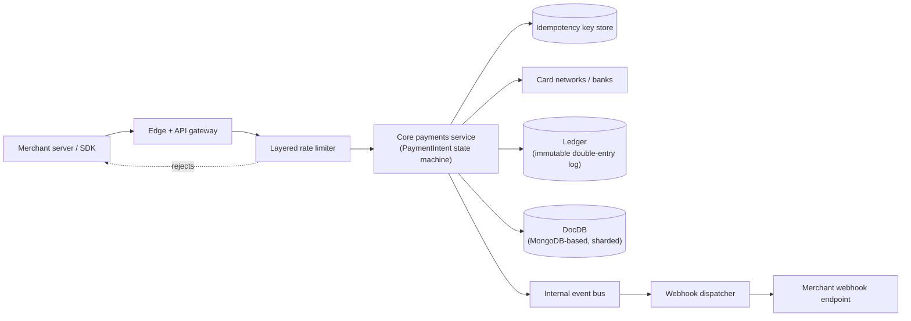
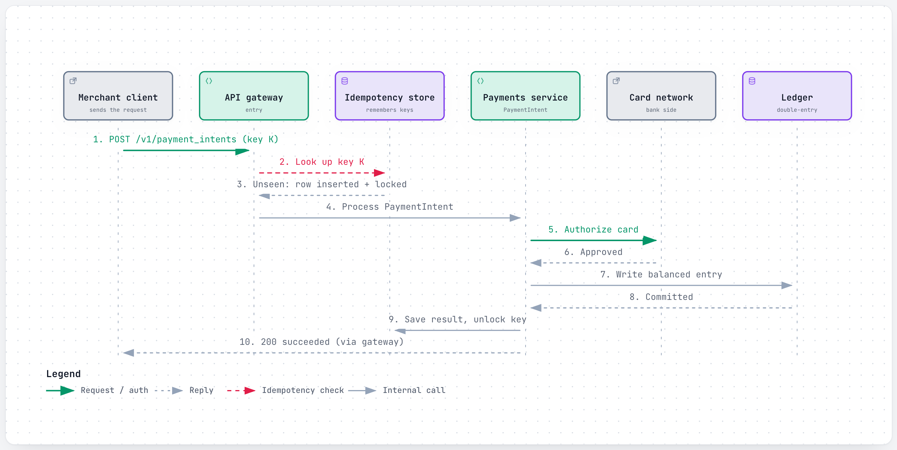
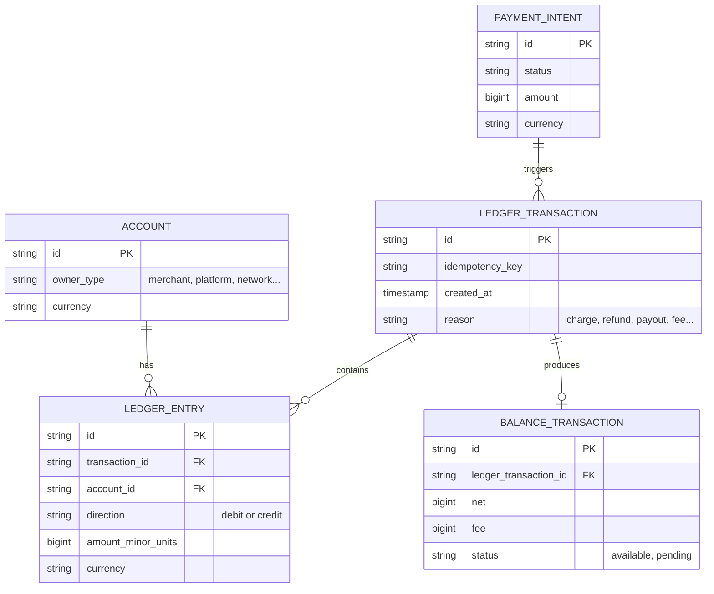
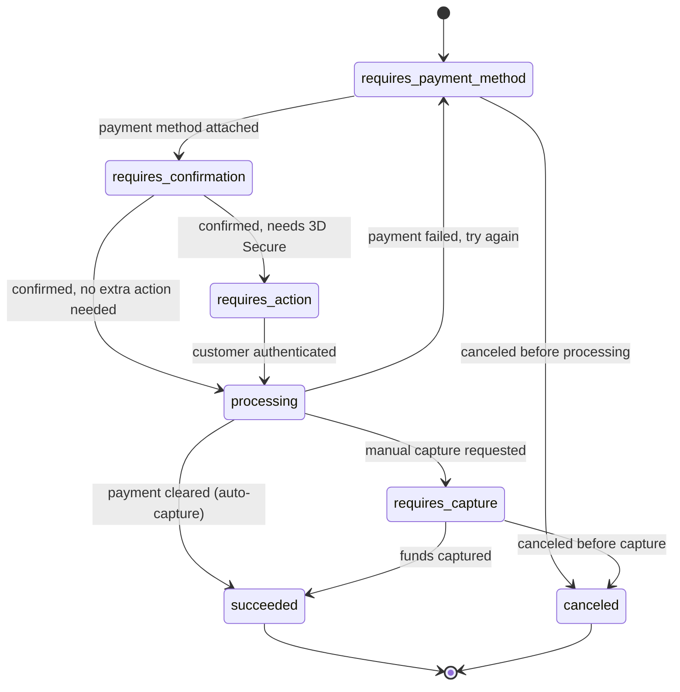
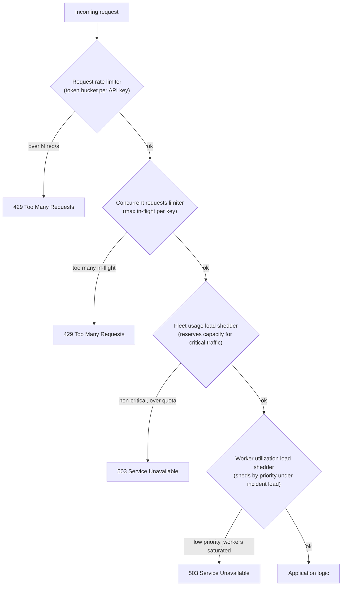
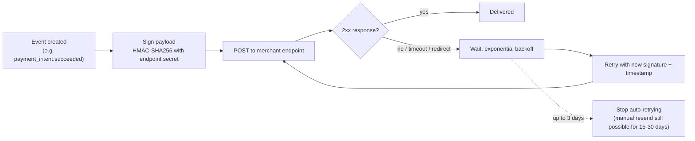
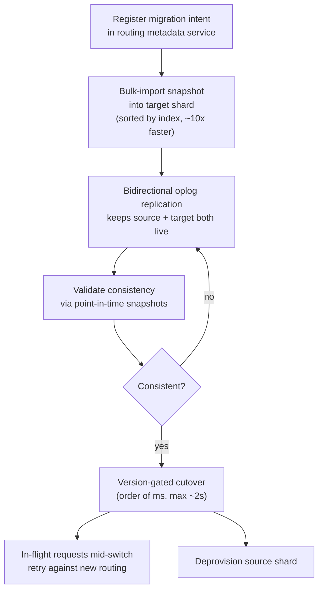

# Stripe: How Stripe Moves a Trillion Dollars a Year Without Double-Charging Anyone

> **In 60 seconds:** Stripe is an API that lets a business accept and move money without becoming a
> payments company itself. A merchant creates a `PaymentIntent` describing an amount and currency;
> Stripe drives it through a state machine that talks to card networks and banks, records the money
> movement in an internal double-entry ledger, and tells the merchant what happened over a signed
> webhook. Every mutating request carries a client-generated idempotency key so retries — a flaky
> network, a double-tapped "Pay" button, Stripe's own internal retries — never create a second
> charge. Underneath, a layered rate limiter protects the shared API fleet from any one caller, and
> a custom document-database layer (DocDB, built on MongoDB) stores product data at a scale of
> millions of queries per second across thousands of shards, with zero-downtime migrations keeping
> it that way as Stripe grows.

**Last reviewed:** September 2026 · **Difficulty:** Advanced · **Reading time:** ~40 min

## Table of contents

- [Before you read: design it yourself](#before-you-read-design-it-yourself)
- [The problem](#the-problem)
- [Scale](#scale)
- [Back-of-the-envelope math](#back-of-the-envelope-math)
- [Requirements](#requirements)
- [How it evolved](#how-it-evolved)
- [High-level design](#high-level-design)
- [Low-level design](#low-level-design)
- [Deep dives](#deep-dives)
- [What happens when things break](#what-happens-when-things-break)
- [Key design decisions](#key-design-decisions)
- [Interview takeaways](#interview-takeaways)
- [Glossary](#glossary)
- [Sources](#sources)

## Before you read: design it yourself

Try each question for 5 minutes before reading the answer — the point is to feel where the hard part is, not to get it "right."

### Q1. How does a payment request survive a network failure halfway through and still end up charged exactly once — not zero times, not twice?

<details>
<summary>Hint</summary>

What does the client send that lets the server recognize "I've already seen this exact request"?

</details>

<details>
<summary>How Stripe does it</summary>

Every mutating request carries a client-generated `Idempotency-Key`; Stripe stores the first response verbatim and replays it for any later request with the same key, even if the first attempt returned a `500`. A request racing an identical in-flight one gets locked out with a `409`, rather than being allowed to run concurrently and risk double-executing the charge. Keys expire after roughly 24 hours, and reusing a key with different parameters is treated as a client bug and rejected, not silently guessed at. Trade-off: every mutating request now pays an extra read-then-write against the key store before business logic even runs, and that store itself has to be highly available.

Deep dive: [Idempotency keys](#idempotency-keys)

</details>

### Q2. How do you prove, at billions of events a day, that no money silently duplicated or vanished across systems that don't share a database — and notice within hours if it did?

<details>
<summary>Hint</summary>

What if the database itself isn't allowed to be the source of truth?

</details>

<details>
<summary>How Stripe does it</summary>

Ledger is an immutable, append-only, double-entry log that every internal producer system publishes into; every transaction's debits must equal its credits, always, as a hard invariant on every write. A data-quality platform on top tracks clearing (do debits/credits balance), timeliness (delay before landing in Ledger), and completeness (did anything upstream go missing), backed by ID-matching and statistical anomaly detection. Because the log is immutable, mistakes get corrected with a new offsetting entry, and any historical balance can be reconstructed exactly by replaying the log. Trade-off: an append-only log grows forever, so "what's my balance" is always an aggregation, not a single-row read, and Stripe had to build dedicated investigation and repair tooling just to make the log operationally usable.

Deep dive: [The ledger](#the-ledger)

</details>

### Q3. How do you protect one shared API fleet, used by hundreds of thousands of businesses, from one noisy caller — without ever being the reason a real payment fails?

<details>
<summary>Hint</summary>

One limiter can't tell "a bug hammering us" from "we're mid-incident and need to protect payments specifically" — what does?

</details>

<details>
<summary>How Stripe does it</summary>

Stripe runs four layered rate limiters, each catching what the one before it let through: a per-account token bucket (sustained overuse), a concurrency cap (a few slow/expensive requests), a fleet usage shedder (reserves capacity for critical traffic), and a worker utilization shedder (sheds by priority during an actual incident). Limiters are built to fail open — if the limiter's own dependency (Redis) is unreachable, requests still get served rather than the safety mechanism itself taking down the API. New or changed limits are dark-launched (evaluated against real traffic, logged, not enforced) before they're ever allowed to reject anything. Trade-off: every layer adds a latency hop to every request, and four coordinated systems is real operational surface area — a bug in the limiter itself becomes a new way to take down the whole API.

Deep dive: [Rate limiting](#rate-limiting)

</details>

### Q4. How do you reliably tell a merchant's server that something changed — a payment cleared, a dispute opened — over the open internet, which can drop, stall, or double-deliver a request?

<details>
<summary>Hint</summary>

What guarantee is actually achievable here, and what does Stripe explicitly not promise?

</details>

<details>
<summary>How Stripe does it</summary>

Webhooks are signed (HMAC-SHA256 over a timestamp plus payload) and delivered at-least-once, explicitly not exactly-once or ordered — Stripe pushes dedupe-by-event-ID onto the merchant rather than promising a guarantee it can't keep cheaply. Failed deliveries retry automatically for up to 3 days with exponential backoff; a merchant can also manually resend a specific event for 15-30 days afterward. Endpoints are expected to verify the signature, durably record the event, and return `2xx` immediately, before doing the real processing work, because a slow response looks identical to a failure and triggers a retry. Trade-off: the entire ordering and exactly-once burden lands on the merchant's own integration, which is a well-documented source of production bugs when integrators skip it.

Deep dive: [Webhooks](#webhooks)

</details>

## The problem

It's 11:59pm on the biggest shopping night of the year. A shopper in São Paulo taps **Pay** on a
$340 checkout page. Their connection flickers for half a second right as the tap registers —
impatient, they tap again. Two nearly-identical HTTP requests are now racing toward the same API,
both effectively saying "charge this card $340." If the system that receives them gets this wrong in
either direction, someone loses: charge twice and the shopper is out money they never agreed to
spend; silently drop one and the merchant ships a shoe for free. Both requests carry the same header
— `Idempotency-Key: 7d3fa028-...` — and that single header is the difference between a happy
customer and a chargeback.

Scale that moment up: this exact race happens constantly, across 135+ currencies and 185+ countries
[8](#sources), while Stripe also has to prove — not just "probably," but provably — that every one
of the trillion-plus dollars that moved through its systems landed exactly where it should have,
tell every merchant asynchronously the instant something changes, and do all of this without one
merchant's traffic spike taking down the API for everyone else.

Zoom out from that one race, and the same shape of problem repeats at every layer of the system. The
rate limiter has to make the same kind of split-second, no-do-over decision on every single request
that arrives — "let this through or not" — except its failure mode isn't a double charge, it's an
outage that takes real payments down with it. The ledger has to answer, on demand and with
certainty, "did this exact dollar actually move the way every system claims it did," across teams
and databases that don't share a codebase, a release schedule, or sometimes even a country. And the
webhook dispatcher has to tell a merchant's server what happened, reliably, over a public internet
connection that can drop, stall, or arrive twice — the exact same unreliable substrate that caused
the double-tap in the first place, just one hop further downstream.

This page answers three hard questions:

1. How does a payment request survive a network failure halfway through and still end up charged
   **exactly once** — not zero times, not twice?
2. How do you prove, at a scale of billions of events a day, that no money silently duplicated or
   vanished — and notice within hours if it did?
3. How do you protect a shared API used by hundreds of thousands of businesses from one noisy
   caller, without ever being the reason a real payment fails?

## Scale

| Metric | Number | Source |
|---|---|---|
| Total payment volume processed | ~$1 trillion (2023); ~$1.4 trillion (2024) | [9](#sources), [10](#sources) |
| Core datastore (DocDB) uptime | 99.999% (2023); "5.5 nines" (2024/2025) | [9](#sources), [10](#sources) |
| DocDB query throughput | 5 million+ queries/sec from product applications | [9](#sources), [10](#sources) |
| DocDB footprint | 2,000+ database shards, 5,000+ collections, 10,000+ distinct query shapes, petabytes of data | [9](#sources), [10](#sources) |
| DocDB write volume | 500M+ writes/day *(third-party estimate)* | [15](#sources) |
| DocDB migration throughput | ~1.5-2 terabytes migrated per target shard, per day, during a live rebalance | [10](#sources) |
| Ledger event volume | 5 billion events processed per day | [8](#sources) |
| Ledger data-quality bar | 99.99% of dollar volume ingested & verified within 4 days; >99.9999% "explainability" of money movement | [8](#sources) |
| Global API rate limit | 100 requests/sec live mode, 25 requests/sec sandbox, per account | [6](#sources) |
| Idempotency key retention | keys removable after ≥24 hours; reuse after pruning starts a fresh request | [2](#sources), [3](#sources) |
| Webhook automatic retry window | up to 3 days, exponential backoff, live mode (3 attempts over hours in sandbox) | [13](#sources) |
| Webhook endpoints per account | up to 16 registered endpoints | [13](#sources) |

A few things worth pausing on. $1.4 trillion a year is roughly $44,000 every second, around the
clock, forever — and 5 million queries per second on the datastore means the database layer alone
handles more read/write traffic per second than most companies' entire product sees in a day. 5
billion ledger events a day is worth noting too: that's not 5 billion *payments* (Stripe doesn't
process that many), it's 5 billion individual bookkeeping events — because a single payment can fan
out into a charge event, a fee event, a payout event, a currency-conversion event, and more, each of
which has to balance on its own.

## Back-of-the-envelope math

Back-of-the-envelope math is the rough, order-of-magnitude arithmetic engineers do on a whiteboard to size a system before building it — not a precise forecast. Inputs marked with a [n] reference are pulled straight from this page's Scale table; everything else is a labeled `Assumption:` used purely for illustration.

### Payments per second, average and peak

**Question:** How many payments/sec does Stripe's platform actually process, on average and at peak?

**Inputs:**
- Total payment volume processed: ~$1.4 trillion (2024) [10](#sources)
- Assumption: average transaction size ≈ $50
- Assumption: peak traffic ≈ 2-3x average (use 3x)

**Math:**
```text
transactions_per_year = $1,400,000,000,000 / $50
                       = 28,000,000,000 transactions/year

seconds_per_year       = 365 * 86,400
                       = 31,536,000 sec

avg_tx_per_sec         = 28,000,000,000 / 31,536,000
                       ≈ 888 transactions/sec

peak (3x)              = 888 * 3
                       ≈ 2,664 transactions/sec
```

**Answer:** ~890 payments/sec average, ~2,700/sec at peak (rounded).

**What it tells you:** compare that peak to the global rate limit of 100 requests/sec per account [6](#sources) — a single very large merchant, on its own, could exceed its own per-account cap at that rate. The platform-wide total only works because volume is spread across hundreds of thousands of separate accounts, not because any one account is expected to carry it. See [Rate limiting](#rate-limiting).

### Ledger fan-out upper bound vs. DocDB headroom

**Question:** Given 5B ledger events/day, what's the maximum number of underlying payments that could represent — and how much DocDB headroom does that leave?

**Inputs:**
- Ledger event volume: 5 billion events/day [8](#sources)
- Assumption: at least ~4 ledger events per payment (the page's own examples: a charge event, a fee event, a payout event, a currency-conversion event)
- DocDB query throughput: 5 million+ queries/sec [9](#sources), [10](#sources)

**Math:**
```text
max_payments_per_day = 5,000,000,000 / 4
                      = 1,250,000,000 payments/day

max_payments_per_sec = 1,250,000,000 / 86,400
                      ≈ 14,468 payments/sec

headroom_multiple    = 5,000,000 / 14,468
                      ≈ 345.6x
```

**Answer:** at most ~14,500 payments/sec company-wide (an upper bound — real fan-out is likely higher than the assumed minimum of 4, so the true rate is lower).

**What it tells you:** even at that upper bound, DocDB's 5M+ q/s gives well over 300x headroom over ledger-driven writes alone — meaning DocDB's query volume is dominated by product/API reads, not the ledger, as covered in [DocDB / MongoDB storage layer](#docdb--mongodb-storage-layer).

### Average queries/sec per DocDB shard

**Question:** How much traffic does a single DocDB shard carry, on average?

**Inputs:**
- DocDB query throughput: 5 million+ queries/sec [9](#sources), [10](#sources)
- DocDB footprint: 2,000+ database shards [9](#sources), [10](#sources)
- Assumption: load is evenly distributed across shards (real traffic isn't — see below)

**Math:**
```text
avg_qps_per_shard = 5,000,000 / 2,000
                   = 2,500 queries/sec/shard
```

**Answer:** ~2,500 queries/sec per shard, on average.

**What it tells you:** real traffic is never this even — some shards run far hotter than 2,500/s while others sit idle — which is exactly the "hot shard" problem the zero-downtime migration tooling in [DocDB / MongoDB storage layer](#docdb--mongodb-storage-layer) exists to rebalance away from.

### Idempotency key working set

**Question:** Roughly how many idempotency keys does Stripe need to keep indexed and looked-up at any given moment?

**Inputs:**
- Idempotency key retention: keys removable after ≥24 hours [2](#sources), [3](#sources)
- Assumption: request rate needing a stored key ≈ the ~888/sec average payments rate from the estimate above

**Math:**
```text
retention_window_sec = 24 * 3,600
                      = 86,400 sec

keys_in_flight        = 888 * 86,400
                      ≈ 76,723,200
                      ≈ 76.7M keys
```

**Answer:** ~77M idempotency keys resident at any moment (order of magnitude).

**What it tells you:** tens of millions of hot keys, each needing a sub-millisecond existence check on every mutating request, is why idempotency keys live in the same fast, sharded datastore (DocDB) as everything else rather than a single-node table. See [Idempotency keys](#idempotency-keys).

### Rules of thumb used

| Rule of thumb | Value |
|---|---|
| 1 day | ~86,400 s ≈ 10^5 s |
| 1 year | ~31,536,000 s ≈ 3*10^7 s |
| Peak vs. average traffic | ~2-3x, for a typical consumer/merchant platform |

These are general estimation conventions, not Stripe-specific facts.

## Requirements

**Functional:**
- Create and confirm a payment (`PaymentIntent`) across many payment methods, currencies, and
  countries, including ones that don't settle instantly (bank debits, some wallets).
- Guarantee that a client retrying a request — timeout, dropped connection, double-click — never
  results in two charges.
- Record every movement of money in a way that can be audited, replayed, and proven to balance to
  zero.
- Notify a merchant's server asynchronously when something changes (payment succeeded, dispute
  opened, subscription renewed) without requiring them to poll.
- Let hundreds of thousands of merchants share one API fleet without one noisy caller degrading
  everyone else.

**Non-functional:**
- **Strong consistency on money movement** — no double charge, no silently dropped charge — even
  under network retries and concurrent requests on the same object. *Why it matters: this is the one
  bug class in a payments API that directly costs real people real money and destroys trust
  instantly.*
- **Very high availability for the core datastore and payments path** (Stripe cites 99.999% uptime,
  "5.5 nines," for its database layer [9](#sources), [10](#sources)). *Why it matters: a payments
  API being down doesn't just delay a feature, it stops commerce for every merchant relying on it at
  that moment.*
- **At-least-once webhook delivery, safe to process out of order.** *Why it matters: exactly-once
  and perfectly-ordered delivery across independent internal systems isn't practical at this scale —
  the API has to be honest about the weaker guarantee it can actually keep, and push the dedupe
  responsibility to a place it can be handled cheaply (the merchant checking an event ID).*
- **Rate limiting that fails toward availability for critical traffic and away from availability for
  less critical traffic during incidents.** *Why it matters: under overload, an API that treats
  every request equally can end up rejecting real payments right alongside a runaway analytics
  script — Stripe's layered limiters are built to shed the second kind first.*
- **Horizontal scalability of the datastore — splitting/merging shards, migrating data — with zero
  downtime.** *Why it matters: you cannot put up a maintenance window on a payments database; the
  business it serves doesn't stop for maintenance either.*

## How it evolved

Most companies start simple and get forced into complexity by scale. Stripe's payments API is a
clean example of that arc:

| Era | What existed | What broke | What replaced it | Source |
|---|---|---|---|---|
| 2011 | **Tokens + Charges API.** Create a `Token` for card details, then a `Charge` against it — one synchronous call, one response. | Assumed every payment method behaves like a credit card: instant, synchronous, single-step. Didn't fit payment methods that settle asynchronously (bank debits taking days) or need extra steps mid-flow. | — | [14](#sources) |
| 2015-2017 | **Sources API.** An attempt to unify many payment methods (cards, bank redirects, wallets) under one abstraction. | Async, browser-redirect methods like iDEAL exposed the gap directly: "if the browser loses connectivity before communicating back to the merchant's server, the server never creates a Charge." Merchants had to run two parallel integration styles — synchronous for cards, webhook-driven for everything else — and track two different IDs. | PaymentIntents | [14](#sources) |
| 2017-2019 | **PaymentIntents + PaymentMethods + SetupIntents.** A payment becomes an explicit state machine (`requires_payment_method` → ... → `succeeded`) decoupled from the specific payment method used. | Needed to support multi-step flows such as *Strong Customer Authentication (SCA)* / 3D Secure, which put an authentication step into the middle of a payment — something the old Charges model had no place for (that SCA regulation *drove* the redesign is unverified). | Charges API (still exists, but as an implementation detail *behind* PaymentIntents, kept for backward compatibility) | [11](#sources), [14](#sources) |
| 2011 onward | **Raw MongoDB Community**, chosen for developer velocity over a relational database at a time MongoDB Atlas didn't exist yet. | As Stripe grew into hundreds of terabytes and then petabytes across thousands of product collections, a bare MongoDB deployment had no answer for safe, zero-downtime resharding, and nothing stopped an application from issuing an expensive, unbounded query straight at a shard. | **DocDB**: an in-house proxy + routing-metadata layer in front of MongoDB, enforcing query shape and access control | [9](#sources), [10](#sources) |
| Later | **DocDB at fixed shard count.** | Traffic isn't static — some shards get hot, others sit idle; a fixed shard layout means either paying for permanent headroom everywhere or eventually hitting a wall on a hot shard. | **Data Movement Platform**: split/merge shards and bin-pack underutilized ones live, with millisecond-to-2-second traffic cutovers | [9](#sources), [10](#sources) |
| Ongoing | **Ad hoc reconciliation** between the many internal systems that record money movement (billing, payouts, disputes, connect), each with its own pace and format. | No forcing function meant no guarantee two systems agreed about the same dollar — and no fast way to *prove* they did or find it when they didn't. | **Ledger**: one immutable, append-only, double-entry log that every producer system publishes into, plus a data-quality platform on top of it | [8](#sources) |
| Recommended today | Payment Intents API directly. | Payment Intents integration requires meaningfully more client-side code than most merchants need for a standard checkout flow. | Stripe now steers most new integrations toward **Checkout Sessions + the Payment Element**, a higher-level layer built on top of the same PaymentIntent machinery. | [11](#sources) |

The throughline: every major rewrite happened because the old abstraction was built for the easy 80%
case (a card, paid once, right now) and the last 20% (async settlement, multi-step auth, petabyte
scale, cross-system reconciliation) eventually forced a redesign rather than a patch.

## High-level design



Walking through a typical request:

1. A merchant's server calls the API (directly or via a Stripe SDK) to create a `PaymentIntent`,
   always sending an `Idempotency-Key` header [2](#sources). This is the server, not the customer's
   browser — Stripe's design deliberately keeps secret keys and the decision to charge on
   infrastructure the merchant controls, only handing the browser a narrow, single-purpose
   `client_secret` later [11](#sources).
2. The request passes through Stripe's edge and API gateway, then a **layered rate limiter** that
   can reject it before it ever reaches business logic [6](#sources). At this point the request
   hasn't touched a database or a card network yet — rejecting early is what makes the limiter cheap
   enough to run on every single request.
3. The **core payments service** is the `PaymentIntent` state machine: it checks the idempotency key
   store first (has this exact request already been handled?), then drives the payment through
   states like `requires_payment_method` → `requires_confirmation` → `requires_action` →
   `processing` → `succeeded` [11](#sources), [12](#sources). If the payment method needs an extra
   step (3D Secure authentication, say), the state machine pauses in `requires_action` and hands
   control back to the client — the request that started this whole flow isn't necessarily the one
   that finishes it.
4. To actually move money, it calls out to **card networks / banks**. Every one of Stripe's own
   outbound calls is presumably wrapped with its own idempotency key, so a retry on Stripe's side can't
   double-charge the card network either *(unverified — no cited source documents this)* — the same pattern the merchant relies on
   for step 1 is used recursively, one layer down, by Stripe against the networks it depends on.
5. Once money moves, the service writes an immutable, balanced entry into **Ledger**, Stripe's
   internal system of record for money movement, built on double-entry bookkeeping [8](#sources).
   This write is what makes the payment durable in a sense the `PaymentIntent` object alone doesn't
   guarantee — the ledger entry is the fact that can never be silently lost or edited afterward.
6. Product-facing state (the `PaymentIntent`, `Charge`, `Customer` objects, etc.) lives in
   **DocDB**, Stripe's in-house extension of MongoDB Community, sharded across thousands of shards
   [9](#sources). This is the layer applications actually query day to day; Ledger, by contrast, is
   rarely queried directly by product code — it's the audit trail the rest of the system can be
   checked against.
7. A state change publishes an event onto an internal bus, which the **webhook dispatcher** turns
   into a signed HTTPS `POST` to every merchant endpoint subscribed to that event type, retrying
   with backoff until it gets a `2xx` [13](#sources). Notably, this step is decoupled from the
   synchronous response in step 3 — the merchant's server already has its answer by the time this
   fires, so a webhook is confirmation and secondary-system notification, not the primary way a
   merchant learns whether a payment succeeded.

## Low-level design

### 1. Charge request with idempotency-key handling

> Note: Stripe hasn't published its literal internal idempotency-key schema. The sequence below
> matches Stripe's documented *behavior* (same key ⇒ same cached response, including on `500`s;
> mismatched params on key reuse ⇒ error; ≥24h TTL; a concurrently-executing duplicate gets a `409`)
> [1](#sources), [2](#sources), [3](#sources), and follows the reference implementation for
> "Stripe-style" idempotency keys published by the same engineer who wrote Stripe's own idempotency
> blog post [4](#sources). Treat the "locking" and "recovery point" mechanics as a reasonable
> reference design, not a confirmed description of Stripe's production code.

<a href="https://alwintwk.github.io/big-tech-system-design/diagrams/companies-stripe-payment.html">
  <picture>
    <source media="(prefers-color-scheme: dark)" srcset="../diagrams/companies-stripe-payment.dark.png">
    
  </picture>
</a>

<sub>Click the diagram for the interactive version (zoom, dark mode, trace a path).</sub>

Step by step: the client always sends the same key when it retries the same logical operation. The
gateway's first stop is the key store, not the payments service — this is deliberate, since it lets
Stripe answer "have we already done this?" before spending any work re-running business logic. Three
outcomes fall out of that one lookup: replay a finished result, reject a request that's racing an
identical in-flight one, or proceed and lock the key so nobody else can race it. Only after the
network call to the card network succeeds does the service write to Ledger, and only after Ledger
confirms the write does it save the final response and release the lock — so a crash between "card
approved" and "ledger written" leaves the key locked rather than silently reporting success without
a matching ledger entry (see [What happens when things break](#what-happens-when-things-break)).

### 2. Ledger data model (double-entry bookkeeping)

> Note: Stripe's engineering blog describes Ledger's design principles (immutable log, state-machine
> modeling of fund flows, double-entry validation) in depth but doesn't publish its literal schema
> [8](#sources). The entities below are a reasonable reference design built around Stripe's own
> public `BalanceTransaction` object [8](#sources), [11](#sources) — labeled as a reference, not
> Stripe's exact internal tables.



Why these keys specifically: `LEDGER_TRANSACTION` gets its own row (rather than just letting entries
float free) because the invariant that matters is *per-transaction* balance — the sum of debits and
credits within one transaction must be zero, not just globally across the whole ledger over time.
Tying `idempotency_key` to the transaction, not just the API request, means the same underlying
money-movement event can never be recorded twice even if it's triggered from two different code
paths (say, a webhook retry *and* a reconciliation job both trying to record the same charge).
`LEDGER_ENTRY` splits `direction` out as its own column instead of using signed amounts because it
makes the balance invariant trivially checkable with a `SUM` grouped by transaction, rather than
requiring every consumer to remember sign conventions. `BALANCE_TRANSACTION` is denormalized out
from the raw entries specifically because it's the object merchants and Stripe's own reporting
actually read from — the ledger's job is to be provably correct, not fast to query, so a derived,
indexed view sits on top of it. Because Ledger is append-only ("transactions previously published
into Ledger cannot be deleted or modified" [8](#sources)), any account's balance is just the sum of
its entries, and any past state can be reconstructed by replaying the log up to that point.

### 3. PaymentIntent lifecycle (state machine)



This is the object that replaced the old one-shot `Charge` call. Instead of one request either
succeeding or failing, a `PaymentIntent` is a long-lived object whose `status` field tells any part
of the system — the merchant's server, Stripe's own webhook dispatcher, a support engineer looking
at the dashboard — exactly where a payment is in its life, even if that life spans a redirect to a
bank's authentication page and back [11](#sources), [12](#sources). A failed payment loops back to
`requires_payment_method` rather than dying, because Stripe explicitly wants the same PaymentIntent
(and its history of failed attempts) reused across retries with a different card, instead of the
merchant creating a fresh one each time [11](#sources).

What actually triggers each transition, per Stripe's own documentation [12](#sources):

| State | What it means | What moves it forward |
|---|---|---|
| `requires_payment_method` | Created, no payment method attached yet (or the last attempt failed) | Attaching a valid payment method |
| `requires_confirmation` | Payment method attached, ready to go | Calling confirm (most integrations skip this — they confirm and attach in the same step) |
| `requires_action` | Needs an extra customer step, most commonly 3D Secure authentication | Customer completes the authentication challenge |
| `processing` | Handed off to an asynchronous payment method (e.g. a bank debit) that can take days to clear | The payment method's network reports success or failure |
| `requires_capture` | Funds authorized and held, but not yet captured (a manual-capture integration) | The merchant explicitly calls capture |
| `succeeded` | Funds have moved into the merchant's Stripe balance | — (terminal state) |
| `canceled` | Invalidated before processing completed; releases any held funds | — (terminal state, cannot be undone) |

Two details worth calling out: a `PaymentIntent` can also be canceled *while* `processing`, but only
for specific asynchronous methods (ACH, BACS, SEPA, and similar bank debits) where there's still a
real window to stop the transfer before it clears — for a card payment already `processing`, there
usually isn't one. And Stripe will auto-cancel a `PaymentIntent` that's been confirmed too many
times in a row, treating repeated failed confirmation attempts as a signal to stop rather than let a
caller retry indefinitely [12](#sources).

### 4. Layered rate limiting

Stripe runs four rate limiters, from most- to least-frequently triggered, and each is meant to catch
what the layer above it let through [5](#sources):



The **request rate limiter** — a token bucket, where tokens drip into a per-account bucket at a
fixed rate, each request spends one, and an empty bucket means reject — is the one that fires most
often, and the one Stripe recommends any API builder implement first [5](#sources). The other three
exist specifically for overload scenarios: a caller opening too many simultaneous slow requests, a
fleet-wide capacity crunch where non-critical traffic must yield to payment traffic, and a
last-resort shedder during incidents that drops low-priority work (test-mode calls, `GET`s) before
it drops a `POST /payment_intents` [5](#sources). More in the [rate limiting deep
dive](#rate-limiting).

### 5. Webhook signing and retry



Covered in full in the [webhooks deep dive](#webhooks) below.

### 6. Zero-downtime shard migration (Data Movement Platform)

> Note: this diagram is built from a Stripe engineer's own conference talk describing the platform
> [10](#sources); it's a real described process, not a reference design, but the exact internal
> naming may differ from what's shown here.



Step by step: the platform never takes the source shard offline while any of this happens. Steps A-D
can run for as long as they need to (Stripe cites roughly 1.5-2 terabytes migrated per target shard
per day [10](#sources)) with the source shard still serving live production traffic the entire time,
because the target is being built as a faithful, continuously-updated copy rather than a
point-in-time snapshot that goes stale. The bidirectional replication in step C is what makes this
safe to abort: if validation in step D fails, the migration simply keeps replicating rather than
needing a rollback, because the source was never stopped. Only step F is a genuine cutover moment,
and it's kept so short specifically by pre-negotiating it: proxies stamp every request with the
routing-metadata version they last saw, and a shard refuses to serve a request stamped with a stale
version, so flipping "who's authoritative" is a metadata write, not a data copy. A request unlucky
enough to arrive in the handful of milliseconds mid-flip (step G) doesn't error — it retries and
lands correctly once the new routing has propagated.

## Deep dives

### The Payments API surface (PaymentIntents, Charges, PaymentMethods)

**What it is:** the public object model merchants actually integrate against, plus a set of API
design conventions Stripe applies consistently across its entire surface — not just payments
[11](#sources), [16](#sources).

**The problem it solves:** a payment isn't one thing — it's an amount to collect, a specific
instrument to collect it with, and (sometimes several) attempts to actually collect it — and
conflating those three into one object is exactly what made the old Charges API brittle (see [How it
evolved](#how-it-evolved)). Splitting them apart, and doing it consistently, is what lets one API
model a $5 card payment in Ohio and a multi-day bank debit in Singapore with the same shapes
[11](#sources), [14](#sources).

**How it works inside:**
- **`PaymentMethod`** is the "how" — a specific card, bank account, or wallet, with no transaction
  logic attached. It's reusable: the same `PaymentMethod` can be attached to many payments over time
  [14](#sources).
- **`PaymentIntent`** is the "what" — amount, currency, and a `status` tracking one purchase attempt
  (or session) from creation through completion, independent of which `PaymentMethod` ends up being
  used [11](#sources), [14](#sources).
- **`Charge`** is created behind the scenes for every attempt, kept around specifically for backward
  compatibility with pre-PaymentIntent integrations. A single `PaymentIntent` can own *more than
  one* `Charge` if there were multiple attempts — a retry with a different card after a decline
  creates a new `Charge` under the same `PaymentIntent` [11](#sources).
- The **`client_secret`** pattern is the security boundary between server and browser: the server
  creates the full `PaymentIntent` (which can carry sensitive `metadata`), but only sends the
  `client_secret` to the browser. That's enough for the client-side SDK to confirm the payment,
  without ever exposing metadata, the customer object, or anything else attached server-side. Stripe
  is explicit that this must travel over TLS and must never be logged or put in a URL
  [11](#sources).
- Documented best practice is to create the `PaymentIntent` as soon as the amount is known (so every
  attempt, even abandoned ones, is tracked), update its `amount` in place if the cart changes rather
  than creating a new one, and — critically — **reuse the same `PaymentIntent`** across a resumed
  checkout by storing its ID against the cart/session, deriving the idempotency key from that same
  session ID so a resumed flow can't accidentally create a duplicate [11](#sources).

Beyond the payments-specific objects, Stripe applies the same handful of conventions everywhere,
reportedly governed by an internal ~20-page API design document every new endpoint must follow, with
cross-functional review before it ships [16](#sources):

| Convention | What it looks like | Why it matters |
|---|---|---|
| Prefixed, typed object IDs | `ch_3MqZlPLkdIwHu7ix0slN3S9y`, `cus_NffrFeUfNV2Hib`, `pi_3MtwBwLkdIwHu7ix28aiHDKq` | The ID itself tells you (and every log line, every support ticket) what kind of object it points to — a `pi_` id pasted where a `ch_` id belongs is an instantly obvious bug, not a silent one [16](#sources) |
| Date-based API versioning (`Stripe-Version: 2024-10-28` header) | not `/v1/`, `/v2/` path versions | Lets Stripe change API behavior continuously while an integration written years ago keeps getting exactly the response shape it was built against, indefinitely, without a forced migration [16](#sources) |
| Expandable objects (`expand[]=customer`) | fetch a related object inline in one call | Saves a round trip for the client — at the cost of a heavier query for Stripe, which is part of why expansions specifically show up as an example of a request the concurrency rate limiter watches for [5](#sources), [6](#sources) |
| Cursor-based pagination (`starting_after=obj_id`) | walk a list via an opaque cursor, not a numeric offset | Avoids the classic offset-pagination bug where items shift between pages because the underlying list is being written to while you're paging through it |
| Consistent response envelope | every object carries `id`, `object`, `created`, `livemode` | One shared mental model across hundreds of distinct endpoint/object types, instead of every resource inventing its own conventions |
| Actionable errors | `error.type`, `error.code`, a human-readable message, a docs link, a dashboard request ID | An error is designed to be handled *programmatically* by the integration, not just logged and stared at by a human [16](#sources) |

> **Why this matters:** this is the part of Stripe's design that's easiest to underrate in an
> interview — "make the API good to use" sounds like a UX nicety, but prefixed IDs and cursor
> pagination are actually reliability decisions: they eliminate entire categories of integration
> bugs (wrong-object-type IDs, inconsistent paging under concurrent writes) before they can happen.

**What it costs:** every one of these conventions is a constraint on every future endpoint, forever
— a 20-page design document and mandatory cross-functional review is real process overhead on
shipping speed, paid deliberately in exchange for an API surface that still looks and behaves the
same way a decade later.

### Idempotency keys

**What it is:** a client-supplied value (the `Idempotency-Key` header) attached to a `POST` request,
which Stripe uses to recognize "this is a retry of a request I've already seen," not a brand-new
operation [1](#sources), [2](#sources).

**The problem it solves:** a payments API cannot rely on "the client only sends each request once."
Networks time out, connections drop mid-response, load balancers occasionally deliver a request
twice, and users double-click buttons. Without something like an idempotency key, the *only* safe
move on any uncertain failure is to never retry — which means a single network blip permanently
fails a checkout. With one, the client can safely retry the exact same request as many times as it
needs to, and Stripe guarantees it produces the effect of exactly one operation [1](#sources).

**How it works inside** (documented behavior, reference implementation for the internals
[2](#sources), [3](#sources), [4](#sources)):
- Stripe stores the **first** response — status code and body — for a given key, and returns that
  same response for any later request with that key, *even if the first attempt returned a `500`*
  [2](#sources), [3](#sources).
- If a retry reuses a key but changes the request parameters, Stripe treats that as a client bug and
  errors, rather than guessing which version the client actually wanted [2](#sources).
- Keys are only saved once an endpoint actually begins executing — a request that fails basic
  validation, or one that arrives while an identical request is *already* executing, doesn't get
  cached, because no endpoint logic actually ran for it. Retry those freely [2](#sources).
- Two requests with the same key racing each other resolve via locking: whichever gets there first
  executes and locks the key; the second gets a `409 Conflict` rather than being allowed to run
  concurrently and risk double-executing the underlying side effect [4](#sources).
- Keys expire and get pruned after roughly 24 hours; reusing an expired key starts a fresh request
  from scratch [2](#sources), [3](#sources).
- A separate `Stripe-Should-Retry` response header exists precisely because a status code alone
  isn't always enough information for a client to know whether retrying is safe — `true` means retry
  (with backoff), `false` means don't bother, the request has already had its one effect
  [3](#sources).

A minimal reference sketch of the server-side check-then-act flow:

```
on POST request with Idempotency-Key = K:
    row = SELECT * FROM idempotency_keys WHERE account = acct AND key = K
    if row exists and row.locked:
        return 409 Conflict          # a duplicate is already in flight
    if row exists and row.completed:
        if row.request_params != incoming_params:
            return 400 "key reused with different parameters"
        return row.response_code, row.response_body   # safe replay
    INSERT (account=acct, key=K, locked=true, request_params=incoming_params)
    result = run_business_logic()     # e.g. authorize card, write ledger entry
    UPDATE idempotency_keys SET locked=false, completed=true,
        response_code=result.code, response_body=result.body
    return result
```

**What it costs:** every mutating request now does an extra read-then-write against the key store
before touching business logic, and that store has to be highly available itself — if it's down, you
either fail closed (reject retries you could have safely allowed) or fail open (risk exactly the
double-execution the whole mechanism exists to prevent). It also pushes a real design constraint
onto every integrator: they must generate genuinely unique keys (Stripe suggests UUID v4 or another
high-entropy string, up to 255 characters [2](#sources)) and must not treat "the request timed out"
as "the request failed" — the correct response to a timeout is always *retry with the same key*,
never *retry with a new one*.

### The ledger

**What it is:** Ledger is Stripe's internal system of record for money movement — an immutable,
append-only, double-entry log that every internal producer system (billing, payouts, disputes,
Connect, and more) publishes transactions into [8](#sources).

**The problem it solves:** Stripe is not one monolithic system tracking money — it's a federation of
many systems, built by different teams, at different cadences, with different data volumes, spanning
135+ currencies and 185+ countries. Nothing inherently forces those systems to agree with each other
about the same dollar. Ledger exists because someone has to be the single, mathematically-checkable
source of truth that every one of those systems' claims can be validated against [8](#sources).

**How it works inside:**
- Every unit of work is modeled as a **transaction** whose entries must balance: total debits equal
  total credits, always. This is literally double-entry bookkeeping, the same principle accountants
  have used for centuries, applied as a hard invariant on every write rather than a manual audit
  step [8](#sources).
- Money movement is modeled as a **state machine** — "a movement of balances between two discrete
  states" — so a charge, a hold, a release, a payout are all just transitions with a well-defined
  before-state and after-state, rather than ad hoc mutations [8](#sources).
- The log is **immutable**: nothing published to Ledger can be deleted or edited afterward. Mistakes
  get corrected the way accountants have always corrected mistakes — with a new, offsetting entry —
  which means any historical state can be reconstructed exactly by replaying the log up to that
  point [8](#sources).
- On top of the raw log, Stripe built a **data-quality platform** tracking three metrics:
  **clearing** (do credits and debits balance — an uncleared balance is treated as a data-quality
  failure, not just an accounting curiosity), **timeliness** (how much delay is there between an
  event happening and it landing in Ledger, with a hard 99.999% timeliness bar for time-sensitive
  reporting), and **completeness** (cross-checking that nothing upstream went missing, using both
  ID-matching against source systems and statistical anomaly detection on arrival patterns)
  [8](#sources).
- When something *does* look wrong, Stripe has tooling that auto-generates investigation queries
  (via Presto) surfacing reference keys, ownership, and troubleshooting context, plus a correction
  pipeline that runs data-repair migrations behind mandatory two-phase review and impact reporting —
  described internally as "approximating a CI pipeline for ad hoc data repair operations"
  [8](#sources).

> **Why this matters:** most engineers think of "the database" as the source of truth. Stripe's
> answer is more precise: the database is a *cache* of current state; the append-only ledger of what
> actually happened is the source of truth, and current state is always something you can recompute
> from it.

**What it costs:** an append-only log grows forever — you can't reclaim space by deleting stale
rows, so "what's my current balance" is never a single-row read, it's an aggregation (or a
materialized view you maintain separately and trust *because* you can always recompute it from the
log to check). It also means Stripe had to build significant dedicated tooling (the data-quality
platform, the investigation tooling, the repair pipeline) just to make an append-only log
operationally usable at 5 billion events/day — the durability guarantee is close to free, but making
it *useful* for humans debugging a discrepancy is not.

### DocDB / MongoDB storage layer

**What it is:** DocDB is Stripe's database-as-a-service layer, an extension of MongoDB Community
with a set of services Stripe built in-house on top of it, serving product-facing state
(PaymentIntents, Customers, and thousands of other object types) [9](#sources), [10](#sources).

**The problem it solves:** Stripe adopted MongoDB in 2011 for developer velocity — a flexible
document model was faster to build against than a rigid relational schema, and MongoDB Atlas (a
managed offering) didn't exist yet, so nothing off-the-shelf met Stripe's requirements anyway
[9](#sources), [15](#sources). As Stripe grew into petabytes of financial data across thousands of
product collections, two new problems showed up that raw MongoDB doesn't solve for you: (1) nothing
stops an application from issuing a slow, unbounded query straight at a shard, and (2) resharding a
live database — splitting a hot shard, merging cold ones, migrating data between machines — normally
means either downtime or serious engineering risk, neither of which is acceptable for a payments
datastore [9](#sources), [10](#sources).

**How it works inside**, per Stripe's own engineering blog and a QCon San Francisco 2025 talk by
Stripe staff engineer Jimmy Morzaria [9](#sources), [10](#sources):
- All application traffic goes through an in-house **Database Proxy** (not MongoDB's own `mongos`
  router) — every query passes through it first, where Stripe enforces access control, blocks
  suboptimal query shapes, and applies admission control, rather than letting a raw MongoDB driver
  connection hit a shard directly.
- A **routing/chunk metadata service** maintains the mapping from data chunks (partitions of a
  collection) to the physical shard currently holding them, which the proxy consults to route each
  query correctly.
- Each physical shard is a **MongoDB replica set** — one primary, multiple secondaries, spread
  across availability zones/regions — with automated failover.
- Idempotency at the storage layer comes for free from MongoDB's own **oplog** (its write-ahead
  log): "when you're replicating the write-ahead log, every write that you do using the write-ahead
  log results in an idempotent write" [10](#sources) — replaying the same oplog entry twice has the
  same effect as replaying it once, which is exactly what makes safe replication and safe migration
  retries possible.
- Version gating (the mechanic behind the sub-2-second cutover described below) isn't bolted on from
  outside — it's implemented in a **custom fork of MongoDB itself**, so a shard can refuse to serve
  a request stamped with stale routing metadata at the database layer, not just at the proxy
  [10](#sources).
- The same oplog stream doubles as a **change data capture (CDC)** feed: it's continuously
  replicated out to Kafka and S3, giving other internal systems (analytics, the ledger, backups) a
  consistent view of every write without querying the production shards directly [10](#sources).
- The **Data Movement Platform** is the piece that makes zero-downtime resharding possible: it
  bulk-imports a snapshot into the target shard (sped up roughly 10x by sorting the import by the
  frequently-queried index attribute), replicates ongoing writes bidirectionally via the oplog
  (filtering by tags to avoid replicating a write back to where it came from — an infinite loop),
  validates consistency with point-in-time snapshots, then performs a **version-gated cutover**:
  proxies stamp requests with a routing-metadata version, shards validate freshness before serving,
  and the actual traffic switch takes on the order of milliseconds up to a maximum of 2 seconds,
  with any request caught mid-switch simply retried against the now-current routing [10](#sources).
- The same platform is used for more than emergency resharding — it also does **bin packing**,
  consolidating many underutilized shards down onto fewer machines when traffic is low, migrating
  roughly 1.5 petabytes this way in 2023 [9](#sources).

> **Why this matters:** the interesting engineering here isn't "we picked MongoDB" — it's that
> Stripe treated "move live data between machines with no downtime" as a first-class, reusable
> platform capability rather than a one-off migration script, and then found multiple unrelated uses
> for it (emergency resharding, routine bin packing, engine upgrades, multi-tenant splits)
> [9](#sources), [10](#sources).

**What it costs:** running a custom fork/extension of MongoDB with your own proxy and metadata
service is a genuine, ongoing engineering investment — you're maintaining infrastructure most
companies get for free from a managed database vendor, in exchange for control over query admission
and migration behavior that a managed vendor won't give you. The mandatory proxy layer also means
every new query pattern has to pass through it before it can ship, which is a deliberate speed bump
traded for reliability.

### Rate limiting

**What it is:** the layer that decides which requests get to run at all, before they reach business
logic, so that no single caller — or no incident-driven pile of retries — can take down the API for
everyone else [5](#sources), [6](#sources).

**The problem it solves:** an API shared by hundreds of thousands of merchants needs a way to say
"not right now" to some requests without becoming the reason a real payment fails. A single global
limiter is a blunt instrument: it can't distinguish "one merchant is bugged and hammering us" from
"we're having an incident and need to protect payments specifically," so Stripe runs four limiters
that each catch a different failure mode [5](#sources).

**How it works inside**, from most- to least-frequently triggered [5](#sources), [6](#sources):
1. **Request rate limiter** — a token bucket per API key/account: tokens refill at a steady rate,
   each request spends one, an empty bucket means `429`. This is the workhorse, catching a caller
   sustained above their allotted requests/sec (100/sec live mode, 25/sec sandbox globally, with
   lower limits on specific endpoints), and it's what Stripe recommends any API builder implement
   first [5](#sources), [6](#sources).
2. **Concurrent requests limiter** — caps how many requests from one account can be *in flight
   simultaneously*, independent of rate. This catches a different problem: a caller issuing a
   handful of slow, resource-heavy requests (large list calls, requests using
   [expansions](#glossary)) that individually stay under the rate limit but tie up disproportionate
   server resources for a long time [5](#sources), [6](#sources).
3. **Fleet usage load shedder** — reserves a fraction of total infrastructure capacity specifically
   for critical requests; non-critical traffic that would exceed its share gets `503`, protecting a
   *baseline* of headroom rather than reacting to any one caller [5](#sources).
4. **Worker utilization load shedder** — the last line of defense during an actual incident: it
   categorizes in-flight traffic by priority (critical methods, then `POST`s, then `GET`s, then
   test-mode calls) and progressively sheds the lowest-priority tier as available workers get
   scarce, rather than letting the whole fleet fall over indiscriminately [5](#sources).

Two implementation details Stripe has been explicit about: limiters are built to **fail open** — if
the limiter's own dependency (e.g. Redis) is unreachable, the API still serves requests rather than
rejecting everything because the safety mechanism itself broke — and new or changed limits get
**dark-launched** (evaluated against real traffic, logged, but not enforced) before they're ever
allowed to actually reject anything [5](#sources).

> **Why this matters:** the interview-ready insight here is that rate limiting isn't one algorithm,
> it's a *layered defense*, and each layer is designed to catch what a cheaper, earlier layer let
> through — which is a pattern that generalizes far beyond payments APIs.

Concretely, the documented limits stack per-resource on top of the global one, so a caller can be
well under the global cap and still get throttled on a specific endpoint [6](#sources):

| Resource | Limit |
|---|---|
| Global API, live mode | 100 requests/sec per account |
| Global API, sandbox | 25 requests/sec per account |
| Individual endpoints (default) | 25 requests/sec |
| Payment Intents updates | 1,000 update requests per PaymentIntent, per hour |
| Subscriptions | 10 new invoices/subscription/minute; 20/day; 200 quantity updates/hour |
| Files API | 20 read requests/sec; 20 write requests/sec |
| Payouts API | 15 create requests/sec; 30 concurrent requests/business |
| Connect account creation | 30/sec live mode; 5/sec sandbox |
| Search API | 20 read requests/sec |

A `429` response always carries a `Stripe-Rate-Limited-Reason` header identifying exactly which of
these was tripped (`global-rate`, `endpoint-rate`, `global-concurrency`, `endpoint-concurrency`, or
`resource-specific`) — a deliberately debuggable design, since "you got rate limited" is much less
useful to an integrator than "you got rate limited *specifically on this endpoint*" [6](#sources).

Separate from all of the above, Stripe runs a second, entirely different kind of throttle on read
(`GET`) traffic: a **quota measured against actual transaction volume**, not against time. An
account's read requests must not average more than 500 per transaction over a rolling 30 days, with
a floor of 10,000 reads/month regardless of how few transactions it processes. This exists
specifically to catch a different failure mode than a rate limiter ever would — an integration that
polls constantly relative to how much real business it's actually doing — and it's why Stripe
separately points high-volume analytical use cases at purpose-built export tools (Sigma, Data
Pipeline) instead of raw polling [6](#sources).

The same defense-in-depth discipline shows up in Stripe's advice on its *own* webhooks: a burst of
events (say, every subscription renewing at the start of the month) can push a merchant's own
reactive API calls back into Stripe past their rate limit, so Stripe's engineering blog specifically
recommends decoupling ingestion from processing — queue every incoming webhook first, then drain
that queue into the merchant's own processing at a throttled, controlled rate — rather than calling
back into the Stripe API once per webhook as it arrives [7](#sources).

A reference sketch of the first, most important layer — the per-account token bucket check,
evaluated against a shared store like Redis so every API server sees the same bucket state:

```
on request from account A:
    now = current_time()
    bucket = GET bucket:A                     # {tokens, last_refill_time}
    if bucket does not exist:
        bucket = {tokens: MAX_TOKENS, last_refill_time: now}

    elapsed = now - bucket.last_refill_time
    bucket.tokens = min(MAX_TOKENS, bucket.tokens + elapsed * REFILL_RATE)
    bucket.last_refill_time = now

    if bucket.tokens < 1:
        SET bucket:A = bucket
        return 429 Too Many Requests, header Stripe-Rate-Limited-Reason=global-rate

    bucket.tokens -= 1
    SET bucket:A = bucket
    return proceed_to_application()
```

Note the two things this sketch has to get right to match Stripe's documented behavior: refill is
computed lazily from elapsed time rather than on a fixed timer (so an idle bucket doesn't need a
background job ticking for every account), and the whole check has to be wrapped so that a failure
to reach the store itself (Redis timeout, connection error) falls through to
`proceed_to_application()` rather than rejecting — that's the fail-open behavior in practice, not
just in principle.

**What it costs:** every layer adds a hop of latency to every request (a Redis round-trip at minimum
for the token bucket check), and running four coordinated systems instead of one is real operational
surface area — each one needs its own fail-open behavior, its own kill switch, and its own
dark-launch process before every change, specifically because a bug in the *limiter* itself is now a
way to accidentally take down the whole API.

### Webhooks

**What it is:** Stripe's mechanism for telling a merchant's server, asynchronously, that something
changed — a payment succeeded, a dispute opened, a subscription renewed — without the merchant
having to poll [13](#sources).

**The problem it solves:** many payment state changes don't happen synchronously in response to an
API call at all (a bank debit clearing three days later, a customer's card issuer approving a
disputed charge, a subscription's monthly renewal). Something has to push that news to the merchant,
and it has to do so reliably even though the public internet, and the merchant's own server, are
both unreliable by default [13](#sources).

**How it works inside** [13](#sources):
- **Signing:** every payload gets a `Stripe-Signature` header containing a timestamp and an
  HMAC-SHA256 signature computed over `timestamp + "." + payload`, using a per-endpoint secret
  shared only between Stripe and that merchant. A retried delivery gets a **brand-new** timestamp
  and signature, not a reused one.
- **Replay protection:** because the timestamp is *part of* the signed content, an attacker can't
  reuse a captured, valid payload later without invalidating the signature by changing the timestamp
  — and Stripe's libraries reject anything more than 5 minutes old by default, closing the window
  even further.
- **Delivery guarantee:** at-least-once, explicitly **not** exactly-once and **not** ordered. Stripe
  documents plainly that events can arrive more than once and out of order, and instructs merchants
  to deduplicate on event ID and never assume one event type always arrives before another, even
  when there's an obvious causal relationship (e.g. `invoice.created` before `invoice.paid`).
- **Retries:** automatic retries for up to 3 days with exponential backoff in live mode (3 attempts
  over a few hours in sandbox); separately, a merchant can manually resend a specific event — via
  dashboard for 15 days, via CLI for 30 days — independent of and without resetting the automatic
  schedule.
- **Fast acknowledgment:** endpoints are expected to verify the signature, durably record the event
  (e.g. enqueue it), and return `2xx` immediately — *before* doing the real work of processing it —
  because a slow or timed-out response looks identical to a failure and triggers a retry.
- **Defense in depth beyond signing:** Stripe also publishes a fixed set of source IP addresses its
  webhooks are sent from, and recommends allowlisting them at the firewall/load-balancer level as a
  second, independent check alongside signature verification — so a compromised or buggy client
  can't reach the endpoint at all, regardless of whether it can forge a signature.
- **A redirect counts as a failure.** If a webhook endpoint URL responds with a `3xx` (say, an
  `http://` to `https://` redirect, or a trailing-slash normalization), Stripe treats that
  identically to any other failed delivery and schedules a retry — it will not follow the redirect.
- **Frozen event structure, per API version.** The shape of an `Event` object is fixed to whatever
  API version was active on the account *when the event was generated*, not whichever version is
  active later when you happen to look at it — upgrading your account's default API version doesn't
  retroactively change the shape of events already sent, and events are never mutated after
  creation.
- **Framework friction:** signature verification needs the *raw*, unparsed request body — a web
  framework's automatic JSON body-parsing or CSRF middleware can each independently corrupt that raw
  body or block the request outright, which is why Stripe's own framework examples explicitly carve
  out the webhook route from both (e.g. Rails' `protect_from_forgery except: :webhook`).
- **Connect complicates scope, not the mechanism:** a platform with connected accounts can subscribe
  separately to events from its own account (`@self`) versus events from all of its connected
  accounts (`@accounts`) — same signing and retry machinery, but merchants integrating Connect have
  to think about *which* endpoint(s) they need and get events routed to the right one.

Recommended merchant-side handling, straight from Stripe's own guidance [13](#sources):

```
on webhook POST received:
    verify Stripe-Signature header using raw body + endpoint secret   # reject if invalid
    if event.id already processed:
        return 200   # duplicate, already handled — do nothing more
    enqueue(event) for async processing
    return 200       # acknowledge immediately, before doing real work
```

> **Why this matters:** "at-least-once, unordered, signed" is a specific, deliberate point on the
> reliability/complexity trade-off curve — exactly-once and ordered delivery across the open
> internet is achievable in theory but expensive in practice, and Stripe chose to keep its own
> system simpler by pushing a cheap, well-documented obligation (dedupe by ID, don't assume order)
> onto every integrator instead.

**What it costs:** the entire ordering and exactly-once burden lands on the merchant's integration,
which is a real, well-documented source of production bugs when integrators skip it (see [What
happens when things break](#what-happens-when-things-break)). Signing also means every endpoint
secret is a credential that has to be stored securely and rotated periodically, and rotation itself
needs a grace window (Stripe allows up to 24 hours with both old and new secrets active) so that
in-flight signature verification doesn't break mid-rotation.

## What happens when things break

**A network blip happens mid-charge.** The client's connection drops after sending the request but
before it receives a response — it has no idea whether the charge went through. Because it retries
with the *same* idempotency key, Stripe's documented behavior means this is safe by construction: if
the original request never started executing, the retry runs it fresh; if it completed (even with an
error), the retry gets back the identical cached result; there is no code path that lets the same
key create two charges [2](#sources), [3](#sources).

**A request returns a `500`.** Stripe treats this as genuinely indeterminate — even Stripe doesn't
know for certain what state the world is in — and documents that engineers examine failed requests
during incident remediation and try to reconcile them: if the payment network shows the charge
actually went through, Stripe rolls the internal state *forward* to match; if not, it rolls back.
Either way, the idempotency-cached `500` response itself never changes, but Stripe will still fire a
webhook for any object that ends up created as part of that reconciliation — which is why Stripe
recommends attaching your own local ID as `metadata` on creation, so you can cross-reference a
webhook that arrives later for an object you didn't get a synchronous response for [3](#sources).

**Two requests with the same idempotency key race each other.** One is already executing when the
second arrives. Rather than let both run concurrently and risk the underlying side effect (a card
charge) happening twice, the second gets rejected outright — a `409 Conflict`, or in a closely
related case, a `429` with `lock_timeout` if it's contending for a lock on the same object rather
than the same key. The prescribed fix in both cases is the same: retry with backoff, and if it
happens often against a specific object, serialize your own requests against that object instead of
firing them concurrently [4](#sources), [6](#sources).

**A noisy-neighbor merchant floods the API.** The request rate limiter catches sustained overuse
first (`429`), the concurrency limiter catches a smaller number of unusually slow/expensive requests
next. If neither is enough — say, an incident is dropping backend capacity fleet-wide — the fleet
usage and worker utilization load shedders start returning `503` to non-critical traffic (test mode
calls, `GET`s) specifically to preserve capacity for live payments, rather than shedding
indiscriminately [5](#sources).

**A merchant's webhook endpoint is down for hours or days.** Stripe keeps retrying automatically on
an exponential backoff schedule for up to 3 days before it gives up on the automatic schedule; the
merchant can still manually trigger a resend of any specific event for 15 days (dashboard) or 30
days (CLI) after the fact, completely independent of whether the automatic retries already exhausted
themselves. Because delivery isn't ordered, a merchant recovering from an outage can't assume events
will arrive in the sequence they originally happened — they're expected to re-fetch the current
object state from the API rather than trust event order to reconstruct history [13](#sources).

**A burst of webhooks triggers the merchant's own integration to get rate-limited calling back into
Stripe.** This is a specific, documented failure mode: a "fetch fresh data before processing"
pattern is good practice for avoiding stale/duplicate data, but a sudden spike of webhooks (every
subscription renewing at once, say) can turn into a matching spike of `GET` calls back to Stripe
that exceeds the merchant's own rate limit. Stripe's own engineering guidance is to decouple
ingestion from processing — queue webhooks on arrival, then drain the queue into your API calls at a
throttled rate you control — rather than processing (and thus calling back) once per webhook as it
lands [7](#sources).

**Ledger detects an uncleared balance or missing data.** This is treated as a first-class
data-quality failure, not background noise: the clearing check flags any transaction whose debits
and credits don't balance, the completeness check flags data that should have arrived from an
upstream system but didn't (cross-checked by ID matching and by statistical anomaly detection
against normal arrival patterns), and the timeliness check flags anything that took too long to
land. Investigation tooling auto-generates the relevant queries and surfaces
ownership/troubleshooting metadata, and any actual fix goes through a dedicated correction pipeline
with mandatory two-phase review — described as "approximating a CI pipeline for ad hoc data repair
operations" — specifically so that fixing a financial discrepancy doesn't itself become a new source
of financial discrepancies [8](#sources).

**A DocDB shard becomes a hotspot under load.** Rather than a manual, risky migration, the Data
Movement Platform handles this as a routine, repeatable operation: bulk-import a snapshot to a new
target shard, replicate ongoing writes bidirectionally via the oplog so both copies stay live and
current, validate consistency, then perform a version-gated cutover that completes in milliseconds
to at most 2 seconds — any request caught in the narrow window mid-switch simply retries and lands
correctly against the now-current routing metadata, rather than erroring out [10](#sources).

**A client accidentally reuses an idempotency key with different request parameters.** This is
treated as a bug on the caller's side, not an ambiguous case Stripe tries to guess its way through:
the second request gets rejected with an error rather than Stripe either silently running the new
parameters or silently replaying the old response. The documented fix is exactly what you'd expect —
generate a fresh idempotency key whenever the actual request content changes, and only reuse a key
for a byte-for-byte retry of the same logical operation [2](#sources), [3](#sources).

**An integration polls far more than its real transaction volume justifies.** This doesn't look like
a burst, so the per-second rate limiter never fires — it's a sustained pattern that only shows up
against a 30-day window. Once an account's average read requests exceed roughly 500 per transaction
(with a 10,000/month floor regardless of volume), Stripe's answer isn't to rate-limit harder, it's
to redirect the use case entirely: high-volume, read-heavy needs like analytics are expected to move
to purpose-built export tools (Sigma, Data Pipeline) that don't compete with production API capacity
at all [6](#sources).

## Key design decisions

| Decision | Why | Trade-off |
|---|---|---|
| Idempotency key store keyed on `(account, key)`, storing the first response verbatim | Retried mutations (network blip, client retry, double-click) must be provably safe — return exactly what already happened instead of redoing it [1](#sources), [2](#sources) | Extra write + lookup on every mutating request; keys must eventually be pruned (TTL ≥24h) to bound storage, and reused keys are rejected if params differ |
| A concurrently-executing duplicate gets `409`, not silently queued or run in parallel | Guarantees the underlying side effect (charging a card) can never execute twice even under a true race, without needing distributed locks on the business logic itself | Legitimate rapid retries can occasionally hit a `409` if the first attempt is still mid-flight, pushing a retry-with-backoff burden onto every client [4](#sources) |
| Replace Charges with PaymentIntents as an explicit, multi-state state machine | Charges assumed instant, synchronous, card-shaped payments; global expansion needed a model that handles async methods, multi-step authentication (SCA/3DS), and retries with a different payment method [11](#sources), [14](#sources) | A `PaymentIntent` can now own multiple `Charge` attempts and more states for integrators to handle; `Charge` kept around for backward compatibility rather than cleanly retired |
| Ledger is an append-only, immutable event log rather than a mutable balance table | Auditability and reconciliation: any historical balance must be reconstructable and provably correct (debits = credits) across independently-operated producer systems [8](#sources) | Current balances are a derived/aggregated view, not a single row read; storage grows forever; requires dedicated tooling to detect and fix data-quality issues |
| Product data lives in a document model (DocDB, built on MongoDB) rather than a strict relational schema | Flexible schema evolution across thousands of collections and product teams, chosen in 2011 for developer velocity at a young company [9](#sources) | MongoDB's flexibility means the schema itself won't stop a bad query; Stripe compensates with a mandatory proxy layer enforcing access control and query-shape restrictions in front of the database [10](#sources) |
| Zero-downtime resharding built as a reusable platform (Data Movement Platform), not a one-off migration script | A payments database can never take a maintenance window, and shard hotspots/imbalance are a recurring, not one-time, problem [9](#sources), [10](#sources) | Significant investment in a custom capability (version-gated cutover, bidirectional oplog replication) most companies simply don't build |
| Four separate, layered rate limiters instead of one global limiter | Different failure modes need different responses: a single noisy caller vs. fleet-wide overload vs. an active incident all call for different shedding logic [5](#sources) | More moving parts to operate and keep consistent; each layer needs safe fail-open behavior so a broken limiter doesn't take down the whole API |
| Webhooks are at-least-once and unordered, not exactly-once and ordered | Guaranteeing exactly-once, in-order delivery across many independently-scaling internal systems and an unreliable public internet is prohibitively complex; "at least once + dedupe by ID" is achievable and good enough [13](#sources) | Every merchant integration must itself be idempotent (dedupe on event ID) and not assume ordering, which is a real integration burden Stripe documents extensively |
| A `500` response is documented as indeterminate rather than a guaranteed failure | Being honest about uncertainty (rather than pretending a `500` always means "nothing happened") lets Stripe reconcile state after the fact instead of promising a guarantee it can't always keep | Integrators must handle a genuinely ambiguous outcome — the recommended pattern is correlating a later webhook by a client-supplied metadata ID, which is extra integration work [3](#sources) |

## Interview takeaways

- **Idempotency key = a dedupe table keyed on (account, key), caching the first response verbatim.**
  Answers: "how do you make a non-idempotent operation (charging a card) safe to retry?"
- **Lock the key while its request is in flight; reject a concurrent duplicate rather than letting
  it race.** Answers: "how do you prevent two retries of the same request from both executing the
  side effect?"
- **An immutable, append-only, double-entry ledger as the source of truth, with current state always
  a derived view.** Answers: "how do you prove financial (or any critical) correctness after the
  fact, across systems you don't fully control?"
- **Layered rate limiting — token bucket, then concurrency cap, then fleet-wide shedding, then
  priority-based shedding under incident — each catching what the last let through.** Answers: "how
  do you rate-limit an API so it degrades gracefully instead of falling over all at once?"
- **At-least-once delivery with client-side dedupe (by ID), no ordering guarantee, over
  exactly-once/ordered.** Answers: "how do you deliver events reliably across the open internet
  without a distributed transaction?"
- **HMAC signing with an embedded timestamp for replay protection.** Answers: "how do you let a
  third party verify a message is authentic and fresh without a live, trusted connection back to
  you?"
- **A proxy + routing-metadata service in front of a horizontally-sharded datastore, with
  version-gated cutovers for migrations.** Answers: "how do you scale a database out and rebalance
  it live, without any client needing to know (or ever be wrong about) where the data currently
  lives?"
- **Model a multi-step, possibly-interrupted process (a payment needing 3D Secure, a partial
  migration) as an explicit state machine with named states, not a single mutable boolean.**
  Answers: "how do you represent something that can legitimately pause partway through and resume
  later?"

## Glossary

New to these terms? The [concepts](../concepts/README.md) folder explains the core ideas in depth.

- **[Idempotency key](../concepts/idempotency.md)**: a unique value a client attaches to a request so that sending the same
  request twice (say, because of a retry) is guaranteed to have the same effect as sending it once.
- **Idempotent-Replayed header**: a response header Stripe sets to `true` when it's giving you back
  a cached result from an earlier request with the same idempotency key, instead of doing the work
  again.
- **Double-entry ledger / bookkeeping**: an accounting method where every recorded transaction
  touches at least two accounts — one gets a debit, another gets a matching credit — so the books
  always balance to zero and money can't silently appear or vanish.
- **Balance transaction**: Stripe's public object representing one line item of money movement (a
  charge, a fee, a payout) and its effect on your available balance.
- **[Immutable log](../concepts/message-queues-and-logs.md)**: a record of events that can only be appended to, never edited or deleted — you
  fix mistakes by adding a new correcting entry, not by changing history.
- **State machine**: a model where something (like a payment) can only be in one of a fixed set of
  states at a time, and moves between them via defined transitions (e.g. `requires_payment_method` →
  `succeeded`).
- **3D Secure (3DS) / Strong Customer Authentication (SCA)**: an extra authentication step (like a
  bank's one-time code) inserted into a card payment, required by European regulation, that a
  payment API has to be able to pause for mid-transaction.
- **[Token bucket](../concepts/rate-limiting.md)**: a rate-limiting algorithm where a bucket holds "tokens" that refill at a steady
  rate; each request spends one token, and an empty bucket means the request gets rejected.
- **Load shedding**: deliberately rejecting some lower-priority requests so the system has enough
  capacity left to serve the requests that matter most.
- **[Fail open vs. fail closed](../concepts/rate-limiting.md)**: what a safety system does when it itself breaks — "fail open" lets
  traffic through anyway (favoring availability), "fail closed" blocks it (favoring safety); a
  broken rate limiter that fails closed would take down the whole API by itself.
- **[Sharding](../concepts/sharding.md)**: splitting one big database into many smaller pieces (shards) by some key (like
  account ID) so no single machine has to hold or serve all the data.
- **Document database**: a database that stores data as flexible, JSON-like documents rather than
  fixed rows/columns, so different records in the same collection can have different fields.
- **[Replica set](../concepts/replication.md)**: a group of database servers holding copies of the same data — one primary that
  takes writes, several secondaries that follow along — so a primary failure can be recovered from
  automatically.
- **Oplog / write-ahead log**: an ordered log of every write a database made, originally used to let
  it recover after a crash; replaying it elsewhere is also how you build a replica or migrate data
  safely.
- **Change data capture (CDC)**: the general technique of turning a database's internal write log
  (like an oplog) into a stream other systems can consume, instead of those systems querying the
  database directly.
- **Bin packing**: consolidating many partially-full machines (or shards) onto fewer, fuller ones,
  to reclaim the wasted headroom spread across all of them.
- **Version-gated cutover**: a migration technique where every request carries a version number for
  "where the data currently lives," and the destination validates that version before serving —
  letting a live traffic switch happen safely in a fraction of a second.
- **Optimistic locking**: instead of locking a record while you think about what to write, you write
  your change with a check ("only if nobody else changed this since I read it") and retry if that
  check fails.
- **Race condition**: a bug where the outcome depends on the timing of two things happening at once
  — like two retries of the same request both thinking they're the first to run.
- **At-least-once delivery**: a guarantee that a message will be delivered one or more times, but
  never zero times — the receiver must be able to safely handle getting it more than once.
- **Webhook**: an HTTP callback — instead of your server repeatedly asking "did anything happen
  yet?" (polling), the other party's server calls yours the moment something happens.
- **Webhook signing**: attaching a cryptographic signature (here, HMAC-SHA256) to a webhook payload
  so the receiver can verify it really came from the claimed sender and wasn't tampered with in
  transit.
- **HMAC**: Hash-based Message Authentication Code — a way to prove a message wasn't altered and
  came from someone who knows a shared secret, by hashing the message together with that secret.
- **Replay attack**: an attacker capturing a legitimate signed message and resending it later to
  trick a system into acting on it again; defended against here with a timestamp inside the signed
  content.
- **Exponential backoff**: retrying a failed request with progressively longer waits between
  attempts (1s, 2s, 4s, 8s...) instead of hammering the server immediately and repeatedly.
- **Thundering herd**: a pile-up where many clients retry at the exact same moment (e.g. all backing
  off on the same schedule), which itself overloads the very system they're trying to be gentle with
  — fixed by adding randomness ("jitter") to the backoff.
- **Recovery point**: a checkpoint recorded mid-way through a multi-step operation, so that if it's
  interrupted (crash, timeout), a retry can resume from where it left off instead of starting over
  or duplicating work already done.
- **Reconciliation**: the process of comparing two records of the same thing (e.g. Stripe's internal
  state vs. what the card network actually did) after the fact and correcting whichever one is
  wrong.
- **Expansion (API)**: a query-parameter mechanism letting a client fetch a related object inline in
  one API call instead of making a second round-trip — convenient, but more expensive per-request
  for the server.

## Sources

1. Stripe Engineering — [Designing robust and predictable APIs with
   idempotency](https://stripe.com/blog/idempotency)
2. Stripe API docs — [Idempotent requests](https://docs.stripe.com/api/idempotent_requests)
3. Stripe API docs — [Advanced error handling: idempotency and
   retries](https://docs.stripe.com/error-low-level)
4. Brandur Leach (personal blog) — [Implementing Stripe-like Idempotency Keys in
   Postgres](https://brandur.org/idempotency-keys) *(third-party — reference implementation, not
   Stripe's confirmed production schema)*
5. Stripe Engineering — [Scaling your API with rate limiters](https://stripe.com/blog/rate-limiters)
6. Stripe API docs — [Rate limits](https://docs.stripe.com/rate-limits)
7. Stripe Engineering (stripe.dev) — [Stay within limits: API rate-limit-friendly pattern for Stripe
   webhooks](https://stripe.dev/blog/stay-within-limits-api-rate-limit-friendly-pattern-for-stripe-webhooks)
8. Stripe Engineering (stripe.dev) — [Ledger: Stripe's system for tracking and validating money
   movement](https://stripe.dev/blog/ledger-stripe-system-for-tracking-and-validating-money-movement)
9. Stripe Engineering (stripe.dev) — [How Stripe's document databases supported 99.999% uptime with
   zero-downtime data
   migrations](https://stripe.dev/blog/how-stripes-document-databases-supported-99.999-uptime-with-zero-downtime-data-migrations)
10. Jimmy Morzaria (Stripe staff engineer), QCon San Francisco 2025, via InfoQ — [Stripe's Docdb:
    How Zero-Downtime Data Movement Powers Trillion-Dollar Payment
    Processing](https://www.infoq.com/presentations/docdb-online-database/) *(third-party publisher
    — talk given by a Stripe engineer, summarized by InfoQ)*
11. Stripe API docs — [The Payment Intents API](https://docs.stripe.com/payments/payment-intents)
12. Stripe API docs — [How Payment Intents and Setup Intents work
    (lifecycle)](https://docs.stripe.com/payments/paymentintents/lifecycle)
13. Stripe API docs — [Receive Stripe events in your webhook
    endpoint](https://docs.stripe.com/webhooks)
14. ByteByteGo (newsletter) — [The First 10-Year Evolution of Stripe's Payments
    API](https://blog.bytebytego.com/p/the-first-10-year-evolution-of-stripes) *(third-party)*
15. Haider (Substack, "DBEng") — [How Stripe Handles 500M+ Writes Per Day: DocDB, Sharding, and
    Idempotency](https://haiderzdbre.substack.com/p/stripe-docdb-mongodb-sharding-idempotency-500m-write)
    *(third-party — summarizes source [9] with additional scale figures)*
16. Apidog (blog) — [Why Stripe's API is the Gold Standard: Design Patterns That Every API Builder
    Should
    Steal](https://apidog.com/blog/why-stripes-api-is-the-gold-standard-design-patterns-that-every-api-builder-should-steal/)
    *(third-party)*
