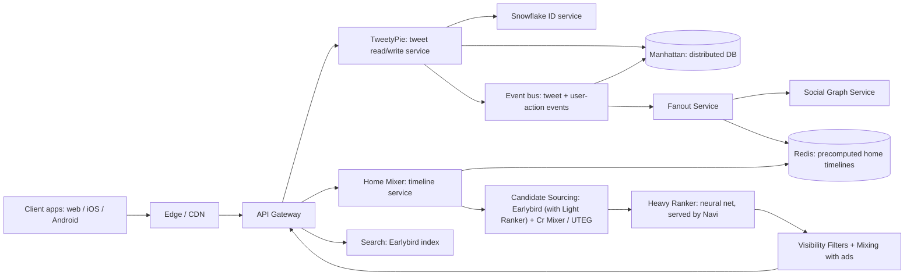
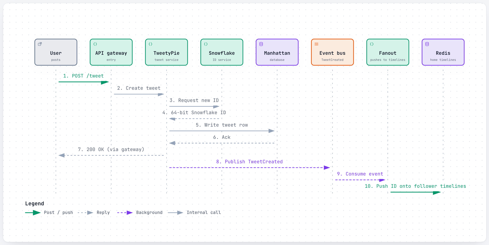
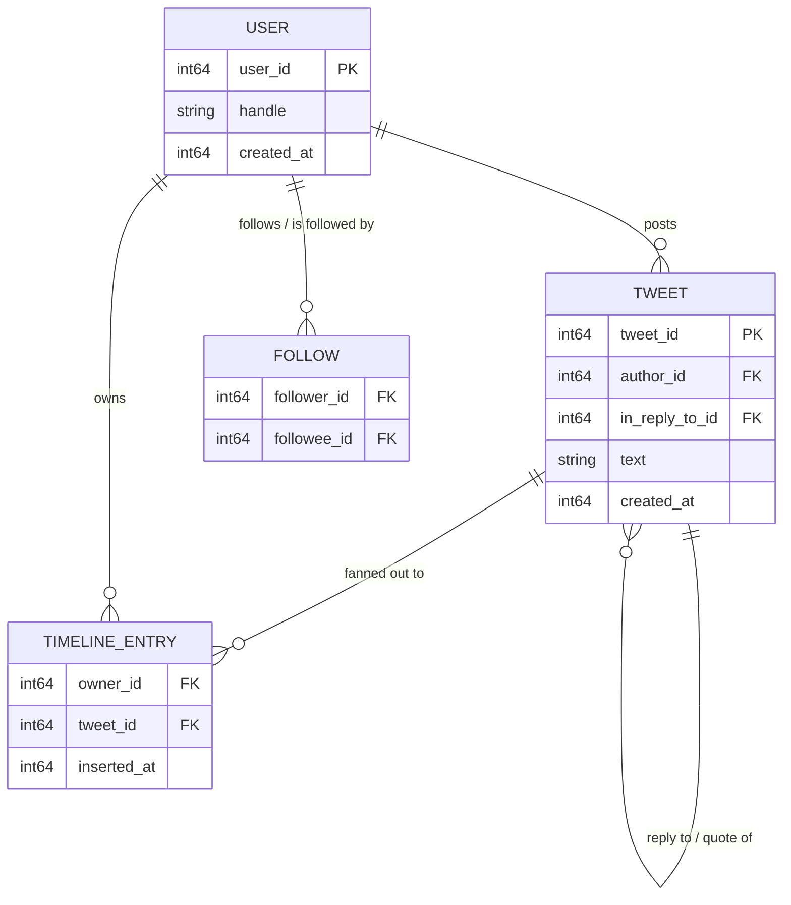
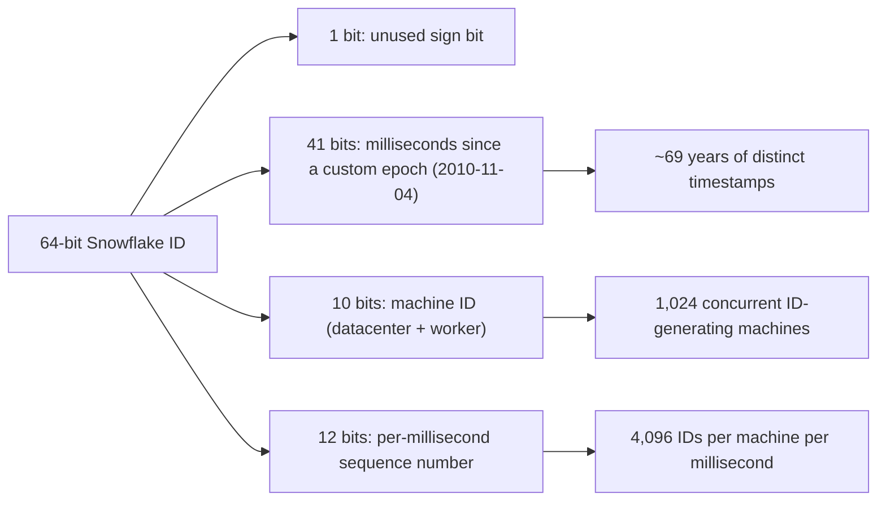
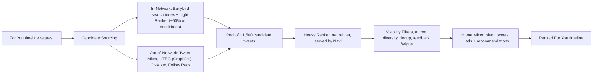
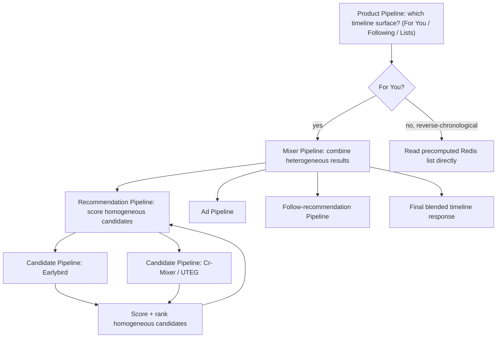
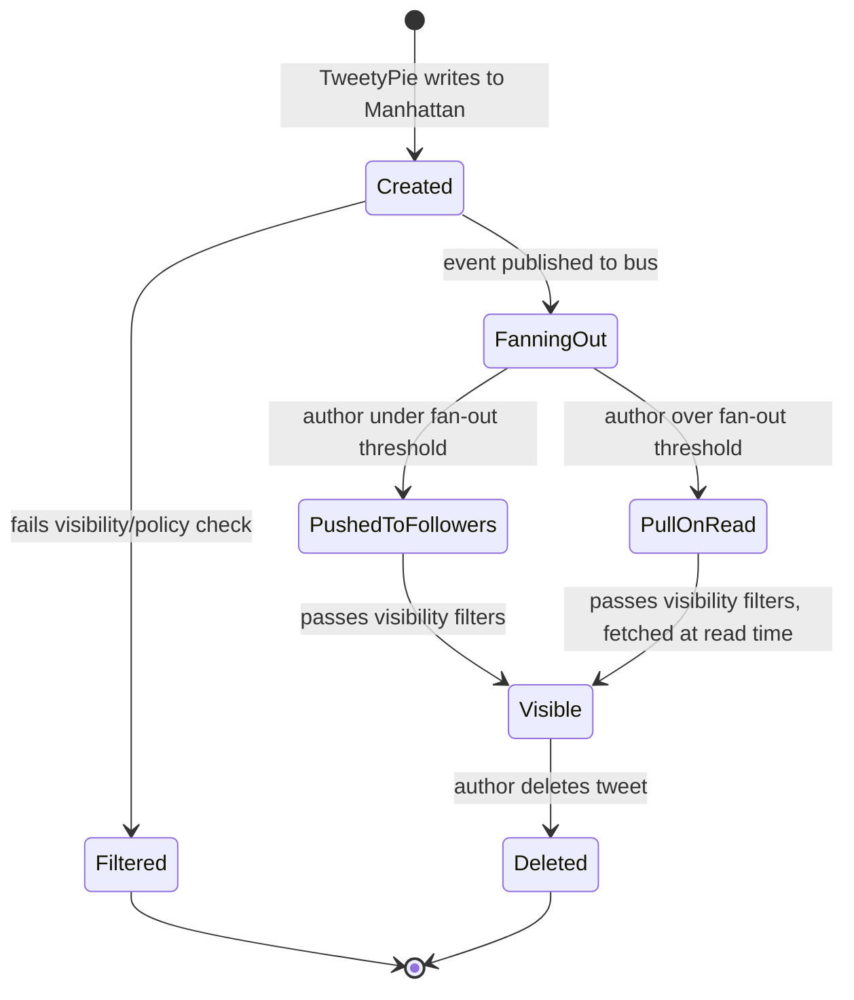

# Twitter/X: how a single tweet reaches millions of timelines in real time

> **In 60 seconds:** When you post a tweet, it gets a unique 64-bit ID from Snowflake (a distributed ID generator that needs no central coordinator), is written to Manhattan (Twitter's own distributed database), and fires an event onto an internal event bus. A fan-out service then either pushes the tweet ID directly into your followers' precomputed home timelines in Redis (if you have a normal-sized following) or leaves it to be fetched at read time (if you have millions of followers — the "celebrity problem"). When someone opens their "For You" timeline, a service called Home Mixer pulls together candidates from search indexes and graph-based recommenders, pre-ranks in-network candidates with a cheap logistic-regression "Light Ranker" inside the search index, then scores the merged ~1,500 with a neural-network "Heavy Ranker," filters and blends the results with ads, and returns a personalized feed — all in under 1.5 seconds on average, even though a single pipeline run burns about 220 seconds of CPU time behind the scenes.

**Last reviewed:** September 2026 · **Difficulty:** Advanced · **Reading time:** ~32 min

## Table of contents

- [Before you read: design it yourself](#before-you-read-design-it-yourself)
- [The problem](#the-problem)
- [Scale](#scale)
- [Back-of-the-envelope math](#back-of-the-envelope-math)
- [Requirements](#requirements)
- [How it evolved](#how-it-evolved)
- [High-level design](#high-level-design)
- [Low-level design](#low-level-design)
- [Deep dives](#deep-dives)
- [What happens when things break](#what-happens-when-things-break)
- [Key design decisions](#key-design-decisions)
- [Interview takeaways](#interview-takeaways)
- [Glossary](#glossary)
- [Sources](#sources)

## Before you read: design it yourself

Try each question for 5 minutes before reading the answer — the "how Twitter/X does it" boxes are collapsed so you're not tempted to peek early.

### Q1. How do you generate a unique, roughly time-ordered ID for every tweet across thousands of machines, without one database becoming a bottleneck?

<details>
<summary>Hint</summary>

Think about packing three different pieces of information — when, which machine, which one of several in the same millisecond — into a single number.

</details>

<details>
<summary>How Twitter/X does it</summary>

Snowflake packs a 41-bit millisecond timestamp, a 10-bit machine ID (datacenter + worker), and a 12-bit per-millisecond sequence number into one 64-bit integer — any machine can mint an ID with zero coordination with any other machine, and because the timestamp is the high-order bits, sorting by ID is approximately sorting by creation time for free. The cost: clocks have to stay roughly in sync, and a machine whose clock jumps backward has to refuse to generate IDs rather than risk a collision.

Deep dive: [Snowflake: minting unique IDs without a central counter](#snowflake-minting-unique-ids-without-a-central-counter).

</details>

### Q2. A pop star with 30 million followers posts — how do you get that tweet in front of all of them without turning one write into 30 million synchronous writes?

<details>
<summary>Hint</summary>

Think about whether every follower needs the tweet pushed to them the instant it's posted, or whether some of them can just fetch it when they next look.

</details>

<details>
<summary>How Twitter/X does it</summary>

Hybrid fan-out: for a normal account, the fanout daemon pushes the new tweet ID into every follower's precomputed Redis timeline list at post time (cheap). Past a follower-count threshold, nothing gets pushed at all — the tweet just sits in the author's own timeline, and every follower's *next* read does a small live merge to pick it up. One strategy for every account is the trap most candidates fall into; naming the follower-count split is the actual answer.

Deep dive: [Fan-out on write vs. fan-out on read: the celebrity problem](#fan-out-on-write-vs-fan-out-on-read-the-celebrity-problem).

</details>

### Q3. Out of a candidate pool that can run into the hundreds of millions of tweets, how do you rank and return a personalized "For You" feed in about a second?

<details>
<summary>Hint</summary>

Think about why you'd never run an expensive neural network over hundreds of millions of items directly — what has to happen first to make that affordable?

</details>

<details>
<summary>How Twitter/X does it</summary>

A narrowing funnel: candidate sourcing (Earlybird for in-network, Tweet-Mixer/UTEG/Cr-Mixer for out-of-network) pulls the pool down to ~1,500 candidates (in-network ones pre-ranked inside Earlybird by a cheap logistic-regression Light Ranker), and only then does the expensive neural-network Heavy Ranker score those ~1,500. One full pipeline run burns ~220 seconds of CPU time yet returns in under 1.5 seconds wall-clock, and it runs ~5 billion times a day — exactly why the cheap stage isn't optional, it's load-bearing for the whole thing being affordable at all.

Deep dive: [The "For You" ranking pipeline](#the-for-you-ranking-pipeline-candidate-sourcing-to-heavy-ranker).

</details>

### Q4. What happens when an entire datacenter goes fully offline in a heat wave — and how many datacenters is actually "enough"?

<details>
<summary>Hint</summary>

Think N-1, not N: it's not about how many sites you have, it's about how many you can lose at once and still be fine.

</details>

<details>
<summary>How Twitter/X does it</summary>

In September 2022, a record heat wave took Twitter's Sacramento-area datacenter fully offline — "total shutdown of physical equipment" — leaving Atlanta and Portland to carry the load. Tweet and timeline data survived because Manhattan replicates across sites rather than living on one, but an internal memo warned: "If we lose one of those remaining datacenters, we may not be able to serve traffic to all Twitter's users."

Deep dive: [A datacenter dies](#a-datacenter-dies).

</details>

## The problem

It's a Tuesday afternoon and a pop star with 30 million followers posts a surprise announcement. In the same second, thousands of ordinary users are tweeting about lunch, a bug they just fixed, or a goal in a football match on the other side of the world. Every one of those posts needs a globally unique ID, a durable home in storage, and a path into the right people's feeds — and the pop star's post alone implies 30 million potential timeline updates if handled naively.

A few seconds later, one of those ordinary users opens the app. Twitter has to decide, out of hundreds of millions of tweets posted in the last few hours by everyone that person follows and everyone they don't, which roughly 40 tweets are worth showing first.

This page answers three hard questions that fall out of that scenario:

1. How do you generate a unique, roughly time-ordered ID for every tweet, DM, and user, across thousands of machines, without a single database becoming the bottleneck?
2. How do you get a single tweet in front of millions of followers without turning one write into millions of synchronous writes?
3. Out of a candidate pool that can run into the hundreds of millions of tweets, how do you rank and return a personalized feed in about a second?

Both of those posts also have to survive far more mundane failure modes than a viral spike: a rack losing power, an entire datacenter going dark in a heat wave, or a single celebrity account's follower list turning into a hot spot that the wrong architecture would let take down delivery for every other user posting at the same moment. The rest of this page works through the pieces Twitter/X built to answer all of that — Snowflake, Manhattan, hybrid fan-out, and the open-sourced ranking pipeline — and how each one replaced something simpler that broke first.

## Scale

| Metric | Number | Source |
|---|---|---|
| Peak tweets per second | 143,199 TPS, set Aug 3 2013 during a Japanese TV airing of "Castle in the Sky" | [6] |
| Prior TPS record it broke | 33,388 TPS *(unverified: not in the archived text of [6])* | [6] |
| Steady-state tweet volume implied by the 2013 post | Twitter frames the record as ~25x steady state, and separately over 500 million tweets/day were reported around that period, which works out to roughly 5,700 TPS on average | [6] |
| Home-timeline (Redis) fan-out writes per day | ~30 billion *(third-party estimate, based on a Twitter engineering conference talk, not a blog post)* | [15] |
| Monetizable daily active users (mDAU) | 237.8 million, Q2 2022 (the last quarter Twitter disclosed the metric before going private) *(third-party aggregation of Twitter's own disclosed filings)* | [17] |
| Manhattan deployment footprint | Runs on clusters of thousands of physical hosts across multiple datacenters | [4] |
| Recommendation pipeline executions | ~5 billion times per day, <1.5s average end-to-end latency, ~220 seconds of CPU time per single pipeline run | [7] |
| Candidates scored per "For You" request | ~1,500 tweets pulled from a pool that can run into the hundreds of millions | [7][8] |
| In-Network candidate share | Search Index (Earlybird) alone supplies roughly half of timeline posts | [8] |
| Per-host throughput after the Rails-to-JVM migration | Went from ~200-300 requests/sec/host to ~10,000-20,000 requests/sec/host | [6] |
| Twitter's core datacenter count (2022) | At least three named production datacenters (Sacramento, Atlanta, Portland) *(third-party reporting on an internal memo)* | [19][20] |
| FlockDB throughput | Reported to serve up to 10,000 queries/second per commodity machine *(third-party)* | [14] |
| Mesos-to-Aurora migration timeline | About four years from an initial "hello world" on Mesos to production-critical services fully migrated onto Aurora *(third-party)* | [16] |
| User growth that triggered the Rails migration | Reported ~1,444% growth in one year, around 2009 *(third-party)* | [12] |

What these numbers mean in practice:

- A 143,199-TPS spike is roughly 25x Twitter's own steady state, which is why the fan-out and storage paths have to absorb huge, unpredictable bursts rather than just a smoothly growing baseline.
- Going from 200-300 requests/sec/host to 10,000-20,000 requests/sec/host after leaving Rails is a 30-50x jump — that gap is the entire reason "rewrite the hot path in a faster runtime" was worth a multi-year engineering effort.
- Running on a handful of core datacenters means losing one doesn't just cost some capacity, it removes an entire failure domain, which is exactly what happened in 2022 (see [What happens when things break](#what-happens-when-things-break)).
- A four-year migration from "hello world" to full production on Mesos/Aurora is a reminder that infrastructure migrations at this scale are measured in years, not sprints — useful context before promising a quarter-long timeline for something comparable.

Only numbers a source states are included. Anything without a citation in this file is a labeled reference-design assumption, not a fact.

## Back-of-the-envelope math

Back-of-the-envelope math is the rough, order-of-magnitude estimating engineers do on a whiteboard — no calculator, no precise data, just enough arithmetic to check whether a design idea is remotely plausible before building it. Inputs marked **[n]** come straight from this page's [Scale](#scale) table and cite the same source; everything else is a labeled **Assumption**, not a fact.

### Estimate 1: How much of Snowflake's theoretical ID capacity does the all-time TPS record actually use?

**Question:** Snowflake's bit layout allows 1,024 machines each minting up to 4,096 IDs/millisecond. How does that theoretical ceiling compare to the all-time peak of 143,199 tweets/sec?

**Inputs:**
- Sequence bits: 12 → 4,096 IDs/ms/machine [1][21]
- Machine-ID bits: 10 → 1,024 machines [1][21]
- Peak tweets/sec (Aug 2013 record): 143,199 [6]

**Math:**
```text
max IDs/sec per machine = 4,096 IDs/ms × 1,000 ms/s
                         = 4,096,000 IDs/sec

theoretical fleet max   = 4,096,000 × 1,024
                         = 4,194,304,000 ≈ 4.19 × 10^9 IDs/sec

share of ceiling used   = 143,199 / 4,194,304,000
                         ≈ 0.0000341 → ~0.003%
```

**Answer:** theoretical ceiling ~4.2 billion IDs/sec; the all-time TPS record used only ~0.003% of it.

**What it tells you:** the bit layout has enormous headroom baked in — Snowflake was never going to be the bottleneck, unlike the fan-out and ranking paths described elsewhere on this page; see [Snowflake: minting unique IDs without a central counter](#snowflake-minting-unique-ids-without-a-central-counter).

### Estimate 2: How many home-timeline fan-out writes does one mDAU generate per day?

**Question:** With ~30 billion Redis fan-out writes/day and 237.8 million mDAU, how many fan-out writes does an average monetizable daily active user generate or receive per day?

**Inputs:**
- Home-timeline (Redis) fan-out writes/day: ~30 billion *(third-party estimate)* [15]
- mDAU: 237.8 million, Q2 2022 [17]

**Math:**
```text
writes per mDAU per day = 30,000,000,000 / 237,800,000
                         ≈ 126.2
```

**Answer:** ~126 fan-out writes per mDAU per day.

**What it tells you:** even "ordinary," non-celebrity tweets multiply heavily once fanned out to followers — motivating why the hybrid push/pull split, not push-for-everyone, is necessary at this multiplier; see [Fan-out on write vs. fan-out on read: the celebrity problem](#fan-out-on-write-vs-fan-out-on-read-the-celebrity-problem).

### Estimate 3: How far above the "typical" peak-to-average ratio was the 2013 TPS record?

**Question:** The 2013 peak of 143,199 TPS is described as ~25x steady state. How does that compare to the usual "peak ~2-3x average" planning rule of thumb?

**Inputs:**
- Peak tweets/sec (Aug 2013): 143,199 [6]
- Steady-state average implied by the same source: ~5,700 TPS [6]
- Rule of thumb: peak load is typically ~2-3x average.

**Math:**
```text
ratio = 143,199 / 5,700 ≈ 25.1x
```

**Answer:** ~25x average — roughly 8-12x higher than the everyday 2-3x planning range.

**What it tells you:** a genuine viral event blows straight through the "typical day" planning rule of thumb, which is why the fan-out and write paths have to absorb bursts far outside normal capacity planning; see [A traffic spike](#a-traffic-spike).

### Estimate 4: How many old Rails hosts does it take to match one new JVM host?

**Question:** Using the midpoints of the documented before/after ranges, how many Rails-era hosts would it take to match the throughput of one post-migration JVM host?

**Inputs:**
- Per-host throughput before (Rails): 200-300 requests/sec/host [6]
- Per-host throughput after (JVM): 10,000-20,000 requests/sec/host [6]

**Math:**
```text
Rails midpoint = (200 + 300) / 2   = 250 req/s/host
JVM midpoint   = (10,000 + 20,000) / 2 = 15,000 req/s/host

ratio = 15,000 / 250 = 60
```

**Answer:** ~60 old Rails hosts to match one new JVM host, using range midpoints.

**What it tells you:** quantifies why "migrate the hottest path first" (see [From Rails to the JVM](#from-rails-to-the-jvm-blender-finagle-and-mesosaurora)) was such high-leverage engineering — the same request-handling capacity could theoretically run on a ~60x smaller fleet.

### Estimate 5: How much continuous compute does the ranking pipeline burn?

**Question:** The "For You" pipeline runs ~5 billion times/day at ~220 seconds of CPU time per run. How many CPU-cores'-worth of continuous compute does that represent?

**Inputs:**
- Recommendation pipeline executions: ~5 billion/day [7]
- CPU time per run: ~220 seconds [7]
- Rule of thumb: 1 day ≈ 86,400 s ≈ 10^5 s.

**Math:**
```text
total CPU-seconds/day = 5,000,000,000 × 220
                       = 1,100,000,000,000 = 1.1 × 10^12 CPU-s/day

equivalent always-on cores = 1.1 × 10^12 / 86,400
                            ≈ 1.27 × 10^7 ≈ ~12.7 million cores
```

**Answer:** ~12-13 million CPU-cores'-worth of continuous compute (assuming a perfectly steady load — a simplification, since real traffic has diurnal peaks and troughs).

**What it tells you:** that's an enormous, unavoidable cost the pipeline only "affords" 5 billion times a day because the expensive neural net never runs on more than ~1,500 pre-filtered candidates — the Light Ranker pre-filter is load-bearing, not optional; see [The "For You" ranking pipeline](#the-for-you-ranking-pipeline-candidate-sourcing-to-heavy-ranker).

### Rules of thumb used

| Rule | Value |
|---|---|
| 1 day | ~86,400 s ~ 10^5 s |
| Peak vs. average load | typically ~2-3x; a genuine viral event can run far higher |

These are general estimating conventions, not Twitter/X-specific facts.

## Requirements

**Functional:**
- Post a tweet (text, media, reply, retweet/quote) and have it durably stored. *Why it matters: this is the one write path every other feature depends on.*
- Deliver new tweets to followers' home timelines. *Why it matters: the core product promise — "follow someone, see what they post" — lives entirely in this path.*
- Serve a reverse-chronological "Following" timeline and an algorithmically ranked "For You" timeline. *Why it matters: most users spend their time on "For You," so its quality directly drives engagement and ad revenue.*
- Support search, notifications, and direct messages on the same storage and event infrastructure. *Why it matters: building one shared multi-tenant platform instead of one database per feature is what makes Manhattan worth building at all.*
- Generate globally unique, roughly time-ordered IDs for every tweet, user, and DM without a single central counter. *Why it matters: a single auto-increment counter cannot survive being sharded across many databases.*

**Non-functional:**
- Availability over strict consistency for the timeline read path. *Why it matters: a stale or slightly delayed timeline is an acceptable user experience; a fully unavailable one is not.*
- Low write amplification for accounts with huge follower counts. *Why it matters: without this, one celebrity tweet can turn into tens of millions of synchronous writes and take down the write path.*
- Sub-second to low-single-digit-second delivery of a tweet into most followers' timelines. *Why it matters: real-time delivery is the product's core value proposition versus a slower medium like a blog or a newsletter.*
- Horizontally scalable, multi-tenant storage that can add capacity without a full re-shard. *Why it matters: Twitter's traffic and dataset both grew by orders of magnitude over the company's life, and re-sharding by hand doesn't scale with that growth.*
- A ranking pipeline that can evaluate machine-learned models over hundreds of millions of candidate tweets within about a second of perceived latency. *Why it matters: this is the difference between "For You" being usable at all versus timing out.*
- Survive the loss of an entire datacenter without full service outage. *Why it matters: hardware, power, and cooling all fail, and a global real-time product can't go dark when one building has a bad day.*

## How it evolved

Twitter did not start as the distributed system described in the rest of this page — it started as a small startup's monolith, and nearly every major piece described below exists because something earlier broke under load.

| Era | What was there | What broke | What replaced it |
|---|---|---|---|
| 2006 launch | Ruby on Rails monolith over MySQL | Fine at launch scale, but Ruby MRI's single-threaded interpreter (the GIL) meant one CPU core did the work per process even on multi-core servers [6][12] | — |
| 2007-2010, the "Fail Whale" era | Same Rails monolith, now under fast-growing load (reported ~1,444% growth in one year around 2009) | Fan-out-on-write for celebrity accounts and Rails' request-handling limits combined to produce frequent, visible outages (the literal "Fail Whale" error page) [12] | Piecemeal moves of the hottest backend paths off Rails |
| ~2009-2010 | Rails services for the message queue and tweet storage | These specific paths were the worst bottlenecks | Rewritten on the JVM in Scala first, ahead of a full rewrite [13] |
| 2010 | A single ID strategy tied to one MySQL sequence | Auto-increment IDs can't be assigned once you shard a table across many databases | Snowflake: a distributed 64-bit ID generator with no central coordinator [1] |
| ~2010 | Ad hoc MySQL for the social graph (who-follows-whom) | Needed to shard the graph without hand-rolling routing logic in every service | Gizzard (a generic sharding framework over MySQL) plus FlockDB (a graph store built on Gizzard), both later open-sourced, then archived as no longer maintained [14] |
| 2011 | Rails front end for search | Search latency | Blender, a Java server, replaced the Rails search front end, cutting search latency 3x [13]; by 2013 the wider JVM re-architecture had taken per-host throughput from ~200-300 req/s to ~10,000-20,000 req/s [6] |
| 2012-2013 | Static host lists for service-to-service calls | Didn't scale as the number of services and hosts grew | Finagle (an RPC library) plus Apache Mesos and Aurora (cluster scheduling with dynamic service discovery) [16][18] |
| 2014 | Open-source databases, with a cluster built out per feature | Couldn't meet real-time latency needs; per-feature clusters wasted resources and operator time | Manhattan, Twitter's own real-time distributed database [2][3] |
| 2015 | Traditional hierarchical datacenter network | Limited bandwidth scaling and a large "blast radius" per failed device | A Clos network topology using BGP for routing, plus a formal failure-injection testing program [22]; the Clos/BGP move is unverified ([18] does not cover it) |
| By 2022 | Manhattan's in-house storage engines | A single, shared engine for read-write workloads | RocksDB became Manhattan's storage engine for all read-write workloads [5] |
| 2023 | A closed, internal-only ranking pipeline | Public pressure for transparency about how "For You" ranks content | Core of the recommendation algorithm open-sourced on GitHub [7][8][9] |

### The monolith years (2006-2011)

Twitter launched on a single Ruby on Rails application backed by MySQL — a completely reasonable choice for a startup with a few thousand users, and one that plenty of successful products still make today. The trouble started once growth compounded: reported user growth of roughly 1,444% in a single year around 2009 collided with two Rails-era limits at once — Ruby MRI's global interpreter lock, which meant a single process could only execute one thread of Ruby at a time no matter how many cores the server had, and pure fan-out-on-write, which meant a single popular account's tweet could fan out into an enormous burst of synchronous work [6][12]. The visible symptom was the "Fail Whale" error page, which became famous enough that it's still the shorthand people use for "a site that can't handle its own success." Twitter's response wasn't a rewrite-everything gamble; it moved the two hottest backend paths — the message queue and the tweet storage engine — onto the JVM in Scala first, while the rest of the site kept running on Rails [13]. Search's Rails front end followed in 2011, replaced by Blender, a Java server that cut search latency 3x [13]; by 2013 the JVM re-architecture as a whole had taken per-host throughput from roughly 200-300 requests/sec to 10,000-20,000 requests/sec [6].

### Building shared platforms (2010-2015)

With the JVM migration underway, Twitter hit a second class of problem: pieces of infrastructure that every team needed but nobody wanted to build twice. A single MySQL auto-increment sequence couldn't be shared across shards, so Snowflake was built to hand out unique 64-bit IDs from any machine with no central coordinator [1]. The social graph (who follows whom) needed to be sharded across many MySQL instances without every service hand-rolling its own routing logic, so Twitter built Gizzard, a generic sharding framework, and FlockDB, a graph store on top of it — both later open-sourced and eventually archived as no longer maintained [14]. As the number of independent JVM services grew, so did the pain of wiring them together with hardcoded host lists; Finagle (an RPC library) and Apache Mesos with Aurora (cluster scheduling and dynamic service discovery) replaced that with services that register themselves and get scheduled onto whatever hardware is free [16][18]. And storage itself consolidated: instead of building out a cluster per feature on open-source databases that couldn't meet Twitter's latency needs, Manhattan launched in 2014 as one multi-tenant database supporting both eventual and strong consistency [2][3]. The datacenter network was re-architected around the same period, moving from a traditional hierarchical topology to a Clos network using BGP, specifically to shrink how much of the network a single failed device could take down *(unverified: [18] does not describe the network topology)*.

### The recommendation era (2015-2023)

Once the storage and scheduling layers were stable multi-tenant platforms, Twitter's engineering effort shifted toward what to *show* people rather than just how to store and deliver it — Earlybird search, graph-based out-of-network candidate generation (UTEG/GraphJet), and the Light Ranker/Heavy Ranker pipeline all matured through this period as the "For You" timeline became a primary product surface rather than just a reverse-chronological list [8][9]. Manhattan kept evolving underneath all of it, and by 2022 RocksDB was its storage engine for all read-write workloads [5]. In March 2023, under new ownership, Twitter/X open-sourced the core of that recommendation pipeline on GitHub — candidate sourcing, ranking models, and the Home Mixer service that ties them together — giving the public its first detailed look at how the algorithm actually ranks a timeline [7][8][9].

### The arc, end to end

| Layer | Fail Whale era (~2007-2010) | Today |
|---|---|---|
| Backend runtime | Single Ruby on Rails process, limited by the GIL [6][12] | Many JVM (Scala/Java) services, coordinated by Finagle + Mesos/Aurora [13][16] |
| ID generation | MySQL auto-increment, breaks under sharding | Snowflake: coordination-free 64-bit distributed IDs [1] |
| Social graph storage | Ad hoc MySQL | Gizzard/FlockDB (both since archived) [14] |
| Primary database | MySQL plus Cassandra for some workloads | Manhattan: one multi-tenant store, eventual or strongly consistent per operation [2][3] |
| Timeline delivery | Pure fan-out-on-write, breaks on celebrity accounts | Hybrid fan-out (push + pull) [10][12][15] |
| Datacenter network | Traditional hierarchical topology | Clos network with BGP, smaller blast radius *(unverified)* [18] |
| What ranks the feed | Reverse-chronological only | Reverse-chronological "Following" plus a multi-stage ranked "For You" pipeline [7][8][9] |

Reading down that table row by row, a pattern emerges: almost nothing was replaced because it was "wrong" in some abstract sense — each row on the left was a completely reasonable choice at the scale it was made, and each row on the right exists because the row on the left hit a concrete, named limit (a GIL, an auto-increment counter, a celebrity's follower count, a core switch's blast radius). That's the single most reusable lesson on this entire page: build the simple version first, and know which specific number (requests/sec, followers, machines, datacenters) will force you to replace it.

## High-level design



Walking through it:

1. A client posts through the **API Gateway** to **TweetyPie**, the core service that owns reading and writing tweet data [8]. The gateway is also where auth, rate limiting, and request routing happen, though those specifics aren't the focus of this page.
2. TweetyPie asks the **Snowflake ID service** for a new 64-bit ID before it writes anything, so the tweet's primary key is assigned without talking to a central sequence generator [1]. This has to happen before the write, not after, because the ID is the row's primary key.
3. The tweet row is written to **Manhattan**, Twitter's real-time, multi-tenant distributed database built to replace per-feature clusters on open-source databases that couldn't meet Twitter's latency needs [2][3]. The client's request can return successfully the moment this write is durable — nothing downstream of this step is on the critical path for the user's own "tweet sent" confirmation.
4. TweetyPie publishes a tweet-created event onto an internal **event bus**; this same stream (called Unified User Actions for engagement events) also feeds the ranking models [8]. Publishing the event, rather than calling the fanout service directly, is what lets fan-out lag behind acceptance during a spike without slowing down new posts.
5. The **Fanout Service** consumes the event, looks up the author's followers via the **Social Graph Service**, and pushes the new tweet ID into each follower's precomputed home timeline held in a large in-memory **Redis** cluster — unless the author has too many followers, in which case the tweet is left to be fetched at read time instead (see [Deep dives](#deep-dives)) [15].
6. When a follower opens **Home Mixer** (built on the in-house Scala framework **Product Mixer**) it decides whether to render the reverse-chronological "Following" timeline (a straight read of the Redis list, a reference-design assumption: [9] only says it is reverse-chronological) or the ranked "For You" timeline, which runs the candidate-sourcing → ranking → filtering → mixing pipeline described below [9]. This decision, and the nested pipeline structure behind it, is expanded in [Low-level design #5](#5-secondary-flow-nested-pipelines-inside-home-mixer).
7. **Search** (Earlybird) is both a standalone product surface and the single largest in-network candidate source for the ranking pipeline [8], which is why it appears twice in the diagram above — once as a client-facing feature, once as an internal dependency of Home Mixer.

## Low-level design

### 1. Core flow: posting a tweet and fanning it out

<a href="https://alwintwk.github.io/big-tech-system-design/diagrams/companies-twitter-x-post-tweet.html">
  <picture>
    <source media="(prefers-color-scheme: dark)" srcset="../diagrams/companies-twitter-x-post-tweet.dark.png">
    
  </picture>
</a>

<sub>Click the diagram for the interactive version (zoom, dark mode, trace a path).</sub>

Step by step:

- The client's write returns as soon as TweetyPie has durably written the tweet to Manhattan — the user never waits on fan-out.
- Fan-out happens asynchronously off the event bus, which is what decouples "how fast can I post" from "how many followers do I have."
- The branch at the bottom is the hybrid fan-out strategy covered in depth in [Deep dives](#deep-dives): most tweets go down the push side, very-high-follower accounts go down the pull side.
- Nothing in this diagram blocks on ranking or ad insertion — those only happen later, when a follower actually opens their timeline (see diagrams 4 and 5 below).

### 2. Data model



Key choices in this model, and why:

- **`tweet_id` and `user_id` are Snowflake IDs**, not database auto-increment integers, specifically because they're generated independently by whichever machine handles the write, are sortable by creation time, and don't require a lookup against a central counter before an insert can happen [1].
- **`TIMELINE_ENTRY` is keyed by `(owner_id, tweet_id)`**, not by tweet alone, because the dominant access pattern is "give me the most recent N tweets for this owner." That access pattern is exactly what the fan-out design turns into a fast ordered-list read in Redis rather than a query across the whole `TWEET` table [15].
- **`FOLLOW` is a plain adjacency pair**, not a richer join table, because the social graph's dominant queries are "who follows X" and "who does X follow" — both of which just need the pair, not extra columns, to answer quickly.
- **`in_reply_to_id` lives on `TWEET` itself** rather than in a separate table, so that reconstructing a reply thread doesn't require an extra join for the common case of "does this tweet reply to anything."

### 3. Signature component: Snowflake ID structure



> Note: the 41/10/12-bit split and the November 2010 epoch are documented in third-party write-ups and reference implementations of Snowflake, not spelled out bit-by-bit in the original 2010 announcement post, which focuses on the motivation (moving off auto-incrementing MySQL IDs that couldn't scale across shards) rather than the exact bit layout [1][21].

Why split the 64 bits this particular way rather than some other way:

- **More timestamp bits** would extend how many years the scheme lasts before it needs a new epoch, but would leave fewer bits for machines and sequence numbers.
- **More machine-ID bits** would let more machines mint IDs concurrently, useful for a much bigger fleet, at the cost of fewer sequence bits (lower per-machine IDs-per-millisecond).
- **More sequence bits** would let each individual machine generate more IDs within the same millisecond before having to wait for the clock to tick — useful if a small number of very busy machines matters more than supporting a large fleet.
- Twitter's 41/10/12 split reflects the fleet size and per-machine burst rate that made sense for its actual write volume; a different company sizing this from scratch would tune the split to its own machine count and peak per-machine write rate rather than copying these numbers verbatim.

For context, here's how Snowflake-style IDs compare to two other common approaches *(general knowledge, not specific to a Twitter source)*:

| Scheme | Coordination needed | Sortable by creation time | Typical size |
|---|---|---|---|
| Database auto-increment | Yes — one counter, one database | Yes | 4-8 bytes |
| UUID (v4, random) | None | No | 16 bytes |
| Snowflake-style (timestamp + machine + sequence) | None | Approximately | 8 bytes |

### 4. Signature component: the "For You" ranking pipeline

Twitter/X open-sourced the core of its recommendation system in March 2023 [7][8]. It runs in three stages:



Step by step: candidate sourcing pulls from **In-Network** (accounts you follow, mostly via Earlybird) and **Out-of-Network** (accounts you don't, via Tweet-Mixer/UTEG/Cr-Mixer) in parallel, producing roughly 1,500 candidates from a pool that can be hundreds of millions of tweets wide [7][8]. A cheap logistic-regression Light Ranker inside Earlybird pre-ranks in-network candidates during sourcing [8], so the expensive Heavy Ranker — a neural network — only scores the merged ~1,500, and a final filtering/mixing stage applies policy rules and blends in ads before Home Mixer returns the feed [9]. This two-tier design is covered in more depth in [Deep dives](#deep-dives).

### 5. Secondary flow: nested pipelines inside Home Mixer



Step by step: a **Product Pipeline** is the entry point per product surface and decides which lower-level pipelines to call. For "For You," it delegates to a **Mixer Pipeline**, which is responsible for combining *heterogeneous* results — tweets, ads, and follow recommendations are different kinds of things and need different handling. The Mixer Pipeline in turn calls one or more **Recommendation Pipelines**, each of which scores a *homogeneous* set of candidates (e.g., "all tweet candidates") by calling one or more **Candidate Pipelines** that fetch and pre-filter from a single source like Earlybird or Cr-Mixer/UTEG [9]. For the plain "Following" surface, the Product Pipeline skips all of this and just reads the precomputed Redis list directly (reference-design assumption), which is why a reverse-chronological timeline is so much cheaper to serve than a ranked one.

### 6. Secondary flow: a tweet's visibility state

> Note: this is a reference-design synthesis of documented pieces (fan-out routing, visibility filtering) rather than a state machine Twitter has published in this exact shape.



Step by step: every tweet starts in `Created` the instant TweetyPie's write to Manhattan succeeds. From there it either heads down the push path or the pull path depending on the author's follower count (the hybrid fan-out decision from the deep dives below), and either way it has to clear visibility filtering before it's actually shown to anyone — a tweet can be `Created` and durably stored while still never becoming `Visible` if it's caught by policy or compliance filtering [9]. Deletion is a separate terminal transition from `Visible`, not a special case of any of the earlier states.

## Deep dives

Each of the six pieces below maps back to one of the requirements from earlier in this page:

| Requirement | Piece that satisfies it |
|---|---|
| Unique IDs without a central bottleneck | Snowflake |
| Low write amplification for huge-follower accounts | Hybrid fan-out |
| Multi-tenant storage with tunable consistency | Manhattan |
| Get off a stalled monolith without freezing feature work | Rails-to-JVM migration (Blender, Finagle, Mesos/Aurora) |
| Rank hundreds of millions of candidates in about a second | The "For You" ranking pipeline |
| Keep the ranking system extensible as content types grow | Home Mixer / Product Mixer |

### Snowflake: minting unique IDs without a central counter

**What it is:** a small, horizontally-scaled service that hands out 64-bit IDs on request. Any machine running it can generate an ID at any time, for any tenant, with no synchronous coordination with any other machine [1].

**The problem it solved:** Twitter originally used MySQL's auto-increment integer IDs. That works fine on one database, but the moment you shard the `tweets` table across many MySQL instances, you either get ID collisions across shards or you need every shard to agree on "whose turn it is" to hand out the next number — which reintroduces a central bottleneck exactly where you're trying to remove one [1].

**How it works inside:** each ID packs a millisecond timestamp, a machine identifier, and a per-machine sequence counter into one 64-bit integer (see the [bit-layout diagram](#3-signature-component-snowflake-id-structure) above). Because the timestamp is the high-order bits, IDs generated later are numerically larger almost all of the time, which gives "sort by ID" a useful side effect: it's approximately "sort by creation time," without needing a separate timestamp column for most purposes.

```text
id = (timestamp_ms - custom_epoch) << 22
   | (datacenter_id)                << 17
   | (worker_id)                    << 12
   | (sequence_within_millisecond)
```

> **Why this matters:** this is the general pattern behind almost every "distributed ID generator" used across the industry today — trade a small amount of ID size and rough sort-order guarantees for the ability to generate IDs with zero cross-machine coordination.

**What it costs:** clocks have to be kept roughly in sync (a machine whose clock jumps backward can generate a duplicate or out-of-order ID), and machine/datacenter ID assignment has to be managed so two workers never share the same identifier at the same time.

In practice that means running something like NTP (Network Time Protocol) across the fleet and having a safe, deterministic behavior for a worker that detects its own clock has gone backwards — typically refusing to generate new IDs until the clock catches back up, rather than risking a collision.

**Worked example (illustrative, not a Twitter-published trace):** say a worker in a US datacenter and a worker in a European datacenter both receive a tweet-creation request in the same millisecond. Because each was pre-assigned a distinct `datacenter_id`/`worker_id` pair, they can both mint an ID in that same millisecond and the results are still guaranteed unique — the timestamp bits collide, but the machine-ID bits don't. If the *same* machine receives two requests inside the same millisecond, it's the 12-bit sequence counter that tells them apart, up to 4,096 times before it has to wait for the clock to tick forward.

| Field | Bits | Answers |
|---|---|---|
| Timestamp | 41 | "When, roughly?" |
| Datacenter + worker ID | 10 | "Which machine made this?" |
| Sequence | 12 | "Which of several IDs from that machine, this millisecond?" |

### Fan-out on write vs. fan-out on read: the celebrity problem

**What it is:** the two opposite strategies for getting a new post in front of the people who should see it, and the hybrid Twitter runs between them [15].

**The problem it solved:** pure fan-out-on-write means every single tweet triggers one write per follower at post time. For a normal account that's cheap. For an account with tens of millions of followers, one tweet becomes tens of millions of near-simultaneous writes, which can overwhelm the fan-out path and delay delivery for everyone else posting at the same time [10][12].

**How it works inside:** on tweet creation, the fanout daemon looks up the author's followers and, for accounts under the fan-out threshold, inserts the new tweet ID (8 bytes) plus the author ID (8 bytes) and a few bytes of metadata into a native list structure in Redis, once per follower. Each follower's home timeline list is capped at roughly the most recent 800 entries [15]. For accounts over the threshold, the tweet is *not* pushed anywhere; instead, a follower's timeline read merges their own precomputed Redis list with a small, live fetch of tweets from the handful of high-follower accounts they follow [10][12][15].

```text
def on_new_tweet(tweet, author):
    if author.follower_count <= FANOUT_THRESHOLD:
        for follower_id in social_graph.followers(author.id):
            redis.push_timeline(follower_id, tweet.id)   # fan-out-on-write
    else:
        pass  # fan-out-on-read: nothing pushed, merged in at read time
```

> **Why this matters:** this is the canonical answer to "how would you design a social feed" in a system design interview the moment the interviewer says the word "celebrity." A single strategy for every account is a trap; the right answer is almost always "it depends on follower count."

> Note: the exact follower-count threshold Twitter uses in production is not published; public talks describe the pattern (push for most accounts, pull-and-merge for high-follower accounts) without giving the current cutoff number [10][12].

**What it costs:** the read path is now strictly more complex — every "Following" timeline read has to know whether to merge in extra sources, not just read one list — and there's no single universal threshold that's correct for every account; it has to be tuned.

That threshold is also a moving target: an account can cross it in either direction as its follower count grows or shrinks, so the system has to handle an account transitioning from the push path to the pull path (or back) without losing or duplicating timeline entries.

**Worked example (illustrative):** imagine an account with 4,000 followers tweets. The fanout daemon looks up all 4,000 followers and pushes the tweet ID into all 4,000 Redis lists — comfortably cheap. Now imagine an account with 40 million followers tweets. Pushing to 40 million Redis lists synchronously would be a completely different scale of problem — that write alone could be slower than the rest of that second's tweet volume combined. Under the hybrid design, the second account is simply never pushed: every one of its 40 million followers instead does a tiny bit of extra work on their *next* timeline read — merge in "anything new from the handful of huge accounts I follow" — which is cheap per-reader even though there are many readers, instead of expensive per-write with only one writer.

| | Fan-out-on-write only | Fan-out-on-read only | Hybrid (what Twitter runs) |
|---|---|---|---|
| Normal account tweets | 1 tweet -> N cheap pushes | 1 tweet -> 0 pushes, N future reads all pay a lookup cost | 1 tweet -> N cheap pushes |
| Celebrity tweets | 1 tweet -> tens of millions of pushes | 1 tweet -> 0 pushes | 1 tweet -> 0 pushes, merged at read time |
| Timeline read cost | Always cheap (one list read) | Always does extra lookups | Cheap for most, slightly more work only when following huge accounts |

### Manhattan: one distributed database, many tenants, two consistency models

**What it is:** Twitter's own real-time, multi-tenant distributed database, built to store things like tweets and direct messages across many machines and datacenters [2].

**The problem it solved:** before Manhattan, Twitter ran several open-source databases and built out clusters for every feature; they couldn't meet its real-time latency needs, and the per-feature clusters wasted resources and operator time [2]. Manhattan's goal was a single shared service that any team at Twitter could use as a tenant, offering both consistency models under one roof [2][3].

Multi-tenant here means many different teams and features — tweets, DMs, ads, and more — share the same physical clusters and the same operational team, instead of each feature justifying and running its own dedicated database.

**How it works inside:** Manhattan is layered so that routing, storage, and consistency are each handled by a distinct, swappable piece:

- **Coordinator layer:** a stateless process per node that routes incoming requests to the right backend nodes; being stateless means coordinators can be added or restarted freely without any data migration [4].
- **Backend layer:** the stateful part that actually stores the data, running across clusters of thousands of physical hosts spread over multiple datacenters [4].
- **Replication:** every key a client writes is stored on several replica nodes for redundancy, not just one.
- **Global CAS:** a compare-and-swap operation that's strongly consistent across a quorum of datacenters — the expensive, safest option [3][11].
- **Local CAS:** a compare-and-swap operation coordinated only within one datacenter — cheaper, still strongly consistent, but only locally [3][11].
- **Default path:** most Twitter workloads use the eventually-consistent default instead of either CAS mode, because Twitter favors availability over consistency in almost all of its own use cases [3][11].
- **Convergence machinery:** an always-on replica reconciliation process, plus read-repair and hinted handoff, keep eventually-consistent replicas converging quickly even after a node was briefly unavailable [11].
- **Pluggable storage engine:** by 2022, RocksDB was Manhattan's storage engine for all read-write workloads, swapped in underneath the same coordinator/backend architecture without changing how callers talk to it [5].

> **Why this matters:** "build one multi-tenant platform that supports two consistency models instead of maintaining two different databases" is a pattern that shows up anywhere a company outgrows a single off-the-shelf database's guarantees but doesn't want every team running its own bespoke storage.

**What it costs:** owning a database means owning 100% of its bugs, performance tuning, and roadmap — including projects like the RocksDB migration that a company running plain Cassandra would get "for free" from the open-source community [5].

It also means every new storage-engine feature the wider open-source community ships has to be evaluated and ported in-house before Manhattan's users can benefit from it, rather than arriving automatically through a dependency upgrade.

**Worked example (illustrative):** a direct message send probably wants "if I hit send, the recipient's client must not fetch a stale inbox that's missing it" — a good fit for a strongly-consistent **Global CAS** write, coordinated across a quorum of datacenters, even though that's slower per-operation. A view/impression counter on a tweet, by contrast, is fine being eventually consistent — nobody notices or cares if the count is off by a few for a second — so it uses the cheap default path with no cross-datacenter coordination at all. Both of those workloads are different tenants of the exact same Manhattan cluster, calling different consistency APIs, instead of living in two different databases.

| | Global CAS | Local CAS | Default (eventually consistent) |
|---|---|---|---|
| Coordination scope | Quorum across datacenters | Single datacenter | None required |
| Latency | Highest | Medium | Lowest |
| Good fit for | Cross-region strongly-consistent updates | Same-region strongly-consistent updates | Counters, most reads/writes [3][11] |

### From Rails to the JVM: Blender, Finagle, and Mesos/Aurora

**What it is:** the multi-year infrastructure migration that took Twitter's backend from a single Ruby on Rails application to a fleet of JVM services running on shared cluster infrastructure.

**The problem it solved:** Ruby MRI's global interpreter lock meant a Rails process could only execute one thread of Ruby code at a time regardless of how many CPU cores the box had, and the "Fail Whale" era (2007-2010) was the visible symptom of that ceiling combined with rapid user growth (~1,444% in one year around 2009) [6][12].

**How it works inside:** Twitter didn't do a single big-bang rewrite. It first moved the specific hottest paths — the message queue and the tweet storage engine — onto the JVM using Scala, while the rest of the site kept running on Rails [13]. Search's Rails front end was replaced in 2011 by **Blender**, a Java server, cutting search latency 3x [13]; by 2013 JVM hosts served 10,000-20,000 requests/sec each versus 200-300 for the old Rails hosts [6]. As the number of independent JVM services grew, Twitter built **Finagle**, an RPC library, to standardize how services called each other, and adopted **Apache Mesos** with **Aurora** (Twitter's own scheduler on top of Mesos) for cluster resource management and dynamic service discovery — replacing static host lists with services that self-register based on role, environment, and name [16][18].

```text
old: hardcoded_hosts = ["10.0.0.1:9000", "10.0.0.2:9000", ...]
new: hosts = zookeeper.lookup_serverset(role, environment, service_name)
```

> **Why this matters:** "migrate the hottest path first, not the whole system at once" is the realistic answer whenever an interviewer asks how you'd get a company off a monolith without stopping feature work for years.

**What it costs:** running two runtimes (Rails and JVM) side by side for years is real overhead — two deployment pipelines, two sets of on-call runbooks, two places a bug can hide — and Twitter reportedly took about four years to go from an initial Mesos "hello world" to having production-critical services fully migrated onto Aurora [16].

Every engineer touching the affected services during that window also had to know which runtime a given piece of functionality lived in, which is its own onboarding and context-switching tax on top of the raw operational overhead.

**Worked example (illustrative order of operations):** rather than "rewrite Twitter in Java," the order was closer to: (1) identify the message queue and tweet storage as the two components buckling first under load, (2) rewrite just those two in Scala on the JVM while everything else stayed on Rails, (3) once that proved out, replace Rails front ends with JVM servers, starting with search (Blender, 2011), (4) once there were many independent JVM services instead of one Rails app, invest in Finagle for service-to-service calls and Mesos/Aurora for scheduling and discovery, because *that* problem (coordinating many services) didn't exist yet at step 2 [13][16]. Each step only became necessary once the previous step's success created a new bottleneck.

| Step | What changed | New bottleneck it exposed |
|---|---|---|
| 1. Identify hot paths | — | Message queue and tweet storage were slowest under load |
| 2. Rewrite hot paths in Scala/JVM | Message queue, tweet storage | Front-end serving stack (still Rails) now the ceiling |
| 3. JVM front ends replace Rails (Blender for search, 2011) | Java-based serving stack | Now many JVM services need to call each other reliably |
| 4. Finagle + Mesos/Aurora | Service discovery, scheduling | — (this is the stable state described in the rest of this page) |

### The "For You" ranking pipeline: candidate sourcing to Heavy Ranker

**What it is:** the machine-learned pipeline behind the personalized "For You" timeline, open-sourced by Twitter/X in March 2023 [7][8].

**The problem it solved:** a reverse-chronological feed of everyone you follow doesn't scale as a primary product surface once "everyone you follow" posts more per day than you can read, and it also ignores the much larger pool of relevant content from accounts you don't follow at all.

Ranking also has to happen inside a strict latency budget: a request can't wait around for a model to think — it has to return in about a second, which is the entire reason the pipeline is shaped as a narrowing funnel rather than a single pass over everything [7].

**How it works inside:** the pipeline narrows a huge pool of tweets down to a final ranked list in five stages:

1. **Candidate sourcing, In-Network:** mostly served by the Earlybird search index, this alone supplies about half of all candidates — tweets from accounts the user follows [8].
2. **Candidate sourcing, Out-of-Network:** coordinated by Tweet-Mixer, drawing on UTEG (an in-memory interaction graph built with GraphJet), plus Cr-Mixer and the Follow Recommendations Service — tweets from accounts the user doesn't follow [8].
3. **Merge and hydrate:** the two pools are merged into a working set of roughly 1,500 candidates, each hydrated with a large number of ranking features, including the shared embedding models described below [7][8][9].
4. **Light Ranker, then Heavy Ranker:** a cheap logistic-regression Light Ranker inside Earlybird pre-ranks in-network candidates during sourcing, so the expensive Heavy Ranker — a neural network using an architecture called MaskNet — only has to run on the merged ~1,500. The Heavy Ranker predicts several engagement probabilities at once (likes, replies, retweets, and negative signals) and combines them into one score, served through Navi, Twitter's Rust-based ML model server [7][8].
5. **Filtering and mixing:** visibility filtering, author diversity, in-network/out-of-network balancing, and deduplication run before Home Mixer blends the result with ads and other product surfaces using the Product Mixer framework [9].

```text
score = w_like    * P(like)
      + w_reply   * P(reply)
      + w_retweet * P(retweet)
      - w_negative * P(negative_feedback)
```

> **Why this matters:** the two-tier "cheap filter, then expensive model" pattern is how almost every large-scale recommender system (search, ads, feeds) affords running a neural network at all — you simply cannot run the expensive model on the full candidate pool within a latency budget measured in milliseconds.

Feature hydration for both rankers draws on a shared library of precomputed embedding-based models rather than recomputing everything per request: **SimClusters** groups users/tweets into overlapping communities and represents them as sparse embeddings, **TwHIN** produces dense knowledge-graph embeddings of users and tweets, and **Real Graph** predicts how likely two users are to interact — all maintained as shared infrastructure so any ranking stage (For You, Search, Notifications) can reuse the same signals instead of each rebuilding its own [8].

**Worked example (illustrative funnel, not published production figures):** picture the funnel as narrowing at each stage — candidate sourcing might touch on the order of hundreds of millions of tweets across In-Network and Out-of-Network sources combined; the Light Ranker's job is to cut that down to the ~1,500 that reach feature hydration [7][8]; and the Heavy Ranker's neural network only ever has to evaluate that ~1,500-wide set, not the hundreds of millions it started from. Each stage exists specifically because the stage before it made the *next* stage's problem small enough to afford.

| Stage | Approx. input size | What it optimizes for |
|---|---|---|
| Candidate sourcing | Hundreds of millions of tweets | Recall — don't miss anything plausibly relevant |
| Light Ranker | ~1,500 candidates out | Cheap, fast filtering (logistic regression) [8] |
| Heavy Ranker | ~1,500 candidates in | Precision — best possible engagement prediction, neural net [7][8] |
| Filtering/Mixing | Final ranked list | Policy, diversity, and blending with ads [9] |

**What it costs:** a single pipeline execution burns about 220 seconds of *CPU* time (not wall-clock — the work is parallelized) to return a result in under 1.5 seconds, and it runs roughly 5 billion times a day — so the Heavy Ranker's cost-per-request is a first-class design constraint, not an afterthought [7].

At that volume, even small per-request efficiency losses compound into large fleet-wide costs, which is exactly why the Light Ranker's job of shrinking the candidate pool before the Heavy Ranker ever runs isn't an optional optimization — it's load-bearing for the whole pipeline being affordable to run 5 billion times a day at all [7][8].

### Home Mixer and Product Mixer: composing a feed from nested pipelines

**What it is:** the layered service architecture that actually assembles a timeline response, built on Twitter's in-house Scala framework, Product Mixer [9].

**The problem it solved:** a "feed" isn't one query — it's tweets, ads, follow suggestions, and prompts, each scored and filtered differently, and multiple product surfaces (For You, Following, Lists) need to share most of that machinery without duplicating it per surface [9].

**How it works inside:** the architecture nests four kinds of pipeline, each with one job (see the [nested-pipeline diagram](#5-secondary-flow-nested-pipelines-inside-home-mixer) above): a **Product Pipeline** per surface decides which lower pipelines to call; a **Mixer Pipeline** combines heterogeneous content types (tweets, ads, recommendations) into one response; a **Recommendation Pipeline** scores one homogeneous set of candidates at a time; and a **Candidate Pipeline** is the narrowest layer, responsible only for fetching and lightly filtering candidates from a single source like Earlybird [9]. Because each layer has a single, narrow responsibility, adding a new content type (say, a new kind of prompt) mostly means writing a new Candidate Pipeline and wiring it into an existing Mixer Pipeline, rather than modifying one giant ranking function.

> **Why this matters:** "compose the feed out of small, single-purpose pipelines nested inside each other" is a reusable answer to "how do you keep a feed-ranking system extensible as the product adds more content types over time?" — the alternative, one monolithic scoring function, gets unmaintainable fast.

**What it costs:** more moving parts and more indirection to trace a single request through — debugging "why did I see this tweet" means walking down through four pipeline layers instead of one function call.

That indirection is a real cost paid on every debugging session, not just an occasional one, which is why systems built this way tend to need strong tracing/observability tooling per pipeline layer to make "why did I see this tweet" answerable at all.

**Worked example (illustrative):** suppose Twitter wants to add a brand-new content type to the timeline — say, a "trending in your area" card. Under this architecture, that's a new Candidate Pipeline (fetch trending-in-area candidates from whatever service computes them), which plugs into the existing "For You" Recommendation Pipeline or directly into the Mixer Pipeline depending on whether it needs to be scored alongside tweets or just slotted in on its own. Nothing about Earlybird, Cr-Mixer, or the Heavy Ranker needs to change — the new content type is additive at the layer that matches its shape, which is the entire point of nesting narrow pipelines instead of writing one function that handles every content type's logic inline.

| Pipeline layer | Scope | Example |
|---|---|---|
| Product Pipeline | One per product surface; picks which lower pipelines to call | "For You" vs. "Following" vs. "Lists" |
| Mixer Pipeline | Combines heterogeneous content types into one response | Blend tweets + ads + follow suggestions |
| Recommendation Pipeline | Scores one homogeneous set of candidates | "Score all tweet candidates" |
| Candidate Pipeline | Fetches and lightly filters from exactly one source | "Fetch from Earlybird," "fetch from Cr-Mixer" |

## What happens when things break

### A datacenter dies

- **What happened:** in September 2022, a record heat wave (113°F/45°C in Sacramento per The Register; The Desk reported over 115°F) knocked Twitter's Sacramento-area datacenter completely offline, described internally as "the total shutdown of physical equipment" [19][20].
- **What it exposed:** with Atlanta and Portland left carrying the load, VP of engineering Carrie Fernandez's memo warned: "If we lose one of those remaining datacenters, we may not be able to serve traffic to all Twitter's users" [19][20].
- **What made it survivable at all:** tweet and timeline data live in a replicated, multi-datacenter system (Manhattan) rather than a single site, so losing one site's hardware didn't mean losing that data.
- **What it revealed as a design gap:** running on a small number of core datacenters is thinner redundancy than it sounds. Former Twitter security lead Peiter "Mudge" Zatko is reported to have warned that "even a temporary but overlapping outage of a small number of datacenters would likely result in the service going offline for weeks, months, or permanently" [20].

| Datacenter | Status during the September 2022 heat wave |
|---|---|
| Sacramento | Fully offline — "total shutdown of physical equipment" [19][20] |
| Atlanta | Up — one of only two remaining sites carrying all traffic [19][20] |
| Portland | Up — the other remaining site [19][20] |

### A hot key / hot partition (a celebrity account)

- **Trigger:** an account with millions of followers tweets, and without a mitigation, a single row or partition representing that account becomes a hot spot the moment every follower's fan-out touches it.
- **What the system does:** the hybrid fan-out strategy (see [Deep dives](#deep-dives)) routes high-follower accounts to the pull path entirely, so their tweets are never bulk-pushed in the first place [10][12][15].
- **What keeps storage from making it worse:** on the storage side, Manhattan's replication (multiple copies per key) plus read-repair and hinted handoff mean a temporarily hot or briefly-unavailable replica doesn't turn into permanently stale data once traffic subsides [11].
- **The design choice that enables this:** treating "how many followers does this account have" as a routing decision, made once per account rather than once per tweet, is what keeps the hot-partition problem from ever reaching storage in the first place.

### A traffic spike

- **What happened:** the 143,199-tweets-per-second record set in August 2013 — about 25x Twitter's steady state at the time — is a real, named example of a burst the write and fan-out paths had to absorb without falling over [6].
- **The design choice that enables this:** the event-driven fan-out design (post succeeds as soon as the tweet is durably written; fan-out happens asynchronously off the event bus) decouples "can I accept this tweet" from "can I finish delivering it to everyone right now."
- **What's allowed to lag:** the former has to stay fast under a spike since it's on the user-facing critical path; the latter is allowed to lag briefly and catch up once the event bus drains [6][15].

### A network switch fails

- **What Twitter tests for:** Twitter's own engineering blog describes running deliberate failure-injection tests against production-shaped infrastructure — for example, simulating a top-of-rack (ToR) switch failure, which cuts off total or partial network connectivity for every machine behind it — specifically to verify that Mesos/Aurora-scheduled services kept running without user-facing impact [22].
- **The design choice that makes the test safe to run:** this is only a reasonable test to run *because* of the earlier move to a Clos network topology, chosen specifically to keep the "blast radius" of one failed switch small instead of one core switch dying and taking out a large slice of the datacenter *(inference; the Clos move is unverified, [18] does not cover it)*.
- **The causal order matters (inference):** the network topology decision is what makes the 2015-era failure-testing program survivable to run at all — you don't deliberately kill hardware in production unless your topology already guarantees the damage stays contained.

### A ranking stage gets slow or unavailable

> Note: public sources don't document a specific incident here, so this scenario is a labeled reference design, not a documented fact about production Twitter/X.

- **Why this is plausible:** the Heavy Ranker is explicitly the expensive stage (about 220 seconds of CPU time per pipeline run) [7], and the Light Ranker exists specifically as a cheaper upstream filter [8] — a system built this way has a natural degradation path already sitting right there in its own architecture.
- **The inferred fallback:** such a system could plausibly fall back toward Light-Ranker-only or Earlybird-relevance-only ordering if the Heavy Ranker were unavailable or too slow, rather than failing the whole timeline request.
- **Why it's only an inference:** nothing in the public sources for this page confirms this specific fallback exists in production; it's a reasonable consequence of the documented two-tier design, not a cited fact.

```text
# Illustrative fallback shape, not a documented Twitter/X behavior
def rank(candidates, deadline):
    if heavy_ranker.healthy() and time_remaining(deadline) > HEAVY_RANKER_BUDGET:
        return heavy_ranker.score(candidates)
    else:
        return light_ranker.score(candidates)  # cheaper, already computed upstream
```

## Key design decisions

| Decision | Why | Trade-off |
|---|---|---|
| Snowflake IDs instead of an auto-incrementing counter | A single MySQL auto-increment column can't be sharded cleanly across many databases; Snowflake lets any machine mint IDs independently [1] | Requires reliable machine/datacenter ID assignment and roughly synchronized clocks; IDs are only approximately time-ordered, not strictly sequential |
| Build Manhattan instead of continuing on Cassandra alone | Twitter needed one system offering both eventual consistency (cheap, available) and strong, quorum-based consistency as a shared multi-tenant service, instead of building out a cluster per feature [2][3] | A bespoke database means Twitter owns 100% of its operational burden, storage-engine work (e.g., the later RocksDB migration), and feature development instead of leaning on an open-source community [5] |
| Hybrid fan-out (push for most accounts, pull for very high-follower accounts) | Pure push would mean tens of millions of synchronous Redis writes whenever a celebrity tweets; pure pull would make every timeline read expensive | Read path is more complex — it has to merge a precomputed list with a live fetch for pulled accounts, and there's no single public threshold for where the split happens [10][12][15] |
| Migrate the hottest Rails paths to the JVM first, rather than a full rewrite | A full-system rewrite would have frozen feature work for years while the "Fail Whale" problem kept happening | Running two runtimes and deployment pipelines side by side for years added real operational overhead [13][16] |
| Adopt Mesos/Aurora and Finagle for scheduling and service discovery | Static host lists didn't scale as the number of services and machines grew | A multi-year migration effort (about four years from first "hello world" to full production migration) [16] |
| Two-stage ranking (cheap Light Ranker, then expensive Heavy Ranker) | Running a full neural network over hundreds of millions of candidates per request would be far too costly; a logistic-regression pre-filter cuts the pool to ~1,500 before the expensive model runs [7][8] | Some genuinely good candidates the Light Ranker under-scores can be dropped before the Heavy Ranker ever sees them |
| Nest Home Mixer as Product/Mixer/Recommendation/Candidate pipelines instead of one scoring function | New content types can be added at whichever layer matches their shape without touching unrelated code [9] | More layers to trace through when debugging a single request's final ranking |
| Build Gizzard/FlockDB to shard the social graph on MySQL (both later archived) | Needed generic sharding/routing logic for graph data without every service hand-rolling it [14] | An extra bespoke system to maintain until Manhattan matured enough to absorb its use cases |
| Re-architect the datacenter network to a Clos/BGP topology | A traditional hierarchical topology meant one core device failing had an outsized "blast radius" *(unverified)* [18] | A full network redesign is a multi-year, high-risk infrastructure project in its own right |

A few patterns repeat across this whole table:

- Almost every decision trades a slower or more complex path for a smaller blast radius or a smaller unit of failure.
- Snowflake trades ID simplicity for coordination-free generation.
- Hybrid fan-out trades read-path simplicity for write-path safety.
- The Clos network trades a simpler topology for a smaller blast radius per failed device.
- None of these are free wins; each row's "trade-off" column is a real cost Twitter chose to accept in exchange for not being taken down by the specific failure mode in the "why" column.

## Interview takeaways

- **Hybrid fan-out (push for most, pull for celebrities)** answers "how would you design a social feed that scales to accounts with millions of followers?" The trap most candidates fall into is proposing one strategy for every account; the strong answer names the follower-count split and explains what changes on the read path for the pulled accounts.
- **Distributed ID generation (timestamp + worker ID + sequence packed into one integer)** answers "how do you generate unique, roughly ordered IDs across many database shards without a single point of contention?" It's worth being able to draw the bit layout from memory and explain the trade-off (clock sync requirement) in the same breath as the benefit.
- **A multi-tenant database with pluggable consistency (Manhattan's Global CAS vs. Local CAS vs. eventually-consistent default)** answers "how do you support both 'must read your own write' features and 'eventually fine' features without running two entirely separate databases?" The key insight to state out loud: consistency is a per-operation choice, not a per-database one.
- **Two-stage ranking, cheap filter then expensive model** answers "how do you apply a neural network to hundreds of millions of candidates within a latency budget measured in milliseconds?" Naming the funnel shape (hundreds of millions -> ~1,500 -> final ranked list) shows you understand *why* the cheap stage exists, not just that it does.
- **Compose a feed from small, nested, single-purpose pipelines** (Home Mixer's Product/Mixer/Recommendation/Candidate pipeline layering) answers "how do you keep a ranking system extensible as the product adds more content types?" — the anti-pattern to call out explicitly is one giant scoring function that every new feature has to touch.
- **Migrate the hottest path first, not the whole system** answers "how do you get off a monolith without freezing feature work for years?" Twitter rewrote its message queue and tweet storage before touching the rest of Rails — naming that order (hottest bottleneck first) is the difference between a real answer and "we'd rewrite it in Go."
- **Chaos/failure-injection testing plus real datacenter-count math** answers "how do you validate a service survives a rack or datacenter failure before it actually happens to you in production?" You can only safely chaos-test what a topology change (Clos network, smaller blast radius) has already made survivable — and "how many datacenters is enough" has a concrete counter-example: losing Twitter's Sacramento site in 2022 prompted an internal warning that one more loss could mean not serving all users, proving that N-1 redundancy, not N, is what matters.
- **Decouple the write path from the fan-out path with an event bus** answers "how do you keep 'accept this post' fast even while 'deliver it to everyone' is temporarily slow during a traffic spike?" The tell that a candidate understands this: they say the client gets its 200 OK before fan-out even starts, not after it finishes.

## Glossary

New to these terms? The [concepts](../concepts/README.md) folder explains the core ideas in depth.

- **Snowflake ID**: a 64-bit number made of a timestamp, a machine identifier, and a counter, used so many machines can generate unique, roughly sortable IDs at once without asking a central server for the "next number."
- **[Sharding](../concepts/sharding.md)**: splitting one big database into many smaller pieces (shards) by some key, so no single machine has to hold all the data.
- **[Fan-out-on-write (push model)](../concepts/fan-out.md)**: when a new post is created, immediately copy a reference to it into every follower's personal feed, so reading a feed later is just one fast lookup.
- **[Fan-out-on-read (pull model)](../concepts/fan-out.md)**: don't copy anything at post time; instead, when someone opens their feed, go fetch new posts from the people they follow on the spot.
- **Celebrity problem**: the scaling issue where an account with millions of followers would need millions of writes for a single post under pure fan-out-on-write.
- **Manhattan**: Twitter's own distributed database (not the open-source kind you'd download) built to store things like tweets and direct messages across many machines and datacenters.
- **Cassandra**: a popular open-source distributed database that favors availability over strict consistency; Twitter used it before building Manhattan.
- **[Eventual consistency](../concepts/cap-and-consistency.md)**: a promise that if you stop writing, all copies of the data will eventually agree — but right after a write, different readers might briefly see different answers.
- **[Strong consistency / quorum](../concepts/cap-and-consistency.md)**: a stricter promise that a majority ("quorum") of copies agree before a write or read is considered successful, so you don't see stale data, at the cost of being slower or less available during failures.
- **CAS (compare-and-swap)**: an operation that updates a value only if it still matches an expected old value, used to safely make an update when multiple things might be changing the same data at once.
- **[Hinted handoff](../concepts/replication.md)**: when a replica is briefly unreachable, another node temporarily holds its writes and hands them over once it comes back, instead of just failing the write.
- **[Read-repair](../concepts/replication.md)**: fixing an out-of-date replica's data automatically the next time it's read, by comparing it against other replicas.
- **RocksDB**: an embedded key-value storage engine (the thing that actually reads/writes data to disk) that Manhattan adopted as one of its pluggable storage backends.
- **Redis**: an in-memory data store, often used as a cache; here it holds precomputed home timelines as simple lists for fast reads.
- **[Event bus / event stream](../concepts/message-queues-and-logs.md)**: a pipe that services publish "something happened" messages onto, so other services can react without being directly called.
- **GIL (Global Interpreter Lock)**: a lock in some language runtimes (like Ruby MRI) that only lets one thread execute code at a time, even on a multi-core machine.
- **JVM (Java Virtual Machine)**: the runtime that executes Java and Scala code; Twitter moved its hottest services here from Ruby to get real multi-threaded performance.
- **Blender**: the Java server that replaced Twitter's Rails front end for search in 2011, cutting search latency 3x.
- **Multi-tenant**: many different teams, features, or workloads share one underlying system (like a database cluster) instead of each running its own dedicated copy.
- **NTP (Network Time Protocol)**: a standard protocol computers use to keep their internal clocks synchronized with each other and with real-world time.
- **Graceful degradation**: when part of a system is unavailable or overloaded, falling back to a cheaper or simpler behavior instead of failing the whole request outright.
- **Ranking funnel**: a pipeline shape where each stage narrows a large candidate set down further, so the most expensive stage only ever runs on the smallest, already-filtered set.
- **Non-redundant state**: a situation where losing one more component of a system (like one more datacenter) would cause a service-wide outage, because the remaining components can no longer absorb the loss.
- **On-call runbook**: a written procedure an engineer follows when responding to an alert or incident outside normal working hours, so the response doesn't depend on one specific person's memory.
- **Observability**: the general ability to answer "what is my system doing right now, and why" from its logs, metrics, and traces, without having to guess or add new instrumentation after the fact.
- **Tracing**: following a single request as it moves through multiple services, so you can see which one was slow or returned an error, instead of only seeing each service's logs in isolation.
- **RPC (remote procedure call)**: a way for one service to call a function that runs on a different machine as if it were a local function call; Finagle is Twitter's RPC library.
- **Service discovery**: how a service finds the current network address of another service, instead of relying on a hardcoded list that goes stale as machines come and go.
- **Cluster scheduler**: a system (like Mesos/Aurora) that decides which physical machines run which services, and restarts or relocates them automatically on failure.
- **Clos network**: a network topology built from many small switches wired in a specific pattern instead of a few big "core" switches, so that no single device failing takes out a large share of the network.
- **BGP (Border Gateway Protocol)**: a routing protocol used to decide how network traffic gets from one point to another; used inside Twitter's datacenter network, not just on the public internet.
- **Blast radius**: how much of a system is affected when one component fails; a design goal is to keep this small.
- **Failure-injection / chaos testing**: deliberately breaking part of a production system (like killing a switch or a server) to verify the rest of the system survives it, rather than waiting to find out during a real outage.
- **[Gizzard](../concepts/sharding.md)**: an open-source sharding framework Twitter built to route reads/writes to the correct MySQL shard for a given piece of data.
- **FlockDB**: a distributed graph database Twitter built on Gizzard, used to store the social graph (who follows whom) as adjacency lists.
- **Adjacency list**: for a given node in a graph (like a user), the list of other nodes it's directly connected to (like everyone they follow).
- **Earlybird**: Twitter's real-time search index (built on Lucene, a text-search library) used both for the Search product and as the main source of "people you follow" candidates for the timeline.
- **UTEG (User Tweet Entity Graph)**: an in-memory graph of which users have recently interacted with which tweets, used to find out-of-network candidates (tweets from accounts you don't follow).
- **GraphJet**: the in-memory graph-processing library UTEG is built on.
- **Cr-Mixer**: a service that fetches out-of-network recommended candidate tweets from several underlying recommendation sources.
- **Candidate sourcing**: the first stage of a recommendation pipeline — gathering a manageable pool of "maybe relevant" items out of everything that exists.
- **Light Ranker**: a cheap, fast scoring model (here, logistic regression) used to narrow down a large candidate pool before an expensive model runs.
- **Heavy Ranker**: an expensive, more accurate scoring model (here, a neural network) that only needs to run on the smaller pool the Light Ranker leaves behind.
- **Logistic regression**: a simple, fast statistical model that outputs a probability (like "will this user like this tweet") as a weighted combination of input features.
- **Neural network**: a machine-learning model made of layers of simple math units that can learn much more complex patterns than logistic regression, at higher computational cost.
- **MaskNet**: a neural-network architecture used inside the Heavy Ranker to combine many input features for scoring.
- **Feature hydration**: fetching/computing all the input signals (features) a ranking model needs about a candidate before scoring it.
- **Navi**: Twitter's in-house machine-learning model-serving system, written in Rust, used to run the Heavy Ranker efficiently at request time.
- **Home Mixer**: the service that assembles a user's final home timeline by calling candidate sourcing, ranking, filtering, and mixing in ads/recommendations.
- **Product Mixer**: the general-purpose Scala framework Home Mixer (and other feed-like products) is built on top of.
- **TweetyPie**: the core service responsible for reading and writing tweet data.
- **Visibility filters**: rules applied late in the pipeline to remove content for policy, safety, or compliance reasons before it's shown.
- **mDAU (monetizable daily active users)**: Twitter's disclosed usage metric — daily active users who can be shown ads.
- **Product Pipeline**: the top-level, per-product-surface entry point in Home Mixer's architecture (one for "For You," one for "Following," one for "Lists") that decides which lower-level pipelines to call.
- **Mixer Pipeline**: a pipeline that combines several *different kinds* of content (tweets, ads, follow suggestions) into one final response.
- **Recommendation Pipeline**: a pipeline that scores one *single kind* of homogeneous candidate set, like "all tweet candidates."
- **Candidate Pipeline**: the narrowest layer — fetches and lightly filters candidates from exactly one source, like Earlybird or Cr-Mixer.
- **SimClusters**: a model that groups users and tweets into overlapping communities and represents that membership as a sparse embedding (a mostly-zero vector).
- **TwHIN**: a model that produces dense embeddings (vectors where most values are non-zero) of users and tweets from Twitter's knowledge graph, for use as ranking features.
- **Embedding**: a way of representing something (a user, a tweet, a community) as a list of numbers so that "similar" things end up with similar number-lists, which a model can then compare mathematically.
- **ToR (top-of-rack) switch**: the network switch that a single rack of servers connects through; if it fails, every server behind it can lose network connectivity at once.
- **Serverset**: Twitter's term for the dynamically-maintained list of "which machines currently run this service," used instead of a hand-maintained static host list.
- **ZooKeeper**: a coordination service commonly used to track which machines are currently serving a given role, so other services can look them up instead of hardcoding addresses.
- **Lucene**: an open-source text-search library; Earlybird is built on top of it.
- **MRI (Matz's Ruby Interpreter)**: the standard, most widely used implementation of the Ruby language; its global interpreter lock is what limited Twitter's original Rails backend to one thread of Ruby execution per process.

## Sources

1. Twitter Engineering Blog — ["Announcing Snowflake"](https://blog.x.com/engineering/en_us/a/2010/announcing-snowflake) (2010) — motivation for moving off auto-increment MySQL IDs; the source for the Snowflake deep dive
2. Twitter Engineering Blog — ["Manhattan, our real-time, multi-tenant distributed database for Twitter scale"](https://blog.x.com/engineering/en_us/a/2014/manhattan-our-real-time-multi-tenant-distributed-database-for-twitter-scale) (2014) — why Manhattan was built and what it replaced
3. Twitter Engineering Blog — ["Strong consistency in Manhattan"](https://blog.x.com/engineering/en_us/a/2016/strong-consistency-in-manhattan) (2016) — Global CAS vs. Local CAS
4. Twitter Engineering Blog — ["Manhattan software deployments: how we deploy Twitter's large scale distributed database"](https://blog.x.com/engineering/en_us/topics/insights/2016/manhattan-software-deployments-how-we-deploy-twitter-s-large-scale-distributed-database) (2016) — coordinator/backend split, multi-datacenter footprint
5. X/Twitter Engineering Blog — ["Data transfer in Manhattan using RocksDB"](https://blog.x.com/engineering/en_us/topics/infrastructure/2022/data-transfer-in-manhattan-using-rocksdb) (2022) — the pluggable storage-engine migration
6. Twitter Engineering Blog — ["New Tweets per second record, and how!"](https://blog.x.com/engineering/en_us/a/2013/new-tweets-per-second-record-and-how) (2013) — the 143,199-TPS record and steady-state comparison
7. X Engineering Blog — ["Twitter's Recommendation Algorithm"](https://blog.x.com/engineering/en_us/topics/open-source/2023/twitter-recommendation-algorithm) (2023) — pipeline scale numbers (5B runs/day, 1.5s latency, 220s CPU time)
8. GitHub — [`twitter/the-algorithm` README](https://github.com/twitter/the-algorithm/blob/main/README.md) (2023 open-source release) — candidate sourcing, ranking stages, named services (TweetyPie, Navi, SimClusters, TwHIN, etc.)
9. GitHub — [`twitter/the-algorithm` — `home-mixer/README.md`](https://github.com/twitter/the-algorithm/blob/main/home-mixer/README.md) (2023 open-source release) — Home Mixer/Product Mixer nested pipeline architecture
10. *(third-party)* High Scalability — ["The Architecture Twitter Uses to Deal with 150M Active Users, 300K QPS..."](https://highscalability.com/the-architecture-twitter-uses-to-deal-with-150m-active-users/), summarizing a Twitter engineering conference talk on timeline infrastructure
11. *(third-party, quoting Twitter's own Manhattan posts)* Search-result synthesis of Twitter's ["Manhattan"](https://blog.x.com/engineering/en_us/a/2014/manhattan-our-real-time-multi-tenant-distributed-database-for-twitter-scale) and ["Strong consistency in Manhattan"](https://blog.x.com/engineering/en_us/a/2016/strong-consistency-in-manhattan) posts, covering Global CAS/Local CAS, replica reconciliation, read-repair, and hinted handoff
12. *(third-party)* Medium (Yadav Padiyar) — ["Scaling Up #1 — Twitter: From Fail Whale to Real-Time Global Scale"](https://medium.com/@yadavmpadiyar/scaling-up-1-twitter-from-fail-whale-to-real-time-global-scale-d4af68965a70)
13. *(third-party)* High Scalability — ["Scaling Twitter: Making Twitter 10000 Percent Faster"](https://highscalability.com/scaling-twitter-making-twitter-10000-percent-faster/), and InfoQ — ["Twitter: From Ruby to Java"](https://www.infoq.com/news/2012/11/twitter-ruby-to-java) (2012), on the Rails-to-JVM/Blender migration and per-host throughput numbers
14. *(third-party, Twitter's own archived open-source repos)* GitHub — [`twitter-archive/gizzard`](https://github.com/twitter-archive/gizzard) and [`twitter-archive/flockdb`](https://github.com/twitter-archive/flockdb)
15. *(third-party)* VMware Tanzu Blog — ["Case Study: Staple Yourself to a Tweet to Understand 30 Billion Redis Updates Per Day"](https://tanzu.vmware.com/content/blog/case-study-staple-yourself-to-a-tweet-to-understand-30-billion-redis-updates-per-day)
16. *(third-party)* bigeng.io — "Aurora + Mesos in Practice at Twitter" (site offline as of September 2026)
17. *(third-party)* Statista — ["X/Twitter global mDAU 2022"](https://www.statista.com/statistics/970920/monetizable-daily-active-twitter-users-worldwide/), aggregating Twitter's own disclosed Q2 2022 filing
18. Twitter Engineering Blog title/summary — ["The infrastructure behind Twitter: efficiency and optimization"](https://blog.x.com/engineering/en_us/topics/infrastructure/2016/the-infrastructure-behind-twitter-efficiency-and-optimization) (2016), on the move to a Clos/BGP datacenter network
19. *(third-party)* The Register — ["Twitter admits US datacenter melted down in Labor Day heat"](https://www.theregister.com/2022/09/13/twitter_datacenter_labor_heat/) (2022)
20. *(third-party)* The Desk — ["Heat wave knocks Twitter's Sacramento-area data center offline, memo says"](https://thedesk.net/2022/09/twitter-sacramento-server-data-overheats-heat-wave-zatko/) (2022)
21. *(third-party)* Wikipedia — ["Snowflake ID"](https://en.wikipedia.org/wiki/Snowflake_ID), for the standard 41/10/12-bit layout and epoch used in reference implementations
22. Twitter Engineering Blog title/summary — ["How we break things at Twitter: failure testing"](https://blog.x.com/engineering/en_us/a/2015/how-we-break-things-at-twitter-failure-testing) (2015), on deliberate failure injection against Mesos/Aurora-scheduled services
