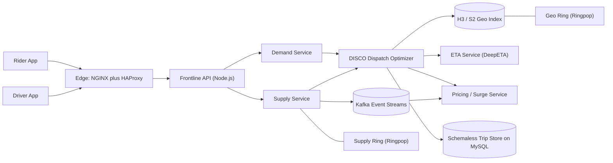
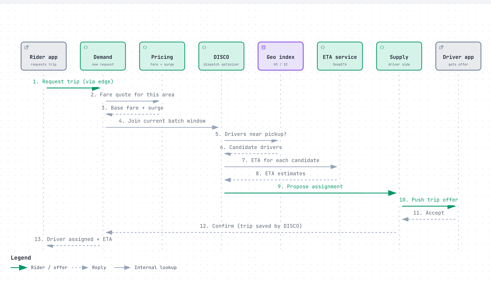
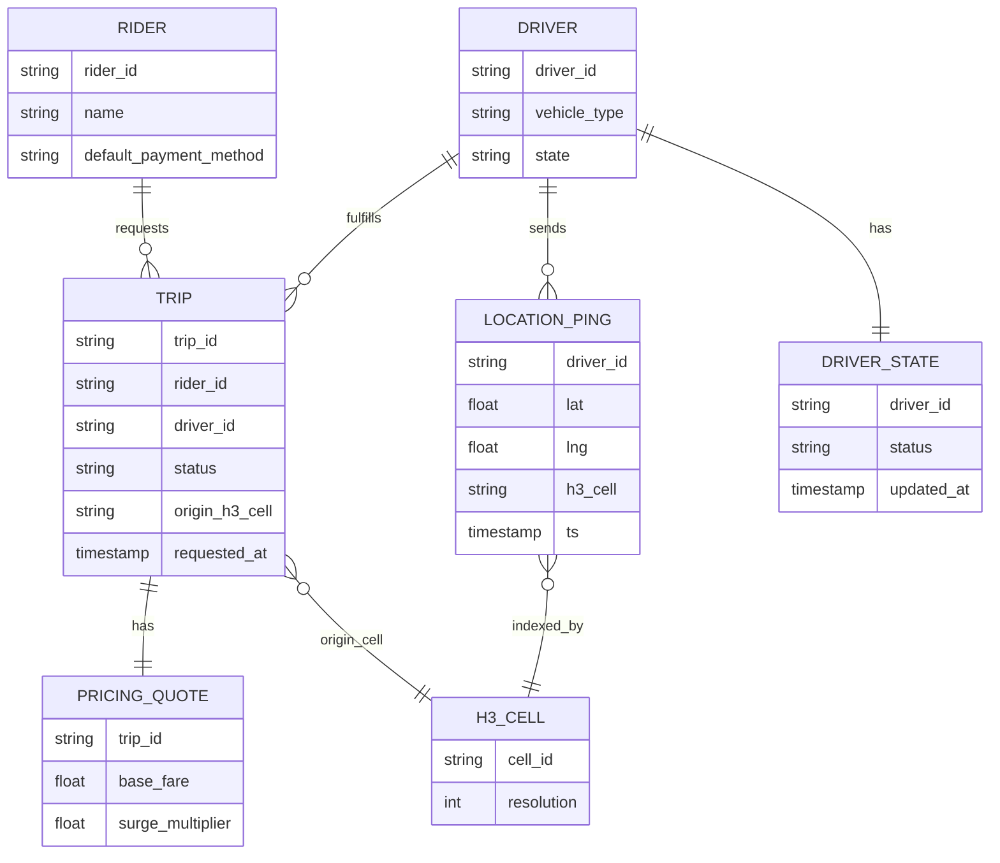
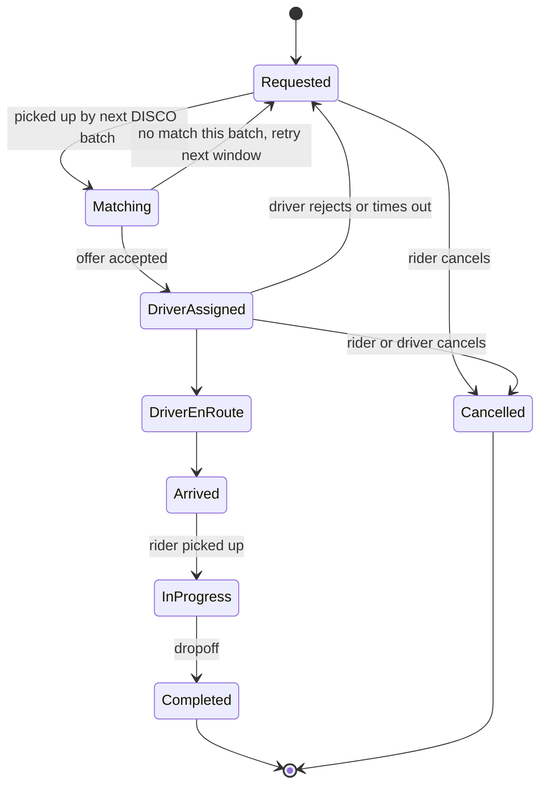
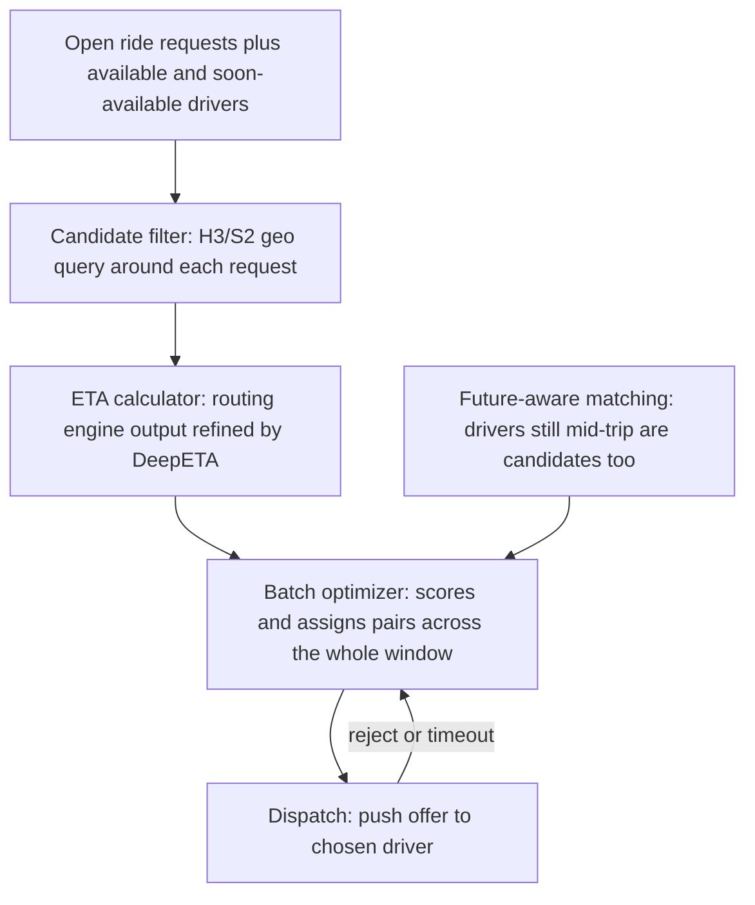
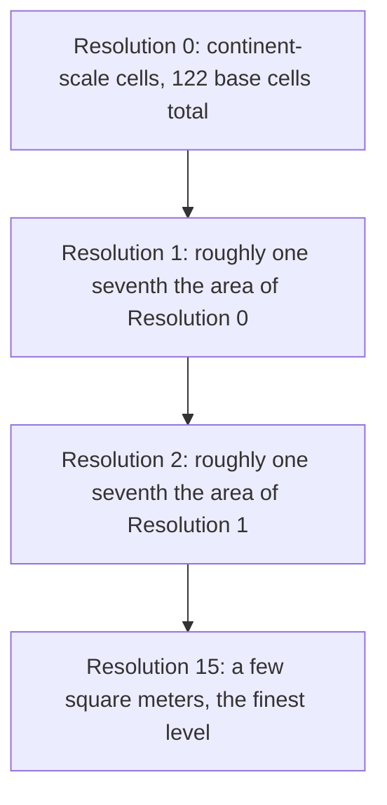
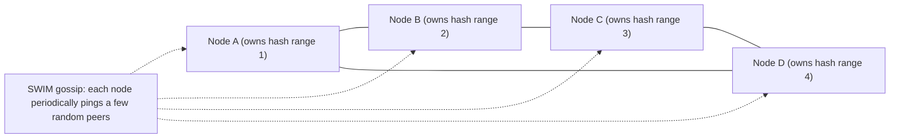

# Uber: how it matches a rider to a driver in real time

> **In 60 seconds:** Uber's core problem is a two-sided real-time marketplace where both sides move:
> riders and drivers both come, go, and change location every few seconds, and a match has to be found
> in seconds, not minutes. Four pieces make that possible. **H3** is a hexagonal grid that turns
> "which drivers are near this rider" into a fast lookup instead of expensive geometry. **DISCO** is
> the dispatch layer that batches nearby requests and drivers every few seconds and solves them as one
> optimization problem — including drivers still mid-trip who are about to free up — instead of
> greedily grabbing the closest idle car. **Schemaless** is an in-house datastore built on plain MySQL
> that gave Uber linear scalability when off-the-shelf databases couldn't be trusted to keep up.
> **Ringpop** is a library that lets a fleet of stateless-looking Node.js processes act like one big,
> self-healing, sharded cluster, so "who owns this driver's live location" can live in memory instead
> of round-tripping to a database. Around this core sit a location-ingestion pipeline that fuses GPS
> with other sensors, a pricing service that reads local supply/demand to set surge multipliers, and a
> machine-learned ETA model (DeepETA) that answers "how long until pickup" in a few milliseconds. The
> whole thing has been rebuilt at least twice as scale grew by orders of magnitude — most recently
> trading the original NoSQL/Ringpop fulfillment stack for Google Cloud Spanner.

**Last reviewed:** September 2026 · **Difficulty:** Advanced · **Reading time:** ~40 min

## Table of contents

- [Before you read: design it yourself](#before-you-read-design-it-yourself)
- [The problem](#the-problem)
- [Scale](#scale)
- [Back-of-the-envelope math](#back-of-the-envelope-math)
- [Requirements](#requirements)
- [How it evolved](#how-it-evolved)
- [High-level design](#high-level-design)
- [Low-level design](#low-level-design)
- [Deep dives](#deep-dives)
- [What happens when things break](#what-happens-when-things-break)
- [Key design decisions](#key-design-decisions)
- [Interview takeaways](#interview-takeaways)
- [Glossary](#glossary)
- [Sources](#sources)

## Before you read: design it yourself

Try each question for 5 minutes on your own before reading the "how" — that's the exercise, not a formality.

### Q1. How would you store and quickly find nearby drivers, given both riders and drivers keep moving?

<details><summary>Hint</summary>

Think about tiling the map into cells instead of comparing every driver's raw lat/lng to the rider's.

</details>

<details><summary>How Uber does it</summary>

Every GPS point gets turned into a cell ID from **H3**, a hexagonal grid with 16 zoom levels ("resolutions"), so "who's near this rider" becomes a lookup of one cell plus a ring of neighbors instead of geometry over raw coordinates. Hexagons beat the square-ish cells of Uber's earlier system (Google's S2) because every neighbor of a hexagon is the same distance away — no edge-vs-corner special-casing when a search expands outward ring by ring. Cost: you can't tile a sphere with only hexagons, so 12 of the grid's 122 base cells are unavoidably pentagons and need to be handled as an edge case.

Deep dive: [H3](#h3-the-hexagonal-geo-index)

</details>

### Q2. Now you can find nearby drivers — how do you match them to riders fairly, not just "closest driver wins"?

<details><summary>Hint</summary>

Consider waiting a few seconds and solving many requests at once instead of matching the instant one rider taps request.

</details>

<details><summary>How Uber does it</summary>

**DISCO**, Uber's dispatch optimizer, batches a short window of open requests together with available *and soon-to-be-available* drivers (someone about to drop off their current rider), scores every candidate with an ETA model, and solves the whole batch as one assignment problem. This beats greedily grabbing the nearest idle driver, because the driver technically closest to you might be the better match for someone two blocks away. Trade-off: no rider gets an instant answer — there's a deliberate few-second window before an assignment is made.

Deep dive: [DISCO](#disco-the-dispatch-optimizer)

</details>

### Q3. Every driver's phone pings its location every few seconds — how do you handle roughly a million writes a second without the index falling behind?

<details><summary>Hint</summary>

Ask what you're willing to give up: perfectly fresh data everywhere, or the ability to keep writing during a partial failure.

</details>

<details><summary>How Uber does it</summary>

The real-time layer (Supply service, geo-index) runs on **Ringpop**, a library that turns a fleet of Node.js processes into one self-healing, consistently-hashed cluster via gossip, so "who owns this driver's location right now" lives in memory instead of round-tripping to a database on every ping. Ringpop is deliberately **AP, not CP** (available over strictly consistent, in CAP-theorem terms) — a slightly stale driver position is fine, but refusing to accept a location update is not. That's the opposite trade-off from the actual trip/billing record, which needs strong guarantees and lives in Schemaless instead.

Deep dive: [Ringpop](#ringpop-the-self-organizing-cluster)

</details>

### Q4. What happens if the entire datacenter running your trip disappears while you're mid-ride?

<details><summary>Hint</summary>

Think about where trip state could live besides "a database inside that datacenter."

</details>

<details><summary>How Uber does it</summary>

Uber periodically pushes an encrypted "state digest" down to the driver's phone during a trip. When a datacenter failover happens, the next location ping lands somewhere with no record of the trip; the dispatch system detects the gap, asks the phone for its last digest, and reconstructs enough state to keep the trip going as if nothing happened. This only works because the system already treats the driver's phone as a legitimate backup state store — a direct consequence of favoring availability over waiting on cross-datacenter database replication.

Deep dive: [What happens when things break](#what-happens-when-things-break)

</details>

## The problem

You tap **Request** in Lagos at 6pm on a Friday. Somewhere else in the same city, a few thousand
other people tap the same button within the same few seconds — after work, before a concert, right
as a downpour starts. Your phone's GPS chip hands over a latitude/longitude that's probably off by
tens of meters because you're standing between two buildings. In the next few seconds, before you
get bored and switch to a competing app, the backend has to:

1. Turn your fuzzy GPS point into something it can search on top of — "which drivers are near this
   exact spot" can't be answered by scanning every driver in the city and computing distance to each
   one, not at this request rate.
2. Find every driver near you who is actually available (or about to be — someone three minutes from
   dropping off their current rider) and estimate, in milliseconds, how long each one would take to
   reach you.
3. Not decide your match in isolation. The driver who's technically closest to you might be the
   better match for someone two blocks away instead, once every other open request in the city is
   considered at the same time.
4. Push an offer to a driver's phone, handle that driver ignoring or declining it, and try again —
   without you ever knowing a rejection happened.
5. Record the resulting trip somewhere durable enough that it survives a machine crash, because it's
   about to become a legal and financial record (fare, tax, driver payout).
6. Do all of the above the same way whether "Lagos at 6pm Friday" means 40 concurrent requests in a
   small city or 40,000 in a metro area — and keep working if the entire datacenter handling your
   region falls over mid-trip.

This page answers three hard questions: how do you index a constantly moving set of millions of GPS
points so "what's nearby" is a cheap lookup instead of a geometry problem; how do you match
thousands of riders and drivers at once without either being too greedy (locally fast, globally bad)
or too slow (a good global match that arrives after the rider gave up); and what actually happens,
mechanically, when the datacenter running your trip disappears while you're still in the car.

## Scale

| Metric | Number | Source |
|---|---|---|
| Trips per day | >40 million (Q4 2025) | [14](#sources) |
| Monthly active platform consumers | >200 million (Q4 2025) | [14](#sources) |
| Gross bookings | $54.1 billion (Q4 2025 quarter) | [14](#sources) |
| Geofence lookup service peak load | 170,000 queries/sec across 40 machines at 35% CPU, p95 <5ms, p99 <50ms, 99.99% uptime since inception (New Year's Eve 2015) | [6](#sources) |
| Target location-update write throughput | ~1 million writes/sec design goal, drivers reporting position roughly every 4 seconds, geo-index running on "hundreds of processes" (2015 rearchitecture) | [11](#sources)[12](#sources) |
| Trip volume coordinated via Ringpop | "Many millions of trips per day" across six continents (2016) | [4](#sources) |
| Schemaless shard count | 4,096 shards, production since October 2014 | [2](#sources)[3](#sources) |
| Fulfillment Platform scale | >1 million concurrent users, billions of trips/year across 10,000+ cities, billions of database transactions/day, 500+ developers building 120+ fulfillment flows on top of it, built by 100+ engineers across 30+ teams over ~2 years (2021) | [7](#sources) |
| Edge API surface | 600+ stateless "Frontline" HTTP endpoints (2016) | [10](#sources) |
| H3 resolution levels | 16 resolutions (0 coarsest to 15 finest), 122 base cells, open-sourced 2018 | [1](#sources) |

Interpreting these: 40 million trips/day averages to roughly 460 trips *started* every second
globally, but demand isn't smooth — it clusters into rush hours, weekend nights, and events, which
is exactly why a single geofence lookup service alone needed to survive 170,000 queries/sec on New
Year's Eve at only 35% CPU headroom. The million-writes/sec target for location updates is a design
goal for the whole fleet pinging in every ~4 seconds, not a number Uber says it always sustains —
but it tells you the geo-index was built to be write-heavy, not read-heavy, which shapes almost
every other decision downstream of it.

## Back-of-the-envelope math

This is the rough arithmetic engineers sketch on a whiteboard to size a system before writing any code — good enough to catch a design that's off by orders of magnitude, not meant to be exact. Inputs marked [n] are pulled straight from the [Scale](#scale) table above and match it exactly; everything else is an explicit **Assumption**, never presented as fact.

### 1. Trip-request rate: average vs. peak

**Question:** Given >40 million trips/day [14](#sources), what's the average trip-request rate, and what does that imply for peak load on DISCO's batch window?

**Inputs:**
- Trips per day: 40,000,000 [14](#sources)
- 1 day = 86,400 s (rule of thumb)
- Assumption: peak load runs ~3x the daily average (rush hours, weekend nights, and events cluster
  demand, per this page's own [Scale](#scale) interpretation)

**Math:**
```text
average rate = 40,000,000 trips / 86,400 s
             = 462.96 trips/sec  (~460/sec)

peak rate = 460 trips/sec × 3
          = 1,389 trips/sec  (~1,400/sec)
```

**Answer:** ~460 trips/sec average, ~1,400/sec at peak.

**What it tells you:** DISCO's batch window has to clear 1,000+ open requests/sec at peak, not the ~460/sec average — a big part of why matching is batched and optimized as a group instead of handled one request at a time. See [DISCO: the dispatch optimizer](#disco-the-dispatch-optimizer).

### 2. How many concurrent drivers would saturate the location-write design target

**Question:** The geo-index was built for a ~1 million writes/sec target with drivers pinging every
~4 seconds [11](#sources)[12](#sources) — how many concurrent drivers would generate that load?

**Inputs:**
- Target write throughput: ~1,000,000 writes/sec (design goal) [11](#sources)[12](#sources)
- Ping interval: ~4 sec/driver [11](#sources)[12](#sources)

**Math:**
```text
writes/sec per driver = 1 ping / 4 sec
                       = 0.25 writes/sec/driver

drivers needed = 1,000,000 writes/sec ÷ 0.25 writes/sec/driver
               = 4,000,000 concurrently-pinging drivers
```

**Answer:** ~4 million drivers pinging at once would be needed to saturate the design target.

**What it tells you:** Uber doesn't publish a live concurrent-driver count, so this is a design ceiling, not today's load — the geo-index / [Ringpop](#ringpop-the-self-organizing-cluster) layer was deliberately over-built with headroom above any plausible near-term fleet size.

### 3. Storage cost if location pings were persisted instead of kept in memory

**Question:** If the ~1 million writes/sec location-ping stream were durably stored instead of living only in Ringpop's in-memory ring, how much raw storage would one day generate?

**Inputs:**
- Target write throughput: ~1,000,000 writes/sec [11](#sources)[12](#sources)
- 1 day = 86,400 s (rule of thumb)
- Assumption: ~100 bytes per ping record (driver ID + lat/lng + H3 cell ID + timestamp, compactly
  encoded)

**Math:**
```text
writes/day = 1,000,000 writes/sec × 86,400 sec/day
           = 86,400,000,000 writes/day  (8.64 × 10^10)

storage/day = 86,400,000,000 writes × 100 bytes
            = 8,640,000,000,000 bytes
            = 8.64 TB/day  (1 TB ≈ 10^12 bytes)
```

**Answer:** ~8.6 TB/day, for one un-replicated copy of raw pings alone.

**What it tells you:** a modest number by database standards — the real reason this data lives in
memory on [Ringpop](#ringpop-the-self-organizing-cluster) isn't storage volume, it's freshness:
"database storage would be useless because of how fleeting the location data is."

### 4. Headroom in the geofence lookup service at its published NYE peak

**Question:** The geofence service hit 170,000 queries/sec across 40 machines at only 35% CPU on NYE 2015 [6](#sources) — how much more load could that same fleet absorb before CPU saturates?

**Inputs:**
- Geofence peak: 170,000 queries/sec across 40 machines at 35% CPU [6](#sources)
- Assumption: CPU-to-throughput scaling is roughly linear up to 100% (a simplification — real
  systems usually hit a different bottleneck, like lock contention or network, before CPU actually
  saturates)

**Math:**
```text
QPS/machine at 35% CPU = 170,000 / 40
                        = 4,250 QPS/machine

QPS/machine at 100% CPU (linear) = 4,250 / 0.35
                                   = 12,142.9 QPS/machine

fleet capacity at 100% CPU = 12,142.9 × 40
                            = 485,714 QPS

extra headroom over the NYE peak = 485,714 - 170,000
                                   = 315,714 QPS  (~2.9x the observed peak)
```

**Answer:** ~486,000 QPS of theoretical fleet capacity — roughly 2.9x above the actual NYE peak.

**What it tells you:** 35% CPU at the single most extreme demand spike Uber has published numbers for was a deliberate design margin, not luck. See [What happens when things break](#what-happens-when-things-break).

**Rules of thumb used:**

| Convention | Value used here |
|---|---|
| 1 day | ≈ 86,400 s (≈10^5 s for quick mental math) |
| Peak vs. average | peak load ≈ 2-3x the daily average for systems with rush-hour/event clustering |
| "~X" design targets | treated as exactly X for arithmetic, since the page states it as a goal, not a measurement |
| CPU-to-throughput scaling | assumed roughly linear when projecting extra headroom (a simplification; real systems usually hit a different bottleneck first) |
| Storage unit | 1 TB ≈ 10^12 bytes (decimal, not binary TiB) |

## Requirements

**Functional:**
- Rider requests a trip (pickup + destination); the system finds a nearby available driver and
  confirms a match.
- Driver sees and can accept or decline incoming trip offers.
- Both parties see the other's live location during pickup and the trip.
- The system quotes a fare/ETA before the trip and adjusts pricing when local demand outstrips
  supply (surge).
- The same core marketplace (matching, pricing, fulfillment) serves multiple products — rides,
  pooled rides, and other "go anywhere, get anything" verticals — not just one line of business
  [7](#sources).
- If a driver rejects or times out on an offer, the system re-dispatches without the rider
  re-requesting.
- A driver who is already mid-trip but about to become free can still be offered a new request
  before they've dropped off their current rider [12](#sources).

**Non-functional:**
- Dispatch decisions in seconds, not minutes; ETA predictions in single-digit milliseconds since
  they sit on the request hot path, evaluated for every candidate driver, not just the winner
  [8](#sources). This matters because DISCO can't afford to run a slow ETA model once per candidate
  when there might be dozens of candidates per open request.
- Location pings need very high sustained write throughput (millions/sec design target) with low
  per-write latency [11](#sources)[12](#sources). Every driver's phone is effectively a sensor
  streaming continuously; the write path has to absorb that without falling behind, or "nearby"
  becomes "nearby a few seconds ago."
- The real-time layer favors availability over strict consistency — a slightly stale view of "which
  drivers are free" is fine; losing a driver's location feed entirely is not [12](#sources). A
  stale-by-one-second driver position still produces a usable match; no position at all produces no
  match.
- Durable, audit-safe storage for the actual trip/billing record, which does need strong guarantees
  around not losing or duplicating writes [2](#sources). A trip record is a financial and legal
  artifact (fare, tax, driver payout); the ephemeral location stream is not.
- Survive the loss of an entire datacenter without dropping active trips [12](#sources). A driver
  mid-trip when a datacenter dies cannot be told to start over — the fix has to be transparent to
  both sides.
- Horizontal scalability: adding machines should add capacity roughly linearly, since ride volume
  grows city by city and country by country, not all at once [2](#sources).
- Extend to new fulfillment types (food, packages, freight) without rebuilding the matching engine
  per vertical, since the business model itself was designed to generalize past rides [7](#sources).

## How it evolved

| Era | System | What broke / why it changed | Source |
|---|---|---|---|
| Early Uber (pre-2014) | A young engineering org with two main languages — Node.js for the Marketplace team, Python for most everything else — growing into a single monolithic architecture | Fine for early scale, but "with hundreds of microservices that depend on each other" later, the monolith couldn't hold; also outgrew a single Postgres instance for trip storage | [9](#sources) |
| 2014 | **rt-demand / rt-supply**: city-sharded dispatch. A Trip entity (rt-demand) and a Supply entity (rt-supply), coordinated with Cassandra + Redis + Ringpop, cities sharded across pods, consistency achieved only "best-effort" | Baked "moving a person" assumptions deep into the data model (one rider per vehicle — incompatible with pooled rides); matched only against *currently idle* supply, never a driver about to free up; city sharding created uneven load across markets as Uber expanded city by city | [7](#sources)[12](#sources) |
| Mid-2014 | **Project Mezzanine**: migrated storage off the single Postgres instance that was about to run out of room for trip data | Growth threatened to exhaust Postgres capacity by year's end | [2](#sources)[9](#sources) |
| October 2014 | **Schemaless** goes to production: an in-house datastore on sharded MySQL | None of the evaluated alternatives (Cassandra, Riak, MongoDB) cleared Uber's bar on all five requirements at once: linear scalability, write availability, change notifications, secondary indexes, and — critically — operational trust at Uber's own hands | [2](#sources)[3](#sources) |
| 2015 | Real-time market platform rearchitected: Supply and Demand abstracted into standalone services, **DISCO** introduced for dispatch, Google's **S2** library used for the geo-index (level-12 cells), **Ringpop** used to shard the geo-index and Supply service across processes, driver phones used as a backup state store for datacenter failover | The 2014 system could only match currently-idle supply and couldn't plan ahead; a rewrite (not a patch) was needed to support planning into the future and considering mid-trip drivers as future candidates | [11](#sources)[12](#sources) |
| 2016 | Edge layer formalized: NGINX (TLS/auth) → HAProxy → 600+ stateless "Frontline" API endpoints in Node.js, in front of an already-large and fast-changing set of microservices | Hundreds of interdependent microservices made a single architecture diagram obsolete almost as soon as it was drawn; a stable public-facing edge was needed regardless of what churned behind it | [9](#sources)[10](#sources) |
| 2018 | **H3** open-sourced: hexagonal hierarchical spatial index for dispatch, surge pricing, and demand analysis (Uber's H3 post doesn't mention S2; "replacing S2" is inference) | Square cells have two different neighbor distances (edge vs. corner), which complicates uniform proximity math and ring-based "expand the search radius" logic at Uber's scale | [1](#sources) |
| ~2018 onward | Node.js/HTTP-JSON stack marked no longer Uber's recommended default; **DeepETA** (deep learning) begins replacing XGBoost gradient-boosted trees for ETA refinement | Training data and model size had outgrown what gradient-boosted ensembles could scale to, even after Uber upstreamed its own scaling improvements into XGBoost | [7](#sources)[8](#sources) |
| 2019–2021 | Legacy Fulfillment stack (rt-demand/rt-supply + Cassandra + Redis + Ringpop) hits an engineering-debt wall: 400+ engineers touching a system with no clear extension model, redundant dual-cluster writes for availability, Ringpop's peer-to-peer gossip capping how far city-pod sharding could scale | Consistency was only best-effort by design, coordinating writes across Trip and Supply entities needed ad hoc RPC choreography, and the system had no first-class way to add new fulfillment types | [7](#sources) |
| 2021 | **Fulfillment Platform** rewrite ships: Google Cloud Spanner (NewSQL) replaces Cassandra/Redis, statecharts model each entity's lifecycle, a Business Transaction Coordinator handles cross-entity transactions, and a custom LATE (Latent Asynchronous Task Execution) component fills the gap left by Spanner not having built-in change-data-capture | Built by 100+ engineers across 30+ teams over about two years, after six months auditing every product and gathering 200+ pages of requirements, to support >1M concurrent users and 10,000+ cities on one platform instead of one-off per-vertical systems | [7](#sources) |
| 2025 | >40M trips/day, >200M monthly active consumers, $54.1B gross bookings in a single quarter | Scale keeps compounding on top of the 2021 rewrite | [14](#sources) |

## High-level design



Walking through it:

1. **Rider/Driver apps → Edge.** Both apps talk to Uber's edge layer: NGINX terminates SSL and does
   auth, HAProxy load-balances into the "Frontline API" — historically over 600 stateless HTTP
   endpoints running on Node.js that stitch together backend calls [10](#sources).
2. **Frontline → Demand/Supply services.** These two services model "what the rider wants" and "what
   capacity exists" respectively — the rider's request (pickup, destination, product type) is
   Demand; each driver's vehicle type, availability, and state machine is Supply
   [11](#sources)[12](#sources).
3. **Demand + Supply → DISCO.** DISCO is the dispatch-optimization service that decides who gets
   matched with whom. It replaced an older city-sharded matching system that could only see
   currently-idle drivers; DISCO can plan into the future and treat a driver who's about to finish a
   trip as a valid candidate, not just idle ones [12](#sources).
4. **DISCO → Geo Index.** To ask "who's nearby," DISCO queries a geospatial index. Uber's 2015
   rearchitecture built this on Google's S2 library — dividing the Earth into cells, each with an
   int64 ID used as a shard/routing key, with Uber's dispatch service using level-12 cells (roughly
   3.3–6.4 km² depending on latitude) [11](#sources)[12](#sources). Uber later built and
   open-sourced its own hexagon-based system, **H3**, now the more commonly cited spatial index for
   dispatch, surge pricing, and demand analysis [1](#sources).
5. **DISCO → ETA Service (DeepETA).** For each candidate driver, DISCO needs an accurate
   time-to-pickup. This is served by a deep-learning model (DeepETA) that post-processes a routing
   engine's raw ETA and must answer in a few milliseconds, since it's Uber's highest-QPS ML model
   [8](#sources).
6. **DISCO → Pricing/Surge Service.** Pricing reads the same local supply/demand signal to decide
   whether — and how much — to surge a given area [1](#sources).
7. **Supply → Kafka → Geo Index / Pricing.** Trip data and rider/driver status stream through Kafka
   into the surge-pricing pipeline, which computes multipliers per hexagon area [13](#sources); Kafka
   also carries mobile-app and service events [9](#sources). (Kafka feeding the geo index is an
   illustrative assumption — the cited sources don't describe it.)
8. **DISCO → Schemaless.** Once a match is made, the trip record is written to Schemaless, Uber's
   in-house datastore built on sharded MySQL [2](#sources)[3](#sources).
9. **Ringpop rings.** Both the Supply service and the Geo Index are examples of services that use
   Ringpop internally: a library that turns a set of independent Node.js processes into one
   cooperating, self-healing, consistently-hashed cluster, so state (like "which process owns this
   driver's location") can live in memory instead of round-tripping to a database on every update
   [4](#sources)[11](#sources)[12](#sources).

## Low-level design

### Core flow: rider requests a trip, gets matched to a driver

<a href="https://alwintwk.github.io/big-tech-system-design/diagrams/companies-uber-ride-request.html">
  <picture>
    <source media="(prefers-color-scheme: dark)" srcset="../diagrams/companies-uber-ride-request.dark.png">
    
  </picture>
</a>

<sub>Click the diagram for the interactive version (zoom, dark mode, trace a path).</sub>

The key thing this diagram is trying to show: matching isn't a single request/response. DISCO
collects candidates from the geo index, scores them using ETA, and only then commits an assignment —
batching this against other open requests rather than matching one rider at a time
[12](#sources)[8](#sources). The reject/timeout branch matters as much as the happy path: a driver
declining never bounces back to the rider as an error, it just triggers another pass of the same
batch optimizer.

### Core data model



> Note: this is a simplified reference model. Uber's actual Schemaless trip storage is a generic
> append-only key/value system (row key + column name + ref key addressing an immutable "cell" of
> JSON) rather than a fixed relational schema like the one drawn above [2](#sources)[3](#sources); the
> ER diagram is meant to show the *logical* entities, not Schemaless's literal physical layout.

### Trip and driver lifecycle



> Note: simplified reference design. Uber's Fulfillment Platform confirms that trip/driver lifecycles
> are modeled as **statecharts** — finite state machines where a state can have its own nested
> sub-states [7](#sources) — but the exact state names and transitions aren't public. The states above
> are a reasonable reconstruction of the lifecycle implied by the functional requirements (request,
> match, reject/retry, pickup, trip, completion, cancellation), not a literal Uber diagram.

### Signature component: DISCO's dispatch pipeline



> Note on sourcing: the specific breakdown into "Candidate Filter / ETA Calculator / Batch Optimizer /
> Dispatch" stages comes from a third-party system-design write-up, not an Uber engineering blog post
> naming these exact stages [15](#sources). What *is* confirmed, via a third-party summary of Matt
> Ranney's 2015 QCon London talk, is the underlying behavior: DISCO does forward-looking, batched
> optimization rather than nearest-driver matching, and it explicitly considers a driver who is
> "currently transporting a rider" as a possible match for a different request if that driver would be
> a better fit than an idle one [12](#sources). Uber's own public sources don't name internal pipeline
> stages or confirm a specific assignment algorithm (e.g. the Hungarian algorithm) — treat the stage
> names in this diagram as an illustrative reconstruction, not a literal Uber architecture diagram.

## Deep dives

### H3: the hexagonal geo-index

**What it is.** H3 is Uber's open-source system for dividing the Earth's surface into hexagonal
cells at 16 zoom levels ("resolutions"), so any GPS point can be converted into a compact cell ID
and compared cheaply against neighboring cells [1](#sources).

**The problem it solved.** Before H3, Uber's options for "what area is this point in" were postal
codes, hand-drawn city/neighborhood zones [1](#sources), or Google's S2 library [12](#sources). Postal codes have irregular
shapes that change for reasons unrelated to ride-hailing. Hand-drawn zones need constant manual
upkeep and arbitrarily define their own edges. S2's cells (derived from projecting a cube onto a
sphere) are square-like [12](#sources), and a square has two different neighbor distances — edge-adjacent and
corner-adjacent — which complicates any "how many rings of neighbors do I need to check" calculation
used across dispatch, surge pricing, and demand analysis [1](#sources).

**How it works internally.** H3 projects a gnomonic (straight-line-preserving) grid onto the 20
faces of an icosahedron, producing 122 base cells — 12 of which are unavoidably pentagons, since you
cannot tile a sphere with hexagons alone. Those 12 pentagons are deliberately placed over ocean,
using Buckminster Fuller's icosahedron orientation, to minimize how often real dispatch data lands
on one [1](#sources). Each of the 16 resolution levels subdivides a parent cell into child cells at
roughly one-seventh the area of the parent:



Because every neighbor of a hexagon is the same distance from its center, code that asks "check one
ring of neighbors, then two, then three" behaves uniformly everywhere — no special-casing for
edge-vs-corner neighbors the way a square grid needs [1](#sources).

> **Why this matters:** almost every "find things near this point" system needs a tiling scheme, and
> the tiling's neighbor geometry directly determines how much special-case logic your search/ranking
> code needs. Choosing hexagons over squares moved that complexity out of application code and into
> the index itself.

**What it costs.** The subdivision isn't perfectly clean: a child cell is only *approximately*
contained within its parent, so truncating a fine-resolution cell ID to find its coarse-resolution
ancestor introduces a small, fixed amount of shape distortion [1](#sources). The 12 pentagon cells
also behave differently from hexagon cells (fewer neighbors), so any code walking "rings" of cells
has to handle them as an edge case rather than assuming every cell has 6 neighbors.

### DISCO: the dispatch optimizer

**What it is.** DISCO is Uber's name (used in a third-party summary of an Uber-given talk, not on
Uber's own blog in those exact words [12](#sources)) for the service that decides which driver is
offered which trip request.

**The problem it solved.** Uber's original 2014 dispatch system was sharded by city and matched a
request only against drivers who were *currently* idle, right now, in that city's shard. That baked
in two problems as Uber grew: it couldn't consider a driver who was about to finish a trip nearby (a
strictly better match than a farther idle driver), and city sharding created uneven load — a system
tuned for one city's request pattern didn't necessarily hold up in a much bigger one
[7](#sources)[12](#sources).

**How it works internally.** Instead of matching the instant a request arrives, DISCO collects a
window of open requests and candidate drivers (idle and soon-to-be-idle) and solves them together,
described as being able to "plan into the future" and use information "as it becomes available"
rather than only reacting to the current instant [12](#sources). A simplified view of what one batch
pass does:

```
for each open request in the current window:
    candidates = geo_index.nearby(request.pickup_cell, expanding_rings=True)
    for driver in candidates:
        eta = eta_service.predict(driver, request)
        score = combine(eta, driver_type_match, request.priority)
    best_pairing = optimizer.assign(all_requests, all_candidates, scores)
push(best_pairing)
```

> Note: this pseudocode is an illustrative reconstruction of the *shape* of the problem (a batched
> assignment problem scored on ETA), not a literal description of DISCO's code or its specific
> optimization algorithm — Uber's own public sources describe the goal (global, forward-looking
> optimization) without publishing the algorithm's internals [12](#sources).

> **Why this matters:** the general pattern — "don't commit to the first acceptable answer, wait a
> short window and solve for the group" — shows up anywhere a marketplace matches many-to-many in real
> time (ride-hailing, ad auctions, kitchen/courier assignment). The trade-off is always the same: a
> few seconds of deliberate delay buys a better outcome for the group, at the cost of a slightly
> slower response for any one individual.

**What it costs.** Batching means no single rider gets an instant answer — there's a deliberate
window before assignment. It also means the system needs a live, fast geo-index and a low-latency
ETA model just to *evaluate* candidates before it can even start optimizing, which is why DISCO
leans so heavily on H3/S2 and DeepETA rather than doing this work itself.

### The location and ETA pipeline

**What it is.** Two connected pieces: a location pipeline that turns noisy raw GPS into a usable
position, and DeepETA, a deep-learning model that turns a routing engine's raw time estimate into an
accurate one.

**The problem it solved.** Plain GPS in a city can be off by 50 meters or more, because tall
buildings block or bounce satellite signal (multipath reflection) [5](#sources). A driver pin that's
50 meters off can put someone on the wrong side of a highway. Separately, once you know where a
driver roughly is, "how long until they arrive" from a routing engine's raw estimate is often wrong
in ways that are systematically correctable — but Uber's older correction model, gradient-boosted
decision trees (XGBoost), had scaled about as far as tree ensembles reasonably could, even after
Uber contributed its own upstream scaling improvements to XGBoost [8](#sources).

**How it works internally.**
- *Location:* a particle filter keeps thousands of hypothesized driver locations at once, each
  weighted by how likely it is given the latest sensor readings, and updates those weights over time
  using a motion model. A technique called probabilistic shadow matching ray-traces against 3D
  building maps combined with the phone's raw GNSS signal-to-noise ratio to estimate whether a given
  hypothesis is behind a building (blocked) or in the open (clear); this is fused with WiFi-based
  positioning, all inside the same particle filter, and served from stateful servers using sticky
  sessions so each user's particle-filter state and nearby 3D map tiles stay on one machine
  [5](#sources).
- *ETA:* DeepETA is an encoder-decoder transformer that treats input features (pickup cell, time of
  day, driver history, etc.) like tokens and computes a K×K self-attention matrix across them to
  learn feature interactions, but swaps standard quadratic-cost attention for a *linear* transformer
  (a kernel-trick reformulation that cuts the K×K cost down to a K×d² cost) to hit its latency
  budget. Continuous features are bucketed (quantile-based discretization) before being embedded,
  and locations are hashed into multiple overlapping resolution grids rather than looked up exactly
  — both choices trade a small amount of precision for O(1) lookups instead of O(log N) or worse
  [8](#sources).

> **Why this matters:** DeepETA's whole architecture is downstream of one non-negotiable constraint —
> it's Uber's highest-QPS ML model and has to answer in a few milliseconds [8](#sources). Every design
> choice (discretize instead of using raw floats, hash instead of exact-index, linear attention
> instead of standard attention, a shallow bias-adjustment decoder instead of a full multi-task head)
> is a latency-vs-accuracy trade made in that direction. That's a reusable interview pattern: when a
> model sits on a synchronous hot path, its architecture is chosen by the latency budget first and
> accuracy second.

**What it costs.** Discretizing continuous inputs throws away some precision. Multi-hash geospatial
embeddings use more memory than a single hash table, specifically to avoid collision-driven accuracy
loss. The particle filter's sticky-session design means a user's location-tracking state lives on
one specific server, so that server becoming unavailable loses the in-flight particle history for
the drivers it was tracking (not the location itself, just the refined estimate's history).

### Schemaless: the trip datastore

**What it is.** Schemaless is Uber's in-house datastore, built directly on plain MySQL, that stores
data as an append-only sparse "three-dimensional hash map" of row key, column name, and ref key,
rather than forcing every row into a fixed table schema [2](#sources).

**The problem it solved.** By early 2014, Uber's single Postgres instance for trip data was on track
to run out of capacity by year's end [2](#sources). Cassandra, Riak, and MongoDB were all evaluated,
but none cleared all five bars Uber set: linear scalability by adding servers, write availability
during failures, change notifications for downstream consumers, secondary indexes, and — the
deciding factor — enough in-house operational experience to trust it with mission-critical trip data
[2](#sources).

**How it works internally.** Each unit of data is a "cell": a row key (UUID), a column name (an
application-defined bucket, e.g. `BASE`, `STATUS`, `FARE_ADJUSTMENTS`), and a ref key (an integer
version — cells are immutable, so a new ref key is a new version, never an edit in place). Splitting
a trip's data into separate columns like this means writes to unrelated data (say, driver feedback
vs. a fare adjustment) never race each other [2](#sources).

```
schemaless.write(
  row_key = trip_uuid,
  column  = "STATUS",
  ref_key = next_version,
  body    = {"state": "in_progress", "ts": now}
)
```

Physically, data is split into a fixed 4,096 shards, each shard is its own MySQL database replicated
to a master plus two minions spread across multiple datacenters, writes go to the master, and reads
default to the master (so clients see their own writes) but can be configured to hit a minion, which
lags by asynchronous (typically sub-second) replication
[2](#sources)[3](#sources). Downstream services can register "triggers" that fire asynchronously
when a cell changes — effectively an event bus built into the datastore itself [2](#sources).
Secondary indexes are maintained per-shard and are eventually consistent, usually with under 20ms of
lag, rather than being kept transactionally in sync with the write [2](#sources).

**What it costs.** Writes are still funneled through a single master per shard — good for giving
triggers a total order to rely on, but it's a bottleneck by construction. If a master fails, writes
get buffered elsewhere for availability and reads may briefly return stale data from a minion until
failover completes [2](#sources)[3](#sources). And the "shard field" used to route a row to a shard
is expected to be immutable — you can't cheaply move a row between shards after the fact
[2](#sources).

### Ringpop: the self-organizing cluster

**What it is.** Ringpop is an open-source library that lets a set of independent application
processes act as one cooperating, sharded, self-healing cluster, without a separate coordination
service [4](#sources).

**The problem it solved.** Uber's Geospatial/Supply services track constantly-changing, short-lived
data (a driver's current location, a trip's live state) where "database storage would be useless
because of how fleeting the location data is" [4](#sources) — by the time you wrote and read it back
from a database, the data would already be stale. That data needs to live in memory, but a fleet of
stateless-looking processes still needs a way to agree on which process owns which piece of that
in-memory state, and to notice quickly when a process dies.

**How it works internally.** Two mechanisms working together:
- **Membership**, via a SWIM-variant gossip protocol over TCP: each node periodically pings a few
  random peers, and the cluster computes shared "membership" and "ring" checksums so every node can
  detect drift; nodes that go down are retained in the member list (marked down) rather than
  silently forgotten [4](#sources).
- **Consistent hashing**, using FarmHash as the hash function and a red-black tree to represent the
  ring, with a uniform number of virtual replica points per physical node, so that when a node joins
  or leaves, only the data adjacent to it on the ring needs to move — not the whole dataset
  [4](#sources).



Requests for a piece of data land on whichever node the client happened to hit; Ringpop's
"handle-or-forward" pattern, running over Uber's TChannel RPC transport, transparently forwards the
request to whichever node actually owns it, so callers never need to know the hashing scheme
themselves [4](#sources).

> **Why this matters:** this is the general pattern for "stateful behavior without a database on every
> request" — consistent hashing bounds how much data moves on membership change, and gossip bounds how
> much coordination traffic a failure detector needs, without a single control-plane service being a
> bottleneck or single point of failure.

**What it costs.** Ringpop is explicitly AP, not CP, in CAP-theorem terms — "trading consistency for
availability" [12](#sources); in practice that means views (e.g. membership during churn) can be
briefly stale. It's also peer-to-peer by nature, which is part of why Uber later hit a
scaling ceiling with it for the *durable*, transactional side of fulfillment and moved that part to
Google Cloud Spanner instead — Ringpop stayed better suited to fleeting, in-memory state than to
systems needing strong cross-entity consistency [7](#sources).

## What happens when things break

**A datacenter serving a region goes down mid-trip.** The dispatch system periodically pushes an
encrypted "state digest" down to driver phones during a trip. If a datacenter failover happens, the
next location update from that driver's phone reaches a datacenter that has no record of the trip;
the dispatch system detects the gap, asks the phone for its last state digest, and reconstructs
enough state to keep the trip going "like nothing happened," from the rider and driver's point of
view [12](#sources). This only works because the system already treats the driver's phone as a
legitimate, if backup, place to recover state — a direct consequence of designing the real-time
layer to favor availability over waiting on cross-datacenter database replication.

**A hot geo-cell** (a stadium letting out, a huge event in one small area). A large concentration of
location pings and lookups all landing on one cell means one Ringpop node — whichever owns that
cell's hash range — takes disproportionate load. Consistent hashing bounds *how much data* has to
move if that node needs to be rebalanced or replaced, but doesn't by itself prevent one node from
being hot in the moment; H3/S2's ring-based "expand outward one resolution/ring at a time" search
pattern at least means a hot cell's neighbors don't also need scanning unless supply in the hot cell
itself is exhausted [1](#sources)[4](#sources). The geofence service takes a related but different
approach to a similar problem — a read-heavy hot path — by keeping the entire index in memory behind
a read-write lock, with new index versions built off to the side and atomically swapped in, so heavy
concurrent reads never block on a rebuild [6](#sources).

**A demand spike like New Year's Eve.** This is the one scenario Uber has published hard numbers
for: on NYE 2015, the geofence lookup service alone handled a peak of 170,000 queries/second across
40 machines while staying at only 35% CPU utilization, with p95 latency under 5ms and p99 under 50ms
[6](#sources). That headroom wasn't luck — it came from a deliberately simple,
horizontally-shardable design (city-then-neighborhood geofence nesting, cutting a lookup from tens
of thousands of candidate polygons down to hundreds) rather than a more "correct" but heavier
spatial index like an R-tree [6](#sources). Surge pricing itself is also a break-prevention
mechanism, not just a business feature: by raising price when local demand outstrips supply, it
throttles demand and pulls in more supply for exactly the cells that would otherwise be overwhelmed
[13](#sources).

**A network partition between dispatch and location services.** Because Ringpop-based services are
explicitly AP rather than CP, a partition doesn't halt the system — nodes keep answering with
whatever membership and location view they currently have, even if it's briefly stale relative to
the other side of the partition — an inference from Ringpop being AP [12](#sources); Uber's sources
don't describe partition behavior directly. The alternative (blocking until the partition heals
and consistency is guaranteed) would mean the app simply stops working for anyone whose data crosses
the partition — worse, for a real-time marketplace, than occasionally matching against a driver's
few-seconds-old position.

**A driver rejects or times out on an offer.** This isn't treated as a failure at all — it's a
normal branch of the dispatch flow. The rider never sees an error; DISCO simply re-runs the batch
optimizer without that driver as a candidate and pushes a new offer, because batching already
assumes not every first offer will be accepted [12](#sources).

## Key design decisions

| Decision | Why | Trade-off |
|---|---|---|
| Hexagonal grid (H3) instead of squares/postal codes for the geo-index | Uniform neighbor distance simplifies proximity search and avoids postal-code shapes changing arbitrarily [1](#sources) | Can't tile a sphere with only hexagons — 12 pentagon cells are unavoidable and need special-casing [1](#sources) |
| Batch matching every few seconds instead of instant nearest-driver assignment | Optimizing many requests and drivers together (global optimization) gives better city-wide outcomes than greedy one-at-a-time matches, and lets mid-trip drivers be considered as future candidates [12](#sources) | Adds a small, deliberate delay to each individual match while the batch window fills |
| Built Schemaless in-house on plain MySQL rather than adopting Cassandra/Riak/MongoDB | None of the evaluated off-the-shelf stores met Uber's linear-scalability + write-availability + trigger needs, and the team lacked confidence it could operate an unfamiliar system at production scale for mission-critical trip data [2](#sources) | Uber now owns and maintains the sharding, replication, and failover logic itself instead of leaning on a vendor/community |
| Ringpop embeds sharding + membership inside each service process (via gossip + consistent hashing) instead of a separate coordination service | Lets stateful-feeling behavior (e.g., "who owns this driver's live location") run in memory without an extra network hop to a coordinator [4](#sources) | Trades strict consistency for availability (an AP system) — "trading consistency for availability" [12](#sources), so views can be briefly stale |
| Driver phones used as a backup state store during a datacenter failover | Cheap, always-available place to recover in-flight trip state without waiting on cross-datacenter database replication [12](#sources) | Adds protocol complexity (encrypted state digests pushed to phones) and depends on the driver's phone staying connected |
| Deep learning (DeepETA) replacing XGBoost for ETA prediction | Training data and model size had outgrown what gradient-boosted trees could scale to; a linear-attention transformer keeps inference within a few milliseconds while allowing far bigger models [8](#sources) | Materially more engineering complexity (custom low-latency transformer architecture) than a boosted-tree model |
| Geofence lookups served from an in-memory index with read-write locks and atomic index swaps | Needed sub-5ms p95 latency at ~170K QPS — too fast for a database round-trip per request [6](#sources) | The index is only as fresh as the last background rebuild, not strictly real-time |
| Rebuilding the Fulfillment Platform on Google Cloud Spanner (NewSQL) instead of continuing to scale Cassandra + Redis + Ringpop | The legacy stack's best-effort consistency and peer-to-peer sharding had become a source of engineering debt across 400+ engineers; Spanner gives external consistency and cross-shard transactions the old stack couldn't [7](#sources) | Spanner lacks built-in change-data-capture, so Uber had to build a custom component (LATE) just to get the trigger-like behavior Schemaless offered natively |

## Interview takeaways

- **Batch a real-time marketplace instead of matching greedily.** DISCO's core lesson: when you have
  many-to-many matching (riders/drivers, but also ad auctions, kitchen assignment, courier routing),
  collecting a short window of requests and solving them together usually beats committing to the
  first acceptable pair — the question it answers is "how do you match many things to many things in
  real time without being locally greedy?" [12](#sources)
- **Pick your tiling scheme by its neighbor geometry, not just "does it cover the map."** H3's whole
  justification for hexagons over squares is that every neighbor is equidistant — the question it
  answers is "how do I build a geo-index where 'search N rings outward' is simple code, not a pile
  of edge cases?" [1](#sources)
- **Split your consistency model by data lifetime, not by service.** The same platform runs an AP
  (Ringpop, eventually-consistent) system for driver locations and a strongly-consistent, durable
  system (Schemaless, later Spanner) for trip/billing records — the question it answers is "when do
  I need CP vs AP inside one product?" [2](#sources)[12](#sources)
- **Build your own datastore only when nothing on the market clears every one of your actual
  requirements.** Uber evaluated Cassandra, Riak, and MongoDB and built Schemaless instead — the
  question it answers is "when is buy-vs-build actually build?" (Answer: when the alternatives fail
  more than one hard requirement, not just "it would be nice to control it.") [2](#sources)
- **Consistent hashing + gossip lets you avoid a coordination service becoming the bottleneck.**
  Ringpop's design — the question it answers is "how do a bunch of stateless-looking processes act
  like one sharded cluster without a central lock service?" [4](#sources)
- **Put a backup state path outside your own datacenters for anything that must survive a regional
  outage.** Uber pushes encrypted state digests to driver phones specifically so a trip can recover
  without cross-DC database replication — the question it answers is "how do you survive losing an
  entire datacenter mid-transaction?" [12](#sources)
- **When a model sits on a synchronous, high-QPS hot path, let the latency budget choose the
  architecture.** DeepETA's discretized features, hashed embeddings, and linear attention all trade
  a bit of accuracy for a hard millisecond ceiling — the question it answers is "how do you fit a
  deep learning model into a few milliseconds of budget?" [8](#sources)
- **Architectures age out by order of magnitude, not by calendar time.** Uber rewrote its dispatch
  stack once (2014 → 2015) and its entire fulfillment stack again (2021) — the question it answers
  is "when do you rewrite a core system instead of patching it?" (Answer: when the *assumptions
  baked into the data model*, not just the code, no longer hold.) [7](#sources)[12](#sources)

## Glossary

New to these terms? The [concepts](../concepts/README.md) folder explains the core ideas in depth.

- **Marketplace (in Uber's sense):** the collection of backend services that match real-world supply
  (drivers) to real-world demand (riders) and handle pricing — the economic engine behind the app,
  not a literal storefront.
- **Dispatch:** the process of deciding which driver serves which rider request.
- **DISCO:** Uber's name for its dispatch-optimization service — the component that actually runs
  the matching logic between supply and demand [12](#sources).
- **Batch matching:** instead of matching one rider to one driver the instant the request comes in,
  the system waits a short window, collects many open requests and available drivers, and solves the
  assignment for all of them at once.
- **Global optimization:** picking the set of matches that's best for the whole batch (e.g., lowest
  total wait time), even if that means a specific rider isn't paired with the literal closest
  driver.
- **Hungarian algorithm:** a classic algorithm for solving an "assignment problem" — pairing up two
  groups (like riders and drivers) so the total cost (like total wait time) is as low as possible.
  Named for its origins in Hungarian mathematicians' work; not confirmed as what Uber actually uses.
- **[Geospatial index](../concepts/geo-indexing.md):** a way of organizing location data so "what's near this point" can be
  answered quickly instead of comparing every possible pair of coordinates.
- **H3:** Uber's open-source system for dividing the Earth's surface into hexagonal cells at
  multiple zoom levels, so any GPS point can be converted into a compact ID and compared cheaply to
  nearby cells [1](#sources).
- **S2 (Google S2 library):** an older geospatial indexing library (using square-ish cells derived
  from a cube projection) that Uber's original dispatch rearchitecture used before/alongside H3
  [11](#sources)[12](#sources).
- **Resolution (in H3):** how fine-grained the hexagon grid is; low resolution = huge hexagons
  covering a whole region, high resolution = tiny hexagons covering a few square meters
  [1](#sources).
- **Icosahedron / gnomonic projection:** a 20-sided 3D shape H3 projects the globe onto, face by
  face, so each face can be gridded with straight-line-preserving (gnomonic) math instead of
  distorting the whole sphere at once [1](#sources).
- **Geofence:** a human-drawn boundary on a map (e.g., "this polygon is the airport") used to decide
  things like product availability or special pricing rules in that zone [6](#sources).
- **Point-in-polygon:** the geometric question "is this coordinate inside this shape," the core
  operation a geofence lookup performs.
- **Schemaless:** Uber's in-house datastore built on top of plain MySQL, storing data as flexible
  JSON "cells" instead of forcing every row into a fixed table schema [2](#sources).
- **Cell (Schemaless sense):** the smallest unit of data in Schemaless — an immutable JSON blob
  identified by a row key, column name, and version ("ref key"); a different meaning of "cell" than
  an H3 hexagon [2](#sources)[3](#sources).
- **[Sharding](../concepts/sharding.md):** splitting one big database (or index) into smaller pieces by some key (like a hash
  of a row ID) so each machine only has to hold and serve part of the data.
- **[Master/minion replicas](../concepts/replication.md):** one copy of a shard designated the "master" that takes writes, with
  other copies ("minions") that replicate from it and can serve reads — a common pattern for scaling
  reads and surviving a single machine's failure.
- **[Consistent hashing](../concepts/consistent-hashing.md):** a way of assigning keys (or work) to machines using a hash so that when a
  machine is added or removed, only a small fraction of keys need to move, instead of reshuffling
  everything.
- **Gossip protocol (SWIM):** a way for machines in a cluster to spread "who's alive/who's dead"
  information peer-to-peer, by periodically pinging a few random other machines, rather than relying
  on one central health-checker.
- **Ringpop:** Uber's open-source library that combines a gossip protocol with consistent hashing so
  a set of ordinary application processes can act like one self-organizing, self-healing cluster
  [4](#sources).
- **FarmHash:** a fast, non-cryptographic hash function (from Google) that Ringpop uses to place
  nodes and keys on its consistent-hash ring [4](#sources).
- **TChannel:** an in-house RPC (remote procedure call — one machine asking another to run a
  function and return the result) protocol Uber built as a faster alternative to plain HTTP, with
  built-in request tracing [12](#sources).
- **Hyperbahn:** Uber's service-discovery layer (how one microservice finds the network address of
  another) built to work with TChannel [9](#sources).
- **[AP vs. CP (from the CAP theorem)](../concepts/cap-and-consistency.md):** a distributed system facing a network split has to choose
  between staying **A**vailable (keep answering, possibly with stale data) or staying **C**onsistent
  (only answer with guaranteed up-to-date data, even if that means refusing some requests).
  Ringpop-based services lean AP [12](#sources).
- **[Kafka](../concepts/message-queues-and-logs.md):** a distributed log/message queue — a durable, ordered stream that many producers can
  write events to and many consumers can read from, used here to move location pings and trip events
  between services [9](#sources).
- **API gateway / edge layer:** the front door of the backend — terminates encrypted connections,
  authenticates the request, and routes it into the right internal service, so mobile apps don't
  talk to hundreds of services directly [10](#sources).
- **[NGINX / HAProxy](../concepts/load-balancing.md):** widely used web server and load-balancer software; here NGINX handles
  TLS/auth at the edge and HAProxy spreads incoming requests across backend instances
  [10](#sources).
- **[Microservices](../concepts/microservices.md) vs. monolith:** a monolith is one large program doing everything; microservices
  split that into many small, independently deployable services that talk to each other over the
  network. Uber moved from the former to the latter as it grew [9](#sources).
- **ETA (estimated time of arrival):** how long until a driver reaches the pickup point, or a trip
  reaches its destination.
- **DeepETA:** Uber's deep-learning model that refines a routing engine's raw ETA guess into a more
  accurate one, in a few milliseconds per request [8](#sources).
- **XGBoost:** a popular gradient-boosted decision tree library — a widely used "classic" machine
  learning approach that DeepETA was built to eventually replace at Uber's scale [8](#sources).
- **Encoder-decoder / self-attention:** a neural network design (the same family behind modern
  language models) where an "encoder" turns input features into an internal representation and a
  "decoder" turns that into the final prediction; "self-attention" lets the model weigh how
  different input features relate to each other [8](#sources).
- **Linear attention:** a reformulation of the standard transformer's attention math (using a kernel
  trick) that reduces its computational cost, trading a little modeling flexibility for materially
  faster inference [8](#sources).
- **Discretization / quantization (of features):** converting a continuous number (like a raw
  distance) into a small number of buckets before feeding it to a model, which can make lookups
  cheaper and sometimes more accurate than using the raw float [8](#sources).
- **Feature hashing:** mapping a feature (like a location) to a fixed-size table slot via a hash
  function instead of an exact index, trading a small chance of collision for O(1) lookups
  [8](#sources).
- **Particle filter:** a technique for tracking an uncertain position by keeping many "guesses"
  (particles), each weighted by how likely it is, and updating those weights as new sensor data
  comes in — used in Uber's improved GPS system [5](#sources).
- **Sensor fusion:** combining multiple imperfect sensors (GPS, WiFi signal strength, phone motion
  sensors) into one better position estimate than any single sensor could give alone [5](#sources).
- **GNSS:** Global Navigation Satellite System — the general term for GPS and similar satellite
  positioning systems; phones expose raw per-satellite signal quality (signal-to-noise ratio)
  through GNSS APIs [5](#sources).
- **Multipath (GPS):** when a satellite signal bounces off a building before reaching the phone,
  making the receiver think the signal traveled a longer, wrong path — the main cause of GPS error
  in dense cities [5](#sources).
- **Surge pricing:** temporarily raising the price in an area where demand for rides currently
  outstrips available drivers, to both incentivize more drivers into that area and ration the
  limited supply.
- **Statechart:** a way of modeling an entity's lifecycle (e.g., a trip going from "requested" →
  "matched" → "in progress" → "completed") as a set of allowed states and transitions between them,
  where a state can itself contain nested sub-states — used in Uber's rebuilt Fulfillment Platform
  [7](#sources).
- **NewSQL (e.g., Google Cloud Spanner):** a category of databases that try to offer traditional
  strong consistency/transactions (like a classic SQL database) while still scaling out horizontally
  like a distributed NoSQL store [7](#sources).
- **External consistency (Spanner):** the strictest concurrency-control guarantee for transactions —
  stronger than the "eventual consistency" default many distributed databases settle for
  [7](#sources).
- **Change data capture (CDC):** a way of automatically noticing and propagating changes made to a
  database, so downstream systems can react to them without polling; Spanner doesn't provide this
  out of the box, which is why Uber built a custom component (LATE) for it [7](#sources).
- **Saga pattern:** a way of running a transaction that spans multiple services/entities by breaking
  it into a sequence of local steps plus compensating "undo" steps if a later step fails, since a
  classic all-or-nothing database transaction can't span multiple independent systems [7](#sources).
- **ORM (object-relational mapper):** a code layer that lets application code work with normal
  objects/structs instead of writing raw SQL, translating between the two.
- **Circuit breaker:** a pattern where, after enough failures talking to a dependency, a service
  temporarily stops trying (and fails fast or falls back) instead of repeatedly hammering something
  that's already down [3](#sources).
- **Read-write lock:** a synchronization mechanism that lets many readers access data at once, but
  blocks everyone while a writer is updating it — used so an in-memory index can be queried
  concurrently while still being safely refreshed [6](#sources).
- **R-tree:** a spatial data structure commonly used for point-in-polygon and range queries; Uber's
  geofence service deliberately avoided one in favor of a simpler city-then-neighborhood hierarchy
  [6](#sources).
- **QPS (queries per second) / p95 / p99 latency:** QPS is how many requests a service handles per
  second; p95/p99 latency means "95% (or 99%) of requests finished at least this fast" — a way of
  describing tail latency, not just the average [6](#sources).

## Sources

1. [H3: Uber's Hexagonal Hierarchical Spatial Index](https://www.uber.com/us/en/blog/h3/) — Uber
   Engineering Blog
2. [Designing Schemaless, Uber Engineering's Scalable Datastore Using
   MySQL](https://www.uber.com/us/en/blog/schemaless-part-one-mysql-datastore/) — Uber Engineering
   Blog
3. [The Architecture of Schemaless, Uber Engineering's Trip Datastore Using
   MySQL](https://www.uber.com/us/en/blog/schemaless-part-two-architecture/) — Uber Engineering Blog
4. [How Ringpop from Uber Engineering Helps Distribute Your
   Application](https://www.uber.com/us/en/blog/ringpop-open-source-nodejs-library/) — Uber
   Engineering Blog
5. [Rethinking GPS: Engineering Next-Gen Location at
   Uber](https://www.uber.com/en-CA/blog/rethinking-gps/) — Uber Engineering Blog
6. [How We Built Uber Engineering's Highest Query per Second Service Using
   Go](https://www.uber.com/us/en/blog/go-geofence-highest-query-per-second-service/) — Uber
   Engineering Blog
7. [Uber's Fulfillment Platform: Ground-up Re-architecture to Accelerate Uber's Go/Get
   Strategy](https://www.uber.com/us/en/blog/fulfillment-platform-rearchitecture/) — Uber
   Engineering Blog
8. [DeepETA: How Uber Predicts Arrival Times Using Deep
   Learning](https://www.uber.com/in/en/blog/deepeta-how-uber-predicts-arrival-times/) — Uber
   Engineering Blog
9. [The Uber Engineering Tech Stack, Part I: The
   Foundation](https://www.uber.com/us/en/blog/tech-stack-part-one-foundation/) — Uber Engineering
   Blog
10. [The Uber Engineering Tech Stack, Part II: The Edge and
    Beyond](https://www.uber.com/us/en/blog/uber-tech-stack-part-two/) — Uber Engineering Blog
11. [Scaling Uber's Real-time Market
    Platform](https://www.infoq.com/presentations/uber-market-platform/) — Matt Ranney (Uber Chief
    Systems Architect), QCon London 2015, hosted on InfoQ
12. *(third-party)* [How Uber Scales Their Real-time Market
    Platform](http://highscalability.com/blog/2015/9/14/how-uber-scales-their-real-time-market-platform.html)
    — High Scalability, summary of the QCon London 2015 talk above; the most detailed public source
    on DISCO's behavior and the driver-phone datacenter-failover mechanism
13. [Real-time Data Infrastructure at Uber](https://arxiv.org/abs/2104.00087) — Yupeng Fu and
    Chinmay Soman (Uber), SIGMOD 2021
14. [Uber Announces Results for Fourth Quarter and Full Year
    2025](https://investor.uber.com/news-events/news/press-release-details/2026/Uber-Announces-Results-for-Fourth-Quarter-and-Full-Year-2025/default.aspx)
    — Uber Investor Relations
15. *(third-party)* [System Design: Ride-Hailing Dispatch Algorithm — How Uber DISCO & Grab
    DispatchGym Match
    Drivers](https://dev.to/vesviet/system-design-ride-hailing-dispatch-algorithm-how-uber-disco-grab-dispatchgym-match-drivers-pp4)
    — DEV Community write-up, used only for the illustrative DISCO pipeline stage names, not for
    confirmed facts

