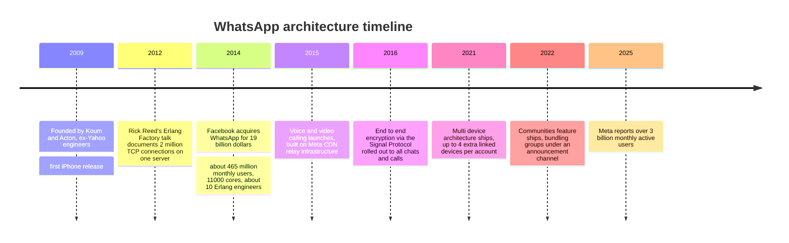
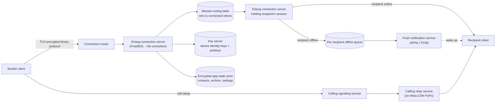
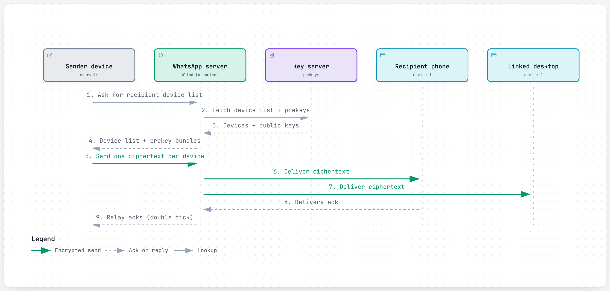
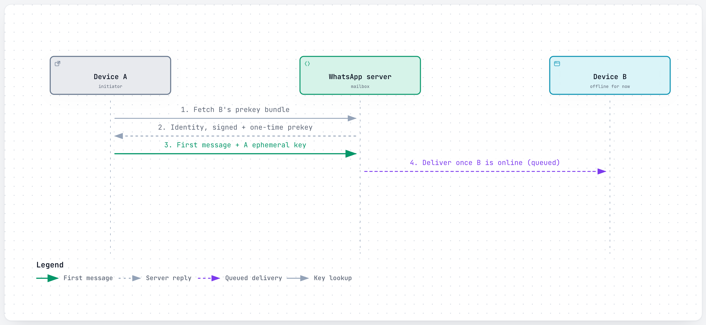
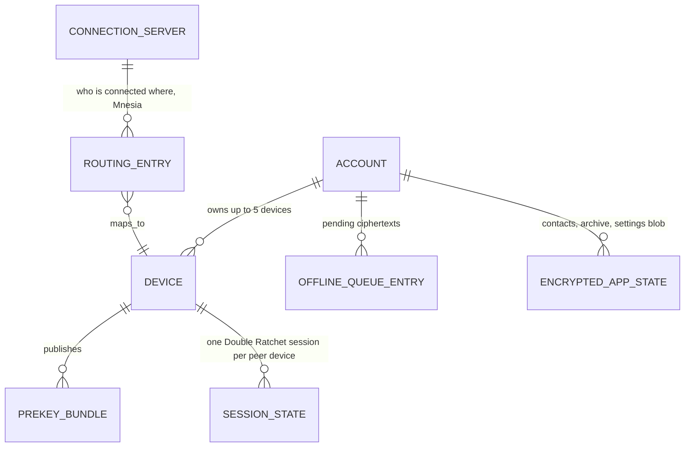
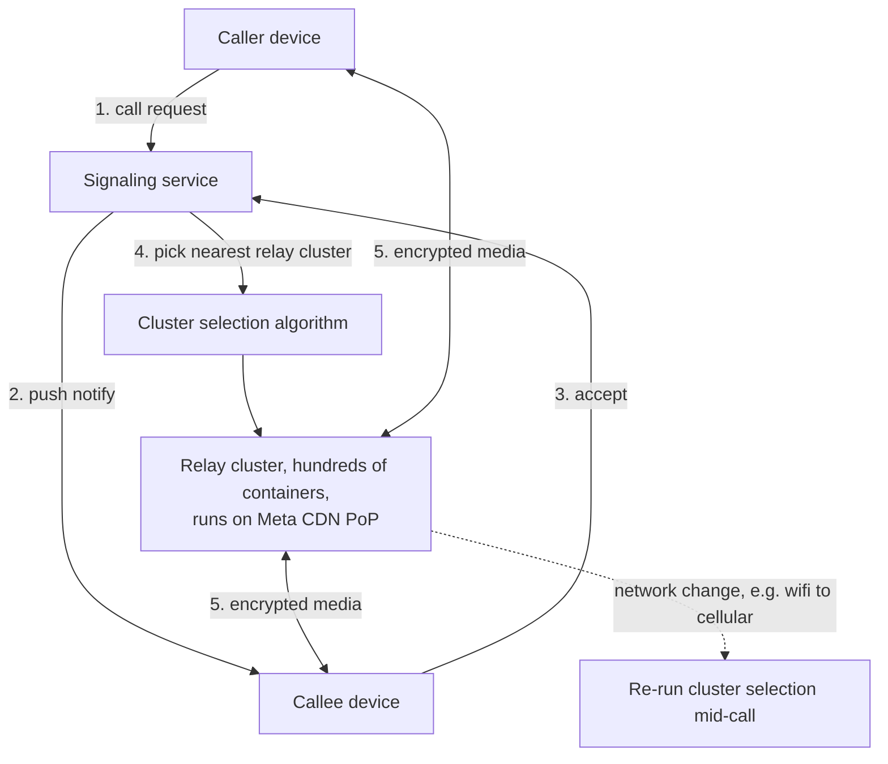
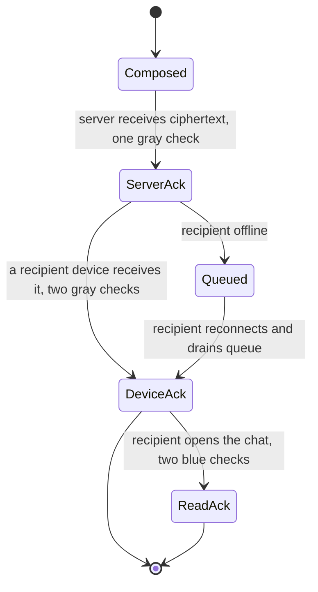

# WhatsApp: how a message reaches you in under a second, and how nobody in between can read it

> **In 60 seconds:** WhatsApp routes messages through a cluster of Erlang processes running on FreeBSD, where every user connection is its own lightweight, crash-isolated process — that's how ~550 servers held 147 million concurrent connections back in 2014.
>
> Messages are encrypted end-to-end on the sender's device using the Signal Protocol before they ever leave it, so the server only ever handles ciphertext it cannot read.
>
> If the recipient is online, the message is pushed straight through; if not, it sits in a small per-recipient queue until they reconnect or a push notification wakes their phone, and then the server deletes its own copy.
>
> Multi-device support (2021) extended this so a linked laptop or tablet is its own independently-keyed device, with the sender's client encrypting and sending one ciphertext per device rather than trusting the phone to relay it.

**Last reviewed:** September 2026 · **Difficulty:** Advanced · **Reading time:** ~34 min

## Table of contents

- [Before you read: design it yourself](#before-you-read-design-it-yourself)
- [The problem](#the-problem)
- [Scale](#scale)
- [Back-of-the-envelope math](#back-of-the-envelope-math)
- [Requirements](#requirements)
- [How it evolved](#how-it-evolved)
- [High-level design](#high-level-design)
- [Low-level design](#low-level-design)
- [Deep dives](#deep-dives)
- [What happens when things break](#what-happens-when-things-break)
- [Key design decisions](#key-design-decisions)
- [Interview takeaways](#interview-takeaways)
- [Glossary](#glossary)
- [Sources](#sources)

## Before you read: design it yourself

Try each question for 5 minutes before reading the answer — the "how WhatsApp does it" boxes are collapsed so you're not tempted to peek early.

### Q1. How do you hold millions of connections open, when almost all of them are just sitting idle, on a small number of machines?

<details>
<summary>Hint</summary>

Think about what a normal thread-per-connection web server pays per connection, even an idle one, and what happens when you multiply that by a million.

</details>

<details>
<summary>How WhatsApp does it</summary>

Every connection gets its own lightweight Erlang process (not an OS thread) on the BEAM VM, running on tuned FreeBSD boxes — cheap enough per-process that one box held ~1M connections on average by 2014 (a 2012 demo hit 2M on a single box). The trade-off: a smaller hiring pool than mainstream stacks, and getting there required patching the BEAM emulator and tuning/backporting FreeBSD kernel pieces (timers, lock contention, the network driver), not just picking the "right" language.

Deep dive: [The Erlang/BEAM concurrency model and FreeBSD tuning](#the-erlangbeam-concurrency-model-and-freebsd-tuning).

</details>

### Q2. How do you encrypt a message so thoroughly that not even the company running the servers can read it?

<details>
<summary>Hint</summary>

Think about how two devices that have never "met" can agree on a secret, and how you make sure leaking one message's key doesn't expose every other message too.

</details>

<details>
<summary>How WhatsApp does it</summary>

The Signal Protocol: X3DH lets a device start an encrypted session with someone who's offline right now (they pre-uploaded prekeys), then the Double Ratchet derives a fresh key for basically every message, so one leaked key exposes nothing else (forward secrecy). Groups skip pairwise sessions per member (which would be O(n²)) in favor of Sender Keys — one shared symmetric key per group, cheaper but with weaker per-message guarantees than the pairwise scheme.

Deep dive: [The Signal Protocol: X3DH, Double Ratchet, Sender Keys](#the-signal-protocol-x3dh-double-ratchet-sender-keys).

</details>

### Q3. Now one account can be logged in on 5 devices at once — how do you extend that guarantee without ever trusting the phone as the one master key?

<details>
<summary>Hint</summary>

Think about what has to change if the "server never sees plaintext" promise must hold even when a laptop and a phone are both active at once.

</details>

<details>
<summary>How WhatsApp does it</summary>

Each device gets its own independent identity key; the server's only job is tracking the current list of device keys per account, never message content. The sender does client-fanout — encrypting once per recipient *device*, not once per recipient person — so a message to someone with 2 linked devices becomes 2 ciphertexts. Trade-off: more sender-side work and bytes on the wire, and revoking one device just means dropping one key from the list rather than invalidating a secret everyone held in common.

Deep dive: [Multi-device architecture: killing the "phone is the source of truth" assumption](#multi-device-architecture-killing-the-phone-is-the-source-of-truth-assumption).

</details>

### Q4. Given the server can't read messages and doesn't want to be a permanent archive, what does it actually have to store — and what happens when a whole layer underneath all of this disappears?

<details>
<summary>Hint</summary>

Think "envelope vs. letter": routing something still needs an address in the clear, even if the contents are sealed. Then think about what sits one layer below your whole application design.

</details>

<details>
<summary>How WhatsApp does it</summary>

No `MESSAGES` table at all — the server keeps routing info (who's connected where, in Mnesia), undelivered ciphertext in a small per-recipient queue, device keys, and an encrypted app-state blob, then deletes its own copy once a message is delivered. That minimal footprint didn't save WhatsApp on October 4, 2021: a routine BGP config change withdrew the routes to Meta's own DNS servers, and the whole beautifully fault-tolerant application layer (supervisor trees, offline queues, dual datacenters) went fully dark for six hours because the network layer underneath it disappeared first.

Deep dive: [What the server actually tracks](#3-data-model-what-the-server-actually-tracks) and [What happens when things break](#what-happens-when-things-break).

</details>

## The problem

It's New Year's Eve. You're texting "Happy New Year!" to a family group chat spread across three continents.

So is nearly everyone else on the planet, at roughly the moment their own clock strikes midnight in their own time zone. WhatsApp's holiday traffic has historically spiked hard enough that engineers watched outbound bandwidth hit 146 Gb/s on a single Christmas Eve, and 2 billion photos get downloaded in a single New Year's Eve window [6].

Your message has to:

- Leave your phone already encrypted, so that not even WhatsApp's own servers can read it.
- Find every device your cousin has linked to her account — her phone, her laptop, her work tablet.
- Get delivered instantly to whichever of those devices are online right now.
- Quietly wait for the ones that aren't, without getting lost or arriving twice.

All of this has to happen while the underlying servers are being hammered by hundreds of millions of other people doing the exact same thing within the same ten-minute window.

This page tries to answer three questions a junior engineer should be able to answer confidently after reading it:

1. **How do you hold millions of idle-but-instant connections open on a handful of machines?**
2. **How do you encrypt a message so thoroughly that the company running the servers cannot read it — and still make that work across five devices per person?**
3. **What does the server actually store, given it deliberately doesn't want to be a message archive?**

## Scale

| Metric | Number | Source |
|---|---|---|
| Monthly active users | 3 billion+ (Apr 2025) | [11] *(third-party)* |
| Monthly active users | 465 million (2014) | [6] *(third-party)* |
| Messages sent per day | 40 billion (2014) | [6] *(third-party)* |
| Messages received per day | 19 billion (2014) | [6] *(third-party)* |
| Photos / voice messages / videos per day | 600M / 200M / 100M (2014) | [6] *(third-party)* |
| Voice/video calls per day | 1 billion+ (year not stated) | [8] |
| Erlang cores in production | 11,000+ (2014) | [6] *(third-party)* |
| Total servers | ~550 (2014) | [6] *(third-party)* |
| Peak concurrent connections (fleet-wide) | 147 million (2014) | [6] *(third-party)* |
| Connections per server | ~1,000,000 average (down from a 2,000,000 peak in 2012) | [5], [6] |
| Erlang inter-process messages/sec | 70 million+ (2014) | [6] *(third-party)* |
| Peak logins/sec | 230,000 (2014) | [6] *(third-party)* |
| Peak messages received/sec | 342,000 (2014) | [6] *(third-party)* |
| Peak messages sent/sec | 712,000 (2014) | [6] *(third-party)* |
| Backend/ops engineers | ~10, supporting ~40M users each (2014) | [6] *(third-party)* |
| Mnesia database size | ~2TB RAM, 16 partitions, 18 billion records (2014) | [6] *(third-party)* |
| Linked non-phone devices per account | up to 4, i.e. 5 devices total (2021) | [1] |
| Group size limit | 1,024 members (as of 2022) | [16] |
| Community size limit | up to 100 groups / 2,000 members (2022) *(unverified: not stated in [13] or [14])* | — |
| Peak outbound bandwidth (Christmas Eve) | 146 Gb/s (2014) | [6] *(third-party)* |
| Photos downloaded (New Year's Eve) | 2 billion (2014) | [6] *(third-party)* |

What these numbers mean in practice:

- 712,000 messages sent per second (2014 peak) is more than one machine, one database, or even one conventional data center could plausibly handle with a thread-per-connection web server.

  It's why WhatsApp's whole backend philosophy is built around a runtime (Erlang/BEAM) designed from the start to run millions of lightweight, independent workers concurrently, rather than around simply buying more powerful machines.

- 40 million users per backend engineer (2014) is the number most often cited to explain why WhatsApp is a recurring system-design case study.

  A team smaller than most mid-size startups' entire engineering orgs ran infrastructure at nation-state scale.

- The jump from 465 million monthly users (2014) to 3 billion+ (2025) is roughly 6.5x growth in a decade.

  The architectural philosophy — process-per-connection, minimal server state, end-to-end encryption — has stayed recognizably the same the whole way, which is itself a data point about how well the original design choices held up.

## Back-of-the-envelope math

Back-of-the-envelope math is the rough, order-of-magnitude estimating engineers do on a whiteboard — no calculator, no precise data, just enough arithmetic to check whether a design idea is remotely plausible before building it. Inputs marked **[n]** come straight from this page's [Scale](#scale) table and cite the same source; everything else is a labeled **Assumption**, not a fact.

### Estimate 1: How much spare capacity did the 2014 fleet have at peak?

**Question:** At the reported 2014 peak of 147 million concurrent connections, how much of the fleet's own stated per-server capacity was actually in use?

**Inputs:**
- Total servers: ~550 (2014) [6]
- Connections per server: ~1,000,000 average (2014) [5], [6]
- Peak concurrent connections (fleet-wide): 147 million (2014) [6]

**Math:**
```text
nominal fleet capacity = 550 servers × 1,000,000 conns/server
                        = 550,000,000 connections

utilization at peak    = 147,000,000 / 550,000,000
                        ≈ 0.267 → ~27%
```

**Answer:** ~27% of nominal fleet capacity was in use at the reported 2014 peak.

**What it tells you:** the fault-tolerance story for a holiday traffic spike (see [What happens when things break](#what-happens-when-things-break)) is "we already had headroom," not a clever failure-absorption trick — running well under the per-box ceiling is exactly what leaves slack for an hours-long global surge.

### Estimate 2: How much bandwidth does peak text traffic alone need?

**Question:** How much network bandwidth does 712,000 text messages/sec (the 2014 peak) actually require, on its own?

**Inputs:**
- Peak messages sent/sec: 712,000 (2014) [6]
- Assumption: an average text message, with protocol overhead, is about 100 bytes.

**Math:**
```text
bytes/sec = 712,000 msgs/s × 100 bytes/msg
          = 71,200,000 bytes/s ≈ 71.2 MB/s

bits/sec  = 71,200,000 bytes/s × 8
          ≈ 569,600,000 bits/s ≈ 0.57 Gb/s
```

**Answer:** ~0.57 Gb/s for peak text sends alone.

**What it tells you:** that's roughly 260x smaller than the 146 Gb/s Christmas Eve bandwidth peak [6] — confirming media (photos, video, voice), not text, dominates bandwidth, which is exactly why large media is kept on a separate path from routing traffic (see [High-level design](#high-level-design), step 9).

### Estimate 3: How "idle" is an idle connection, really?

**Question:** Given 70 million+ Erlang inter-process messages/sec fleet-wide, how many internal messages does a single connection generate per second on average?

**Inputs:**
- Erlang inter-process messages/sec: 70 million+ (2014) [6]
- Peak concurrent connections (fleet-wide): 147 million (2014) [6]

**Math:**
```text
messages per connection per second = 70,000,000 / 147,000,000
                                    ≈ 0.48/sec
```

**Answer:** under 1 internal message per connection per second (~0.5/sec).

**What it tells you:** confirms the claim that a connection sitting idle in someone's pocket really does cost the server almost nothing — the entire premise behind the [Erlang/BEAM concurrency model](#the-erlangbeam-concurrency-model-and-freebsd-tuning).

### Estimate 4: How big is one Mnesia record, on average?

**Question:** Given ~2TB of RAM holding 18 billion records, what's the average record size?

**Inputs:**
- Mnesia database size: ~2TB RAM, 18 billion records (2014) [6]
- Rule of thumb: 1 TB ≈ 10^12 bytes.

**Math:**
```text
average record size = (2 × 10^12 bytes) / (18 × 10^9 records)
                     ≈ 111 bytes/record
```

**Answer:** ~111 bytes per record.

**What it tells you:** that's tiny — consistent with [what the server actually tracks](#3-data-model-what-the-server-actually-tracks) being routing pointers and key metadata, not message content. This is a sanity check on the "no `MESSAGES` table" claim, not a stored-message count.

### Estimate 5: How much cheaper are Sender Keys than pairwise encryption for a max-size group?

**Question:** For a 1,024-member group (the documented cap), how many encryption operations does Sender Keys save versus encrypting once per member?

**Inputs:**
- Group size limit: 1,024 members (2022) [16]
- Assumption: a naive per-recipient (pairwise) scheme needs one encryption per member per message; multi-device fan-out is ignored here for simplicity.

**Math:**
```text
pairwise cost per message    = 1,024 encryptions
Sender Keys cost per message = 1 encryption

ratio = 1,024 / 1 = 1,024 ≈ 10^3
```

**Answer:** ~1,000x (three orders of magnitude) fewer encryption operations per message.

**What it tells you:** this is the concrete number behind the claim in [Group messaging at scale](#group-messaging-at-scale-sender-keys-re-keying-and-communities) that pure client-fanout "would multiply that cost by three orders of magnitude" — quantifying exactly why a 1,024-member group can't use the same scheme as a 1:1 chat.

### Rules of thumb used

| Rule | Value |
|---|---|
| 1 day | ~86,400 s ~ 10^5 s |
| 1 TB | ~10^12 bytes |
| Peak vs. average load | typically ~2-3x, though viral/holiday events can go far higher |

These are general estimating conventions, not WhatsApp-specific facts.

## Requirements

**Functional:**
- Send/receive 1:1 and group text, media, voice, and video calls, worldwide. *This is the entire product; everything else supports it.*
- Deliver a message to a recipient whether they're online right now or offline for days. *Phones lose signal, die, or sit in a drawer — "deliver eventually" is a hard requirement, not an edge case.*
- Show delivery state to the sender (sent / delivered / read). *People treat delivery status as a signal about relationships, not just plumbing — it has to be right.*
- Let one account use up to four extra devices (desktop, web, tablet) alongside the phone, all end-to-end encrypted. *Many users want to type on a laptop keyboard without keeping the phone open and active.*
- Sync chat metadata (contacts, archived chats, starred messages) across a user's own devices without the server reading it. *Multi-device only feels complete if a newly-linked device looks like it already "knows" your chat list.*
- Support groups up to 1,024 members and Communities that bundle multiple groups under one announcement channel (2022) [13], [14]. *Families, schools, and neighborhoods needed structured many-to-many messaging, not just 1:1 chat.*

**Non-functional:**
- **End-to-end encryption by default** for every message, call, and file. The server must never be able to read content, because messaging is one of the most sensitive things people do with a phone and WhatsApp's whole brand promise rests on this.
- **Low latency:** sub-second delivery for online recipients, globally. A chat app that lags feels broken in a way email doesn't.
- **Very high connection density per machine** (millions of mostly-idle TCP connections). With billions of users, the number of machines needed at "normal" per-connection overhead would be unaffordable and unmanageable.
- **High availability**, a telecom-grade "never go down" bar inherited from Erlang's telecom heritage. Messaging is infrastructure people rely on for work, family emergencies, and daily life.
- **Forward secrecy:** compromising today's keys shouldn't expose yesterday's messages. This bounds the damage of any future key leak.
- **Minimal server-side state:** WhatsApp does not want to be a permanent message store. This reduces what a breach could expose and keeps the "your chats are yours" promise credible.
- **Bounded, predictable fan-out cost per message:** a message to a 1,024-member group must still deliver quickly, which is plausibly one reason group size is capped rather than unlimited (inference; the sources state the cap, not the reason) [16].

## How it evolved



WhatsApp's public story is unusually consistent across every era: start with the simplest thing that could plausibly work at the *next* order of magnitude, then rebuild the layer that breaks.

Most companies in this series have a "we started with a monolith and a single database, then it fell over" story. WhatsApp's version of that story is really a story about one runtime (Erlang/BEAM) being pushed further and further, rather than being replaced.

**2009 — founding.** A two-person team, both ex-Yahoo engineers, building an iPhone status-message app that accidentally became a messenger [12].

There's no public record of large-scale infrastructure decisions from this period — the interesting engineering story starts a few years later.

**2012 — the scaling talk that made WhatsApp famous among backend engineers.** Rick Reed's Erlang Factory talk showed the team pushing a single FreeBSD box, patched at the kernel and BEAM-VM level, to 2 million simultaneous connections.

That was a number most web companies at the time weren't even trying to reach on a *fleet*, let alone a single machine [5].

The talk is worth reading in full for anyone who wants the texture of the era: the bottlenecks weren't clever algorithmic wins, they were unglamorous things like lock contention ("from 200k to 2M were all contention fixes"), the kernel's timeofday lock, and BEAM timer-wheel behavior — the kind of grinding, one-bottleneck-at-a-time work that "we chose the right language" glosses over [5].

**2014 — the acquisition, and the ratio that keeps getting cited.** By the time Facebook acquired WhatsApp, that same philosophy — Erlang, FreeBSD, Mnesia, a tiny team — was running the backend for nearly half a billion monthly users on roughly 550 machines.

That's a ratio of 40 million users per backend engineer, one that Facebook's own acquiring engineers reportedly found hard to believe [6].

**2015 — calling.** Voice and video calling shipped, introducing an entirely separate infrastructure concern (real-time media, not just message routing) built on Meta's existing CDN footprint rather than a new one built from scratch [8].

**2016 — encryption, not as a feature but as a redefinition.** The rollout of full end-to-end encryption was arguably a bigger architectural shift than anything about connection scaling.

It wasn't a feature bolted onto the existing message-routing system — it was a redefinition of what that system was even allowed to *see*. Every message type — 1:1, group, media, voice, video — had to be re-plumbed so the server only ever handled ciphertext [3].

**2021 — multi-device, five years in the making.** This shift attacked an assumption that had been load-bearing since 2009: that a single phone was an account's one source of truth.

Making that assumption go away without weakening the encryption guarantee took years of protocol design — it's telling that multi-device shipped five full years after the encryption rollout, not alongside it [1].

**2022 — Communities, a product-level change on old primitives.** Communities were layered on top of group chats you already had, wrapped in an announcement channel and a shared membership list.

Groups inside them were raised to 1,024 members [14]; the often-quoted Community caps (100 groups, 2,000 members) aren't stated in [13] or [14] *(unverified)*, and the "bounded fan-out" rationale is inference. Unlike multi-device, this didn't require new cryptographic protocol work — it reused Sender Keys and existing group machinery.

**2025 — the numbers that show the growth curve.** Meta's own reported figures put WhatsApp at 3 billion+ monthly active users — roughly 6.5x the 2014 monthly-user figure, run on an architecture that is still recognizably the same one described in the 2012 and 2014 talks [11].

## High-level design



Walking through it:

1. **Persistent connections, not polling.** Each device keeps one persistent TCP connection to a WhatsApp connection server. That server is an Erlang node running on FreeBSD; each connection is handled by its own lightweight Erlang process rather than an OS thread, which is how a single box holds roughly a million simultaneous connections [5], [6].

   The connection stays open even when idle, so a phone sitting in someone's pocket for hours costs the server almost nothing until a message actually arrives.

2. **Fetching keys before encrypting.** Before sending, the sender's client asks the server for the recipient's current device list and public key material (prekeys) so it can encrypt the message with the Signal Protocol — the server brokers key distribution but never sees plaintext [1], [2].

   This lookup is cached client-side and only re-fetched when the device list actually changes (a new device links, or an old one is removed), so it doesn't happen on every message.

3. **Looking up where the recipient lives.** The connection server that owns the sender's socket looks up, in a shared **Mnesia** routing table, which server (if any) currently holds a live connection for the recipient. *(Reference design: [6] documents an in-memory Mnesia database and a routing layer built on Erlang's pg2 process groups, but does not say Mnesia specifically is the "who is connected where" table.)*

   Because Mnesia is an in-memory, replicated database native to Erlang, this lookup is a local or same-datacenter operation, not a round trip to a separate storage tier.

4. **Direct forwarding when online.** If the recipient is online, the message is forwarded directly to the connection server holding their session and pushed down that socket. For a multi-device account, this step repeats once per linked device that's currently online.

5. **Queuing when offline.** If the recipient is offline, the message is placed in a small durable per-recipient queue. On reconnect, the client drains this queue in order and acknowledges each message, and those acknowledgments (delivery/read receipts) flow back to the sender the same way — through the queue if the sender itself is offline.

6. **Waking a closed app.** A mobile push (APNs on iOS, FCM on Android) wakes a fully-closed app so it reconnects and drains its queue.

   WhatsApp doesn't run its own push infrastructure for this step — it rides on the OS vendor's, because reimplementing "wake a suspended app" on iOS or Android isn't something a third party can do on its own.

7. **Calls take a separate path.** A **signaling service** sets the call up and notifies the callee's devices, then a **relay service** — deployed on Meta's existing CDN points-of-presence, physically close to users — shuttles the actual encrypted audio/video packets for the call's duration [8].

   This split exists because signaling is small bursty traffic that can live anywhere, while media is sustained, latency-sensitive, and wants to be as close to the user as possible.

8. **No long-term archive.** WhatsApp does not keep a long-term message archive on its servers: once a message is delivered to all of a recipient's devices, the server's copy is deleted.

   Chat history lives on-device (and, optionally, in the user's own encrypted cloud backup) — not in a WhatsApp database.

9. **Media rides a separate lane.** Large media (photos, videos, voice notes) follows a related but separate path in practice: the file itself is encrypted client-side and uploaded to media storage once, while only a small pointer message (URL, decryption key, content hash) travels through the same real-time routing path described above.

   This keeps big binary payloads off the same pipe that has to stay fast for text.

> Note: step 9's "encrypt client-side, upload to a blob store, send a pointer message carrying the key, HMAC key, and SHA256 hash" flow is documented in WhatsApp's security whitepaper [2]; the storage/CDN tiering behind the blob store is not.

## Low-level design

### 1. Core flow: sending an encrypted message to a multi-device recipient

<a href="https://alwintwk.github.io/big-tech-system-design/diagrams/companies-whatsapp-send-message.html">
  <picture>
    <source media="(prefers-color-scheme: dark)" srcset="../diagrams/companies-whatsapp-send-message.dark.png">
    
  </picture>
</a>

<sub>Click the diagram for the interactive version (zoom, dark mode, trace a path).</sub>

This is the **client-fanout** model described in Meta's 2021 multi-device write-up: the sender does the encryption work once per recipient *device* (not once per recipient *person*), producing a separate ciphertext for the recipient's phone and for each linked companion device [1].

Group chats use the Signal Protocol's **Sender Key** scheme instead of full pairwise fanout, so a sender encrypts a message once per group with a shared symmetric key rather than once per every member device [1], [2]. This is a deliberate trade: client-fanout for 1:1 and small device lists keeps the server blind to plaintext at a manageable cost, while pure client-fanout for a 1,024-member group would multiply that cost by three orders of magnitude, which is exactly why groups use a different scheme.

### 2. Key agreement: establishing a session (X3DH)

<a href="https://alwintwk.github.io/big-tech-system-design/diagrams/companies-whatsapp-key-agreement.html">
  <picture>
    <source media="(prefers-color-scheme: dark)" srcset="../diagrams/companies-whatsapp-key-agreement.dark.png">
    
  </picture>
</a>

This is the **Signal Protocol**'s handshake, run once per device-pair: **X3DH** (Extended Triple Diffie-Hellman) lets A start an encrypted session with B even while B is completely offline, because B published prekeys in advance.

After that, the **Double Ratchet** algorithm derives a fresh key for every message so that leaking one message's key doesn't expose past or future messages (forward secrecy) [2].

### 3. Data model: what the server actually tracks



> Note: this is a simplified reference model. Public sources describe the *shape* of routing and key storage [1], [6] but WhatsApp does not publish its literal schema; treat table/field names as illustrative, not exact.

The important asymmetry versus most chat systems: there is no `MESSAGES` table here.

WhatsApp is deliberately not a message-history database — the durable state it keeps is routing info, undelivered ciphertext, device keys, and an encrypted blob of app metadata, not a searchable archive of what anyone said.

This is the opposite design choice from Discord and Slack, both of which built enormous message-storage systems (see their pages) because their products need permanent, searchable channel history — WhatsApp's product does not.

### 4. Calling: signaling vs. relay, and why they're separate



Signaling (setting the call up, notifying devices) and media relay (moving the actual audio/video bytes) are deliberately separate services, because they have opposite scaling shapes: signaling is small, bursty messages; relay is sustained, high-bandwidth streams that must sit physically close to the user to keep latency low.

Splitting them means WhatsApp can place relay clusters on CDN points-of-presence near users [8]; where signaling runs isn't stated. It also means a relay cluster having a bad day is a capacity/placement problem the signaling layer can route around, rather than a monolithic outage — the selection algorithm in step 4 can simply pick a different cluster.

### 5. Message delivery as a state machine



Each arrow in this diagram is itself a message that has to survive one side being offline — including the acknowledgments flowing backward from recipient to sender.

That's why "delivery status" isn't a simple boolean flag the server flips; it's a small state machine replicated on both ends of the conversation, kept in sync by receipts that travel through the exact same offline-queue machinery as the original message.

## Deep dives

### The Erlang/BEAM concurrency model and FreeBSD tuning

> **Why this matters:** this single decision — one lightweight process per connection, on a runtime designed for it — is the reason a team of ~10 Erlang engineers could run infrastructure for hundreds of millions of people.

Erlang's BEAM virtual machine schedules extremely cheap, isolated "processes" (nothing to do with OS processes — more like green threads with no shared memory) across a small number of OS threads.

Give every connected user their own process, and one user's slow client or malformed packet can't stall or crash anyone else's — the failure is contained to that process, and a supervisor simply restarts it.

Getting to 2 million connections on one box in 2012 required more than just picking Erlang, though.

Rick Reed's talk describes patching the BEAM emulator itself (timer wheel, timer hash table) and tuning the FreeBSD kernel — raising socket limits (`kern.ipc.maxsockets`), enlarging the TCP hash table, backporting a cheaper TSC timecounter and the `igb` network driver. At that density, contention issues that are invisible at 10,000 connections become the dominant cost at 2,000,000 [5].

By 2014 the fleet-wide average had settled closer to 1 million connections per server, a deliberate step back from the theoretical peak, trading some density for headroom and stability, spread across roughly 550 boxes and 11,000 cores for ~465 million monthly users [6].

```
# Illustrative shape of a connection handler (not real WhatsApp code)
handle_connection(Socket) ->
    spawn_link(fun() -> loop(Socket, initial_state()) end).

loop(Socket, State) ->
    receive
        {tcp, Socket, Data} -> loop(Socket, handle_data(Data, State));
        {route, Msg} -> gen_tcp:send(Socket, encode(Msg)), loop(Socket, State)
    end.
```
> ponytail: illustrative pseudo-Erlang only, not sourced from WhatsApp's actual codebase — the real system is unpublished.

The 2014 setup ran across dual datacenters, which matters for the same reason any stateful system cares about datacenter count: a single site is a single point of failure for everything routed through it, and Mnesia's replication story is only as good as having somewhere else to replicate *to* [6].

A useful mental model for why this stack scaled the way it did: cost per connection on a thread-per-connection server grows with the number of connections, because each thread carries real OS scheduling overhead and a comparatively large stack.

Cost per connection on the BEAM grows much more slowly, because a process is a few hundred bytes and the scheduler is designed around having millions of them.

That difference in growth rate, not raw single-core speed, is what let ~550 machines do what would otherwise have needed an order of magnitude more.

### The Signal Protocol: X3DH, Double Ratchet, Sender Keys

> **Why this matters:** this is what makes "end-to-end encrypted" a true statement rather than a marketing phrase — the server structurally cannot decrypt content, even under legal compulsion, because it never has the keys.

Three pieces work together.

**X3DH** solves the "how do I start talking to someone who's asleep right now" problem: every device uploads a bundle of public keys (a long-term identity key, a signed prekey, and a batch of one-time prekeys) when it's online, so any other device can compute a shared secret with it later without either side being online at the same moment [2].

Once a session exists, the **Double Ratchet** algorithm derives a new encryption key for essentially every message, so an attacker who somehow recovers one message's key gains nothing about any other message — that's forward secrecy in practice, not just in theory.

Group chats skip pairwise Double Ratchet sessions between every pair of members (which would be O(n²)) in favor of **Sender Keys**: each member distributes one symmetric key to the group once, and then encrypts each group message with that single key — cheaper, at the cost of some of the individual-session guarantees the pairwise scheme provides [1], [2].

The one-time prekeys deserve a closer look, because they're the part that makes X3DH work asynchronously at all. A device uploads a *batch* of these (not just one) precisely because each one should be consumed exactly once and then discarded — reusing a one-time prekey across two different senders would let an attacker who later learns that key retroactively attack both conversations.

When a device's batch of one-time prekeys runs low, it has to replenish the batch the next time it's online. If it never comes back online and the batch is fully consumed, new senders fall back to using only the signed prekey — still safe, just without the extra one-time-key protection for that particular session. This is a small but real operational concern in the protocol: key supply has to keep up with how often strangers start new conversations with a device.

> **Why this matters (part 2):** none of this is exotic cryptography research — X3DH, Double Ratchet, and Sender Keys are all publicly specified by Signal and used identically by multiple messaging apps. The engineering difficulty in WhatsApp's case was less "invent new crypto" and more "retrofit these primitives into a system built years earlier around a completely different trust model," which is exactly the multi-device story below.

### Multi-device architecture: killing the "phone is the source of truth" assumption

> **Why this matters:** almost every design decision from 2009–2020 assumed exactly one device per account; multi-device had to change that without weakening the encryption promise, which is a much harder problem than "just allow more logins."

Before 2021, everything hung off a single identity key tied to the phone. A linked desktop or web client was essentially a thin remote control for the phone, and if the phone was off, companion devices stopped working.

The 2021 redesign gave **each device its own identity key**, and made the server responsible only for maintaining the *mapping* from an account to its current list of device keys — never for holding message content [1].

Three consequences follow directly from that:

1. The sender must fetch a device list and encrypt N times (client-fanout) instead of once.
2. Verifying "who am I really talking to" (the security code / fingerprint verification users can compare in person) now has to represent *all* of someone's devices at once, not just one.
3. Non-message account data — contacts, archived chats, starred messages, mute settings — has to be kept in sync across devices without the server reading it, which WhatsApp solved with an end-to-end encrypted "app state" blob whose keys never leave the user's own devices [1].

Device management also had to become a user-facing security surface rather than an invisible implementation detail. Meta's write-up describes three protective mechanisms shipped alongside the architecture change:

- Extended security codes that represent the combination of *all* of someone's linked devices at once, not just the phone.
- Automatic device verification, so adding a new companion device doesn't force everyone you talk to to manually re-verify a code.
- An explicit device-management screen where a user can see every linked device, when it was last active, and remotely log any of them out [1].

That last capability only exists *because* devices are independently keyed — revoking one device's access means removing one key from the account's device list, which every other participant's client will notice on its next lookup, rather than having to somehow invalidate a single shared secret that every device held in common.

### Calling relay infrastructure: riding on the CDN

> **Why this matters:** voice/video is latency-sensitive in a way text messaging isn't — a few hundred extra milliseconds turns a call into an unusable conversation, so the network topology matters as much as the code.

WhatsApp's calling stack, live since 2015, splits into a signaling service (call setup, ringing, accept/reject) and a relay service that shuttles the actual encrypted media [8].

The relay service deliberately runs on Meta's existing CDN points-of-presence rather than in centralized data centers, because being physically close to users cuts round-trip latency, and there are already thousands of these PoPs worldwide serving other Meta products [8].

Each call gets routed to a nearby relay cluster by a selection algorithm, and — because people switch from Wi-Fi to cellular mid-call, or a cluster gets congested — that selection can be recomputed *during* an active call without dropping it [8].

To survive packet loss without the latency cost of asking the *other end* of the call to retransmit, the relay itself caches a few seconds of recent media packets and can satisfy retransmission requests locally (NACK-based recovery) [8].

Group calls add bandwidth-saving tricks on top:

- **Dominant-speaker detection**, so only currently-talking participants' audio is widely distributed.
- **Video simulcast**: sending both a high- and low-bitrate version of your video simultaneously so the relay can forward whichever bitrate each recipient's bandwidth supports [8].

Reliability at the relay layer follows a deliberate two-tier priority scheme rather than treating every call the same. The infrastructure distinguishes between:

- **Critical state** — who's in the call, and where to reach each device — which must survive any disruption.
- **Ephemeral state** — like current bandwidth estimates or who's currently the dominant speaker — which can be safely lost and quickly rebuilt without the call itself dropping [8].

Load balancing goes a level deeper than "spread calls across containers": individual *participants* within the same group call can be distributed across different relay containers.

If one relay container needs to be drained or has failed, ongoing calls are prioritized for continuity over admitting brand-new ones during a capacity crunch [8]. Protecting what's already running over admitting new load is a pattern worth remembering for any real-time system: a half-finished new connection is cheap to refuse, but dropping an in-progress call is a much worse user experience than making someone redial.

### Offline delivery and the receipt system

> **Why this matters:** "deliver it eventually, exactly once, in order, and tell the sender what happened" is a deceptively hard distributed-systems problem once you allow both ends to be offline at different times.

When a recipient is offline, the message doesn't just vanish or get retried against a closed socket — it's written into a small durable per-recipient queue.

On reconnect, the recipient's client drains that queue in order and acknowledges each entry; each acknowledgment then has to travel back to the *original sender*, who may themselves be offline by that point, so receipts flow through the same queuing mechanism in reverse.

That's the mechanical reason WhatsApp shows three distinct states — a single check (server has it), a double check (a device has it), and blue double checks (someone opened it) — each one is a receipt that itself had to be reliably delivered, possibly after a delay, through the same infrastructure as the original message.

Ordering matters here in a way it's easy to underestimate: the queue has to drain in the order messages actually arrived at the server, not the order the recipient's device happens to process them, or a conversation could visibly reassemble itself out of sequence after someone reopens the app.

Multi-device compounds this — each of a recipient's devices maintains its own independent queue and its own drain-and-ack cycle. A phone that's been offline for a day and a laptop that reconnected five minutes ago are, from the server's point of view, two entirely separate delivery problems for the same underlying message.

Deduplication (matching on a sender-generated message ID, discussed in the failure scenarios below) is what keeps this multi-queue reality invisible to the user, who just sees one consistent conversation regardless of which device they're looking at.

### Media transfer: keeping big files off the real-time pipe

> **Why this matters:** a connection server tuned to hold a million cheap, mostly-idle sockets open is the wrong place to also push multi-megabyte video files — mixing the two workloads would force a trade-off between connection density and throughput.

Text messages are small and fit comfortably down the same persistent connection used for routing and receipts. Photos, videos, and voice notes don't.

The pattern, documented in WhatsApp's security whitepaper [2], separates the *pointer* from the *payload*:

1. The client encrypts the file itself client-side.
2. It uploads the encrypted blob once to dedicated media storage.
3. It sends a small encrypted message down the normal real-time path containing a pointer to the blob, the AES key, the HMAC key, and a SHA256 hash of the encrypted blob [2].
4. The recipient's client fetches and decrypts the actual bytes separately, out of band from message routing.

This keeps the connection-server fleet doing what it's tuned for — huge numbers of tiny, latency-sensitive messages — while a differently-tuned storage/CDN tier handles the comparatively rare, large, throughput-sensitive transfers.

> Note: the client-side steps above come from the whitepaper [2]; WhatsApp has not published the storage/CDN architecture behind its blob store.

### Group messaging at scale: Sender Keys, re-keying, and Communities

> **Why this matters:** the moment you allow groups, "encrypt once per recipient" (fine for 1:1) turns into "encrypt once per recipient device," and that cost grows with group size — this is the concrete reason WhatsApp caps how big a group or Community can be.

Inside a group, every member holds a **Sender Key**: a signature key plus a symmetric chain key, distributed to the rest of the group once via ordinary pairwise-encrypted messages [15].

After that one-time distribution, sending a group message is cheap — the sender derives the next message key from their own chain key and encrypts once, and every member independently derives the same message key to decrypt, rather than the sender re-encrypting per-recipient on every single message [15].

The sharp edge is membership changes: when someone is removed from a group, every remaining member's Sender Key has to be considered compromised and thrown away, and the group effectively "starts over" — every member generates a fresh Sender Key and redistributes it to everyone else [15].

That re-keying cost is plausibly one reason group size is capped (1,024 members) rather than unbounded — a removal in a very large group triggers a proportionally large burst of re-keying traffic (inference; the sources don't give the cap's reason) [15], [16].

Communities (2022) don't introduce a new encryption primitive — they're a product-level wrapper around groups you already have: one announcement group broadcasting to everyone, plus the member sub-groups [13], [14] (the widely quoted 100-group / 2,000-member caps are not stated in those posts — unverified).

Architecturally it reuses the same group machinery rather than inventing a new one, which is a reasonable read of why it shipped as a relatively fast follow rather than requiring years of protocol work the way multi-device did.

### Metadata: what the server can see even though it can't read your messages

> **Why this matters:** "end-to-end encrypted" is a precise, narrow claim about message *content* — it says nothing on its own about the surrounding metadata, and being clear about that distinction is a mark of understanding the system rather than repeating its marketing.

Encrypting the body of a message doesn't hide the fact that a message was sent, when, roughly how large it was, or between which two accounts.

The connection-routing layer described in the high-level design has to know sender and recipient identifiers to do its job at all, and that necessarily means the server retains some minimal envelope information (who talked to whom, and roughly when) even though it never sees what was said.

This is a standard and well-understood limitation of end-to-end encryption generally, not something specific to a WhatsApp implementation flaw: any system that has to route a message to the right recipient needs *some* addressing information in the clear, the same way a sealed envelope's front still needs a visible destination address even though the postal service can't read the letter inside.

Being able to state this distinction precisely — "content is protected, envelope metadata is a separate question" — is exactly the kind of nuance that separates a surface-level understanding of E2E encryption from a working one.

### Regional infrastructure: why dual datacenters mattered before "multi-region" was a buzzword

> **Why this matters:** stateful systems built around an in-memory database (Mnesia) can't just spin up a second copy of the data on demand the way a stateless web tier can — replication topology has to be designed in from the start.

The 2014-era deployment ran across dual datacenters rather than one [6]. For a system whose core routing table lives in RAM (Mnesia), this isn't a minor operational detail — it's the difference between "a datacenter-level event takes down the whole routing layer" and "a datacenter-level event takes down half the connections, which reconnect through the surviving site."

The trade-off inherent in this kind of setup is consistency versus availability during a partition: if the two sites can't talk to each other, each one has to decide independently whether to keep serving with a possibly-stale view of "who's connected where," or to refuse to serve until connectivity is restored.

WhatsApp hasn't published which choice it makes, but the fact that the system is designed around multiple sites at all — rather than one very large site — is itself the more important, and better-documented, architectural signal.

## What happens when things break

**A connection server process crashes mid-session.**
- *Trigger:* a bug, a malformed packet, or a resource exhaustion condition in the process handling one connection.
- *What happens:* because every connection is its own isolated Erlang process rather than a shared thread inside one big process, the crash cannot corrupt or take down anyone else's session on the same box.
- *Why it doesn't cascade:* Erlang's supervisor trees are built to detect a crashed process and restart it (or force the client to reconnect and get re-routed via the Mnesia table) without touching sibling processes [5], [6]. This isolation-by-default is the main practical payoff of the "process per connection" architectural choice, more than raw connection density.

**A holiday traffic spike (New Year's Eve, Christmas).**
- *Trigger:* a predictable, calendar-driven surge as huge numbers of users send messages within the same short window.
- *What happens:* WhatsApp's own publicly-cited numbers show outbound bandwidth hitting 146 Gb/s on a single Christmas Eve and 2 billion photos downloaded on one New Year's Eve — both single-day figures far above typical daily peaks [6].
- *Why it doesn't cascade:* the system's answer is capacity headroom rather than a clever failure mode. Because the fleet already runs well under its theoretical per-box connection ceiling (~1M average versus a ~2M-per-box peak demonstrated years earlier), there's slack to absorb an hours-long global spike without emergency scaling [5], [6].

**The entire company goes dark for six hours (October 4, 2021).**
- *Trigger:* not a WhatsApp-specific bug at all — this is the most instructive real-world outage involving WhatsApp on record precisely because it shows a failure mode *above* the messaging architecture. A routine configuration change to Meta's backbone network caused Facebook's data centers to withdraw their BGP route announcements for the IP ranges hosting their own DNS servers.
- *What happens:* once those routes vanished, DNS resolvers worldwide could no longer find Facebook's, Instagram's, or WhatsApp's nameservers at all — not slow, not erroring, just unreachable — so client apps and websites alike failed at the very first step of trying to connect [9], [10].
- *Why it took hours, not minutes, to fix:* recovery required physically re-establishing network access to run the fix, because the automation and monitoring tools that would normally do it also depended on the very network that had just disappeared; service returned after a team got access to servers in the Santa Clara data center [9].
- *The generalizable lesson:* a system can have a beautifully fault-tolerant application layer (Erlang supervisor trees, offline queues, redundant data centers) and still go fully dark if the *network layer underneath all of it* — DNS and routing — has a single point of failure.

**A message gets delivered twice, or arrives out of order.**
- *Trigger:* an acknowledgment gets lost in transit, so the server thinks a message wasn't delivered and resends it.
- *What happens:* WhatsApp's client-side dedup relies on a sender-generated message ID; if the same ciphertext is redelivered, the recipient's client recognizes the duplicate ID and discards the copy rather than showing it twice.
- *Why the ack path matters as much as the message path:* losing an ack, not just losing a message, is a first-class failure case the queue design has to handle — the system has to be correct even when *acknowledgments themselves* are unreliable.

**A member is removed from a very large group at a bad moment.**
- *Trigger:* an admin removes a member from a group close to the 1,024-member cap.
- *What happens:* as the group-messaging deep dive describes, removing a member invalidates every remaining member's Sender Key and forces a full re-key — every other member has to generate and redistribute a fresh key [15].
- *Why it's bounded rather than a real incident:* in a group near the size cap, that's a burst of pairwise key-distribution messages fired at once rather than spread over time. The practical mitigation is the cap itself, which bounds how large that burst can ever get, rather than a clever re-keying algorithm that avoids the burst entirely [16].

**A connection server holding routing information becomes unreachable.**

> Note: the following is a simplified reference design — WhatsApp hasn't published Mnesia's exact replication/failover behavior in production. It's included because "what happens when the routing table itself has a problem" is a natural follow-up question in an interview setting.

- *Trigger:* a single node hosting part of the Mnesia routing table crashes or becomes network-isolated.
- *What happens (reference design):* Mnesia is designed to be replicated across nodes rather than living on a single box, so the expected mitigation is that other nodes still hold a copy of the routing information and can keep serving lookups; a client whose specific connection server dies simply reconnects (via the connection router) and gets re-registered.
- *The harder version of this problem:* a network partition that lets two sides of a split each believe they're authoritative. Production Mnesia deployments generally have to pick a conflict-resolution strategy for exactly that case, but which one WhatsApp uses isn't public.

## Key design decisions

| Decision | Why | Trade-off |
|---|---|---|
| Erlang/BEAM + FreeBSD, process-per-connection | Telecom-grade fault isolation; one crashing connection process can't take down others; BEAM schedules millions of lightweight processes on few OS threads [5], [6] | Smaller hiring pool than mainstream stacks; deep kernel/VM tuning was required to hit multi-million connection counts [5] |
| No server-side message store | Minimizes what a breach or subpoena could expose; server never needs to be a message archive | Users must manage their own backups (e.g., encrypted cloud backup) for history; a lost device with no backup loses history |
| Per-device identity keys (multi-device, 2021) | Removes the phone as a mandatory "source of truth"; companion devices work even if the phone is off [1] | Sender does more encryption work per message (one ciphertext per device) and the server must track a device list per account [1] |
| Signal Protocol (X3DH + Double Ratchet + Sender Keys) | Forward secrecy and deniability; industry-vetted design shared with Signal | Group encryption (Sender Keys) is weaker on forward secrecy than pairwise Double Ratchet, a known trade-off of the scheme [2] |
| Mnesia for connection routing *(routing use is inference; [6] documents Mnesia but not as the routing table)* | In-memory, distributed, and native to Erlang — fast lookups of "which server holds this session" [6] | Mnesia's scaling ceiling shaped WhatsApp's partitioning scheme (16 partitions in the 2014 setup) [6] |
| Relay service on CDN PoPs, separate from signaling | Physical proximity to users cuts call latency; lets the two services scale independently [8] | Extra operational surface: two coordinated services instead of one, and mid-call cluster reselection logic to handle |
| Sender Keys for group encryption instead of pairwise Double Ratchet per member | Sending a group message stays cheap on the sender's side instead of growing with member count [15] | Removing a member forces a full group re-key — everyone generates and redistributes a new key — all at once [15] |
| Capped group (1,024) and Community (2,000, unverified) sizes | Keeps fan-out cost and re-key bursts bounded and predictable (inference) [16] | Large organizations/communities that want a single unbounded group have to split across multiple linked groups instead |
| Push notifications delegated to Apple/Google rather than built in-house | Waking a fully-closed app on iOS/Android requires OS-level cooperation no third party can replicate | WhatsApp's "wake the app" reliability is partly dependent on a system it doesn't control |
| Media sent as an out-of-band blob plus an in-band pointer message | Keeps the latency-tuned real-time connection tier from also having to be a high-throughput file-transfer tier | Two systems to keep consistent — the pointer must always resolve to a blob that's actually still there — instead of one |
| Dual-datacenter deployment for the routing tier | A single site is a single point of failure for the whole in-memory routing table [6] | Requires a consistency-vs-availability choice during any cross-site network partition |

## Interview takeaways

- **"Process per connection" is a reusable pattern** for any system with huge numbers of long-lived, mostly-idle connections (chat, notifications, IoT fleets): isolate failure per-connection instead of sharing state across a connection pool, and pick a runtime that makes that cheap. Erlang/BEAM here; Go goroutines or Elixir (Discord, for a similar reason) are common equivalents in an interview answer.
- **"What does the server actually need to store?" is a design question, not an afterthought.** WhatsApp's answer — almost nothing, by design — is defensible specifically because the product doesn't need searchable server-side history. If asked to design WhatsApp in an interview, justify *why* you're not building a messages table, not just how you would.
- **End-to-end encryption changes what the server is allowed to do**, not just how data is stored: no server-side search, no server-side spam scanning of content, no "resend from server" — all message-level features must be re-derived from what the client can do locally.
- **Client-fanout vs. server-fanout is a real trade-off to name out loud**: encrypting once per recipient device on the sender (client-fanout) keeps the server blind to plaintext, at the cost of more sender-side work and more bytes on the wire — the alternative (decrypt-and-re-encrypt on the server) is simpler but breaks the E2E guarantee entirely.
- **Offline delivery is a queueing problem with acks flowing in both directions** — model the receipt as its own message that must survive the sender being offline too, not as a synchronous callback.
- **Splitting signaling from media relay is a general real-time-media pattern** (also used by Discord's voice stack — see that page): small bursty control-plane traffic and large sustained data-plane traffic scale differently and often want different placement (central vs. edge).
- **A dependency on your own network/DNS layer is invisible until it isn't** — the October 2021 outage is the canonical example that application-level resilience (retries, supervisor trees, replication) doesn't help if the network layer beneath it disappears. When asked "how would this fail," always check one layer below the one you designed.
- **Capacity caps (group size, connection limits) are often product decisions wearing an engineering costume** — WhatsApp's 1,024-member group cap exists because re-keying cost and fan-out cost both scale with membership; naming the *mechanism* behind a limit is a stronger interview answer than just stating the number.
- **Separate the small-and-frequent from the large-and-rare** — WhatsApp does this twice (signaling vs. relay for calls; routing messages vs. media blobs for content) and it's a generally reusable move: put a tight latency budget on the small/frequent path and let the large/rare path use different infrastructure entirely.

**A few follow-up questions worth rehearsing an answer to, if this page came up in an interview:**

- *"Why not just use WebSockets and a normal relational database, if the connection count is the hard part?"* — The connection count genuinely is the hard part, but "normal" here means thread- or event-loop-per-connection at a scale most stacks don't reach; the interesting design choice isn't WebSockets vs. raw TCP, it's the process-isolation model underneath, which is a runtime choice more than a protocol choice.
- *"If the server can't read messages, how does spam/abuse detection work?"* — This page doesn't cover it because public sources don't detail WhatsApp's abuse systems in the same depth as the messaging core; the honest answer in an interview is that E2E encryption pushes abuse signals toward metadata and behavioral patterns (send rate, report volume, account age) rather than content scanning, and that's a real, unavoidable trade-off of the encryption design, not a gap in this write-up.
- *"Why does multi-device need a device list at all — why not just one shared key for the account?"* — A shared key would mean every device holds the same secret, so compromising or losing one device compromises all of them at once; per-device keys let you revoke exactly one device (see the device-management deep dive above) without touching the others.

## Glossary

New to these terms? The [concepts](../concepts/README.md) folder explains the core ideas in depth.

- **Erlang**: a programming language built by Ericsson in the 1980s for telephone switches that must never go down. Good at running huge numbers of small, isolated, crash-tolerant tasks at once.
- **BEAM**: the virtual machine that runs Erlang code. It can juggle millions of lightweight "processes" (not OS processes — much cheaper) on one machine.
- **FreeBSD**: a Unix-like operating system WhatsApp ran its servers on, chosen and heavily tuned for handling huge numbers of network connections per box.
- **[Process-per-connection](../concepts/persistent-connections.md)**: giving every single user's connection its own isolated worker inside the server, so one user's problem can't crash another user's session.
- **Supervisor tree**: an Erlang pattern where a "supervisor" process watches over worker processes and automatically restarts any that crash, instead of letting the crash spread.
- **Mnesia**: a database built into Erlang, kept in RAM, used here to track "which server is currently holding this user's connection."
- **Signal Protocol**: the specific set of encryption techniques (from Signal/Open Whisper Systems) that WhatsApp uses so only the sender and recipient can read a message — not even WhatsApp's own servers can.
- **End-to-end encryption (E2E)**: encrypting on the sender's device and only decrypting on the recipient's device, so anything in between (including the server) only ever sees scrambled data.
- **X3DH (Extended Triple Diffie-Hellman)**: a way for two devices to agree on a shared secret key even if one of them is offline right now, by using keys the offline device left behind in advance.
- **Prekey / prekey bundle**: a set of public keys a device uploads in advance so someone can start an encrypted conversation with it before it's even online.
- **One-time prekey**: a prekey meant to be used exactly once and then thrown away, so a single leaked key can't retroactively compromise more than one conversation.
- **Double Ratchet**: a technique that changes the encryption key for every single message, so if one message's key ever leaked, it wouldn't expose any other message.
- **Forward secrecy**: the property that losing today's keys doesn't let an attacker decrypt yesterday's messages.
- **Sender Keys**: a group-chat shortcut where the sender encrypts a message once with one shared key for the whole group, instead of once per member — faster, at the cost of some of the Double Ratchet's guarantees.
- **[Client-fanout](../concepts/fan-out.md)**: encrypting and sending a separate copy of a message for each of the recipient's devices, done on the sender's device rather than the server.
- **Multi-device**: letting a WhatsApp account be used from several devices (phone + linked desktop/web/tablet) at once, each with its own encryption identity.
- **[Offline queue](../concepts/message-queues-and-logs.md)**: a small mailbox on the server holding a user's undelivered messages until they reconnect.
- **Delivery/read receipt**: the check-marks in the UI — one gray check (server received it), two gray checks (device received it), two blue checks (user opened it).
- **Push notification**: a message sent by Apple (APNs) or Google (FCM), not WhatsApp, that wakes up a phone so a fully-closed app can reconnect.
- **App state sync**: keeping non-message data (contact names, archived chats, settings) the same across a user's own devices, encrypted so the server can store it without reading it.
- **[PoP (point-of-presence)](../concepts/cdn.md)**: a smaller edge data center, closer to users than a company's main data centers, used to cut network latency.
- **Signaling (in calling)**: the control-plane work of setting up a call — ringing, accepting, exchanging connection info — as opposed to the media itself.
- **NACK (negative acknowledgement)**: a receiver telling the sender "I didn't get packet #N," used to selectively re-send only what's missing instead of the whole stream.
- **Simulcast**: sending more than one quality level of the same video stream at once, so a relay can forward whichever one fits each recipient's available bandwidth.
- **BGP (Border Gateway Protocol)**: the protocol routers on the internet use to tell each other how to reach a given range of IP addresses; withdrawing a route makes those addresses unreachable from anywhere.
- **DNS (Domain Name System)**: the internet's "phone book," translating a name like whatsapp.com into an IP address; if DNS can't be reached, most apps can't even start connecting.
- **Communities**: a WhatsApp feature that bundles multiple related groups (up to 100) under one announcement channel, for organizations like schools or neighborhoods.
- **Re-keying**: throwing away a shared group encryption key and generating a fresh one, done whenever someone is removed from a group so they can no longer decrypt future messages.
- **[Network partition / split brain](../concepts/cap-and-consistency.md)**: a failure where two halves of a distributed system can each still talk to their own members but not to each other, and each mistakenly believes it's the only one still running.
- **Reference-counted storage**: storing one copy of a piece of data and just tracking how many things still point to it, instead of duplicating it for every recipient.
- **Metadata (in messaging)**: information *about* a message — who sent it, to whom, when, roughly how big it was — as distinct from the message's actual content.

## Sources

1. [How WhatsApp enables multi-device capability](https://engineering.fb.com/2021/07/14/security/whatsapp-multi-device/) — Meta Engineering, July 2021.
2. [WhatsApp Security whitepaper (PDF)](https://www.whatsapp.com/security/WhatsApp-Security-Whitepaper.pdf) — WhatsApp official technical whitepaper, describing the Signal Protocol components (X3DH, Double Ratchet, Sender Keys) used.
3. [End-to-end encryption](https://blog.whatsapp.com/end-to-end-encryption) — WhatsApp Blog, April 2016 (E2E rollout announcement).
4. [About end-to-end encryption](https://faq.whatsapp.com/820124435853543) — WhatsApp Help Center.
5. Rick Reed, *"Scaling to Millions of Simultaneous Connections,"* Erlang Factory SF Bay, March 30, 2012. Video: [vimeo.com/44312354](https://vimeo.com/44312354); slides: [SlideShare](https://www.slideshare.net/milkers/scaling-to-millions-of-simultaneous-connections-by-rick-reed-from-whatsapp). *(conference talk, primary)*
6. [How WhatsApp Grew to Nearly 500 Million Users, 11,000 cores, and 70 Million Messages a Second](https://highscalability.com/how-whatsapp-grew-to-nearly-500-million-users-11000-cores-an/) — High Scalability, 2014. *(third-party, aggregating public WhatsApp-engineer talks and statements from that period)*
7. Meta's Q1 2025 earnings call, as reported in [11]. *(scale figures)*
8. [Calling Relay Infrastructure at WhatsApp Scale](https://atscaleconference.com/calling-relay-infrastructure-at-whatsapp-scale/) — @Scale Conference (Meta's own engineering conference).
9. [2021 Facebook outage](https://en.wikipedia.org/wiki/2021_Facebook_outage) — Wikipedia, summarizing the October 4, 2021 incident affecting Facebook, Instagram, and WhatsApp. *(third-party)*
10. [Understanding How Facebook Disappeared from the Internet](https://blog.cloudflare.com/october-2021-facebook-outage/) — Cloudflare Blog, October 2021. *(third-party, independent technical analysis of the BGP/DNS root cause)*
11. [WhatsApp now has more than 3 billion users a month](https://techcrunch.com/2025/05/01/whatsapp-now-has-more-than-3-billion-users/) — TechCrunch, May 2025, reporting Meta's Q1 2025 earnings call. *(third-party)*
12. [The History of WhatsApp: Founders, Funders, and Timeline](https://www.zoko.io/post/the-history-of-whatsapp) — Zoko blog. *(third-party, founding history only)*
13. [Sharing Our Vision for Communities on WhatsApp](https://blog.whatsapp.com/sharing-our-vision-for-communities-on-whatsapp) — WhatsApp Blog, April 2022.
14. [Communities Now Available!](https://blog.whatsapp.com/communities-now-available) — WhatsApp Blog, November 2022.
15. [Sender Keys](https://en.wikipedia.org/wiki/Sender_Keys) — Wikipedia, describing the Signal Protocol's group-messaging key scheme used by WhatsApp. *(third-party)*
16. Group size limit (1,024 members) as reported in [14]. The 100-group / 2,000-member Community limits are not stated in [13] or [14].
