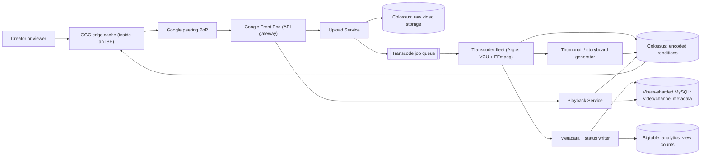
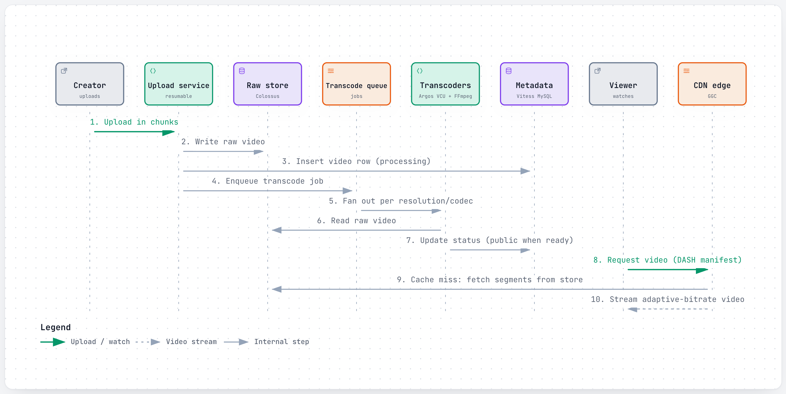
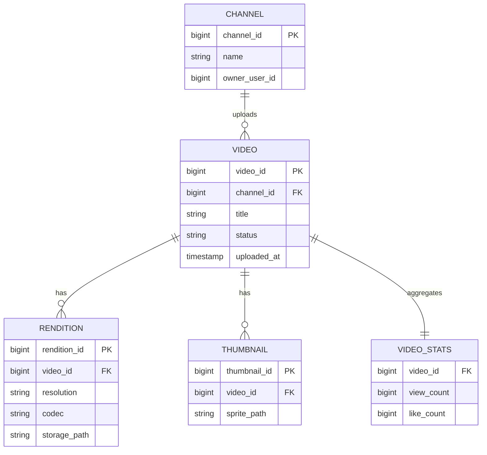
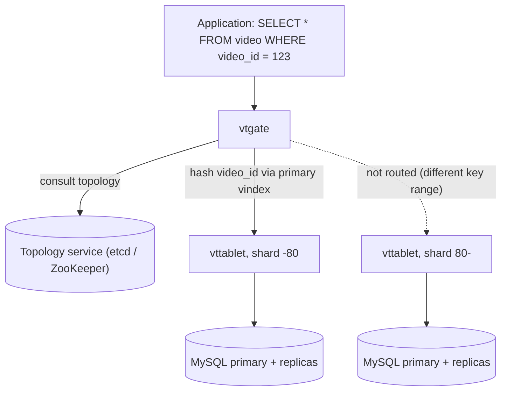
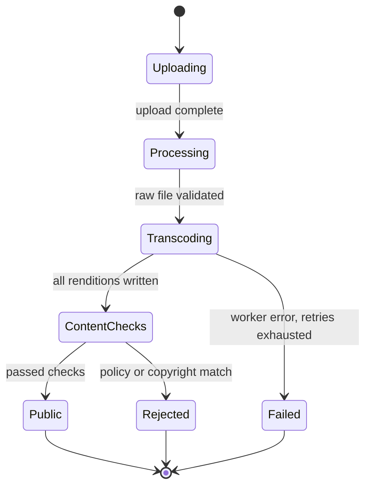
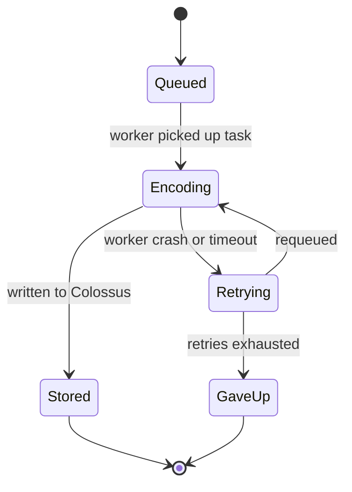
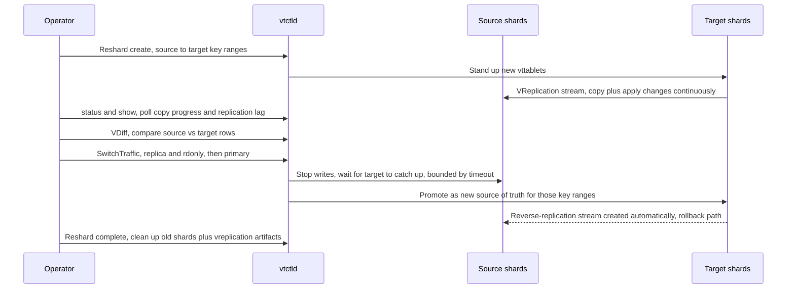
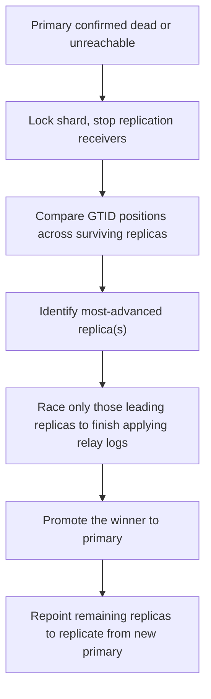
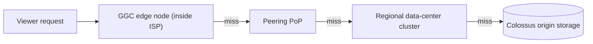
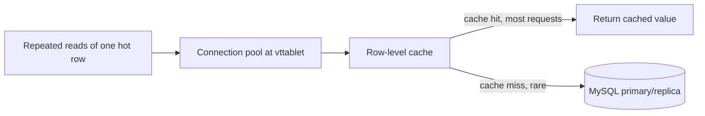

# YouTube: How a video you upload becomes watchable everywhere

> **In 60 seconds:** A creator uploads a raw video file over a resumable, chunked upload; it lands in Google's Colossus file system and a job is queued to transcode it. A fleet of transcoding workers — increasingly built on Google's custom Argos video-transcoding chips (VCUs) instead of plain CPUs — fans that one file out into a dozen-plus resolution/codec combinations plus thumbnails, writes each rendition back to storage, and flips the video's status to public once enough renditions exist. Viewers never talk to that pipeline directly: their player asks for a manifest, picks a resolution adaptively based on their real-time bandwidth, and pulls video segments from the nearest cache — often a Google Global Cache box sitting inside their own ISP's network. Underneath the video/channel metadata (titles, views, ownership) sits Vitess, the sharded-MySQL layer YouTube built in 2010 and later open-sourced, which hides sharding behind a query-routing proxy so the application code never has to know which of thousands of shards a row lives on.

**Last reviewed:** September 2026 · **Difficulty:** Advanced · **Reading time:** ~20 min

## Table of contents

- [Before you read: design it yourself](#before-you-read-design-it-yourself)
- [The problem](#the-problem)
- [Scale](#scale)
- [Back-of-the-envelope math](#back-of-the-envelope-math)
- [Requirements](#requirements)
- [How it evolved](#how-it-evolved)
- [High-level design](#high-level-design)
- [Low-level design](#low-level-design)
- [Deep dives](#deep-dives)
- [What happens when things break](#what-happens-when-things-break)
- [Key design decisions](#key-design-decisions)
- [Interview takeaways](#interview-takeaways)
- [Glossary](#glossary)
- [Sources](#sources)

## Before you read: design it yourself

Try each question for 5 minutes on your own before reading the "how" — that's the exercise, not a formality.

### Q1. How do you turn one uploaded video file into a dozen-plus playable resolutions without one slow render blocking everything, at 500+ hours uploaded per minute?

<details><summary>Hint</summary>

Think about treating each resolution/codec combination as its own independent job instead of one all-or-nothing task.

</details>

<details><summary>How YouTube does it</summary>

The raw upload lands durably in Colossus (Google's cluster file system) first, then a transcode job is queued rather than run inline — a crash downstream never means re-uploading. A worker fleet fans that job out into a dozen-plus resolution/codec renditions plus thumbnails, each an independently retryable task, so one slow or failed rendition (say, an unusual 8K/AV1 combo) never blocks the others from finishing and going live. Increasingly this runs on Google's own **Argos VCU** chips instead of plain CPUs — purpose-built video-transcoding silicon reported at 20–33x the compute efficiency of the prior all-software pipeline, because at this volume a general-purpose CPU fleet just can't keep up economically.

Deep dive: [Upload ingestion and the transcode fan-out](#upload-ingestion-and-the-transcode-fan-out)

</details>

### Q2. How does the player decide what quality to stream, and why does the cache serving it sometimes live inside your own ISP's building instead of Google's?

<details><summary>Hint</summary>

Split "which quality" (decided live, per segment) from "which server" (decided by physical proximity).

</details>

<details><summary>How YouTube does it</summary>

The player downloads a manifest (DASH) listing every available resolution/codec rendition, then picks and switches quality itself based on its own measured bandwidth and buffer health — the server and every cache in front of it stay completely stateless, never tracking which quality any viewer is on. Physically, most requests never reach a Google data center at all: **Google Global Cache (GGC)** places Google-owned caching boxes directly inside partner ISPs' own networks (1,300+ cities, 200+ countries), so a popular video is served from a box the ISP already owns the last mile to. A miss climbs a hierarchy — GGC, then a peering point, then a regional cluster, then Colossus origin — with each tier absorbing most of what reaches it.

Deep dive: [CDN and edge delivery](#cdn-and-edge-delivery-google-global-cache-and-peering)

</details>

### Q3. A single MySQL database can't hold billions of videos' metadata and continuous view-count writes forever — how do you shard it without every application query needing to know which shard a row lives on?

<details><summary>Hint</summary>

Consider hiding the sharding behind a proxy the application talks to as if it were one database.

</details>

<details><summary>How YouTube does it</summary>

**Vitess** sits between the application and a fleet of MySQL instances: `vtgate` parses each query, hashes the sharding column (usually `video_id`) through a **vindex** function to find the right shard's key range, and routes there — the app never specifies a shard name. `vttablet` fronts each actual MySQL instance, pooling connections and enforcing query safety limits. Choosing `video_id` as the shard key matches YouTube's hottest access pattern (almost everything is scoped to one video), which is what let YouTube's user base scale by more than 50x after adopting Vitess without a rewrite. Cost: any query without a sharding key (e.g. "all videos uploaded today") has to scatter to every shard and merge results — much more expensive than a single-shard lookup.

Deep dive: [Vitess sharding and query routing](#vitess-sharding-and-query-routing)

</details>

### Q4. What happens when a shard's MySQL primary dies mid-write, or you need to reshard live traffic with zero downtime?

<details><summary>Hint</summary>

Think about verifying a copy matches before you ever touch live traffic, and about only racing the replicas that could actually win.

</details>

<details><summary>How YouTube does it</summary>

**VTOrc** continuously watches each shard for a dead or unhealthy primary; when one is confirmed dead it triggers **EmergencyReparentShard**, comparing replicas' replicated position (MySQL GTIDs) to find who's most caught up, racing only those to finish applying logs, and promoting the winner — replicas with no chance of winning are skipped entirely, which is exactly the 2026 hardening fix for a slow straggler stalling the whole failover. Resharding works the same "never take the old thing offline" way: **VReplication** streams changes into a new shard layout while the old one keeps serving 100% of live traffic, a **VDiff** confirms the copy matches, and only then does a small, reversible `SwitchTraffic` step cut over — with automatic reverse-replication in place for rollback.

Deep dive: [Keeping Vitess alive: resharding and automatic failover](#keeping-vitess-alive-resharding-and-automatic-failover)

</details>

## The problem

You film a 12-minute video on your phone at 2am, hit upload, and go to sleep. By the time you wake up, it needs to: exist safely somewhere durable so a flaky home Wi-Fi connection didn't corrupt it; get turned into a dozen-plus different resolutions and codecs so it plays smoothly whether the next viewer is on a 3G phone in a moving car or a 4K TV on fiber; get a thumbnail and a scrub-bar preview generated automatically; get its metadata (title, owner, view counter starting at zero) written somewhere that can be read billions of times a day without falling over; and become reachable, within minutes, by a viewer on the other side of the planet without that viewer's request ever having to travel all the way back to a single data center.

None of this is one problem — it's four systems (upload/transcode, metadata storage, delivery, and the analytics layer creators check obsessively) that have to cooperate without ever making the creator wait around or the viewer notice.

Each one independently had to survive YouTube's growth: a database designed for a small site had to become a distributed system without rewriting every application query; a transcoding job designed to run on one CPU had to become a fleet-wide, fault-tolerant fan-out; and "serve the file from our data center" had to become "serve the file from as close to the viewer as physically possible, sometimes from inside their own internet provider's building."

This page focuses on three of them in depth: the upload/transcode pipeline, Vitess (the sharded-MySQL layer originally built at YouTube), and video delivery/CDN.

By the end of this page you should be able to answer:

- Why did a relational database (MySQL) turn into a distributed, sharded system at YouTube, and what does the routing layer (Vitess) that makes that invisible to application code actually do?
- How does a single uploaded file become a dozen playable versions without one slow worker blocking everything else, and why did YouTube eventually build its own chip for this?
- Why does the video player — not the server — decide what quality to stream, and why does the cache that serves it often live inside your own internet provider's building instead of Google's?

## Scale

| Metric | Number | Source |
|---|---|---|
| Video uploaded to YouTube | 500+ hours of video uploaded every minute (stated April 2021) | [1](#sources) |
| Transcoding efficiency gain from custom silicon (Argos VCU) vs. the prior CPU-based system | 20–33x improvement in compute efficiency (stated April 2021) | [1](#sources) |
| Argos VCU deployment | Deployed in Google data centers (no chip count given); each chip has 10 encoder cores, two chips per board (2021) | [14](#sources) *(third-party)* |
| Argos VCU density per production server | 20 VCU accelerators per machine (10 cards, 2 VCUs per card over PCIe Gen3 x16), compared against baselines of dual Intel Xeon Skylake servers and Nvidia T4 GPU servers (April 2021, coverage of Google's ACM paper) | [19](#sources) *(third-party)* |
| YouTube's user base growth after adopting Vitess | Scaled by a factor of more than 50x | [2](#sources) |
| Early YouTube growth (pre-Vitess, pre-sharding era) | ~30M video views/day (Mar 2006) → ~100M video views/day (Jul 2006) | [15](#sources) *(third-party)* |
| Later YouTube growth (per the same widely-cited writeup's own update) | Roughly 1B video views/day | [15](#sources) *(third-party)* |
| Daily livestreaming growth during a demand surge | Daily livestreams up 45% in H1 2020; watch time up 25% globally in COVID-19's first quarter | [1](#sources) |
| Vitess CNCF milestones | Accepted as CNCF incubating project Feb 2018; graduated Nov 2019 (8th project to graduate) | [2](#sources) |
| Google Global Cache (edge cache inside ISPs) footprint | Present in 1,300+ cities across 200+ countries and territories | [12](#sources) |
| Colossus (Google's cluster file system, used by YouTube for storage) | Scales to exabytes of storage across tens of thousands of machines per cluster | [11](#sources) |
| Bigtable (used for YouTube's data warehouse/analytics, and Google services broadly) | 6B+ requests/sec at peak, 10+ exabytes managed, 15+ years in continuous production | [10](#sources) |

What these numbers mean concretely, roughly (illustrative arithmetic, not a YouTube-published figure):

- 500+ hours/minute × 60 minutes × 24 hours ≈ 720,000 hours of new footage uploaded per day.
- Even encoding that just once, in real time, at one resolution, would take on the order of hundreds of thousands of CPU-hours daily — and YouTube encodes each video into a dozen-plus resolution/codec combinations, not one.
- That gap between "what a general-purpose CPU can do" and "what the upload volume demands" is the direct reason Google built dedicated transcoding chips instead of just buying more servers [1][14].

Packing 20 of those accelerators into a single production machine (rather than one or two, as a typical CPU/GPU transcode box might) is itself a scale decision — it means far fewer racks, less power, and less networking overhead per unit of encoding throughput than reaching the same capacity with general-purpose servers [19].

Likewise, a Google Global Cache footprint of 1,300+ cities means most viewers' effective "server" is a box inside their own ISP's building, not a Google data center hundreds of miles away — the difference between a round trip measured in single-digit milliseconds versus tens of milliseconds, multiplied by every single video segment a player fetches.

And "scaled by more than 50x after adopting Vitess" is the difference between a database architecture that runs out of headroom on one bad launch day and one that keeps absorbing growth for over a decade without a rewrite [2].

## Back-of-the-envelope math

This is the rough arithmetic engineers sketch on a whiteboard to size a system before writing any code — good enough to catch a design that's off by orders of magnitude, not meant to be exact. Inputs marked [n] are pulled straight from the [Scale](#scale) table above and match it exactly; everything else is an explicit **Assumption**, never presented as fact.

### 1. Storage needed per day for freshly uploaded footage

**Question:** At 500+ hours of video uploaded every minute [1](#sources), how much raw storage does one day of new uploads need, for one baseline copy?

**Inputs:**
- Video uploaded: 500+ hours/minute [1](#sources)
- Assumption: average source bitrate for one stored baseline copy ≈ 8 Mbps (before the dozen-plus transcoded renditions multiply this further)

**Math:**
```text
hours/day = 500 hours/min × 60 min/hour × 24 hours/day
          = 720,000 hours/day

seconds/day = 720,000 hours × 3,600 s/hour
            = 2,592,000,000 s/day

storage/day = 2,592,000,000 s × 8 Mb/s ÷ 8 (bits→bytes)
            = 2,592,000,000 s × 1 MB/s
            = 2,592,000,000 MB
            = 2,592,000 GB
            = 2,592 TB  (≈2.6 petabytes)
```

**Answer:** ~2.6 petabytes/day just for one baseline copy of newly uploaded footage.

**What it tells you:** real storage growth is a multiple of this, since YouTube encodes each video into a dozen-plus resolution/codec combinations rather than one — exactly why [Colossus](#upload-ingestion-and-the-transcode-fan-out) has to scale to exabytes across tens of thousands of machines per cluster [11](#sources), not a conventional filesystem.

### 2. CPU-equivalent machines replaced by one Argos transcoding box

**Question:** Argos VCU chips deliver a 20-33x compute-efficiency gain over the prior CPU-based system [1](#sources), and 20 VCU accelerators pack into one production machine [19](#sources) — how many CPU-based units does one Argos machine's transcoding throughput replace?

**Inputs:**
- Transcoding efficiency gain: 20-33x (2021) [1](#sources)
- Argos VCU density: 20 accelerators/machine [19](#sources)
- Assumption: treating the per-chip efficiency gain as a rough per-accelerator throughput multiplier vs. an equivalent CPU-based transcoding unit (a simplification — the source describes overall compute efficiency, not a literal one-to-one substitution)

**Math:**
```text
low end:  20 accelerators × 20x  = 400 CPU-equivalent units replaced by 1 Argos machine
high end: 20 accelerators × 33x  = 660 CPU-equivalent units replaced by 1 Argos machine
```

**Answer:** one Argos machine (20 VCU accelerators) does the transcoding work of roughly 400-660 CPU-based units.

**What it tells you:** at 720,000 hours/day of new footage (Estimate 1), even a 20-33x efficiency gain per chip is the difference between a transcoding fleet that fits in a sane number of racks and one that doesn't — the concrete payoff behind [Upload ingestion and the transcode fan-out](#upload-ingestion-and-the-transcode-fan-out).

### 3. Cross-checking two independent growth figures

**Question:** YouTube's user base is said to have grown ">50x" after adopting Vitess [2](#sources); separately, a widely-cited writeup puts video views at ~30M/day (Mar 2006) rising to ~1B/day later [15](#sources) *(third-party)*. Do these two independently-sourced figures roughly agree?

**Inputs:**
- User base growth after Vitess: >50x [2](#sources)
- Early growth: ~30,000,000 video views/day (Mar 2006) [15](#sources) *(third-party)*
- Later growth: ~1,000,000,000 video views/day [15](#sources) *(third-party)*

**Math:**
```text
views growth ratio = 1,000,000,000 / 30,000,000
                    = 33.3x
```

**Answer:** ~33x growth in the views figures vs. the >50x cited for Vitess's user base — different metrics (views vs. users) and time windows, but the same rough order of magnitude.

**What it tells you:** independent sources describing different metrics still land in the same growth regime — a useful interview habit: check whether a second, independently-sourced number agrees in order of magnitude before designing around the first one. This is exactly the growth [Vitess sharding and query routing](#vitess-sharding-and-query-routing) had to absorb without a rewrite.

### 4. Average Google Global Cache density per country

**Question:** Google Global Cache is present in 1,300+ cities across 200+ countries/territories [12](#sources) — what's the average number of GGC cities per country, and what does an average like that hide?

**Inputs:**
- GGC footprint: 1,300+ cities, 200+ countries/territories [12](#sources)

**Math:**
```text
avg cities/country = 1,300 / 200
                    = 6.5 cities per country (average)
```

**Answer:** ~6.5 GGC cities per country on average.

**What it tells you:** an average like this is a floor for reasoning, not a claim about the real distribution — large, high-traffic countries almost certainly host many more than 6.5 locations while many smaller ones host just one or a handful. Placement is demand-driven, not evenly spread; see [CDN and edge delivery](#cdn-and-edge-delivery-google-global-cache-and-peering).

**Rules of thumb used:**

| Convention | Value used here |
|---|---|
| Time unit ladder | 1 day = 24 h = 1,440 min; 1 hour = 3,600 s |
| Bitrate/storage conversion | 8 megabits (Mb) = 1 megabyte (MB); storage ladder MB→GB→TB→PB each ÷1,000 (decimal) |
| "X+" scale figures | treated as ≈X for arithmetic (e.g. "500+ hours/minute" → 500) |
| Order-of-magnitude cross-checks | two independently-sourced numbers on related-but-different metrics count as "consistent" if they land within roughly the same power of ten |
| Peak vs. average | general convention: peak ≈ 2-3x daily average for systems with daily/weekly demand cycles (not directly needed above, since the cited figures were already rates or ratios) |

## Requirements

**Functional:**
- A creator can upload a video from any device, in whatever format/resolution they captured it in, and resume the upload if the connection drops partway through.
- A viewer, on any device and any network quality, can play that video without manually picking a quality level, and the stream adapts if their network conditions change mid-playback.
- Viewers can scrub the timeline and see a preview thumbnail without downloading the whole video or issuing one request per preview frame.
- Creators can see view counts, watch time, and revenue tied to their own videos, refreshed continuously rather than as an overnight batch job.
- A video that fails an automated policy or copyright check does not go public, and the creator finds out why rather than the video silently vanishing.

**Non-functional:**
- **Availability of playback** — even if a database shard's primary instance or a data center fails, existing videos must stay watchable. *Why it matters for YouTube:* it's an always-on global service; a few minutes of playback downtime affects hundreds of millions of concurrent viewers and directly cuts into ad revenue and creator trust.
- **Write scalability for metadata** — view counts, likes, and comments update continuously across billions of videos. *Why it matters:* a single MySQL primary's write throughput hit a ceiling as YouTube's traffic grew in the mid-2000s, which is the entire reason Vitess exists [2][15].
- **Low latency at extreme, unpredictable fan-out** — a video can go from zero to millions of requests within minutes if it goes viral. *Why it matters:* without caching close to the viewer, a spike like that would hit origin storage as a "thundering herd" and take the service down for everyone, not just that video's viewers.
- **Elastic transcoding throughput** — upload volume swings with time of day, region, and events, and can spike hard. *Why it matters:* transcoding is CPU/ASIC-heavy and slow per unit of work; if the worker fleet can't flex, uploaded videos sit stuck in "processing" for hours, which creators notice immediately.
- **Tunable consistency** — some data (view counts) can be briefly stale; other data (who owns a video, whether it's still public) cannot. *Why it matters:* YouTube explicitly trades strict consistency for availability on reads that tolerate staleness, via Vitess's replica reads, while keeping ownership/write paths strict [8][18].
- **Durability of raw uploads** — the source file a creator uploaded must never be lost, even if every downstream transcoding step fails. *Why it matters:* re-uploading a large video is the single worst experience a creator can have; writing durably to Colossus before any processing starts is what makes every later retry cheap and safe [11].

## How it evolved

YouTube did not start with any of this. It started as a small Python/MySQL site and grew into the architecture above over roughly two decades, in response to specific things breaking.

| Era | What it looked like | What broke | What replaced it |
|---|---|---|---|
| Feb 2005 launch | One Apache (mod_fastcgi) + Python app tier, one MySQL server, lighttpd serving video files directly [15] | Fine at low traffic | — |
| 2006 (30M → 100M views/day) | MySQL primary with read replicas (leader-follower replication) [15] | **Replication lag**: the primary was multi-threaded on powerful hardware; replicas applied changes single-threaded on lesser hardware, and cache misses forced disk I/O that slowed replay further [15] | Manual database partitioning |
| 2006–2009 | Databases partitioned/sharded by user ID at the application layer; thumbnails moved onto Google's Bigtable after the 2006 acquisition [15] | Sharding logic was hand-rolled and scattered across application code; resharding was manual and risky; every new feature had to re-learn "where does this row live" | Vitess |
| 2010 | YouTube builds Vitess: a proxy layer (`vtgate`/`vttablet`) that sits between the app and MySQL and makes sharding invisible to application code [2] | — | — |
| 2011–2015 | Vitess becomes a core, load-bearing part of YouTube's MySQL infrastructure, with Vitess described as scaling to tens of thousands of MySQL nodes [7] | Transcoding on general-purpose CPUs became too slow/expensive as demand grew for 1080p and 4K, which need more efficient codecs like VP9 [1] | Google starts designing a custom transcoding ASIC (project starts 2015) [1] |
| Mid-2010s | H.264-only encoding gives way to VP9 as the more efficient default codec for adaptive streaming [1] | VP9 needs roughly 5x more compute to encode than H.264, which pushed harder on the same CPU-cost problem the VCU project was already trying to solve [1] | AV1 planned as the next-generation codec, layered on top of newer VCU chip generations [1][14] |
| 2018–2019 | Vitess donated to the Cloud Native Computing Foundation; accepted as an incubating project Feb 2018, graduated Nov 2019 [2] | — | Wider industry adoption outside Google (Slack, Square/Block, JD.com, PlanetScale) |
| ~2020–2021 | Argos VCU chips roll out across Google data centers for YouTube transcoding, claiming 20–33x compute-efficiency gains over the prior CPU-based pipeline [1][14] | — | Continued iteration toward AV1-capable chip generations [14] |
| Today (2026) | Vitess supports online, VReplication-based resharding with only a few seconds of read-only downtime [3], plus automated failover via VTOrc/EmergencyReparentShard, hardened as recently as this year [4][5] | — | — |

Most of the interesting engineering here is the middle of this table: YouTube didn't design Vitess or the transcode fan-out pipeline up front — both are responses to a simpler system hitting a wall.

Notice the shape of the pattern repeating twice. On the database side, "add read replicas" bought a few years before replication lag made it unworkable, and only *then* did sharding (first manual, then Vitess) become unavoidable [15]. On the transcoding side, "throw more CPUs at it" worked for years before rising demand for higher resolutions and more efficient codecs made custom silicon the only way to keep unit economics sane [1]. Neither team building phase two knew in advance exactly how phase one would fail — they found out by running it in production first.

Two things are worth calling out explicitly. First, the Vitess project itself has kept evolving *after* YouTube stopped being its only user — the resharding and failover mechanics described in the [deep dives](#deep-dives) below (VReplication-based `Reshard`, VTOrc, `EmergencyReparentShard`) are current Vitess capabilities, not YouTube-specific claims, since Vitess has been community-governed under the CNCF since 2018 [2].

Second, YouTube's own account of its early scaling explicitly credits moving thumbnails onto Bigtable as a direct fix for a "many small files" problem that a generic filesystem handled poorly [15] — the same "batch small things into fewer, larger objects" idea shows up again later in this page for storyboard sprites.

## High-level design



Walking through it:

1. Both creators and viewers hit Google's network at its closest point to them — ideally a **Google Global Cache (GGC)** box embedded inside their own ISP, otherwise a Google-operated peering point of presence [12]. For an upload this hop rarely matters much (uploads are one-shot transfers); for playback it matters on almost every single video segment fetched, which is why it's drawn first.
2. Traffic reaches a **Google Front End** style API gateway, which routes upload traffic to the Upload Service and playback traffic to the Playback Service. This is also where the request would be authenticated and rate-limited before touching anything stateful.
3. The Upload Service writes the raw file to **Colossus**, Google's cluster file system, and pushes a transcode job onto a queue rather than transcoding inline [11]. Writing durably before doing any expensive work is deliberate: a crash in the next stage should never mean re-uploading the file.
4. A large **transcoder fleet** — a mix of Google's custom Argos VCU chips and software (e.g. FFmpeg-class) workers — picks up the job and fans it out into many resolution/codec renditions plus thumbnails, writing everything back to Colossus [1][14]. Each rendition is effectively an independent task, so the fleet can process them out of order and in parallel across many machines.
5. Video and channel metadata (title, owner, status) lives in **Vitess-sharded MySQL**; high-volume analytical data (view counts, creator dashboards) lives in **Bigtable** [2][10]. Splitting storage this way lets each system be tuned for what it's actually good at — MySQL/Vitess for row-level transactional correctness, Bigtable for very high write-throughput aggregation.
6. The Playback Service reads metadata from Vitess and hands the viewer a manifest; actual video bytes are served from the edge cache, falling back to Colossus-backed origin storage on a cache miss. Only a small minority of requests should ever reach step 3's storage layer directly — the whole point of the edge tier is to absorb the bulk of repeat traffic for popular videos before it gets anywhere near origin.

Notice that the upload path (steps 1–4) and the playback path (steps 1, 2, 6) share almost nothing except the edge/gateway tier and the storage they both eventually read or write — they can scale, fail, and deploy independently of each other. A transcoding backlog slows down how quickly new videos become watchable, but it has no effect on the millions of already-encoded videos playing right now; a playback-side incident, symmetrically, doesn't stop new uploads from being accepted and queued.

## Low-level design

### 1. Core flow: upload to playable

<a href="https://alwintwk.github.io/big-tech-system-design/diagrams/companies-youtube-upload-to-play.html">
  <picture>
    <source media="(prefers-color-scheme: dark)" srcset="../diagrams/companies-youtube-upload-to-play.dark.png">
    
  </picture>
</a>

<sub>Click the diagram for the interactive version (zoom, dark mode, trace a path).</sub>

Step by step: the creator's file arrives over a **resumable upload** protocol — chunks that must be a multiple of 256 KB, with the server able to say "I only received this many bytes, resend from there" if the connection drops [13]. The raw bytes hit durable storage before any processing starts, so a transcoder crash never loses the source.

Transcoding is queued, not synchronous, so the upload request can return immediately. Fan-out means each resolution/codec pair is (at least conceptually) an independent unit of work, so one slow rendition doesn't block the others.

Only once enough renditions exist does the video flip to `public`; the manifest the viewer's player reads is generated from Vitess-backed metadata plus the set of renditions that exist in Colossus.

### 2. Data model



`video_id` is the natural choice for a Vitess **primary vindex** (sharding key) on the `VIDEO` table and everything hanging off it (renditions, thumbnails): almost every read and write in the playback and transcode paths is scoped to one video, so hashing on `video_id` spreads load evenly and keeps single-video operations inside one shard [3].

`VIDEO_STATS` is drawn separately, as its own entity rather than columns bolted onto `VIDEO`, because it's a hot, high-write-rate table (every view is a write) that YouTube's own engineering commentary describes handling through a mix of Vitess row-caching and moving purely analytical, high-cardinality data (dashboards, per-creator breakdowns) into Bigtable instead of MySQL [8][10].

Keeping it separate also means a spike in view-count writes never has to lock or contend with the much less frequently updated `title`/`status` columns on `VIDEO` itself — two very different write patterns get two different tables instead of being forced to share one row's worth of lock contention.

### 3. Signature component: Vitess query routing



`vtgate` is a stateless proxy the application connects to as if it were a single MySQL instance. It parses every incoming query, looks up which **keyspace** it targets, runs the sharding column through that table's **vindex** function to get a shard key range, and consults a **topology service** to find which `vttablet` currently fronts the primary for that range [3][7].

`vttablet` sits in front of each actual MySQL instance, pools connections, enforces query safety limits (row limits, timeouts, blacklisting expensive queries), and is the only thing that talks to MySQL directly [3][7][9].

A query scoped to one `video_id` routes to exactly one shard; a query with no sharding key (e.g. "all videos uploaded today across all channels") has to scatter to every shard and gather the results, which is far more expensive — this is the direct cost of sharding, and why schemas are designed so the common-case query always carries the sharding key.

As a purely illustrative example of the mechanics (not an actual YouTube shard count): if a keyspace has 256 shards, each covering an equal slice of the hash space, and `vindex(123)` produces a hash whose top byte is `0x83`, `vtgate` would route to whichever shard's key range contains `0x83` — in the diagram above that's the `-80`/`80-` split simplified down to just two shards for readability, where `-80` means "hash values below `0x80`" and `80-` means "hash values at or above `0x80`."

Adding more shards later just means narrower key ranges, which is exactly what the resharding workflow in the next deep dive exists to do safely.

### 4. Secondary flow: video processing states



This is the state machine implied by the pipeline above: a video is never "half public." It moves from `Uploading` to `Processing` (raw file landed, being validated) to `Transcoding` (fan-out in progress) to a content-check gate, and only then to `Public`.

`Failed` and `Rejected` are terminal states a creator sees as "processing failed" or a policy strike, respectively — the point of making this explicit is that the Upload Service and Playback Service only ever need to check one `status` column, never re-derive state from which renditions happen to exist yet.

### 5. Secondary flow: per-rendition state, inside the "Transcoding" video state

The video-level state machine above hides one more layer: while a video sits in `Transcoding`, each individual rendition (each resolution/codec pair) has its own smaller lifecycle, because fan-out means they succeed or fail independently:



The video's own `status` only advances out of `Transcoding` once enough of these per-rendition lifecycles reach `Stored` — a handful of renditions ending in `GaveUp` (say, an unusual 8K/AV1 combination) doesn't have to block the video from going `Public` in more common resolutions, which is the direct payoff of treating fan-out tasks as independently retryable rather than one all-or-nothing job.

## Deep dives

### Vitess sharding and query routing

**What it is:** Vitess is a query-routing and connection-management layer that sits between an application and a fleet of MySQL instances, making a sharded database look like one logical database [2][3].

**The problem it solved:** by the mid-2000s YouTube's single MySQL primary could not absorb write traffic, and manually sharding at the application layer meant every piece of code had to know "which database has this user's rows," and resharding meant touching that logic everywhere [15]. Vitess's stated goal is to remove that logic from application code entirely [2][9].

**How it works internally:** a **keyspace** is Vitess's name for a logical database; it can be unsharded (maps 1:1 to one MySQL database) or sharded (split into multiple **shards**, each typically one MySQL primary plus replicas holding identical schema but disjoint rows) [3].

Which shard a row lives on is decided by a **vindex**: a function (usually a hash) applied to a chosen column — the "primary vindex" — that maps a value to a shard's key range. A **VSchema** is the per-keyspace configuration describing which vindex applies to which table/column, similar to how a normal schema describes columns and types [3][7].

When `vtgate` receives `SELECT ... WHERE video_id = 123`, it looks up `video`'s VSchema, runs `123` through the vindex, gets a key range, and asks the topology service which `vttablet` fronts the primary (or an eligible replica, for reads that tolerate staleness) covering that range [3][7]. Anthony Yeh (Google, Vitess) describes this as the core improvement over Vitess 1.0: applications used to have to specify shard names explicitly; from Vitess 2.0 onward, "you just send a regular query and we do the rest" [9].

Every `vttablet` also has a **tablet type**, and this is where the availability/consistency trade-off from [Requirements](#requirements) actually lives: `PRIMARY` is whichever replica currently accepts writes for a shard, `REPLICA` tablets are MySQL replicas eligible to be promoted to primary later and are conventionally used for live, user-facing reads, and `RDONLY` tablets are replicas that can never be promoted and are conventionally reserved for background/batch jobs so they don't compete with user traffic [21].

A query can be routed to whichever tablet type fits its needs — the @Scale 2014 talk on YouTube's own backend describes exactly this split: **replica reads** for anything that doesn't need up-to-the-millisecond freshness, and **primary reads** reserved for the operations that do [8][18].

This is a cheap, structural way to buy read scalability: replicas can be added just to absorb read load, entirely separate from write capacity, and a batch job scanning millions of rows for analytics can be pointed at `RDONLY` tablets so it never slows down anyone's video page load.

Two further layers of nuance matter here. First, not every table needs to be sharded the same way (or at all): Vitess distinguishes **vertical splits** (moving a whole table, unsharded, into its own keyspace so it stops competing for I/O with busier tables) from **horizontal splits** (sharding a table's rows across many databases) [3][6] — a small, rarely-written `CHANNEL` table might stay unsharded while a huge, constantly-written `VIDEO_STATS` table gets horizontally split.

Second, `vtgate` isn't just a router, it's a small query planner: for a query that needs to touch multiple shards (say, joining `video` to a lookup table keyed differently), it builds an execution plan that issues per-shard sub-queries and merges the results in-process, roughly:

```text
# illustrative, not literal Vitess internals — shows the shape of the plan
plan = analyze(query)
if plan.has_single_shard_route():
    return route_to_one_shard(plan.shard_key)
else:
    partial_results = [send_to_shard(s, plan.rewritten_query) for s in plan.target_shards]
    return merge(partial_results)  # e.g. sort-merge, aggregate, or a scatter-gather union
```

**What it costs:** every query now takes an extra network hop through `vtgate`/`vttablet` instead of hitting MySQL directly. Cross-shard queries (no sharding key present, or a query needing data from multiple shards) become scatter-gather operations that `vtgate` has to fan out and merge in the application layer, which is both slower and harder to reason about than a single-node join — this is the direct trade-off for gaining horizontal write scalability.

Choosing the wrong vindex (one that doesn't match how the application actually queries) quietly turns every request into a full scatter-gather, which erases most of the point of sharding in the first place. This is why the vindex choice is treated as a schema-design decision made once, up front, rather than something tuned per-query later.

| Tablet type | Can accept writes? | Typical use |
|---|---|---|
| `PRIMARY` | Yes | The current source of truth for a shard |
| `REPLICA` | No, but eligible for promotion | Live, user-facing reads [21] |
| `RDONLY` | No, and never promotable | Background/batch/analytics reads [21] |

> **Why this matters:** almost every "how do I scale my database past one write master" system-design answer boils down to some version of this pattern — hide sharding behind a router, pick a sharding key that matches your hottest query pattern, and accept that anything outside that pattern gets expensive.

### Keeping Vitess alive: resharding and automatic failover

**What it is:** two related mechanisms — **VReplication**-based online resharding (changing the sharding scheme without downtime) and **VTOrc** (automatic detection and repair of a dead or misbehaving MySQL primary) [4][5][6].

**The problem it solved:** a sharding scheme chosen years ago eventually stops fitting current load (too few shards, or a skewed key). Rebuilding a database cluster by hand — dump, reload, cut over — used to mean real downtime and real risk. Separately, any single MySQL primary can die at any time (hardware failure, OS crash, network partition), and a sharded system multiplies that risk by the number of shards.

**How resharding works internally:** Vitess doesn't move data by taking it offline. The modern workflow (`Reshard`) has five stages [6][20]:



Concretely: `create` stands up `vttablet`s for the target shard layout and starts **VReplication** streams that continuously copy and apply changes from the source shard(s) to the target shard(s), while the source keeps serving 100% of live traffic [6][20].

`status` reports copy-phase progress and replication lag; Vitess's own docs note the progress percentage is an estimate from `information_schema` stats and can be off by 50–60% under load, so it's a rough gauge, not a precise ETA [20]. A `VDiff` step compares source and target row-by-row to confirm they actually match before anyone commits to cutting over.

`SwitchTraffic` is the one moment that touches live traffic: it redirects replica, read-only, and primary traffic (in any order, as one command), and `vtgate` can *buffer* incoming queries during the brief switch instead of erroring them out to the application [20].

For primary traffic specifically, writes are paused while the target catches up, bounded by a `--timeout` (30 seconds by default) and gated by `--max-replication-lag-allowed`, so the switch simply won't proceed if the target is too far behind to catch up safely [20].

If something looks wrong immediately after cutover, Vitess has already created a reverse-replication workflow by default, so `ReverseTraffic` can send everything back to the old shard layout quickly, before the final destructive `complete` step deletes the old shards [20].

**How failover works internally:** **VTOrc** (a Vitess-specific fork of the open-source Orchestrator project) continuously monitors each shard for a missing or unhealthy primary, broken replication, or stale topology records [4]. When a primary is confirmed dead, it triggers **EmergencyReparentShard (ERS)**:



Rather than waiting for *every* surviving replica to finish applying its relay logs before proceeding, ERS compares each replica's replicated position (via MySQL GTIDs) to find who's most caught-up, then races just those leading replicas — replicas that were already behind and could never win the election are skipped entirely [4][5].

A 2026 hardening of ERS specifically fixed a failure mode where one slow, already-lagging replica could stall the *entire* failover past its timeout (15–30 seconds) and leave writes blocked for the whole shard, even though that replica had no chance of being promoted anyway; the fix filters the "wait for relay logs" phase down to only the tablets that could actually win [5].

**What it costs:** VReplication-based resharding needs enough spare capacity to run old and new shard layouts side by side during the migration, plus the operational overhead of watching a multi-stage workflow (`create` → `status` → `VDiff` → `SwitchTraffic` → `complete`) rather than a single command.

Automatic failover trades a small window of unavailability (however long detection + ERS takes) for not needing a human awake at 3am — and getting that detection window wrong (too eager) risks flapping between primaries, which is exactly the bug class the 2026 hardening addressed [5].

> **Why this matters:** "how do you fail over a database primary automatically, safely" and "how do you migrate a live database schema without downtime" are both recurring interview questions. The answer pattern in both cases is the same shape: keep the old system fully live, continuously stream state into the new one, verify with a diff, and make the actual cutover the smallest, most reversible step in the whole process.

### Upload ingestion and the transcode fan-out

**What it is:** the pipeline that takes one uploaded file and turns it into every playable version YouTube serves.

**The problem it solved:** a raw upload is one file, one codec, one resolution, and often one bad network connection away from being lost. Playback needs many resolution/codec combinations, generated fast enough that a creator doesn't wait hours, at a volume of 500+ hours of new footage every single minute [1].

**How it works internally:** uploads use a **resumable upload** protocol — metadata is POSTed first to get a session URL, then the file body streams up in sequential chunks that must be a multiple of 256 KB (the final chunk excepted) [13].

| Step | What happens |
|---|---|
| 1. POST metadata | Client sends title/description; server returns a unique session URL [13] |
| 2. PUT chunk | Client streams a 256 KB (or larger multiple) chunk to the session URL |
| 3. `308 Resume Incomplete` | Server acknowledges partial receipt; client sends the next chunk [13] |
| 4. Connection drops | Client queries the session URL to learn how many bytes were actually received, then resumes from there instead of restarting [13] |
| 5. Final chunk accepted | Server returns success; the file is now durably stored |

Once the raw file is durably stored, transcoding is queued rather than done inline, and a fleet of workers fans the job out — traditionally CPU-based encoders (e.g. FFmpeg-class software), increasingly Google's own **Argos VCU** ASICs, which are purpose-built video (trans)coding units: two Argos chips per card, ten encoder cores per chip [14][19] (per-core real-time 2160p60 is unverified; not in the cited sources). Google reports the VCU delivering 20–33x better compute efficiency than its prior all-software pipeline [1].

The hardware detail is worth sitting with, because it shows *why* a chip beats a CPU for this specific job. Each VCU accelerator pairs its ten encoder cores with four 32-bit LPDDR4-3200 memory channels (8 GB usable after error-correction overhead), needing roughly 27–37 GiB/s of memory bandwidth per accelerator — the design deliberately balances internal memory bandwidth against network throughput rather than chasing raw encode throughput alone, since a chip that can encode faster than the network can move bytes in and out gains nothing [19].

Production machines pack ten cards, each holding two VCUs over a PCIe Gen3 x16 link, for 20 VCU accelerators per server; because a server with that many accelerators spans multiple CPU sockets, NUMA-aware task scheduling (making sure a core's work stays on memory physically attached to its own socket instead of reaching across to the other one) measurably mattered, improving throughput 16–25% in Google's own testing [19].

| Item | Detail | Source |
|---|---|---|
| Encoder cores per VCU chip | 10 (per-core 2160p60 unverified) | [14][19] |
| VCUs per card / server | 2 per card, 10 cards per server = 20 VCUs/server | [19] |
| Memory per accelerator | 4x 32-bit LPDDR4-3200 channels, 8 GB usable after ECC, ~27–37 GiB/s bandwidth | [19] |
| Card interconnect | PCIe Gen3 x16 | [19] |
| NUMA-aware scheduling gain | +16–25% throughput | [19] |
| Comparison baselines | Dual Intel Xeon Skylake servers; Nvidia T4 GPU servers | [19] |
| Net efficiency gain vs. baseline | 20–33x compute-efficiency-per-cost | [1][19] |

Both H.264 and VP9 encoding run on the same chip, with VP9 doing the heavier lifting on the compression-efficiency side [19].

In parallel with resolution/codec renditions, the same pipeline extracts thumbnail frames and (per YouTube's own account) can lean on systems like Bigtable for storing the resulting small-file assets at scale, a pattern YouTube adopted early for thumbnails specifically because a filesystem storing millions of tiny files performs badly without deliberate batching/clustering [15].

```text
# illustrative pseudocode, not YouTube's actual code — reference design
for target in [(144p, H264), (480p, H264), (720p, VP9), (1080p, VP9), (1080p, AV1), ...]:
    enqueue(transcode_task(video_id, raw_path, target))
# workers pull tasks independently; a slow 4K/AV1 job never blocks 144p/H264 finishing first
```

**What it costs:** custom ASICs are a large upfront investment (chip design, fabrication, data-center rollout) that only pays off at YouTube's volume — a smaller video platform would never recoup that cost and is better off with commodity CPU/GPU encoding.

A chip generation is also comparatively inflexible: if the industry moves to a new codec (as it did with the later push toward AV1), the fixed-function encode logic can't just be patched the way software can, which is exactly why Google describes iterating toward newer VCU generations with AV1 support rather than treating one chip design as permanent [14].

Fan-out also means a single video temporarily exists in an inconsistent set of renditions (some resolutions ready, others not); the state machine in [Low-level design](#low-level-design) exists specifically to keep that inconsistency invisible to viewers.

> **Why this matters:** "how do you process one big slow thing faster" almost always decomposes to "split it into independent chunks, run them in parallel across a worker pool, and don't let the slowest chunk block the others" — true whether the workers are threads, containers, or custom silicon.

### Adaptive bitrate delivery: codecs, DASH, and the client-side ABR loop

**What it is:** the mechanism that lets the same uploaded video play smoothly on a phone on 3G and a TV on fiber, without the server needing to know anything about either.

**The problem it solved:** network conditions vary constantly and unpredictably per viewer, mid-playback. A server can't reliably predict a client's available bandwidth in advance, and re-requesting a whole video every time bandwidth changes would be wasteful.

**How it works internally:** YouTube re-encodes every upload into multiple codecs — H.264 for broad compatibility, VP9 as a more efficient default, and AV1 for further gains at greater encode cost — and multiple resolution/bitrate combinations per codec, then serves them via **DASH** (Dynamic Adaptive Streaming over HTTP) (DASH and the per-codec split are unverified; [1] only states VP9 costs ~5x H.264 to encode and AV1 compresses better than VP9 at higher compute). The player downloads a **manifest** listing every available rendition and its segment URLs, conceptually:

```text
# illustrative structure of a DASH manifest — not an actual YouTube manifest
Manifest:
  Representation 1: codec=H264, resolution=360p, bitrate=800kbps, segments=[seg001.m4s, seg002.m4s, ...]
  Representation 2: codec=VP9,  resolution=720p, bitrate=1500kbps, segments=[seg001.m4s, seg002.m4s, ...]
  Representation 3: codec=VP9,  resolution=1080p, bitrate=3000kbps, segments=[seg001.m4s, seg002.m4s, ...]
```

The player then requests short video **segments** one at a time; a client-side ABR algorithm picks the highest-quality segment it believes it can download in time for gapless playback, and can switch representations between segments as measured bandwidth changes — all adaptation logic runs on the client, and the server (and every CDN cache in front of it) stays completely stateless, because it never needs to track which quality any particular viewer is currently watching.

| Codec | Relative bitrate vs. H.264 (same quality) | Relative encode cost | Notes |
|---|---|---|---|
| H.264 (AVC) | Baseline | Baseline (cheapest) | Broadest device compatibility [1] |
| VP9 | lower bitrate (the ~40–45% figure is unverified) | ~5x more compute to encode than H.264 [1] | YouTube's more efficient default |
| AV1 | Lower still than VP9 [1] | Higher again than VP9 [1] | Reserved for higher-value/higher-resolution content (unverified) |

Cheap/fast H.264 encoding is generated for everything, while VP9/AV1 are prioritized for higher-resolution or higher-value content, because encoding every rendition in the most efficient codec for every upload simply isn't affordable at YouTube's volume (unverified; not stated in [1]). The same underlying idea extends to live streaming, which YouTube's own infrastructure post notes grew substantially (daily livestreams up 45% in the first half of 2020) — live simply adds a much tighter deadline between a segment being encoded and it needing to reach a viewer [1].

**What it costs:** encoding every video into many codecs multiplies transcoding work per upload (this is part of why the ASIC investment above exists).

Client-side adaptation also means playback quality is only as good as the client's ABR heuristic — a bad one stalls or thrashes between qualities even when the underlying pipeline is healthy. Serving many representations also multiplies the number of distinct cacheable objects per video, which puts more pressure on edge-cache storage than serving one fixed quality would.

> **Why this matters:** "server stays stateless, client makes the adaptive decision" is the same shape as many CDN/streaming interview questions — pushing state and decision-making to the edge (or the client) is what lets the origin scale.

### Thumbnails and storyboards

> Note: YouTube does not publish detailed engineering specifics of its current thumbnail/storyboard pipeline. The description below is a reasonable reference design based on how video platforms generally implement this feature, plus one confirmed historical fact: YouTube moved thumbnail storage onto Bigtable early on specifically to avoid the "many small files" problem [15].

**What it is:** the still image shown before a video plays, plus the strip of preview frames ("storyboard") shown when a viewer drags the scrub bar.

**The problem it solved:** generating and storing one full-size image per second of video, then fetching each one as a separate file, does not scale — a ten-minute video would need hundreds of separate small files and HTTP requests just for scrub previews.

**How this class of system typically works:** frames are extracted at fixed intervals during transcoding, tiled into a single larger image (a sprite sheet) instead of stored as hundreds of separate files, and shipped alongside a small text index (conceptually similar to a WebVTT file) mapping a timestamp range to a pixel region within that sprite, roughly:

```text
# illustrative index format only — general technique, not a confirmed YouTube format
00:00:00.000 --> 00:00:05.000
sprite_0001.jpg#xywh=0,0,160,90

00:00:05.000 --> 00:00:10.000
sprite_0001.jpg#xywh=160,0,160,90
```

A player scrubbing the timeline draws a cropped region of the already-cached sprite instead of issuing a new request per preview frame — one cache-friendly asset instead of hundreds of tiny ones, and it's the same "batch small things into fewer, larger objects" reasoning that motivated moving thumbnails onto Bigtable rather than a general filesystem in the first place [15].

Because the sprite is one object, a viewer's player typically only needs to fetch it once per video, and every subsequent scrub is a local crop with zero extra network requests.

| Approach | Requests for a 10-minute video's scrub previews | Cache-friendliness |
|---|---|---|
| One image per preview frame (naive) | Up to hundreds, one per frame | Poor — hundreds of tiny, separately-cached objects |
| Sprite sheet + index (this pattern) | 2 (one sprite image, one small index file) | Good — one large object caches once, serves every scrub |

This is a general illustration of the trade-off, not a measured YouTube number.

**What it costs (in general terms for this pattern):** sprite sheets need to be regenerated if a video is re-processed, and the pixel-coordinate index couples storage layout to the exact extraction interval chosen at encode time — change the interval later and every previously-generated index is invalid.

> **Why this matters:** this is a general "many small objects → cache and network cost" problem, and the fix — batch into fewer, larger cacheable objects plus an index — recurs everywhere from image sprites to log storage.

### CDN and edge delivery: Google Global Cache and peering

**What it is:** the layer that gets video bytes physically close to a viewer instead of routing every playback request back to a core data center.

**The problem it solved:** a global audience means speed-of-light latency alone makes "everyone fetches from one data center" unworkable, and doing so would also concentrate every viral spike onto origin storage.

**How it works internally:** Google operates two distinct tiers at the edge. **Google Global Cache (GGC)** places Google-owned caching hardware physically inside partner ISPs' own networks, so popular static content — YouTube video chief among it — is served from a box the ISP already owns the last mile to, without that traffic ever leaving the ISP's network or transiting the wider internet; this footprint spans over 1,300 cities in more than 200 countries [12][17].

Where a GGC deployment inside an ISP isn't viable, Google instead operates **peering points of presence (PoPs)** — Google-run locations at internet exchanges — connected back to Google's regional data-center clusters over Google's own private backbone rather than public transit [12]. Both tiers exist to answer the same question — "where does this handoff between Google's network and the rest of the internet happen" — differently depending on what a given ISP will host.

A request effectively climbs a small hierarchy on a cache miss:



Each tier absorbs most of the traffic so only a shrinking fraction ever reaches the next one — the whole point of the hierarchy is that the vast majority of requests for popular videos should be satisfied at the first tier and never travel any further. Underlying storage for cache-miss traffic that does reach the last tier is backed by **Colossus**, Google's cluster file system, which is explicitly called out as supporting YouTube's serving nodes directly alongside Search, Maps, and other Google properties [11].

| Tier | Physically located | Best for |
|---|---|---|
| Google Global Cache (GGC) | Inside a partner ISP's own network | ISPs willing to host Google-supplied hardware [12][17] |
| Peering PoP | A Google-operated location at an internet exchange | ISPs/regions where hosting GGC hardware isn't viable [12] |

**What it costs:** GGC requires actual hardware deals and physical rack space inside thousands of independent ISPs' facilities — an operational and negotiation burden most companies can't replicate, which is why most CDNs instead rely purely on their own or third-party co-location points of presence.

It also means Google is trusting hardware it doesn't fully control the physical environment of, deployed across thousands of separate third-party sites.

> **Why this matters:** "make a global service feel local" generally means pushing a cache as physically close to the user as the business relationship allows — sometimes that's your own edge location, and at the extreme end (as here), it's inside a partner's network entirely.

Stepping back, these six deep dives split cleanly into two kinds of problem. The first two (Vitess sharding/routing, resharding/failover) are about a stateful system that must never silently lose or corrupt data while still scaling horizontally.

The last four (transcode fan-out, ABR delivery, thumbnails, CDN/edge) are about a mostly stateless, embarrassingly-parallel pipeline that must scale to enormous throughput and get bytes physically close to viewers. Recognizing which category a piece of a system falls into is often the fastest way to guess what its design constraints will be.

## What happens when things break

**A shard's MySQL primary dies mid-write.** VTOrc detects the primary is unreachable or unhealthy and triggers EmergencyReparentShard: it locks the shard, compares GTID positions across surviving replicas to find the most caught-up ones, races just those to finish applying relay logs, promotes the winner, and repoints the rest to it [4][5]. This is what makes automatic failover possible without a human paging in at 3am — the design choice that enables it is comparing *replication position*, not just "who's still alive," so the newly promoted primary never loses committed writes.

**A video goes viral and creates a hot shard/hot key.** A single video's row (view counter, comment count) can suddenly take far more traffic than any other row on its shard.



Vitess mitigates this at the metadata layer with connection pooling, query safety limits, and a row-level cache in front of MySQL so repeated reads of the same hot row don't all hit the database [9][18]. On the delivery side, the same spike hits CDN edge caches first; because GGC/peering nodes cache renditions close to viewers, only a cache *miss* traffic pattern reaches origin storage, which is what prevents a "thundering herd" from overwhelming Colossus-backed origin storage the moment a video takes off [11][12].

**The transcode worker fleet falls behind during a surge** (e.g., a major live event driving a wave of uploads). Because ingestion writes the raw file durably and enqueues a job rather than transcoding synchronously, a backlog shows up as queue depth and rising "processing" times rather than as failed uploads or corrupted files — the queue absorbs the burst instead of the upload path failing.

The trade-off is a visible delay: creators see videos stuck in `Processing` longer during a surge, which is a deliberate choice to keep the upload path itself simple and durable rather than making it worker-throughput-aware.

**A resharding operation is interrupted partway through.** Because VReplication continuously streams and applies changes into the new shard layout rather than doing a one-shot bulk copy, an interruption just pauses replication — the old shard layout is still fully live and serving traffic the entire time.

The workflow can be resumed or retried without having taken any downtime yet, since the actual traffic cutover is a deliberately small, separate final step [6][20].

**The `SwitchTraffic` cutover itself can't complete safely** (the target shard's replication lag is above the configured threshold, or catching up would take longer than the timeout). Vitess simply refuses to switch primary traffic rather than switching anyway and risking lost writes — the `--max-replication-lag-allowed` and `--timeout` flags exist specifically to make this a safe no-op instead of a partial, inconsistent cutover, and the operator can retry once the target has caught up [20].

This is the same "fail closed, not open" instinct as the ERS timeout fix above, applied to a different mechanism.

**A regional CDN/edge outage** (a specific GGC node inside an ISP goes down, or a peering PoP fails). Traffic for that region falls back to the next tier — another peering PoP or a regional cluster reached over Google's private backbone — rather than the public internet, because Google's edge network has multiple tiers (GGC inside ISPs, edge PoPs at exchanges) [12] — the fallback behavior itself is inferred, not documented. The cost is a latency regression for affected viewers (further round trip, more cache misses against origin) rather than an outage.

**A single rendition's transcode job crashes partway through** (say, the 1080p/AV1 worker OOMs, while every other resolution/codec succeeds). Because fan-out treats each resolution/codec pair as an independent task rather than one monolithic job, only that one task needs to be retried — the video doesn't go back to square one, and the renditions that already finished are simply left in place in Colossus. The video's `status` stays `Transcoding` a little longer rather than flipping to `Failed`, as long as *enough* renditions eventually succeed to make the video watchable.

**A viewer's ABR client makes a bad quality decision under fluctuating bandwidth** (it picks a bitrate too high for a suddenly-degraded connection and playback stalls to rebuffer). Because all adaptation logic runs client-side and the server is stateless, this is entirely a client-side problem to recover from — the player simply requests a lower-bitrate segment for the next fetch. Nothing on the server or CDN needs to be notified or reconfigured, which is exactly the point of keeping quality decisions off the server in the first place.

Recap of the failure scenarios above and the specific design choice that contains each one:

| Failure | What contains it |
|---|---|
| Shard primary dies mid-write | VTOrc detects it, ERS promotes the most-caught-up replica by GTID position [4][5] |
| Viral video, hot row/shard | Connection pooling + row cache at the metadata layer; CDN cache tiers absorb the read spike [9][11][12] |
| Transcode fleet falls behind under load | Durable write + async queue absorbs the backlog instead of failing uploads |
| Resharding interrupted mid-flight | Old shard layout stays fully live; VReplication just resumes [6][20] |
| `SwitchTraffic` can't safely cut over | Refuses to proceed past its lag/timeout thresholds rather than risk lost writes [20] |
| Regional CDN/edge outage | Falls back to the next tier over Google's private backbone (inferred from the tiering in [12]) |
| One rendition's transcode job crashes | Only that task retries; fan-out isolates it from other renditions |
| ABR client picks a bad quality | Purely client-side correction; server/CDN stay uninvolved |

## Key design decisions

| Decision | Why | Trade-off |
|---|---|---|
| Route all queries through a proxy layer (Vitess `vtgate`/`vttablet`) instead of sharding in application code | Keeps sharding logic in one place, out of every application; lets shard topology change without app changes [2][3] | Extra network hop per query; cross-shard queries become expensive scatter-gather operations |
| Shard video/channel metadata by `video_id` hash (vindex) | Matches the hottest access pattern — almost all reads/writes are scoped to one video — spreading load evenly [3] | Any query without a `video_id` (e.g. "all videos in category X") must fan out to every shard |
| Build custom transcoding silicon (Argos VCU) instead of scaling CPU fleets | 20–33x compute-efficiency gain at YouTube's upload volume [1][14] | Large upfront hardware/design investment; only economical at very large scale |
| Queue transcoding asynchronously instead of doing it inline on upload | Upload requests return fast; a slow/failed transcode never blocks or corrupts the raw file | Videos are visibly stuck "processing" for a while; creators wait |
| Client-side adaptive bitrate (DASH) instead of server-side quality decisions | Keeps servers and CDN caches completely stateless and cacheable; server doesn't need per-client bandwidth state | Playback quality now depends on the client's ABR heuristic being good |
| Cache edge nodes inside ISP networks (GGC) rather than only in Google's own facilities | Shrinks physical distance to viewers dramatically; keeps traffic off paid ISP transit [12] | Requires hardware/business relationships with thousands of independent ISPs |
| Allow eventually-consistent replica reads in Vitess for tolerant data | Keeps read throughput high and available even during partial failure [8][18] | A user can briefly see a stale view count or comment count after a write |
| Automatic failover via replication-position comparison (VTOrc/ERS) instead of manual promotion | No human required at 3am; faster recovery [4][5] | Risk of a wrong/premature promotion if detection logic is too eager (an actual bug class Vitess hardened against in 2026) [5] |
| `vtgate` buffers queries during a `SwitchTraffic` cutover instead of erroring them | Application requests don't fail during a brief, planned migration window [20] | A short latency spike for in-flight requests while queries queue up behind the switch |
| Automatically create a reverse-replication workflow on every resharding cutover | Cheap, fast rollback (`ReverseTraffic`) if something looks wrong immediately after switching [20] | Extra replication streams to maintain until the operator explicitly runs `complete` |
| Pack many transcoding accelerators (20 VCUs) into one server rather than one accelerator per server | Fewer racks, less power and networking overhead per unit of encode throughput at YouTube's volume [19] | NUMA-aware scheduling becomes necessary to avoid cross-socket memory penalties, adding scheduler complexity [19] |
| Treat each resolution/codec rendition as an independently retryable fan-out task | One failed/slow rendition (e.g. an unusual codec) never blocks the others from finishing and going live | More moving parts to track per video; the pipeline needs a per-rendition status, not just a per-video one |
| Route reads by tablet type (`PRIMARY` / `REPLICA` / `RDONLY`) instead of sending every query to the primary | Read scalability is decoupled from write capacity; batch/analytics jobs can't slow down user-facing reads [8][21] | Application code (or the query) has to declare how fresh a read needs to be, adding a decision point that a single-database app wouldn't have |
| Batch thumbnail preview frames into one sprite sheet plus an index instead of one file per frame | Collapses hundreds of small, poorly-cacheable requests into one or two large, cache-friendly ones | Sprite layout is fixed at generation time; changing the preview interval means regenerating the sprite |

## Interview takeaways

- **"How do you scale a relational database past one write master?"** — Shard it, and hide the sharding behind a routing/proxy layer (Vitess `vtgate`/`vttablet`) so application code never has to know which shard a row lives on [2][3].
- **"How do you fail over a database primary safely and automatically, and make the failure mode 'fail safe' rather than 'fail badly'?"** — Compare replication position (GTIDs) across replicas, promote only from among the most caught-up ones, and repoint the rest; refuse to promote (or cut over) rather than doing it unsafely when that comparison can't be made confidently (VTOrc/EmergencyReparentShard) [4][5].
- **"How do you evolve a sharding scheme, or migrate live traffic between two systems, without downtime?"** — Continuously replicate into the new layout while the old one keeps serving live traffic, verify the two match with a diff, then make the actual cutover a small, time-bounded, reversible step with an automatic rollback path (VReplication + VDiff + `SwitchTraffic`/`ReverseTraffic`) [6][20].
- **"How do you process one big, slow piece of work faster?"** — Split it into independent chunks, fan them out to a worker pool, and never let the slowest chunk block the others (transcode fan-out) [1][14].
- **"How do you serve wildly different clients (phone on 3G, TV on fiber) the same content?"** — Pre-generate multiple resolution/codec renditions and let the client adaptively pick and switch between them; keep the server stateless (DASH/ABR).
- **"How do you make a global service feel local?"** — Push a cache as physically close to the user as your business relationships allow — inside their own ISP if you can get there (Google Global Cache) [12].
- **"How do you protect a database from a hot key/hot row?"** — Add connection pooling, query safety limits, and a row-level cache in front of the database so repeated hits on one row don't all reach it [9][18].
- **"When is it OK to skip strong consistency?"** — Anywhere a briefly stale read is harmless (view counts, like counts) — but never on the write/ownership path that decides who controls a resource [8][18].

## Glossary

New to these terms? The [concepts](../concepts/README.md) folder explains the core ideas in depth.

- **[Sharding](../concepts/sharding.md)**: splitting one big database into smaller pieces by some key (e.g. an ID) so each machine holds only part of the data.
- **Shard**: one partition of a sharded database — typically one MySQL primary plus its replicas, holding a disjoint slice of the rows.
- **Keyspace**: Vitess's name for a logical database, which may be unsharded (one database) or sharded (split across many shards).
- **Vindex** (primary vindex): the function — usually a hash — Vitess applies to a chosen column to decide which shard a row belongs to.
- **VSchema**: per-keyspace configuration describing which vindex applies to which table and column, similar to a normal database schema describing column types.
- **vtgate**: the stateless proxy applications connect to; it parses queries, figures out which shard(s) they target, and routes them.
- **vttablet**: the agent that sits in front of each individual MySQL instance, pooling connections and enforcing query safety limits.
- **VTOrc**: Vitess's automated fault-detection and repair tool (a fork of the open-source Orchestrator project) that watches shard health and triggers failovers.
- **Orchestrator**: an open-source MySQL replication-topology manager that VTOrc is based on.
- **Reparenting**: changing which MySQL instance is the primary for a shard — planned (graceful) or emergency (primary is dead/unreachable).
- **EmergencyReparentShard (ERS)**: Vitess's failover procedure used when a shard's current primary is dead or unreachable.
- **GTID** (Global Transaction ID): a unique ID MySQL assigns to every committed transaction, used to compare how "caught up" different replicas are.
- **VReplication**: Vitess's mechanism for continuously copying and applying changes from one set of tables/shards to another, used for resharding.
- **Resharding**: changing a database's sharding scheme (e.g. splitting one shard into two) without taking the database offline.
- **VDiff**: a Vitess tool that compares source and target data during a resharding migration to confirm they match before cutover.
- **Primary** (database): the single database instance allowed to accept writes for a given shard.
- **[Replica](../concepts/replication.md)**: a read-only copy of a primary database, kept in sync via replication.
- **Replication lag**: the delay between a write landing on the primary and that same write showing up on a replica.
- **Topology service**: a small, highly-available coordination store (e.g. etcd or ZooKeeper) Vitess uses to track which tablet is the current primary for each shard.
- **Transcoding**: converting a video file from one format/resolution/codec into another.
- **Codec**: the compression scheme used to encode video (e.g. H.264, VP9, AV1) — different codecs trade off compression efficiency against encoding compute cost.
- **ASIC** (Application-Specific Integrated Circuit): a chip custom-built for one job — here, video encoding — instead of a general-purpose CPU.
- **VCU** (Video Coding Unit) / **Argos**: Google's custom ASIC-based hardware for video transcoding, deployed in its data centers.
- **Bitrate**: how much data per second a video stream uses; lower bitrate at the same resolution generally means lower quality.
- **Resolution**: the pixel dimensions of a video (e.g. 1080p, 4K).
- **Adaptive bitrate streaming (ABR)**: a video player automatically switching between pre-generated quality levels based on measured network conditions.
- **DASH** (Dynamic Adaptive Streaming over HTTP): a standard for delivering ABR video as small segments described by a manifest file.
- **Manifest**: a file listing every available video rendition and the URLs/timing needed to fetch its segments.
- **Segment / chunk**: a short slice of a video stream (a few seconds), fetched independently by the player.
- **[CDN](../concepts/cdn.md)** (Content Delivery Network): a network of servers positioned close to users that cache and serve content on behalf of an origin.
- **Edge node**: a server at the outer edge of a network, physically close to end users, as opposed to a central data center.
- **Google Global Cache (GGC)**: Google-supplied caching hardware installed physically inside partner ISPs' own networks.
- **Peering / PoP** (Point of Presence): a location where two networks (e.g. Google's and an ISP's) physically connect and exchange traffic.
- **Google Front End (GFE)**: Google's front-line request-routing/API-gateway layer.
- **Colossus**: Google's internal, exabyte-scale cluster file system (successor to the Google File System).
- **Bigtable**: Google's distributed, high-throughput key-value/wide-column storage system, used at Google for both internal and Cloud-facing workloads.
- **Resumable upload**: an upload protocol that lets a client pause/resume/retry sending a large file in chunks instead of restarting from zero on failure.
- **[Fan-out](../concepts/fan-out.md)**: splitting one piece of work into many parallel, independent pieces of work.
- **Storyboard / sprite sheet**: a single tiled image containing many small preview frames, used to avoid fetching hundreds of tiny separate images.
- **QPS** (Queries Per Second): a measure of database or service load.
- **Hot shard / hot key**: a single shard or single row receiving disproportionately more traffic than the rest of the system.
- **CNCF** (Cloud Native Computing Foundation): the open-source foundation that hosts and governs projects like Vitess and Kubernetes.
- **Row cache**: a cache layer that stores the result of common single-row database lookups to avoid repeatedly hitting the database.
- **Connection pooling**: reusing a fixed set of database connections across many requests instead of opening a new one per request.
- **Query safety / query blacklisting**: guardrails (row limits, timeouts, disallowed query patterns) that stop one bad or expensive query from overloading a database.
- **[Eventual consistency](../concepts/cap-and-consistency.md)**: a read might return slightly stale data for a short time after a write, in exchange for higher availability/throughput.
- **Thundering herd**: a surge of simultaneous requests (e.g. for a suddenly-popular video) that overwhelms a system because they all miss any cache and hit the same backend at once.
- **Vertical split**: moving a whole table, unsharded, into its own keyspace so it stops sharing I/O with busier tables.
- **Horizontal split**: sharding a table's rows across many databases by a key, as opposed to moving a whole table.
- **Scatter-gather**: sending a query out to many shards at once and merging their partial results back together, used when a query has no single sharding key to route on.
- **`SwitchTraffic` / `ReverseTraffic`**: the Vitess commands that redirect live traffic to a new shard layout, and reverse that redirection if something goes wrong.
- **NUMA** (Non-Uniform Memory Access): a hardware design where each CPU has faster access to memory physically attached to it than to memory attached to another CPU in the same machine; software that ignores this can accidentally run slower by reaching across sockets.
- **PCIe** (Peripheral Component Interconnect Express): the standard high-speed connection used to attach cards like accelerator chips to a server's motherboard.
- **Tablet type**: the role a `vttablet` currently plays for its shard — `PRIMARY` (accepts writes), `REPLICA` (eligible to become primary, serves live reads), or `RDONLY` (never becomes primary, serves batch/analytical reads).
- **`vtctld`**: the Vitess component/service that operators and tools talk to in order to run cluster-management operations like resharding and reparenting.
- **Representation**: in DASH, one specific resolution/codec/bitrate version of a video that the player can choose to stream.
- **OOM** (Out Of Memory): when a process is killed because it tried to use more memory than was available to it.

## Sources

1. YouTube Blog — ["Reimagining video infrastructure to empower YouTube"](https://blog.youtube/inside-youtube/new-era-video-infrastructure/) (April 2021)
2. Vitess Docs — [History](https://vitess.io/docs/22.0/overview/history/)
3. Vitess Docs — [Sharding](https://vitess.io/docs/archive/22.0/reference/features/sharding/)
4. Vitess Docs — [VTOrc](https://vitess.io/docs/25.0/user-guides/configuration-basic/vtorc/)
5. Vitess Blog — ["Hardening Emergency Reparent Shard"](https://vitess.io/blog/2026-09-23-hardening-emergency-reparent-shard/) (2026)
6. Vitess Docs — [What is resharding? How does it work?](https://vitess.io/docs/faq/sharding/overview/what-is-resharding-how-does-it-work/)
7. InfoQ — ["Massively Scaling MySQL Using Vitess"](https://www.infoq.com/presentations/vitess/), talk by Sugu Sougoumarane (Vitess co-creator)
8. YouTube (video) — ["Scaling YouTube's Backend: The Vitess Trade-offs"](https://www.youtube.com/watch?v=5yDO-tmIoXY), @Scale 2014 conference talk
9. Percona Blog — [Interview with Anthony Yeh (Google) on launching Vitess](https://www.percona.com/blog/percona-live-europe-featured-talk-with-anthony-yeh-launching-vitess-how-to-run-youtubes-mysql-sharding-engine/) *(third-party)*
10. Google Cloud Blog — ["YouTube runs on Bigtable"](https://cloud.google.com/blog/products/databases/youtube-runs-on-bigtable/)
11. Google Cloud Blog — ["A peek behind Colossus, Google's file system"](https://cloud.google.com/blog/products/storage-data-transfer/a-peek-behind-colossus-googles-file-system)
12. Google Cloud Blog — ["Understanding Google Cloud network edge points"](https://cloud.google.com/blog/products/networking/understanding-google-cloud-network-edge-points)
13. Google for Developers — [Resumable Uploads, YouTube Data API](https://developers.google.com/youtube/v3/guides/using_resumable_upload_protocol)
14. 9to5Google — ["Google-developed 'Argos' VCU chip helps YouTube process videos much more efficiently"](https://9to5google.com/2021/04/22/youtube-google-custom-chip/) (2021) *(third-party)*
15. High Scalability — ["YouTube Architecture"](http://highscalability.com/blog/2008/3/12/youtube-architecture.html) (2008 writeup of YouTube's own early scaling talk) *(third-party)*
16. FOSDEM 2014 — [Scaling with Go: YouTube's Vitess](https://archive.fosdem.org/2014/schedule/event/scaling_with_go:_youtubes_vitess/) *(conference talk listing)*
17. Google — [Peering and Google Global Cache](https://peering.google.com/)
18. ByteByteGo — ["How YouTube Supports Billions of Users with MySQL and Vitess"](https://blog.bytebytego.com/p/how-youtube-supports-billions-of) *(third-party)*
19. ServeTheHome — ["Google YouTube VCU for Warehouse-scale Video Acceleration"](https://www.servethehome.com/google-youtube-vcu-for-warehouse-scale-video-acceleration/), covering Google's 2021 ACM paper on the VCU (April 2021) *(third-party)*
20. Vitess Docs — [Reshard reference](https://vitess.io/docs/25.0/reference/vreplication/reshard/)
21. Vitess Docs — [Tablet](https://vitess.io/docs/22.0/concepts/tablet/)
