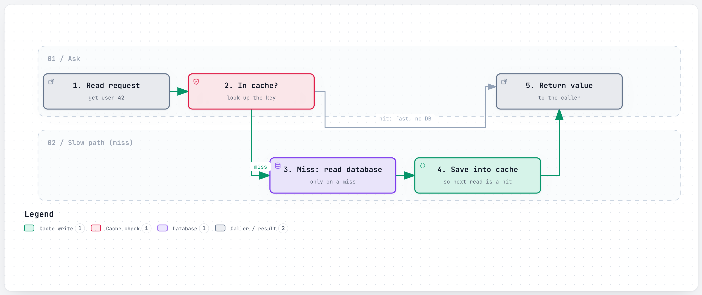
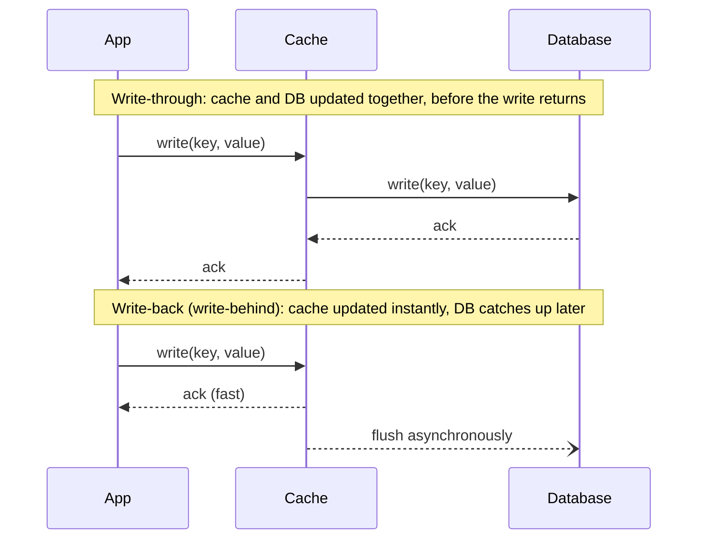
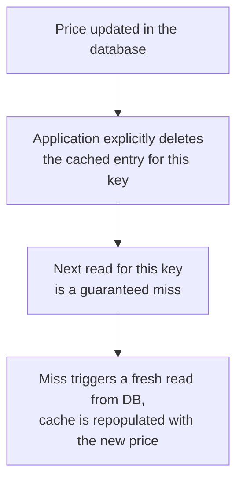
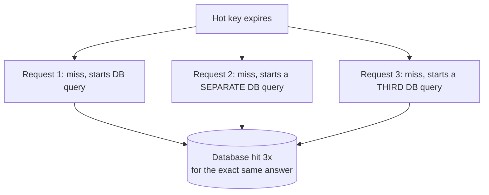

# Caching

> Keeping a copy of data somewhere faster to reach than where it really lives, so most requests never have to go the slow way.

## The problem it solves (a small story)

Imagine a librarian (your database) who is very thorough but very slow: every time someone asks "what's the capital of France," she walks to the archive basement, checks three reference books, and comes back with "Paris." That's fine once. It's not fine when a thousand people ask the same question every second — the basement trip is the bottleneck, not the answer.

So the librarian starts keeping a sticky note on her desk: "capital of France = Paris." Next time someone asks, she reads the sticky note in half a second instead of walking to the basement. That sticky note is a cache: a copy of an answer, kept somewhere much faster to reach than the original source, valid until something changes it (France, reassuringly, does not change capitals often — but user profiles and prices do, and that's where caching gets interesting).

Every big system in this repo hits this same wall: the "source of truth" database is durable and correct but too slow (or too expensive) to hit on every single request. Caching is the general answer to "make reads cheap without making the database lie." It shows up at wildly different layers of the stack — Netflix caches hot rows in memory in front of Cassandra, Slack caches a whole team's data at the network edge, and Instagram effectively "caches" media permanently on a CDN so its database never has to touch a photo's bytes at all. Different layers, same underlying trade: pay a little complexity and a little staleness risk, in exchange for not repeating slow, expensive work.

## How it works (step by step, with at least 2 Mermaid diagrams)

The most common pattern is **cache-aside** (also called lazy loading): the application, not the database, is responsible for keeping the cache filled.

<a href="https://alwintwk.github.io/big-tech-system-design/diagrams/concepts-caching-read-through.html">
  <picture>
    <source media="(prefers-color-scheme: dark)" srcset="../diagrams/concepts-caching-read-through.dark.png">
    
  </picture>
</a>

Click the diagram for the interactive version (zoom, dark mode, trace a path).

> **Why this matters:** the application only ever pays the "walk to the basement" cost once per key, not once per request for that key. Every subsequent request for user 42 is a cache hit, until something invalidates or expires it.

Step by step:
1. The application receives a read request for some key (a user ID, a product page). It doesn't know yet whether the answer is already sitting nearby or needs to be fetched the slow way.
2. It checks the cache first. A **hit** means the data is already sitting there, ready to return immediately — this is the fast path, and in a well-tuned system it's the overwhelming majority of requests.
3. A **miss** means the cache never had it, or it expired — the application falls back to the real database, paying the full latency cost this one time.
4. On a miss, the application writes what it just fetched into the cache before returning it, so the *next* request for that key is a hit instead of another miss.
5. Every cache entry usually carries a **TTL (time-to-live)** — an expiry timer — so stale data eventually falls out on its own even if nobody explicitly invalidates it, bounding how wrong the cache can ever be.

The trickier half of caching isn't reading, it's writing — deciding when a cache entry becomes wrong because the underlying data changed. Two common approaches:

> **Why this matters:** these two diagrams are the same operation ("write this value") with the durability guarantee moved to two different places. Write-through puts the guarantee in the database, immediately. Write-back puts the guarantee in the cache, temporarily, and promises the database will catch up — which is only safe if the cache itself can survive long enough to keep that promise.

Write-through is safer (the database is never behind the cache) but slower, since every write pays for both. Write-back is faster but risks losing the update if the cache dies before it flushes to the database — you're trusting a piece of memory with data the database doesn't have yet.

## Worked example

Say a product page gets 10,000 reads per second, but the underlying price only changes a few times a day. Without a cache, that's 10,000 database queries per second for data that's almost always identical to the query a moment before — mostly wasted work.

Add a cache-aside layer with a 60-second TTL: the very first request after a price change is a miss (one database query), and every other request in that 60-second window — potentially hundreds of thousands of them — is served from the cache without touching the database at all. The database's real load drops from "proportional to traffic" to "proportional to how often the underlying data actually changes," which is exactly the shift that makes a fixed-size database fleet able to serve an ever-growing amount of read traffic.

The one thing this buys you at a cost: for up to 60 seconds after a real price change, someone could still see the old price. Whether that's acceptable is a product decision, not a technical one — which is why TTL is a tunable knob, not a fixed constant.

A second, equally common scenario is **explicit invalidation on write**, used instead of (or alongside) a TTL when staleness has to be bounded more tightly than "wait for it to expire":

> **Why this matters:** a TTL bounds staleness by *time* ("stale for at most 60 seconds"); explicit invalidation bounds it by *event* ("stale for at most however long it takes the invalidation message to arrive"). The second is tighter, but only works if every code path that writes the underlying data remembers to also invalidate the cache — miss even one, and that entry can be wrong forever, which is exactly why many systems keep a TTL as a safety net even when they also invalidate explicitly.

A third everyday case is **negative caching** — caching the absence of something, not just its presence. Say a client repeatedly checks `GET /users/99999999` for a user ID that doesn't exist (a very common pattern for a mistyped or since-deleted ID). Without negative caching, every single one of those requests is a full, wasted database round-trip that returns "not found." With a short-TTL negative cache entry recording "user 99999999: not found," the second and subsequent checks are answered instantly from the cache — as long as the TTL is short enough that a user created moments later doesn't stay invisible for too long.

## Choosing between cache-aside, write-through, and write-back

A simple way to decide, for a given piece of data:

1. **Ask how often it's read versus written.** If reads vastly outnumber writes (a user's display name, a product description), almost any caching strategy pays off — cache-aside is usually the simplest starting point.
2. **Ask how expensive a stale read actually is.** If a slightly-out-of-date answer is harmless (a follower count), lean toward write-back or a longer TTL. If it's expensive (an account balance), lean toward write-through or skip caching that specific field entirely.
3. **Ask what happens if the cache node dies right now.** With cache-aside and write-through, nothing is lost — the database already has the truth. With write-back, whatever hasn't flushed yet is gone, so write-back is usually reserved for data where losing the last few seconds of updates is an acceptable, bounded risk.
4. **Only then, optimize for speed.** Write-back is the fastest for writes, cache-aside is the simplest for reads-turned-writes, and read-through hides the most complexity from application code — but none of these matter if step 2 already ruled out tolerating staleness for this particular piece of data.

## Variants / strategies

| Strategy | How | Pros | Cons |
|---|---|---|---|
| Cache-aside (lazy loading) | App checks cache first; on miss, reads DB and populates cache itself | Only caches what's actually requested; simple to reason about | First request for any key is always a slow "cold" miss; cache and DB can briefly disagree |
| Read-through | Cache sits in front of the DB and populates itself transparently on a miss | Application code doesn't need cache-management logic | Requires a caching layer that knows how to talk to the DB itself |
| Write-through | Every write goes to cache and DB together, synchronously | Cache is never stale relative to the DB | Every write pays the latency of both stores |
| Write-back (write-behind) | Write hits the cache immediately; DB is updated asynchronously later | Very fast writes | Data loss risk if the cache fails before flushing |
| TTL / eviction (LRU, LFU) | Entries expire after a fixed time, or get evicted when the cache is full, by "least recently/frequently used" | Bounds memory use automatically | Wrong TTL either serves stale data too long or evicts useful data too early |
| Negative caching | Cache the fact that something *doesn't* exist (e.g. "no user with this ID"), not just positive results | Stops a repeated, expensive "not found" lookup from hitting the DB every time | A short negative TTL is essential — otherwise something created moments later looks "not found" for too long |
| Request coalescing (single-flight) | Concurrent misses for the same key share one in-flight database query instead of each starting their own | Prevents a stampede from turning one expired key into N redundant queries | Needs per-key in-flight tracking, adding a small amount of coordination logic |

In practice, most systems combine two of these rather than picking just one: cache-aside for the common read path, plus a short TTL as a safety net in case an explicit invalidation is ever missed. Relying on TTL alone (no invalidation) is simpler to build but accepts a fixed staleness window on every write; relying on invalidation alone (no TTL) is fresher but means a missed invalidation can serve a wrong answer forever.

## Cache warming and the thundering herd

Two operational problems show up in almost every real cache deployment, beyond the basic read/write mechanics above.

**Cold starts.** A brand-new cache — freshly deployed, or one that just failed over to a new node — starts completely empty. Every single request in the first few moments is a guaranteed miss, which means the database briefly sees full, uncached traffic right at the moment the system just added a new piece of infrastructure. Some systems address this with **cache warming**: proactively pre-loading the most commonly requested keys before the cache is put into rotation, rather than waiting for organic traffic to slowly refill it one miss at a time.

**Thundering herd / cache stampede.** This happens when one very popular key expires, and many concurrent requests for that same key all miss at exactly the same moment:

Without any coordination, N concurrent requests for the same freshly-expired key trigger N identical, redundant database queries — all racing to compute and cache the exact same answer. The fix is **request coalescing** (sometimes called single-flight): the first miss for a key starts the real database query, and every other concurrent request for that same key waits on that *one* in-flight query instead of starting its own, then all of them share the single result once it comes back. This turns "N requests, N database hits" into "N requests, 1 database hit" for the specific case of a stampede on one key.

## Signals that you need a cache (and signals you don't)

Reach for a cache when:
- The same read happens far more often than the underlying data changes (a product page, a user's profile).
- A single expensive computation (an aggregation, a join across several tables) is repeated identically for many different callers.
- The system has a clear, measurable latency or database-load problem today — not a hypothetical one that might show up someday.

Be more careful, or skip it, when:
- The data changes on essentially every read (a live counter someone is actively watching).
- Correctness for this specific field is worth more than speed (a balance, an availability check).
- The access pattern is so spread out across so many distinct keys that a cache would mostly just evict things before they're ever reused — the "working set" doesn't fit no matter the cache's size.

## Where the companies in this repo use it

- **Netflix** puts extremely hot reads through **EVCache**, a layer built over memcached, specifically so the vast majority of reads never touch the durable Cassandra store behind it — reported at roughly two trillion requests a day across tens of thousands of memcached instances in 2016, a gap between "reads served" and "reads that hit the real database" that only a cache this aggressive can produce: [../companies/netflix.md#high-level-design](../companies/netflix.md#high-level-design)
- **Slack** deploys **Flannel**, an edge cache that serves reconnecting clients a slimmed-down snapshot of team data instead of the full blob — measured at roughly 7x smaller for a 1,500-user team and 44x smaller for a 32,000-user team, with the savings compounding as teams get bigger, and it stays current by holding its own live WebSocket back to the main region: [../companies/slack.md#flannel-solving-the-reconnect-storm-before-it-starts](../companies/slack.md#flannel-solving-the-reconnect-storm-before-it-starts)
- **Discord** ran a dedicated in-memory Read State cache/LRU that grew from tens of millions of entries to an 8-million-entry cache after a Rust rewrite, because "have you read this" is checked on nearly every connect, send, and read event — hundreds of thousands of times per second: [../companies/discord.md#go-to-rust-chasing-garbage-collection-out-of-read-states](../companies/discord.md#go-to-rust-chasing-garbage-collection-out-of-read-states)
- **Instagram** keeps photo and video bytes out of its databases entirely, serving them from object storage behind a CDN cache so the database tier only ever holds a pointer, not the bytes themselves — deliberately keeping large, rarely-changing blobs off the hot path of anything transactional: [../companies/instagram.md#media-storage-and-delivery](../companies/instagram.md#media-storage-and-delivery)
- **Airbnb** explicitly calls out the trade-off in the other direction: the one part of its system that must be strongly consistent (the booking/availability check) is kept off the cheap, eventually-consistent scaling tricks — including aggressive caching — that the rest of the system relies on, because a cached "yes it's available" answer is exactly how a double-booking would happen: [../companies/airbnb.md#availability-calendar](../companies/airbnb.md#availability-calendar)

## Common mistakes

- **Caching without an invalidation plan.** "There are only two hard things in Computer Science: cache invalidation and naming things" is a cliché for a reason — a cache that never gets told when the source changes just serves confidently wrong answers, indefinitely.
- **No TTL at all.** An entry with an infinite lifetime becomes a silent correctness bug the moment the underlying data changes and nobody remembers to explicitly clear it.
- **Caching the wrong thing.** Data that changes on every read (a live stock price, a real-time counter someone is staring at) gains little from caching and can actively mislead if served stale — caching helps most when reads vastly outnumber writes.
- **Treating the cache as durable storage.** Write-back caches especially: if the cache is the only place holding the newest value, losing the cache node loses the data, not just the speed.
- **Ignoring the "thundering herd."** When a hot key expires, many concurrent requests can all miss at once and all hammer the database simultaneously — worth coalescing those into a single upstream fetch instead of one per waiting reader.
- **Sizing the cache smaller than the actual working set.** If more distinct keys are genuinely needed than the cache can hold, no eviction policy fixes it — the cache thrashes, evicting things right before they're needed again.
- **Not distinguishing "not found" from "haven't checked yet."** Skipping negative caching means every lookup for something that doesn't exist repeats the full expensive round-trip every single time, forever.
- **No request coalescing on a stampede.** When a hot key expires, letting every concurrent miss independently query the database defeats the purpose of caching that key at all — one shared in-flight query for all of them is the fix.
- **Deploying a cold cache straight into full production traffic.** A freshly-started or freshly-failed-over cache with nothing in it yet means the database absorbs a brief spike of 100% miss traffic right when the system is least prepared for it — cache warming exists specifically to avoid this.

## Interview questions

Q1. What's the difference between cache-aside and write-through caching?

Cache-aside: the application manages the cache itself, populating it only on a read miss — writes usually go straight to the database and the stale cache entry is invalidated or left to expire. Write-through: every write updates the cache and the database together, synchronously, so the cache is never behind. Cache-aside is simpler and only caches what's actually read; write-through keeps things more consistent at the cost of slower writes.

Q2. When would you choose write-back over write-through?

When write latency matters more than the small risk of losing very recent writes — e.g., a high-volume counter or a queue draining asynchronously to disk. You accept that a crash between the cache write and the flush to the database can lose data, in exchange for writes that feel instant to the caller.

Q3. How do you stop a hot key from overwhelming your cache?

Replicate the hot value across more cache nodes or a local in-process cache in front of the shared one, and coalesce many identical concurrent misses into a single upstream fetch (sometimes called "request collapsing") instead of one database hit per waiting client.

Q4. Why might a system deliberately choose NOT to cache something?

Because the data changes too fast to make caching pay off (staleness would be visible immediately), or because correctness matters more than speed for that specific read — e.g., checking "has this seat already been booked" needs the real, current answer, not a cached one that might be a few seconds old.

Q5. What's the risk of an eviction policy like LRU on a workload with a large "working set"?

If more distinct keys are actively needed than the cache can hold, LRU keeps evicting entries that are about to be requested again — a "cache-unfriendly" access pattern where the hit rate collapses no matter how the eviction policy is tuned, because the problem isn't the policy, it's that the cache is simply too small for the workload.

## Related concepts

- [Load balancing](load-balancing.md) — spreads requests across servers; often paired with caching at the edge
- [CDN](cdn.md) — caching applied specifically to static/media content, close to the end user
- [Replication](replication.md) — copies data for durability/availability, a different goal from caching's speed
- [CAP theorem and consistency](cap-and-consistency.md) — caching is a deliberate trade of consistency for speed
- [Message queues and logs](message-queues-and-logs.md) — cache-invalidation events are often propagated through a queue or log rather than a direct call

## Further reading

- [Cache (computing) — Wikipedia](https://en.wikipedia.org/wiki/Cache_(computing))
- [System Design Primer — caching section](https://github.com/donnemartin/system-design-primer)

Back to the librarian: a cache is just a sticky note, but every design decision above is really just deciding how big the note is, how long it stays taped to the desk, and what happens the moment the real answer in the basement changes.
