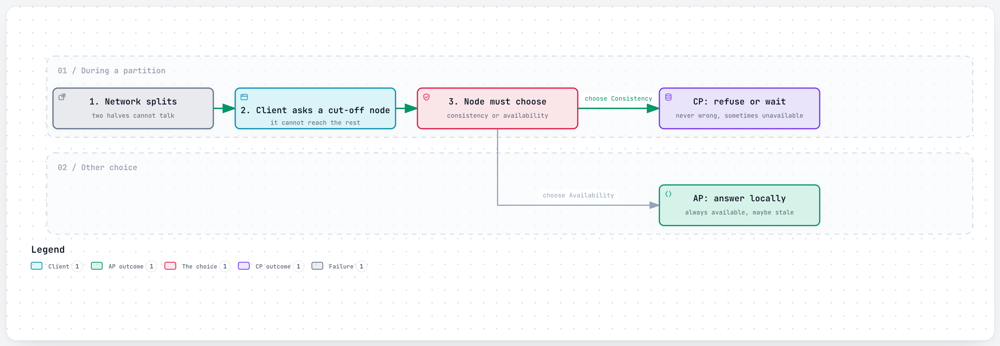
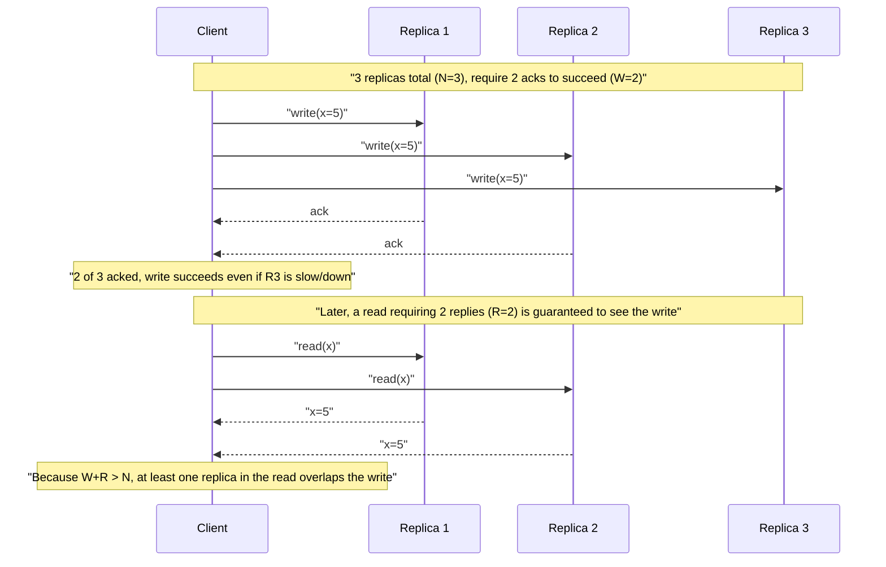
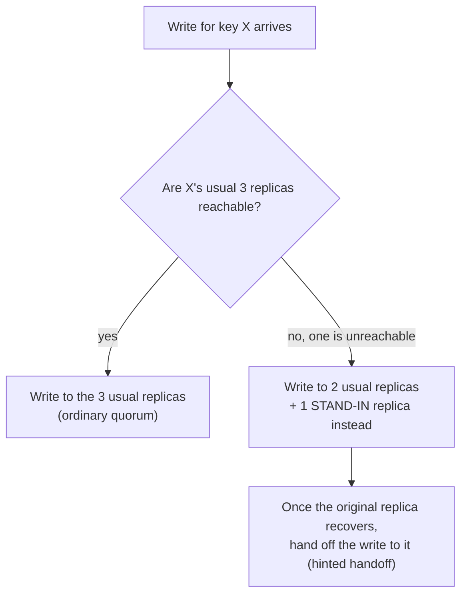

# CAP Theorem and Consistency

> When part of a distributed system can't talk to the rest, it has to choose between answering with possibly-stale data or not answering at all — it can't always do both.

## The problem it solves (a small story)

Picture two ATMs for the same bank, one in New York and one in Tokyo, that normally sync balances with each other every second. One day the transatlantic cable between them gets cut — a **network partition**. Someone walks up to the Tokyo ATM and asks to withdraw $200.

The machine has exactly two honest choices. It can say "sorry, I can't reach New York to confirm your balance, try again later" — refusing to answer rather than risk being wrong (choosing **consistency** over **availability**). Or it can say "here's your $200" based on the last balance it saw before the cable died, even though New York might have let someone withdraw from the same account in the meantime (choosing **availability** over consistency, and accepting the small risk of being wrong). What it cannot do is guarantee both a perfectly correct answer *and* an instant answer while the two machines can't talk to each other. That forced choice, during a partition, is the entire content of the **CAP theorem**.

Almost every distributed system in this repo has some piece that had to make exactly this call — usually by giving different guarantees to different kinds of data, rather than picking one answer for everything. Uber's dispatch system, Airbnb's booking calendar, and Twitter/X's Manhattan database all make this choice explicitly and differently, for different pieces of their own data.

## How it works (step by step, with at least 2 Mermaid diagrams)

<a href="https://alwintwk.github.io/big-tech-system-design/diagrams/concepts-cap-partition-choice.html">
  <picture>
    <source media="(prefers-color-scheme: dark)" srcset="../diagrams/concepts-cap-partition-choice.dark.png">
    
  </picture>
</a>

Click the diagram for the interactive version (zoom, dark mode, trace a path).

> **Why this matters:** neither branch is "the right answer" in general — a CP system is right for a bank balance, an AP system is right for a driver's live GPS position. The theorem doesn't tell you which to pick; it tells you that you must.

Step by step:
1. **C**onsistency here means every read sees the most recent write, everywhere — no stale answers, ever.
2. **A**vailability means every request gets a response, even if it might be a little behind.
3. **P**artition tolerance means the system keeps working even when some nodes can't reach others — and in any real distributed system, a partition is a "when," not an "if."
4. Because partitions *will* happen, the real choice CAP describes is between C and A *during* a partition — outside of a partition, you can often have both.
5. Most real systems don't pick one mode globally; they pick per kind of data, giving strong consistency to the data where being wrong is expensive (money, "is this seat still available") and eventual consistency to data where staleness is cheap (a view count, a search index).

Systems that want strong consistency without a single point of failure often use a **quorum**: instead of one authoritative copy, a majority of replicas must agree.

> **Why this matters:** the client never had to wait for R3, and the read never had to wait for R3 either — quorum reads/writes buy strong consistency while tolerating one replica being slow or down, instead of requiring the entire cluster to be healthy for every single operation.

If a write needs `W` acknowledgments and a read needs `R` replies, out of `N` total replicas, choosing `W + R > N` guarantees the read and write sets always overlap by at least one replica — so a read can never completely miss the latest write. That's how quorum-based systems get strong consistency without needing *every* replica to be up at once.

## Worked example

A social app stores two things about a post: its **text content** and its **like count**. Both live in the same underlying database, but the app deliberately asks for different consistency guarantees on each.

For the like count, every read is served from whichever replica is closest/fastest, with no coordination at all — if it's off by a few, for a second, while replicas catch up, nobody notices or cares. This is the AP choice: always answer, accept brief staleness.

For the post's text content right after it's edited, the *author's own* next read should show the edit — nothing is more confusing than editing a post and immediately seeing the old version. So the app routes the author's own immediate re-read back to the leader (or waits for quorum), even though it routes *other* users' reads to any nearby replica. This is a narrower, cheaper form of strong consistency — "read your own writes" — applied only where it's actually needed, instead of paying the coordination cost on every single read of every single post.

## Where the "choose per kind of data" idea actually pays off

A quick decision framework, in the order real teams tend to apply it:
1. **Would a stale read cause real, meaningful harm?** (Double-booking, double-spending, a security decision.) If yes, lean CP for that specific piece of data.
2. **Would a stale read just be mildly annoying, and self-correct within seconds?** (A view count, a "seen" indicator.) If yes, lean AP — the cost of strong consistency isn't worth paying here.
3. **Does the same user need to see their own recent action reflected immediately, even if other users can tolerate a short delay?** Consider a narrower read-your-writes guarantee instead of full strong consistency for everyone.
4. **Is this decision going to be made once, or does it need to be re-evaluated as the product changes?** Airbnb's own split (search vs. booking) suggests revisiting this any time a "read-only, informational" feature quietly grows into something people rely on for a real decision.

## Signals for choosing CP vs. AP for a given piece of data

Lean **CP** when:
- Two people could plausibly act on the same scarce resource at once (a seat, a room-night, an account balance), and a stale "yes" would let both succeed.
- The cost of briefly refusing service is much lower than the cost of a wrong answer.
- A regulator, contract, or basic fairness expectation requires the system to never show two people the same scarce thing as available.

Lean **AP** when:
- The data is informational, not decision-critical (a view count, a "last seen" timestamp).
- Users actively expect the system to always respond, even during a bad network day (a live location feed, a dispatch system).
- The data converges naturally and cheaply once connectivity is restored.
- A short, bounded delay in the answer is acceptable, but an outright refusal to answer is not.

## Variants / strategies

| Strategy | How | Pros | Cons |
|---|---|---|---|
| Strong consistency | Every read reflects the most recent acknowledged write, system-wide | No stale reads, ever; simplest to reason about | Slower, and can refuse to answer during a partition (CP) |
| Eventual consistency | Replicas may briefly disagree, but converge to the same value once writes stop | Fast, always available (AP); scales easily | A read right after a write can return an old value |
| Quorum reads/writes (`W + R > N`) | Require a majority of replicas to participate in each read/write | Strong consistency without a single always-available node | Slower than talking to one replica; still unavailable if too many replicas are down |
| Read-your-writes consistency | A client always sees its *own* writes immediately, even if other clients might not yet | Feels consistent to the user who made the change | Doesn't fix staleness for other users reading the same data |
| Tunable consistency (per-operation) | The same database offers both a cheap eventual mode and an expensive strong mode, chosen per call | One system serves very different needs (a view counter vs. a payment) | More operational complexity than picking one model for everything |
| Causal consistency | Writes that are causally related (a reply to a comment) are seen in the same order by everyone; unrelated writes can reorder | Cheaper than full strong consistency, but avoids obviously nonsensical orderings | Harder to implement correctly than either extreme |
| Sloppy quorum + hinted handoff | Accept a write from any available node during an outage, reconcile later | Maximizes availability during partial outages | "Write succeeded" doesn't mean it reached the usual replica set yet |
| Session/client-pinned consistency | A client is pinned to one replica (or the leader) for a session, so its own view is at least internally consistent | Simple mental model for the pinned client | Doesn't help a *different* client reading the same data concurrently |

## Sloppy quorum in practice

> **Why this matters:** a strict quorum would simply refuse this write if too many of key X's *specific* replicas are unreachable, even if the cluster overall has plenty of healthy capacity elsewhere. A sloppy quorum accepts the write anyway, using whichever nodes are actually reachable — favoring availability further, at the cost of a reconciliation step once the real replica comes back.

## Common gotchas with quorum math

- Choosing `W=1, R=1` with `N=3` is fast but gives you neither strong consistency nor much fault tolerance — it's really just "ask one replica and hope."
- Choosing `W=N` (every replica must ack every write) gives strong consistency but means losing even one replica blocks all writes — you've traded away the availability quorum systems are supposed to preserve.
- The sweet spot most systems land on is `W` and `R` both set to a majority (e.g. `W=2, R=2` with `N=3`), which satisfies `W+R > N` while still tolerating one replica being down for either operation.
- A **sloppy quorum** (accepting writes from nodes outside the usual replica set during an outage, then reconciling later) trades a stricter guarantee for even higher availability — useful, but it means "the write succeeded" no longer implies it went to the *usual* replicas.

## Where the companies in this repo use it

- **Uber**'s Ringpop, which tracks live driver locations and dispatch state, is explicitly built **AP, not CP** — "trading consistency for availability" — because a slightly stale driver position is fine, but refusing to accept a location update is not; Uber moved the parts that do need strong, transactional guarantees to Google Cloud Spanner instead: [../companies/uber.md#ringpop-the-self-organizing-cluster](../companies/uber.md#ringpop-the-self-organizing-cluster)
- **Airbnb** deliberately splits its own guarantees: search results are allowed to be eventually consistent (a stale listing just shows "no longer available"), but the availability calendar that decides "has this night already been booked" is kept strongly consistent, because that's the one place being wrong means double-booking or a double charge: [../companies/airbnb.md#availability-calendar](../companies/airbnb.md#availability-calendar)
- **Twitter/X** built Manhattan as one shared database offering two different consistency APIs to different tenants — a cheap eventually-consistent default, and a strongly-consistent, quorum-based **Global CAS** for operations (like a direct message send) where a stale read would be user-visible and wrong: [../companies/twitter-x.md#manhattan-one-distributed-database-many-tenants-two-consistency-models](../companies/twitter-x.md#manhattan-one-distributed-database-many-tenants-two-consistency-models)
- **Instagram** treats eventual consistency as acceptable for social data — a like count a few seconds stale, or a feed briefly out of order, doesn't hurt anyone — which is exactly what lets it use Cassandra's tunable, non-linearizable consistency model for feed and activity data: [../companies/instagram.md#requirements](../companies/instagram.md#requirements)
- **Dropbox**'s Edgestore is built strong-consistency-by-default for metadata (names, folders, permissions), by physically colocating related data on one shard — the trade-off being that every write has to invalidate caches, since the system can't lean on the cheap eventually-consistent scaling tricks the rest of a typical system relies on: [../companies/dropbox.md#edgestore](../companies/dropbox.md#edgestore)
- **YouTube** draws the same line explicitly in its own interview guidance: anywhere a briefly stale read is harmless (view counts, like counts) can skip strong consistency, but never on the write/ownership path that decides who controls a resource: [../companies/youtube.md#interview-takeaways](../companies/youtube.md#interview-takeaways)

## Common mistakes

- **Treating CAP as "pick one of three forever."** Partition tolerance isn't really optional in a real distributed system — the meaningful choice is C vs. A, and only *during* an actual partition; plenty of systems behave as if they have both most of the time.
- **Applying one consistency model to an entire system.** The strongest real-world designs (Airbnb, Twitter/X here) pick per kind of data, not once for the whole product.
- **Forgetting that quorums can still be unavailable.** `W + R > N` guarantees consistency, not availability — if enough replicas are down that a quorum can't be reached, the system still can't serve that request.
- **Assuming eventual consistency means "eventually, soon."** There's no bound in the name — under load or during a partition, "eventual" can mean much longer than users will tolerate for anything they're staring at.
- **Reading from a replica and assuming it's current.** Without an explicit read-your-writes or quorum-read guarantee, a follower can be meaningfully behind the leader.
- **Setting `W` and `R` without checking `W + R > N`.** It's easy to pick values that feel reasonable in isolation (say, `W=1, R=1`) without realizing they don't actually guarantee the read/write overlap the quorum approach depends on.
- **Never revisiting the choice as a feature's importance grows.** A field that started as "just informational" can quietly become something users rely on for a real decision, without anyone updating its consistency guarantee to match.
- **Ignoring sloppy quorums' reconciliation cost.** Accepting writes outside the normal replica set buys availability now, but someone has to actually merge those writes back in later — skipping that step quietly loses them.
- **Assuming the client can't help.** Client-side techniques (version vectors, conditional writes) can sometimes detect a stale read before acting on it, instead of pushing the entire consistency burden onto the server.

## Interview questions

Q1. State the CAP theorem in your own words.

A distributed system that's split by a network partition can guarantee that every request gets an up-to-date, correct answer (consistency), or that every request gets *some* answer even if it might be stale (availability) — but not both at the same time, for the part of the system that's cut off. Partition tolerance is assumed because real networks do partition.

A common follow-up: outside of an actual partition, most systems aim for both — CAP is specifically about the forced trade-off during the partition itself, not a permanent state of affairs.

Q2. Give an example of data that should be strongly consistent, and one that's fine being eventually consistent.

Strong: "has this hotel room already been booked" — a stale "yes it's available" can lead to a real double-booking. Eventual: a "likes" count on a post — if it's off by a few for a couple of seconds, nobody is harmed, and it converges to the right number shortly anyway.

Q3. How does a quorum let a system be strongly consistent without needing every replica online?

By requiring only a majority (a quorum) of replicas to participate in each read and write, and choosing quorum sizes so that `W + R > N` — guaranteeing any read set and any write set share at least one replica in common, so a read can never completely miss the latest acknowledged write, while still tolerating some replicas being down.

The most common real-world choice is both `W` and `R` set to a bare majority of `N`, which satisfies the overlap condition while tolerating the largest possible number of simultaneously-down replicas.

Q4. Why might one company build a database offering both eventual and strong consistency instead of just picking one?

Because different data inside the same product has genuinely different needs — Twitter/X's Manhattan is the clear example here: a view counter and a direct-message inbox are both "just data," but only one of them can tolerate a stale read, so a single multi-tenant database offers both APIs rather than forcing every team to either over-pay for consistency they don't need or under-pay for consistency they do.

This also means one team's choice doesn't force every other team's hand — each tenant of the shared database picks its own trade-off.

Q5. What's the practical difference between "AP" and "CP" for an on-call engineer during an actual network partition?

A CP system will start rejecting or blocking requests on the minority side of the partition to avoid serving stale/incorrect data — visible as errors or timeouts. An AP system keeps answering on both sides, which avoids an outage but means the two sides can drift apart and will need reconciliation (read-repair, conflict resolution) once the partition heals.

Practically: a CP incident looks like an outage; an AP incident looks fine in the moment and shows up later as a data-reconciliation problem.

## Related concepts

- [Replication](replication.md) — replication lag is the underlying mechanism that makes "eventual" consistency eventual
- [Sharding](sharding.md) — cross-shard operations often force an explicit consistency trade-off
- [Consistent hashing](consistent-hashing.md) — used by AP systems like Uber's Ringpop to route requests without a strongly-consistent coordinator
- [Idempotency](idempotency.md) — a way to make retries safe under the very uncertainty CAP describes
- [Geo-indexing](geo-indexing.md) — Uber's geo-index deliberately favors availability over strict consistency for the same reason Ringpop does
- [Message queues and logs](message-queues-and-logs.md) — a durable log is one common building block for reconciling an AP system's diverged replicas after a partition heals

## Further reading

- [CAP theorem — Wikipedia](https://en.wikipedia.org/wiki/CAP_theorem)
- [Eventual consistency — Wikipedia](https://en.wikipedia.org/wiki/Eventual_consistency)

Back to the two ATMs: CAP never tells you which one should have answered. It only guarantees that whichever one did, it was making a choice, not dodging one.

Most outages people remember as "the database went down" were actually this choice, made under pressure, by a system nobody had explicitly told which way to fall.
