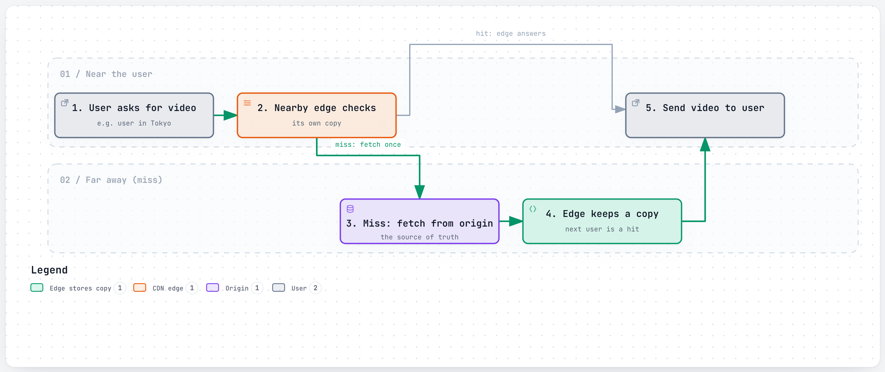
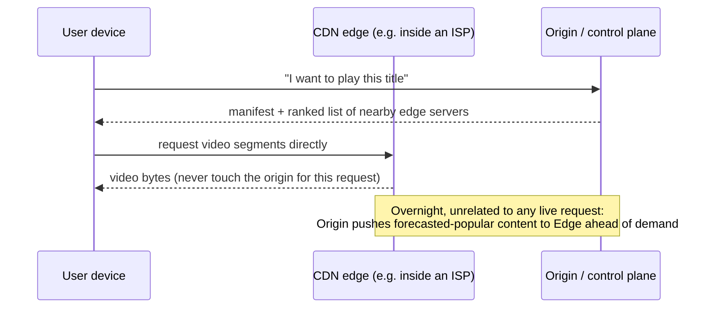
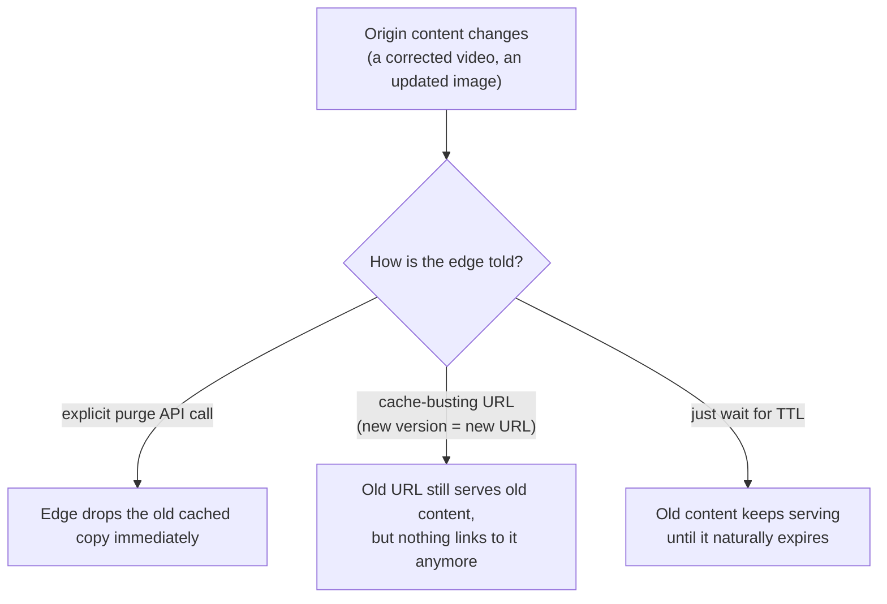
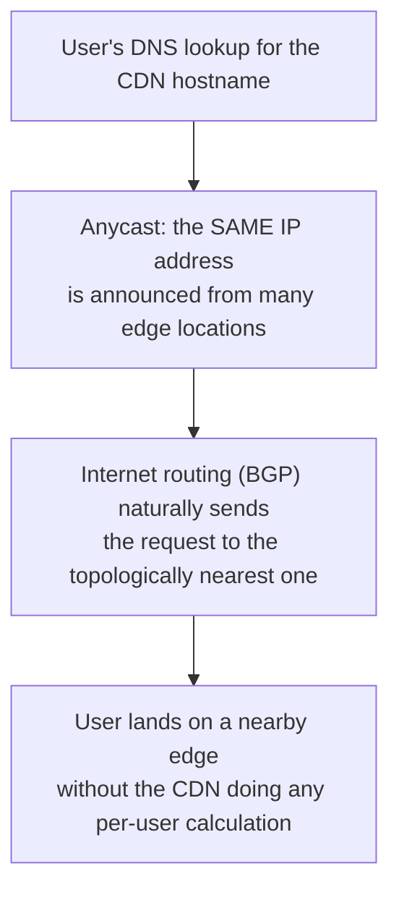
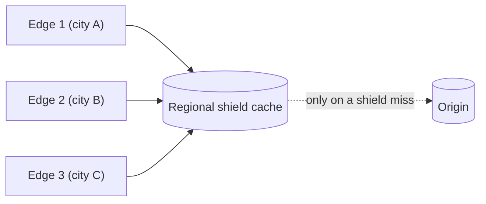

# CDN (Content Delivery Network)

> A network of servers spread around the world that keep copies of your content close to users, so nobody has to fetch a video from across an ocean.

## The problem it solves (a small story)

Imagine a single bakery in Paris that ships bread to customers everywhere, including Tokyo. Every loaf travels the same 10,000km trip, takes days, and the one bakery's ovens have to keep up with orders from the entire planet. It works badly for everyone far from Paris, and terribly the moment a shipping route gets congested.

The obvious fix is to open small satellite bakeries — really just warm-holding stations, not full bakeries — in Tokyo, São Paulo, and Lagos, each stocked overnight with whichever breads that city actually orders most. A Tokyo customer now gets bread from Tokyo, not Paris, and the original Paris bakery only has to handle what nobody nearby already has ready. That's a CDN: instead of every request traveling back to one origin server, cached copies live at "edge" locations close to where they're actually requested, and only a cache miss (or something intentionally uncacheable) goes all the way back to the source.

This matters most for large, unchanging files — video, images, audio — which is exactly the content that dominates Netflix, YouTube, Spotify, and Instagram's traffic. Netflix's own numbers make the scale of the shift concrete: streaming traffic went from about 5% served by its own CDN at launch to roughly 95% delivered directly from inside ISP networks within about six years.

## How it works (step by step, with at least 2 Mermaid diagrams)

<a href="https://alwintwk.github.io/big-tech-system-design/diagrams/concepts-cdn-edge-pull.html">
  <picture>
    <source media="(prefers-color-scheme: dark)" srcset="../diagrams/concepts-cdn-edge-pull.dark.png">
    
  </picture>
</a>

Click the diagram for the interactive version (zoom, dark mode, trace a path).

> **Why this matters:** every user in Tokyo after the first one benefits from that first user's cache miss — the edge server only ever needs to fetch a given piece of content from the origin once, no matter how many thousands of local requests follow.

Step by step:
*(DNS or anycast routing has already pointed the user toward a nearby edge, before this specific request even happens — see below.)*

1. A user requests a piece of content (a video segment, an image, an audio chunk).
2. Their request is routed (often by DNS or an anycast IP) to the *nearest* edge server, not the origin.
3. If that edge already has the content cached (a **hit**), it serves it directly — no trip back to the origin at all.
4. If it doesn't (a **miss**), the edge fetches it once from the origin, serves the user, and caches it for the next request from that region.
5. Content that's expected to be popular can also be **pre-filled** ahead of time (pushed to edges before anyone asks), rather than waiting for the first request to trigger a fetch.

> **Why this matters:** the origin's only job here is deciding *what* and *where* — it never actually sees the video bytes flow to this particular user. That separation is what lets the origin (the "control plane") and the delivery network (the "data plane") scale, fail, and deploy completely independently of each other.

The control plane (deciding *what* to send and *which* edge to use) is often kept entirely separate from the data plane (actually moving the bytes) — Netflix's split between its AWS-based control plane and its Open Connect delivery network is the clearest example of this in the repo.

## Worked example

A new episode drops at midnight. Netflix's control plane already forecasted which regions would want it most and pushed it overnight to Open Connect Appliances sitting inside major ISPs in those regions — before a single viewer pressed play. At release, a viewer in a city with a well-stocked appliance gets nearly every video segment as a cache hit, served from inside their own ISP's network. A viewer in a smaller, less-forecasted region might see more cache misses at first, with the appliance fetching from a regional hub and caching as it goes — by the second or third viewer in that same region, those same segments are now local hits too.

Contrast that with a live, unscheduled event: nobody can forecast which exact seconds of video will be popular ahead of time, because it hasn't happened yet. This is exactly why proactive fill works beautifully for a fixed, forecastable catalog and struggles for genuinely live, unpredictable content — the "prep the bakery overnight" trick only works when you know what people will order tomorrow.

Live events instead lean harder on reactive caching and a shield tier, since the very first viewers anywhere are guaranteed to be cache misses no matter how good the forecast is.

## Purging and invalidating cached content

An explicit purge is the fastest way to force freshness everywhere, but it's an extra API call every content owner has to remember to make. A cache-busting URL (embedding a version or hash in the path) sidesteps the problem entirely — the "old" URL still technically has stale content cached, but since nothing points to it anymore, nobody ever asks for it again. Relying purely on a short TTL is the simplest option operationally, at the cost of a bounded window where genuinely stale content can still be served.

Most production systems combine two of these: cache-busting URLs for anything with a natural version number (a build, a video re-encode), and a short TTL as the safety net for everything else.

## Signals that you need a CDN (and signals you don't)

Reach for a CDN when:
- The same large, mostly-unchanging content (video, images, static assets) is requested repeatedly by users spread across many different geographic regions.
- Round-trip network latency to one central origin is a measurable, real part of your users' experience.
- Origin bandwidth cost or load is a genuine bottleneck, not a hypothetical one.
- Peak demand is large enough that even a modest cache hit rate meaningfully changes origin capacity planning.

Be more careful, or skip it, when:
- Content is small, rarely requested, or changes on essentially every request — there's little for a cache to actually hold onto.
- Users are geographically concentrated near the origin already, so the latency savings would be minimal.
- Content is deeply personalized per request in a way that makes it hard to safely cache and share across users at all.
- A single origin, or a small existing footprint, already comfortably serves current traffic with acceptable latency.

## How a request finds its nearest edge

> **Why this matters:** anycast pushes the "which edge is closest" decision down into ordinary internet routing infrastructure, rather than requiring the CDN to track every user's location and make an explicit choice. It's not always perfectly optimal (routing "nearest" isn't always geographically nearest), but it's simple, fast, and needs no per-request computation from the CDN operator.

## Multi-tier caching: edge plus a regional shield

Large CDNs often add a middle tier between the edge and the origin, sometimes called a **shield** or **mid-tier cache**:

Without a shield, three edges all missing on the same newly-popular piece of content would send three separate requests straight to the origin. With a shield sitting between them, only the *first* miss among all three edges actually reaches the origin — the shield catches it, caches it once, and serves the other two edges' misses from itself. This matters most in the first few moments after something new becomes popular, when many edges might miss on it nearly simultaneously.

## Variants / strategies

| Strategy | How | Pros | Cons |
|---|---|---|---|
| Third-party CDN (Akamai, Fastly, Cloudflare) | Rent edge capacity and network from a vendor | No hardware to own or operate; fast to adopt | Shares priority with the vendor's other customers; less control over placement |
| Self-built CDN (e.g. Netflix's Open Connect) | Design, ship, and operate your own appliances, often placed for free inside ISP networks | Full control over placement and what gets pre-filled; can be cheaper at extreme scale | Enormous capital and logistics cost; you own the operations |
| Reactive caching (pull) | Edge fetches and caches content only after the first real request for it | Simple; never wastes space caching something nobody wants | The first request from any region is always a slow cache miss |
| Proactive fill (push) | Content is pushed to edges ahead of demand, based on a forecast of what a region will want | Much higher offload — most requests are hits from the start | Only works when demand is genuinely predictable (a fixed catalog); breaks down for unpredictable spikes like live events |
| Peering / ISP-embedded appliances | Physical delivery hardware placed directly inside an ISP's own network | Bytes never cross the open internet for that ISP's users; very low latency | Requires real-world logistics and negotiated relationships with each ISP |
| Multi-tier (edge + regional shield) | A middle caching tier absorbs simultaneous misses from many edges before they reach the origin | Protects the origin from a thundering-herd of near-simultaneous misses on newly popular content | An extra hop on every genuine cache miss |
| Anycast edge selection | The same IP is announced from many locations; internet routing sends each user to a topologically nearby one | No per-user computation needed to pick an edge | "Nearest" by routing metrics isn't always "nearest" geographically |

## Where the companies in this repo use it

- **Netflix** built its own purpose-built CDN, **Open Connect** — appliances racked for free inside ISP networks, proactively filled overnight with the catalog that ISP's users are forecast to want, rather than reactively caching whatever gets requested first: [../companies/netflix.md#open-connect-placement-fill-and-steering](../companies/netflix.md#open-connect-placement-fill-and-steering)
- **YouTube** serves video from **Google Global Cache** boxes that often sit inside a viewer's own ISP's network, so bytes flow from inside that network instead of crossing the open internet back to Google: [../companies/youtube.md#cdn-and-edge-delivery-google-global-cache-and-peering](../companies/youtube.md#cdn-and-edge-delivery-google-global-cache-and-peering)
- **Spotify** ran audio delivery on a multi-CDN setup (Akamai, AWS, and Fastly) that already worked well; a client fetching just the next few seconds of pre-encoded audio via an HTTP range request, served from a nearby Fastly edge cache, is a plausible reference design Spotify's own posts don't actually confirm. What changed by 2020 was consolidating everything else — images, client updates, previously served straight from S3/GCS buckets — onto Fastly too, via an internal tool called SquadCDN, so one team could finally see the whole request path: [../companies/spotify.md#cdn-and-audio-delivery-getting-bytes-to-a-phone-in-under-a-second](../companies/spotify.md#cdn-and-audio-delivery-getting-bytes-to-a-phone-in-under-a-second)
- **Instagram** keeps photo and video bytes entirely off its application servers, serving them from object storage behind a CDN so the database and app tier never touch large media blobs at all: [../companies/instagram.md#media-storage-and-delivery](../companies/instagram.md#media-storage-and-delivery)
- **WhatsApp** rides on existing CDN infrastructure for its calling relay layer, rather than building a separate global network just for real-time call routing: [../companies/whatsapp.md#calling-relay-infrastructure-riding-on-the-cdn](../companies/whatsapp.md#calling-relay-infrastructure-riding-on-the-cdn)
- **Netflix** frames the same idea from the flip side of a hard requirement: at launch only about 5% of streaming traffic ran over its own CDN, growing to roughly 95% delivered directly from inside ISP networks within about six years, as Open Connect displaced third-party CDN vendors: [../companies/netflix.md#how-it-evolved](../companies/netflix.md#how-it-evolved)

## Common mistakes

- **Caching content that changes per-user or per-request.** A CDN edge caches by URL — personalizing that URL's response per user without accounting for it means either wrongly caching one user's private data for another, or wrongly disabling caching for content that could have been shared.
- **No cache invalidation path.** If the origin changes a file, edges need a way to learn that (a cache-busting URL, a purge API, a short TTL) — otherwise stale content quietly persists at the edge past its useful life.
- **Assuming a CDN removes the need to think about the origin.** Every cache miss still hits the origin — a big enough spike in uncacheable or rarely-requested content can still overwhelm it.
- **Confusing "CDN" with "caching" in general.** A CDN is caching applied specifically to network-edge placement for many geographically distributed users; the same caching ideas ([caching](caching.md)) also apply inside a single data center, which is a different problem with different trade-offs.
- **Underestimating unpredictable demand.** Proactive fill only works when demand is forecastable — Netflix's own docs note that live events stress this model differently, since a real-time audience spike can't be pre-filled the night before.
- **Forgetting that purges aren't instant everywhere.** A purge API call still has to propagate to every edge location — assuming global, immediate consistency the moment a purge is issued can be wrong by seconds or longer.
- **Not measuring hit rate.** Without visibility into how often edges actually serve from cache versus falling back to the origin, it's impossible to tell whether the CDN is actually doing its job for a given piece of content.
- **No shield tier for a large edge fleet.** Many edges missing on the same newly-popular content at once can hammer the origin with near-duplicate requests — a shield tier absorbs that instead.
- **Assuming anycast always finds the true nearest edge.** Internet routing optimizes for its own metrics, not literal geographic distance — "nearest" by BGP routing and "nearest" on a map aren't always the same edge.

## Interview questions

Q1. What's the difference between a CDN cache hit and a cache miss, and why does it matter?

A hit means the edge server already has the requested content and serves it directly, with no trip to the origin — fast, and it offloads the origin. A miss means the edge has to fetch from the origin first, which is slower and puts load back on the origin — the whole point of a CDN is maximizing the hit rate.

A multi-tier design (edge plus a regional shield) exists specifically to keep a burst of simultaneous misses from all reaching the origin at once.

Q2. Why would a company build its own CDN instead of paying a third-party vendor?

At extreme scale and with a fairly predictable catalog, owning the hardware lets you control placement (including racking appliances for free directly inside ISP networks) and proactively pre-fill content based on demand forecasts, rather than sharing a vendor's shared capacity and priorities with every other customer on it — Netflix's Open Connect is the standard example, at the cost of real capital and operational investment.

Netflix's own six-year timeline from 5% to roughly 95% self-served traffic is a useful number to cite for just how large this shift can eventually become.

Q3. What kind of content is a bad fit for CDN caching?

Content that's different per request or per user and can't be safely shared (a personalized API response, anything with side effects like a payment), and content that changes so quickly that caching it would serve stale data users would immediately notice (a live, second-by-second score).

A useful test: could two different users, at the same moment, safely be served the exact same bytes for this URL? If not, it doesn't belong in a shared edge cache as-is.

Q4. Why might a video-streaming company separate its "control plane" from its "data plane"?

So the system deciding *what* to play and *from where* (authentication, recommendations, manifest selection) can scale, fail, and deploy independently from the system that actually moves the video bytes — Netflix's split between AWS-hosted control-plane services and the separate Open Connect delivery network means an AWS region issue doesn't have to take down in-progress video delivery.

This is a specific instance of a general pattern: separate the decision from the execution whenever the two need to fail independently.

Q5. What's the trade-off between reactive (pull) and proactive (push) CDN filling?

Reactive/pull caching only stores what's actually been requested, so it never wastes space, but the very first request from any region is always a slow miss. Proactive/push filling pre-loads forecasted-popular content ahead of demand for a much higher hit rate from the start, but only works when demand is predictable enough to forecast — it breaks down for genuinely unpredictable spikes.

Many real systems use both: proactive fill for the known catalog, reactive caching as the fallback for anything the forecast missed.

## Related concepts

- [Caching](caching.md) — a CDN is caching applied specifically at the network edge, close to users
- [Load balancing](load-balancing.md) — CDNs route requests to the nearest/healthiest edge, a geographic form of load balancing
- [Replication](replication.md) — content is effectively replicated across many edge locations
- [Geo-indexing](geo-indexing.md) — both rely on organizing something by physical/network proximity to answer "what's nearest"
- [Consistent hashing](consistent-hashing.md) — a way an individual edge or shield tier can decide internally which of its own nodes should cache a given key

## Further reading

- [Content delivery network — Wikipedia](https://en.wikipedia.org/wiki/Content_delivery_network)

Back to the satellite bakeries: a CDN never bakes new bread. It just makes sure the bread that's already popular is never more than a short walk away.

The one thing no satellite bakery can do is guess right about bread nobody has ordered yet — that's the live-event problem in a nutshell.
