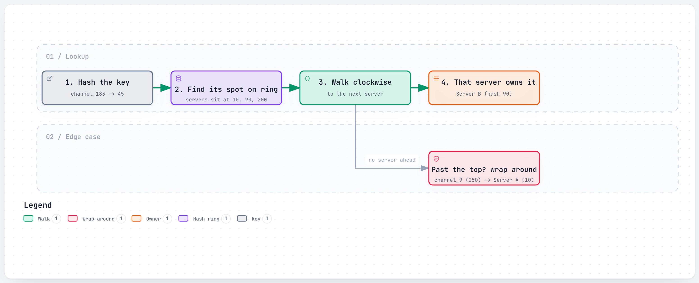
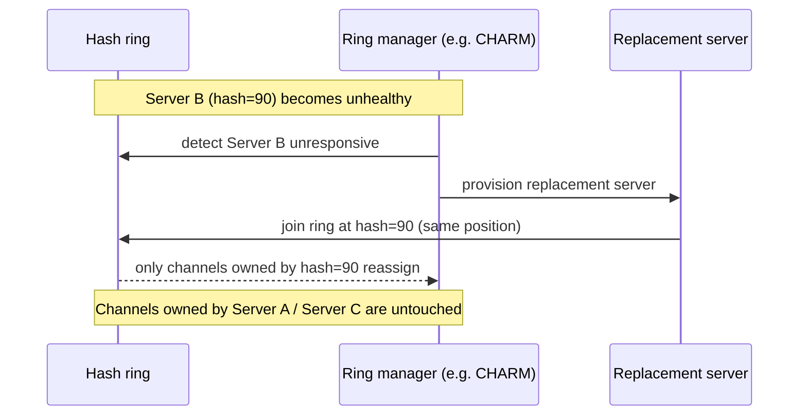
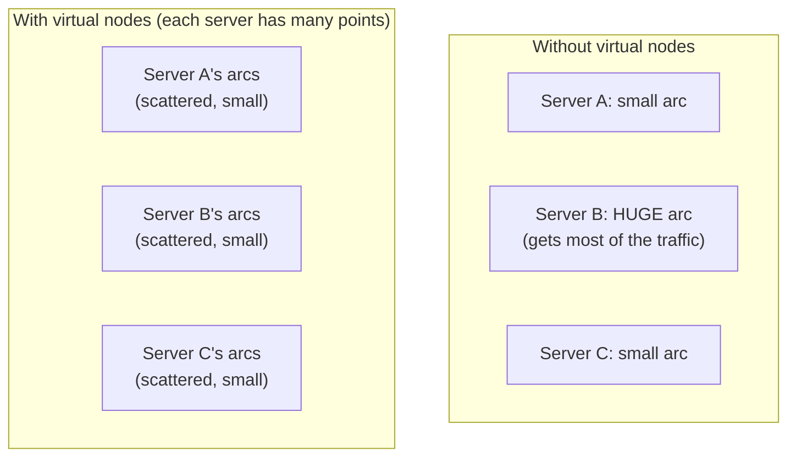

# Consistent Hashing

> A way to assign keys to servers so that adding or removing one server only moves a small slice of the keys, instead of reshuffling almost everything.

## The problem it solves (a small story)

Say you have 4 coat-check stations at a theater, and you assign each coat a station by `hash(ticket_number) mod 4`. It works — until the theater adds a 5th station on a busy night. Now `mod 4` becomes `mod 5`, and suddenly almost every single coat's assigned station changes, even though only one new station was added. Every attendant has to walk half the coats to a different peg. That's the ordinary problem with naive hashing: the moment the number of servers (`N`) changes, the formula changes, and nearly all keys move.

Consistent hashing fixes this by not hashing keys into "slot 1 of N" at all. Instead, imagine a circular dial (like a clock face) with numbers from 0 to some huge maximum. Both the servers *and* the keys get hashed onto positions on that same dial. Each key simply belongs to the next server found walking clockwise from its position. Add a 5th server? It only takes over the small arc of the dial between it and its neighbor — every other key, on every other arc, doesn't move at all.

This is exactly the problem Slack ran into with its Channel Servers: losing one stateful server used to mean redistributing load across the whole fleet. Consistent hashing turns that into "reassign the one slice of channels that server owned," which is fast enough to make the failure invisible to users. Uber runs into the same shape of problem one layer down, where a fleet of Node.js processes has to agree on which of them currently owns a given driver's live location, and can't afford a slow, whole-cluster reshuffle every time a process restarts.

## How it works (step by step, with at least 2 Mermaid diagrams)

<a href="https://alwintwk.github.io/big-tech-system-design/diagrams/concepts-consistent-hashing-lookup.html">
  <picture>
    <source media="(prefers-color-scheme: dark)" srcset="../diagrams/concepts-consistent-hashing-lookup.dark.png">
    
  </picture>
</a>


<sub>Click the diagram for the interactive version (zoom, dark mode, trace a path).</sub>

> **Why this matters:** notice that key `channel_9` (hash 250) wraps around past the highest server position back to the lowest one (Server A). The ring has no start or end — it's a genuine circle, which is exactly what makes "next server clockwise" a well-defined rule for every possible key, no matter how large its hash value is.

Step by step:
1. Hash every server onto the ring (a fixed, large numeric range) — server A lands at position 10, server B at 90, server C at 200.
2. Hash every key the same way — a channel ID, a cache key, whatever needs a home.
3. Each key belongs to the first server position found going clockwise from the key's own position on the ring.
4. Because both keys and servers use the *same* hash function, adding a server just inserts a new point on the ring — it only "steals" the keys between itself and the previous server on the ring, not keys anywhere else.



> **Why this matters:** the key insight is that losing a server is now a *local* event on the ring, not a *global* one. Only the keys that server owned need to find a new home — everything else on the ring keeps working exactly as before, which is what makes fast, automated failover practical instead of a whole-fleet emergency.

## Worked example

Say a ring has 4 servers, evenly spaced, holding roughly 10,000 keys total — about 2,500 keys each. One server crashes. Under naive `hash(key) mod N` (with N now 3), nearly all 10,000 keys would need to be recomputed and moved, because the formula itself changed. Under consistent hashing, only the ~2,500 keys that belonged to the crashed server need a new home (they move to whichever server is next clockwise on the ring) — the other ~7,500 keys, belonging to the two untouched servers, never move at all.

Now add virtual nodes to the picture: instead of each of the 4 servers owning one arc, each owns (say) 100 small arcs scattered around the ring. When one server crashes, its ~2,500 keys are still reassigned — but instead of landing entirely on whichever one server happens to be next clockwise from a single point, they're spread across all 100 of that crashed server's scattered arcs' neighbors, which in practice means spread roughly evenly across the *other three* servers, rather than dumping the full 2,500-key burden onto just one of them.

## Virtual nodes in practice

Without virtual nodes, an unlucky ring layout can leave one server owning a much bigger arc than its neighbors, just from how the hash values happened to land:



With virtual nodes, each physical server is represented by many scattered points on the ring instead of one. The law of averages does the rest: with enough virtual nodes per server, every physical server ends up owning roughly the same *total* arc length, even though any single one of its many small arcs is tiny. This is also what makes losing one server gentle on the rest of the cluster — its many small arcs are scattered among many different neighbors, so no single surviving server absorbs a disproportionate share of the failure.

A rough sketch of the jump consistent hash algorithm — the "no ring stored anywhere" variant — shows how far this idea can be pushed:

```
function jump_consistent_hash(key, num_buckets):
    b = -1
    j = 0
    while j < num_buckets:
        b = j
        key = key * 2862933555777941757 + 1   // pseudo-random step
        j = floor((b + 1) * (2^31 / ((key >> 33) + 1)))
    return b
```

No ring, no per-server position stored anywhere — just a pure function of the key and the current bucket count, computed fresh on every call, at the cost of not being able to remove an arbitrary bucket from the middle (only shrink/grow the count).

## Variants / strategies

| Strategy | How | Pros | Cons |
|---|---|---|---|
| Plain consistent hashing | Servers and keys on one ring, key owned by next server clockwise | Only ~1/N of keys move when N changes | Can distribute unevenly if few servers land close together on the ring |
| Virtual nodes | Each physical server gets many points on the ring, not just one | Smooths out uneven load; failure of one physical server spreads its keys across many others, not just one neighbor | More bookkeeping (many ring entries per server) |
| Rendezvous hashing (highest random weight) | For each key, compute a score against every server and pick the highest-scoring one | No ring needed at all; naturally uniform | O(N) computation per lookup unless optimized |
| Jump consistent hash | A pure function mapping key + bucket count directly to a bucket, no ring stored anywhere | No memory needed to store the ring; very fast | Buckets aren't independently named/removed from the middle — only sized as a count |
| Gossip-based membership (e.g. SWIM) | Nodes periodically ping random peers to detect failures, paired with a consistent-hash ring for placement | No single control-plane service needed to track cluster membership | Detecting a failure takes a few gossip rounds, not instant |
| Bounded-load consistent hashing | Adds a hard cap on how much any one server can be assigned, spilling overflow to the next server on the ring | Guards against a pathological ring layout overloading one server | More bookkeeping to track each server's current load against its cap |
| Multi-probe consistent hashing | Hashes each key with a few different seeds and picks the least-loaded of the resulting candidates | Better load balance than plain consistent hashing without full virtual-node overhead | A small amount of extra computation per lookup |
| Static directory / lookup table | An explicit table mapping key ranges to servers, updated by hand or by a coordinator | Simple to inspect and debug; no hashing math involved | Every membership change requires an explicit, coordinated update to the table |

## Choosing between plain, virtual-node, and rendezvous hashing

A quick way to decide:
1. **Do you need failure to spread evenly across the whole cluster, not just to one neighbor?** If yes, use virtual nodes — this is almost always worth the extra bookkeeping in production systems.
2. **Do you want to avoid maintaining any ring data structure at all?** Rendezvous hashing trades ring bookkeeping for a per-lookup computation across every server — fine when the server count is small, expensive when it's large.
3. **Do you have memory constraints so tight that even a ring is too much state?** Jump consistent hash needs no stored structure at all, at the cost of buckets only being addressable by count, not by arbitrary removal from the middle.
4. **Is cluster membership itself unreliable or slow to track centrally?** Pair the ring with a gossip protocol (like Uber's Ringpop does) so membership itself is self-healing, not dependent on one coordinator.
5. **Is uneven load a real, measured problem, or a theoretical worry?** Bounded-load and multi-probe variants exist for genuinely skewed workloads — don't add that complexity before plain virtual nodes have actually been tried and measured.

## Signals that you need consistent hashing (and signals you don't)

Reach for consistent hashing when:
- Servers holding state (a cache, a live connection, an in-memory index) join and leave the cluster somewhat regularly — scaling events, deploys, or failures — and a full reshuffle each time would be too disruptive.
- You want the same key to reliably land on the same server across requests, without a central lookup service being consulted on every single one.
- The system needs fast, automated recovery from a single node failure, without a human manually rebalancing anything.

Be more careful, or consider alternatives, when:
- Membership almost never changes, and a simple static lookup table would be easier to understand and debug.
- The real problem is one specific key being too popular (a hot key), not servers joining/leaving — consistent hashing doesn't fix that on its own.
- The data behind each key is small enough, and read-heavy enough, that just replicating everything everywhere (no partitioning at all) is simpler and still affordable.

## Where the companies in this repo use it

- **Slack** routes every posted message to the correct **Channel Server** using a consistent hash on the channel ID; a ring manager called **CHARM** (Consistent Hash Ring Manager) can get a freshly-provisioned replacement server serving traffic in under 20 seconds after an unhealthy one is detected, because only the channels that server owned need to move: [../companies/slack.md#consistent-hashing-and-charm-turning-a-stateful-server-crash-into-a-non-event](../companies/slack.md#consistent-hashing-and-charm-turning-a-stateful-server-crash-into-a-non-event)
- **Slack**'s signature component section walks through the same hash ring as the mechanism a Channel Server uses to own a defined subset of all channels: [../companies/slack.md#3-signature-component-the-channel-server-hash-ring-and-fast-failover](../companies/slack.md#3-signature-component-the-channel-server-hash-ring-and-fast-failover)
- **Slack** also notes that consistent hashing routes users from the same team and networking region to the same Flannel edge-cache instance, which is what makes that cache effective in the first place — team data is naturally clustered on the instances most likely to be asked about it again: [../companies/slack.md#flannel-solving-the-reconnect-storm-before-it-starts](../companies/slack.md#flannel-solving-the-reconnect-storm-before-it-starts)
- **Uber** runs its real-time Supply service and geo-index on **Ringpop**, a library that turns a fleet of Node.js processes into one self-healing, consistently-hashed cluster via gossip, so "who owns this driver's location right now" lives in memory instead of round-tripping to a database on every ping — using FarmHash as the hash function and a red-black tree to represent the ring, with a uniform number of virtual replica points per physical node: [../companies/uber.md#ringpop-the-self-organizing-cluster](../companies/uber.md#ringpop-the-self-organizing-cluster)

## Common mistakes

- **Forgetting virtual nodes.** With only one ring position per physical server, load can land unevenly (some servers get a much larger arc than others) — virtual nodes fix this by giving each server many smaller arcs spread around the ring.
- **Assuming "only 1/N moves" means "zero disruption."** The keys that do move still need their state migrated or refetched — for stateful servers (like Slack's Channel Servers), that migration path has to exist and be fast, which is CHARM's actual job, not the hashing math alone.
- **Using consistent hashing where a directory/lookup table would be simpler.** If server membership changes rarely and you can afford a lookup service, an explicit directory can be easier to reason about and debug than a hash ring.
- **Ignoring hot spots.** A single extremely popular key (a viral channel, a celebrity's data) still lands on one server regardless of how evenly the ring is balanced — consistent hashing solves uneven *server* load from membership changes, not uneven *key* popularity.
- **Relying on a single, centralized ring coordinator.** If one service has to approve every ring change, that service becomes exactly the single point of failure consistent hashing was supposed to help avoid — pairing the ring with gossip-based membership (as Uber's Ringpop does) removes that bottleneck.
- **Picking too few virtual nodes per server.** A handful of virtual nodes per server smooths load somewhat, but too few still leaves noticeable imbalance — the right number is a tuning question, not a fixed constant.
- **Forgetting that the hash function itself matters.** A poor hash function that clusters similar keys together defeats the point of the ring, no matter how many virtual nodes are used — this is why Uber's Ringpop explicitly chose FarmHash rather than an arbitrary one.
- **No plan for what happens during the migration window.** While keys are being reassigned after a membership change, requests for those specific keys may briefly need special handling (buffering, retrying, or serving from the old owner one last time) — treating the reassignment as instantaneous ignores this in-between period.
- **Debugging "which server owns this key" by guesswork.** Without tooling that can compute a key's ring position on demand, tracking down why a specific key ended up on a specific server during an incident becomes needlessly slow.

## Interview questions

<details><summary>Q1. Why is consistent hashing better than `hash(key) mod N` for a system that scales up and down?</summary>

`mod N` ties every key's assignment to the current server count — changing N changes almost every key's target. Consistent hashing ties each key's assignment to its position relative to servers on a fixed ring, so adding or removing one server only reassigns the keys near that one server, not the whole keyspace.

A good follow-up to volunteer: this is exactly why a cache cluster that scales up and down frequently benefits far more from consistent hashing than one with a fixed, rarely-changing size.

</details>

<details><summary>Q2. What are virtual nodes and why do they matter?</summary>

Instead of placing each physical server once on the ring, place it at many points (virtual nodes). This spreads a server's share of the keyspace into many small, scattered arcs instead of one big contiguous one — so losing a server spreads its load across many other servers instead of dumping it all onto one neighbor, and load balances more evenly overall.

More virtual nodes generally means better balance, up to a point of diminishing returns against the extra bookkeeping cost.

</details>

<details><summary>Q3. How does consistent hashing help you build fast, automated failover for a stateful server?</summary>

Because only the ring's local arc changes when a node leaves, a manager can detect the failure, provision a replacement at (roughly) the same ring position, and only that small slice of keys needs to be reassigned — bounding both the blast radius and the recovery time, the way Slack's CHARM gets a replacement Channel Server serving traffic in under 20 seconds.

</details>

<details><summary>Q4. Does consistent hashing solve the "hot key" problem?</summary>

No — it solves uneven load from servers joining/leaving, not uneven load from one key being disproportionately popular. A hot key still lands on exactly one node; that needs a separate fix (replicating the hot value, caching it further upstream, or splitting it further).

</details>

<details><summary>Q5. What's the difference between consistent hashing and rendezvous hashing?</summary>

Consistent hashing places keys and servers on a shared ring and picks the next server clockwise. Rendezvous hashing has no ring at all — for each key, it scores every candidate server and picks the highest score. Both give the "only a fraction of keys move when membership changes" property, but rendezvous hashing needs no persistent ring data structure, at the cost of scoring every server per lookup unless optimized.

Both are legitimate answers in an interview; naming the trade-off (stored ring vs. per-lookup computation) matters more than picking a "winner."

</details>

## Related concepts

- [Sharding](sharding.md) — consistent hashing is one way to route keys to shards without a full reshuffle on resize
- [Load balancing](load-balancing.md) — a hash ring is itself a form of load distribution, biased toward routing the *same* key to the *same* server
- [CAP theorem and consistency](cap-and-consistency.md) — Uber's Ringpop deliberately favors availability (AP) over strict consistency for exactly this kind of in-memory routing data
- [Replication](replication.md) — leaderless replicated systems often use a hash ring to decide which nodes hold which replicas
- [Geo-indexing](geo-indexing.md) — Uber's Ringpop-hashed cluster is the layer that holds the geo-index's live data
- [Fan-out](fan-out.md) — Discord's Manifold groups fan-out recipients by destination node, a routing idea related to hashing keys onto a ring

## Further reading

- [Consistent hashing — Wikipedia](https://en.wikipedia.org/wiki/Consistent_hashing)

Back to the coat-check theater: consistent hashing is really just a smarter rule for "which peg does this coat go on" — one where adding a station never means re-tagging every coat already hanging up.

The ring doesn't make any single server faster. It just makes sure that when one goes away, the damage stays local.
