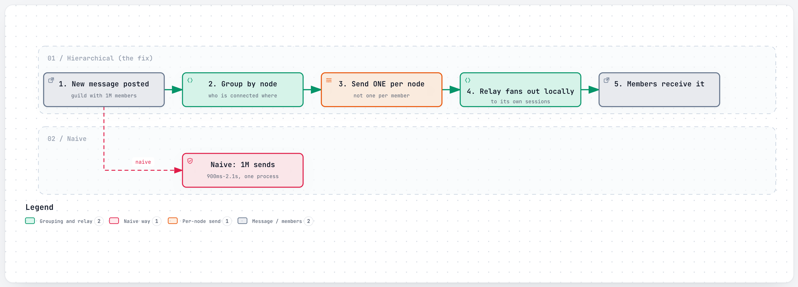
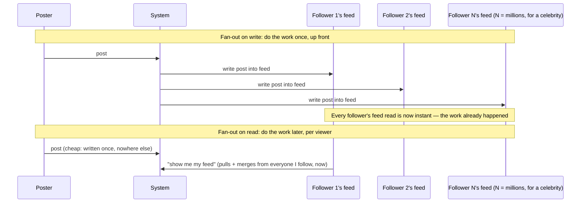
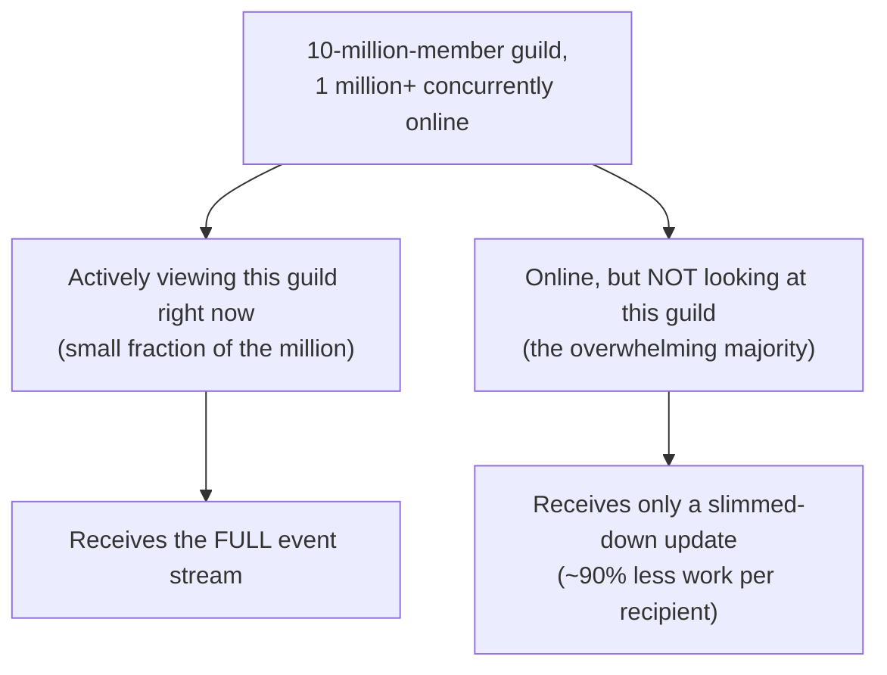
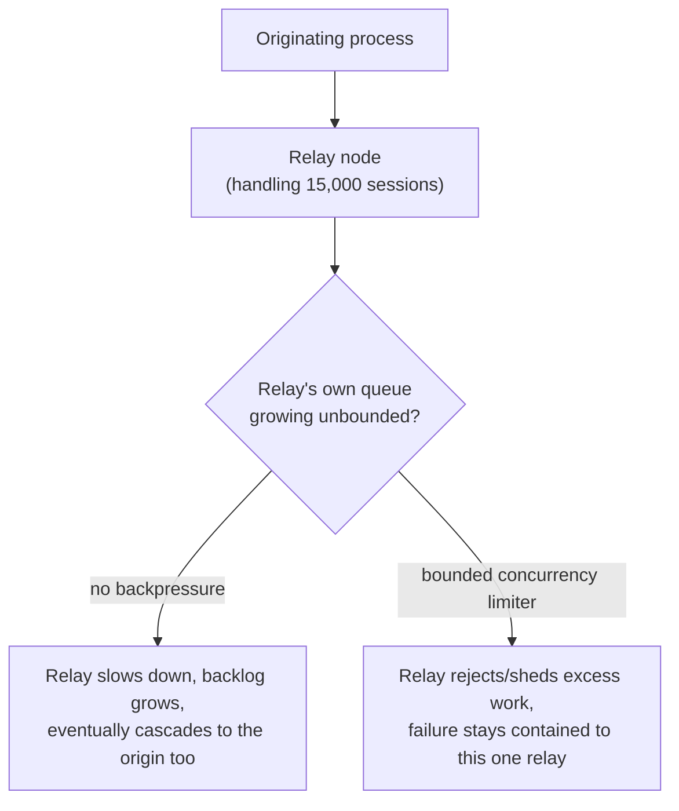

# Fan-out

> Taking one event and delivering it to many recipients — and the moment "many" gets big, doing that naively (one at a time, from one place) becomes the bottleneck itself.

## The problem it solves (a small story)

Imagine a teacher who wants to hand a note to every one of 40 students individually, walking to each desk one at a time. Fine for 40 students. Now imagine the "class" is a stadium of a million people, and the teacher still insists on personally walking to every single seat. Long before they reach seat 500,000, the note is old news — the *delivery mechanism*, not the message itself, has become the problem.

The obvious fix is hierarchy: the teacher hands the note to 20 section leaders, each section leader hands it to 20 row leaders, each row leader hands it to the ~2,500 people in their row. The teacher's own work stays small and constant — always "tell 20 people" — no matter how big the stadium gets. That's fan-out done properly: instead of one process doing `O(recipients)` work, route through a small number of intermediaries who each do their own local fan-out in parallel.

This is precisely the wall Discord hit with a guild of tens of thousands of concurrent members, and the wall Twitter/X hit the moment a single tweet needed to reach tens of millions of followers. Discord's own numbers make the naive version concrete: before its 2017 redesign, a message in a 30,000-member guild took 900 milliseconds to 2.1 seconds just to fan out, because the guild's own process really was sending directly to every single session. YouTube runs into a related but distinct version of the same idea: fanning out one upload into many independent transcoding tasks, rather than recipients receiving a message.

## How it works (step by step, with at least 2 Mermaid diagrams)

<a href="https://alwintwk.github.io/big-tech-system-design/diagrams/concepts-fan-out-hierarchical.html">
  <picture>
    <source media="(prefers-color-scheme: dark)" srcset="../diagrams/concepts-fan-out-hierarchical.dark.png">
    
  </picture>
</a>

Click the diagram for the interactive version (zoom, dark mode, trace a path).

> **Why this matters:** the originating process's own workload doesn't grow with the number of recipients at all — it always does roughly the same small amount of work ("send to a small, fixed number of relay nodes"), whether the guild has 300 members or 300,000. All the work that *does* scale with recipient count happens in parallel, spread across many relay workers instead of piling onto one.

Step by step (hierarchical fan-out):
1. Something happens that many recipients need to know about (a new chat message, a new post from someone with many followers).
2. Instead of the originating process sending directly to every individual recipient, it groups recipients by which of a small number of intermediary nodes they're actually connected to.
3. It sends exactly **one** message per intermediary node — a small, constant amount of work regardless of how many total recipients there are.
4. Each intermediary then does its own local fan-out to just the recipients connected to it, in parallel with every other intermediary doing the same.
5. If a relay itself gets overloaded, a bounded-concurrency limiter rejects excess work rather than queueing it indefinitely — see the backpressure section below.

The other major fan-out decision is *when* the work happens — at write time or at read time — which matters most for feeds where a tiny number of accounts have an enormous number of followers.

> **Why this matters:** these are literally the same underlying event, delivered by two opposite strategies. Fan-out on write moves cost onto the write path so every future read is instant; fan-out on read moves cost onto every read so the write stays cheap no matter how popular the poster is. Neither is "correct" — the right choice depends entirely on how lopsided the follower-count distribution actually is.

Fan-out on write pays the cost once, at post time, so every follower's read is instant — but a single post from an account with millions of followers turns into millions of writes. Fan-out on read defers that cost to whenever each follower actually asks for their feed — cheap at post time, but every read has to do real work pulling and merging from everyone that user follows. Real systems (Twitter/X's Home Mixer among them) mix both: fan-out on write for most accounts, fan-out on read for the small number of accounts too large to fan out on every post.

## Worked example

An account with 200 followers posts. Fan-out on write pushes the post into all 200 followers' feeds — trivial, done in milliseconds, and every one of those 200 followers gets an instant feed read forever after. Multiply that by millions of ordinary accounts posting constantly, and fan-out on write is clearly the cheap, simple default.

This is the overwhelming majority case in any real social product — most accounts have a modest, bounded follower count, which is exactly why fan-out on write remains the default rather than the exception.

Now a celebrity account with 30 million followers posts. Fan-out on write for this one post would mean 30 million individual writes, triggered synchronously by one tap of a button — a colossal, disproportionate burst of work from a single event, and if it's slow, it delays that celebrity's post from reaching *anyone*. Fan-out on read instead: the post is written once, and each of the 30 million followers' own feed reads pull it in (merged with everyone else they follow) at the moment they actually open the app — spreading the cost across millions of separate, much smaller read operations instead of concentrating it into one enormous write.

## Bounding fan-out cost with passive recipients

Even hierarchical fan-out has a ceiling if every single online member gets full-fidelity updates. Discord's further optimization (Maxjourney) shrinks the *number of full-fidelity recipients itself*: a member connected but not actively looking at a given server becomes "passive," and gets a stripped-down update instead of the complete event stream — cutting fan-out work by roughly 90% for the largest communities, since in any huge guild, the overwhelming majority of "online" members are not watching that specific server at any given instant.

## Variants / strategies

| Strategy | How | Pros | Cons |
|---|---|---|---|
| Naive fan-out | One process sends directly to every recipient, one at a time | Trivially simple and obviously correct | `O(recipients)` cost on one process — becomes the bottleneck as recipient count grows |
| Hierarchical fan-out | Route through a small, fixed number of relay workers, each fanning out locally | Turns `O(recipients)` on one process into a small constant, done in parallel | Extra layer of infrastructure to build and operate |
| Batching by destination | Group many small messages headed to the same node into one larger message | Cuts per-message overhead, especially over a network hop | Adds a small buffering delay before the batch is sent |
| Fan-out on write | Push the event into every recipient's feed/inbox at write time | Reads are instant — no work happens at read time | A single popular producer can turn one write into millions of writes |
| Fan-out on read | Compute each recipient's view by pulling from sources at read time | Write stays cheap no matter how popular the producer is | Every read does real, potentially expensive work |
| Hybrid (write for most, read for the few) | Fan-out on write by default; switch to fan-out on read only for accounts above some follower threshold | Gets the best of both without either extreme's worst case | Two code paths to build, test, and keep consistent |
| Passive/active recipient tiers | Recipients not actively engaged get a slimmed-down update instead of the full stream | Dramatically cuts total fan-out work for huge, mostly-idle audiences | Requires tracking who's "actively watching" versus merely connected |
| Bounded-concurrency backpressure at each relay | Each relay rejects excess work past a set limit instead of queueing it indefinitely | Keeps one overloaded relay's failure from cascading to the origin or other relays | Rejected work needs its own handling (retry, drop, alert) rather than just disappearing |

## Signals that you need to rethink your fan-out strategy

Reach for hierarchical fan-out when:
- A single process's direct-send loop is measurably the bottleneck (rising latency as recipient count grows).
- Recipients naturally cluster by some routing key (which node/shard/server they're connected to).

Reach for a hybrid write/read model when:
- The distribution of recipient counts per producer is heavily skewed — most producers have a normal, bounded audience, but a few have an audience orders of magnitude larger.

Reach for passive/active tiering when:
- Most "online" recipients aren't actually paying attention to this specific event stream right now, and a lighter update would serve them just as well.

Reach for bounded-concurrency backpressure at every relay when:
- A relay node accepting unlimited queued work is a realistic path to a cascading failure, not just a theoretical one.
- A single overloaded component's failure needs to stay contained, rather than propagating back to the origin.

## What happens when a relay node itself is overloaded

Hierarchical fan-out solves the origin's bottleneck, but a relay node can still become one of its own:

> **Why this matters:** without an explicit limit on how much a relay will accept, an overloaded relay doesn't just fail quietly — its backlog can grow until it starts blocking the origin that's feeding it, turning one relay's local problem into a cluster-wide cascading failure. A bounded-concurrency limiter (Discord's Semaphore is the concrete example) rejects the excess instead of queueing it indefinitely, keeping the failure contained to the one component that's actually struggling.

## Where the companies in this repo use it

- **Discord** built **Manifold** specifically to fix naive fan-out: grouping recipients by which remote node they're connected to, sending one message per node, and letting a relay worker on that node fan out locally — turning an `O(members)` cost on the guild's own process into a small, roughly constant one: [../companies/discord.md#3-signature-component-manifolds-hierarchical-fan-out](../companies/discord.md#3-signature-component-manifolds-hierarchical-fan-out)
- **Discord**'s later **Maxjourney** project layered passive sessions on top — a member not actively viewing a server gets a stripped-down update instead of the full stream, cutting fan-out work by roughly 90% for the largest guilds and pushing the practical ceiling from tens of thousands of online members into the millions: [../companies/discord.md#maxjourney-passive-sessions-and-relay-for-a-10-million-member-guild](../companies/discord.md#maxjourney-passive-sessions-and-relay-for-a-10-million-member-guild)
- **Twitter/X** hit "pure fan-out-on-write" as one of the two root causes of its early "Fail Whale" era, because a single popular account's tweet could fan out into an enormous burst of synchronous work; its modern design handles the celebrity case differently from ordinary accounts: [../companies/twitter-x.md#fan-out-on-write-vs-fan-out-on-read-the-celebrity-problem](../companies/twitter-x.md#fan-out-on-write-vs-fan-out-on-read-the-celebrity-problem)
- **YouTube** fans a single uploaded video out into a dozen-plus independent transcoding tasks (one per resolution/codec combination), so one slow rendition — an unusual 8K/AV1 combo — never blocks the others from finishing and going live: [../companies/youtube.md#upload-ingestion-and-the-transcode-fan-out](../companies/youtube.md#upload-ingestion-and-the-transcode-fan-out)
- **Airbnb** avoids doing costly cross-service fan-out synchronously at all: a listing or booking change propagates through a Kafka event bus instead of the originating service calling every interested service directly, so a spike in one domain's fan-out work can't slow down another: [../companies/airbnb.md#soa-migration-from-the-rails-monolith](../companies/airbnb.md#soa-migration-from-the-rails-monolith)
- **Slack**'s Gateway Servers perform the last-mile fan-out step: once a Channel Server decides a message needs to go out, each subscribed Gateway Server pushes it down its own open WebSockets to whichever connected clients are in that channel: [../companies/slack.md#high-level-design](../companies/slack.md#high-level-design)

## Common mistakes

- **Fanning out synchronously on the critical path.** If the user has to wait for every recipient's copy to be written before their own request completes, one slow recipient (or a million of them) directly slows down the poster.
- **Ignoring the celebrity case.** A hybrid design that assumes "every account has a normal number of followers" will eventually meet an account with tens of millions, and pure fan-out-on-write will buckle exactly there.
- **Treating fan-out and pub/sub as unrelated.** They're closely linked: publishing one event to many subscribers *is* a form of fan-out, typically implemented with a [message queue or log](message-queues-and-logs.md).
- **No batching by destination.** Sending N individual small messages to the same downstream node instead of grouping them into one batched message per node wastes overhead on every single one.
- **Assuming a hybrid model needs no ongoing tuning.** The follower-count threshold that separates "fan-out on write" from "fan-out on read" accounts isn't a one-time decision — it needs revisiting as the product and its biggest accounts grow.
- **Forgetting fan-out work can grow worse than linearly.** In the worst case, fan-out cost in a live system can grow with the *square* of active participants (more events to send, and more recipients for each one) — a fix that only addresses the linear term won't hold at the next order of magnitude.
- **Treating every "online" recipient as equally worth full-fidelity delivery.** Most of a huge audience at any instant isn't actually watching a given stream closely — paying full fan-out cost for all of them anyway wastes work that a passive/active tier could avoid.
- **No fallback when a relay/intermediary node itself is overloaded.** A hierarchical design still needs a plan for what happens when one of the *relay* nodes, not just the origin, becomes the bottleneck.
- **No backpressure at the relay layer.** Without a bounded-concurrency limit, an overloaded relay's backlog can grow until it starts blocking the origin too, turning a local slowdown into a cluster-wide cascade.

## Interview questions

Q1. What's the difference between fan-out on write and fan-out on read?

Fan-out on write does the delivery work once, at post time, pushing the new item into every recipient's feed/inbox immediately — reads are then instant. Fan-out on read defers that work to whenever a recipient actually asks for their feed, pulling and merging from sources at read time — writes stay cheap regardless of how many followers the poster has.

A useful way to remember which is which: "write" pays cost once per post; "read" pays cost once per view.

Q2. Why does fan-out on write break down for a very popular account?

Because the write cost is proportional to the number of recipients — an account with 30 million followers turns one post into 30 million individual writes, all triggered synchronously by a single action. That's an enormous, disproportionate burst of work from one event.

This is exactly the shape of problem behind Twitter's early "Fail Whale" era, before fan-out strategy was split by account size.

Q3. How does hierarchical fan-out avoid the naive `O(recipients)` bottleneck?

By routing through a small, fixed number of intermediary workers instead of sending directly to every recipient. The originating process only ever does a small, constant amount of work (one message per intermediary); each intermediary then fans out locally and in parallel to just its own slice of recipients.

Discord's own before/after numbers make the payoff concrete: 900ms-2.1s of naive fan-out shrank to a small, roughly constant cost once Manifold grouped recipients by destination node.

Q4. When would a system use a hybrid of fan-out on write and fan-out on read?

When most producers have a normal, manageable number of recipients (fan-out on write works fine and keeps reads instant), but a small number of producers have an extreme number (a celebrity account) where fan-out on write would be disproportionately expensive — those specific accounts fall back to fan-out on read instead.

The threshold itself (how many followers counts as "celebrity") is a tuning decision, not a fixed universal number. Twitter/X's own fan-out-on-write-vs-read split is the standard reference point for this decision.

Q5. Why might fan-out cost grow faster than linearly with the number of active participants?

Because in the worst case, more active participants means both more events being generated (more people posting/reacting) *and* more recipients for each one — the two multiply together, so total fan-out work can scale with roughly the square of active participant count, not just their count alone.

This is exactly the pressure passive/active recipient tiering (like Discord's Maxjourney) relieves — by shrinking the number of full-fidelity recipients, not just optimizing the delivery mechanism further.

## Related concepts

- [Message queues and logs](message-queues-and-logs.md) — a common mechanism for implementing fan-out (publish once, many consumers read it)
- [Persistent connections](persistent-connections.md) — the last-mile delivery step of fan-out, pushing to an already-open connection
- [Sharding](sharding.md) — grouping recipients by destination node in hierarchical fan-out is conceptually the same idea as sharding
- [Rate limiting](rate-limiting.md) — Discord's Semaphore-style backpressure bounds how much fan-out work a single overloaded component absorbs before shedding load
- [Idempotency](idempotency.md) — a fanned-out event may be delivered more than once to the same recipient, which is exactly why consumers on the receiving end need to tolerate duplicates
- [CAP theorem and consistency](cap-and-consistency.md) — fan-out on read vs. write is itself a trade between read latency and write cost, similar in spirit to consistency trade-offs

## Further reading

- [Publish–subscribe pattern — Wikipedia](https://en.wikipedia.org/wiki/Publish%E2%80%93subscribe_pattern)

Back to the stadium: the teacher never personally reaches seat 999,999. Section leaders and row leaders do that — the teacher's only job was making sure 20 people heard the news fast.

The hierarchy is invisible from the teacher's chair. That invisibility is the entire design goal.
