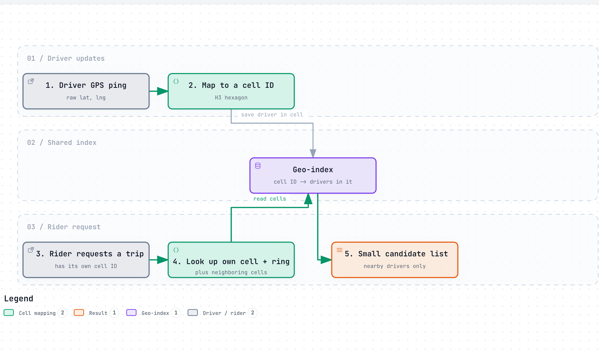
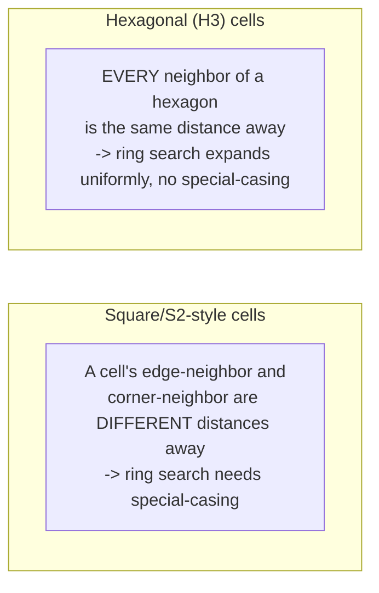
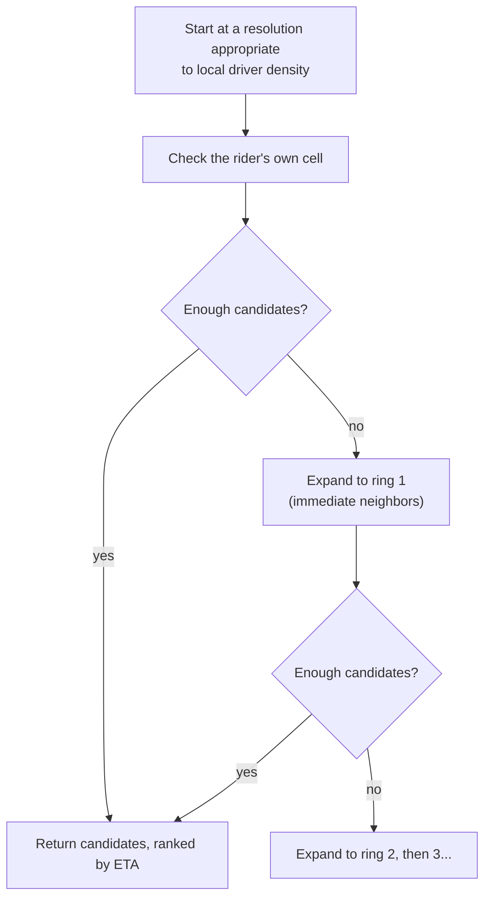
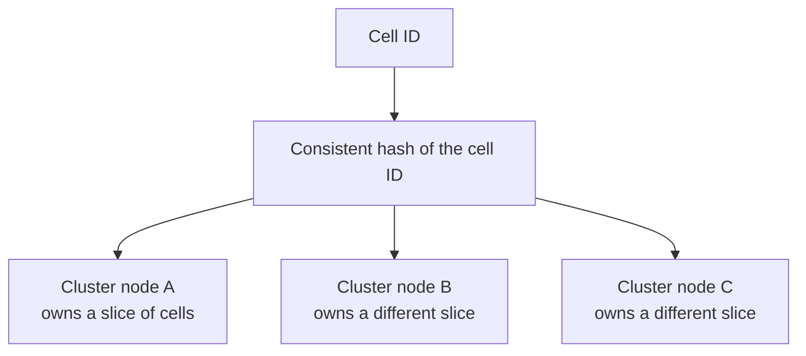

# Geo-indexing

> Organizing location data so "what's near this point" is a fast lookup, instead of comparing raw latitude/longitude coordinates against every single other point on Earth.

## The problem it solves (a small story)

Imagine trying to find every restaurant within a mile of your house by taking a giant list of every restaurant's exact GPS coordinates, and for each one, doing the trigonometry to calculate its precise distance from you — then checking if that distance is under a mile. It works, but you're recomputing real geometric distance math against every single restaurant on the list, including ones on the other side of the planet that were never going to be close.

A much faster approach: chop the map into a grid of cells ahead of time, and file every restaurant under the cell it falls into. Now "restaurants near me" becomes "look up my own cell, and its immediate neighboring cells" — no distance math against the whole planet, just a lookup of a handful of cells and whatever's filed under them. That's the core idea of geo-indexing: trade continuous, exact geometry for a discrete grid that turns "what's nearby" into a cheap index lookup.

The trade being made here is explicit: a little bit of precision (the grid is an approximation, not exact geometry) for a very large amount of speed.

This is exactly Uber's problem, at a scale where it can't be solved by getting a bigger, faster computer: both riders and drivers are constantly moving, and "who's near this rider right now" needs an answer in a fraction of a second, not after a full geometric scan. Uber's own history shows this wasn't solved once and forgotten — it moved from postal-code-style regions, to Google's square-derived S2 cells, to its own open-sourced hexagonal system, H3, as the shape of the problem became better understood. Uber's own 122 base cells (12 pentagons, 110 hexagons) at H3's coarsest resolution alone is a good illustration of how much thought goes into a grid before it ever handles a single real query.

## How it works (step by step, with at least 2 Mermaid diagrams)

<a href="https://alwintwk.github.io/big-tech-system-design/diagrams/concepts-geo-indexing-cells.html">
  <picture>
    <source media="(prefers-color-scheme: dark)" srcset="../diagrams/concepts-geo-indexing-cells.dark.png">
    
  </picture>
</a>

Click the diagram for the interactive version (zoom, dark mode, trace a path).

> **Why this matters:** the index never has to know or care about the *shape* of "nearby" — it just answers "who's filed under these specific cell IDs," which is an ordinary, fast lookup regardless of how many total drivers exist worldwide. All the geographic complexity gets pushed into the one-time step of turning a GPS point into a cell ID.

Step by step:
1. Every GPS point (a driver's location, a rider's pickup point) gets converted into a **cell ID** from a grid laid over the whole planet.
2. Drivers currently in a given cell are tracked under that cell's ID in the geo-index.
3. To find nearby drivers, look up the rider's own cell, then progressively expand outward — the rider's cell, then its ring of immediate neighbors, then the next ring out — until enough candidates are found. A real system caps how far this expansion goes, rather than searching forever in a genuinely empty area.
4. Because the search only ever touches a handful of cells (not the whole index), it stays fast no matter how many total drivers exist globally.
5. Once the index itself is too large for one machine, it's sharded by cell ID across a cluster — see below.

The specific shape of the grid cells matters more than it first seems:

> **Why this matters:** "expand the search outward, ring by ring, until enough candidates are found" is the core operation of the whole system — and it's only simple, uniform code if every neighbor really is equidistant. With square-derived cells, that same operation needs extra logic to account for corner-neighbors being farther away than edge-neighbors, which is exactly the kind of subtle correctness bug that shows up only at the edges of a search radius.

Square-ish cells (used by Google's S2 library) have two different neighbor distances — a cell directly across an edge is closer than one only touching at a corner — which complicates "expand the search radius outward one ring at a time" logic. Hexagonal cells (Uber's H3) don't have that problem: every one of a hexagon's six neighbors is equidistant, so expanding the search ring by ring is simple, uniform code. The cost: a sphere can't be perfectly tiled with only hexagons, so a small number of cells (12, in H3's case) are unavoidably pentagons and need to be handled as an edge case.

## Worked example

A rider opens the app in a moderately dense neighborhood. Their location hashes to cell `8a2a1072b59ffff` at H3 resolution 9 (roughly 0.1 km² per cell). The dispatch system looks up drivers filed under that exact cell — say there are none right now — and expands outward to the immediate ring of 6 neighboring cells. That ring turns up 3 candidate drivers. If it needed more, it would expand to the next ring of 12 cells outward, and so on, each step costing only a handful more cell lookups, never a scan of the entire city's driver population.

Each ring outward roughly doubles the number of cells checked, but the search still stops the moment enough candidates are found — most queries in a normal city never need more than a couple of rings.

Contrast this with a sparse rural area: the same resolution-9 cells might each cover ground with only one driver every several cells. A fixed resolution that works well in a dense city would mean searching many, many rings outward before finding anyone in a rural area — which is exactly why a hierarchical grid with multiple resolutions matters: a rural search can start from a coarser (larger) cell size, covering more ground per lookup, while a dense urban search stays at a finer resolution where precision actually matters.

The same idea extends to sharding the index across a cluster: a densely-populated city might justify its own dedicated shard, while several sparse rural regions might share one, keeping load roughly balanced across the cluster rather than proportional to raw geographic area.

## Choosing a resolution and expanding a search

This is a classic "do the cheapest check first, only pay for more if you have to" pattern: most searches in a reasonably dense area succeed within the first ring or two, and only genuinely sparse areas ever need to expand several rings outward — the cost of the search adapts automatically to how much supply is actually nearby, rather than a fixed, worst-case cost being paid every single time.

A production system typically caps how many rings it's willing to expand before giving up or widening the search in some other way (relaxing the ETA requirement, say) — an unbounded expansion is itself a latency risk in a genuinely empty area.

## Variants / strategies

| Strategy | How | Pros | Cons |
|---|---|---|---|
| Geohash | Encode latitude/longitude into a short string; nearby points often (not always) share a string prefix | Simple, sortable, human-shareable strings | Cells are rectangular and distort near the poles; prefix-sharing isn't a perfect proximity guarantee |
| Bounded ring expansion | Cap how many rings a search is allowed to expand before giving up or relaxing other constraints | Guarantees a predictable worst-case query cost | A genuinely sparse area may return fewer candidates than desired |
| Square/quadtree grids (e.g. Google S2) | Recursive squares projected onto the sphere via cube faces | Well-established, widely used libraries | Two different neighbor distances (edge vs. corner) complicate uniform ring-based search |
| Hexagonal hierarchical grid (e.g. Uber H3) | Hexagons at multiple resolutions, indexed hierarchically | Uniform neighbor distance simplifies "expand outward" search | Can't tile a sphere with only hexagons — a small number of pentagon cells are unavoidable |
| Geo-index as an in-memory service | Location data lives in memory on a live, gossiping cluster, not round-tripped to a database per update | Handles constantly-changing, short-lived data (a driver's live position) that a database would be too slow to serve fresh | Trades some consistency guarantees for speed and availability — a stale position for a moment is fine; refusing an update is not |
| Adaptive-resolution search | Start at a resolution matched to local density; expand rings, or coarsen resolution, until enough candidates are found | Cost scales with how much supply is actually nearby, not a fixed worst case | More logic than a single fixed resolution everywhere |
| Sharded geo-index (hash by cell ID) | Spread the index itself across a cluster, keyed by cell ID rather than a single machine holding everything | Scales to planet-wide data volume and query rate | A search spanning a cell boundary may need to query more than one node |

## Signals that you need a geo-index (and how to tune it)

Reach for a geo-index when:
- "What's near this point" is a frequent, latency-sensitive query, not an occasional batch job.
- The underlying data (positions) changes fast enough that re-deriving proximity from scratch on every query would be too slow.
- The dataset is large enough (or geographically spread enough) that it eventually needs to be sharded across more than one machine.
- Different regions have different enough density that a single fixed resolution would serve one poorly to serve the other well.

Tune resolution toward **finer** cells when local density is high (a dense city center) and precision genuinely matters at short distances. Tune toward **coarser** cells, or a wider initial ring search, when density is low (rural areas) and a fixed fine resolution would mean expanding many empty rings before finding anything.

Shard the index by cell ID once a single machine can no longer hold or serve the whole thing — the same signal that motivates [sharding](sharding.md) generally, applied here to location data specifically.

## Sharding the geo-index itself

At real scale, the geo-index can't live on one machine either — it needs to be spread across a cluster, using the same techniques covered elsewhere in this repo.

> **Why this matters:** this is exactly [consistent hashing](consistent-hashing.md) and [sharding](sharding.md), applied one layer inside the geo-index — cell IDs, not user IDs, are the sharding key. Uber's Ringpop does precisely this: hashing cell-adjacent data across a self-healing, gossiping cluster so no single machine has to hold or serve the entire planet's location data.

A query near a shard boundary may need to check a neighboring node too, the same way a scatter-gather query works in an ordinary sharded database.

## Where the companies in this repo use it

- **Uber** turns every GPS point into a cell ID from **H3**, a hexagonal grid with 16 zoom levels ("resolutions"), so "who's near this rider" becomes a lookup of one cell plus a ring of neighbors instead of raw-coordinate geometry — chosen specifically over Uber's earlier square-ish system (Google's S2) because every neighbor of a hexagon is the same distance away: [../companies/uber.md#h3-the-hexagonal-geo-index](../companies/uber.md#h3-the-hexagonal-geo-index)
- **Uber**'s dispatch optimizer, DISCO, queries this geospatial index as its first step in finding candidate drivers for a trip request, filtering the entire fleet down to a small nearby candidate set before any further ranking happens: [../companies/uber.md#disco-the-dispatch-optimizer](../companies/uber.md#disco-the-dispatch-optimizer)
- **Uber**'s location and ETA pipeline is what keeps the geo-index itself fresh, ingesting a live GPS ping from every driver's phone roughly every 4 seconds at a target of around 1 million writes per second: [../companies/uber.md#the-location-and-eta-pipeline](../companies/uber.md#the-location-and-eta-pipeline)
- **Uber**'s own evolution shows the grid choice was never fixed forever: an early postal-code-based scheme gave way to Google's S2 (square-derived cells) in a 2015 rearchitecture, before H3 — whose hexagons don't have S2's uneven neighbor-distance problem — was built and open-sourced in 2018. Uber's own account never states H3 was built specifically to replace S2; that causal link is an inference, not a documented fact: [../companies/uber.md#how-it-evolved](../companies/uber.md#how-it-evolved)
- **Uber** runs its Supply service and geo-index on **Ringpop**, hashing cell-adjacent data across a self-healing, gossiping cluster via consistent hashing, so no single machine owns or serves the entire geo-index alone: [../companies/uber.md#ringpop-the-self-organizing-cluster](../companies/uber.md#ringpop-the-self-organizing-cluster)

## Common mistakes

- **Using raw lat/lng comparisons instead of an index.** Computing real geometric distance against every candidate point doesn't scale — the entire point of geo-indexing is avoiding that by narrowing the candidate set with cheap cell lookups first.
- **Picking a grid shape without checking its neighbor geometry.** A square/quadtree grid's edge-vs-corner neighbor distance difference silently complicates any "search N rings outward" logic built on top of it.
- **One fixed resolution for everything.** A grid fine enough for dense city-center search is wastefully small for sparse rural areas, and vice versa — hierarchical schemes with multiple resolutions exist precisely to let each query pick an appropriate cell size.
- **Forcing strong consistency onto highly transient location data.** A driver's GPS position two seconds ago is already somewhat stale by nature — treating it like it needs the same consistency guarantees as, say, a completed trip's billing record adds cost for no real benefit.
- **Forgetting the poles and the antimeridian.** Naive lat/lng-based grids (and geohash in particular) distort badly near the poles and have awkward edge cases crossing the 180° line — projections designed for a sphere (like H3's) exist specifically to avoid this.
- **Not planning for the pentagon edge case.** Any hexagonal grid over a sphere has a small, fixed number of unavoidable pentagon cells — code that assumes every cell has exactly six neighbors will break on exactly those cells if it isn't tested against them.
- **No cap on ring expansion.** Searching outward forever in a genuinely sparse area (open countryside, a small town) without a bound risks turning one query into a slow, unbounded scan instead of a fast, predictable lookup.
- **Ignoring how density varies across regions.** A ring-expansion search tuned only against dense urban test data can behave surprisingly badly (many empty rings) the first time it runs against a sparse rural region in production.
- **Treating the geo-index as a single-machine problem forever.** A design that works at city scale can still need to be sharded across a cluster once it's serving multiple regions or countries at once — the same sharding and consistent-hashing concerns as any other large index apply here too.
- **No plan for a search spanning a shard boundary.** If the index itself is sharded by cell ID, a ring search near the edge of one shard's territory may need to query a neighboring shard too — an easy case to miss in testing if test data never happens to sit near a boundary.
- **Assuming the grid choice is a one-time decision.** Uber's own path (postal codes to S2 to H3) shows a grid that was reasonable at one scale can still need replacing once its specific limitations (uneven neighbor distance, in S2's case) start showing up in real search quality.

## Interview questions

Q1. Why not just compute distance to every point directly instead of using a geo-index?

That approach is O(n) against every point in the system for every single query — fine for a handful of points, hopeless once you have millions of moving drivers and thousands of queries per second. A geo-index narrows the search to a small number of nearby cells first, so the expensive part (if any) only runs against a tiny candidate set.

The index doesn't eliminate distance math entirely — it just makes sure that math only ever runs against a small, pre-filtered candidate set, not the whole dataset.

Q2. Why would hexagonal grid cells be preferred over square ones for proximity search?

Every neighbor of a hexagon is exactly the same distance from its center, so "expand the search outward ring by ring" is simple, uniform code. Square-ish cells have two different neighbor distances (adjacent-edge vs. diagonal-corner), which complicates that same expanding-ring logic and can bias results toward whichever direction happens to be geometrically closer.

Uber's own move from S2 to H3 in 2018 is a good real-world illustration of choosing uniform neighbor geometry over an existing, widely-used square-derived library — though Uber's own materials don't explicitly frame H3 as built *to replace* S2 for that reason; that causal link is a reasonable inference, not a confirmed one.

Q3. What's the trade-off of using hexagons to tile the Earth's surface?

A sphere cannot be perfectly tiled using only hexagons — a small, fixed number of cells (12, in H3's design) must be pentagons instead. Any system built on a hexagonal grid needs to explicitly handle these pentagon cells as an edge case in code that otherwise assumes six uniform neighbors.

This is a good example of a trade-off with a known, bounded cost — 12 special cells out of a whole planet's grid is a manageable exception, not a fundamental flaw.

Q4. Why might a geo-index live entirely in memory instead of a database?

Because the data (a driver's current location) is extremely short-lived and constantly changing — by the time you wrote a position to a database and read it back, it would likely already be stale. Keeping it in memory on a live, coordinating cluster keeps "who's near this point right now" fast enough to be useful.

Uber's own framing is blunt about this: for this specific kind of fleeting data, "database storage would be useless because of how fleeting the location data is."

Q5. How does hierarchical resolution help a geo-index handle both dense cities and sparse rural areas well?

A system with multiple grid resolutions can use small, fine-grained cells where points are dense (so cells stay small and searches stay precise) and coarser cells where points are sparse (so a search doesn't need to check an enormous number of nearly-empty cells to find anything) — picking the right resolution per query instead of being locked into one fixed cell size everywhere.

H3's 16 resolution levels exist specifically to make this a tunable parameter rather than a hardcoded constant.

## Related concepts

- [Sharding](sharding.md) — a geo-index is effectively a domain-specific partitioning scheme, keyed by location instead of an arbitrary ID
- [CAP theorem and consistency](cap-and-consistency.md) — Uber's geo-index deliberately trades strict consistency for availability and speed
- [Consistent hashing](consistent-hashing.md) — used alongside geo-indexing to shard the index itself across a cluster
- [Caching](caching.md) — an in-memory geo-index is, in effect, the only copy of extremely hot, extremely short-lived data
- [Load balancing](load-balancing.md) — routing a query to the shard/node that owns a given cell is itself a form of request routing
- [Fan-out](fan-out.md) — notifying multiple nearby drivers of a new trip request is a small-scale fan-out problem layered on top of the geo-index lookup

## Further reading

- [Geohash — Wikipedia](https://en.wikipedia.org/wiki/Geohash)
- [H3: Uber's Hexagonal Hierarchical Spatial Index](https://h3geo.org/)

Back to the restaurant search: geo-indexing never makes any single distance calculation faster. It just makes sure you only ever calculate distance to the handful of restaurants that could plausibly be close.

Everything else — resolution, cell shape, sharding — is just tuning for how big "the handful" needs to be, and how fast that handful needs to be found.
