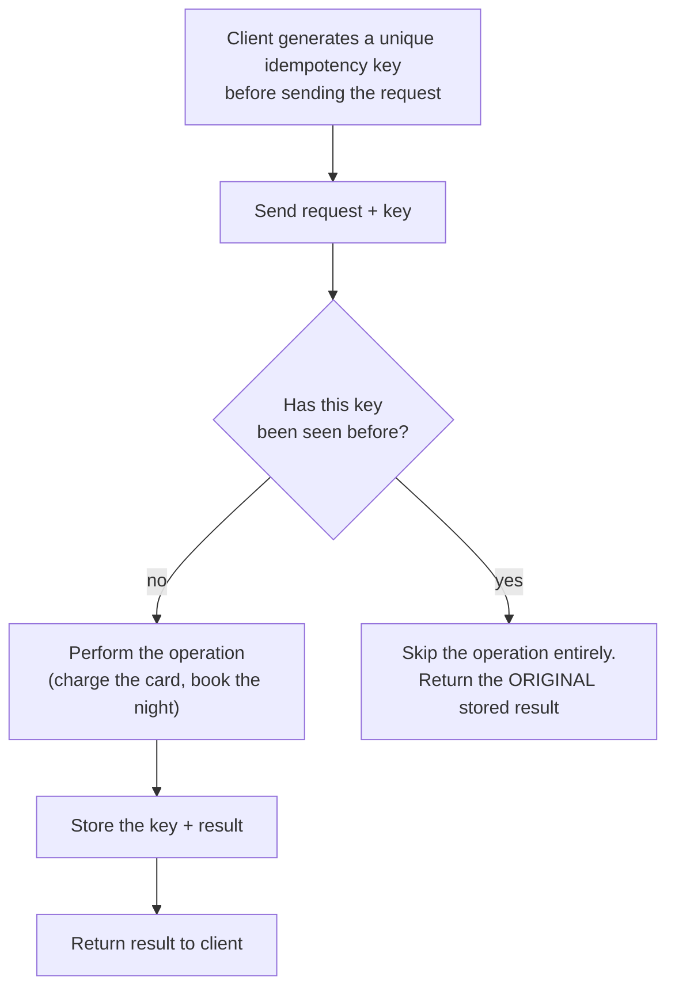
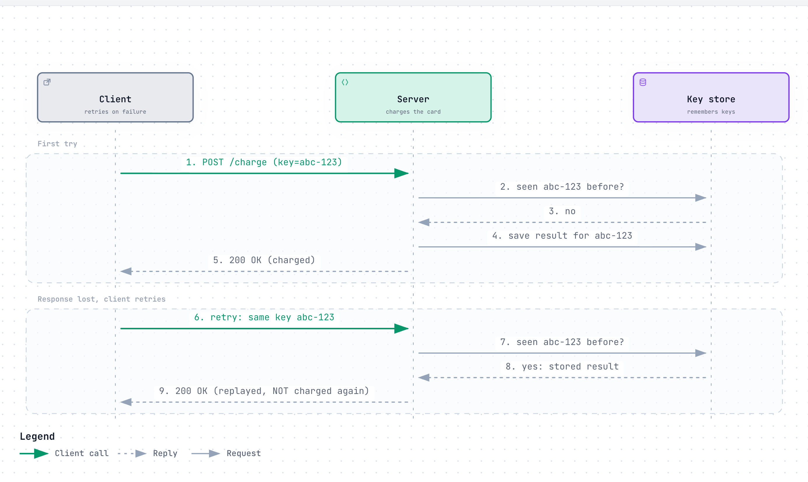
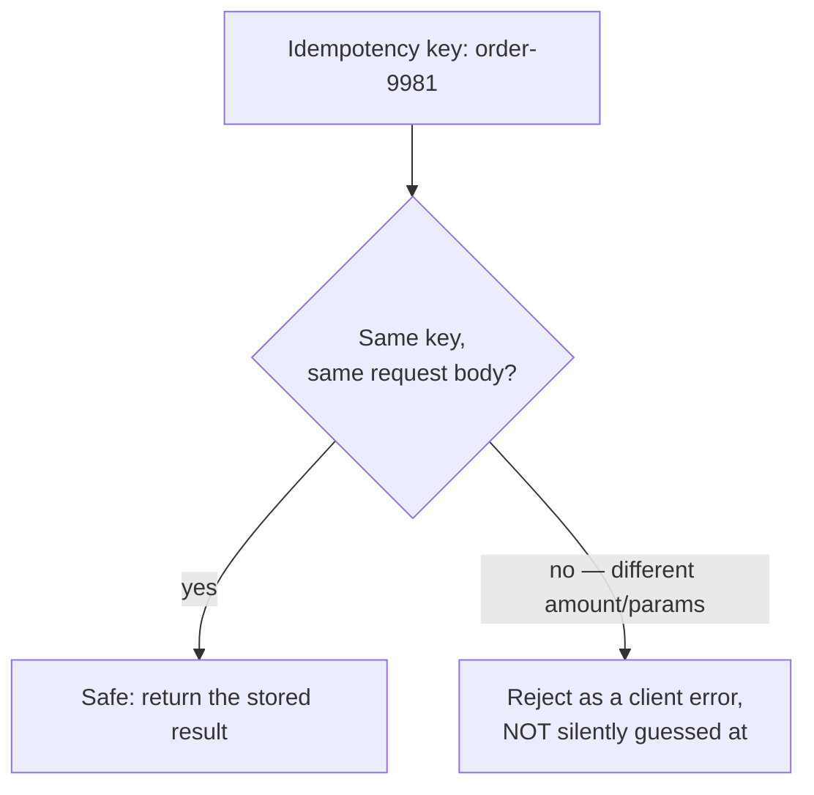
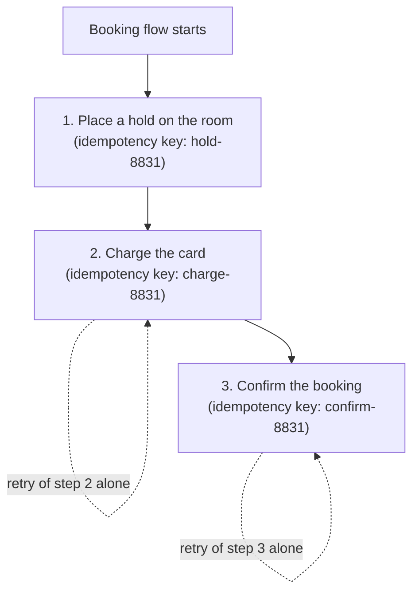

# Idempotency

> A request that does the exact same thing no matter how many times you (accidentally) repeat it — so a retry after a network hiccup can never double-charge, double-book, or double-send.

## The problem it solves (a small story)

You're at an ATM, mid-withdrawal, and the screen freezes. You have no idea if the machine already dispensed your $200 or not. Do you press the button again? If the machine simply "does the withdrawal" every time it's asked, pressing again risks taking out $400 for a request you only meant to make once. But you also can't just walk away — maybe nothing happened at all, and you actually need your cash.

The fix banks actually use: every transaction gets a unique reference number generated *before* it's submitted. If the same reference number shows up twice, the bank recognizes it as "the same request retried," not "a new withdrawal," and simply returns the original result again — including if the original attempt already succeeded. The action itself (dispensing cash) only ever happens once per unique reference, no matter how many times the request is resent. That's idempotency: designing an operation so repeating it has no additional effect beyond the first time.

This is not a hypothetical edge case — it matters enormously anywhere money, bookings, or anything scarce is on the line — and it matters *because* networks are unreliable: a client that times out waiting for a response genuinely cannot tell whether the server never got the request, got it and crashed before responding, or got it, succeeded, and the response just got lost on the way back. Idempotency is what makes "just retry" a safe default answer to that ambiguity, instead of a dangerous one. Stripe's own framing of this is blunt: without something like an idempotency key, the only safe response to an uncertain failure is to never retry at all — which means a single network blip permanently fails a checkout that should have gone through.

## How it works (step by step, with at least 2 Mermaid diagrams)

The standard mechanism is a client-generated **idempotency key**: a unique identifier sent with the request, which the server uses to recognize a retry.

> **Why this matters:** the server never has to guess *why* it's seeing this key again — a genuine timeout, a client crash-and-restart, or an impatient double-click all produce the exact same request, and all get handled by the exact same rule: do it once, remember the result, replay the result forever after.

Step by step:
1. The client generates a unique key (often a UUID) once, before the very first attempt.
2. Every retry of "the same logical request" — including the very first attempt and any resend after a timeout — reuses that same key.
3. The server checks whether it has already seen this key. If not, it performs the real operation and stores both the key and the result — this check-then-act sequence itself needs to be atomic, or two near-simultaneous requests could both pass the check before either one finishes storing.
4. If it has seen the key before, it does **not** repeat the operation — it just returns the exact result it stored the first time, even if that first attempt actually failed (so a client retrying a `500` gets the same `500` back, not a fresh, possibly-different attempt).
5. Keys are typically retained only for a bounded window (Stripe uses roughly 24 hours) — after that, reusing the same key starts a genuinely new request rather than replaying anything.

<a href="https://alwintwk.github.io/big-tech-system-design/diagrams/concepts-idempotency-retry.html">
  <picture>
    <source media="(prefers-color-scheme: dark)" srcset="../diagrams/concepts-idempotency-retry.dark.png">
    
  </picture>
</a>

Click the diagram for the interactive version (zoom, dark mode, trace a path).

> **Why this matters:** notice the client never learns whether its first request actually succeeded before it retried — and it doesn't need to. The key store is the single source of truth for "did this already happen," so the client's own uncertainty about the network is completely absorbed by the server-side check, not left for the client to somehow resolve itself.

## Worked example

A checkout flow calls `POST /charge` with `Idempotency-Key: order-9981`. The request reaches the server, the charge succeeds, but the response is lost to a flaky mobile connection before the client sees it. The client's UI, seeing no response, shows a spinner and then automatically retries the exact same request with the exact same key a few seconds later.

Notice what makes this safe rather than lucky: the client didn't need to know the first attempt actually succeeded. It just needed to reuse the same key — the server's stored result did the rest. No special client-side error handling, no manual reconciliation, no support ticket.

Without idempotency, this retry would be a brand-new charge — the customer is now billed twice for one order, and support has to manually find and refund the duplicate. With it, the server recognizes `order-9981` as already handled, skips billing entirely, and simply returns the original "charged" result. The customer's screen updates correctly, exactly once, and nobody at the company even has to know a retry happened at all — it was absorbed silently by the design, not caught after the fact by a human.

## What idempotency keys don't protect against

An idempotency key only guarantees safety for *the same request*, byte for byte, replayed under the same key. If a client reuses a key but changes the request body (a different amount, a different item), that's not a legitimate retry — it's either a bug or a misuse of the mechanism, and the correct behavior is to reject it outright rather than silently picking one interpretation. Idempotency keys also don't protect against a client generating a genuinely *new* key for what should have been a retry of the same logical operation — that mistake looks, from the server's point of view, exactly like a brand-new, unrelated request.

This narrowness is deliberate: the mechanism only recognizes a byte-identical repeat under the same key, and doesn't try to guess intent beyond that.

Nor do they protect against a bug in the server's own logic: if the operation itself has a bug that produces the wrong result, replaying that same wrong result consistently on every retry is still consistent — just consistently wrong.

## Variants / strategies

| Strategy | How | Pros | Cons |
|---|---|---|---|
| Client-generated idempotency key | Client creates a unique key per logical operation, sent as a header/field on every attempt | Simple contract; works across any transport | Requires clients to actually generate and reuse keys correctly |
| Natural idempotency (by design) | Some operations are already idempotent for free — e.g. `DELETE user 42` or `SET balance = 100` have the same end state no matter how many times they run | No extra bookkeeping needed | Doesn't work for operations that are inherently additive, like "charge $10" or "increment by 1" |
| Pre-RPC / RPC / post-RPC split | Record the *intent* to act durably, perform the action, then record the *outcome* — with the whole sequence keyed by the idempotency key | Handles external, non-idempotent third-party APIs safely (retry the recorded intent, not a fresh call) | More moving parts than a single-step call |
| Concurrent-request locking | A second request with the same key, arriving *while the first is still in flight*, is rejected outright (e.g. `409`) rather than allowed to run in parallel | Guarantees the side effect can never execute twice even under a genuine race | Legitimate rapid retries can occasionally hit a conflict if the first attempt is still mid-flight |
| Key expiry | Idempotency keys are only remembered for a bounded window (e.g. 24 hours), then pruned | Bounds how much storage the key store needs forever | Reusing an expired key starts a genuinely new request, which callers need to understand |
| Database-level uniqueness constraint | A unique constraint on a natural key (e.g. `(order_id)`) rejects a duplicate insert at the database layer itself | No separate key store needed; the database enforces it directly | Only works when the operation maps cleanly onto a single row insert |
| Per-step keys in a multi-step workflow | Each side effect in a longer process gets its own idempotency key, not one shared key for the whole flow | Lets a client safely retry just the failed step | Requires tracking multiple keys and their relationship to one logical operation |
| Version/ETag-based conditional writes | A write only applies if the resource's current version matches what the client last read | Prevents blindly overwriting a concurrent change | Doesn't by itself dedupe a retried *identical* write the way a key does |

## Signals that you need idempotency (and which mechanism)

Reach for idempotency when:
- The operation has a real side effect that shouldn't happen twice (charging money, sending a notification, decrementing inventory).
- The client and server communicate over an unreliable network where retries are a realistic, expected occurrence, not a hypothetical one.
- A retry that silently does the wrong thing twice would be expensive, embarrassing, or both.
- A single logical action actually triggers more than one downstream side effect, each of which needs its own retry safety.

Lean toward a **client-generated key** for anything crossing an untrusted network boundary (a public API). Lean toward a **database uniqueness constraint** when the operation naturally maps to inserting one row per logical action. Lean toward the **pre-RPC/RPC/post-RPC split** specifically when the operation itself calls out to an external system that isn't idempotent on its own — the durable intent record is what makes retrying that external call safe. Lean toward **per-step keys** the moment a single logical action actually involves more than one distinct side effect.

Whichever mechanism is chosen, the underlying test is the same: can this specific operation be safely repeated without asking the client anything extra?

## Idempotency across a multi-step workflow

A single idempotency key on one API call is the simple case. Real payment flows often span several steps, each of which needs its own protection:

> **Why this matters:** each step gets its *own* idempotency key, not one shared key for the whole flow. A retry of "confirm the booking" should never accidentally re-run "charge the card" — keying each side effect separately is what lets a client safely retry just the step that actually failed, without redoing everything before it.

## Where the companies in this repo use it

- **Airbnb** runs every payment call through **Orpheus**, its idempotency framework: durably record the intent to charge before calling the external processor, call it, then record the outcome — a timeout is safely retried against that same recorded intent instead of risking a second charge, which Airbnb reports gets it to "five nines" of payment consistency: [../companies/airbnb.md#booking--payments-flow](../companies/airbnb.md#booking--payments-flow)
- **Stripe** requires a client-generated `Idempotency-Key` on every mutating request; it stores the *first* response verbatim and replays it for any later request with the same key — even if that first attempt returned a `500` — while a concurrently-executing duplicate gets a `409` instead of running in parallel: [../companies/stripe.md#idempotency-keys](../companies/stripe.md#idempotency-keys)
- **Stripe**'s charge flow walks through exactly this key-check-then-replay sequence as the first step of handling any payment request: [../companies/stripe.md#1-charge-request-with-idempotency-key-handling](../companies/stripe.md#1-charge-request-with-idempotency-key-handling)
- **Stripe** also notes a subtlety in how retention interacts with the mechanism: keys can be pruned after roughly 24 hours, and reusing a key after that pruning starts a genuinely fresh request rather than replaying anything: [../companies/stripe.md#scale](../companies/stripe.md#scale)

## Common mistakes

- **Treating "idempotent" and "safe to retry" as the same thing without checking.** `GET` is naturally idempotent (reading doesn't change anything); `POST /charge` is not, by default — it needs an explicit mechanism like an idempotency key to become safely retryable.
- **Generating a new key on every retry.** If the client mints a fresh key each time it resends, the server has no way to recognize the retry as the same logical request — the whole mechanism only works if the *same* key is reused across attempts.
- **Silently accepting a reused key with different parameters.** If a client sends the same idempotency key but asks for a different amount the second time, that's a client bug, not a legitimate retry — it should be rejected, not guessed at.
- **Forgetting external, non-idempotent dependencies.** Even with a perfect idempotency key on your own API, calling a third-party payment processor that itself isn't idempotent can still double-charge — the intent needs to be durably recorded *before* that external call, so a retry replays against the recorded intent instead of making a second real call.
- **No expiry policy.** An idempotency key store that grows forever is a slow, silent storage leak; a bounded retention window (with a clear rule for what happens after expiry) keeps it manageable.
- **No monitoring of replay rates.** A sudden spike in "same key seen again" events is a useful early signal of a client-side bug or a network problem upstream — ignoring that signal means finding out about the underlying issue some other, slower way.
- **No concurrent-request handling.** Without rejecting a second identical request while the first is still in flight, a genuine race (two retries arriving almost simultaneously) can still let the underlying action run twice.
- **Assuming natural idempotency where none exists.** "Increment the counter" and "append to the list" both look like simple operations but are not idempotent — repeating them changes the result every time, unlike a `SET` or a `DELETE`.
- **Assuming idempotency keys are free.** Every mutating request now pays an extra read-then-write against the key store before business logic even runs — that store itself has to be fast and highly available, or it becomes the new bottleneck.
- **One shared key across a multi-step workflow.** A single key covering "place hold, charge card, confirm booking" as one unit makes it impossible to safely retry just the one step that actually failed — each side effect needs its own key.
- **No distinction between a transient and a permanent failure.** Blindly retrying against the same key regardless of *why* the first attempt failed can turn a legitimately-rejected request (invalid card) into a repeated, pointless retry loop.

## Interview questions

Q1. What does it mean for an operation to be idempotent?

Performing it multiple times has the exact same effect as performing it once — repeating it never causes additional side effects beyond the first successful application. `DELETE user 42` is idempotent (the user is gone either way); "charge $10" is not, unless something explicitly makes it so.

HTTP's own spec assumes this: `GET`, `PUT`, and `DELETE` are meant to be idempotent by design, while `POST` is not — which is exactly why `POST` endpoints are the ones that usually need an explicit idempotency key.

Q2. How does a client-generated idempotency key make a non-idempotent operation safe to retry?

The server stores the result of the first request under that key. Any later request presenting the same key gets the original stored result replayed back, without the underlying operation (the charge, the booking) running again — the key turns "do this" into "do this, but only once, ever, no matter how many times you ask."

Crucially, this works even if the first attempt failed — the failure itself is the stored result, and gets replayed too, rather than silently trying again with different behavior.

Q3. What should happen if a request with a given idempotency key is still being processed when an identical retry arrives?

The second request should be rejected outright (e.g. a `409 Conflict`) rather than allowed to execute concurrently — otherwise a genuine race between the original attempt and an eager retry could still let the underlying action run twice before either one finishes.

This does mean a legitimate, very-fast retry can occasionally hit a `409` if the first attempt is still mid-flight — a client is expected to back off and retry again shortly after, not treat the `409` as a hard failure.

Q4. Why can't you just rely on the client checking "did my last request actually succeed?" before retrying?

A network failure can happen at any point: before the server received the request, after it processed the request but before the response came back, or anywhere in between. From the client's side, all of these look identical (no response), so the client fundamentally cannot distinguish "it never happened" from "it happened and I just didn't hear back" — which is exactly why the safety has to live on the server side, keyed by something the client controls.

This is precisely the ambiguity a load balancer occasionally introduces too — a request can be delivered and even processed, with only its response lost in transit.

Q5. How do you make a call to a third-party API idempotent if that API itself doesn't support idempotency keys?

Split the operation into three durable steps under your own idempotency key: record the intent to call the external API before calling it, make the call, then record the outcome. A retry checks the recorded intent/outcome first — if the outcome was already recorded, replay it; if only the intent was recorded (the previous attempt died mid-flight), it's still safe to retry the external call, since nothing indicates it ever completed.

This pre-RPC/RPC/post-RPC pattern is exactly what Airbnb's Orpheus framework does for calls into external payment processors.

## Related concepts

- [CAP theorem and consistency](cap-and-consistency.md) — idempotency is what makes retrying under network uncertainty safe
- [Rate limiting](rate-limiting.md) — both idempotency keys and rate limits are commonly implemented as per-key state in a shared store
- [Message queues and logs](message-queues-and-logs.md) — most queues deliver "at-least-once," which is exactly why idempotent consumers matter
- [Replication](replication.md) — replication between a leader and its followers is itself an at-least-once delivery problem that benefits from idempotent application
- [Load balancing](load-balancing.md) — a load balancer can itself occasionally deliver the same request twice, which is one more source of the duplicates idempotency guards against
- [Fan-out](fan-out.md) — a fanned-out event delivered to many recipients is another place "at least once" delivery means consumers must tolerate duplicates

## Further reading

- [Idempotence — Wikipedia](https://en.wikipedia.org/wiki/Idempotence)
- [Stripe — Idempotent requests](https://docs.stripe.com/api/idempotent_requests)

Back to the ATM: the machine was never trying to be clever. It just refused to forget what it had already done, no matter how many times you asked again.

That's the whole trick — not smarter retries, just a memory that never lies about what already happened.

Everything else in this page is just the engineering required to make that memory fast, cheap, and safe under real network failures.
