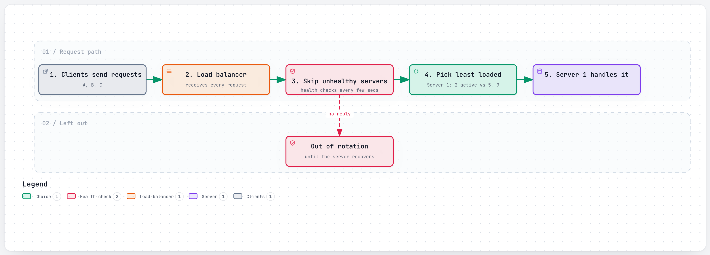
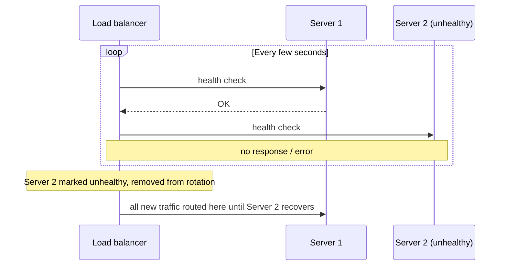
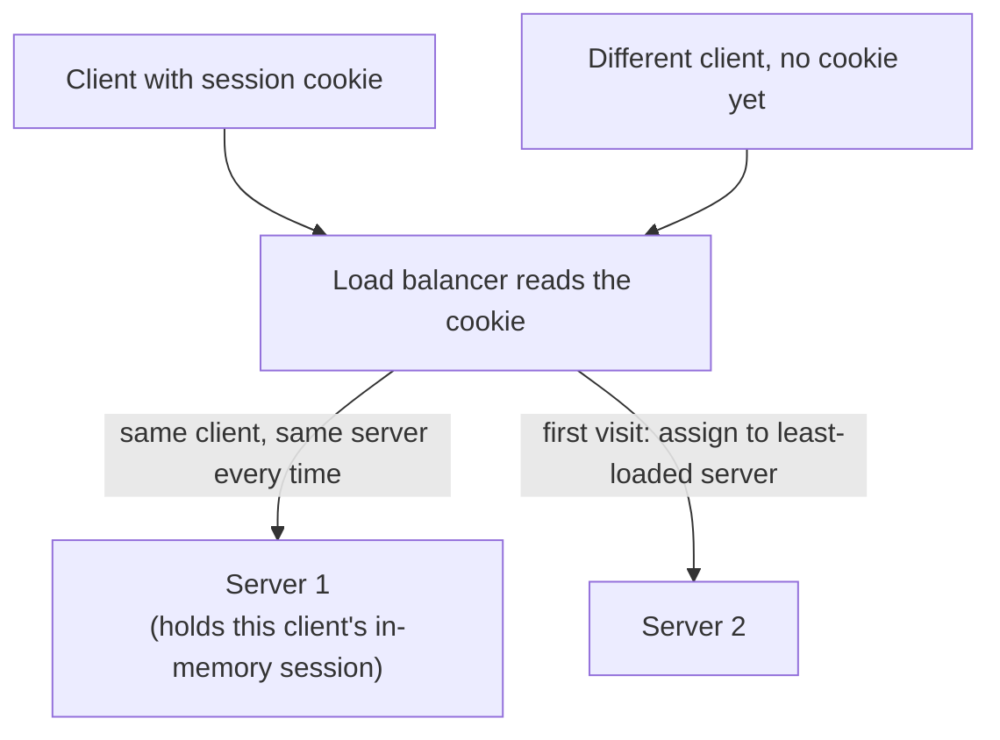
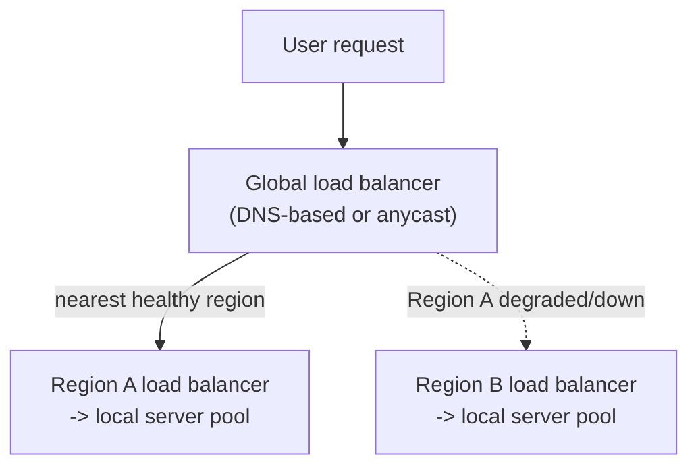

# Load Balancing

> A traffic cop standing in front of a group of identical servers, deciding which one gets each new request, so no single server gets crushed while others sit idle.

## The problem it solves (a small story)

Picture three checkout lanes at a grocery store, but no one directing shoppers — everyone just picks a lane at random. By chance, lane 2 ends up with the person buying groceries for a party of twenty while lanes 1 and 3 sit nearly empty. The store has plenty of total capacity; it's just badly distributed.

Now put a host at the front who glances at each lane and sends new shoppers to whichever is shortest. Total capacity hasn't changed, but now it's actually *used* — no lane sits idle while another backs up. That host is a load balancer: something that sits in front of a pool of identical (or similar) servers and decides, request by request, which one should handle the next piece of work.

This matters because a single server has a ceiling — CPU, memory, network — and the whole reason to run many servers instead of one bigger one is to raise that ceiling. A load balancer is what actually makes "many servers" behave like one bigger, faster service instead of a pile of unevenly-loaded machines. Twitter/X's own history shows what happens without one: a single Rails process could only run one thread of Ruby at a time no matter how many cores its server had, and no amount of adding servers helped until the serving stack itself was rewritten on the JVM — Blender, a Java server, replaced the Rails front end for search in 2011, and the wider JVM re-architecture that followed took per-host throughput from roughly 200-300 requests/sec to 10,000-20,000 requests/sec by 2013.

## How it works (step by step, with at least 2 Mermaid diagrams)

<a href="https://alwintwk.github.io/big-tech-system-design/diagrams/concepts-load-balancing-flow.html">
  <picture>
    <source media="(prefers-color-scheme: dark)" srcset="../diagrams/concepts-load-balancing-flow.dark.png">
    
  </picture>
</a>

Click the diagram for the interactive version (zoom, dark mode, trace a path).

> **Why this matters:** clients never talk to Server 1, 2, or 3 directly — they only ever know about the load balancer's single address. That indirection is what lets servers be added, removed, or replaced behind the scenes without any client ever needing to change anything.

Step by step:
1. Every client talks to one address — the load balancer — never directly to an individual backend server.
2. The load balancer picks a backend using some algorithm (round robin, least connections, a hash of the client, and so on).
3. It forwards the request to that backend and relays the response back to the client, so from the outside, the whole pool looks like one service — this is the same illusion of "one service" a CDN edge and a GSLB both create, just at different layers.
4. A **health check** continuously pings each backend; one that stops responding is pulled out of rotation automatically, so a dead server doesn't keep receiving traffic.
5. When a server is intentionally removed (a deploy, a scale-down), a well-behaved balancer **drains** it first — new traffic stops arriving, but requests already in flight are allowed to finish.

> **Why this matters:** removing a failed server from rotation without any manual intervention is often the real payoff of load balancing — it turns "a server crashed" from an incident someone has to wake up for into a routine, automatic non-event.

## Worked example

A pool of 4 identical servers is handling 1,000 requests per second under round robin — each server gets roughly 250. One of them starts silently leaking memory and slows down, taking twice as long to answer each request as the others. Round robin, which doesn't look at actual load, keeps sending it a full quarter of all traffic anyway — its queue of in-flight requests grows and grows, and its response times get steadily worse, dragging down the *average* response time across the whole service even though the other three servers are perfectly healthy.

Switch to least-connections instead: as soon as the slow server's in-flight request count climbs above the others', new requests get steered toward the three healthy servers instead. The slow server keeps getting *some* traffic (it isn't fully down, just slow), but its share naturally shrinks to match how quickly it's actually able to work through its queue — exactly the adaptive behavior round robin can't provide.

## Sticky sessions and when they're worth it

Sticky sessions route a given client to the *same* backend every time, usually so that server can keep something in memory (a shopping cart, a live connection) without needing to fetch it from a shared store on every request. The cost: that client's experience is now tied to that one server's health specifically — if it goes down, that client's in-memory state goes with it, unlike a client whose state lives in a shared cache or database that any backend can read.

## Balancing across regions, not just servers

The same idea applies one level up: instead of balancing requests across servers in one data center, a **global server load balancer (GSLB)** balances across entire regions.

> **Why this matters:** this is the same health-check-and-reroute idea as balancing across individual servers, just applied at a coarser grain — a GSLB can route users away from an entire unhealthy region, the same way a local load balancer routes around one unhealthy server, without users needing to know a region-level failure happened at all.

## Variants / strategies

| Strategy | How | Pros | Cons |
|---|---|---|---|
| Round robin | Requests handed out in strict rotation, one server at a time | Simple; even distribution if requests are similar in cost | Ignores actual server load — a slow request on one server doesn't reduce its share |
| Least connections | New request goes to whichever server currently has the fewest active connections | Adapts to uneven request costs better than round robin | Needs the balancer to track live connection counts |
| Consistent-hash / sticky routing | Requests from the same client (or key) always land on the same backend | Lets that backend build a warm local cache for that client, a good fit for stateful edge servers | Losing that one backend disproportionately affects the clients "stuck" to it, unless paired with [consistent hashing](consistent-hashing.md) |
| Layer 4 (transport-level) | Balances raw TCP/UDP connections, without looking at the request content | Very fast, low overhead | Can't route based on anything inside the request (URL, headers) |
| Layer 7 (application-level) | Reads the actual HTTP request (path, headers) to make a routing decision | Can route `/video` traffic differently from `/api` traffic | More CPU cost per request than layer 4 |
| Weighted round robin | Servers with more capacity get proportionally more requests per rotation | Lets a mixed-capacity fleet (some bigger boxes than others) be used efficiently | Weights need to be set and updated as hardware changes |
| Global server load balancing (GSLB) | Routes users to the nearest healthy region, not just the nearest server within one | Survives a whole region going down, not just a single server | Cross-region health-check propagation is slower than a local health check |
| Random selection with two choices (power of two) | Pick two servers at random, route to whichever has less load | Nearly as balanced as checking every server, at a fraction of the coordination cost | Slightly less precise than true least-connections |
| IP hash | Route based on a hash of the client's IP address | Simple form of stickiness with no cookie needed | Many clients behind the same NAT/proxy can collapse onto one server |

## Signals that you need a load balancer (and which algorithm)

Reach for load balancing when:
- More than one server can serve the same request, and you want clients to see them as one service.
- Individual servers fail or need to be replaced (deploys, scaling events) without users noticing.
- The service already knows it wants both fast local failover AND regional disaster recovery, not just one.
- Traffic needs to survive not just a server failing, but an entire region becoming unreachable.
- Different endpoints have different enough cost profiles that a single routing rule for all of them leaves capacity poorly matched to demand.

Lean toward **round robin** when requests are roughly uniform in cost. Lean toward **least connections** when request cost varies a lot, or servers can have different capacities. Lean toward **layer 7** when different kinds of requests genuinely need different routing (a heavy video-processing endpoint separated from a lightweight status-check endpoint). Lean toward **sticky/consistent-hash routing** specifically when a backend needs to hold in-memory state for a given client across multiple requests — and reconsider whether that state could live in a shared store instead, before reaching for stickiness as the default. Lean toward a **GSLB** layer on top of all of this once the product needs to survive a whole region, not just a single server, going down.

## Where the companies in this repo use it

- **Instagram** routes every dynamic request through a load balancer into its Django monolith, while anything cacheable (static assets, already-processed media) is instead served straight from a CDN edge, never reaching a backend server at all: [../companies/instagram.md#high-level-design](../companies/instagram.md#high-level-design)
- **Slack** has clients open their real-time WebSocket connection through an **Envoy** edge load balancer, which routes each new connection to the *nearest* Gateway Server rather than a fixed, hardcoded one: [../companies/slack.md#high-level-design](../companies/slack.md#high-level-design)
- **WhatsApp** load-balances a level deeper than "spread calls across containers": individual *participants* within the same group call can be distributed across different relay containers, not just whole calls: [../companies/whatsapp.md#calling-relay-infrastructure-riding-on-the-cdn](../companies/whatsapp.md#calling-relay-infrastructure-riding-on-the-cdn)
- **Twitter/X** replaced its Rails-based search front end with **Blender**, a Java server, cutting search latency 3x in 2011; the wider JVM re-architecture that followed took per-host throughput from roughly 200-300 requests/sec to 10,000-20,000 requests/sec by 2013 — the serving/routing tier redesign that gave the rest of the Rails-era system real breathing room: [../companies/twitter-x.md#how-it-evolved](../companies/twitter-x.md#how-it-evolved)
- **Netflix**'s AWS control plane sits behind a gateway (Zuul) fronting thousands of independently deployable microservices, so the team owning one service can deploy without waiting on, or breaking, any other team's traffic: [../companies/netflix.md#microservices-on-aws-the-control-plane-stack](../companies/netflix.md#microservices-on-aws-the-control-plane-stack)
- **Spotify** describes **Envoy** as a widely used open-source proxy that sits in front of its backend services, handling traffic routing, retries, and load balancing rather than leaving each service to implement that itself: [../companies/spotify.md#glossary](../companies/spotify.md#glossary)

## A second worked example: region failover

Say GSLB health checks confirm Region A is unreachable — not just one server, the whole region. Instead of every user in that region seeing errors, the GSLB stops advertising Region A as a destination and routes all affected traffic to the nearest healthy region instead. Users experience, at worst, a brief blip during the failover detection window, followed by normal service from a different region — the same "automatic, boring non-event" outcome a single-server health check gives you, just at a much larger scale, and typically with a longer detection window since confirming an entire region is unreachable (rather than one flaky server) usually warrants being more certain before acting.

## Common mistakes

- **No health checks, or health checks that lie.** A load balancer that keeps sending traffic to a server that's technically "up" (process running) but functionally broken (can't reach its database) doesn't actually protect anything.
- **Sticky sessions used to avoid fixing statelessness.** Pinning a client to one server can mask the real problem — that the server holds session state it shouldn't — and turns "one server dies" into "that server's clients all get disrupted at once," instead of being spread harmlessly across the whole pool.
- **Load balancing the wrong layer.** Balancing raw connections (layer 4) when the actual imbalance is about *which endpoint* is expensive (layer 7) won't fix a hot API route.
- **A load balancer that's itself a single point of failure.** If there's only one load balancer instance, its own health becomes the new bottleneck — production setups usually run load balancers in pairs or behind DNS/anycast, not as one box.
- **Ignoring uneven request cost.** Round robin assumes every request costs about the same to serve; if some requests are 100x more expensive than others, round robin alone can still leave one server drowning.
- **No draining on server removal.** Yanking a server out of rotation instantly, mid-request, drops whatever it was already handling — a well-behaved removal waits for in-flight requests to finish first.
- **Treating weights as set-and-forget.** A weighted scheme that isn't revisited as hardware or traffic patterns change can silently drift out of balance over time.
- **No region-level failover plan.** Balancing only within one region means a whole-region outage still takes the service down, even if every individual server-level health check was working perfectly.
- **Overreacting to a single failed health check.** A health check that trips on one transient blip (a momentary GC pause, a slow but recovering dependency) can needlessly yank a perfectly good server out of rotation — most production systems require a few consecutive failures before acting.
- **Using the same failure threshold for a single server and for a whole region.** A region-level failover is a much bigger, more disruptive action than pulling one server out of rotation, and usually deserves a stricter confirmation threshold before triggering.
- **Forgetting client-side connection reuse.** A client holding a long-lived connection to one backend can keep sending it traffic even after the load balancer would have routed a *new* connection elsewhere — connection pooling and load balancing interact in ways worth checking explicitly.
- **No visibility into per-backend load.** Without dashboards showing request counts, latencies, and error rates per backend, an imbalance can persist for a long time before anyone notices it's happening at all.
- **IP-hash routing behind a large NAT.** Many users appearing to share one IP address (a corporate network, a mobile carrier's NAT) can all collapse onto a single backend, defeating the point of balancing at all.

## Interview questions

Q1. What's the difference between layer 4 and layer 7 load balancing?

Layer 4 balances raw TCP/UDP connections without inspecting their contents — fast, but it can't make routing decisions based on what's actually in the request. Layer 7 reads the application-level request (HTTP path, headers, cookies) and can route different kinds of traffic differently, at the cost of more processing per request.

Many real deployments use both: a layer 4 balancer at the outer edge for raw throughput, handing off to a layer 7 balancer for path-aware routing further in.

Q2. How does a load balancer know a backend server is unhealthy?

It runs periodic health checks — a lightweight ping or request the backend must answer correctly and quickly. Repeated failures pull that server out of rotation automatically; when it starts passing health checks again, it's added back.

A good health check verifies real dependencies (can the backend reach its own database?), not just "is the process running."

Q3. Why might sticky sessions (routing a client to the same server every time) be risky?

They tie a client's experience to one specific backend's health — if that backend gets slow or dies, every client stuck to it feels it directly, rather than the load being absorbed harmlessly across the whole pool. They also often exist as a workaround for state that should have lived somewhere shared instead of in one server's memory.

Slack's Gateway Servers are a case where holding state in memory is deliberate, not a workaround — paired with fast, automated replacement so losing one is still cheap.

The general test: is the stickiness paying for something genuinely valuable (a warm cache, a live socket), or just papering over state that was never designed to move?

Q4. What's the difference between load balancing and a CDN?

A CDN routes users to the *geographically nearest* cache of content, primarily to cut latency and offload the origin. A load balancer distributes live requests across a pool of servers, primarily to keep no single server overloaded. They're often used together — a CDN's own edge nodes are typically load-balanced internally too.

A global server load balancer sits conceptually between the two ideas, routing by region health rather than by content locality or single-server load.

Q5. What happens to in-flight requests when a load balancer removes a server from rotation?

Requests already in progress on that server generally aren't automatically saved — a well-behaved deployment drains a server (stops sending it *new* traffic, waits for existing requests to finish) before removing it, rather than yanking it out while it's mid-request, to avoid dropping active work.

A hard cutoff after some maximum drain time is still usually needed, in case one request genuinely never finishes.

## Related concepts

- [Caching](caching.md) — often paired with load balancing at the same edge tier
- [Consistent hashing](consistent-hashing.md) — a technique for sticky, stateful load balancing that survives servers joining/leaving
- [Rate limiting](rate-limiting.md) — protects individual backends from any one client, a complementary concern to spreading load evenly
- [CDN](cdn.md) — a geographic form of routing requests to the "closest" server
- [Microservices](microservices.md) — each independently-deployed service typically sits behind its own load balancer
- [Replication](replication.md) — a load balancer is often what actually spreads reads across a set of replicas
- [Message queues and logs](message-queues-and-logs.md) — an alternative to synchronous load-balanced requests when the caller doesn't need to wait for the answer
- [CAP theorem and consistency](cap-and-consistency.md) — a GSLB's region failover is an availability choice, made explicit at a geographic scale

## Further reading

- [Load balancing (computing) — Wikipedia](https://en.wikipedia.org/wiki/Load_balancing_(computing))

Back to the grocery store: the host at the front never makes any single checkout lane faster. All they do is stop the store from looking overwhelmed when it isn't.

The moment there's more than one lane, someone (or something) has to decide who goes where — that decision is the entire job.

Whether that decision is made per-server or per-region, the underlying question never changes: which healthy option is best placed to help right now.
