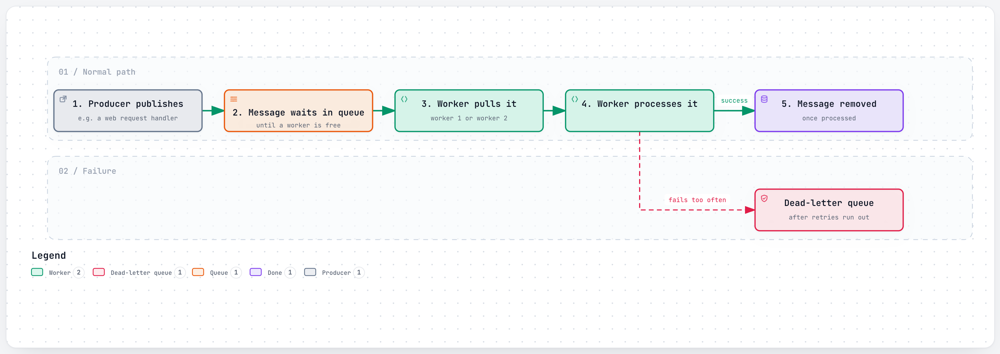
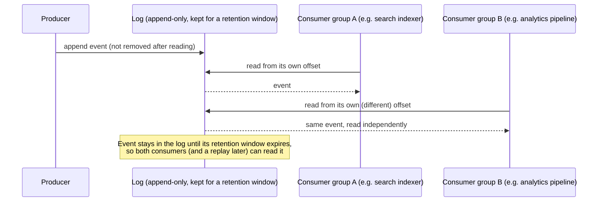
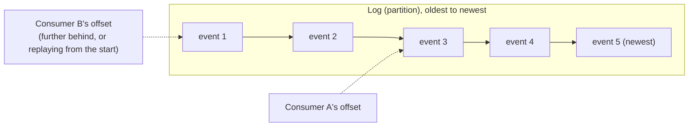
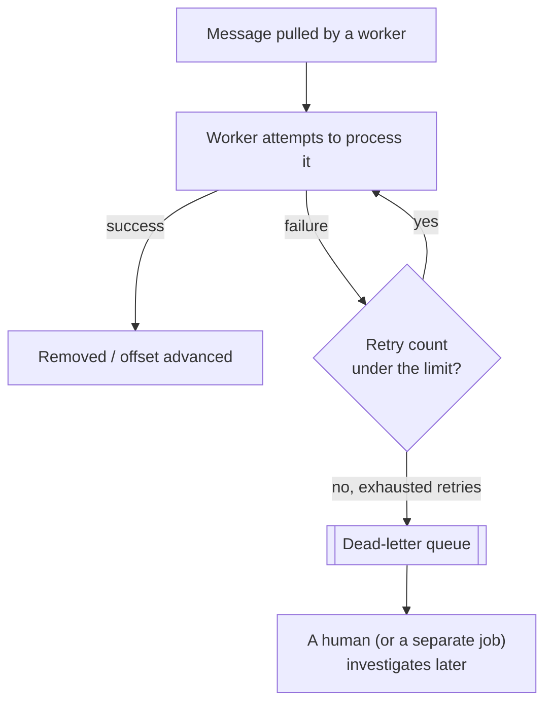

# Message Queues and Logs

> A way for one part of a system to hand work to another part without waiting for it — by dropping a note in a shared inbox instead of making a phone call.

## The problem it solves (a small story)

Imagine a restaurant kitchen where the waiter has to personally hand each order to the chef and *stand there* until the chef finishes cooking it before taking the next table's order. One slow dish and the whole restaurant grinds to a halt — the waiter's speed is now capped by the chef's speed, even though greeting new tables and cooking food are completely different jobs.

The obvious fix is a spike full of order tickets. The waiter pins an order and immediately goes to the next table; the chef pulls tickets off the spike whenever they're free. Neither one waits on the other. If the chef falls behind, tickets pile up on the spike rather than waiters freezing mid-service. That spike is a **message queue**: a buffer that decouples the thing producing work from the thing doing it.

This exact problem shows up constantly in these systems: a user action (a play, a click, a message send) needs to trigger real work (search indexing, analytics, transcoding) that shouldn't block the response the user is actually waiting for. Every company in this repo that logs "what just happened" separately from "handling the request" is using some version of this pattern. Spotify's own history is a good illustration of just how much this choice can change over time: the same underlying need (get an event from a phone to a data warehouse) went through three entirely different technology choices as the volume and reliability requirements grew.

## How it works (step by step, with at least 2 Mermaid diagrams)

<a href="https://alwintwk.github.io/big-tech-system-design/diagrams/concepts-message-queue-flow.html">
  <picture>
    <source media="(prefers-color-scheme: dark)" srcset="../diagrams/concepts-message-queue-flow.dark.png">
    
  </picture>
</a>

Click the diagram for the interactive version (zoom, dark mode, trace a path).

> **Why this matters:** the producer's job ends the moment the message is safely queued — it never learns or cares which worker eventually handles it, or how long that takes. That decoupling is what lets the producer stay fast even when downstream processing is temporarily slow.

Step by step (classic queue):
1. A producer publishes a message (a job, an event) onto the queue and moves on immediately — it doesn't wait for the message to be processed.
2. One or more consumer workers pull messages off the queue and do the real work.
3. Once a message is successfully processed, it's typically removed from the queue — each message is meant to be consumed once.
4. If the queue has more messages than workers can process, it grows a backlog instead of the producer being slowed down — a deliberate trade of "instant" for "eventually."

A **log** (Kafka's model) looks similar from the outside but works differently underneath, and that difference matters a lot at scale:

> **Why this matters:** the producer published the event exactly once, but two completely independent systems each got their own full copy of it, at their own pace, without either one blocking the other or the producer. A plain queue can't do this — once consumed, the message is gone.

The key difference: a traditional queue message is consumed once and gone. A log keeps events for a retention window (hours, days, or longer) and lets many independent consumer groups each read at their own pace, from their own position — and lets a new consumer replay history it missed. That's why Kafka-style logs are the default choice when more than one downstream system needs the same event stream (search indexing *and* analytics *and* a data warehouse, all from one write).

## Worked example

A play event happens on a phone: "user 42 played track 991 at 14:03:07." Three different systems need this exact event, for three different reasons: a real-time "now playing" feature, a royalty-accounting pipeline, and a recommendation model's training data.

With a plain queue, the event would need to be published three separate times (or a single consumer would need to read it once and then forward it to the other two, adding its own coupling and failure point). With a log, the event is published once, and each of the three systems is its own independent consumer group, reading from the same log at its own pace — the royalty pipeline can run once a day and still see every single event exactly once, even though the "now playing" feature consumed the very same event within milliseconds.

## Consumer offsets and replay

Each consumer tracks its own **offset** — a bookmark saying "I've processed up through here." A consumer that crashes and restarts simply resumes from its last saved offset; a brand-new consumer (or one intentionally re-processing history, say after fixing a bug in its own logic) can rewind its offset back to the beginning and replay everything from scratch. Neither operation touches the log itself or affects any other consumer's offset — this per-consumer bookmark is exactly what a plain "consume and delete" queue cannot offer.

## Signals that you need a queue or log (and which one)

Reach for asynchronous messaging when:
- The work triggered by an action doesn't need to finish before the user gets a response (indexing, notifications, analytics).
- One producer's output needs to reach more than one independent downstream system.
- Load on the producer and load on the consumer need to scale independently of each other.
- A slow or temporarily-down downstream system shouldn't be able to take the producer down with it.

Lean toward a **log** specifically when:
- More than one consumer group needs the same events, each at its own pace.
- Replay (reprocessing history, backfilling a new consumer) is a real, anticipated need, not a hypothetical one.

Lean toward a plain **queue** when:
- There's exactly one kind of worker doing exactly one kind of job, and once it's done, nobody else needs to know about that specific message again.
- Operational simplicity matters more than the extra flexibility a log provides.

## Variants / strategies

| Strategy | How | Pros | Cons |
|---|---|---|---|
| Point-to-point queue (e.g. Redis-backed queue, SQS) | One message, consumed once by one worker, then removed | Simple; natural fit for "do this job exactly once" | Once consumed, it's gone — a second downstream consumer can't independently replay it |
| Publish-subscribe (pub/sub) | A message is broadcast to every subscriber of a topic | Many independent consumers can react to the same event | Consumers can't easily "rewind" past events unless the broker retains them |
| Log (Kafka-style) | Events appended to a durable, ordered, replayable log; consumers track their own read position | Multiple consumer groups, replay, strict per-partition ordering | Heavier operationally than a simple queue; you manage retention and partitioning |
| Managed/serverless (Cloud Pub/Sub, SQS) | Someone else runs the broker; you get an API | No operational burden of running the broker yourself | Less low-level control; tied to a vendor's guarantees and pricing |
| Dead-letter queue | Messages that repeatedly fail processing get routed aside instead of blocking the queue | One poison message can't jam the whole pipeline | Needs a plan for someone to actually look at the dead-letter queue |
| Priority queue | Higher-priority messages are dequeued before lower-priority ones, regardless of arrival order | Critical work isn't starved by a flood of low-priority work | Low-priority messages can be delayed indefinitely under sustained load |
| Fan-out topic (pub/sub over a log) | One topic, many independent subscribers, each with their own consumer group | Combines a log's replay with pub/sub's "many independent listeners" model | Still needs partitioning/key design to keep ordering guarantees meaningful |

## Handling a message that keeps failing

> **Why this matters:** without this path, a single message that can never succeed (bad data, a bug in the consumer) would either block every message behind it in the queue, or get retried forever, burning resources on something that was never going to work. Routing it aside after a bounded number of attempts keeps the rest of the queue flowing while still preserving the failed message for investigation, instead of silently discarding it.

## Choosing a queue vs. a log

A quick way to decide:
1. **Will more than one independent system need to react to the same event?** If yes, a log's multiple-consumer-groups model fits much better than a queue, where consuming removes the message for everyone.
2. **Does anything ever need to replay history** (reprocess last week's events after fixing a bug, backfill a new consumer)? A log supports this natively; a plain queue does not, once messages are consumed.
3. **Is strict ordering within a key important** (all of one user's events processed in order)? Both can support this via partitioning by key, but it's a first-class log feature.
4. **Is the workload simple, one-shot background jobs** (send this email, resize this image)? A plain queue is usually simpler to operate and reason about, and the extra durability/replay machinery of a log may be unnecessary weight.
5. **Does the team already run one of these well?** Operational familiarity is a real cost/benefit factor — a team that already runs Kafka reliably may reasonably reach for it even for a workload a plain queue could technically handle.

## Where the companies in this repo use it

- **Spotify** logged every play, skip, and search as an event through a self-hosted Kafka pipeline until 2017, then migrated to Google Cloud Pub/Sub and Dataflow — moving off self-hosted Kafka removed an operational burden and let event throughput grow roughly 11x with much less added infrastructure work: [../companies/spotify.md#event-delivery-from-a-self-hosted-queue-to-a-managed-one-twice](../companies/spotify.md#event-delivery-from-a-self-hosted-queue-to-a-managed-one-twice)
- **Discord** replaced a Redis-backed queue feeding its search indexer — one that would silently drop messages once its CPU maxed out — with Google Cloud PubSub specifically for guaranteed delivery, so a backlog piles up instead of quietly losing messages: [../companies/discord.md#search-infrastructure-from-two-clusters-to-forty](../companies/discord.md#search-infrastructure-from-two-clusters-to-forty)
- **Airbnb** propagates changes (a listing update, a booking confirmation) asynchronously via a **Kafka event bus**, fed by change-data-capture tooling (SpinalTap), so a spike in one domain's indexing load can't slow down another domain's writes: [../companies/airbnb.md#soa-migration-from-the-rails-monolith](../companies/airbnb.md#soa-migration-from-the-rails-monolith)
- **Slack** kept Kafka as a durable buffer in front of Redis for its job queue after a real production outage — database contention slowed job execution until Redis hit its memory limit and stopped accepting new jobs — so jobs now survive a Redis blip because Kafka is still holding them, while a component called JQRelay applies rate limiting and retry logic as it drains the backlog back into Redis: [../companies/slack.md#the-job-queue-from-a-redis-outage-to-a-kafka-backed-pipeline](../companies/slack.md#the-job-queue-from-a-redis-outage-to-a-kafka-backed-pipeline)
- **Netflix** routes asynchronous events (viewing activity, telemetry) through Kafka queues into stream-processing pipelines, so a slow or temporarily-down analytics job never blocks the user-facing request that generated the event: [../companies/netflix.md#high-level-design](../companies/netflix.md#high-level-design)
- **Twitter/X** moved its message queue onto the JVM in Scala first, ahead of a full system rewrite, specifically because it (along with tweet storage) was one of the two hottest, most bottlenecked backend paths during the platform's early "Fail Whale" era: [../companies/twitter-x.md#how-it-evolved](../companies/twitter-x.md#how-it-evolved)
- **YouTube** queues each uploaded video's transcode job rather than running it inline, so a crash downstream never means re-uploading the file, and fans that one job out into a dozen-plus independent per-rendition tasks pulled by a worker fleet: [../companies/youtube.md#high-level-design](../companies/youtube.md#high-level-design)

## Common mistakes

- **Using a plain queue when multiple independent consumers need the same events.** A message consumed once by the first reader is gone — if a second system (analytics, a data warehouse) also needs it, a log with independent consumer offsets fits better than a queue.
- **No dead-letter handling.** A single message that always fails processing (a poison message) can block an entire queue if there's nowhere for it to go after a few failed retries.
- **Treating "published" as "durable."** If the broker itself has no replication (an early, single-copy Kafka deployment, for example), a broker failure before data replicates elsewhere can genuinely lose events — durability of the queue/log itself has to be designed, not assumed.
- **Ignoring backpressure.** A queue that grows without bound because consumers can't keep up isn't "handling load," it's delaying an outage — production systems need a plan for what happens when the backlog itself becomes the problem (shed load, add consumers, or alert).
- **Fire-and-forget clients with no resend logic.** If the producer doesn't confirm its message was durably accepted, a dropped connection during publish can silently lose events with no error on either side.
- **No retention plan for a log.** Keeping every event forever is rarely necessary and eventually becomes a real storage cost — a retention window bounds it, at the cost of losing the ability to replay anything older than that window.
- **Assuming a consumer group's offset can never fall behind meaningfully.** A slow or crashed consumer can accumulate a large amount of unprocessed backlog silently, unless lag itself is monitored and alerted on.
- **Publishing events with no schema discipline.** A producer that changes an event's shape without warning can silently break every consumer parsing it — schema evolution needs its own plan, not an afterthought.
- **One giant topic/queue for everything.** Mixing unrelated event types in one stream makes it impossible for a consumer to subscribe to just what it needs, and one noisy event type can drown out a quieter but more important one.

## Interview questions

Q1. What's the core difference between a traditional message queue and a Kafka-style log?

A queue message is consumed once and removed — it's built for "exactly one worker does this job." A log is an append-only, retained stream that many independent consumer groups can each read at their own pace and position, including replaying events they've already seen before. Queues suit one-off jobs; logs suit "many systems need to react to the same stream of truth."

A useful mental shortcut: if the answer to "could a second, unrelated system ever want this same message" is yes, reach for a log.

Q2. Why would a company move off a self-hosted queue/log onto a managed service?

To shed the operational burden of running brokers, replication, and scaling the cluster yourself — Spotify's move from self-hosted Kafka to Google Cloud Pub/Sub is the direct example: it let event throughput grow roughly 11x with much less added infrastructure work, at the cost of some low-level control and being tied to the vendor's guarantees.

This trade-off tends to look better the smaller and less specialized the team running the infrastructure is.

Q3. What happens when a consumer can't keep up with a queue's incoming rate?

A backlog grows. Depending on the design, that's either fine (a durable log or a queue built to tolerate backlogs, like the PubSub Discord moved to) or a real failure mode (a queue that silently drops messages under CPU pressure once a threshold is hit, which is exactly the bug Discord's original Redis-backed queue had).

Q4. Why put Kafka in front of Redis instead of just using Redis as the queue?

Redis alone can lose queued jobs if it goes down before they're processed. Keeping Kafka as a durable buffer upstream means jobs survive a Redis blip — Kafka is still holding them and can redrain into Redis once it recovers — which is exactly the design Slack adopted after Redis actually went down in production, not just a close call.

Q5. How do you guarantee ordering in a partitioned queue/log?

Guarantee order only *within* a partition, by routing all events for the same key (a channel ID, a user ID) to the same partition — never promise global ordering across the whole topic, since that would remove the parallelism that makes partitioning worthwhile in the first place.

Discord's bucketed Cassandra partition key for messages is the same idea applied to storage rather than a live queue.

## Related concepts

- [Fan-out](fan-out.md) — often implemented by publishing one event that many subscribers independently consume
- [Idempotency](idempotency.md) — queues typically guarantee "at-least-once" delivery, so consumers must handle the same message arriving twice
- [Sharding](sharding.md) — partitioning a log/queue by key is the same idea as sharding a database
- [Microservices](microservices.md) — queues/logs are the usual way independently-deployed services communicate without calling each other synchronously
- [CAP theorem and consistency](cap-and-consistency.md) — a durable log is a common building block for reconciling diverged state after a partition heals
- [Persistent connections](persistent-connections.md) — a consumer can push what it reads from a queue/log straight down an already-open connection to a client

## Further reading

- [Message queue — Wikipedia](https://en.wikipedia.org/wiki/Message_queue)
- [Publish–subscribe pattern — Wikipedia](https://en.wikipedia.org/wiki/Publish%E2%80%93subscribe_pattern)
- [Apache Kafka — Introduction](https://kafka.apache.org/intro)

Back to the kitchen: a queue is a spike of tickets consumed one by one. A log is more like a shared order book everyone can re-read from wherever they left off — including someone who wasn't even in the kitchen yet when the order first came in.

Either way, the point was never the spike or the order book themselves — it's that the waiter never had to stand there waiting for the food to finish cooking.
