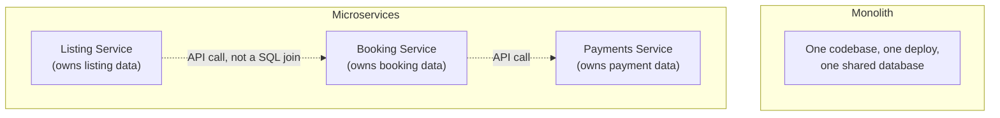
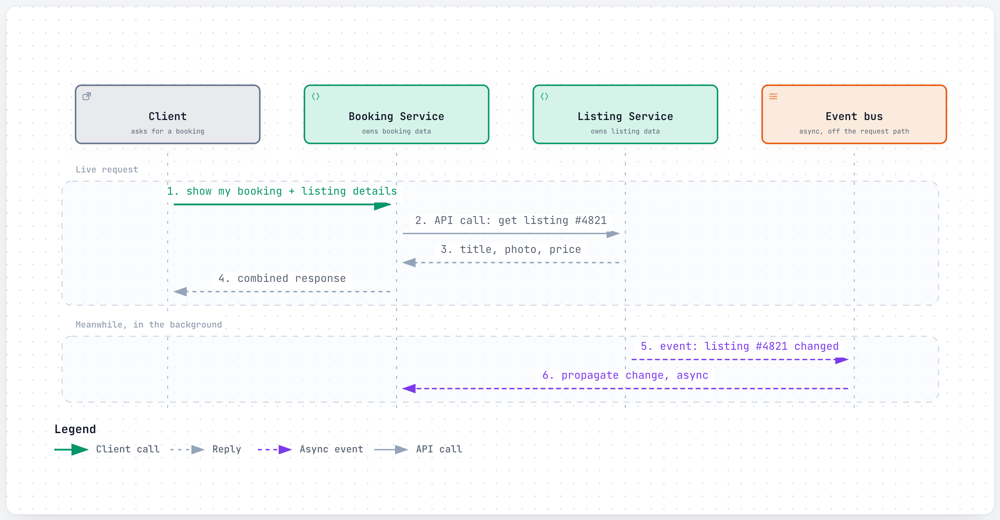
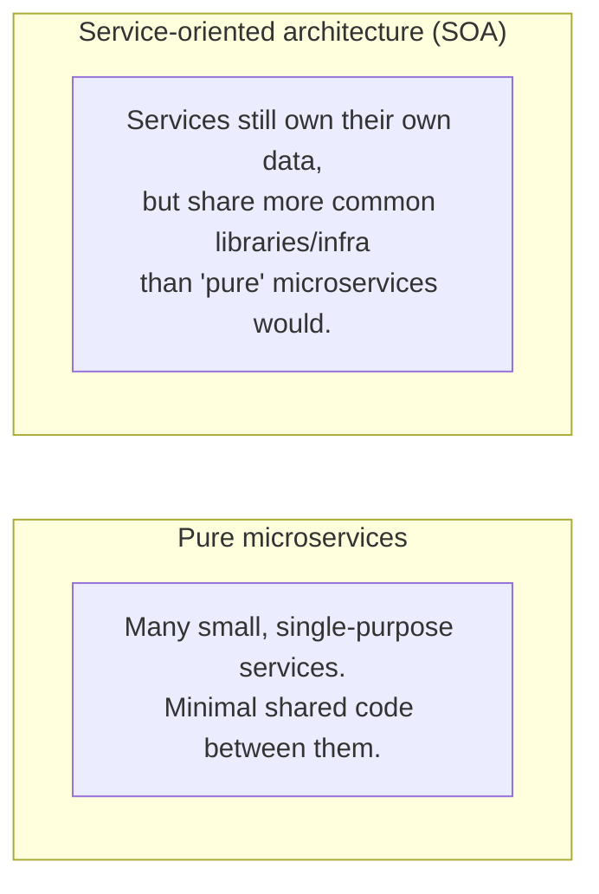
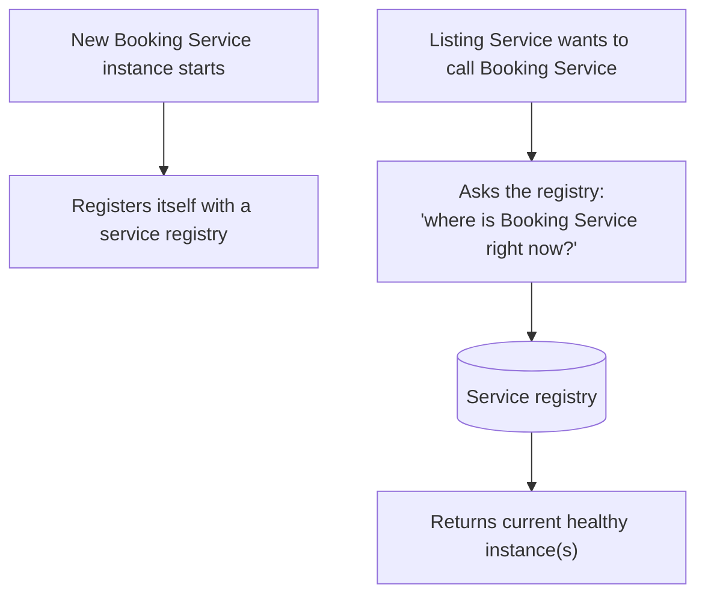

# Microservices

> Splitting one application into many small, independently deployable services, each owning its own piece of the system — instead of one shared codebase everyone deploys together.

## The problem it solves (a small story)

Imagine a restaurant where every single dish — soup, salad, dessert, the works — is prepared by one giant, shared kitchen team using one shared set of pots and one shared prep counter. It works fine when the restaurant is small. But as the menu and the staff grow, someone burning the soup can delay the salad, because they're all fighting over the same pots and the same counter space, and if one cook makes a mistake that jams the counter, every other dish waiting behind it stalls too.

The fix many growing restaurants land on is separate stations: a soup station, a salad station, a dessert station, each with its own equipment and its own small team, coordinating through tickets rather than constantly reaching across each other's counters. A mistake at the dessert station no longer stops the soup from going out. That's the microservices idea applied to software: split one shared codebase and shared database into many independently owned, independently deployable services, each responsible for its own slice, so one team's bug or slow deploy doesn't block everyone else's.

This is exactly the wall Airbnb hit at around 200 engineers sharing one deploy queue, and the wall Netflix hit trying to run its entire product off one relational database. Instagram's own story is the deliberate counter-example, worth holding in mind the whole way through this page: sometimes the right answer is to invest in better tooling around the shared kitchen, not to build separate stations at all.

## How it works (step by step, with at least 2 Mermaid diagrams)

> **Why this matters:** the arrows changing from a SQL join to an API call is the entire trade-off in one picture. It's slower and more complex per-operation, but it's also the only way to guarantee that Booking Service's own deploy schedule, on-call rotation, and database performance are no longer hostage to whatever Listing Service's team is doing this week.

Step by step:
1. In a monolith, every feature lives in one codebase, deployed together, usually reading and writing one shared database — anyone can query anyone's tables directly.
2. As the team and codebase grow, that shared-everything model becomes the bottleneck itself: one team's broken commit can block every other team's release, and every table is implicitly everyone's responsibility (and nobody's). Airbnb measured this precisely rather than guessing at it — see the worked example below.
3. The microservices fix is to split by responsibility: each service owns its own data, and its own database. No other service is allowed to touch that data directly. Discovering *where* a given service currently lives (which host, which instance) becomes its own small problem once there are enough of them — see the service-discovery section below.
4. Anything that used to be "just a SQL join across two tables" now has to become an API call (or an asynchronously-updated cache) between two services — slower per-operation, but each service can now be built, tested, and deployed on its own schedule.
5. A client calling into this new world of many services typically goes through a single gateway/API-facade, rather than needing to know the internal service topology directly.

<a href="https://alwintwk.github.io/big-tech-system-design/diagrams/concepts-microservices-api-call.html">
  <picture>
    <source media="(prefers-color-scheme: dark)" srcset="../diagrams/concepts-microservices-api-call.dark.png">
    
  </picture>
</a>

Click the diagram for the interactive version (zoom, dark mode, trace a path).

> **Why this matters:** notice what each service is *not* doing. Booking never reaches into Listing's database directly, and Listing doesn't need to know Booking exists to publish a change — it just emits an event, and whoever cares can subscribe. That decoupling is what lets a spike in one domain's load, or a bug in one domain's deploy, stay contained to that domain instead of spreading everywhere.

## Worked example

At Airbnb, before the split, a single Rails monolith ("Monorail") meant every engineer's commit went through one shared deploy pipeline. The company measured this concretely: roughly 15 hours a week of average blocked-deploy time, caused by reverts and rollbacks in that one shared queue, once the engineering org reached around 200 people. That's not a vague complaint — it's a number that directly justified the multi-year cost of the SOA migration that followed. Having a real number like this, rather than a vague "deploys feel slow," is what turns a multi-year infrastructure investment from a hard sell into an obvious one.

After the split, a bug in, say, the search-ranking service's deploy no longer blocks the booking service's team from shipping their own fix the same day. The cost moved, rather than disappeared: a query that needed "this booking, plus its listing's title and photo" that used to be one SQL join now needs an API call (or a cache) — Airbnb's own documentation is explicit that this is a real, permanent trade-off, not a temporary migration tax that goes away once the split is done.

## The middle ground: service-oriented architecture

Airbnb is explicit that what it built is SOA, not pure microservices — a deliberate distinction, not an accident of terminology. Pure microservices pushes toward the smallest possible, most independently-owned services; SOA keeps more shared tooling and common libraries between services, trading some of that independence for less duplicated infrastructure work across the whole company. Neither is strictly "more correct" — they're different points on the same spectrum, chosen based on how much duplicated effort a company is willing to accept in exchange for how much independence it wants each service to have.

Saying this distinction out loud, unprompted, is often exactly what separates a strong system-design answer from a generic "just use microservices" one.

## Variants / strategies

| Strategy | How | Pros | Cons |
|---|---|---|---|
| Monolith | One codebase, one deployment, usually one shared database | Simple to reason about; a cross-feature change is often just one code change | Every team shares one deploy pipeline and blast radius; a bad revert blocks everyone |
| Service-oriented architecture (SOA) | Split into services, but keep more shared libraries/infrastructure than pure microservices | Independent deploys and data ownership without as much duplicated tooling per service | Still a real migration effort; "shared enough" vs. "independent enough" is a judgment call |
| Pure microservices | Small, single-purpose, independently owned services, minimal shared code | Maximum independence per team; smallest possible blast radius per service | Hundreds of services is a lot of operational surface area to run, monitor, and version |
| Gateway/API-facade layer | A single entry point routes external requests to the right internal service | Clients don't need to know the internal service topology at all | The gateway itself becomes shared infrastructure that needs its own reliability story |
| Monolith + heavy deployment tooling (the counter-example) | Stay one codebase, but invest heavily in canary deploys, feature flags, and automated testing | Avoids network-call complexity and cross-service consistency problems entirely | A slow or flaky test suite becomes everyone's problem at once, since every change lands in the same codebase |
| Modular monolith | One deployment, but internally organized into strict, enforced module boundaries | Gets some of microservices' discipline (clear ownership) without the network-call overhead | Still one shared deploy and one shared blast radius, just with better internal hygiene |
| Service discovery + dynamic scheduling | Services register themselves and get scheduled onto whatever hardware is free, instead of fixed host lists | Adding/removing/rescheduling instances doesn't require updating every caller | Requires running and trusting a registry/scheduler as critical infrastructure |

## Signals that you need to split (and how far)

Reach for splitting into services when:
- A shared deploy pipeline is measurably, not just anecdotally, blocking teams' ability to ship — Airbnb's 15-hours-a-week number is the kind of evidence worth having before committing to a multi-year migration.
- External clients need a stable single entry point that doesn't change every time the internal service boundaries do.
- Different parts of the product have genuinely different scaling, reliability, or release-cadence needs.
- Hand-maintained host lists or manual coordination between teams is already a recurring source of incidents.

Lean toward **SOA over pure microservices** when shared infrastructure and common libraries would otherwise be duplicated many times over. Lean toward a **modular monolith** first, before a full network-boundary split, when the real problem is unclear ownership rather than an actual deploy/scaling bottleneck — Instagram's own choice to stay a monolith and invest in tooling instead is the standing proof that this is sometimes the better answer, permanently, not just as a stepping stone. Add service discovery and dynamic scheduling only once the number of independent services is genuinely too large for a hand-maintained host list to track reliably.

## Finding a service without hardcoding its address

Once there are dozens or hundreds of services, "which host is currently running the Booking Service" stops being a question a config file can answer reliably.

> **Why this matters:** without this, adding, removing, or rescheduling a service instance means updating a hardcoded host list everywhere that service is called from — exactly the kind of static, brittle wiring Twitter/X replaced with Finagle and Apache Mesos/Aurora once its JVM service count grew past what hand-maintained host lists could handle.

## Where the companies in this repo use it

- **Airbnb** split its Rails monolith ("Monorail") into a **service-oriented architecture** — deliberately not pure microservices — with one core rule: each service owns its own database, and everyone else goes through its API, after a shared deploy queue was measured costing roughly 15 hours a week of blocked-deploy time at around 200 engineers: [../companies/airbnb.md#soa-migration-from-the-rails-monolith](../companies/airbnb.md#soa-migration-from-the-rails-monolith)
- **Netflix** re-architected its monolithic application into thousands of independently deployable microservices behind a gateway (Zuul), most running as containers on Titus, so the team owning recommendations can deploy ten times a day without touching, or waiting on, the team that owns billing: [../companies/netflix.md#microservices-on-aws-the-control-plane-stack](../companies/netflix.md#microservices-on-aws-the-control-plane-stack)
- **Netflix**'s deploy independence is itself the point of the earlier diagram's payoff: one team's ten-times-a-day deploy cadence for recommendations has zero effect on the billing team's own release schedule, precisely because nothing forces them through the same pipeline anymore.
- **Instagram** is the deliberate counter-example: it never had a forcing function that pushed it into microservices, staying one Django monolith (several million lines, a few thousand endpoints) and instead investing in canary deploys, feature-toggled schema migrations, and static-analysis tooling to keep that one shared codebase safe for hundreds of engineers to ship into daily: [../companies/instagram.md#the-django-monolith-at-scale](../companies/instagram.md#the-django-monolith-at-scale)
- **Twitter/X** moved its two hottest backend paths (the message queue and tweet storage) onto the JVM in Scala first, then built Finagle (an RPC library) and adopted Apache Mesos with Aurora for cluster scheduling, as the number of independent JVM services grew and hardcoded host lists stopped working: [../companies/twitter-x.md#from-rails-to-the-jvm-blender-finagle-and-mesosaurora](../companies/twitter-x.md#from-rails-to-the-jvm-blender-finagle-and-mesosaurora)
- **Discord** runs 20+ Elixir microservices with a team of only 5 people, as of its October 2020 scale figures — a useful data point that a small team can operate a genuinely microservices-shaped system, given the right tooling: [../companies/discord.md#scale](../companies/discord.md#scale)

## Common mistakes

- **Splitting code without splitting data ownership.** Airbnb's own framing: services that are separately deployed but still all read and write each other's tables just recreate the monolith's coupling problem one network hop later.
- **Going pure microservices before there's a real forcing function.** Instagram is the standard counter-example — splitting into many services has real, permanent costs (network calls, cross-service consistency, more to monitor), and if a monolith plus good deployment tooling can still scale, that cost may not be worth paying yet.
- **Underestimating the "everyone reads and writes everyone's tables" tangle.** The actual failure mode in a monolith usually isn't the shared codebase itself — it's that any service can write to any table, so no one team can reason about their own data's invariants alone.
- **Forgetting cross-domain reads get more expensive.** A query that used to be one SQL join across two tables becomes an API call (or a cache that can go stale) once those tables live behind two different services — that's a real, permanent cost of the split, not a temporary migration tax.
- **Confusing SOA with microservices.** They overlap heavily but aren't identical — a company can deliberately keep more shared libraries and infrastructure (Airbnb's own description of its SOA) than a "pure" microservices approach would, as a conscious trade-off, not an oversight.
- **No single entry point for external clients.** Without a gateway, external callers end up needing to know the internal service topology directly — which then can't change without breaking every client.
- **No modular-monolith step in between.** Jumping straight from a tangled monolith to a full network-boundary split skips a cheaper intermediate option: enforcing module boundaries inside one deployment first, to prove the ownership lines actually make sense before paying for a real network hop between them.
- **Treating the migration as a one-time event.** A service split that fits today's org chart can become the wrong shape as teams merge, split, or grow — the boundaries need occasional revisiting, not just a single upfront design.
- **Hardcoding service addresses.** Static host lists work fine for a handful of services but become a maintenance and reliability liability once instances are added, removed, or rescheduled routinely — this is exactly what service discovery exists to remove.
- **Building all the microservices infrastructure upfront, before it's needed.** Twitter/X's own order — rewrite the two hottest paths first, only later build Finagle and Mesos/Aurora once many independent services actually existed — is a useful reminder that this tooling can be built just-in-time rather than speculatively.

## Interview questions

Q1. What's the core problem microservices solve that a monolith doesn't?

Independent deployability and blast radius. In a monolith, one team's broken change can block every other team's release, since everyone shares one deploy pipeline. Splitting into independently owned, independently deployed services means one team's bug or slow rollout stays contained to that one service.

Airbnb's own measured 15-hours-a-week figure is a good concrete answer if asked "how do you know it's actually a problem worth solving."

Q2. What's the real cost of splitting a monolith into microservices?

A cross-domain read that used to be a single SQL join now needs an API call (or a cache, which can go stale) between two services — slower and more complex per-operation. There's also more total operational surface area: more services to deploy, monitor, version, and reason about failure modes for.

This cost doesn't go away once the migration finishes — it's a standing, permanent property of the new architecture, not a one-time tax.

Q3. When would a company deliberately choose NOT to split into microservices?

When there's no real forcing function pushing it — a monolith can keep scaling to a very large engineering org and a very large user base, as long as the company invests in the tooling that makes a shared codebase safe (canary deploys, feature-flagged schema changes, static analysis), which is exactly Instagram's documented approach.

Instagram's own framing is useful to quote directly: the thing that had to scale wasn't the number of services, it was the tooling around the one service it already had.

Q4. What's the difference between service-oriented architecture (SOA) and microservices?

They're closely related — both split a monolith into separately deployed services with their own data ownership — but SOA, as some companies (Airbnb included) explicitly describe it, deliberately keeps more shared libraries and common infrastructure than a "pure" microservices approach, which pushes toward smaller, more single-purpose, more independently-owned services.

Naming this distinction explicitly, rather than treating the two terms as interchangeable, is usually what separates a strong answer from a generic one.

Q5. Why does splitting a monolith usually require investing in new infrastructure (event buses, service discovery, RPC frameworks) rather than just moving code?

Because the monolith's shared database and shared process implicitly provided things microservices now need explicitly: a way for one service to learn about another's changes without a direct database read (an event bus fed by change-data-capture), a way to find which host is currently running which service (service discovery), and a standard way for services to call each other over the network (an RPC framework) — none of which were needed when everything ran in one process against one database.

Twitter/X's own order of operations (rewrite the hottest paths first, then build Finagle and Mesos/Aurora only once many independent services actually existed) is a good illustration of building this infrastructure just-in-time rather than all upfront.

## Related concepts

- [Message queues and logs](message-queues-and-logs.md) — the usual way independently-deployed services propagate changes to each other asynchronously
- [Load balancing](load-balancing.md) — routes requests across each service's own pool of instances
- [Sharding](sharding.md) — each microservice often owns its own sharded database, independent of every other service's
- [CAP theorem and consistency](cap-and-consistency.md) — a cross-service read that used to be one transaction now has to make an explicit consistency choice
- [Fan-out](fan-out.md) — a change in one service propagating to many downstream services is a fan-out problem, usually solved the same way
- [Consistent hashing](consistent-hashing.md) — one technique a service registry or scheduler can use to assign work across a changing pool of instances

## Further reading

- [Microservices — Wikipedia](https://en.wikipedia.org/wiki/Microservices)
- [Service-oriented architecture — Wikipedia](https://en.wikipedia.org/wiki/Service-oriented_architecture)

Back to the restaurant: separate stations never make any single dish faster to cook. They just make sure a mistake at the dessert station stops being everyone's problem.

And sometimes, like Instagram, the right call is a bigger, better-organized shared kitchen instead of building five new ones.
