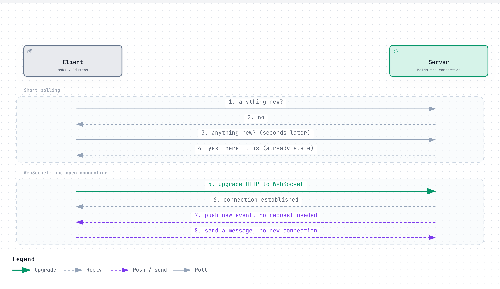
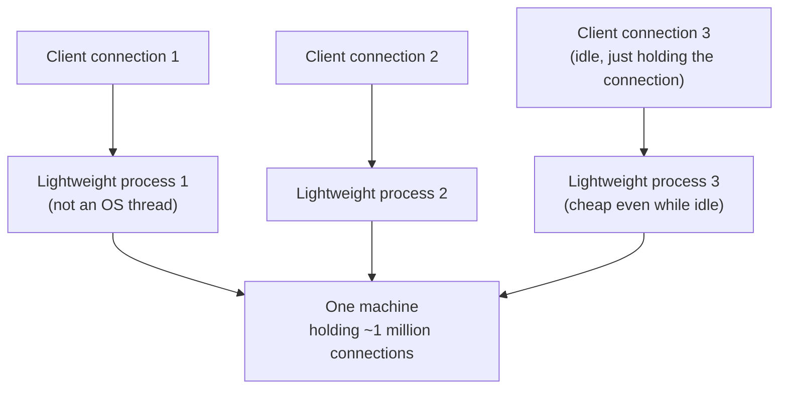
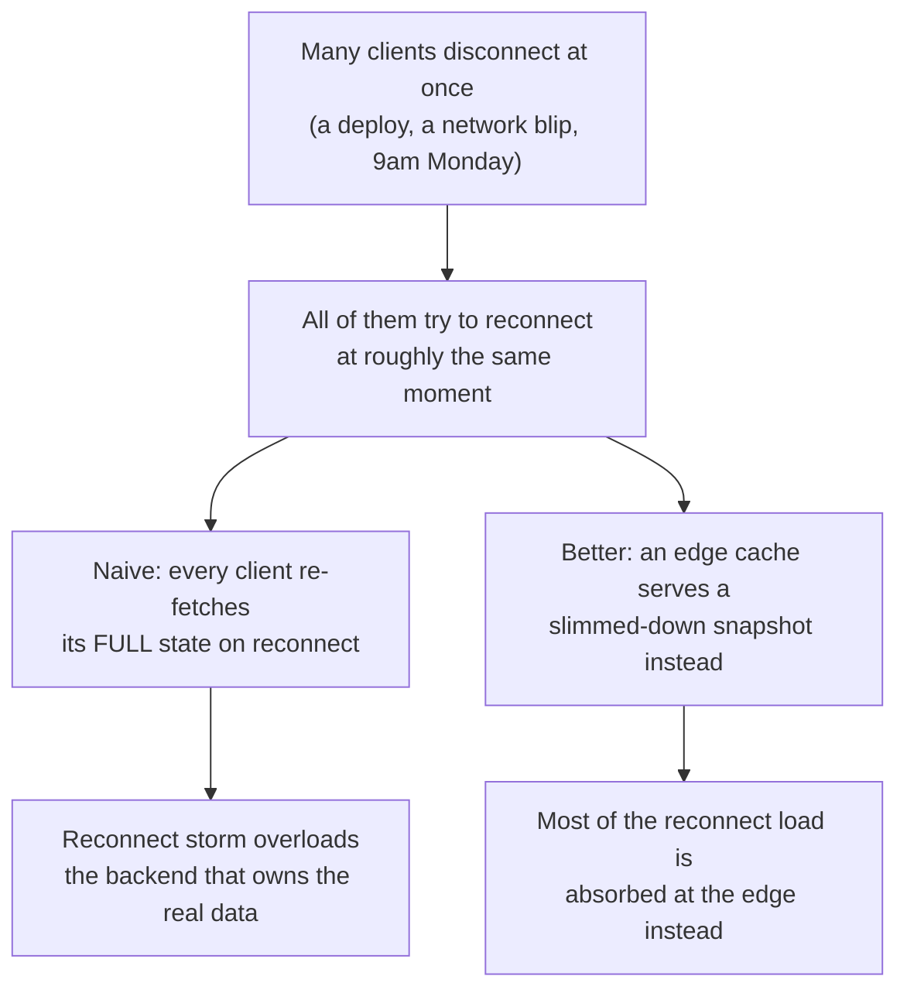
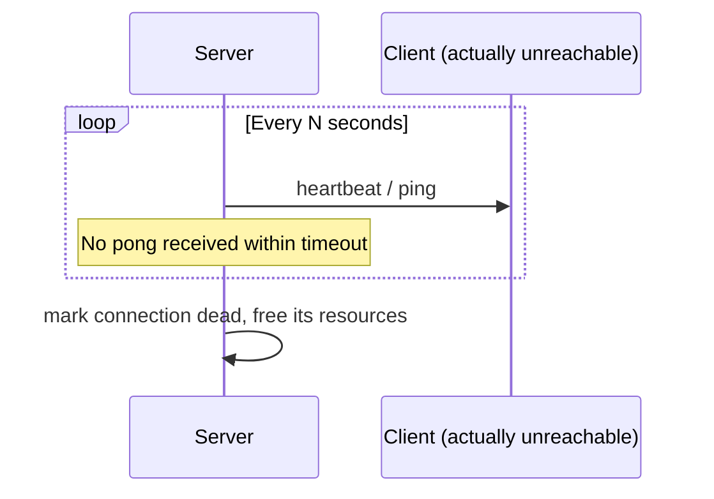

# Persistent Connections (WebSocket, Long Polling, SSE)

> Keeping a connection open between client and server so the server can push new information the instant it happens, instead of the client repeatedly asking "anything new yet?"

## The problem it solves (a small story)

Imagine you're expecting an important package and you don't trust the doorbell, so you open your front door every 30 seconds all day to check if it's arrived. Most of the time, nothing's there — you've wasted a trip to the door for nothing, and if the package actually arrives at second 31, you don't find out for almost another 30 seconds. That's ordinary HTTP polling: the client repeatedly asks, most answers are "nothing new," and genuinely new information still waits for the next scheduled ask.

A much better arrangement is a doorbell: you sit and do other things, and the delivery person presses a button the instant they arrive — you find out immediately, and you're not constantly walking to the door for no reason. A persistent connection is that doorbell: client and server keep one connection open, and the server can push data down it the moment there's something to send, with no polling round-trip needed at all.

This matters for anything that has to feel instant — a chat message, a live notification, a call being set up — which is exactly why WhatsApp, Slack, and Discord each keep millions of connections open simultaneously rather than having every client repeatedly ask for updates. WhatsApp's own numbers make the scale concrete: roughly 550 servers held 147 million concurrent connections back in 2014, which is only possible because each connection costs almost nothing while it's simply sitting idle.

## How it works (step by step, with at least 2 Mermaid diagrams)

<a href="https://alwintwk.github.io/big-tech-system-design/diagrams/concepts-persistent-connections-ws.html">
  <picture>
    <source media="(prefers-color-scheme: dark)" srcset="../diagrams/concepts-persistent-connections-ws.dark.png">
    
  </picture>
</a>

Click the diagram for the interactive version (zoom, dark mode, trace a path).

> **Why this matters:** in the polling version, the *timing* of when the client happens to ask is what determines how stale the news can be — worse polling frequency means worse staleness, but also more wasted "no" answers. The WebSocket version has no such trade-off: the server sends the instant it has something, full stop.

Step by step:
1. **Short polling**: the client sends a normal HTTP request on a timer, gets an immediate answer ("nothing new" or "here's what's new"), and the connection closes. Simple, but wasteful, and new data waits for the next scheduled check.
2. **Long polling**: the client sends a request, but the server *holds it open* without responding until something actually happens (or a timeout is reached) — the client immediately re-opens another one after each response. Fewer wasted round-trips than short polling, but still one HTTP request per event, roughly.
3. **Server-Sent Events (SSE)**: the client opens one HTTP connection and the server keeps it open, streaming events down it whenever they occur — one-way (server to client) only, over plain HTTP.
4. **WebSocket**: client and server upgrade a single connection into a full-duplex channel — either side can send at any time, with much lower overhead than repeatedly opening new HTTP requests.

*(Whichever of these is chosen, a heartbeat/keepalive is usually layered on top to detect a connection that's gone silently dead — see below.)*

At real scale, the hard part isn't the protocol choice — it's holding millions of these connections open at once without one OS thread per connection exhausting the machine.

> **Why this matters:** almost every one of these connections is idle at any given instant — nobody is typing every millisecond. The entire design challenge is making "idle" cost as close to nothing as possible, so a million mostly-silent connections don't quietly exhaust a machine's memory the way a million idle OS threads would.

## Worked example

A group chat with 500 members has, at any given second, maybe 2 people actively typing. With short polling on a 5-second interval, all 500 clients ask "anything new?" every 5 seconds regardless — that's 100 requests per second for this one chat alone, the overwhelming majority answered "no." With a persistent WebSocket connection instead, those same 498 idle members' connections sit silently costing almost nothing, and the moment one of the 2 active typers sends a message, it's pushed to all 500 immediately — no polling overhead, and no up-to-5-second delay waiting for the next scheduled check.

Now multiply this by every group chat on the platform running simultaneously — the polling approach's waste scales with the *total number of open chats*, not just how many messages are actually being sent.

Scale this to millions of simultaneous chats and the difference stops being a minor optimization and becomes the entire feasibility of the product: WhatsApp holding 147 million concurrent connections on ~550 servers only works because each idle connection is orders of magnitude cheaper than an idle short-polling loop would be.

## Reconnection and the "Monday morning" storm

A single dropped connection is a non-event. Thousands or millions dropping and reconnecting at once — a deploy, a network provider issue, or simply everyone's laptop waking up around 9am on a Monday — is a different problem entirely: the reconnect storm itself can overload whatever backend has to reconstruct every client's full state. This is exactly what an edge cache serving pre-built snapshots (rather than every reconnecting client hitting the source of truth directly) is built to absorb. Slack's own measured numbers for Flannel's snapshot make the payoff concrete: roughly 7x smaller for a 1,500-user team and 44x smaller for a 32,000-user team, compared to sending the full team data blob to every reconnecting client.

## Variants / strategies

| Strategy | How | Pros | Cons |
|---|---|---|---|
| Short polling | Client repeatedly sends a normal request on a fixed interval | Simplest to implement; works everywhere plain HTTP does | Wastes requests when nothing's new; new data is delayed up to one full interval |
| Long polling | Server holds the request open until there's something to say (or times out) | Fewer wasted round-trips than short polling; works over plain HTTP | Still roughly one connection per event; server has to hold many open requests |
| Server-Sent Events (SSE) | One long-lived HTTP connection; server streams events down it | Simple, built on plain HTTP/text; auto-reconnect built into the browser API | One-way only — client can't push data back down the same connection |
| WebSocket | Upgrade one connection into a full-duplex channel | Real two-way, low per-message overhead, ideal for chat/calls | Needs its own protocol handling; some older infra/proxies handle it awkwardly |
| Process/coroutine-per-connection | Each open connection gets its own lightweight unit of concurrency, not an OS thread | Millions of idle connections stay cheap on one machine | Requires a runtime built for exactly this (green threads, an event loop) |
| Exponential backoff on reconnect | A failed reconnect attempt waits progressively longer before retrying | Prevents a client's own retries from contributing to a reconnect storm | Slightly slower recovery for a single, isolated dropped connection |
| Edge-cached reconnect snapshot | A reconnecting client is served a pre-built summary from a nearby cache instead of hitting the source of truth | Absorbs mass-reconnect load away from core backend systems | The snapshot needs its own freshness/consistency story |
| Heartbeat / keepalive | Periodic ping-pong messages confirm a connection is still genuinely alive | Detects silently-dead connections that TCP alone won't reveal | Adds a small, constant trickle of extra traffic per connection |

## Signals that you need a persistent connection (and which kind)

Reach for a persistent connection when:
- Updates need to reach the client within roughly a second of happening, not "eventually, on the next poll."
- The volume of "nothing changed" polling responses would itself become a meaningful cost.
- The number of simultaneous connections is large enough that per-connection cost genuinely matters to infrastructure planning.

Lean toward **SSE** when the server only ever needs to push, never receive, over that same channel. Lean toward **WebSocket** when genuine two-way, low-latency exchange is needed (chat, calls, collaborative editing). Lean toward **long polling** only as a fallback when a client or network genuinely can't support the above — it's rarely the first choice for a new design today. Whichever protocol is chosen, pair it with a heartbeat: none of them, on their own, reliably tell you a connection has gone silently dead.

## Detecting a connection that's silently dead

A TCP connection can go quiet without either side explicitly closing it — a phone loses signal, a laptop sleeps, a middlebox drops idle state. Without checking, the server may not notice for a very long time that it's holding open a connection to nobody.

> **Why this matters:** without a heartbeat, a server can accumulate a large number of connections that look "open" but are actually talking to nobody, quietly wasting memory and, worse, making the server believe a client is still reachable when it isn't — which matters a great deal for something like a fan-out delivery that assumes a live socket will actually receive what's sent to it.

## Where the companies in this repo use it

- **WhatsApp** keeps every device on one persistent TCP connection to a connection server rather than polling, with each connection handled by its own lightweight Erlang process instead of an OS thread — which is how roughly 550 servers held 147 million concurrent connections: [../companies/whatsapp.md#high-level-design](../companies/whatsapp.md#high-level-design)
- **WhatsApp**'s connection-handling model is built on the Erlang/BEAM virtual machine, tuned alongside the FreeBSD kernel itself (raising socket limits, a larger TCP hash table, a cheaper TSC timecounter, the `igb` network driver) to make holding roughly a million simultaneous connections per box practical: [../companies/whatsapp.md#the-erlangbeam-concurrency-model-and-freebsd-tuning](../companies/whatsapp.md#the-erlangbeam-concurrency-model-and-freebsd-tuning)
- **Slack** has Gateway Servers, deployed at the network edge, hold each connected client's WebSocket and its channel subscriptions — kept deliberately separate from the Channel Servers that hold the actual source of truth, so adding edge connection capacity doesn't require the storage tier to know how many sockets exist: [../companies/slack.md#channel-servers-and-gateway-servers-separating-storage-of-truth-from-the-edge](../companies/slack.md#channel-servers-and-gateway-servers-separating-storage-of-truth-from-the-edge)
- **Discord** exposes a separate WebSocket Gateway, written in Elixir, specifically for everything real-time — distinct from its HTTP REST API — and was pushing 26 million WebSocket events per second to clients as of October 2020: [../companies/discord.md#high-level-design](../companies/discord.md#high-level-design)
- **Slack** built **Flannel** specifically to solve the reconnect-storm problem: a large company's workforce reconnecting within the same few minutes (a 9am Monday, or a mass network blip) gets served a slimmed-down snapshot from an edge cache instead of every client hitting the main region's Channel Servers directly: [../companies/slack.md#flannel-solving-the-reconnect-storm-before-it-starts](../companies/slack.md#flannel-solving-the-reconnect-storm-before-it-starts)
- **Discord**'s Manifold and relay workers depend on knowing which sessions are genuinely still connected — a session registry lookup burning tens of seconds on server restart was one of the specific bottlenecks its 2017 scaling work addressed: [../companies/discord.md#how-it-evolved](../companies/discord.md#how-it-evolved)

## Common mistakes

- **Polling when push is available and appropriate.** If the client can hold a connection open, repeatedly asking "anything new?" burns bandwidth and adds latency for no benefit over a server just pushing the update.
- **Treating WebSocket as free.** A held-open connection still consumes memory and (depending on the runtime) can be expensive per-connection — the "process/coroutine per connection" pattern exists specifically because a naive OS-thread-per-connection design collapses at real scale.
- **Forgetting reconnection logic.** Networks drop connections; a client (or a whole fleet of them reconnecting at once, like a Monday-morning login storm) needs a plan for what happens on reconnect, not just for the happy path.
- **No exponential backoff on reconnect.** A client that retries a failed reconnect instantly and repeatedly, with no growing delay, can itself contribute to a reconnect storm rather than helping the server recover from one.
- **Choosing SSE for something that needs two-way communication.** SSE is one-way, server-to-client — a chat app that also needs the client to send messages back down the same channel needs WebSocket (or a second, separate request path), not SSE alone.
- **No idle-connection accounting.** A design that assumes every open connection costs the same whether active or idle will over-provision massively at real scale, where the overwhelming majority of connections are sitting quietly doing nothing at any given instant.
- **No plan for a mass-reconnect event.** Treating "many clients reconnecting at once" as just "many individual reconnects" ignores that they can collectively overload the backend that has to rebuild each one's full state — an edge cache or slimmed-down snapshot exists specifically to absorb this.
- **Coupling the connection-holding layer to the data layer.** If the server holding a client's live socket is also the only source of truth for that data, scaling connection capacity and scaling storage capacity become impossible to do independently.
- **No heartbeat/keepalive.** Without periodically confirming a connection is genuinely alive, a server can accumulate connections that look open but are actually talking to nobody, wasting resources and giving fan-out logic false confidence that a recipient will actually receive what's sent.
- **Treating every connection as equally likely to be active.** Most connections at any instant are idle — a design that doesn't account for this (equal resource budget per connection regardless of activity) over-provisions for a load pattern that rarely actually happens.

## Interview questions

Q1. What's the difference between long polling and WebSocket?

Long polling is still fundamentally request-response: the server holds one HTTP request open until it has something to say, then the client immediately opens another. WebSocket upgrades a single connection into a genuinely persistent, full-duplex channel where either side can send at any time without opening a new request per message.

Long polling is a reasonable fallback when WebSocket support is unavailable, but it's rarely the first choice in a fresh design today.

Q2. When would you choose Server-Sent Events over WebSocket?

When communication is naturally one-directional — the server has updates to push (live scores, a progress feed, notifications) and the client never needs to send anything back down the same channel. SSE is simpler, runs over plain HTTP, and gets automatic reconnection built into the browser's `EventSource` API, at the cost of being one-way only.

If the client ever needs to talk back over the same channel, that's the signal to reach for WebSocket instead.

Q3. Why can't you just handle a million open connections with a million OS threads?

Each OS thread carries real fixed overhead (its own stack memory, kernel scheduling cost) even while completely idle — multiplied by a million mostly-idle connections, that overhead alone can exhaust a machine's memory and scheduling capacity long before any real work is being done. Systems built for this use much cheaper units of concurrency (lightweight processes, coroutines, an event loop) instead.

WhatsApp's Erlang/BEAM choice, and its FreeBSD kernel tuning, exist specifically to push this per-connection cost as low as possible.

Q4. What happens to in-flight state when a persistent connection drops?

The client typically needs to reconnect and re-establish context — which subscriptions it had, what it last saw — rather than assuming the server remembers everything forever. Well-designed systems separate "what the connection layer holds" (the live socket, current subscriptions) from "what's durably stored elsewhere," so a dropped connection loses only the socket, not the underlying data.

At scale, this reconnection needs its own plan for a mass event, not just a single client — see the reconnect-storm section above.

Q5. Why might a company separate the server that holds a live connection from the server that holds the source of truth?

So the two tiers can scale independently — adding more edge capacity for holding sockets doesn't require the storage/truth tier to know or care how many sockets currently exist behind it, and losing one edge connection-holder doesn't risk the durable data it was relaying, only the live sockets it happened to be holding at that moment.

Slack's Gateway Servers versus Channel Servers is the clearest real example of exactly this split.

## Related concepts

- [Fan-out](fan-out.md) — the last step of fan-out is usually pushing down an already-open persistent connection
- [Load balancing](load-balancing.md) — routing new connections to the nearest/least-loaded edge server
- [Consistent hashing](consistent-hashing.md) — used to decide which stateful server owns which connection's data
- [Caching](caching.md) — an edge cache serving reconnect snapshots is caching applied specifically to the reconnect-storm problem
- [Idempotency](idempotency.md) — a message resent after a brief reconnect may arrive twice, which is exactly why the receiving side needs to tolerate duplicates
- [Rate limiting](rate-limiting.md) — a reconnect storm is itself a form of load that fail-open backpressure and edge caching both help absorb

## Further reading

- [WebSocket — Wikipedia](https://en.wikipedia.org/wiki/WebSocket)
- [Server-sent events — MDN Web Docs](https://developer.mozilla.org/en-US/docs/Web/API/Server-sent_events)

Back to the doorbell: the whole point was never to make the delivery faster. It was to stop you from walking to the door every 30 seconds for nothing.

A doorbell that's actually broken and nobody checked is its own kind of problem — which is exactly what a heartbeat exists to catch.
