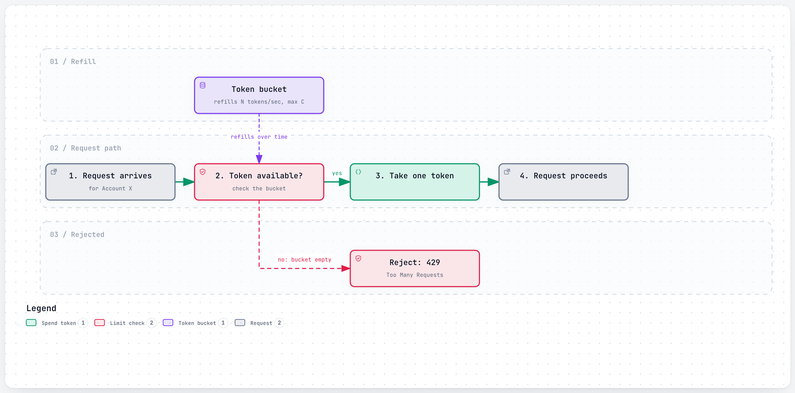
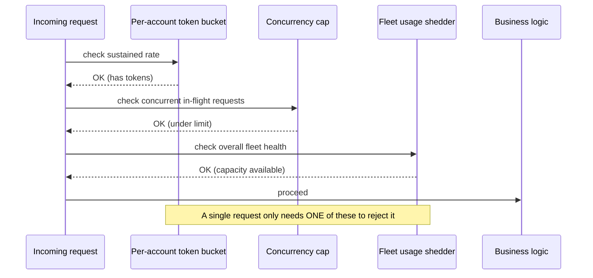
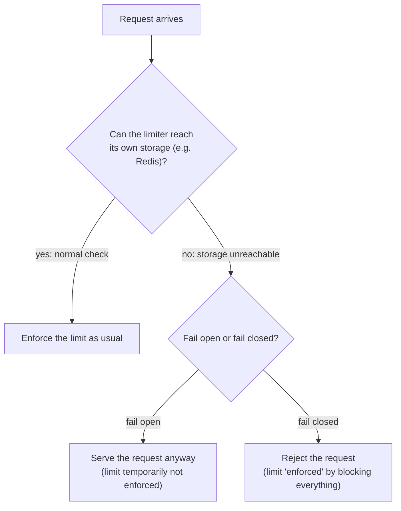
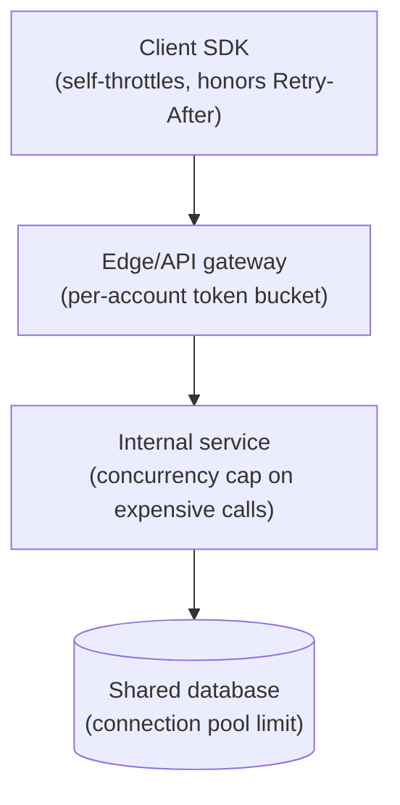

# Rate Limiting

> Capping how many requests one caller can make in a given time window, so one noisy or broken client can't take the whole service down for everyone else.

## The problem it solves (a small story)

Imagine a single water tap shared by an apartment building. Normally everyone gets a fair trickle. Then one apartment leaves their tap running full-blast, non-stop, all day — maybe on purpose, maybe just a stuck valve they don't know about. Water pressure for every other apartment drops to nothing, even though their own usage hasn't changed at all. The building's total capacity didn't shrink; it's just being monopolized by one source.

The fix is a flow restrictor on each apartment's line: no matter what, apartment 4B can only draw so many liters per minute. If their tap gets stuck open, the restrictor caps the damage to just their own flow — everyone else's water pressure stays normal. Rate limiting is that restrictor, applied to API requests instead of water: cap how much any single account, IP, or API key can consume, so a bug, a retry storm, or an actual bad actor degrades at most their own experience, not the shared service everyone else depends on.

This is exactly the position Stripe is in: hundreds of thousands of businesses share one API fleet, and a payments API in particular can never be the reason a *different* merchant's real transaction fails. Discord hits a related but distinct version of the same problem inside its own infrastructure — not limiting external callers, but limiting how much concurrent work one internal component can push onto another before it becomes a cascading failure. Both are the same underlying idea — bound the damage one source of load can do — applied to a different boundary.

## How it works (step by step, with at least 2 Mermaid diagrams)

The most common mechanism is a **token bucket**: each account gets a bucket that refills at a steady rate, and every request costs one token.

<a href="https://alwintwk.github.io/big-tech-system-design/diagrams/concepts-rate-limiting-token-bucket.html">
  <picture>
    <source media="(prefers-color-scheme: dark)" srcset="../diagrams/concepts-rate-limiting-token-bucket.dark.png">
    
  </picture>
</a>

Click the diagram for the interactive version (zoom, dark mode, trace a path).

> **Why this matters:** the bucket's *capacity* (how many tokens it can hold at once) and its *refill rate* (how fast tokens replenish) are two separate knobs. Capacity controls how big a burst is allowed; refill rate controls the sustained average — tuning only one of them misses half the picture.

Step by step:
*(Some fraction of well-behaved clients self-throttle before ever reaching the server at all — see the multi-layer diagram further below.)*

1. Each account/key gets its own bucket, holding up to some maximum number of tokens.
2. Tokens drip into the bucket at a steady rate (say, 100 per second).
3. Every request costs one token; if a token is available, it's consumed and the request proceeds.
4. If the bucket is empty, the request is rejected (often with a `429` status and a hint of when to retry) — bursts are allowed up to the bucket's capacity, but sustained overuse eventually exhausts it.

Real systems rarely rely on just one limiter — different failure modes need different limits, checked in sequence:

> **Why this matters:** each layer catches a different problem: a token bucket catches one account sending too many requests *over time*; a concurrency cap catches a few individually slow/expensive requests tying up resources *right now*; a fleet-level shedder protects overall capacity when the whole system is under stress, regardless of which account is calling. A single limiter, however well-tuned, can't catch all three failure shapes at once.

## Worked example

An integrator's script has a bug: instead of fetching a customer's data once, it loops and fetches it 50 times per second, forever, because of a missing `break` statement. With a per-account token bucket refilling at 20 tokens/second, the first 20 requests each second succeed and the rest get a `429` — the bug is now capped at 20 requests/second of real load instead of 50, and every *other* account's traffic is completely unaffected. The integrator sees a wall of `429`s in their own logs (a clear, debuggable signal pointing at their own bug), while nobody else on the shared platform notices anything happened at all.

The fix is entirely on the integrator's side; the platform's only job was to make sure their bug stayed contained to their own account instead of becoming everyone's problem.

Now imagine a different bug: instead of calling too often, one account's requests each accidentally request an enormous, expensive result set (`expand[]` on every nested field, say), each one individually slow rather than frequent. The token bucket alone wouldn't catch this — the request *rate* is normal, only the *cost per request* is abnormal. This is exactly why a concurrency cap exists as a separate layer: it limits how many of that account's expensive requests can be in flight *at once*, regardless of how few requests per second they technically are.

Both bugs look identical from the outside ("this account is causing problems") but need genuinely different limiters to catch — which is exactly the argument for layering more than one.

## Fail-open vs. fail-closed, concretely

Fail-closed sounds safer on paper — "if we can't check the limit, don't allow it" — but it means the rate limiter's *own* infrastructure failure becomes a full outage for every legitimate caller, which is usually a far worse outcome than briefly having no rate limiting at all. This is exactly why Stripe's limiters are built to fail open: the safety mechanism itself must never become a new way to take down the whole API.

The general principle: a safety mechanism's own failure mode should never be worse than the thing it was protecting against in the first place.

## Variants / strategies

| Strategy | How | Pros | Cons |
|---|---|---|---|
| Token bucket | Tokens refill steadily; each request costs one | Allows short bursts up to bucket capacity, then smooths out | Slightly more bookkeeping than a flat counter |
| Fixed window counter | Count requests in a fixed time window (e.g. per minute), reset at the boundary | Very simple to implement | A burst right at a window boundary can briefly let through ~2x the intended rate |
| Sliding window | Count requests over a rolling window, not a fixed reset point | Smooths out the boundary-burst problem | More state to track per client |
| Concurrency limiting | Cap how many requests from one caller can be *in flight* at once, regardless of rate | Catches a few slow/expensive requests a rate limit alone would miss | Doesn't address a caller sending many quick, cheap requests |
| Cost-weighted limiting | Each request consumes a variable number of tokens based on its actual estimated cost, not a flat one | More accurately reflects real load than counting requests | Requires estimating a cost for every request type up front |
| Fail-open vs. fail-closed | If the limiter's own dependency (e.g. Redis) is unreachable, decide whether to still serve requests (fail open) or block them (fail closed) | Fail open avoids the limiter itself causing an outage | Fail open means the rate limit isn't actually enforced during that window |
| Leaky bucket | Requests queue up and are processed at a constant rate, rather than being immediately allowed or rejected | Smooths bursts into a steady output rate | Adds latency for requests waiting in the "bucket" |
| Priority-aware shedding | Under overload, reject low-priority requests first, preserving capacity for critical traffic | Keeps the most important work flowing even during a real incident | Requires every request to be classified by priority ahead of time |
| Client-side self-throttling | The client SDK itself respects a `Retry-After` hint and slows down before being told to stop | Reduces load before it even reaches the server | Only works if every client actually implements it correctly |

## Signals that you need rate limiting (and how many layers)

Reach for rate limiting when:
- More than one independent caller shares the same backend capacity, and one caller misbehaving shouldn't degrade another's experience.
- A single account's bug, retry loop, or malicious use could plausibly generate disproportionate load.
- Correctness/availability of the shared service matters more than squeezing out every last bit of throughput for one caller.

Add a **second layer** (concurrency capping, on top of a rate limiter) when:
- Some requests are far more expensive than others, so a plain request-count limit wouldn't catch a "few slow requests" problem.

Add a **third, fleet-wide layer** when:
- The system needs to protect overall capacity during a genuine incident, independent of any single account's behavior — reserving headroom for the traffic that matters most when things are already going wrong.
- Different request types have wildly different costs, and a fair-share policy across them matters more during overload than in normal operation.

## Rate limiting at more than one layer

> **Why this matters:** each layer protects a different resource from a different failure mode. A well-behaved client SDK that respects a `Retry-After` header reduces load before it even reaches the edge; the edge gateway protects the whole API fleet from any one account; an internal concurrency cap protects one specific expensive dependency; and a database connection pool limit is the last line of defense, regardless of what got past everything above it.

## Where the companies in this repo use it

- **Stripe** runs four layered rate limiters, each catching what the one before it let through: a per-account token bucket for sustained overuse, a concurrency cap for a few slow/expensive requests, a fleet usage shedder that reserves capacity for critical traffic, and a worker utilization shedder that sheds by priority during an actual incident — and the limiters are built to **fail open** if their own dependency (Redis) is unreachable, so the safety mechanism itself can't take down the API: [../companies/stripe.md#4-layered-rate-limiting](../companies/stripe.md#4-layered-rate-limiting)
- **Stripe**'s request rate limiter specifically is a token bucket per API key/account, where tokens refill at a steady rate and a request with no tokens available gets a dropped `POST /payment_intents` rather than being served: [../companies/stripe.md#rate-limiting](../companies/stripe.md#rate-limiting)
- **Discord** treats bounded-concurrency backpressure (its Semaphore library) as what turns a cascading failure into a *contained* one — rejecting excess load outright instead of queueing it indefinitely into a resource that's already struggling: [../companies/discord.md#manifold-fastglobal-and-semaphore-the-2017-scaling-toolkit](../companies/discord.md#manifold-fastglobal-and-semaphore-the-2017-scaling-toolkit)
- **Twitter/X**'s API gateway is where auth, rate limiting, and request routing happen before a request ever reaches the core tweet-serving service: [../companies/twitter-x.md#1-core-flow-posting-a-tweet-and-fanning-it-out](../companies/twitter-x.md#1-core-flow-posting-a-tweet-and-fanning-it-out)
- **Stripe**'s own examples note that even individually well-formed requests — like heavy use of expandable objects (`expand[]=customer`) that fetch related objects inline — show up as exactly the kind of expensive-but-not-frequent request its concurrency limiter is watching for, distinct from its plain rate limiter: [../companies/stripe.md#the-payments-api-surface-paymentintents-charges-paymentmethods](../companies/stripe.md#the-payments-api-surface-paymentintents-charges-paymentmethods)

## Common mistakes

- **One global limit for every kind of request.** A "list objects" call and a "charge a card" call don't cost the same to serve — Stripe's layered approach exists precisely because no single limiter catches every failure mode.
- **Fail-closed limiters.** If the rate limiter's own storage becomes unreachable and the system responds by blocking *everything*, the safety mechanism has become the outage.
- **Vague rejection messages.** Returning a generic "rate limited" with no indication of *which* limit was hit or when to retry pushes debugging effort onto every caller, repeatedly.
- **Rate limiting only at the edge.** A limiter that only guards the public API but not internal service-to-service calls still lets one internal bug hammer a downstream dependency without any protection.
- **No dark-launch step for new limits.** Turning on a brand-new limit directly in enforcing mode risks rejecting real, legitimate traffic nobody tested against it — evaluating a new limit against real traffic without enforcing it first catches this before it's user-visible.
- **Confusing rate limiting with concurrency limiting.** A caller sending few but extremely expensive requests can sail past a rate limit while still monopolizing real resources — the two need separate enforcement.
- **No path for a legitimate caller who's genuinely outgrown their limit.** A fast-growing, well-behaved customer hitting their limit needs an obvious way to request more, not just a wall of silent rejections.
- **Testing the limiter only in isolation.** A limiter that works correctly under a clean synthetic test can still behave differently under real production traffic patterns — dark-launching against real traffic catches this before enforcement begins.
- **Applying the same limit regardless of request cost.** Treating a cheap `GET` and an expensive bulk export as the same "one request" against the limit ignores how differently they actually load the system.
- **Only rate limiting at the outermost edge.** Without limits at internal layers too (a service, a database connection pool), one internal caller with a bug can still overwhelm a downstream dependency that the edge limiter never sees.
- **No monitoring of rejection rates.** A limiter silently rejecting a growing share of one account's traffic, with nobody watching the trend, can turn a minor misconfiguration into a customer-facing incident before anyone notices.

## Interview questions

Q1. How does a token bucket rate limiter work?

Each client gets a bucket that holds up to some maximum number of tokens, refilled at a steady rate. Every request consumes one token; if the bucket is empty, the request is rejected. This allows short bursts (up to the bucket's capacity) while still enforcing a steady average rate over time.

Bucket capacity and refill rate are two independent knobs — one bounds burst size, the other bounds the sustained average.

Q2. Why might a system need more than one rate limiter?

Different failure modes need different limits: a per-account limit catches one client sending too much traffic over time, a concurrency cap catches a few unusually expensive requests tying up resources right now, and a fleet-wide limiter protects overall system health regardless of which account is responsible. A single limiter usually can't catch all three.

Stripe's four-layer design is the clearest real example: each layer exists because a real incident showed the previous layers weren't enough on their own.

Q3. What does it mean for a rate limiter to "fail open," and why would you want that?

If the limiter's own dependency (often a shared store like Redis, used to track counts) becomes unreachable, failing open means requests are still served rather than universally rejected — because the alternative (fail closed) turns a rate limiter's own outage into a full API outage, which is often worse than briefly having no enforced limit.

The trade-off is deliberate: a temporarily-unenforced limit is a smaller, more contained risk than an outage affecting every caller at once.

Q4. What's the difference between rate limiting and load balancing?

Load balancing spreads legitimate traffic evenly across a pool of servers. Rate limiting caps how much traffic any single caller is *allowed* to send in the first place, regardless of how it's distributed — they solve different problems and are typically used together.

A load balancer answers "which server handles this," a rate limiter answers "should this even be allowed through at all."

Q5. Why "dark-launch" a new rate limit before enforcing it?

Because a limit set from guesswork can be wrong in either direction — too loose to actually protect anything, or tight enough to reject real, legitimate traffic. Running it in a logging-only mode against real production traffic first shows exactly what it *would* have rejected, before it's allowed to actually reject anything.

This is the same instinct behind a canary deploy: observe against real traffic before anything real depends on the new behavior being correct.

## Related concepts

- [Load balancing](load-balancing.md) — distributes legitimate traffic; rate limiting restricts how much traffic is legitimate in the first place
- [Idempotency](idempotency.md) — makes it safe for a rate-limited client's retries to not double-execute a request
- [Message queues and logs](message-queues-and-logs.md) — queueing (with backpressure) is an alternative to rejecting excess load outright
- [CAP theorem and consistency](cap-and-consistency.md) — fail-open rate limiting is itself an availability-over-consistency choice about enforcement
- [Fan-out](fan-out.md) — Discord's Semaphore-based backpressure is a rate-limiting idea applied to internal fan-out work, not external callers

## Further reading

- [Rate limiting — Wikipedia](https://en.wikipedia.org/wiki/Rate_limiting)

Back to the water tap: a flow restrictor never fixes the stuck valve in 4B. It just makes sure 4B's problem stays 4B's problem.

Every other apartment never even learns 4B had a problem at all — which is exactly the point.
