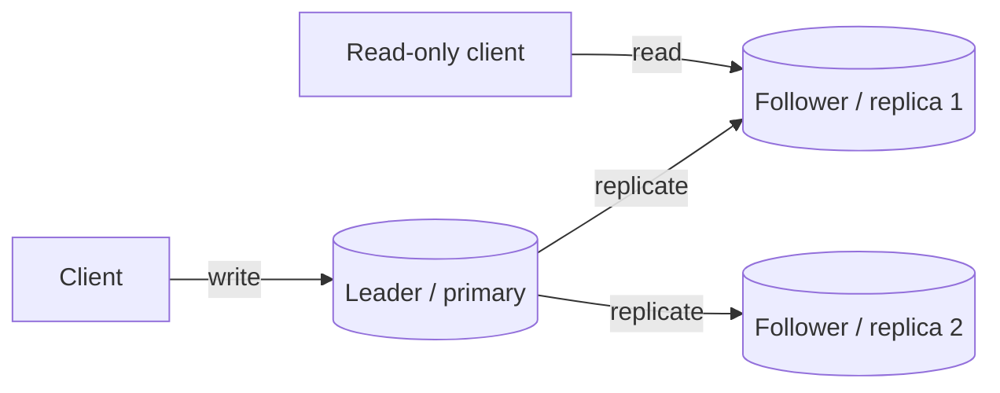
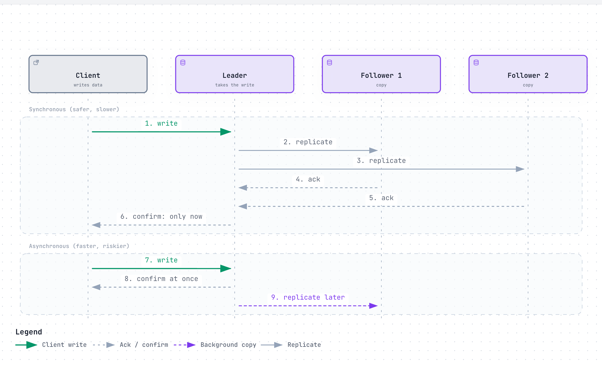
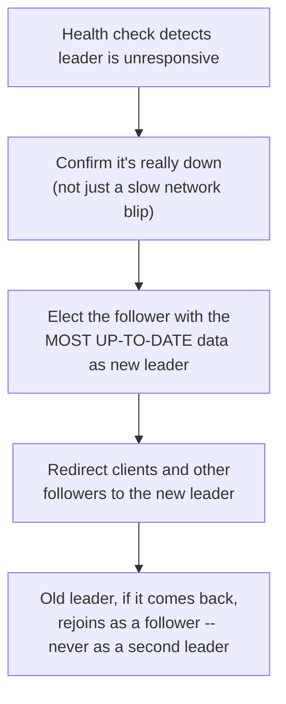
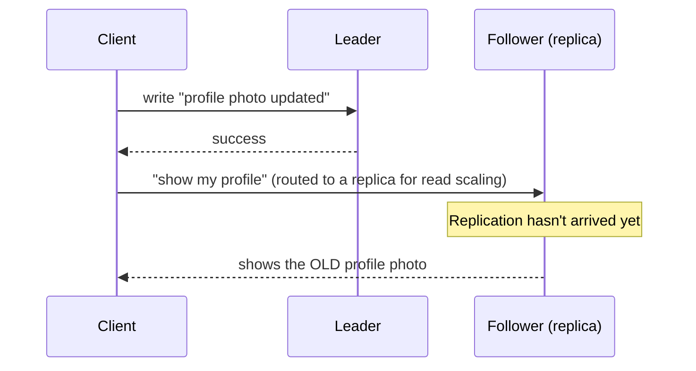

# Replication

> Keeping more than one copy of the same data, on different machines, so losing one machine doesn't lose the data or stop the service.

## The problem it solves (a small story)

Imagine you write your only copy of an important document and lock it in one safe. That safe is fireproof, waterproof, and guarded — but it's still one safe, in one building. If that building burns down, "very well protected" and "gone forever" turn out to mean the same thing.

So instead you keep three identical copies of the document, in three different buildings, in three different neighborhoods. Now a fire in one building is a shrug, not a disaster — you just read from one of the other two copies while the first is rebuilt. That's replication: the same data, duplicated across independent machines (and ideally independent racks, data centers, or regions), specifically so that one failure is a non-event instead of an outage.

Every company in this repo that stores anything durable — messages, files, ledger entries — runs into the same fact: disks fail, machines die, and entire data centers occasionally go dark. Replication is the general answer to "how do I not lose data (or availability) when that inevitably happens." It shows up differently depending on what's being protected: Dropbox replicates file bytes for durability, Discord replicates message history for both durability and read scaling, and Twitter/X built an entire database (Manhattan) around offering different replication/consistency trade-offs to different kinds of data inside one shared system.

## How it works (step by step, with at least 2 Mermaid diagrams)

> **Why this matters:** the leader is the only node that *has* to be involved in every write, but reads can be spread across every replica — this is exactly why leader-based replication is a common way to scale reads far beyond what one machine could serve, even though writes still funnel through one place.

Step by step (leader-based replication, the most common form):
1. A client sends a write to the **leader** (also called the primary) — every write in the system goes through this one node first.
2. The leader applies the write locally, then forwards it to every **follower** (replica), typically as a stream of the same operations it applied itself.
3. Followers apply the same write in the same order, so they end up holding the same data as the leader — just slightly behind, by however long replication takes.
4. Reads can be served by the leader (always current) or by a follower (faster to scale out, but possibly a moment stale) — the choice is a direct trade against [consistency](cap-and-consistency.md).
5. If the leader dies, one follower is promoted to take its place — this is **failover** — and clients need to learn the new leader's address before writes can resume.

<a href="https://alwintwk.github.io/big-tech-system-design/diagrams/concepts-replication-sync-async.html">
  <picture>
    <source media="(prefers-color-scheme: dark)" srcset="../diagrams/concepts-replication-sync-async.dark.png">
    
  </picture>
</a>

Click the diagram for the interactive version (zoom, dark mode, trace a path).

> **Why this matters:** these two diagrams show exactly where the risk window is. In the synchronous version, the client is only told "success" after replicas actually have the data — nothing is lost even if the leader vanishes the instant after. In the asynchronous version, there's a real gap between "client was told it worked" and "a replica actually has it" — a crash inside that gap is a genuine, permanent loss of the most recent writes.

Synchronous replication waits for replicas to confirm before telling the client the write succeeded — nothing is lost if the leader dies a moment later, but every write is only as fast as the slowest replica. Asynchronous replication returns immediately and lets replicas catch up in the background — much faster, but a leader crash in that gap can lose the last few writes that never made it to any follower.

## Worked example

Say a leader accepts a write at 2:00:00.000 and, using asynchronous replication, tells the client "success" immediately — the write hasn't reached any follower yet. At 2:00:00.050, before replication finishes, the leader's machine loses power. The follower that gets promoted to the new leader never received that write — from its point of view, it never happened, even though the original client was already told it succeeded.

With synchronous replication instead, the leader would have waited for at least one follower to acknowledge the write before telling the client anything — so by the time the client hears "success," at least one other machine already has the data, and the same power failure at 2:00:00.050 would have promoted a follower that *does* have it. The 50 milliseconds of extra wait on every single write is the price paid to close that gap.

## Failover in practice

Losing a leader isn't just "pick any follower" — a real failover process has to answer a few questions correctly, in order:

Skipping the "confirm it's really down" step risks a false failover during a brief network hiccup, needlessly promoting a new leader while the old one was actually fine. Skipping "most up-to-date" risks promoting a follower that's further behind than another one, silently losing more recent writes than necessary. And the last step matters more than it looks: if the old leader ever comes back and doesn't realize it's been demoted, a system can briefly end up with **two leaders** accepting conflicting writes at once — a scenario distributed systems literature calls **split brain**.

## Signals that you need replication (and what kind)

Reach for replication when:
- Losing a single machine would mean losing data permanently, not just briefly slowing down — anything durable (files, financial records, message history) needs more than one copy to exist somewhere.
- Read traffic has outgrown what one machine can serve, and the data is at least a little tolerant of being a moment stale on some of those reads.
- The product needs to survive an entire data center or region going dark, not just a single disk or single server.

Lean toward **synchronous** replication when a lost write is unacceptable (a completed payment, a confirmed booking) — the extra latency is the price of that guarantee. Lean toward **asynchronous** replication when write speed matters more than the small risk of losing the very latest writes in a rare crash window (an activity feed event, a metrics counter). Lean toward **leaderless/quorum** designs when there's no natural single owner for a piece of data and you want to tolerate several nodes being down at once without picking a new leader every time.

## Read replica lag in practice

A subtle bug shape shows up constantly in systems with read replicas: a client writes something, then immediately reads it back — but the read gets routed to a replica that hasn't caught up yet.

This is exactly why some systems add a **read-your-writes** guarantee: routing a user's own immediate follow-up reads back to the leader (or to a replica confirmed to have caught up), specifically for the brief window right after that same user's own write — while still letting *other* users' reads hit ordinary, possibly-lagging replicas.

## How many copies is enough?

A replication factor of 1 is "no replication" — any single failure loses data. A replication factor of 2 survives exactly one failure, but if that one failed copy was the only one holding the latest write (in an asynchronous scheme), you're still exposed during the gap. The most common choice in practice is a replication factor of 3:

- It survives one node being completely down for maintenance *and* one additional node failing unexpectedly at the same time — two simultaneous failures, not just one.
- It's the smallest odd number that supports a clean majority (quorum) of 2 out of 3, which is what makes `W + R > N`-style strong consistency (see [CAP theorem and consistency](cap-and-consistency.md)) practical without needing every single replica online.
- Beyond 3, each additional replica buys more fault tolerance at a steadily increasing storage and write-bandwidth cost — which is exactly why very large-scale, rarely-rewritten data (like Dropbox's closed Magic Pocket volumes) often switches from full replication to cheaper erasure coding instead of just adding a 4th or 5th full copy.

## Variants / strategies

| Strategy | How | Pros | Cons |
|---|---|---|---|
| Single-leader (primary-replica) | One node accepts writes; others replicate from it and serve reads | Simple to reason about; no write conflicts | Leader is a bottleneck for writes and a single point of failure until failover completes |
| Multi-leader | Multiple nodes each accept writes, and replicate to each other | Writes survive even if one region is cut off | Conflicting concurrent writes to the same data must be reconciled |
| Leaderless (quorum-based) | Any replica can accept a read/write; a quorum of replicas must agree | No single leader to fail over; tunable per-request consistency | More complex client/coordinator logic; needs read-repair for stale replicas |
| Erasure coding (replication's cheaper cousin) | Data split into fragments plus parity fragments, reconstructable from a subset | Much lower storage overhead than full replication (e.g. 1.5x vs. 3x+) | More CPU/network cost to reconstruct a lost fragment; usually only safe for data no longer being actively written |
| Chain replication | Writes flow through replicas in a fixed order (head to tail); reads served from the tail | Strong consistency with less coordination overhead than quorum writes | A slow node anywhere in the chain slows the whole write path |
| Cross-region replication | Replicas live in geographically distant data centers, not just distant racks | Survives an entire region going dark, not just a single machine | Real network latency between regions makes synchronous replication expensive or impractical |
| Active-passive (hot standby) | A passive replica stays fully caught up but serves no live traffic until failover | Simple failover story — no split-traffic complexity during normal operation | The standby's hardware sits mostly idle until the day it's actually needed |
| Active-active | Multiple replicas all serve live traffic simultaneously, in more than one region | No idle standby hardware; can serve users from their nearest region | Effectively a form of multi-leader, so it inherits multi-leader's write-conflict problem |

## Where the companies in this repo use it

- **Dropbox**'s Magic Pocket keeps a volume heavily replicated (4x within a zone plus 2x cross-zone, 8x total) only while it's still open and accepting writes; once a volume closes and becomes immutable, replication is replaced with cheaper erasure coding — because reconstructing a fragment of unchanging data is a safe trade that reconstructing a fragment of actively-changing data would not be: [../companies/dropbox.md#magic-pocket](../companies/dropbox.md#magic-pocket)
- **Instagram** builds its write-heavy social data store on Cassandra, which replicates each piece of data to multiple nodes and uses hinted handoff — writes meant for a temporarily-down node are held elsewhere and replayed once it recovers — so a single node failure neither loses data nor blocks writes: [../companies/instagram.md#what-happens-when-things-break](../companies/instagram.md#what-happens-when-things-break)
- **Twitter/X** built Manhattan, its own distributed database, specifically to offer both a cheap eventually-consistent replication mode and a strongly-consistent, quorum-based replication mode as two APIs over the same shared multi-tenant service, instead of gluing separate tools onto Cassandra for each need: [../companies/twitter-x.md#manhattan-one-distributed-database-many-tenants-two-consistency-models](../companies/twitter-x.md#manhattan-one-distributed-database-many-tenants-two-consistency-models)
- **Discord** picked Cassandra in 2016 specifically for its linear scalability and self-healing replication, after outgrowing a single unsharded MongoDB replica set that had a hard RAM ceiling: [../companies/discord.md#how-it-evolved](../companies/discord.md#how-it-evolved)
- **Dropbox**'s own Edgestore metadata system relies on asynchronous cross-region replication for its disaster-recovery story: when its primary region went dark, Edgestore couldn't safely accept conflicting writes in two regions at once, so it failed over from the dark region to a passive one instead of running both simultaneously: [../companies/dropbox.md#edgestore](../companies/dropbox.md#edgestore)
- **Spotify**'s early self-hosted Kafka (version 0.7) had no broker-level replication at all, leaving HDFS as the only durability layer across five datacenters — a known single point of failure the team simply accepted for years rather than solved outright, until the move to managed Cloud Pub/Sub. A separate custom "Grouper" component existed only to merge and compress events so cross-datacenter links wouldn't saturate, not to work around that single point of failure: [../companies/spotify.md#event-delivery-from-a-self-hosted-queue-to-a-managed-one-twice](../companies/spotify.md#event-delivery-from-a-self-hosted-queue-to-a-managed-one-twice)

## Common mistakes

- **Confusing replication with backup.** A replica that instantly copies a bad write (or a `DELETE` with no `WHERE` clause) copies the mistake just as fast as it copies good data — replication protects against hardware failure, not human error; that's what backups and soft-delete windows are for.
- **Assuming synchronous replication has no cost.** Waiting for every replica to ack adds real latency to every write, especially across regions with real network distance between them.
- **Ignoring replication lag.** A follower can be seconds (or, under load, much longer) behind the leader — reading from it as if it were current is exactly how "eventually consistent" surprises end up in production.
- **Multi-leader without a conflict resolution plan.** The moment two leaders can accept writes to the same record independently, something has to decide which write wins when they disagree.
- **Treating "3 copies" as automatically safe.** If all three copies sit in the same rack, a single power event can still take out all of them — replication only buys the independence you actually design for (different racks, zones, regions).
- **No split-brain protection during failover.** If a demoted leader ever comes back online still believing it's the leader, and nothing stops it from accepting writes, the system can end up with two leaders diverging at once.
- **Skipping the "which follower is most up to date" check during failover.** Promoting an arbitrary follower instead of the most current one silently loses more recent writes than the failover actually required.
- **Routing every read to a replica without a read-your-writes plan.** A user who just updated their own data and immediately reloads the page can see their own change disappear if that read lands on a replica that hasn't caught up yet.
- **Picking a replication factor without knowing why.** "3 copies" is a common default for a reason (survives two simultaneous failures, supports a clean quorum majority) — copying it without understanding the reasoning means not knowing when 2 is enough or when 5 is actually warranted.
- **No majority/quorum requirement for leader election.** Without requiring a majority of the cluster to agree, a network partition can let two isolated groups each elect their own leader, guaranteeing a split brain instead of just risking one.

## Interview questions

Q1. What's the difference between synchronous and asynchronous replication?

Synchronous replication waits for one or more replicas to confirm they've received a write before telling the client it succeeded — safer against data loss, but every write is as slow as the slowest required replica. Asynchronous replication confirms the write immediately and lets replicas catch up afterward — faster, but a crash before replication completes can lose the most recent writes.

A common middle ground is requiring only *some* replicas (not all) to acknowledge synchronously — trading a little safety for a little speed, without going fully asynchronous.

Q2. How does a system recover when its leader/primary dies?

A follower is promoted to leader (failover), either automatically (a health check detects the failure and a coordination service elects a replacement) or manually. Clients and other replicas need to learn the new leader's identity, and any writes that were in flight but not yet replicated at the moment of failure may be lost, depending on whether replication was synchronous.

Q3. Why would a system use erasure coding instead of straightforward replication?

Storage cost. Triple replication means paying for 3x the raw bytes; a scheme like 6 data fragments plus 3 parity fragments needs only 1.5x the bytes and can still survive losing any 3 of the 9 fragments. The trade-off is that reconstructing a lost fragment costs real CPU and network bandwidth, so it's mainly used for data that's no longer being actively rewritten.

Q4. What is "hinted handoff" and what problem does it solve?

When a write's destination replica is temporarily unreachable, another node accepts the write on its behalf and holds it until the intended replica comes back, then replays it. It lets a leaderless, replicated system keep accepting writes during a brief node outage instead of blocking or dropping them.

Once the original replica recovers, a **read-repair** pass typically reconciles any values it missed while it was down, alongside the hinted handoff replay.

Q5. What is "split brain" and why is it dangerous?

Split brain is when two nodes both believe they're the leader at the same time — often because a demoted former leader didn't realize it had been replaced, or a network partition let both sides independently elect their own leader. Both can then accept writes independently, and by the time the partition heals, the two sides may have diverged in ways that can't be cleanly merged.

A common defense is requiring a majority (quorum) of the cluster to agree before anyone is allowed to act as leader — a node cut off from the majority simply can't win an election, no matter how sure it is that it should be leader.

## Related concepts

- [Sharding](sharding.md) — splits *different* data across machines; replication copies the *same* data
- [CAP theorem and consistency](cap-and-consistency.md) — replication lag is the underlying mechanism that makes "eventual" consistency eventual
- [Load balancing](load-balancing.md) — often used to spread reads across replicas
- [Caching](caching.md) — a different reason to keep copies of data (speed, not durability)
- [Consistent hashing](consistent-hashing.md) — used in leaderless replicated systems to decide which nodes hold which replicas
- [Idempotency](idempotency.md) — replication's at-least-once delivery between leader and followers is another place duplicate application matters

## Further reading

- [Replication (computing) — Wikipedia](https://en.wikipedia.org/wiki/Replication_(computing))
- [Eventual consistency — Wikipedia](https://en.wikipedia.org/wiki/Eventual_consistency)

Back to the three safes in three buildings: replication never makes a fire less likely — it just makes sure one fire is never the whole story.

The one thing it was never meant to fix is a bad instruction reaching all three buildings at once — that's a different problem, with a different fix.
