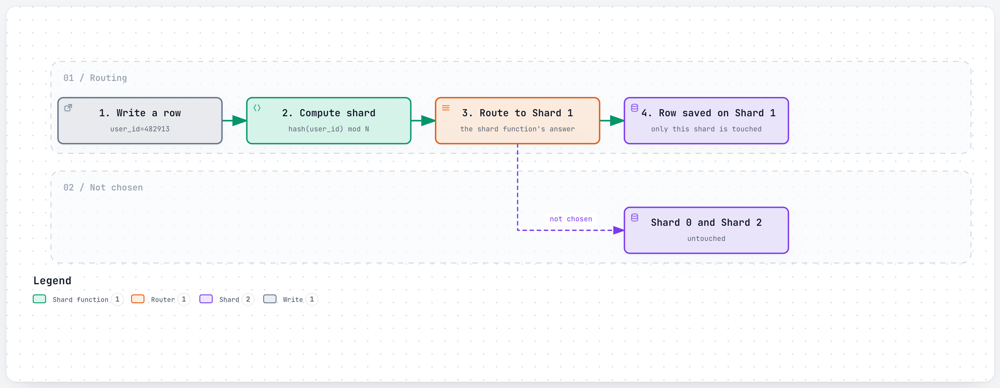
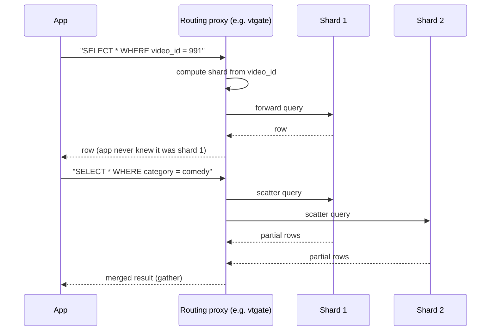
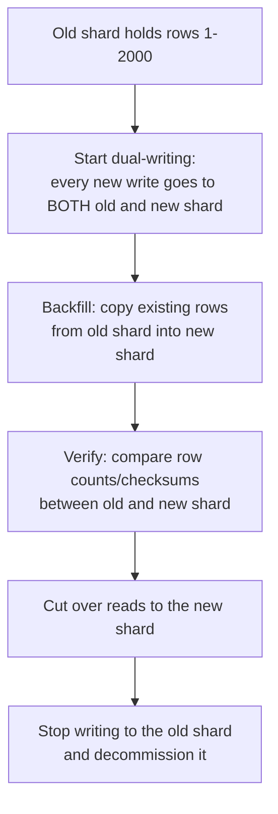
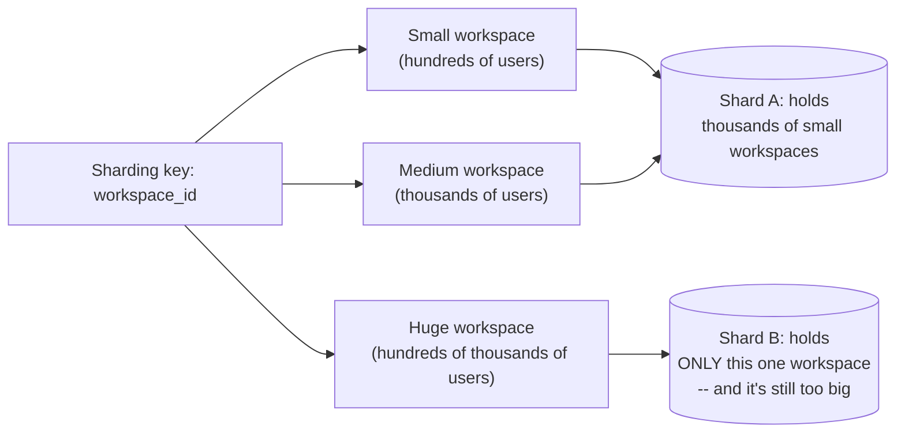

# Sharding

> Splitting one big database into many smaller ones, each holding only a slice of the data, so no single machine has to store or serve it all.

## The problem it solves (a small story)

Imagine a filing cabinet with every customer's paperwork in the country, alphabetically, in one room. It worked fine when the company had a thousand customers. Now it has a hundred million, the room is a warehouse, and every clerk needing "customer Zhang's file" has to walk the same long aisle as every clerk needing "customer Adams's file." Eventually one warehouse, however well organized, cannot physically hold the paperwork, and one line of clerks cannot serve everyone fast enough.

The fix: build ten warehouses, and send everyone whose last name starts A-C to warehouse 1, D-F to warehouse 2, and so on. Now each warehouse only holds a tenth of the paperwork and only serves a tenth of the clerks. That's sharding — partitioning data by some key (last name, user ID, video ID) so each physical database only owns a slice, and the application knows (or asks something that knows) which slice to go to.

This is exactly the wall Instagram, Slack, and YouTube each hit: a single MySQL or Postgres instance simply ran out of room, or ran out of write throughput, long before the product ran out of users. Slack's own experience makes the point sharply: even after sharding by workspace, a handful of individual customers eventually grew bigger than any one shard's hardware could hold — proof that the *first* sharding key you pick doesn't have to be the *last* one.

## How it works (step by step, with at least 2 Mermaid diagrams)

<a href="https://alwintwk.github.io/big-tech-system-design/diagrams/concepts-sharding-route-write.html">
  <picture>
    <source media="(prefers-color-scheme: dark)" srcset="../diagrams/concepts-sharding-route-write.dark.png">
    
  </picture>
</a>

Click the diagram for the interactive version (zoom, dark mode, trace a path).

> **Why this matters:** the shard function is the entire contract. As long as `hash(user_id)` always produces the same answer for the same user, every write and every read for that user lands on the same shard forever — which is exactly what lets a stateless application server "just know" where to look, without asking anyone else first.

Step by step:
1. Every row needs a **sharding key** — a field that decides which shard owns it (user ID, video ID, workspace ID). Picking this key well is the single most consequential decision in the whole design.
2. A shard function (often a hash of the key) maps each key to one of N shards, spreading data as evenly as the key's distribution allows.
3. Writes and point-reads for a given key always go to the same shard, so the application (or a routing layer) only has to compute the function, not search every shard to find one row.
4. Queries that don't include the sharding key (`"show me all videos in category X"`) can't be routed to one shard — they become **scatter-gather**: fan out to every shard, then merge results in the application layer, which costs real latency and coordination overhead.

Because engineers shouldn't have to hand-write "which shard is this row on" logic everywhere, several companies here put a routing proxy in front of the shards instead:

> **Why this matters:** the proxy (Vitess's `vtgate` is the concrete example both YouTube and Slack use) hides the sharding entirely from application code for the common case, and only pays the scatter-gather tax when a query genuinely needs it — the application never has to be rewritten just because the number of shards changed underneath it.

## Worked example

Say a video platform shards video metadata by `hash(video_id) mod 1000` across 1,000 MySQL shards. A request for "video 8842's title and view count" hashes the ID, lands on exactly one shard, and returns in a few milliseconds — completely oblivious to the other 999 shards' existence.

Now a product manager asks for "the 10 most-viewed videos uploaded this week, across the whole platform." That query has no `video_id` to hash — it needs to check *every* video uploaded this week, wherever it happens to live. The routing proxy has no choice but to fan the query out to all 1,000 shards, wait for each one's partial answer, and merge them into one final top-10 list. This single query now costs roughly 1,000x more coordination than the video-by-ID lookup, even though "10 rows" sounds like a small thing to ask for. This is precisely why systems built around sharding usually maintain separate, purpose-built indexes (a search index, an analytics warehouse) for exactly this kind of cross-shard question, rather than running it against the sharded operational database directly.

## Choosing a sharding key

A short checklist, in priority order:
1. **What does the hottest query filter on?** If 95% of traffic reads and writes by `user_id`, shard by `user_id` — matching the dominant access pattern is worth more than any other consideration.
2. **Is the key's value distribution even?** A key like "signup month" clusters unevenly (recent months are far busier than old ones); a hashed ID spreads evenly regardless of the underlying data's natural clustering.
3. **Does the key ever need to change?** A user changing their sharding key (rare, but it happens — an account merge, say) means physically moving their row from one shard to another, which is far more disruptive than an ordinary update.
4. **How painful is a cross-shard query for this key, and how often does it actually happen?** If cross-shard queries are common, either the key is wrong, or a secondary index/search system is needed alongside the sharded store, not instead of it.
5. **Could any single value of this key grow disproportionately large?** A key that's usually fine (workspace ID, account ID) can still fail for its biggest outlier — plan for a finer-grained fallback before that outlier actually shows up in production.
6. **Is there a routing proxy, or does every caller need to compute the shard itself?** Hiding the shard function behind a proxy means the key can be re-derived or the shard count can change later without rewriting every single caller.

## Resharding without downtime

The hardest sharding problem usually isn't the initial split — it's changing your mind later, live, without taking the product down. A typical zero-downtime resharding sequence looks like this:

The pattern that shows up again and again (Discord's guild-to-new-index migration, YouTube's Vitess resharding, Slack's channel-level reshard) is: never do a single risky cutover. Instead, run both the old and new layout side by side for a while, verify they genuinely agree, and only then retire the old one — so if anything looks wrong at the verification step, the system can simply keep serving from the old shard a while longer instead of having already destroyed it.

## Signals that you need to shard (and signals you don't)

Reach for sharding when:
- Write throughput to a single database instance is the actual bottleneck, not just data volume — one machine physically cannot accept writes fast enough.
- The dataset no longer fits comfortably in one machine's memory/disk, and vertical scaling (a bigger box) has a real, foreseeable ceiling.
- One dominant access pattern (almost everything keyed by `user_id`, or by `video_id`) is clear enough to pick a sharding key with confidence.

Be more careful, or hold off, when:
- The real bottleneck is actually read load, which [replication](replication.md) and [caching](caching.md) can often solve more cheaply and with far less operational complexity than sharding.
- There's no single dominant access pattern yet — sharding on the wrong key can be more disruptive than not sharding at all.
- The team doesn't yet have a resharding story — sharding too early, on a key that has to change later, front-loads a hard migration before it's actually needed.

## Variants / strategies

| Strategy | How | Pros | Cons |
|---|---|---|---|
| Range-based sharding | Contiguous key ranges (A-C, D-F...) go to the same shard | Simple; range queries on the key stay on one shard | Uneven distribution if keys aren't uniform (a popular range gets hot) |
| Hash-based sharding | `hash(key) mod N` picks the shard | Spreads keys evenly regardless of key distribution | Adding/removing a shard reshuffles almost everything, unless paired with [consistent hashing](consistent-hashing.md) |
| Directory-based sharding | A lookup service/table maps each key (or key range) explicitly to a shard | Very flexible resharding — just update the mapping | The lookup service itself becomes a critical dependency |
| Colocation ("colo") sharding | Data usually accessed together (a user's own files) is deliberately placed on the same shard | Keeps the common case fast and cheaply consistent, no cross-shard coordination | The rarer cross-shard operation is slower and more complex |
| Vertical partitioning (often confused with sharding) | Split by *column*/table (e.g. profile data vs. billing data), not by row | Isolates load and blast radius between features | Doesn't help when one single table itself is too big |
| Federation | Split entirely different features/domains into their own separate databases (not the same table split by key) | Each domain's database can be scaled, tuned, and failed over independently | Any query spanning two domains needs an application-level join, not a SQL one |
| Geo-sharding | Route by a user's region/location, so their data lives physically close to them | Lower latency for regional traffic; can satisfy data-residency rules | A user who travels or moves regions complicates "which shard owns me" |
| Finer-grained re-key (e.g. workspace to channel) | Move from a coarse key to a more granular one when the coarse key's outliers outgrow a single shard | Fixes the "one giant tenant" problem the original key couldn't | A real migration project — every query written against the old key needs to be rewritten |

## When one tenant outgrows one shard

Multi-tenant products (Slack's workspaces, YouTube's channels) have a specific version of this problem: the sharding key that works for 99.9% of tenants can still fail for the 0.1% that are simply enormous.

A single "workspace" sharding key assumes every workspace is roughly comparable in size — true for the overwhelming majority, false for the handful that dwarf an average shard's capacity all on their own. The fix isn't a bigger shard; it's a *finer-grained* key (Slack's move to sharding by channel, not just workspace) that can split even a single giant tenant's data across multiple shards, instead of forcing it to fit on one.

## Where the companies in this repo use it

- **Twitter/X** built **Gizzard**, a generic sharding framework, specifically so the social graph (who follows whom) could be sharded across many MySQL instances without every service hand-rolling its own routing logic: [../companies/twitter-x.md#how-it-evolved](../companies/twitter-x.md#how-it-evolved)
  Gizzard and its graph store FlockDB were both eventually open-sourced, then archived as no longer maintained — a reminder that an internal sharding framework can outlive the specific product need it was originally built for.

- **Slack** ran MySQL sharded by workspace ID for years, then spent roughly three years migrating onto **Vitess** so it could reshard by *channel* instead — because a handful of huge customers had each grown too big for one shard's hardware to hold: [../companies/slack.md#the-vitess-migration-from-one-shard-per-workspace-to-flexible-resharding](../companies/slack.md#the-vitess-migration-from-one-shard-per-workspace-to-flexible-resharding)
- **YouTube** shards video/channel metadata across thousands of MySQL shards behind Vitess's `vtgate`/`vttablet` proxy, so application code queries by `video_id` without ever knowing which shard the row is actually on: [../companies/youtube.md#vitess-sharding-and-query-routing](../companies/youtube.md#vitess-sharding-and-query-routing)
- **Dropbox**'s Edgestore introduces "colos," deliberately placing a user's own files and folders on the same physical MySQL shard, so the common case gets cheap strong consistency for free and only the rare cross-shard operation pays for a two-phase commit: [../companies/dropbox.md#edgestore](../companies/dropbox.md#edgestore)
- **Instagram** mints unique IDs independently inside thousands of sharded PostgreSQL schemas, with no shard ever needing to ask another shard or a central service for a number — a scheme conceptually like Twitter's Snowflake, but implemented with plain PL/pgSQL instead of a separate ID service: [../companies/instagram.md#3-signature-component-the-sharded-id-generator](../companies/instagram.md#3-signature-component-the-sharded-id-generator)
- **Discord** re-keyed its message table's partition key to `(channel_id, bucket, message_id)`, bucketing roughly 10 days of messages per partition specifically to keep each partition small and manageable as message volume grew into the trillions: [../companies/discord.md#from-mongodb-to-cassandra-to-scylladb-three-databases-in-under-a-decade](../companies/discord.md#from-mongodb-to-cassandra-to-scylladb-three-databases-in-under-a-decade)

## Common mistakes

- **Picking a sharding key that doesn't match the access pattern.** If most queries filter by `video_id`, sharding by `upload_date` forces scatter-gather on almost every request.
- **A key with a skewed distribution.** Sharding by "first letter of last name" sounds even but isn't (many more "S" names than "X"); a hot shard defeats the whole point of sharding.
- **Forgetting cross-shard queries exist at all.** Every schema eventually needs a query that doesn't fit the sharding key — plan for scatter-gather rather than discovering it in production.
- **Resharding as an afterthought.** A scheme that works at today's size but requires "stop the world and rewrite everything" to add capacity later is a scheme that will eventually force a multi-year migration, as it did for Slack.
- **Conflating sharding with replication.** Sharding splits *different* data across machines for scale; replication copies the *same* data across machines for durability/availability — most real systems need both, for different reasons.
- **Assuming one sharding key serves forever.** Slack's own history is the counterexample: workspace-level sharding worked for years, until it didn't, and the fix required years of migration work rather than a config change.
- **No plan for a hot shard.** Even with an even key distribution on average, one specific key (one viral video, one huge workspace) can still land disproportionate load on a single shard — sharding alone doesn't fix a hot key, only spreads the *average* load.
- **A single sharding granularity for every tenant.** Assuming every "unit" (every workspace, every account) is roughly the same size breaks the moment one of them isn't — multi-tenant systems eventually need a finer-grained key precisely for their largest outliers.
- **Doing a single, risky, all-at-once cutover.** Migrating every shard's data to a new layout in one irreversible step removes the ability to simply keep serving the old layout a little longer if verification finds a problem.
- **Skipping the verification step during a migration.** Dual-writing to an old and new shard proves nothing on its own — without actually comparing row counts or checksums between them, a silent bug in the new write path can go unnoticed until the old shard is already gone.

## Interview questions

Q1. What makes a good sharding key?

One that matches how the data is actually queried (so most requests can be routed to a single shard), and one that distributes load evenly across shards (no single key value, or narrow range of values, dominates traffic). User ID or a hashed ID is common; a naturally clustered field like "signup date" often is not, because recent shards get hotter than old ones.

Q2. How do you handle a query that doesn't include the sharding key?

Fan the query out to every shard (scatter), then merge the partial results in the application or a routing layer (gather). This is slower and more complex than a single-shard query, which is exactly why the sharding key should be chosen to make this the rare case, not the common one — and why systems often maintain a separate search index or analytics store for exactly these queries instead of running them against the sharded store directly.

Q3. What's the difference between sharding and partitioning?

They're often used interchangeably; when a distinction is drawn, "partitioning" is the general idea of splitting data (which can include splitting by column, or splitting within one machine), while "sharding" specifically means splitting data across separate machines/databases.

Q4. Why is resharding (adding or removing shards) hard?

With naive hash-based sharding (`hash(key) mod N`), changing N changes almost every key's target shard, requiring a near-total data reshuffle. This is the exact problem [consistent hashing](consistent-hashing.md) and directory-based sharding schemes exist to avoid — they let you add capacity by moving only the slice of data that needs to move.

Q5. How do you generate unique IDs across many independent shards without a central bottleneck?

Bake enough information into the ID itself that no shard needs to coordinate with any other — e.g., encoding a timestamp, a shard/worker identifier, and a per-shard sequence number into one integer, the way Twitter's Snowflake and Instagram's sharded ID scheme both do. See [Instagram's sharded ID generator](../companies/instagram.md#3-signature-component-the-sharded-id-generator) and [Twitter's Snowflake](../companies/twitter-x.md#3-signature-component-snowflake-id-structure).

## Related concepts

- [Consistent hashing](consistent-hashing.md) — makes adding/removing shards cheap instead of a full reshuffle
- [Replication](replication.md) — copies within a shard for durability, distinct from splitting across shards for scale
- [CAP theorem and consistency](cap-and-consistency.md) — cross-shard operations often force a consistency trade-off
- [Geo-indexing](geo-indexing.md) — a specialized form of partitioning data by physical location
- [Microservices](microservices.md) — each independently-owned service typically owns its own sharded store
- [Load balancing](load-balancing.md) — a routing proxy in front of shards is doing a form of key-aware load distribution
- [Fan-out](fan-out.md) — a scatter-gather query is fan-out and gather applied to a sharded read instead of a live event

## Further reading

- [Shard (database architecture) — Wikipedia](https://en.wikipedia.org/wiki/Shard_(database_architecture))
- [System Design Primer — sharding and database scaling](https://github.com/donnemartin/system-design-primer)

Back to the filing cabinet: sharding never makes the paperwork smaller — it just makes sure no single warehouse, and no single clerk, ever has to deal with all of it at once. The hard part was never splitting it up once; it's making sure the split still holds up years later, for the one customer, the one video, or the one workspace nobody expected to get quite this big.
