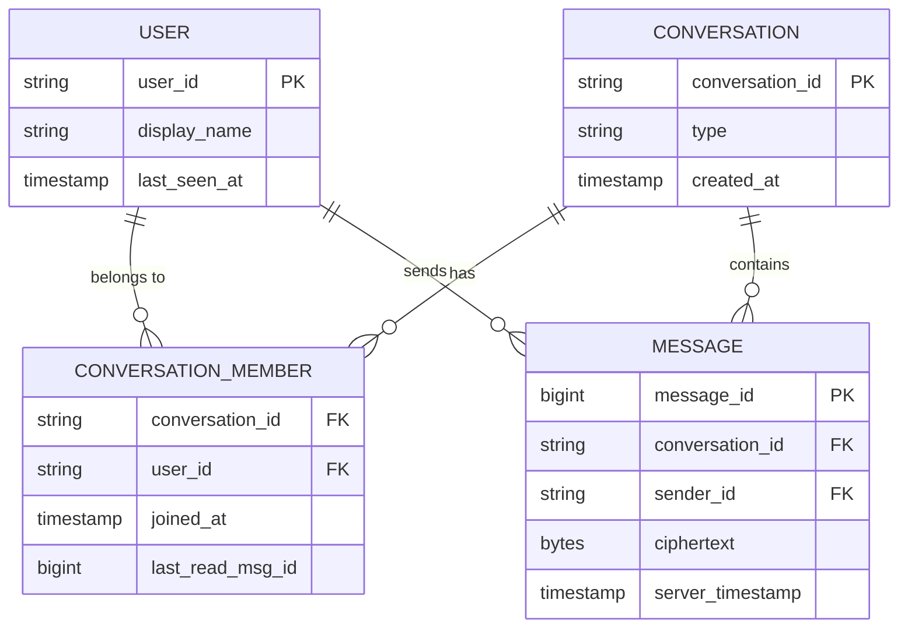
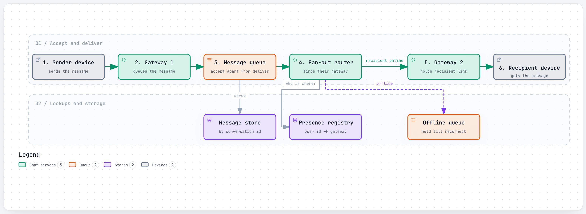
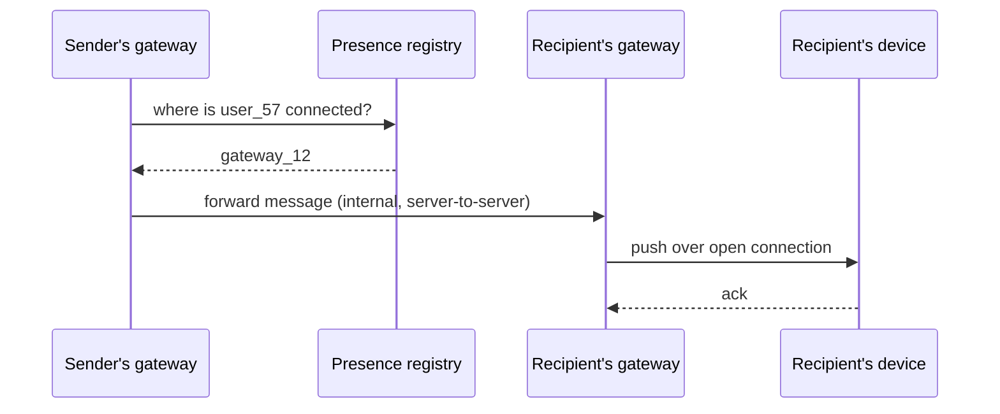
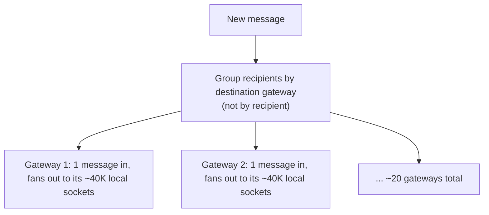

# Design a Chat Application

> The interviewer is testing whether you know that "real-time messaging" is really three separate
> hard problems wearing one trenchcoat: holding millions of mostly-idle connections open cheaply,
> routing a message to whichever server currently holds the recipient's connection (which changes
> every time they reconnect), and delivering reliably to someone who's offline entirely. Most
> candidates design the data model fine and then hand-wave the connection-routing problem — that's
> where this question is actually won or lost.

## 1. Clarify requirements

Questions worth asking:

- **1:1 messaging only, or group chats too?** Group size matters a lot — a 5-person group and a
  10,000-member community fan out completely differently.
- **Delivery guarantees**: is "at least once, client dedupes" acceptable, or does it need to be exactly
  once? (At-least-once + idempotent client is the realistic answer almost everywhere.)
- **Ordering**: do messages within a single conversation need a strict, agreed-upon order, even across
  the sender's multiple devices?
- **Offline delivery**: what happens to a message sent to someone who isn't connected right now — how
  long does it wait, and where?
- **End-to-end encryption**: is the server allowed to read message content, or must it stay opaque?
  This changes what the server is allowed to build features on top of (e.g. server-side search).
- **Presence**: does the product need "online/last seen," and how fresh does it need to be?
- **Multi-device**: can one account be logged in on several devices at once, and do they all need the
  same messages?

**Functional requirements:**

- Send and receive text messages, 1:1 and in groups.
- Message history, paginated, per conversation.
- Delivery and read receipts.
- Presence (online/offline/last seen).

**Non-functional requirements:**

- **Low latency delivery** to an online recipient — under a second end to end.
- **Durability**: an accepted message must never be silently lost, even if the recipient is offline for
  days.
- **Massive number of concurrent, mostly-idle connections** held open simultaneously.
- **Horizontal scalability** of connection-holding infrastructure independent of message-processing
  infrastructure — these have very different resource profiles (memory-bound vs. CPU/IO-bound).

## 2. Back-of-the-envelope estimates

**Assumption:** 500 million daily active users, averaging 40 messages sent per user per day.

- Messages/day = 500,000,000 × 40 = **20 billion messages/day**
- Average QPS = 20,000,000,000 / 86,400 ≈ **~231,000 messages/sec**
- **Assumption:** peak factor of 3x (evening peak in any given region).
- Peak QPS ≈ 231,000 × 3 ≈ **~700,000 messages/sec**

**Concurrent connections — assumption:** 20% of DAU concurrently connected at any moment (a
mobile-heavy product with app-in-background reconnects, not literally 500M simultaneous foreground
users).

- Concurrent connections ≈ 500,000,000 × 0.20 = **100 million concurrent open connections**
- **Assumption:** a single connection-handling server can hold ~50,000 idle WebSocket connections
  (memory-bound, not CPU-bound, at idle) — this is the kind of number you'd ask the interviewer to
  sanity-check, or state as a deliberately round assumption.
- Servers needed just to hold connections ≈ 100,000,000 / 50,000 = **~2,000 connection servers**, before
  counting any message-processing capacity at all. This is the number that makes the case for a
  language/runtime built for cheap concurrency (Erlang, Go) over one thread-per-connection — see
  [section 8](#8-how-real-companies-did-it).

**Storage per message — assumption:** message ID (8 bytes) + sender/recipient/conversation IDs (24
bytes) + timestamp (8 bytes) + ciphertext payload (~100 bytes average) + delivery metadata (~20 bytes)
≈ **~160 bytes/message**.

- Storage/day = 20,000,000,000 × 160 bytes ≈ **~3.2 TB/day**
- Storage/year = 3.2 TB × 365 ≈ **~1.17 PB/year**

This is the number that rules out a single relational database from the start — a wide-column store
sharded by conversation ID (see [section 4](#4-data-model)) is the realistic answer at this volume, not
a scaling afterthought.

## 3. API design

The core protocol is a persistent connection (WebSocket, or a custom binary protocol over TCP), not
REST — REST is used for the surrounding, less time-sensitive operations.

**Over the persistent connection**, framed messages:

```
// client -> server: send a message
{
  "type": "message",
  "client_msg_id": "c-9f31...",   // client-generated, used for dedup and offline retry
  "conversation_id": "conv_882",
  "ciphertext": "..."
}

// server -> client: acknowledge receipt (not delivery)
{
  "type": "ack",
  "client_msg_id": "c-9f31...",
  "server_msg_id": "msg_5920331",
  "server_timestamp": "2026-09-27T10:00:01Z"
}

// server -> client: deliver an incoming message
{
  "type": "message",
  "server_msg_id": "msg_5920331",
  "conversation_id": "conv_882",
  "from": "user_42",
  "ciphertext": "...",
  "server_timestamp": "2026-09-27T10:00:01Z"
}

// client -> server: mark read
{ "type": "read_receipt", "conversation_id": "conv_882", "up_to_msg_id": "msg_5920331" }
```

**Over REST**, for things that don't need a live connection:

```
GET /api/v1/conversations/{id}/messages?before=msg_5920331&limit=50
200 OK
{ "messages": [ ... ], "has_more": true }

POST /api/v1/conversations
{ "member_ids": ["user_42", "user_57", "user_88"], "type": "group" }
201 Created { "conversation_id": "conv_991" }
```

The `client_msg_id` is the detail worth naming unprompted: it's what makes retrying a send after a
dropped connection safe — the server can recognize "I've already stored this one" instead of creating a
duplicate. This is the same idempotency pattern covered in
[`../concepts/idempotency.md`](../concepts/idempotency.md) and in the
[payment system problem](payment-system.md).

## 4. Data model



**Why these keys:** `MESSAGE` is partitioned (sharded) by `conversation_id`, not by `message_id` or
`sender_id`, because the single most common query is "give me the last N messages in *this*
conversation" — keeping a conversation's messages physically together turns history pagination into a
cheap range scan on one shard instead of a scatter-gather across the whole fleet. `message_id` itself
should be roughly time-sortable within a conversation (a Snowflake-style ID, see the
[URL shortener problem](url-shortener.md#61-generating-unique-short-codes-without-a-bottleneck) for the
same underlying technique) so "give me messages after X" is a simple comparison. `CONVERSATION_MEMBER`
is its own table, not a list embedded on `CONVERSATION`, because membership changes (someone joins or
leaves a group) and per-member state (`last_read_msg_id`) need to be updated independently, without
rewriting the whole conversation row.

## 5. High-level design

<a href="https://alwintwk.github.io/big-tech-system-design/diagrams/problems-chat-app-send-message.html">
  <picture>
    <source media="(prefers-color-scheme: dark)" srcset="../diagrams/problems-chat-app-send-message.dark.png">
    
  </picture>
</a>


<sub>Click the diagram for the interactive version (zoom, dark mode, trace a path).</sub>

Walkthrough:

1. Both sender and recipient hold a **persistent connection** to a **gateway server** (see
   [`../concepts/persistent-connections.md`](../concepts/persistent-connections.md)) — but not
   necessarily the *same* gateway server, and that's the crux of this design.
2. When the sender's gateway receives a message, it does not try to deliver it directly. It durably
   persists the message and hands it to a **message queue** for fan-out — this decouples "did we
   durably accept this message" from "did we deliver it to a live connection right now," which can
   fail independently. The **presence registry** (who's currently connected to which gateway) was
   already written at connect time, and gets *read*, not written, during this step.
3. The **fan-out router** consumes from the queue, looks up each recipient's current gateway in the
   presence registry, and pushes the message to that specific gateway, which forwards it down the
   recipient's live connection.
4. If the recipient isn't currently connected, the message goes to an **offline delivery queue**
   instead — retried, or delivered as a push notification, and flushed to the client the next time it
   reconnects and asks for anything newer than its last-seen message ID.
5. The **message store** is the durable source of truth, sharded by conversation — the fan-out and
   presence lookup are about *live* delivery speed, but a client can always resync from the store.

## 6. Deep dives

### 6.1 Connection routing: finding "which server holds this socket"

The hardest part of this whole design is that a WebSocket connection is **stateful and pinned to one
machine** — user 57's open socket lives on gateway server 12, and no other server can push to it
directly. A **presence registry** (typically Redis, or a purpose-built service) maps `user_id ->
gateway_server_id`, updated on every connect/disconnect. Every fan-out for that user has to consult this
registry first.



This is the exact problem Slack solves with **consistent hashing plus a hash-ring manager (CHARM)** and
Discord solves with **Manifold's hierarchical fan-out** — see [section 8](#8-how-real-companies-did-it)
for both.

### 6.2 Group fan-out at very different sizes

A 5-member group and a 50,000-member community are not the same engineering problem. Fanning out to 5
gateways per message is trivial. Fanning out to tens of thousands means the naive "one push per
recipient, sent directly from the origin process" becomes the bottleneck itself — the fix used at real
scale is to **group recipients by which server they're connected to first**, and send exactly one
message per destination server, letting that server fan out locally to its own local connections
(cheap, in-process) instead of the origin process doing one expensive network hop per recipient.



### 6.3 Offline delivery and store-and-forward

A message to an offline recipient can't just be dropped, and it can't wait indefinitely in an
in-memory queue on a specific gateway either (that gateway can crash, or the recipient might reconnect
to a *different* one). The durable message store (4) is the actual answer: on reconnect, the client
sends "give me everything after message ID X in each conversation I'm in," and the server serves that
from durable storage — the same code path used for scrollback/history, not a special one-time-only
delivery queue. This also naturally handles multi-device: each device tracks its own last-seen message
ID independently.

### 6.4 Ordering and at-least-once delivery

Two guarantees are realistic and one usually isn't:

- **At-least-once delivery, client dedupes on `client_msg_id`.** Networks drop acks; the sender retries
  a send it isn't sure went through, and the server (or client, on the receive side) recognizes and
  discards true duplicates rather than trying to guarantee exactly-once end to end, which is far more
  expensive for marginal benefit here.
- **Ordering within one conversation is enforced by server-assigned, monotonically increasing message
  IDs** — the server, not the client's wall clock, decides final order, since client clocks disagree
  and a client can be offline while messages from others keep arriving.
- **Global ordering across all conversations is not attempted** — there's no product reason two
  messages in unrelated conversations need a defined relative order.

## 7. Bottlenecks and failure modes

- **A gateway server crashes with tens of thousands of live connections on it.** Every one of those
  clients has to reconnect, redo the presence-registry write, and re-fetch anything they missed. This
  is a routine, expected event in this design, not a rare one — the system has to make it cheap and
  fast (see Slack's CHARM in section 8, sub-30-second replacement).
  - Making this smoothly-handled is the design goal on its own: a single stateful server failing
    should be invisible to the product, not an incident.
- **Reconnect storms**: if a large fraction of clients disconnect simultaneously (a mobile carrier
  outage, or literally the top of the hour when phones wake apps in a batch), every one of them hits
  the connect path — login, auth, presence write — at once. Slack's Flannel exists specifically to
  absorb this; see section 8.
- **The presence registry itself as a single point of failure.** If it's down, message *acceptance*
  should still work (durable store keeps taking writes); only *live* delivery routing degrades to
  "treat everyone as offline, deliver on next reconnect" — graceful degradation, not a full outage.
- **Hot conversations** (a very large group, or one account many people message) create a hot shard on
  whichever partition holds that conversation's messages — mitigated the same way any hot-key problem
  is, with caching and, if needed, further splitting an unusually large conversation's storage.
- **Group fan-out at extreme size** (tens of thousands to millions of members) needs the
  gateway-grouped fan-out from 6.2; without it, fan-out latency for large groups scales with member
  count directly, and gets slow, then user-visibly slow, then a real incident.

## 8. How real companies did it

- **WhatsApp's core send flow** fans a message out to every one of the recipient's *devices*
  individually (client-fanout), encrypting once per device, not once per person — a deliberate
  trade-off that keeps the server blind to plaintext but would be far too expensive at large-group
  scale, which is exactly why WhatsApp uses the Signal Protocol's Sender Key scheme for groups instead
  of full pairwise fanout. See
  [WhatsApp: core flow](../companies/whatsapp.md#1-core-flow-sending-an-encrypted-message-to-a-multi-device-recipient).
- **Slack routes messages with consistent hashing**: each channel maps to one stateful Channel Server
  via a hash ring, and a component called **CHARM** (Consistent Hash Ring Manager) can detect an
  unhealthy Channel Server and get a freshly-provisioned replacement serving traffic again in under 20
  seconds — turning the loss of a single stateful server into a routine, sub-30-second event instead of
  a visible incident. See
  [Slack: the Channel Server hash ring](../companies/slack.md#3-signature-component-the-channel-server-hash-ring-and-fast-failover).
- **Discord's Manifold** solves the group-fan-out problem in 6.2 exactly as described there: instead of
  one expensive cross-node send per remote session, it groups all recipients on a message by which
  remote node they're connected to, sends one message per node, and lets a local worker fan out to its
  own sessions in-process — which is cheap because same-node message passing never touches the network.
  See
  [Discord: Manifold's hierarchical fan-out](../companies/discord.md#3-signature-component-manifolds-hierarchical-fan-out).

Relevant concepts: [persistent connections](../concepts/persistent-connections.md),
[fan-out](../concepts/fan-out.md), [message queues and logs](../concepts/message-queues-and-logs.md),
[consistent hashing](../concepts/consistent-hashing.md),
[CAP and consistency](../concepts/cap-and-consistency.md).

## 9. What a strong answer sounds like

- I'd nail down group size expectations and delivery guarantees first — a 5-person group and a
  50,000-member community are different fan-out problems, and "at least once, client dedupes" is much
  cheaper than true exactly-once.
- At an assumed 500M DAU and 40 messages/user/day, that's ~700K messages/sec at peak and roughly 100M
  concurrent open connections — which rules out one connection per OS thread and argues for a
  cheap-concurrency runtime.
- The hardest part isn't sending a message, it's finding which specific server currently holds the
  recipient's open connection — I'd use a presence registry mapping user to gateway, updated on every
  connect/disconnect.
- Message acceptance (durable write) and live delivery (push to an open socket) are decoupled on
  purpose — accepting a message should never fail just because the recipient happens to be offline
  right now.
- For large-group fan-out, I'd group recipients by destination server and send one message per server,
  not one message per recipient — the same pattern Discord's Manifold uses to reach guilds with over a
  million concurrent members.
- A gateway server crashing with tens of thousands of connections on it is a routine event in this
  design, not an edge case — I'd want that handled the way Slack's CHARM does it, with sub-30-second
  automatic replacement and reconnection.
- Ordering within a conversation is server-assigned via monotonically increasing message IDs; I
  wouldn't trust client clocks for ordering across devices.
- Storage is sharded by conversation ID, since "give me the last N messages in this conversation" is
  the dominant query and needs to be a cheap range scan on one shard.

## Common mistakes

- Designing the data model and REST API in detail, then hand-waving "and then we push it to the
  recipient" without explaining how the sender's server finds the recipient's specific live connection.
- Assuming one server can hold every connection, or that connections are evenly distributed such that
  routing is trivial — it isn't, and that's the actual interview question.
- Coupling message acceptance to live delivery, so that an offline recipient causes the sender's send
  to fail or hang.
- Fanning out to a large group with one network call per member from a single process, instead of
  grouping by destination server first.
- Trusting client-reported timestamps for message ordering.
- Treating a gateway server crash as an exceptional case instead of a routine, frequent event the
  design has to make cheap.
- Forgetting multi-device entirely — assuming one user maps to exactly one connection, one device.
