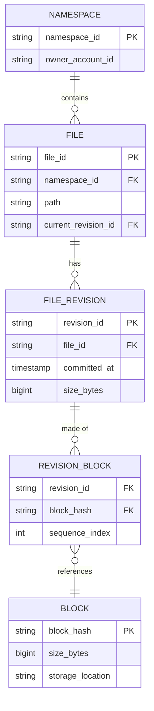
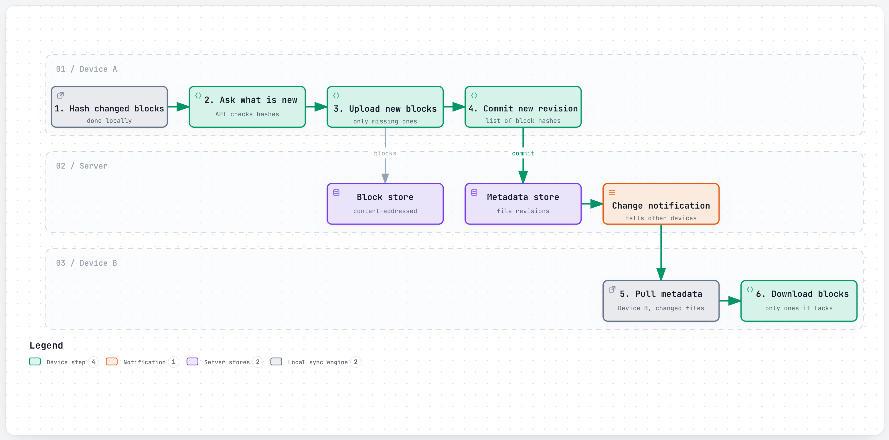

# Design a File Sync Service

> The interviewer is testing whether you know that "sync a folder across devices" is not a file-
> transfer problem, it's a **change-detection and deduplication** problem wearing a file-transfer
> costume. The real questions: how do you know which bytes actually changed without comparing whole
> files, how do you avoid storing (or re-uploading) the same bytes twice across millions of users, and
> what happens when two devices edit the same file while offline and then both come back online.

## 1. Clarify requirements

Questions worth asking:

- **What counts as "changed"** — do we re-upload a whole file on any edit, or detect and transfer only
  the changed portion?
- **How many devices** can one account sync across, and do they need near-real-time propagation, or is
  a short delay acceptable?
- **Conflict handling**: what happens if two devices edit the same file while both are offline, and
  both reconnect? Silent last-write-wins, or an explicit "conflicted copy"?
- **File size range** — is this mostly small documents, or does it need to handle large media files
  well too? This changes whether whole-file transfer is ever acceptable.
- **Versioning**: does a user need to restore a previous version of a file, or only ever see the latest?

**Functional requirements:**

- A file changed on one device propagates to all other devices linked to the same account.
- Only the changed portion of a file is re-uploaded/re-downloaded, not the whole file.
- Conflicting concurrent edits are detected and handled without silently losing either version.
- Files and folder structure (metadata) stay consistent across devices.

**Non-functional requirements:**

- **Bandwidth efficiency** — never send bytes the server (or another of the user's devices) already
  has.
- **Durability** — a file the user believes is "safely synced" must not be lost, even across
  hardware failure at the storage layer.
- **Eventual consistency across devices** is acceptable (a few seconds of propagation delay); **losing
  a user's edit silently** is never acceptable.
- **Scalable metadata operations** — folder renames, moves, and small edits are extremely frequent and
  must stay cheap regardless of how large the underlying file content is.

## 2. Back-of-the-envelope estimates

**Assumption:** 700 million registered accounts, 10% of them actively syncing on a given day (70
million DAU), averaging 20 file-change events per active user per day.

- Sync events/day = 70,000,000 × 20 = **1.4 billion sync events/day**
- Average QPS = 1,400,000,000 / 86,400 ≈ **~16,200 events/sec**
- **Assumption:** 3x peak factor → peak ≈ **~48,600 events/sec**

**Assumption:** average net-new bytes actually transferred per sync event (after block-level dedup;
most edits touch only a small part of a file) ≈ 500 KB.

- Peak transfer volume ≈ 48,600 × 500 KB ≈ **~24.3 GB/sec** aggregate, across upload and download
  combined, at the platform's busiest moments. This is the number that makes the case for **not**
  re-transferring whole files on every small edit — at this event rate, transferring even one extra
  megabyte per event compounds into a multi-gigabyte-per-second difference in required bandwidth.

**Total stored data — assumption:** 2 GB average stored per registered account.

- Total storage ≈ 700,000,000 × 2 GB = **~1.4 exabytes** — the scale at which "just use a general-
  purpose cloud object store" starts being a real cost decision, not a given (see
  [section 8](#8-how-real-companies-did-it)).

**Net-new storage growth — assumption:** 200 KB average genuinely new (non-duplicate) bytes stored per
sync event, after dedup removes anything the server already has.

- New storage/day ≈ 1,400,000,000 × 200 KB ≈ **~280 TB/day**
- New storage/year ≈ 280 TB × 365 ≈ **~102 PB/year** added, before accounting for any
  erasure-coding/replication overhead on top (see [6.4](#64-durability-without-3x-the-raw-storage-cost)).

## 3. API design

```
// Step 1: client hashes its locally changed blocks, asks which ones the server needs
POST /api/v1/blocks/check
{ "hashes": ["a1b2...", "c3d4...", "e5f6..."] }

200 OK
{ "missing": ["c3d4..."] }
```

```
// Step 2: client uploads only the blocks the server reported missing
PUT /api/v1/blocks/c3d4...
Content-Type: application/octet-stream
<block bytes>

201 Created
```

```
// Step 3: client commits the new file revision as an ordered list of block hashes
POST /api/v1/files/{file_id}/revisions
{ "block_hashes": ["a1b2...", "c3d4...", "e5f6..."], "size_bytes": 10485760 }

201 Created
{ "revision_id": "rev_552", "committed_at": "2026-09-27T10:00:00Z" }
```

```
// Other devices poll (or subscribe over a persistent connection) for metadata changes
GET /api/v1/namespaces/{namespace_id}/changes?since=cursor_88213

200 OK
{ "changes": [ { "file_id": "f_1", "revision_id": "rev_552", "path": "/docs/report.txt" } ],
  "next_cursor": "cursor_88214" }
```

The three-step upload flow (check, upload only misses, commit) is the API-level expression of the
whole block-hashing strategy in [6.1](#61-block-hashing-content-addressed-dedup) — the "check" step is
what lets the client and server agree on the minimum necessary transfer *before* any bytes move.

## 4. Data model



**Why these keys:** `BLOCK` is keyed by its own **content hash**, not an assigned ID — this is what
makes storage **content-addressed**: identical bytes from any file, any user, anywhere, collapse to
exactly one stored `BLOCK` row, and the "do we already have this" check in the API is a single indexed
lookup. `FILE_REVISION` exists as its own row per commit, rather than overwriting `FILE` in place,
because file history (and conflict resolution, 6.3) both need to reference a specific prior version,
not just "whatever the current state happens to be." `REVISION_BLOCK` is the join table that lets many
revisions reference the same unchanged blocks — editing one paragraph of a large document changes one
`FILE_REVISION` row and one new `BLOCK`, while every other block of that file is simply referenced
again, unchanged, from the new revision.

## 5. High-level design

<a href="https://alwintwk.github.io/big-tech-system-design/diagrams/problems-file-sync-upload-pull.html">
  <picture>
    <source media="(prefers-color-scheme: dark)" srcset="../diagrams/problems-file-sync-upload-pull.dark.png">
    
  </picture>
</a>


<sub>Click the diagram for the interactive version (zoom, dark mode, trace a path).</sub>

Walkthrough:

1. A device's local sync engine watches the filesystem, detects a changed file, and **hashes it into
   fixed-size blocks locally** — no server round trip needed just to know what changed.
2. It asks the metadata/API service which of those block hashes the server doesn't already have (the
   `check` endpoint) and **uploads only the misses** to the block store.
3. It commits a new `FILE_REVISION` referencing the full ordered list of block hashes (old and new)
   that make up the file's current state.
4. The metadata store's change is pushed out via a **change notification** — this is the same
   fan-out-to-many-devices shape as the [chat app problem](chat-app.md#5-high-level-design), just for
   metadata events instead of messages.
5. Every other device linked to the account pulls the changed metadata and, for each changed file,
   **downloads only the blocks it doesn't already have locally** — the same dedup check running in
   reverse.
6. The block store itself is a durable, replicated (or erasure-coded) blob store, decoupled from the
   metadata store — metadata changes constantly and in small increments; block content, once written,
   is immutable and never modified in place.

## 6. Deep dives

### 6.1 Block hashing: content-addressed dedup

Split every file into fixed-size blocks (e.g. 4 MB, last block smaller), fingerprint each block with a
cryptographic hash (SHA-256), and derive the whole file's identity from the hash of its ordered list of
block hashes:

```text
def content_hash(file_bytes, block_size=4 * 1024 * 1024):
    blocks = chunk(file_bytes, block_size)
    block_hashes = [sha256(b) for b in blocks]
    return block_hashes, sha256(b"".join(block_hashes))
```

**Worked example:** a 10 MB file splits into three blocks — two full 4 MB blocks and one 2 MB
remainder. Appending one byte at the very end and saving again only changes the third block's bytes and
hash; the client re-hashes all three blocks locally (fast — a few milliseconds), sends all three hashes
to the server, and the server reports it already has blocks one and two. Only the roughly 2 MB third
block needs to be uploaded at all. If a second device — or a completely different account — uploads the
exact same file, it produces the identical three hashes and triggers **zero** uploads, because every
block the server needs already exists somewhere in the store.

**What it costs:** fixed-size blocks are simple and fully deterministic (every client computes the
identical hash the identical way), but they have one specific weakness: inserting even a few bytes
near the *start* of a large file shifts every following block's boundary, so every hash after that
point changes — dedup against the previous version of that file effectively stops working until the
next full re-chunk. The alternative, **content-defined chunking** (choosing block boundaries based on
the content itself, so an insertion only shifts the blocks immediately around it), avoids this at the
cost of variable, less predictable block sizes.

### 6.2 Delta sync: knowing what changed without comparing whole files

Block hashing (6.1) is *one* answer to "what changed," suited to whole-block-granularity changes. It
isn't the only technique, and it's worth naming the trade-off in an interview:

| Technique | Detects | Cost |
|---|---|---|
| Fixed-size block hashing | Block-level changes | Cheap, deterministic; blind to shifted content within a block |
| Rolling checksum (rsync-style) | Byte-level insertions/deletions anywhere | More compute per sync; finds the *minimal* diff even under a shift |
| Full-file hash comparison | Whole-file identical or not | Cheapest to compute, coarsest — any single-byte change re-transfers the whole file |

Fixed-size block hashing is the right default for this interview: it captures the overwhelmingly common
case (edit somewhere in the middle or end of a file, most of it unchanged) simply and deterministically,
and the shifted-boundary weakness is a reasonable, explicitly-stated trade-off rather than a design gap.

### 6.3 Conflict resolution: two devices, one file, both offline

If device A and device B both edit the same file while offline, and both reconnect, one of them commits
a revision on top of a `FILE_REVISION` that's no longer current by the time the other's edit is applied.
The two realistic strategies:

- **Last-write-wins**: whichever revision commits second silently overwrites the first. Simple, but
  can silently discard real user work — usually unacceptable for a product where users trust their
  files are safe.
- **Conflicted copy**: detect the conflict (the incoming revision's parent isn't the current revision),
  keep *both* — commit the losing edit as a separate file (e.g. `report (conflicted copy from Device
  B).txt`) rather than dropping it. This is the safer default: it never loses data, at the cost of
  surfacing the conflict to the user to resolve manually.

Detecting the conflict is the data-model question: a client commits a new revision by referencing the
revision ID it *branched from*; if that's no longer the file's current revision by the time the commit
arrives, the server knows two edits diverged and can apply the conflicted-copy strategy instead of
silently accepting whichever arrived last.

### 6.4 Durability without 3x the raw storage cost

Simple 3-way replication (keep three full copies of every block) is the easy answer but is expensive at
petabyte-to-exabyte scale — 3x the raw storage for every byte stored. **Erasure coding** is the standard
alternative: split data into N fragments plus M parity fragments, such that any N of the (N+M) total
fragments can reconstruct the original — tolerating up to M fragment losses at a fraction of the
storage overhead of full replication (e.g. a 12-data + 2-parity scheme costs roughly 1.17x the raw data
size, versus 3x for triple replication). The trade-off: reconstructing lost data now means reading
multiple remaining fragments and recomputing, rather than just reading another full replica — more
compute per recovery, in exchange for meaningfully less storage overhead across the entire, enormous,
mostly-never-touched-again body of stored data.

## 7. Bottlenecks and failure modes

- **Metadata store under heavy small-write load** — folder renames, moves, and small edits are far more
  frequent, individually, than large binary uploads, and need to stay cheap regardless of how large the
  underlying files are (this is exactly why metadata and block content are separate systems in this
  design).
- **Change-notification fan-out to many devices** on one account behaves like a smaller version of the
  [chat app](chat-app.md#61-connection-routing-finding-which-server-holds-this-socket)'s connection-
  routing problem — a device needs to be reachable regardless of which specific server currently holds
  its connection.
- **Resync storms after a device is offline for a long time** — reconnecting after days offline means
  pulling a potentially large backlog of metadata changes at once; this needs to be paginated/streamed,
  not delivered as one enormous payload.
- **A hash collision** (two different blocks producing the same hash) is astronomically unlikely with
  SHA-256, but worth acknowledging explicitly rather than ignoring — the mitigation real systems use is
  re-verifying that a claimed hash actually matches the bytes received before accepting an upload, so a
  client can't corrupt shared storage by claiming a hash for content it isn't really sending.
- **Silent data corruption** at the storage layer (bit rot on disk, not caught by any application-level
  error) is a real risk at this scale precisely because it produces no alarm on its own — mitigated with
  continuous background verification that re-checks stored blocks against their expected hashes, not
  just trusting "the write succeeded once."
- **Erasure-coded rebuild cost during a hardware failure** — losing a storage node means reconstructing
  its share of every block it held from the remaining fragments, which is real, ongoing background work
  that has to be prioritized below live user traffic, not compete with it.

## 8. How real companies did it

- **Dropbox's block hashing** splits every file into fixed 4 MB blocks (the last smaller), fingerprints
  each with SHA-256, and derives a file's public `content_hash` from the concatenation of its block
  hashes — matching 6.1 directly, including the same fixed-size trade-off (Dropbox's own engineering
  blog gives no indication they've since moved to content-defined chunking). The client always hashes
  locally, asks the server which hashes are missing, and uploads only the misses, compressed client-
  side. See
  [Dropbox: block hashing and dedupe](../companies/dropbox.md#block-hashing-and-dedupe).
- **Dropbox built Magic Pocket**, its own exabyte-scale blob storage system, specifically because a
  general-purpose cloud object store is priced and tuned for a much broader range of access patterns
  than Dropbox's actual one (huge numbers of small, immutable, content-addressed blocks, written once
  and read many times). Its storage hierarchy — zones, pockets, cells, volumes, extents, OSDs — and its
  use of erasure coding once a volume closes are the production version of the durability trade-off in
  [6.4](#64-durability-without-3x-the-raw-storage-cost). See
  [Dropbox: Magic Pocket](../companies/dropbox.md#magic-pocket).

Relevant concepts: [replication](../concepts/replication.md), [sharding](../concepts/sharding.md),
[caching](../concepts/caching.md).

## 9. What a strong answer sounds like

- This is fundamentally a change-detection and dedup problem, not a file-transfer problem — I'd split
  files into fixed-size blocks, hash each one locally on the client, and only transfer blocks the server
  doesn't already have.
- Content-addressing (the block's identifier *is* a hash of its own bytes) is what makes dedup work
  across users for free — identical content from anyone collapses to one stored block, with no special
  cross-user logic needed.
- Metadata (file structure, revisions, paths) and block content are architecturally separate stores,
  because metadata changes are small and extremely frequent while block content is large, immutable
  once written, and comparatively rare to actually re-upload.
- At an assumed 1.4B sync events/day, aggregate transfer volume is dominated by how much we avoid
  re-sending, not by total stored data — I'd explicitly call out that block-level dedup is what keeps
  peak bandwidth (~24 GB/sec in this estimate) from being many times larger.
- Conflicts from two offline devices editing the same file should never be resolved by silently
  dropping one edit — I'd detect the conflict via the revision a commit branched from, and create a
  conflicted copy rather than picking a winner silently.
- Durability at this scale is a genuine cost engineering problem: full replication is simple but 3x the
  storage cost; erasure coding trades some rebuild-time compute for a much smaller storage overhead,
  which matters enormously once you're storing petabytes to exabytes.
- I'd flag fixed-size block hashing's one known weakness (a shift near the start of a file changes
  every following block's hash) as an explicit, accepted trade-off rather than pretend it doesn't exist.
- Storage volume here is genuinely enormous (low exabytes in this estimate) — unlike some of these
  problems, capacity planning is a first-order concern, not an afterthought.

## Common mistakes

- Designing this as "upload the whole file every time it changes" and only noticing the bandwidth
  problem when asked directly about scale.
- Proposing content hashing without content-addressed storage — hashing a file just to compare it to
  its previous version, instead of using the hash as the storage key that enables cross-user dedup.
- Handling conflicting concurrent edits with silent last-write-wins by default, without discussing that
  this can quietly discard a user's real work.
- Treating metadata and block/blob storage as one system, then being surprised metadata operations
  (folder renames, small edits) are slow because they're competing with large binary writes.
- Assuming 3-way replication is the only durability option and not knowing erasure coding exists as a
  materially cheaper alternative at large scale.
- Not addressing what happens when a device has been offline for an extended period and reconnects to
  a large backlog of changes.
- Ignoring silent data corruption entirely — assuming "the disk said the write succeeded" is a
  sufficient durability guarantee on its own.
