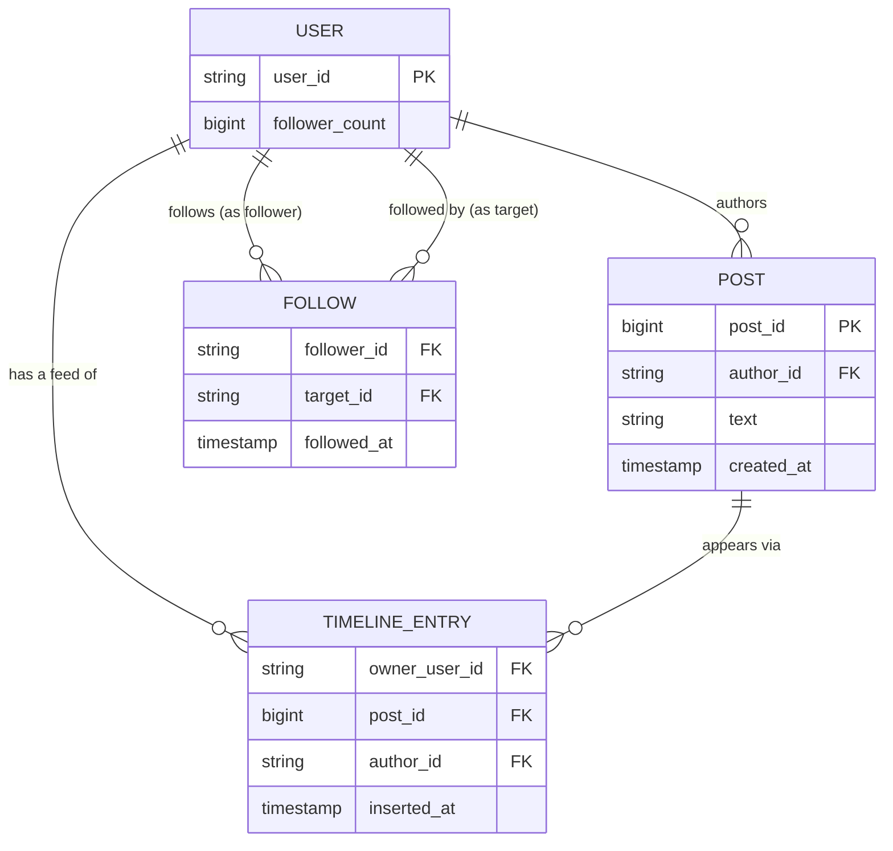
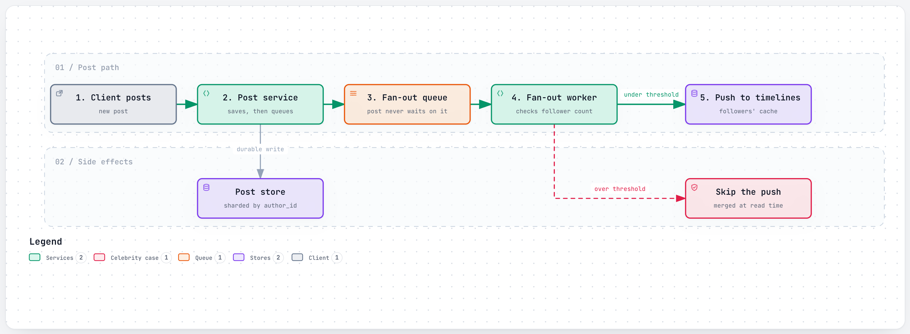
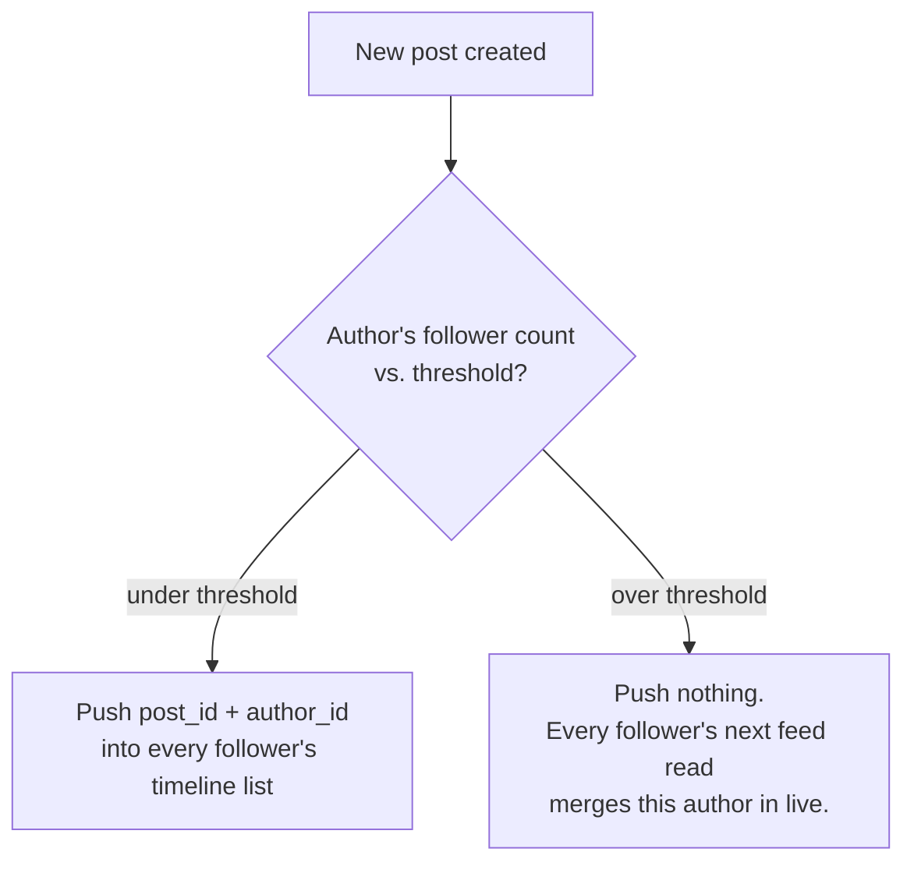

# Design a News Feed

> The interviewer is testing whether you understand that "show me new posts from people I follow" is
> actually two separate systems wearing one UI: a **fan-out** problem (getting a new post in front of
> everyone who should see it, cheaply, even when "everyone" is tens of millions of people) and a
> **ranking** problem (deciding what order to show it in, since a strict reverse-chronological feed
> stopped being the real product years ago). The single question that separates a strong answer from a
> weak one: what happens when the poster has 50 million followers?

## 1. Clarify requirements

Questions worth asking:

- **Chronological or ranked feed?** A ranked feed adds a whole scoring pipeline on top of fan-out — say
  which one you're designing, or design both and note the difference.
- Is there a meaningful **celebrity/high-follower-count problem** in this product, or are follower
  counts small and roughly uniform? (Almost always yes for a public social product — ask anyway,
  because the answer changes the whole design.)
- **How fresh does the feed need to be** — sub-second, or is a few seconds of staleness acceptable?
- Does the feed need to support **infinite scroll with stable pagination**, so a post inserted while
  you're scrolling doesn't shift everything below it?
- Is content only text, or does it include media (photos/video) that needs separate storage and
  delivery?

**Functional requirements:**

- Post content (text, optionally media).
- Follow/unfollow another account.
- Fetch a feed of recent posts from followed accounts, paginated.
- (If ranked) show the feed in an order optimized for engagement, not strictly by recency.

**Non-functional requirements:**

- **Low read latency**: opening the app and seeing a feed is the single most frequent, most
  latency-sensitive action in the whole product.
- **Write availability**: posting should almost never fail, even under load — a dropped post is a
  visible, individual failure users notice immediately.
- **Fan-out cost must not scale linearly with an account's follower count** at the high end — this is
  the design's central constraint.
- Eventual consistency is acceptable for feed freshness (a few seconds' delay before a new post appears
  in followers' feeds is fine); it is not acceptable for the post itself ever being lost.

## 2. Back-of-the-envelope estimates

**Assumption:** 1 billion daily active users, posting an average of 2 times/day, with an average of 300
followers per account (heavily skewed in reality — most accounts have far fewer, a small number have
millions — but 300 is a reasonable population average for this estimate).

- Posts/day = 1,000,000,000 × 2 = **2 billion posts/day**
- Average write QPS = 2,000,000,000 / 86,400 ≈ **~23,150 posts/sec**
- **Assumption:** 3x peak factor → peak write QPS ≈ **~69,000 posts/sec**

**Fan-out writes** (if every post fanned out to every follower, no exceptions — the naive baseline this
design has to beat):

- Fan-out writes/day = 2,000,000,000 posts × 300 followers ≈ **600 billion fan-out writes/day**
- Average fan-out QPS = 600,000,000,000 / 86,400 ≈ **~6.9 million writes/sec**

That number alone is why a single strategy can't be "fan out every post to every follower unconditionally"
— it's fine for the 99.9% of accounts with a normal follower count, and completely unworkable for the
rare account with tens of millions. This is exactly the fan-out-on-write-vs-read trade-off in
[section 6.1](#61-fan-out-on-write-vs-fan-out-on-read-the-celebrity-problem).

**Read side — assumption:** each user opens the feed ~10 times/day.

- Feed reads/day = 1,000,000,000 × 10 = **10 billion reads/day**
- Average read QPS = 10,000,000,000 / 86,400 ≈ **~115,700 reads/sec**
- Peak read QPS ≈ 115,700 × 3 ≈ **~347,000 reads/sec**

**Storage per post — assumption:** post ID (8 bytes) + author ID (8 bytes) + text (~280 bytes) +
metadata (~40 bytes) ≈ **~340 bytes/post**.

- Storage/day = 2,000,000,000 × 340 bytes ≈ **~680 GB/day**
- Storage/year ≈ 680 GB × 365 ≈ **~248 TB/year** (media storage is separate and far larger, but out of
  scope for this problem — see the [video streaming](video-streaming.md) and
  [file sync](file-sync.md) problems for large-blob storage).

**Timeline cache footprint** — the fan-out-on-write path pushes a compact `(post_id, author_id)` pair
(16 bytes) into a capped per-user list, capped at ~800 entries (a realistic cap, matching what real
feed systems use in production):

- 1,000,000,000 users × 800 entries × 16 bytes ≈ **~12.8 TB** resident across the cache fleet — large,
  but a very deliberately bounded number, because the cap is what keeps it bounded at all as the
  platform grows.

## 3. API design

```
POST /api/v1/posts
{ "text": "...", "media_ids": ["m_1"] }

201 Created
{ "post_id": "p_88213", "author_id": "u_42", "created_at": "2026-09-27T10:00:00Z" }
```

```
POST /api/v1/follows
{ "target_user_id": "u_57" }
204 No Content
```

```
GET /api/v1/feed?cursor=eyJwb3N0X2lkIjoicF84...&limit=20

200 OK
{
  "posts": [
    { "post_id": "p_88213", "author_id": "u_42", "text": "...", "created_at": "..." },
    ...
  ],
  "next_cursor": "eyJwb3N0X2lkIjoicF83..."
}
```

The feed endpoint is **cursor-paginated**, not offset-paginated — an opaque cursor (encoding the last
seen post's position) rather than `?page=3`, because the underlying feed is constantly being written to;
offset pagination would shift under a scrolling user as new posts get inserted ahead of their position.

## 4. Data model



**Why these keys:** `POST` is sharded by `author_id` (or `post_id`, if the ID itself encodes a shard —
see the [URL shortener](url-shortener.md#4-data-model) and
[chat app](chat-app.md#4-data-model) problems for the same ID-sharding technique), because writing and
reading "this author's own posts" is a common independent access pattern (e.g. a profile page). Note
that `TIMELINE_ENTRY` is *not* a normalized join of `FOLLOW` and `POST` computed at read time for every
feed load — that would mean every single feed open re-scans every followed account's posts, which is
the exact cost this design exists to avoid. Instead `TIMELINE_ENTRY` is a **materialized, precomputed**
per-user feed list, sharded by `owner_user_id`, populated by the fan-out step at post time — trading
storage (a copy of the reference per follower) for read speed (one cheap lookup instead of an N-way
join at every feed open).

## 5. High-level design

<a href="https://alwintwk.github.io/big-tech-system-design/diagrams/problems-news-feed-post-fanout.html">
  <picture>
    <source media="(prefers-color-scheme: dark)" srcset="../diagrams/problems-news-feed-post-fanout.dark.png">
    
  </picture>
</a>


<sub>Click the diagram for the interactive version (zoom, dark mode, trace a path).</sub>

Walkthrough:

1. A new post is written durably to the **post store**, then handed to a **fan-out queue** — the write
   itself succeeds independently of whatever fan-out work happens next, so posting never blocks on how
   many followers the author has.
2. A **fan-out worker** looks up the author's follower count. Under the threshold, it pushes a compact
   reference into each follower's precomputed **timeline cache** entry (fan-out-on-write). Over the
   threshold, nothing is pushed at all — that author's posts are merged in at read time instead
   (fan-out-on-read). See [6.1](#61-fan-out-on-write-vs-fan-out-on-read-the-celebrity-problem).
3. When a client requests their feed, the **feed service** reads the precomputed timeline cache (cheap,
   already-sorted candidates from most authors), **merges in** any live posts from the small number of
   high-follower accounts the user follows, and passes the combined candidate set to a **ranking
   service**.
4. The ranking service scores and orders candidates (see [6.2](#62-ranking-more-than-just-recency))
   before the final feed is returned to the client.
5. **Message queues** decouple every stage here (see
   [`../concepts/message-queues-and-logs.md`](../concepts/message-queues-and-logs.md)) — post
   acceptance, fan-out, and ranking can each be scaled and can each degrade independently without
   taking the others down with them.

## 6. Deep dives

### 6.1 Fan-out on write vs. fan-out on read: the celebrity problem

This is the single defining trade-off of this whole design:

| | Fan-out-on-write only | Fan-out-on-read only | Hybrid (what real systems run) |
|---|---|---|---|
| Normal account posts | 1 post -> N cheap pushes | 1 post -> 0 pushes, N future reads each pay a lookup cost | 1 post -> N cheap pushes |
| High-follower account posts | 1 post -> tens of millions of pushes | 1 post -> 0 pushes | 1 post -> 0 pushes, merged in at read time |
| Feed read cost | Always cheap (one cache read) | Always pays extra lookups | Cheap for most users, slightly more work only when following a huge account |

A single strategy for every account is the trap here: fan-out-on-write is clearly better for the
overwhelming majority of normal accounts (posting is rare relative to being read, so precomputing pays
off), but it completely breaks down the moment one account has tens of millions of followers — that
single post would need tens of millions of near-synchronous writes, which can overwhelm the fan-out
path for everyone else posting at the same moment. Fan-out-on-read for *every* account instead makes
every single feed read do extra work, even for the 99.9% of accounts where fan-out-on-write would have
been fine and cheap.



> **The threshold isn't universal or permanent** — an account crossing it (growing past it, or
> shrinking back under it) has to transition from one path to the other without losing or duplicating
> timeline entries, which is its own real edge case worth naming in an interview.

### 6.2 Ranking: more than just recency

A pure reverse-chronological feed is the trivial version of this problem; a ranked feed adds a
multi-stage pipeline, roughly:

1. **Candidate sourcing** — gather everything the timeline cache and merge step produced, plus
   sometimes additional candidates from outside strict "people you follow" (recommended content).
2. **Light ranking** — a cheap, fast model scores the full candidate pool down to a much smaller
   shortlist, because running the expensive model on every candidate is too costly at this volume.
3. **Heavy ranking** — a more expensive model re-scores just the shortlist using richer features
   (engagement prediction, recency decay, author relationship strength).
4. **Final assembly** — business rules layered on top (don't show two posts from the same author back
   to back, insert ads/recommendations at fixed positions, filter already-seen posts).

> **Why this matters:** interviewers frequently accept "candidate generation, then cheap ranking, then
> expensive ranking" as a complete answer on its own — the two-stage cheap-then-expensive shape is the
> generalizable pattern, and it's the same shape used at real scale (see
> [section 8](#8-how-real-companies-did-it)).

### 6.3 Bounding the timeline cache

Precomputed timeline lists can't grow unbounded — a user who follows thousands of active accounts would
otherwise accumulate an ever-growing list. Capping each list at a fixed size (e.g. the most recent
~800 entries, evicting the oldest as new ones arrive) bounds both the storage and the read cost per
feed load, at the cost of "if you don't open the app for a very long time, you may have missed posts
older than your cap's window" — an acceptable trade-off for a feed product, since users rarely scroll
back that far anyway.

## 7. Bottlenecks and failure modes

- **A single very-high-follower-count post still causes a write spike**, even under the hybrid model,
  because followers who are themselves in the middle of a normal fan-out at the same moment still share
  fan-out worker capacity — mitigated by having fan-out workers scale horizontally and by queuing (a
  slower fan-out is fine; a failed one isn't).
- **Ranking service latency or unavailability** shouldn't block the whole feed — a graceful fallback
  (serve the unranked, chronological candidate list) keeps the product usable during a ranking outage
  instead of returning nothing.
- **Timeline cache eviction under memory pressure** — if the cache tier is undersized for
  the 12.8 TB estimate above, cold users get slow, fall-back-to-database feed loads exactly when they
  return after time away, which is also exactly when they're most likely to be checking the app.
- **The threshold transition** (6.1) mishandled can duplicate or drop timeline entries for an account
  crossing from one fan-out path to the other.
- **Hot shard on a single very-followed author's live merge** in the fan-out-on-read path — every
  follower's feed read now hits that one author's recent-posts list, which needs its own caching, not a
  cold read per feed load.
- **Post store as a single point of failure for writes** — mitigated with replication (see
  [`../concepts/replication.md`](../concepts/replication.md)), same as any write-heavy datastore.

## 8. How real companies did it

- **Twitter/X runs exactly the hybrid described in 6.1**: a fanout daemon inserts a `(tweet_id,
  author_id)` pair into each follower's Redis list for accounts under a fan-out threshold, capped at
  roughly the most recent 800 entries per follower; for accounts over the threshold, nothing is pushed
  at all, and a follower's timeline read merges their own precomputed list with a live fetch from the
  handful of high-follower accounts they follow. Twitter has not published the exact current threshold
  number. See
  [Twitter/X: fan-out on write vs. fan-out on read](../companies/twitter-x.md#fan-out-on-write-vs-fan-out-on-read-the-celebrity-problem).
- **Instagram's feed and Explore ranking pipeline** runs the candidate-sourcing-then-ranking shape
  described in 6.2, evolving from a single sort order to over 1,000 ranking models in production as the
  candidate pool and personalization needs grew. See
  [Instagram: the feed/Explore ranking funnel](../companies/instagram.md#4-secondary-flow-the-feedexplore-ranking-funnel).
- Twitter/X's own ranked "For You" feed composes ranking as a **pipeline of nested pipelines** (Home
  Mixer/Product Mixer), reflecting that candidate sourcing, light ranking, heavy ranking, and final
  business-rule assembly are each independently swappable stages, not one monolithic scoring function —
  the general shape covered in 6.2. See
  [Twitter/X: the arc, end to end](../companies/twitter-x.md#how-it-evolved) for the evolution that led
  there.

Relevant concepts: [fan-out](../concepts/fan-out.md), [caching](../concepts/caching.md),
[sharding](../concepts/sharding.md),
[message queues and logs](../concepts/message-queues-and-logs.md).

## 9. What a strong answer sounds like

- The central design question is what happens when one account has tens of millions of followers — a
  single fan-out strategy can't handle both that account and a normal one well, so I'd run a hybrid:
  fan-out-on-write below a follower-count threshold, fan-out-on-read (merge at read time) above it.
- At an assumed 1B DAU posting twice a day with ~300 average followers, naive full fan-out would be
  ~6.9 million writes/sec — the hybrid approach is what keeps that number from ever being paid for the
  accounts that would actually generate it.
- Feed reads are the dominant traffic (10B/day vs. 2B posts/day) and have to stay cheap — a
  precomputed, per-user timeline cache read is the target, not a live join across everyone a user
  follows.
- The timeline cache has to be bounded (a fixed cap per user, e.g. ~800 entries), or its storage grows
  unboundedly with how many accounts a user follows.
- Ranking, if in scope, runs as a pipeline: cheap candidate sourcing, a fast lightweight model to
  shortlist, then a more expensive model to do the final ordering — running the expensive model on
  every candidate doesn't scale.
- Posting itself should never be slow or fail because of fan-out cost — the post write and the fan-out
  work are decoupled through a queue, so a fan-out backlog delays *feed freshness*, not the post itself.
- I'd default to eventual consistency on feed freshness (a few seconds' lag is fine) but not on the post
  write itself, which needs to be durable the moment it's accepted.
- This is the same problem Twitter/X's fanout daemon and Instagram's ranking funnel both solve in
  production, and I'd cite the specific trade-offs each made rather than inventing a strategy from
  scratch.

## Common mistakes

- Designing fan-out as "push every new post to every follower's feed, always" without ever asking about
  follower-count distribution — this collapses the moment a high-follower account posts.
- Computing the feed live, by joining `FOLLOW` and `POST` on every single feed open, and not noticing
  this makes every read pay the cost real systems pay only once, at write time.
- Designing ranking as a single model call over the entire candidate pool instead of a
  cheap-then-expensive staged pipeline.
- Coupling the post write to fan-out completion, so a post "succeeds" only after every follower's
  timeline has been updated — this makes posting slow and fragile for exactly the accounts (popular
  ones) that most need it to be fast and reliable.
- Forgetting that an account can cross the fan-out threshold in either direction, and not addressing
  what happens to that account's already-fanned-out entries when it does.
- Not bounding the precomputed timeline list size, letting storage grow unboundedly with how many
  accounts a heavy user follows.
- Treating pagination as simple offset-based paging on a feed that's being concurrently written to.
