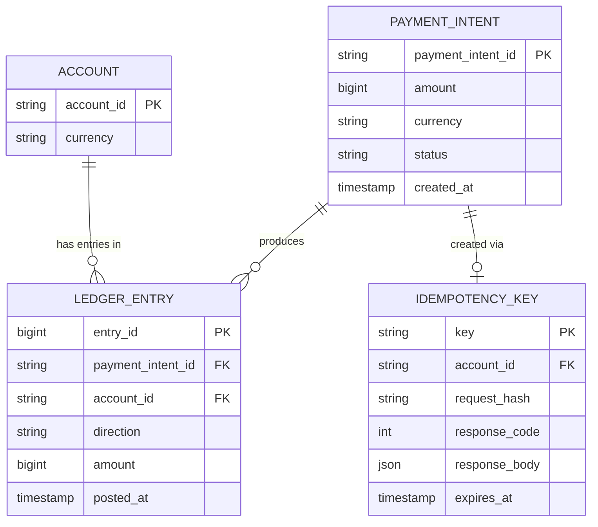
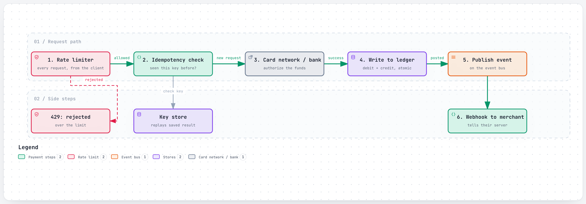
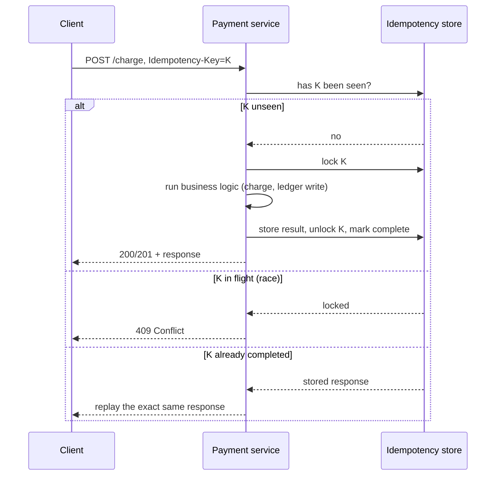
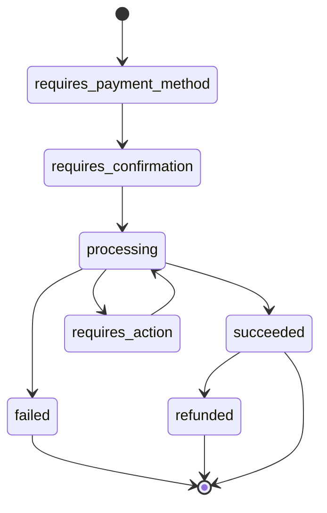

# Design a Payment System

> The interviewer is testing whether you understand that a payments API has a different core
> constraint than almost every other system in this repo: it isn't "be fast" or "be available," it's
> **never let a retry turn into a double charge, and never let a bug silently lose or duplicate money**.
> That single constraint is why idempotency keys, double-entry ledgers, and explicit state machines
> show up here and nowhere else with this much weight — and it's why "fail open" (the right answer for
> a rate limiter) is often the *wrong* answer for a payment write.

## 1. Clarify requirements

Questions worth asking:

- **What happens on an ambiguous failure** — a request that times out, where the client genuinely
  doesn't know if the charge went through? This is the central design question, and the honest answer
  is "we need a mechanism that makes retrying safe," not "we tell the client to check."
  - How should this affect the number of transactions and their costs?
- **Multi-step payment flows**: does a payment need explicit steps (authorize, capture, settle) or is
  it a single atomic charge? Real card payments are multi-step; say which you're modeling.
- **Reconciliation**: does the design need to detect drift between our own records and the external
  bank/card network's records, or is that out of scope?
- **Notifying the merchant/business** of state changes (a charge succeeded, a dispute opened) —
  synchronous polling, or asynchronous webhooks?
- **Multi-currency, multi-region**? This affects the ledger's data model significantly.

**Functional requirements:**

- Accept a request to charge a payment method for an amount.
- Track the charge through its lifecycle (created, authorized, captured, failed, refunded).
- Notify an external system (merchant) when that state changes.
- Produce an auditable, correct record of every movement of money.

**Non-functional requirements:**

- **Exactly-once effect, even under retries** — a client retrying an uncertain request must never
  result in two charges for one intended transaction.
- **Strong consistency and auditability of the ledger** — "how much money moved, and where" must never
  be ambiguous or reconstructable only approximately.
- **High availability**, but explicitly *not* at the cost of correctness — unlike most systems in this
  repo, this is a case where "reject the request" beats "guess and possibly be wrong."
- **Fair, layered protection against abusive traffic** without ever becoming the reason a legitimate
  payment fails (see the dedicated [rate limiter problem](rate-limiter.md)).

## 2. Back-of-the-envelope estimates

**Assumption:** the platform moves $2 trillion/year in payment volume, at an average transaction size
of $150.

- Transactions/year = $2,000,000,000,000 / $150 ≈ **~13.3 billion transactions/year**
- Average TPS = 13,300,000,000 / 31,536,000 seconds/year ≈ **~422 transactions/sec**
- **Assumption:** payment traffic has a much sharper peak than most consumer products — a major sales
  event can push traffic to 10x normal, not the 3x used elsewhere in this repo, because commerce
  traffic genuinely concentrates into short windows (a flash sale, a holiday).
- Peak TPS ≈ 422 × 10 ≈ **~4,220 transactions/sec**

**API request volume is much higher than transaction count** — every transaction involves multiple API
calls (create, confirm, retries, status checks), not one. **Assumption:** ~20 API requests per
transaction on average.

- API requests/year ≈ 13,300,000,000 × 20 ≈ **~266 billion requests/year**
- Average request QPS ≈ 266,000,000,000 / 31,536,000 ≈ **~8,430/sec**
- Peak request QPS ≈ 8,430 × 10 ≈ **~84,300/sec**

This gap (422 real transactions/sec vs. ~8,430 API requests/sec, on average) is why a rate limiter
(the [dedicated problem](rate-limiter.md)) is a first-class part of this design, not an add-on — the
API surface sees an order of magnitude more traffic than the transactions it represents.

**Ledger storage — assumption:** every transaction writes (at minimum) two ledger rows — a debit and a
credit — of ~300 bytes each (double-entry bookkeeping, see [section 4](#4-data-model)).

- Ledger storage/year ≈ 13,300,000,000 × 2 × 300 bytes ≈ **~8 TB/year** — genuinely small, because a
  ledger row is compact by design; the challenge here is correctness and consistency, not volume.

**Idempotency key store — assumption:** keys are retained for 24 hours (long enough to cover realistic
client retry windows), each key row ~200 bytes.

- Resident keys at any moment ≈ average TPS × 86,400 seconds ≈ 422 × 86,400 ≈ **~36.5 million keys**
- Resident size ≈ 36,500,000 × 200 bytes ≈ **~7.3 GB** — small enough to comfortably live in a fast,
  in-memory-backed store, which matters because every single mutating request pays a read against it
  before doing anything else (see [6.1](#61-idempotency-keys-making-retries-safe)).

**Webhook deliveries — assumption:** an average of 2 webhook events fire per transaction (e.g.
"succeeded" and a later status update).

- Deliveries/year ≈ 13,300,000,000 × 2 ≈ **~26.6 billion/year**
- Average delivery QPS ≈ 26,600,000,000 / 31,536,000 ≈ **~843/sec**, peak ≈ **~8,430/sec**

## 3. API design

```
POST /api/v1/payment_intents
Idempotency-Key: 7c9e6679-7425-40de-944b-e07fc1f90ae7

{ "amount": 4999, "currency": "usd", "payment_method": "pm_card_visa" }

201 Created
{ "id": "pi_9a2f", "status": "requires_confirmation", "amount": 4999, "currency": "usd" }
```

```
POST /api/v1/payment_intents/pi_9a2f/confirm
Idempotency-Key: 3b1e8f2a-...

200 OK
{ "id": "pi_9a2f", "status": "succeeded" }
```

```
GET /api/v1/payment_intents/pi_9a2f

200 OK
{ "id": "pi_9a2f", "status": "succeeded", "amount": 4999, "currency": "usd" }
```

```
// asynchronous notification, delivered TO the merchant's own server
POST https://merchant.example.com/webhooks/payments
X-Signature: t=1758999999,v1=5257a869e7...

{ "type": "payment_intent.succeeded", "data": { "id": "pi_9a2f", "amount": 4999 } }
```

Every mutating endpoint **requires** an `Idempotency-Key` header — this is deliberately not optional
the way it might be for a lower-stakes API, because the entire safety model in
[6.1](#61-idempotency-keys-making-retries-safe) depends on the client always supplying one for any
request it might need to retry.

## 4. Data model



**Why these keys:** `LEDGER_ENTRY` records a **direction** (debit or credit) and always comes in
matched pairs per `PAYMENT_INTENT` — this is double-entry bookkeeping (see
[6.2](#62-the-ledger-double-entry-bookkeeping)), and it's the reason the ledger, not the
`PAYMENT_INTENT` row itself, is the actual source of truth for "how much money moved, and where":
`PAYMENT_INTENT.status` describes a request's lifecycle; `LEDGER_ENTRY` rows describe money that
actually moved. `IDEMPOTENCY_KEY` stores the **full prior response** (`response_code`,
`response_body`), not just "have I seen this key" — a retried request needs to receive back the exact
original result, not just be told "already processed" with no way to recover what actually happened.
`request_hash` lets the server detect the one dangerous case: the same key reused with *different*
parameters, which is treated as a client bug, not a valid retry.

## 5. High-level design

<a href="https://alwintwk.github.io/big-tech-system-design/diagrams/problems-payment-system-charge.html">
  <picture>
    <source media="(prefers-color-scheme: dark)" srcset="../diagrams/problems-payment-system-charge.dark.png">
    
  </picture>
</a>


<sub>Click the diagram for the interactive version (zoom, dark mode, trace a path).</sub>

Walkthrough:

1. Every request first passes the **rate limiter** (the [dedicated problem](rate-limiter.md) covers
   this in depth) — protecting the payment service from being the reason a real payment fails due to
   unrelated load.
2. The payment service checks the **idempotency key store** before doing anything else: a
   previously-seen, completed key returns the stored response immediately; a key currently in flight
   returns a conflict rather than risking concurrent double-execution (see 6.1).
3. On a genuinely new request, the service talks to the **external card network/bank** to actually
   authorize or capture funds — this external call is the one step the whole system cannot make
   instantaneous or perfectly reliable, which is exactly why the rest of the design exists to make
   *retrying it* safe.
4. On success, a **ledger write** posts matched debit/credit entries atomically (6.2) — this is a
   correctness-critical write, and it happens inside the same transaction boundary as marking the
   idempotency key complete, so a crash between the two can never leave one done and not the other.
5. State changes publish onto an **event bus**, and a separate **webhook delivery service** notifies
   the merchant asynchronously (6.4) — decoupled from the main request path, so a slow or failing
   merchant endpoint never blocks or fails the actual payment.

## 6. Deep dives

### 6.1 Idempotency keys: making retries safe

**The problem it solves:** a payments API cannot assume a client only ever sends each request once.
Networks time out, connections drop mid-response, and a client that isn't sure whether its charge went
through has exactly two bad options without this mechanism: never retry (a transient blip permanently
fails a checkout) or retry blindly (risking a double charge). An idempotency key lets the client retry
the *exact same request* as many times as needed, safely.



Two details matter beyond the happy path: keys must be saved **only once the endpoint actually begins
executing** — a request that fails basic validation before that point isn't cached, and can be retried
freely, since no business logic ran for it. And a key reused with **different parameters** than the
original request is a client bug, not a valid retry, and should error rather than guess which version
was intended.

### 6.2 The ledger: double-entry bookkeeping

Every transaction posts at least two ledger entries — a debit somewhere and a matching credit
somewhere else, such that the ledger's entries always sum to zero across the whole system. This isn't
tradition for its own sake: it makes a whole category of bugs **structurally detectable**. If money
appears to have been created or destroyed (the ledger doesn't sum to zero), that's a provable, alarmable
invariant violation, not something that requires manually cross-referencing every table to notice.

```text
# a $49.99 charge from a customer's card to a merchant's balance
LEDGER_ENTRY: account=customer_card_settlement, direction=credit, amount=4999
LEDGER_ENTRY: account=merchant_balance,         direction=debit,  amount=4999
```

**What it costs:** writing two (or more, for multi-party splits) rows atomically per transaction is
more work than a single "balance += amount" update, and it constrains sharding — both entries of one
transaction ideally need to commit together, which pushes toward keeping a transaction's ledger entries
on one shard, or accepting the complexity of a cross-shard atomic commit if the two accounts genuinely
live on different shards.

### 6.3 PaymentIntent lifecycle



Modeling this as an explicit state machine, rather than a handful of boolean flags, is what makes
"which transitions are even valid" a property the system can enforce mechanically (reject an attempt
to confirm an already-`succeeded` intent) instead of a rule scattered across application code and hoped
for.

### 6.4 Webhook delivery: at-least-once, signed, retried

Notifying a merchant's server is fundamentally unreliable — their endpoint can be down, slow, or drop
the request — so webhook delivery has to be **asynchronous, retried with backoff, and idempotent on the
receiving end** (the merchant needs their own dedup, keyed on an event ID we provide, since we may
redeliver an event they already processed). Every delivered payload is **signed** (an HMAC over the
payload plus a timestamp) so the merchant can verify a webhook actually came from us and hasn't been
tampered with or replayed by a third party — an unauthenticated webhook endpoint is a direct invitation
for someone to forge a fake "payment succeeded" event.

## 7. Bottlenecks and failure modes

- **The idempotency store itself must fail *closed*, not open** — this is the one place in this repo
  where that recommendation flips relative to the [rate limiter problem](rate-limiter.md#62-fail-open-the-limiters-own-outage-must-not-become-everyones-outage).
  If the idempotency check can't be performed, the safe response is to reject the request (ask the
  client to retry later) rather than proceed without it — proceeding without an idempotency check is
  exactly the double-charge risk the whole mechanism exists to prevent.
- **Cross-shard ledger writes.** If a transaction's two ledger entries need to land on different
  database shards, a naive two-phase commit is slow and fragile at this volume; real systems either
  keep both entries of one journal transaction co-located, or use a saga-style compensating-transaction
  pattern that can safely retry or unwind a partially-applied transfer.
- **External network/bank call latency or failure** sits on the critical path of every new charge and
  is the one dependency this system doesn't control — the design has to treat "the external call timed
  out, we don't know if it succeeded" as a first-class, expected outcome (this is precisely why
  idempotency keys exist), not an exceptional case.
- **Webhook delivery to a down or slow merchant endpoint** must never block or slow down the actual
  payment — retried asynchronously with exponential backoff, entirely decoupled from the request path
  that already returned a result to the client.
- **Abuse and traffic spikes on the API surface** — layered rate limiting (see the
  [rate limiter problem](rate-limiter.md)) protects the shared fleet, but must itself never become the
  reason a legitimate payment is rejected, which argues for the "fail open on the limiter, fail closed
  on the idempotency check" split stated above.
- **Silent ledger drift** from an undetected bug — mitigated with periodic reconciliation: an
  independent batch job that verifies the ledger's own debit/credit sums are zero, and separately
  compares recorded transactions against the external card network's own settlement reports, flagging
  any mismatch for investigation well before it compounds.

## 8. How real companies did it

- **Stripe's idempotency keys** work exactly as described in 6.1: the first response for a given key is
  stored and replayed for any later request with that key (even a `500`), a key reused with different
  parameters errors as a client bug, keys are only saved once an endpoint actually begins executing, two
  requests racing on the same key resolve via locking (the second gets `409 Conflict`), and keys expire
  after roughly 24 hours. A separate `Stripe-Should-Retry` response header tells the client explicitly
  whether retrying is safe. See
  [Stripe: charge request with idempotency-key handling](../companies/stripe.md#1-charge-request-with-idempotency-key-handling)
  and the [idempotency keys deep dive](../companies/stripe.md#idempotency-keys).
- **Stripe's ledger** is built on double-entry bookkeeping, matching 6.2 directly. See
  [Stripe: ledger data model](../companies/stripe.md#2-ledger-data-model-double-entry-bookkeeping) and
  [the ledger](../companies/stripe.md#the-ledger).
- **Stripe's PaymentIntent** is modeled as an explicit state machine, matching 6.3. See
  [Stripe: PaymentIntent lifecycle](../companies/stripe.md#3-paymentintent-lifecycle-state-machine).
- **Stripe runs four layered rate limiters**, and — notably for the fail-open/fail-closed distinction
  drawn in [section 7](#7-bottlenecks-and-failure-modes) — those limiters are explicitly built to fail
  *open* if their own dependency is unreachable, so the API keeps serving requests rather than
  rejecting all traffic because the safety mechanism itself broke. See
  [Stripe: layered rate limiting](../companies/stripe.md#4-layered-rate-limiting) and the
  [rate limiting deep dive](../companies/stripe.md#rate-limiting) (also covered in the dedicated
  [rate limiter problem](rate-limiter.md#8-how-real-companies-did-it)).
- **Stripe's webhooks** are delivered with signing and retry, matching 6.4. See
  [Stripe: webhook signing and retry](../companies/stripe.md#5-webhook-signing-and-retry) and the
  [webhooks deep dive](../companies/stripe.md#webhooks).

Relevant concepts: [idempotency](../concepts/idempotency.md),
[CAP and consistency](../concepts/cap-and-consistency.md),
[message queues and logs](../concepts/message-queues-and-logs.md),
[rate limiting](../concepts/rate-limiting.md).

## 9. What a strong answer sounds like

- The core constraint here is different from most system design problems: correctness under retry
  beats availability, and I'd design around "never double-charge" as the non-negotiable requirement.
- Idempotency keys are the mechanism that makes retrying an uncertain request safe — the server stores
  and replays the first response for a given key, treats a reused key with different parameters as a
  client bug, and resolves concurrent retries of the same key with a lock, not a race.
- Money movement is recorded in a double-entry ledger, not a single mutable balance — every transaction
  posts matched debit and credit entries, which makes "did money get created or destroyed somewhere"
  a structurally detectable, alarmable invariant instead of something requiring manual cross-checking.
- At an assumed $2T/year in volume, real transaction throughput (~422 TPS average) is much lower than
  API request throughput (~8,430 QPS average) once retries and status checks are counted — which is why
  a layered rate limiter is a first-class part of this design.
- One important asymmetry worth stating explicitly: the rate limiter should fail *open* under its own
  outage (don't let a broken safety net become an outage), but the idempotency check should fail
  *closed* (don't let an unreachable safety net risk a double charge) — these look similar but have
  opposite correct answers.
- PaymentIntent lifecycle is modeled as an explicit state machine so invalid transitions (confirming an
  already-succeeded charge) are mechanically rejected, not just hoped against.
- Notifying the merchant happens over webhooks, decoupled from the request path, retried with backoff,
  and signed so the merchant can verify authenticity — a slow or down merchant endpoint should never
  slow down or fail the actual payment.
- I'd add periodic reconciliation as a safety net beneath all of this — an independent job verifying the
  ledger's own invariants and cross-checking against the external network's settlement records, to catch
  anything the rest of the design missed.

## Common mistakes

- Treating "retry the request" as automatically safe without an idempotency mechanism, and only
  realizing the double-charge risk when asked directly what happens on a timeout.
- Modeling money as a single mutable `balance` column instead of a double-entry ledger, losing the
  ability to detect drift or corruption structurally.
- Applying the same fail-open advice from rate limiting to the idempotency store — these have opposite
  correct failure modes, and conflating them is a common, costly interview mistake.
- Making webhook delivery synchronous with the payment request, so a slow or down merchant endpoint
  can fail or delay an otherwise-successful charge.
- Skipping webhook signing entirely, leaving the merchant with no way to verify a webhook actually came
  from the payment platform.
- Ignoring the multi-step nature of a real payment (authorize, capture, settle) and collapsing
  everything into one atomic "charge" step, which doesn't match how card networks actually work.
- Not addressing reconciliation at all — assuming the ledger is correct by construction and never
  needs to be checked against reality.
