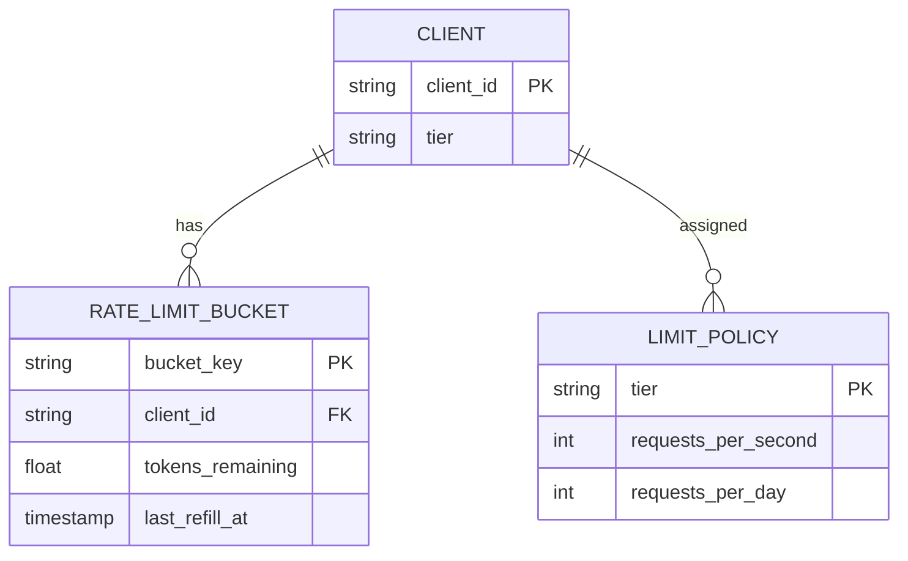
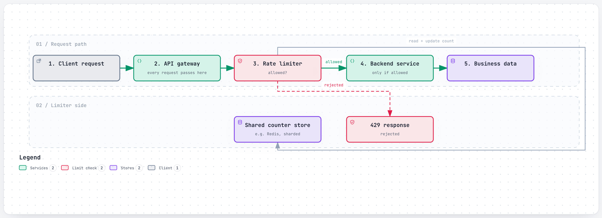
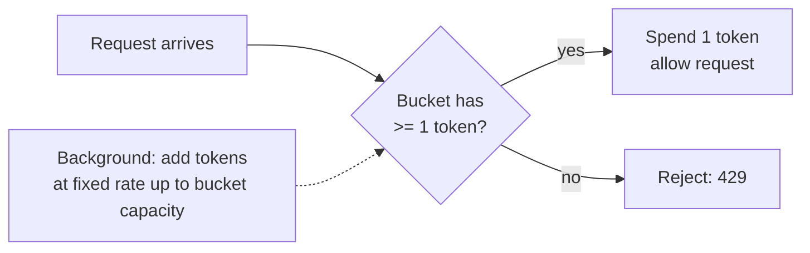

# Design a Rate Limiter

> The interviewer is testing whether you know rate limiting isn't one algorithm you memorize, it's a
> trade-off between accuracy, memory, and how gracefully the limiter itself fails. The real signal is
> whether you can explain *why* a sliding window costs more than a token bucket, whether your limiter
> works when it's not one server but a fleet of them, and what happens to the whole system the moment
> the limiter's own dependency (usually Redis) goes down.

## 1. Clarify requirements

Questions worth asking:

- Rate limit **per what**? Per user, per API key, per IP address, per endpoint, some combination?
- Is this a **single server** or a **distributed fleet** of API servers that all need to agree on one
  limit? (Almost always the latter in a real interview — say so if the interviewer doesn't specify.)
- What happens when a client is limited — hard reject (`429`), or queue and delay?
- Does the limiter need to expose *why* a request was rejected (which specific limit was hit), or is a
  bare `429` enough?
- Is strict accuracy required, or is "approximately N requests per window, occasionally a few over"
  acceptable in exchange for much cheaper memory and coordination?
- Single limit, or **layered limits** (a per-second burst limit stacked on top of a per-day quota)?

**Functional requirements:**

- Accept or reject a request based on how many that caller has already made in a given window.
- Support configurable limits per client/tier (a free-tier user and an enterprise account shouldn't
  share the same limit).
- Return a clear signal to the client (status code + headers) about the limit and when it resets.

**Non-functional requirements:**

- **Low added latency** — the limiter sits in front of every request, so it must add single-digit
  milliseconds, not tens.
- **Correctness under a distributed fleet** — many API servers must share one view of "how many
  requests has this client made," not each enforce their own independent, smaller limit.
- **Fail open, not closed** — if the limiter's own storage is unreachable, the system should keep
  serving requests rather than reject all traffic because the safety mechanism broke. (This is the
  single most commonly missed requirement — see [section 8](#8-how-real-companies-did-it).)
- **Low memory footprint per client**, since the number of distinct clients (API keys, IPs) can be in
  the tens of millions.

## 2. Back-of-the-envelope estimates

**Assumption:** an API platform serving 500,000 active API keys, averaging 10 requests/sec each at
peak, spread unevenly (a small number of high-volume keys, a long tail of low-volume ones).

- Total peak request volume = 500,000 keys × 10 req/sec ≈ **5,000,000 req/sec** in aggregate across the
  whole platform (this is the traffic the *rest* of the system has to handle — the limiter itself only
  needs to answer a yes/no per request, cheaply).
- **Assumption:** each rate-limit check is a single round trip to a shared store (e.g. Redis) that
  takes ~1 ms. At 5,000,000 checks/sec, that's 5,000,000 ms of total wait time per second, which only
  works if it's spread across a very large number of parallel connections/shards — a single Redis
  instance tops out far below this, which is exactly why the store itself has to be sharded (see
  [section 6.3](#63-scaling-the-store-itself)).

**Memory per client:** a fixed-window or token-bucket counter needs roughly:

- Client key (API key or IP, ~20 bytes) + counter (8 bytes) + timestamp (8 bytes) ≈ **~40 bytes/client**
  for the simplest algorithms.
- A sliding-window-log approach (storing every request's timestamp, not just a count) instead needs
  **~16 bytes per *request*, per client**, not per client — at 10 req/sec sustained per key, that's 160
  bytes/sec/key just for the log, and it has to be pruned continuously. This is the concrete reason
  sliding-window-log is usually rejected in interviews above trivial scale, in favor of an
  approximation like the sliding-window *counter* (6.1).

- Total memory, simple counters: 500,000 clients × 40 bytes ≈ **20 MB** — trivially cacheable in memory
  on a single Redis node, if a single node were the design (it isn't, once sharded — see 6.3).

## 3. API design

The rate limiter is usually not a public-facing API of its own — it's a library or a sidecar/gateway
component every service calls before doing real work. Its own interface is small:

```
check_and_increment(key: string, limit: int, window_seconds: int) -> RateLimitResult

RateLimitResult {
  allowed: bool
  remaining: int
  reset_at: timestamp
  limit: int
}
```

Exposed to the actual API client through response headers on every request, allowed or not:

```
HTTP/1.1 200 OK
X-RateLimit-Limit: 100
X-RateLimit-Remaining: 37
X-RateLimit-Reset: 1758999999
```

```
HTTP/1.1 429 Too Many Requests
X-RateLimit-Limit: 100
X-RateLimit-Remaining: 0
X-RateLimit-Reset: 1758999999
Retry-After: 42
```

Returning the *specific* limit and remaining count (rather than a bare `429`) is what lets a
well-behaved client back off correctly instead of guessing — this is a small design choice that's easy
to forget and worth calling out unprompted in an interview.

## 4. Data model

The rate limiter's "data model" is really a small amount of per-key counter state, not a relational
schema — but it's worth drawing to show what actually gets stored:



**Why these keys:** `bucket_key` is a composite of `client_id` plus which limit it tracks (e.g.
`user:42:per-second` vs `user:42:per-day`) because a single client is very often checked against
**multiple** limits at once (see 6.4), each with its own independent bucket and reset clock.
`LIMIT_POLICY` is keyed by `tier`, not by individual client, because limits are almost always assigned
per pricing tier or role, not hand-configured per user — looking a client's tier up once and reusing
the policy avoids duplicating limit values across millions of client rows.

In practice this "table" lives in an in-memory store (Redis) with a TTL, not a durable database — a
lost rate-limit counter is a minor, self-healing problem (the client just gets a fresh window), so it
doesn't need replication or durability guarantees anywhere near what user data needs.

## 5. High-level design

<a href="https://alwintwk.github.io/big-tech-system-design/diagrams/problems-rate-limiter-request.html">
  <picture>
    <source media="(prefers-color-scheme: dark)" srcset="../diagrams/problems-rate-limiter-request.dark.png">
    
  </picture>
</a>


<sub>Click the diagram for the interactive version (zoom, dark mode, trace a path).</sub>

Walkthrough:

1. Every request passes through an **API gateway**, which is the natural place to put a rate limiter —
   one shared checkpoint in front of every backend service, instead of each service reimplementing its
   own limiting logic.
2. The gateway asks the limiter "is this client under their limit," which reads and atomically
   increments a counter in a **shared store** — shared, because if each gateway instance kept its own
   local counter, a client behind a load balancer with 10 gateway instances could get 10x their real
   limit just by chance of which instance each request lands on.
3. Allowed requests proceed to the backend; rejected ones short-circuit with a `429` before ever
   reaching business logic — the whole point is to protect the backend from doing real work for
   traffic that shouldn't be served.
4. The store itself needs to be fast (single-digit-millisecond) and, per the fail-open requirement, its
   own unavailability must not become the whole platform's unavailability (see 6.2).

## 6. Deep dives

### 6.1 Which algorithm, and why

| Algorithm | How it works | Memory | Weakness |
|---|---|---|---|
| Fixed window counter | Increment a counter per fixed time bucket (e.g. per calendar minute), reset at boundary | ~1 counter/client | Boundary burst: a client can send the full limit at 0:59 and again at 1:00, 2x the limit in 2 seconds |
| Sliding window log | Store a timestamp per request, count how many fall in the trailing window | ~1 entry per request | Accurate, but memory grows with request volume, not client count |
| Sliding window counter | Weighted average of current + previous fixed window, approximating a sliding window | ~1-2 counters/client | Approximation, not exact — acceptable in nearly every real system |
| Token bucket | Bucket holds tokens, refills at a steady rate, each request spends one; empty bucket = reject | ~2 fields/client (tokens, last-refill time) | Allows short bursts up to bucket size, which is often a *feature*, not a bug |
| Leaky bucket | Requests queue into a bucket that drains (processes) at a fixed rate | ~1 queue/client | Smooths bursts into a steady rate, but adds queueing latency instead of instant reject |

**Token bucket is the default answer** in most interviews and most real systems (see Stripe's request
rate limiter in [section 8](#8-how-real-companies-did-it)) because it naturally allows short bursts —
which is what real client behavior actually looks like — while still enforcing a steady-state average
rate, and it only needs two numbers per client.



### 6.2 Fail open: the limiter's own outage must not become everyone's outage

If the shared counter store (Redis) is unreachable, there are exactly two choices, and only one of them
is usually correct:

- **Fail closed**: reject every request when the limiter can't be checked. This turns "Redis had a
  30-second blip" into "the entire API was down for 30 seconds" — the safety mechanism becomes the
  outage.
- **Fail open**: if the limiter can't be checked, let the request through unchecked. This risks a
  short window of unlimited traffic during the outage, which is almost always the smaller risk — a
  brief spike is recoverable; an outage caused by your own guardrail is embarrassing and avoidable.

Real systems (see Stripe, section 8) explicitly choose fail-open for exactly this reason. The one
caveat worth stating in an interview: fail-open only makes sense if the *backend itself* has some
other protection against being overwhelmed (autoscaling, its own circuit breakers) — otherwise you've
just moved the single point of failure one layer deeper instead of removing it.

### 6.3 Scaling the store itself

A single Redis instance answering 5,000,000 checks/sec (our peak estimate) is not realistic — real
systems shard the counter store the same way they'd shard any other high-QPS key-value workload, using
consistent hashing on the client key so each client's counter always lands on the same shard (see
[`../concepts/consistent-hashing.md`](../concepts/consistent-hashing.md)). This has a subtle
consequence: if a rate-limit shard becomes unavailable, only the clients whose keys hash to that shard
are affected, not the whole platform — which is a strictly better failure mode than one shared,
unsharded store.

### 6.4 Layered limits, not one limit

A single global "N requests/sec per key" rejects the wrong things: it can't distinguish a caller
sending a steady stream of huge, expensive requests from one sending a burst of cheap ones, and it
offers no way to protect a specific hot endpoint separately from the platform as a whole. The fix is
running **several independent limiters together** — a per-second burst limiter, a per-day quota, a
concurrent-in-flight-requests cap, and sometimes a load-shedding layer that only activates during an
actual incident. Each one catches a different failure mode a single limiter would miss; see Stripe's
four-layer design in [section 8](#8-how-real-companies-did-it) for the concrete version of this that a
real payments API runs in production.

## 7. Bottlenecks and failure modes

- **Boundary bursts on fixed-window counters** (6.1) — a client can legally send 2x the intended limit
  across a window boundary. Mitigate with a sliding-window counter or token bucket instead.
- **The shared store becomes the bottleneck.** Every single request now depends on an extra network
  round trip to a shared, low-latency store; if that store isn't sharded, it caps the whole platform's
  throughput at whatever one instance can do. See 6.3.
- **The limiter's own outage cascading into a platform outage** if it fails closed instead of open. See
  6.2.
- **Clock skew across servers** for any algorithm relying on wall-clock windows — if different gateway
  instances disagree on "what time is it," window boundaries (and therefore limits) become
  inconsistent between them. Token buckets are more forgiving here since they only care about elapsed
  time since last refill, not absolute wall-clock alignment.
- **Thundering herd at a quota reset.** If a hard daily quota resets for millions of clients at exactly
  midnight UTC, every client that was previously blocked can retry at the same instant — staggering
  resets per-client (based on when their window actually started, not a shared wall-clock boundary)
  avoids this.
- **One noisy client vs. a real incident look identical from inside the limiter** unless it's layered
  (6.4) — a single limit can't tell "one bad actor" from "we're degraded and need to protect critical
  traffic specifically."

## 8. How real companies did it

- **Stripe runs four separate, layered rate limiters**, not one: a per-account/per-API-key **token
  bucket** (the workhorse, catching sustained overuse — 100 requests/sec in live mode, 25/sec in
  sandbox, with tighter limits on specific endpoints like Payment Intents updates), a **concurrent
  requests limiter** (catching a caller tying up resources with a handful of slow requests that each
  individually stay under the rate limit), a **fleet usage load shedder** (reserving a fixed slice of
  total infrastructure capacity specifically for critical requests), and a **worker utilization load
  shedder** (the last line of defense during an actual incident, which sheds low-priority traffic
  tiers progressively as available workers get scarce). See
  [Stripe: layered rate limiting](../companies/stripe.md#4-layered-rate-limiting) and the
  [rate limiting deep dive](../companies/stripe.md#rate-limiting).
- Stripe's limiters are explicitly designed to **fail open** — if the limiter's own dependency (Redis)
  is unreachable, the API keeps serving requests rather than rejecting all traffic because the safety
  mechanism itself broke — and new or changed limits are **dark-launched** (evaluated against real
  traffic and logged, but not enforced) before they're ever allowed to actually reject a request. Same
  source as above.
- Every `429` Stripe returns carries a header naming exactly which of the four layers was tripped
  (`global-rate`, `endpoint-rate`, `global-concurrency`, `endpoint-concurrency`, or
  `resource-specific`) — a deliberately debuggable design, matching the API design choice in
  [section 3](#3-api-design) to expose *which* limit was hit, not just that one was.

Relevant concepts: [rate limiting](../concepts/rate-limiting.md),
[consistent hashing](../concepts/consistent-hashing.md), [caching](../concepts/caching.md),
[load balancing](../concepts/load-balancing.md).

## 9. What a strong answer sounds like

- I'd clarify what we're limiting by (user, API key, or IP), whether this runs across a fleet of
  servers that need a shared view, and whether we need layered limits or just one.
- Token bucket is my default algorithm: it allows short, legitimate bursts while still enforcing a
  steady average rate, and only needs two numbers per client — that's a strong contrast with
  sliding-window-log, whose memory grows with request volume, not client count.
- Because this runs across many gateway instances, the counter has to live in a shared, fast store
  (Redis), sharded by client key with consistent hashing so one hot client's counter doesn't overload
  a single shard, and so a shard outage only affects the clients hashed to it.
- The most commonly missed requirement is fail-open: if the counter store itself is unreachable, the
  system should let requests through rather than reject everything, because a rate limiter that causes
  an outage is worse than one that occasionally under-enforces for a few seconds.
- A single global limit isn't enough in practice — I'd layer at least a per-second burst limit with a
  longer-window quota, the way Stripe runs four separate limiters that each catch a different failure
  mode.
- I'd expose the limit, remaining count, and reset time in response headers, not just a bare 429, so
  well-behaved clients can back off correctly instead of guessing.
- Clock skew and window-boundary bursts are the two correctness bugs I'd specifically watch for with
  any wall-clock-based algorithm.
- Memory footprint stays small — tens of megabytes even at hundreds of thousands of active clients —
  because the whole design intentionally avoids storing per-request logs.

## Common mistakes

- Reaching for sliding-window-log as the default answer without noticing its memory scales with
  request volume, not client count — fine for a small system, expensive at real scale.
- Designing the limiter as if it runs on one server, then not addressing what happens once there are
  10 gateway instances behind a load balancer, each with their own local counter.
- Failing closed by default and only realizing under interviewer pressure that a limiter outage
  shouldn't become a full platform outage.
- Treating "rate limiting" as one algorithm instead of a layered defense — missing that a per-second
  burst limit and a per-day quota solve different problems and should coexist.
- Forgetting to expose *why* a request was rejected (which limit, when it resets) — a bare 429 with no
  headers is a worse API than one with `X-RateLimit-*` headers.
- Ignoring clock skew and window-boundary effects entirely, or assuming all servers' clocks are
  perfectly synchronized.
- Not distinguishing "reject" from "queue/delay" as two entirely different product decisions with
  different latency implications — a leaky bucket implies queueing, a token bucket implies instant
  reject, and conflating them muddies the design.
