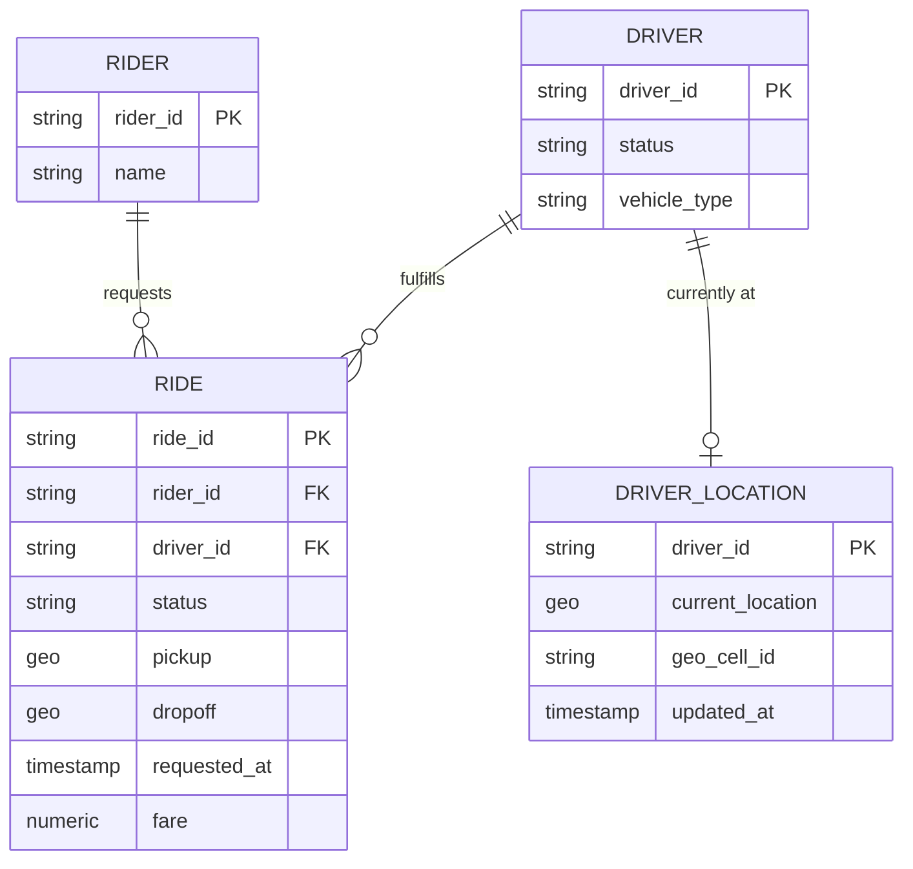
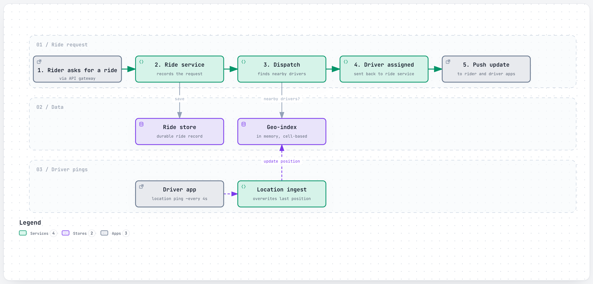
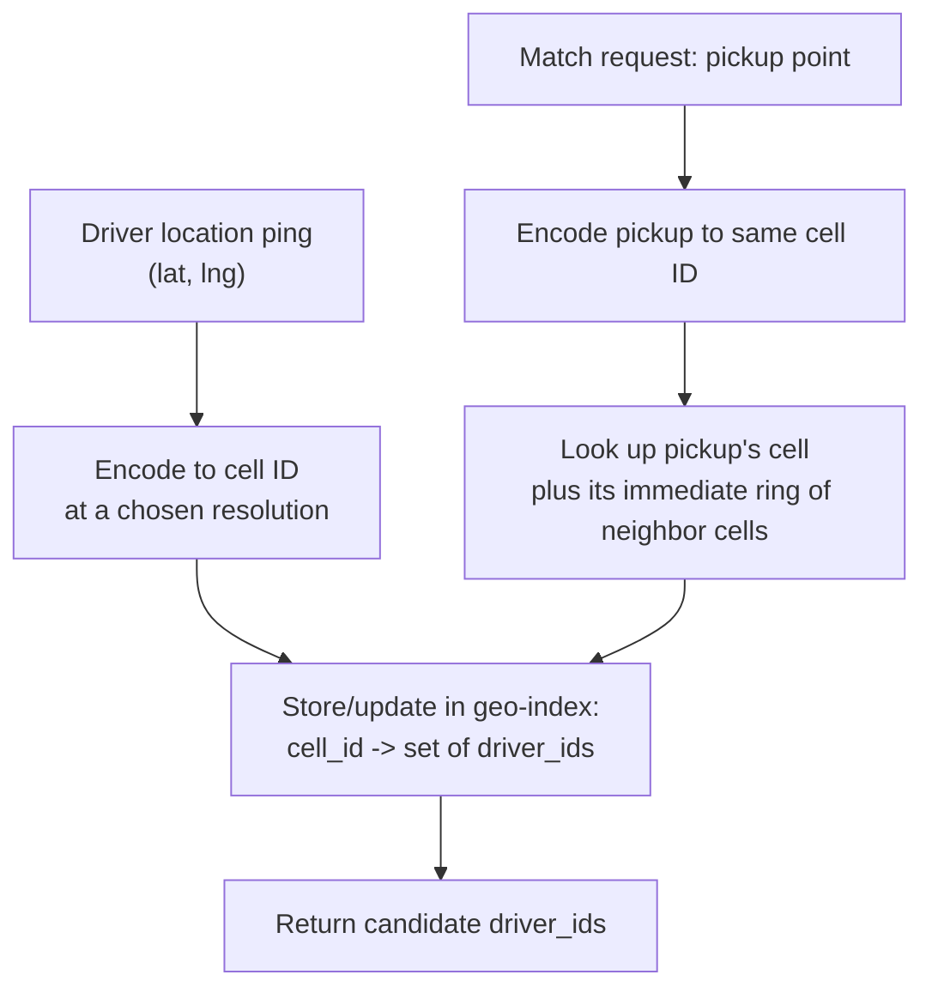
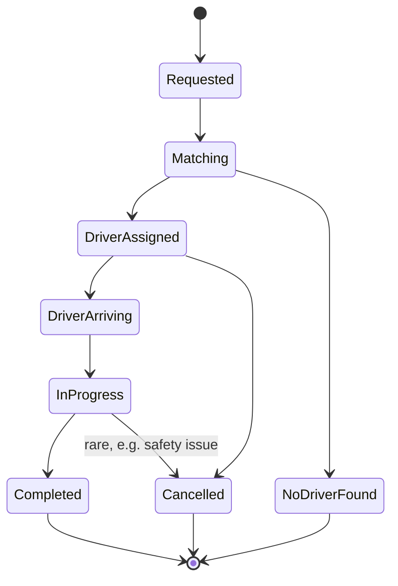

# Design a Ride-Hailing Service

> The interviewer is testing whether you can design a system where **both sides of the match are
> constantly moving**, at a write volume most candidates underestimate until they do the math out
> loud. The two hard problems are: how do you index location so "find nearby drivers" is a cheap
> lookup instead of a table scan, and how do you match riders to drivers in a way that's actually good
> for the whole system, not just "assign whoever's closest" — which turns out to be the wrong answer.

## 1. Clarify requirements

Questions worth asking:

- **Matching goal**: closest available driver, or something that optimizes overall efficiency (fewer
  total empty miles driven, fair wait times across a whole area)? These are different algorithms.
- **How often does a driver's location update**, and does the design need to support surge pricing,
  which needs the same location data?
- **What happens mid-trip if the network drops** — does the trip need to survive a driver's phone
  losing connectivity for 30 seconds?
- Is this **strictly nearest-driver matching**, or a **batched/optimized matching window** (collect
  requests and drivers over a short window, solve the assignment problem together)?
- Do we need to support **multiple ride types** (economy, pooled, premium) matched against different
  driver pools in the same area?

**Functional requirements:**

- Rider requests a trip from pickup to destination.
- System matches the rider to a nearby available driver.
- Both parties can track the trip's live location until it ends.
- Fare is calculated and the trip is recorded.

**Non-functional requirements:**

- **Low matching latency** — a rider should get matched within a few seconds of requesting.
- **High write throughput on location updates** — every active driver's phone reports position
  continuously; this is the dominant traffic pattern in the whole system, not the ride request itself.
- **Availability over strict consistency for location data** — a slightly stale driver position is
  fine; a matching system that's down because of a consistency dispute is not.
- **Durability of trip state** — a trip in progress must survive a single service or datacenter
  failure without losing track of an actively-happening, real-world ride.

## 2. Back-of-the-envelope estimates

**Driver location updates — assumption:** 5 million active drivers at peak, each reporting location
every 4 seconds.

- Updates/sec = 5,000,000 / 4 ≈ **~1,250,000 location updates/sec** — this is already a peak-representative
  number, since it's driven by a constant per-driver interval, not a time-of-day multiplier. This is
  the single largest number in this whole design, and it has to shape the architecture from the start:
  no design that puts this on a normal relational database's write path survives contact with this
  number.

**Ride requests — assumption:** 25 million rides/day globally.

- Average QPS = 25,000,000 / 86,400 ≈ **~289 requests/sec**
- **Assumption:** 3x peak factor (evening rush) → peak ≈ **~867 requests/sec**

This gap — ~1.25M location writes/sec vs. ~867 ride requests/sec — is the key insight the estimate is
supposed to surface: **the bottleneck in this system is location ingestion, not ride matching.** The
matching algorithm can afford to be relatively expensive per-request; the location pipeline cannot
afford to be expensive per-update.

**Matching compute — assumption:** each ride request is matched against roughly 50 nearby candidate
drivers pulled from the geo-index.

- Peak candidate evaluations/sec ≈ 867 × 50 ≈ **~43,350/sec** — small compared to the location-update
  volume, confirming matching computation itself isn't the bottleneck.

**Storage per trip — assumption:** rider ID, driver ID, origin/destination coordinates, timestamps, and
fare ≈ **~300 bytes/trip**.

- Storage/day = 25,000,000 × 300 bytes ≈ **~7.5 GB/day**
- Storage/year ≈ 7.5 GB × 365 ≈ **~2.7 TB/year** — trivially small. Trip records are not the scaling
  challenge here either; location update *throughput*, not any dataset's *size*, is what this design
  has to be built around.

**Location data is largely ephemeral, by design** — a driver's position from 10 minutes ago has no
product value once a newer one exists, so it lives in a fast, in-memory geo-index (see
[6.1](#61-geo-indexing-finding-nearby-drivers-cheaply)), not a durably-stored, ever-growing table.

## 3. API design

```
POST /api/v1/rides
{ "rider_id": "r_42", "pickup": {"lat": 3.14, "lng": 101.68}, "dropoff": {"lat": 3.20, "lng": 101.72} }

202 Accepted
{ "ride_id": "ride_9931", "status": "matching" }
```

```
GET /api/v1/rides/{ride_id}

200 OK
{
  "ride_id": "ride_9931",
  "status": "driver_assigned",
  "driver_id": "d_501",
  "driver_location": {"lat": 3.145, "lng": 101.681},
  "eta_seconds": 180
}
```

```
// driver's phone, high-frequency, over a persistent connection (not plain REST at this volume)
{ "type": "location_update", "driver_id": "d_501", "lat": 3.145, "lng": 101.681, "timestamp": "..." }
```

```
POST /api/v1/rides/{ride_id}/cancel
204 No Content
```

The ride-request endpoint returns `202 Accepted` immediately with a `matching` status, not a blocking
`201 Created` with a driver already attached — matching takes a real, if short, amount of time, and the
client polls or subscribes (via a persistent connection, same as [chat app](chat-app.md)) for the
status transition rather than the request hanging open until a driver is found.

## 4. Data model



**Why these keys:** `DRIVER_LOCATION` is keyed by `driver_id` but *indexed* by `geo_cell_id` (a geo-grid
cell identifier, see 6.1) — the dominant query is never "where is this specific driver," it's "which
drivers are in or near this geographic cell," so the index that matters most is on the cell, not the
driver ID. `RIDE` carries a denormalized `status` field (rather than only being derivable from a
separate event log) because the mobile clients on both ends need to render current trip state from a
single cheap read, repeatedly, for the whole trip duration. `DRIVER_LOCATION` is effectively a single
mutable row per driver, overwritten on every update, not an append-only history table — the durable
trip and fare records live in `RIDE`; location is a live, disposable value.

## 5. High-level design

<a href="https://alwintwk.github.io/big-tech-system-design/diagrams/problems-ride-hailing-match.html">
  <picture>
    <source media="(prefers-color-scheme: dark)" srcset="../diagrams/problems-ride-hailing-match.dark.png">
    
  </picture>
</a>


<sub>Click the diagram for the interactive version (zoom, dark mode, trace a path).</sub>

Walkthrough:

1. **Driver location pings** flow continuously into a dedicated **location ingest service** — kept
   entirely separate from the ride-request path, since it's the higher-volume, latency-tolerant stream
   (a few seconds of staleness on a driver's position is fine) versus the lower-volume, latency-
   sensitive one (a rider waiting to be matched).
2. Ingest writes each driver's current position into an **in-memory geo-index**, keyed by grid cell —
   see [6.1](#61-geo-indexing-finding-nearby-drivers-cheaply) — overwriting that driver's previous
   position, not appending to history.
3. A ride request goes through the **ride service**, which durably records the request and hands
   matching to a **dispatch service**.
4. Dispatch queries the geo-index for nearby, available drivers around the pickup point and runs the
   matching algorithm (see [6.2](#62-matching-nearest-driver-isnt-always-the-right-answer)) to pick one.
5. Once matched, both rider and driver apps are notified over a **persistent connection** (the same
   pattern as [chat app](chat-app.md#5-high-level-design)) rather than polling, and the trip proceeds
   through a state machine (see [6.4](#64-trip-state-machine)) tracked in the ride store.

## 6. Deep dives

### 6.1 Geo-indexing: finding nearby drivers cheaply

"Find every driver within roughly 2km of this point" cannot be a scan over every driver's raw
lat/lng coordinates at this update volume. The standard technique is a **grid-based geo-index**:
divide the map into cells (commonly hexagonal, since a hexagon has one consistent distance to every
neighboring cell — a square has two, edge-adjacent and corner-adjacent, which complicates "how many
rings of neighbors do I need to check"), assign every coordinate to a cell ID, and index drivers by
which cell they're currently in.



Finding "nearby" then becomes: encode the pickup point to a cell ID, look up drivers in that cell plus
a small ring of neighboring cells, and expand the ring only if too few candidates are found — a cheap,
bounded lookup instead of scanning every driver on the map. Resolution (how large each cell is) is a
tunable trade-off: finer cells give more precise candidate sets but need more rings checked in sparse
areas; coarser cells need fewer lookups but return more, less-relevant candidates per query.

### 6.2 Matching: nearest driver isn't always the right answer

Naive "assign the single closest available driver, the instant a request arrives" has two real
problems at scale: it can't consider a driver who's a minute from finishing their current trip nearby
(a strictly better match than a farther genuinely-idle driver), and matching one request at a time,
greedily, doesn't account for the *other* requests arriving in the same few seconds — greedily giving
request A its nearest driver can leave request B, arriving moments later, with a much worse match than
if the two had been considered together.

The more robust approach: collect a short window of open requests and candidate drivers (idle and
soon-to-be-idle) and solve the assignment across the whole batch at once, rather than reacting to each
request the instant it lands — trading a small amount of added latency (the batch window) for
meaningfully better matches across the system as a whole.

### 6.3 Location ingestion at ~1.25M writes/sec

At this volume, the ingestion path itself needs to be designed for throughput first: writes are
**overwrites of a single current-position record per driver**, not an append-only log, which keeps the
per-driver storage bounded regardless of how long they've been driving that day. The geo-index is kept
in memory (not a disk-backed database) specifically because it's read on every single matching
request and written on every single location ping — the highest-frequency read/write path in the
whole system needs the lowest possible per-operation latency, and durability of any *individual* stale
position is simply not valuable enough to pay disk-write cost for.

### 6.4 Trip state machine



Every transition is written to the durable ride store, not just held in an in-memory service's state —
if the dispatch or matching service crashes mid-trip, the trip's current state must be recoverable from
storage by whichever service picks the work back up, since an actively-happening real-world ride cannot
simply be lost because a server restarted.

## 7. Bottlenecks and failure modes

- **A hot geo-cell** — a stadium letting out, a large event ending — creates a sudden, extreme spike of
  both riders requesting and drivers clustering in one small area. The geo-index needs to handle a
  single cell (or a few adjacent ones) receiving disproportionate read/write volume, the same hot-key
  problem covered generally in [`../concepts/consistent-hashing.md`](../concepts/consistent-hashing.md).
- **Location ingest service falling behind** under peak load degrades match quality gracefully (slightly
  stale positions), rather than failing outright — a deliberate design choice given the huge sustained
  write volume this path carries.
- **Dispatch/matching service failure mid-batch** must not silently drop in-flight requests — batched
  requests need to be safely re-queued and retried, not lost, if the worker processing that batch dies.
- **A driver's connection drops mid-trip.** The trip state machine (6.4) must tolerate a period of no
  location updates without cancelling an in-progress trip — the design needs an explicit "assume still
  in progress until an explicit end or a long timeout" rule, not "no update in 10 seconds = trip over."
- **Datacenter failure mid-trip** — an active trip's state has to be resolvable from durable storage
  that survives the failure of whichever single datacenter was handling that trip, not held only in one
  service instance's memory.
- **Surge conditions** (more requests than available drivers in an area) need a defined behavior —
  surge pricing, longer waits, or explicit "no driver found" — rather than an undefined degradation of
  match quality with no signal to the rider about why.

## 8. How real companies did it

- **Uber built H3**, an open-source system dividing the Earth's surface into hexagonal cells across 16
  zoom levels, so any GPS point converts into a compact cell ID comparable cheaply against neighboring
  cells. Uber chose hexagons specifically because a square grid (like Google's S2) has two different
  neighbor distances (edge-adjacent vs. corner-adjacent), which complicates the "how many rings of
  neighbors do I need to check" calculation used across dispatch, surge pricing, and demand analysis.
  See [Uber: H3, the hexagonal geo-index](../companies/uber.md#h3-the-hexagonal-geo-index).
- **Uber's dispatch system (nicknamed DISCO in a third-party account of an Uber talk, not Uber's own
  published terminology)** moved away from an early design that only matched a request against drivers
  idle *right now* in that request's city-sharded system — which couldn't consider a driver about to
  finish a nearby trip, and created uneven load as city-level traffic patterns diverged. DISCO instead
  collects a window of open requests and candidate drivers (idle and soon-to-be-idle) and solves them
  together, matching the batched-matching approach in
  [6.2](#62-matching-nearest-driver-isnt-always-the-right-answer). See
  [Uber: DISCO, the dispatch optimizer](../companies/uber.md#disco-the-dispatch-optimizer).

Relevant concepts: [geo-indexing](../concepts/geo-indexing.md),
[load balancing](../concepts/load-balancing.md),
[persistent connections](../concepts/persistent-connections.md),
[message queues and logs](../concepts/message-queues-and-logs.md).

## 9. What a strong answer sounds like

- The dominant traffic in this system isn't ride requests, it's driver location updates — at an assumed
  5M active drivers pinging every 4 seconds, that's ~1.25M writes/sec, versus only ~867 ride requests/
  sec at peak. The architecture has to be built around that gap.
- Location data needs a geo-index, not a relational table scan — I'd bucket the map into cells (hex,
  like Uber's H3, to avoid the two-distinct-neighbor-distance problem a square grid has) and index
  drivers by cell, so "find nearby drivers" is a lookup of one cell plus a small ring of neighbors.
- Location pings overwrite a single current-position record per driver and live in memory — this data
  is disposable and latency-critical, not something that needs disk durability or history.
- Matching shouldn't be purely greedy, nearest-driver-wins per request — batching a short window of
  requests and drivers together and solving the assignment jointly gives meaningfully better overall
  matches, the same shape as Uber's DISCO.
- The ride-request and location-update paths are architecturally separate services with very different
  throughput and latency profiles, and should scale independently.
- Trip state has to be durably persisted at every transition, not held only in a service's memory,
  because losing track of an actively-happening real-world ride is unacceptable, even across a service
  or datacenter failure.
- I'd favor availability over strict consistency for location data specifically — a few seconds of
  staleness is an acceptable trade for a system that never goes down because of a location-consistency
  dispute.
- Storage volume itself (trips, not location) is small — a few terabytes a year — this problem is about
  write throughput and matching quality, not data size.

## Common mistakes

- Designing the location-update path as if it goes through the same relational database and the same
  request path as a normal ride request, without noticing its volume is 1,000x higher.
- Proposing "just index by lat/lng in a normal database" without a grid/cell scheme, then discovering
  under interviewer pressure that "find nearby" isn't an efficient query on raw coordinates.
- Matching greedily, one request at a time, without considering that two requests arriving moments
  apart can interact — assigning the first request's nearest driver can leave the second with a much
  worse match than a joint assignment would have.
- Forgetting that a driver about to finish a nearby trip is a valid, often better, match than a
  currently-idle but farther driver.
- Treating a dropped connection mid-trip as equivalent to the trip ending, instead of designing an
  explicit tolerance window.
- Storing every location ping as an append-only history record, ballooning storage for data that has
  no product value once superseded.
- Not addressing what happens when there simply aren't enough nearby drivers (surge conditions) at all.
