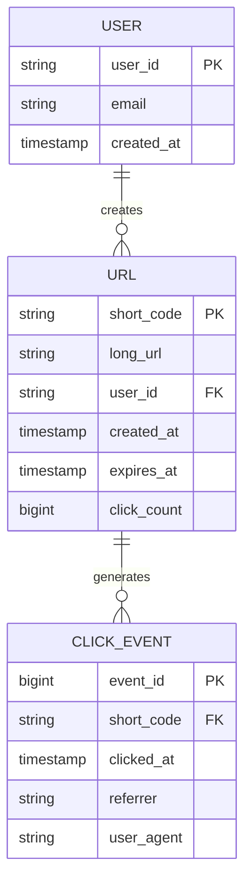
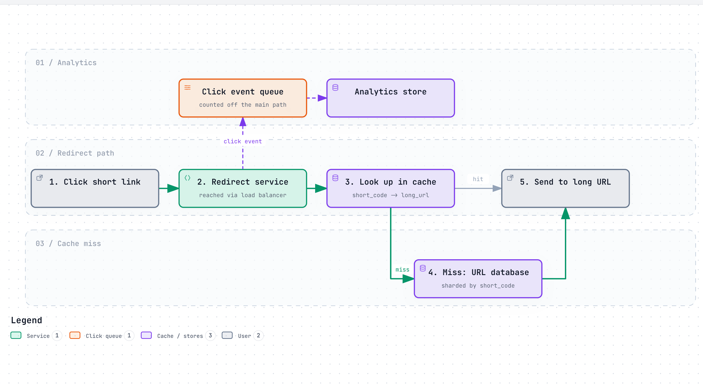
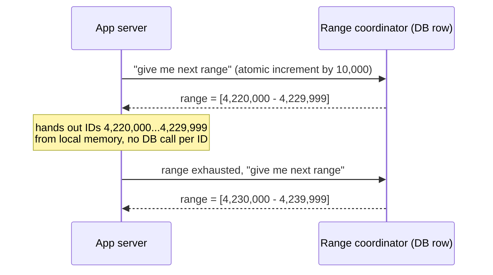

# Design a URL Shortener

> The interviewer is testing whether you can turn a deceptively simple prompt into a real distributed
> systems problem: unique ID generation without a single point of contention, a read path that has to
> survive a link going viral, and honest trade-offs between consistency and availability on a redirect
> that runs billions of times a day. It is usually the first system design question a candidate ever
> gets, precisely because it is small enough to finish in 45 minutes but has every core building block
> hiding inside it.

## 1. Clarify requirements

Questions worth asking out loud before you design anything:

- Do short codes need to be **guessable-resistant** (no sequential IDs an attacker can enumerate), or is
  that out of scope?
- Can users pick a **custom alias** (`bit.ly/my-brand`), or is every code system-generated?
- Do links **expire**, and if so, is expiry set per-link or a global default?
- Do we need **click analytics** (count, referrer, geography), or just the redirect itself?
- Is a **302 (temporary) or 301 (permanent) redirect** the right choice? This one has a real trade-off:
  301 lets browsers cache the redirect and skip our servers on repeat visits, which is cheaper for us,
  but it also means we lose the ability to change or track that redirect later, and it makes analytics
  undercount repeat clicks.
- Roughly how many URLs get created a day, and what's the read:write ratio? (If the interviewer doesn't
  know, say so and pick a number yourself, out loud, as an assumption.)

**Functional requirements:**

- Given a long URL, return a short one.
- Given a short URL, redirect to the original long URL.
- Support optional custom aliases.
- Support optional expiration.
- Track click counts (basic analytics).

**Non-functional requirements:**

- **High availability on the redirect path.** A shortener that is down is worse than useless — every
  link ever shared through it breaks at once. We favor availability over strict consistency here (see
  [`../concepts/cap-and-consistency.md`](../concepts/cap-and-consistency.md)).
- **Low redirect latency** (low tens of milliseconds), since a redirect sits on the critical path of
  someone else's link click, often on a slow mobile connection.
- **Uniqueness**: two different long URLs must never resolve from the same short code.
- **Read-heavy**: reads (redirects) vastly outnumber writes (link creation) — assume 100:1 unless told
  otherwise.
- Strong consistency is *not* required for click counts — an eventually-consistent counter is fine.

## 2. Back-of-the-envelope estimates

State every assumption; the interviewer cares more about the reasoning than the exact number.

**Assumption:** 100 million new short URLs created per month.

- New URLs/day = 100,000,000 / 30 ≈ **3.33 million/day**
- Average write QPS = 3,330,000 / 86,400 seconds ≈ **39 writes/sec**
- **Assumption:** peak traffic runs 3x average (typical diurnal peak factor for a consumer product).
- Peak write QPS ≈ 39 × 3 ≈ **~117 writes/sec**

**Assumption:** read:write ratio of 100:1 (redirects vastly outnumber creations).

- Reads/day = 3,330,000 × 100 ≈ **333 million redirects/day**
- Average read QPS = 333,000,000 / 86,400 ≈ **~3,850 reads/sec**
- Peak read QPS ≈ 3,850 × 3 ≈ **~11,600 reads/sec**

This is the number that shapes the whole design: at nearly 12K reads/sec, hitting a database on every
redirect is not viable — the redirect path needs a cache in front of it, or it falls over.

**Storage per record — assumption:** average long URL 100 bytes, short code 7 bytes, plus metadata
(user ID, created_at, expires_at, click_count) ≈ 40 bytes. Call it **~150 bytes/record**.

- Storage/day = 3,330,000 × 150 bytes ≈ **~500 MB/day**
- Storage/year = 500 MB × 365 ≈ **~182 GB/year**
- **Assumption:** keep 5 years of data → ≈ **~910 GB**, comfortably under 1 TB. This is a small-data
  problem — the challenge here is throughput and latency, not capacity.

**Short code keyspace:** using base62 (`a-z`, `A-Z`, `0-9` = 62 characters) at length 7:

- 62^7 = **3,521,614,606,208** (~3.5 trillion) possible codes.
- Even at 3.33 million new URLs/day, that's 3.5 trillion / 3.33 million ≈ **~1 million days** (~2,900
  years) to exhaust the space at the current creation rate. 7 characters is enough headroom for
  decades of growth; 6 characters (62^6 ≈ 56.8 billion) would already be tight within a couple of
  decades at higher growth, so 7 is the safer default.

**Redirect bandwidth:** a redirect response has effectively no body — just a `Location` header — call
it ~500 bytes on the wire.

- Peak bandwidth = 11,600 reads/sec × 500 bytes ≈ **~5.8 MB/sec**, trivial by CDN or load balancer
  standards. Bandwidth is a non-issue for this system; QPS and latency are the real constraints.

## 3. API design

```
POST /api/v1/urls
{
  "long_url": "https://example.com/some/very/long/path?query=1",
  "custom_alias": "my-brand",       // optional
  "expires_at": "2027-01-01T00:00:00Z"  // optional
}

201 Created
{
  "short_code": "my-brand",
  "short_url": "https://sho.rt/my-brand",
  "long_url": "https://example.com/some/very/long/path?query=1",
  "expires_at": "2027-01-01T00:00:00Z",
  "created_at": "2026-09-27T10:00:00Z"
}

409 Conflict   // custom_alias already taken
```

```
GET /{short_code}

301 Moved Permanently  (or 302, see the trade-off in Requirements)
Location: https://example.com/some/very/long/path?query=1

404 Not Found          // unknown or expired code
410 Gone               // known code, but past expires_at
```

```
GET /api/v1/urls/{short_code}/stats

200 OK
{
  "short_code": "my-brand",
  "click_count": 48213,
  "created_at": "2026-09-27T10:00:00Z",
  "last_clicked_at": "2026-09-27T18:42:11Z"
}
```

```
DELETE /api/v1/urls/{short_code}

204 No Content
```

Creation and stats endpoints are authenticated (they touch a specific user's data and mutate state);
the redirect endpoint itself is public and unauthenticated by design — that's the whole product.

## 4. Data model



**Why these keys:**

- `short_code` is the primary key on `URL`, not an internal auto-increment ID — every lookup on the hot
  redirect path is "given this code, find this row," so the code itself should be the thing the
  database (and any cache in front of it) is indexed and sharded on. See
  [`../concepts/sharding.md`](../concepts/sharding.md).
- `click_count` is denormalized directly onto `URL` instead of always running `COUNT(*)` over
  `CLICK_EVENT`, because the stats endpoint needs to answer instantly and the exact count doesn't need
  to be perfectly real-time — an async counter increment (batched, or via a queue) is enough.
- `CLICK_EVENT` is a separate, append-only table (or a separate analytics store entirely) because it
  grows far faster than `URL` and has a completely different access pattern (write-heavy, batch-read
  for analytics) — mixing it into the hot `URL` table would drag down the one table every redirect
  depends on.
- `user_id` is a foreign key, not embedded, because a user's URLs need to be listed and paginated
  independently of any single redirect lookup.

## 5. High-level design

<a href="https://alwintwk.github.io/big-tech-system-design/diagrams/problems-url-shortener-redirect.html">
  <picture>
    <source media="(prefers-color-scheme: dark)" srcset="../diagrams/problems-url-shortener-redirect.dark.png">
    
  </picture>
</a>


<sub>Click the diagram for the interactive version (zoom, dark mode, trace a path).</sub>

Walkthrough:

1. **Write path**: a client `POST`s a long URL. The write service asks the **ID generator** for a
   unique code (or validates a requested custom alias is free), writes the `(short_code, long_url)`
   row to the sharded database, and returns the short URL. This path is low-QPS (~117/sec peak from
   our estimate) and can afford a real database write.
2. **Read path**: a client hits `GET /{short_code}`. The redirect service checks a cache first (Redis
   or Memcached — see [`../concepts/caching.md`](../concepts/caching.md)); on a hit, it redirects
   immediately without touching the database at all. This is the path that has to survive ~11,600
   QPS at peak, so the cache is not an optimization here, it's load-bearing.
3. On a **cache miss**, the redirect service reads the database, redirects, and populates the cache for
   next time (cache-aside pattern).
4. The click itself is logged **asynchronously** onto a queue (see
   [`../concepts/message-queues-and-logs.md`](../concepts/message-queues-and-logs.md)) rather than
   written synchronously before the redirect fires — the user should never wait on analytics writes to
   get redirected.
5. A **load balancer** in front of everything spreads traffic across many stateless write/read service
   instances (see [`../concepts/load-balancing.md`](../concepts/load-balancing.md)); both services can
   be scaled independently since their traffic shapes are so different.

## 6. Deep dives

### 6.1 Generating unique short codes without a bottleneck

The naive approach — "hash the long URL" — has a real problem: hashes collide, two different users can
shorten the same long URL and should arguably get different codes (or not, that's a product decision),
and a hash gives you no control over code length or character set. The three real options:

| Approach | How it works | Problem |
|---|---|---|
| Random generation + collision check | Generate 7 random base62 chars, check DB, retry on collision | Extra round-trip on every collision; collision rate climbs as the keyspace fills |
| Hash + truncate | MD5/SHA the long URL, take first 7 chars | Collisions on truncation; same input always gives same code (sometimes wanted, sometimes not) |
| Counter + base62 encode | A monotonically increasing integer, encoded to base62 | The counter itself is a single point of contention if naively implemented |

The counter approach is the one worth defending in an interview, **if** you address the contention
problem: don't have every write service instance hit one shared `AUTO_INCREMENT` column. Instead, each
service instance periodically checks out a **range** of IDs (e.g., "you own 10,000–19,999") from a
small coordination table, and hands out IDs from that local range in memory until it runs out, then
checks out the next range. This turns a hot, per-request contention point into an occasional,
low-frequency database call.



> **Why this matters:** this is the same shape of problem Instagram and Twitter both solved for a
> harder version of the same question (unique IDs across *sharded databases*, not just across app
> servers) — see [section 8](#8-how-real-companies-did-it) below.

### 6.2 Hot keys: the redirect that goes viral

A link posted by a celebrity, or embedded in a widely-shared article, can receive a wildly
disproportionate share of total traffic in a short window — the classic **hot key** problem. If that
key isn't in cache (or falls out of cache), every one of those requests can pile onto the database at
once.

Mitigations, in order of how often they're actually needed:

- **Cache popular keys with no expiry, or a long TTL with background refresh**, so a hot key is never
  the one that gets evicted right when it matters.
- **Request coalescing**: if 1,000 requests for the same missing key arrive within milliseconds of each
  other, only the first should query the database; the other 999 wait on that one in-flight result
  instead of each issuing their own query.
- **Read replicas** for the database tier, so a spike in database reads (from cache misses) spreads
  across multiple machines instead of one primary.

### 6.3 Custom aliases and collision handling

A custom alias (`bit.ly/my-brand`) is a user-chosen short code, which means it competes for the same
keyspace as system-generated codes. The write path needs a fast, atomic "is this taken" check — a
unique constraint on `short_code` in the database is the simplest correct answer, returning `409
Conflict` on a duplicate-key error rather than doing a separate `SELECT` first (which has a race
between the check and the insert). This is the one place in the write path where correctness matters
more than the extra millisecond a database-level uniqueness check costs.

### 6.4 Redirects at the edge

Because the read path is so much larger than the write path, and a redirect for a given code rarely
changes, a **CDN or edge cache** in front of the redirect service (see
[`../concepts/cdn.md`](../concepts/cdn.md)) can serve a large fraction of redirects without the request
ever reaching origin infrastructure at all — pushing the effective bottleneck from "our database" to
"how aggressively we're willing to cache a redirect that a user could, in theory, change or delete."
This is the practical argument for defaulting to 302 for anything with an expiration or edit feature,
and reserving 301 (with its stronger, harder-to-invalidate client-side caching) for links explicitly
marked permanent.

## 7. Bottlenecks and failure modes

- **ID generator range coordinator becomes a single point of failure.** Mitigate by handing out large
  enough ranges (minutes to hours of runway per app server) that the coordinator's own availability
  matters far less than its correctness; a brief coordinator outage just means app servers finish their
  current range and stall on the next one, rather than an immediate outage.
- **Cache stampede on a very hot key** — see 6.2. Without request coalescing, a single popular link
  losing its cache entry can turn into thousands of simultaneous identical database queries.
- **Database as a single point of failure for writes.** Mitigate with replication (see
  [`../concepts/replication.md`](../concepts/replication.md)) — a primary for writes, replicas that can
  serve reads and be promoted if the primary dies.
- **Abuse: spam/phishing link creation at high volume.** This is a write-path rate-limiting problem —
  see [`../concepts/rate-limiting.md`](../concepts/rate-limiting.md) and the dedicated
  [rate limiter problem](rate-limiter.md) — plus an async scanning pipeline that can retroactively
  disable a code found to point at malicious content, without slowing down the create path for
  everyone else.
- **Analytics queue backs up under a traffic spike.** Because click logging is async, a backed-up queue
  delays *analytics* but must never delay the redirect itself — this is the whole reason the click
  event is queued rather than written inline.
- **Consistency vs. availability on the redirect path.** If a database shard is unreachable, is it
  better to serve a stale cached redirect (available, possibly outdated) or fail the request entirely
  (consistent, but a broken link for the user)? For this product, almost every real-world shortener
  chooses availability — a redirect to yesterday's version of a rarely-changed mapping is far less
  harmful than a broken link. See
  [`../concepts/cap-and-consistency.md`](../concepts/cap-and-consistency.md).

## 8. How real companies did it

There's no single canonical "big tech URL shortener" engineering blog post the way there is for a feed
or a chat system — this is usually treated as an internal tool, not a flagship product. But the hardest
part of this design, unique ID generation without a central bottleneck, is exactly the problem two
companies in this repo solved at much larger scale, for the same underlying reason: sharded storage
can't use a single auto-increment counter.

- **Twitter/X built Snowflake**, a dedicated service that packs a timestamp, a machine ID, and a
  per-machine sequence counter into one 64-bit ID, so any machine can mint an ID with zero
  coordination with any other machine. See
  [Twitter/X: Snowflake](../companies/twitter-x.md#snowflake-minting-unique-ids-without-a-central-counter).
  The range-allocator approach in 6.1 is a simpler cousin of this same idea: trade a small amount of
  coordination overhead for freedom from a single shared counter.
- **Instagram took a different path to the same goal**: instead of a separate ID-generating service,
  every shard's own PL/pgSQL function packs a timestamp, that shard's own ID, and a local sequence
  number into the primary key — so the shard a row lives on is recoverable directly from the ID itself,
  no lookup required. See
  [Instagram: the sharded ID scheme](../companies/instagram.md#the-sharded-id-scheme-instagrams-alternative-to-snowflake).
  If you shard the URL table by `short_code` hash, this is the more directly applicable pattern of the
  two.

Both are worth citing by name in an interview — "like Twitter's Snowflake" or "like Instagram's sharded
ID scheme" is a fast way to signal you know this is a solved problem with established trade-offs, not
something you're inventing on the spot.

Relevant concepts: [sharding](../concepts/sharding.md), [caching](../concepts/caching.md),
[rate limiting](../concepts/rate-limiting.md), [replication](../concepts/replication.md),
[CDN](../concepts/cdn.md).

## 9. What a strong answer sounds like

A summary you could say out loud in about two minutes:

- I'd clarify read:write ratio, custom aliases, expiry, and analytics needs before designing anything,
  since they change the data model.
- At an assumed 100M new URLs/month, writes are cheap (~117/sec peak) but reads are not (~11,600/sec
  peak at a 100:1 read:write ratio) — so the design has to treat the redirect path as the bottleneck,
  not the create path.
- I'd generate short codes with a counter encoded in base62, but hand out ID ranges to each app server
  instead of hitting one shared counter per request — the same shape of problem Twitter's Snowflake and
  Instagram's sharded ID scheme both solve at larger scale.
- 7 base62 characters gives ~3.5 trillion codes — more than enough headroom for decades at this growth
  rate.
- The redirect path sits behind a cache (Redis) and, ideally, a CDN — a redirect almost never needs to
  hit the origin database at all once cached.
- Click analytics are logged asynchronously through a queue so they never add latency to the redirect
  itself, and the click_count shown to users is a denormalized, eventually-consistent counter.
- Custom aliases are enforced with a database-level unique constraint, not a check-then-insert, to
  avoid a race between two users claiming the same alias.
- On availability vs. consistency: I'd choose availability for the redirect path — a stale cached
  redirect beats a broken link.
- Storage is genuinely small here (under 1 TB over 5 years) — this problem is about throughput and
  latency, not data volume, and I'd say that explicitly so the interviewer knows I've noticed it.

## Common mistakes

- Jumping straight to "hash the URL with MD5" without noticing that truncated hashes collide, and that
  hashing gives you no natural way to guarantee two different long URLs never collide on the same code.
- Proposing a single global `AUTO_INCREMENT` counter and not noticing it's a bottleneck and a single
  point of failure the moment you shard the database.
- Designing the write path in detail and forgetting the read path is 100x the traffic — most of the
  interview time should go to the redirect path, not the create form.
- Forgetting a cache entirely, or adding one without explaining eviction and the hot-key/stampede
  problem.
- Making click-count tracking synchronous with the redirect, so analytics failures or slowness can
  break or delay a user's redirect.
- Not stating assumptions as assumptions — presenting a made-up number (e.g. "100M URLs/month") as if
  it were a known fact instead of a clearly labeled guess.
- Picking 301 redirects everywhere "because it's faster," without noticing it also makes the mapping
  effectively uncacheable-by-us-later, since browsers cache it themselves and stop asking.
