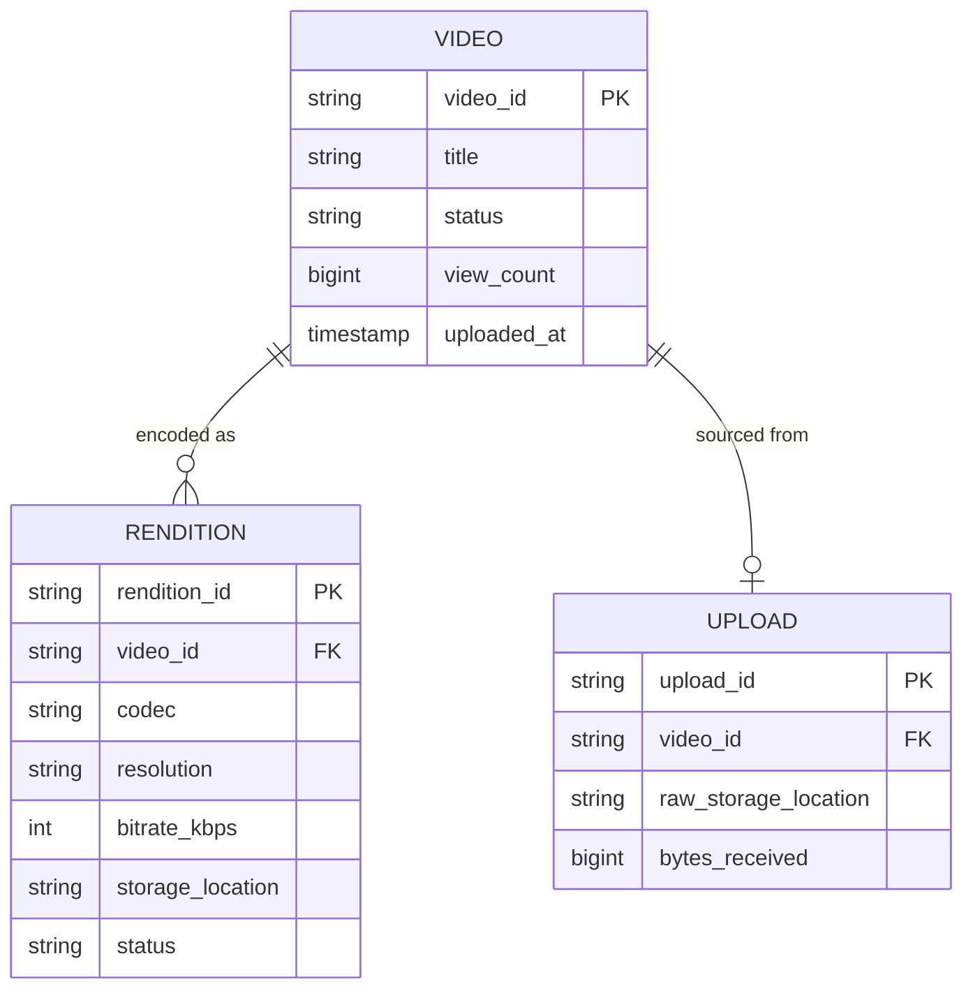
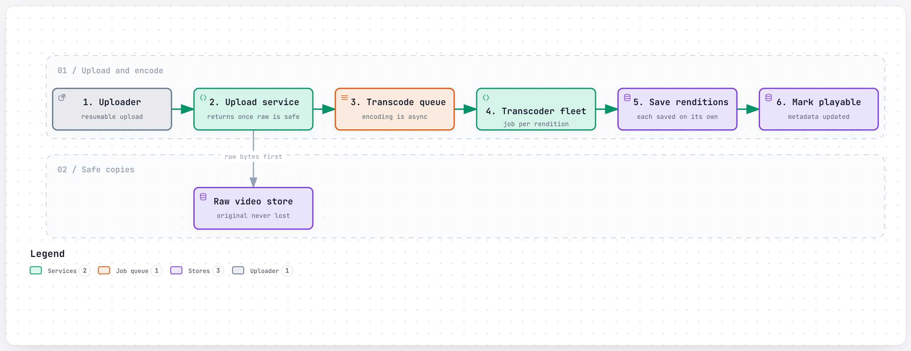
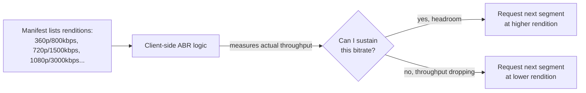

# Design a Video Streaming Service

> The interviewer is testing whether you understand that video streaming is really **two separate
> systems joined by a manifest file**: an offline pipeline that turns one uploaded file into many
> playable renditions (transcoding, fan-out, parallelism), and an online delivery system that has to
> get bytes to a device on an unpredictable network without the server ever knowing that device's
> exact conditions in advance. Candidates who only design the upload path, or only design playback,
> are missing half the question.

## 1. Clarify requirements

Questions worth asking:

- **On-demand (upload once, watch many times) or live streaming (near-real-time)?** These have very
  different latency tolerances — say which one you're designing, or note the difference.
- **How many renditions/qualities** does the product need to support, and across what range of devices
  (phone on 3G through a 4K TV on fiber)?
- Does the player need **adaptive bitrate switching mid-playback**, or is quality selected once at
  start?
- Is **encoding cost** (compute, not just storage) something to optimize, or is "encode everything at
  maximum quality in every codec" acceptable?
- Does the design need **global distribution**, or is this single-region?

**Functional requirements:**

- Upload a video; it becomes watchable in multiple qualities.
- Play back a video, adapting quality to the viewer's actual network conditions.
- Track basic metadata: title, view count, upload/processing status.

**Non-functional requirements:**

- **Playback must start quickly and never stall** — buffering is the single most visible failure mode
  in this product.
- **Upload durability**: the raw uploaded file must never be lost, even if every downstream processing
  step fails and has to retry.
- **Horizontal scalability of transcoding**, since encoding is by far the most compute-intensive step
  and volume grows continuously.
- **Global low-latency delivery** — the same video is watched from everywhere, and physics (speed of
  light) means "the origin server" can't be the thing every viewer talks to directly.

## 2. Back-of-the-envelope estimates

**Concurrent viewers — assumption:** 200 million daily active users, averaging 40 minutes of watch time
per day each.

- Total watch-minutes/day = 200,000,000 × 40 = **8,000,000,000 minutes/day**
- Average concurrent viewers = total watch-minutes / minutes in a day = 8,000,000,000 / 1,440 ≈
  **~5.56 million average concurrent streams**
- **Assumption:** 3x peak factor (evening peak) → peak ≈ **~16.7 million concurrent streams**

**Peak bandwidth — assumption:** average delivered bitrate of 5 Mbps (a mix of resolutions/qualities
across the whole viewer base).

- Peak bandwidth ≈ 16,700,000 streams × 5 Mbps ≈ **~83.5 Tbps** (terabits/sec) — a number far beyond
  what any single origin datacenter's network capacity can serve directly. This one number is the
  entire justification for a CDN-based design (see
  [6.2](#62-cdn-placement-fill-and-steering)) — this is not an optimization on top of the design, it's
  the reason the design looks the way it does.

**Upload/ingest — assumption:** 500,000 hours of new video uploaded per day, averaging 1.5 GB/hour of
raw uploaded footage.

- Raw ingest storage/day = 500,000 × 1.5 GB ≈ **~750 TB/day**
- **Assumption:** transcoding into ~6 renditions (144p through 4K) adds a combined encoded footprint of
  roughly 1.5x the raw ingest size (lower renditions are far smaller than the source, but there are
  several of them).
- Total new storage/day ≈ 750 TB × 1.5 ≈ **~1.125 PB/day**
- Storage/year ≈ 1.125 PB × 365 ≈ **~410 PB/year** (~0.4 exabytes/year) — this is the scale at which
  "how many codecs, and at what quality, do we actually encode every upload into" becomes a real,
  ongoing cost decision, not a one-time technical choice (see
  [6.1](#61-adaptive-bitrate-and-per-title-encoding)).

**Metadata QPS — assumption:** 5 billion video views/day platform-wide (a "view" here meaning a
metadata read plus an async view-count increment, not the whole streaming session).

- Average QPS = 5,000,000,000 / 86,400 ≈ **~57,870/sec**
- Peak QPS ≈ 57,870 × 3 ≈ **~173,600/sec**

This is the number that rules out a single relational database for video metadata — a single MySQL
instance is nowhere near this write throughput once view-count increments are included, which is why
real systems shard this tier explicitly (see [6.4](#64-sharding-video-metadata-at-this-write-volume)).

## 3. API design

```
POST /api/v1/videos
{ "title": "...", "expected_size_bytes": 2147483648 }

202 Accepted
{ "video_id": "v_88213", "upload_url": "https://upload.example.com/v_88213", "status": "uploading" }
```

```
// resumable chunked upload against the returned URL
PUT https://upload.example.com/v_88213
Content-Range: bytes 0-262143/2147483648
<chunk bytes>

308 Resume Incomplete   // server reports how many bytes it actually has, client resumes from there
```

```
GET /api/v1/videos/{video_id}

200 OK
{ "video_id": "v_88213", "title": "...", "status": "processing", "view_count": 0 }
```

```
GET /api/v1/videos/{video_id}/manifest

200 OK  (DASH/HLS manifest — conceptually:)
{
  "renditions": [
    { "codec": "h264", "resolution": "360p", "bitrate_kbps": 800, "segments_url": "..." },
    { "codec": "vp9",  "resolution": "1080p", "bitrate_kbps": 3000, "segments_url": "..." }
  ]
}
```

```
POST /api/v1/videos/{video_id}/views     // fire-and-forget, async counter increment
202 Accepted
```

Upload uses a **resumable protocol** (chunks the server can acknowledge partially, with `Content-Range`
reporting exactly how much it has) rather than a single monolithic `PUT` — a multi-gigabyte upload over
an unreliable connection that has to restart from byte zero on any drop is a real, common failure this
API is designed around, not an edge case.

## 4. Data model



**Why these keys:** `RENDITION` is its own row per (codec, resolution) pair, not a JSON blob on `VIDEO`,
because renditions finish transcoding **independently and at different times** — a 144p rendition is
cheap and finishes fast; a 4K/AV1 rendition is expensive and finishes much later — and the player needs
to query "which renditions exist right now," not wait for all of them. `VIDEO.status` flips to
"playable" once a *minimum viable set* of renditions exists, not once every rendition is done — the
whole reason transcoding is fanned out into independent per-rendition jobs (6.3) is so one slow,
expensive rendition never blocks the video from being watchable in lower quality sooner.
`VIEW_COUNT` is a denormalized counter on `VIDEO`, incremented asynchronously, rather than always
computed by counting raw view events — the number shown to users doesn't need to be perfectly real-time
(see [6.4](#64-sharding-video-metadata-at-this-write-volume)).

## 5. High-level design

<a href="https://alwintwk.github.io/big-tech-system-design/diagrams/problems-video-streaming-upload.html">
  <picture>
    <source media="(prefers-color-scheme: dark)" srcset="../diagrams/problems-video-streaming-upload.dark.png">
    
  </picture>
</a>


<sub>Click the diagram for the interactive version (zoom, dark mode, trace a path).</sub>

Walkthrough:

1. The uploader's file lands in **raw storage** first, before any processing begins — a transcoder
   crash must never lose the original source.
2. Transcoding is **queued, not synchronous** — the upload request returns immediately once the raw
   bytes are safely stored, and encoding happens asynchronously, fanned out into independent per-
   rendition jobs (6.3).
3. Each finished rendition is written to an **encoded rendition store** and its metadata row updated
   independently; once enough renditions exist, the video flips to playable.
4. On playback, a viewer's request goes to the **nearest CDN edge** first, not to origin — a cache hit
   serves the manifest and video segments entirely from the edge; only a **cache miss** reaches origin
   metadata and encoded storage at all (see [6.2](#62-cdn-placement-fill-and-steering)).
5. The **metadata store** is sharded (6.4) precisely because view-count increments and video-metadata
   reads together far exceed what a single database can sustain at this volume.

## 6. Deep dives

### 6.1 Adaptive bitrate and per-title encoding

Two related ideas, often confused:

- **Adaptive bitrate (ABR)** is a *client-side* mechanism: the player downloads a manifest listing every
  available (codec, resolution, bitrate) rendition, requests short video segments one at a time, and
  switches renditions between segments based on measured bandwidth — all decision-making happens on the
  client, so the server and every CDN cache in front of it stay completely stateless about which
  quality any particular viewer is currently watching.
- **Per-title (or per-shot) encoding** is a *server-side* optimization: instead of one universal bitrate
  ladder applied to every video regardless of content, analyze each title's (or even each individual
  shot's) visual complexity and tune its own bitrate ladder — a static talking-head interview doesn't
  need the same bitrate as a fast-motion action scene, and a one-size-fits-all ladder has to be
  conservative enough for the *most* complex content in the catalog, wasting bits on everything simpler.



### 6.2 CDN: placement, fill, and steering

Given the ~83.5 Tbps peak bandwidth estimate above, serving every viewer directly from origin is not an
option — delivery has to happen from many points close to viewers, not one place far from all of them.
This breaks into three continuously-running, largely independent jobs:

- **Forecast and place** — predict which content a given region's viewers are likely to want, and
  decide which edge locations should hold it.
- **Fill** — push that content out to the right edge locations ahead of demand, typically during
  off-peak windows.
- **Steer and serve** — at request time, rank which edge locations can currently serve *this* specific
  viewer well, and route them there.

The general shape (predict placement ahead of time, distribute during low-traffic windows, then route
live traffic to the best current option) generalizes well beyond video — see
[`../concepts/cdn.md`](../concepts/cdn.md).

### 6.3 Transcode fan-out: one upload, many independent jobs

Transcoding a whole video serially — one codec, one resolution at a time, start to finish — is both
slow (nothing is watchable until it's entirely done) and wasteful (a failure partway through loses all
prior work in that serial chain). The fix is to treat each (codec, resolution) rendition as an
**independent unit of work**, dispatched to a shared worker fleet:

```text
# illustrative pseudocode — reference design, not any specific company's real code
for rendition in [ (h264, 144p), (h264, 360p), (vp9, 720p), (vp9, 1080p), (av1, 1080p), (av1, 4k) ]:
    enqueue_transcode_job(video_id, rendition)   # independent, can run on any free worker

# workers pull tasks independently; a slow 4K/AV1 job never blocks 144p finishing first
```

This is what lets a video become watchable in low quality within minutes, while its most expensive
rendition (4K/AV1) is still processing in the background — the product only needs *a* playable
rendition to exist, not *every* rendition, before flipping to public.

### 6.4 Sharding video metadata at this write volume

At ~173,600 peak QPS (our estimate), a single relational database instance for video metadata and view
counts is not viable. The realistic answer is the same one used for any high-write-volume relational
workload: shard by `video_id` across many database instances, with a routing layer in front that knows
which shard a given `video_id` lives on — the same
[sharding](../concepts/sharding.md) technique used throughout this repo, applied here specifically
because view-count increments (a write on essentially every playback) are a much higher-volume
operation than most people initially assume when scoping this problem.

## 7. Bottlenecks and failure modes

- **Transcode backlog delaying availability.** A traffic spike in uploads (a viral moment, a platform
  event) can queue more transcode jobs than the fleet can process immediately — mitigated by
  prioritizing cheap, fast renditions (144p/360p) ahead of expensive ones (4K/AV1) so *something*
  becomes watchable quickly even under backlog.
- **CDN cache-miss storm on a newly popular video.** A video that suddenly goes viral has no
  pre-warmed edge cache anywhere — the "fill" step in 6.2 is inherently reactive to unpredictable
  demand, and the origin needs to survive a burst of simultaneous cache misses for the same content
  until edges catch up.
- **Live streaming has a much tighter latency budget** than on-demand — if the product needs live, the
  encode-to-delivery pipeline can't rely on the same "queue it and get to it eventually" model that
  on-demand transcoding uses; every stage has a hard deadline instead.
- **A hot metadata row** — a single extremely popular video's view-count increments all land on the
  same shard, same row. Mitigated the same way any hot-key problem is: batching increments instead of
  one write per view, or a probabilistic/approximate counter that doesn't need every single increment
  to be individually durable.
- **Storage cost growth is unbounded by default** — every additional codec or resolution supported
  multiplies encoded storage per video; this is a genuine, ongoing cost trade-off (worth naming
  explicitly), not just a one-time technical decision.
- **Origin overload if CDN cache-hit rate drops** — anything that degrades edge cache effectiveness
  (a config change, a bad deploy invalidating caches) turns "mostly edge-served" traffic back into
  "mostly origin-served" traffic overnight, at a scale origin was never sized to sustain.

## 8. How real companies did it

- **Netflix analyzes and encodes per-title, and later per-shot**, rather than applying one universal
  bitrate ladder to the whole catalog — a pipeline of shot detection, per-shot convex-hull bitrate/
  quality search (using Netflix's own VMAF quality metric), ladder assembly per shot, and fully
  parallel encoding, since shots don't depend on each other. A one-hour episode at an average ~4-second
  shot length works out to roughly 900 separately-optimized shots. See
  [Netflix: per-title and shot-based encoding](../companies/netflix.md#signature-component-1-per-title-and-shot-based-encoding).
- **Netflix built Open Connect**, its own CDN of physical appliances given free to ISPs to rack inside
  their own networks, running the same forecast/fill/steer split described in
  [6.2](#62-cdn-placement-fill-and-steering) — built specifically because third-party CDN vendors were
  both expensive at Netflix's volume and gave Netflix no control over the network path that most
  affects viewer experience. See
  [Netflix: Open Connect](../companies/netflix.md#open-connect-placement-fill-and-steering).
- **YouTube's upload-to-playable pipeline** matches the fan-out design in 6.3 directly: raw bytes land
  in durable storage first, transcoding is queued rather than synchronous, and the video flips to
  public only once enough renditions exist — not once every rendition is done. See
  [YouTube: upload to playable](../companies/youtube.md#1-core-flow-upload-to-playable).
- **YouTube's adaptive bitrate delivery** re-encodes every upload into multiple codecs (H.264 for broad
  compatibility, VP9 as a more efficient default, AV1 for further gains at greater encode cost) and
  serves them via DASH (DASH and the per-codec split are unverified; YouTube has confirmed only that VP9
  costs ~5x H.264 to encode and that AV1 compresses better than VP9 at higher compute), with all
  adaptation logic running client-side so the server and CDN caches stay stateless about any individual
  viewer's current quality — matching 6.1 directly. See
  [YouTube: adaptive bitrate delivery](../companies/youtube.md#adaptive-bitrate-delivery-codecs-dash-and-the-client-side-abr-loop).

Relevant concepts: [CDN](../concepts/cdn.md), [sharding](../concepts/sharding.md),
[message queues and logs](../concepts/message-queues-and-logs.md),
[load balancing](../concepts/load-balancing.md).

## 9. What a strong answer sounds like

- This problem splits cleanly into an offline pipeline (upload to playable) and an online delivery
  system (playback), and I'd design both, not just one.
- At an assumed 200M DAU averaging 40 minutes/day, peak concurrent streams run into the tens of
  millions, and peak bandwidth (assuming 5 Mbps average) reaches roughly 83 Tbps — a number that alone
  rules out serving every viewer from one origin location, and is the entire justification for a CDN.
- Transcoding should fan out into independent per-(codec, resolution) jobs on a shared worker fleet,
  not run as one serial pipeline per video — this is what lets a video become watchable in low quality
  minutes after upload, while expensive renditions like 4K/AV1 finish in the background.
- Adaptive bitrate is a client-side decision, not a server one — the player picks quality per segment
  based on measured throughput, which keeps the server and CDN layer completely stateless about any
  viewer's current quality.
- Per-title or per-shot encoding is worth mentioning as an optimization once the basic ABR pipeline is
  established — a static one-size-fits-all bitrate ladder wastes bits on simple content to stay safe
  for complex content.
- Video metadata (especially view-count increments) needs to be sharded well before a single database
  becomes the bottleneck — at an assumed 5B views/day, peak metadata QPS alone is in the hundreds of
  thousands.
- CDN cache-miss storms on newly viral content are a real, expected failure mode, not a corner case —
  I'd design origin to survive a burst of simultaneous misses for the same hot content.
- Storage growth from supporting more codecs/resolutions is an ongoing cost trade-off worth naming
  explicitly, not something to gloss over.

## Common mistakes

- Designing only the upload/transcode side, or only the playback/CDN side, and treating the other half
  as out of scope without saying so explicitly.
- Transcoding a whole video serially through every rendition instead of fanning renditions out as
  independent parallel jobs — this both slows time-to-watchable and means one failure loses all prior
  serial work.
- Putting adaptive bitrate logic on the server (tracking per-viewer state) instead of the client, which
  breaks CDN cache statelessness.
- Assuming a single relational database is fine for video metadata without doing the view-count QPS
  math that shows otherwise.
- Not distinguishing live from on-demand streaming when the interviewer's intent is ambiguous — these
  have fundamentally different latency budgets and pipeline designs.
- Forgetting that upload itself needs to be resumable — a dropped connection restarting a multi-
  gigabyte upload from byte zero is a real, frequent failure, not an edge case.
- Ignoring encoding cost as a real, ongoing trade-off — proposing "just encode every video into every
  codec at max quality" without acknowledging the storage and compute cost that implies at scale.
